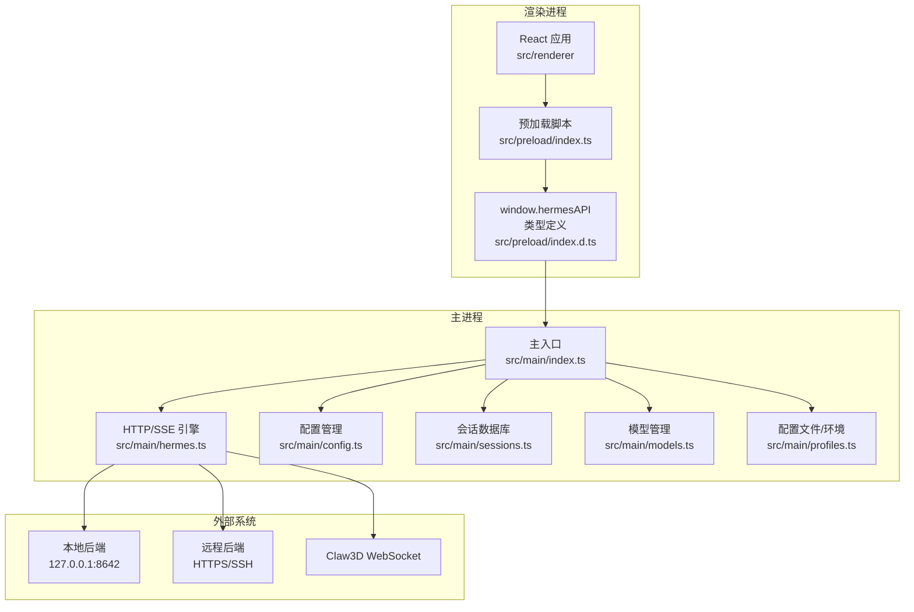
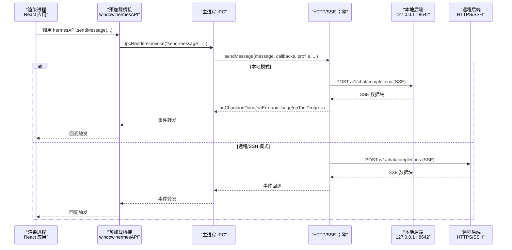
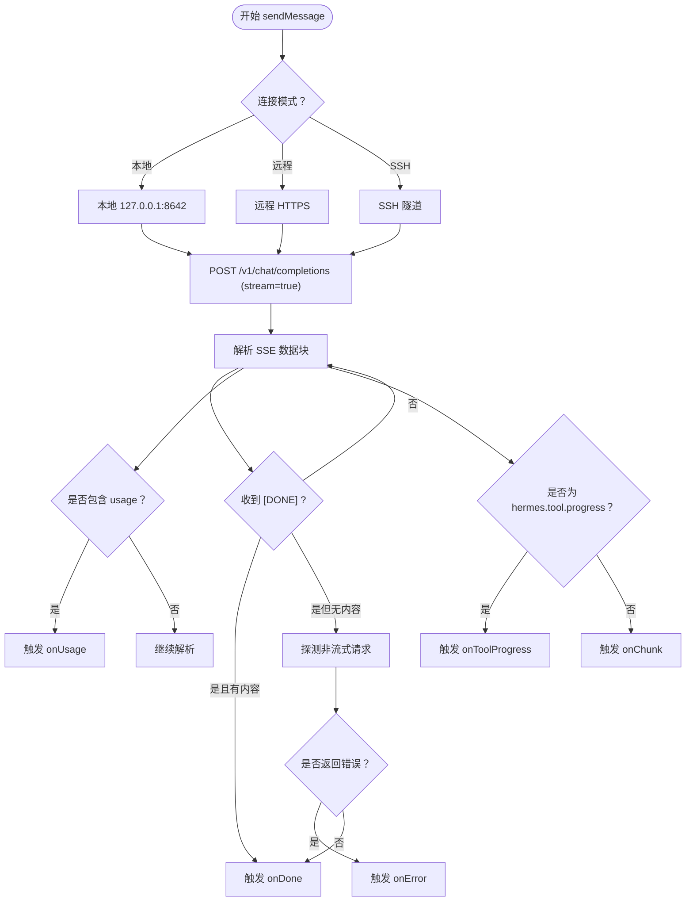
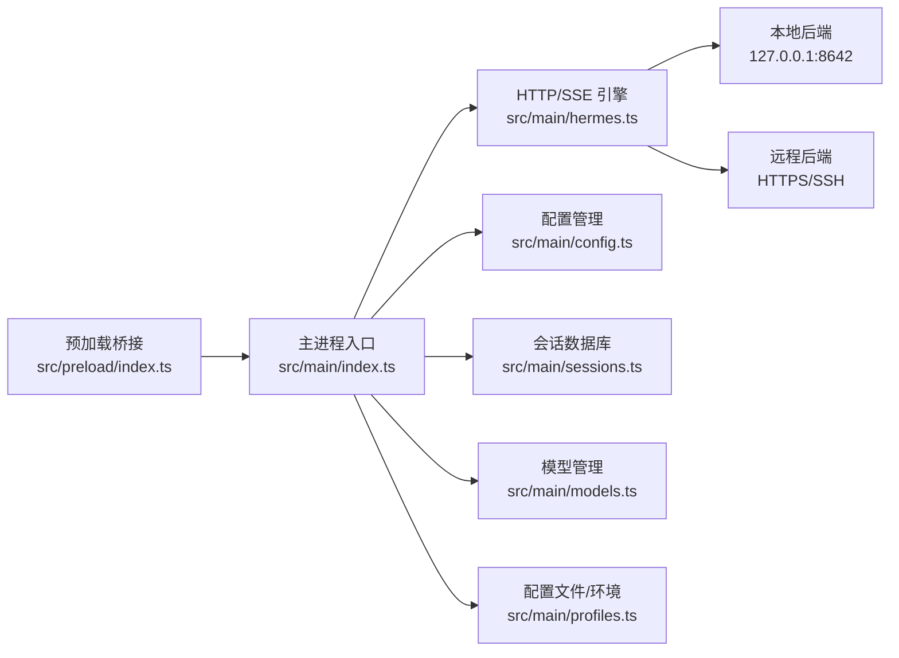

# API参考

<cite>
**本文档引用的文件**
- [src/preload/index.ts](file://src/preload/index.ts)
- [src/preload/index.d.ts](file://src/preload/index.d.ts)
- [src/main/index.ts](file://src/main/index.ts)
- [src/main/hermes.ts](file://src/main/hermes.ts)
- [src/main/config.ts](file://src/main/config.ts)
- [src/main/sessions.ts](file://src/main/sessions.ts)
- [src/main/models.ts](file://src/main/models.ts)
- [src/main/profiles.ts](file://src/main/profiles.ts)
- [src/shared/i18n/index.ts](file://src/shared/i18n/index.ts)
- [src/shared/i18n/types.ts](file://src/shared/i18n/types.ts)
- [package.json](file://package.json)
- [README.md](file://README.md)
</cite>

## 目录
1. [简介](#简介)
2. [项目结构](#项目结构)
3. [核心组件](#核心组件)
4. [架构总览](#架构总览)
5. [详细组件分析](#详细组件分析)
6. [依赖关系分析](#依赖关系分析)
7. [性能考量](#性能考量)
8. [故障排除指南](#故障排除指南)
9. [结论](#结论)
10. [附录](#附录)

## 简介
本文件为 Hermes Desktop 的完整 API 参考文档，覆盖以下三类接口：
- 预加载脚本暴露的 window.hermesAPI 对象（渲染进程到主进程的 IPC 桥接）
- 主进程内部的 HTTP API（本地或远程后端）与 SSE 流式响应
- WebSocket API（Claw3D 办公室界面相关）

文档详细说明每个 API 的参数、返回值、错误处理、事件回调、兼容性与迁移注意事项，并提供面向第三方开发者与插件开发者的集成指导。

## 项目结构
Hermes Desktop 采用 Electron 架构，主要目录与职责如下：
- src/preload：通过 contextBridge 暴露安全的 window.hermesAPI 到渲染进程
- src/main：Electron 主进程，注册 IPC 处理器、管理 HTTP/SSH 连接、会话数据库等
- src/renderer：React 应用（此处不展开前端细节）
- src/shared：共享模块（国际化等）
- 资源与构建：package.json、electron-vite 配置、打包资源等

图表来源
- [src/preload/index.ts:1-701](file://src/preload/index.ts#L1-L701)
- [src/preload/index.d.ts:1-479](file://src/preload/index.d.ts#L1-L479)
- [src/main/index.ts:1-1234](file://src/main/index.ts#L1-L1234)
- [src/main/hermes.ts:1-887](file://src/main/hermes.ts#L1-L887)
- [src/main/config.ts:1-440](file://src/main/config.ts#L1-L440)
- [src/main/sessions.ts:1-212](file://src/main/sessions.ts#L1-L212)
- [src/main/models.ts:1-169](file://src/main/models.ts#L1-L169)
- [src/main/profiles.ts:1-284](file://src/main/profiles.ts#L1-L284)

章节来源
- [README.md:120-132](file://README.md#L120-L132)
- [package.json:1-70](file://package.json#L1-L70)

## 核心组件
本节概述三大核心组件及其职责：
- window.hermesAPI（预加载桥接）：将主进程能力以类型安全的方式暴露给渲染进程
- 主进程 IPC 处理器：接收渲染进程请求，调用后端服务（HTTP/SSH/本地进程），并回传结果与事件
- HTTP/SSE 引擎：封装本地/远程后端访问、SSE 解析、流式回调与错误探测

章节来源
- [src/preload/index.ts:15-701](file://src/preload/index.ts#L15-L701)
- [src/preload/index.d.ts:29-471](file://src/preload/index.d.ts#L29-L471)
- [src/main/index.ts:290-1005](file://src/main/index.ts#L290-L1005)
- [src/main/hermes.ts:168-434](file://src/main/hermes.ts#L168-L434)

## 架构总览
下图展示从渲染进程到主进程再到后端的整体调用链路，以及 SSH 隧道与远程模式的特殊路径。

图表来源
- [src/preload/index.ts:159-171](file://src/preload/index.ts#L159-L171)
- [src/main/index.ts:546-640](file://src/main/index.ts#L546-L640)
- [src/main/hermes.ts:168-434](file://src/main/hermes.ts#L168-L434)

## 详细组件分析

### 预加载桥接 API（window.hermesAPI）
预加载脚本通过 contextBridge.exposeInMainWorld 将 hermesAPI 暴露到渲染进程，同时提供类型声明文件确保类型安全。该 API 分为多个功能域：安装与更新、本地引擎信息、连接模式、聊天、网关、平台开关、会话、配置与环境、内存、Soul、工具集、技能、会话缓存、凭证池、模型、Claw3D、更新、菜单事件、定时任务、Shell、备份导入、调试转储、内存提供者、MCP 服务器、日志查看等。

- 安装与更新
  - checkInstall(): Promise<{ installed: boolean; configured: boolean; hasApiKey: boolean }>
  - verifyInstall(): Promise<boolean>
  - startInstall(): Promise<{ success: boolean; error?: string }>
  - onInstallProgress(callback): () => void
  - getHermesVersion()/refreshHermesVersion(): Promise<string|null>
  - runHermesDoctor(): Promise<string>
  - runHermesUpdate(): Promise<{ success: boolean; error?: string }>
  - checkOpenClaw()/runClawMigrate(): Promise<{ found: boolean; path: string|null }>

- 本地引擎信息
  - getHermesVersion()/refreshHermesVersion(): Promise<string|null>
  - runHermesDoctor(): Promise<string>
  - runHermesUpdate(): Promise<{ success: boolean; error?: string }>

- 语言与本地化
  - getLocale(): Promise<AppLocale>
  - setLocale(locale: AppLocale): Promise<AppLocale>

- 配置与环境（支持 profile）
  - getEnv(profile?: string): Promise<Record<string,string>>
  - setEnv(key: string, value: string, profile?: string): Promise<boolean>
  - getConfig(key: string, profile?: string): Promise<string|null>
  - setConfig(key: string, value: string, profile?: string): Promise<boolean>
  - getHermesHome(profile?: string): Promise<string>
  - getModelConfig(profile?: string): Promise<{provider:string,model:string,baseUrl:string}>
  - setModelConfig(provider: string, model: string, baseUrl: string, profile?: string): Promise<boolean>

- 连接模式（本地/远程/SSH）
  - isRemoteMode()/isRemoteOnlyMode(): Promise<boolean>
  - getConnectionConfig(): Promise<{mode,remoteUrl,apiKey,ssh:{host,port,username,keyPath,remotePort,localPort}}>
  - setConnectionConfig(mode, remoteUrl, apiKey?): Promise<boolean>
  - setSshConfig(host,port,username,keyPath,remotePort,localPort): Promise<boolean>
  - testRemoteConnection(url: string, apiKey?: string): Promise<boolean>
  - testSshConnection(host,port,username,keyPath,remotePort): Promise<boolean>
  - isSshTunnelActive(): Promise<boolean>
  - startSshTunnel(): Promise<boolean>
  - stopSshTunnel(): Promise<boolean>

- 聊天（消息发送、中止、事件回调）
  - sendMessage(message, profile?, resumeSessionId?, history?): Promise<{response:string,sessionId?:string}>
  - abortChat(): Promise<void>
  - onChatChunk(callback): () => void
  - onChatDone(callback): () => void
  - onChatToolProgress(callback): () => void
  - onChatUsage(callback): () => void
  - onChatError(callback): () => void

- 网关
  - startGateway(): Promise<boolean>
  - stopGateway(): Promise<boolean>
  - gatewayStatus(): Promise<boolean>

- 平台开关（config.yaml 中的 platforms）
  - getPlatformEnabled(profile?): Promise<Record<string,boolean>>
  - setPlatformEnabled(platform: string, enabled: boolean, profile?): Promise<boolean>

- 会话
  - listSessions(limit?, offset?): Promise<SessionSummary[]>
  - getSessionMessages(sessionId: string): Promise<SessionMessage[]>

- 配置文件/环境（profile）
  - listProfiles(): Promise<ProfileInfo[]>
  - createProfile(name: string, clone: boolean): Promise<{success:boolean,error?:string}>
  - deleteProfile(name: string): Promise<{success:boolean,error?:string}>
  - setActiveProfile(name: string): Promise<boolean>

- 内存
  - readMemory(profile?): Promise<{memory,user,stats}>
  - addMemoryEntry(content: string, profile?): Promise<{success:boolean,error?:string}>
  - updateMemoryEntry(index: number, content: string, profile?): Promise<{success:boolean,error?:string}>
  - removeMemoryEntry(index: number, profile?): Promise<boolean>
  - writeUserProfile(content: string, profile?): Promise<{success:boolean,error?:string}>

- Soul
  - readSoul(profile?): Promise<string>
  - writeSoul(content: string, profile?): Promise<boolean>
  - resetSoul(profile?): Promise<string>

- 工具集
  - getToolsets(profile?): Promise<Array<{key,label,description,enabled}>>]
  - setToolsetEnabled(key: string, enabled: boolean, profile?): Promise<boolean>

- 技能
  - listInstalledSkills(profile?): Promise<Array<{name,category,description,path}>>]
  - listBundledSkills(): Promise<Array<{name,description,category,source,installed}>>]
  - getSkillContent(skillPath: string): Promise<string>
  - installSkill(identifier: string, profile?): Promise<{success:boolean,error?:string}>
  - uninstallSkill(name: string, profile?): Promise<{success:boolean,error?:string}>

- 会话缓存（快速本地缓存，含自动生成标题）
  - listCachedSessions(limit?, offset?): Promise<SessionSummary[]>
  - syncSessionCache(): Promise<SessionSummary[]>
  - updateSessionTitle(sessionId: string, title: string): Promise<void>
  - deleteSession(sessionId: string): Promise<boolean>

- 会话搜索
  - searchSessions(query: string, limit?): Promise<SearchResult[]>

- 凭证池
  - getCredentialPool(): Promise<Record<string,Array<{key,label}>>>>
  - setCredentialPool(provider: string, entries: Array<{key,label}>): Promise<boolean>

- 模型
  - listModels(): Promise<Array<{id,name,provider,model,baseUrl,createdAt}>>>
  - addModel(name: string, provider: string, model: string, baseUrl: string): Promise<SavedModel>
  - removeModel(id: string): Promise<boolean>
  - updateModel(id: string, fields: Record<string,string>): Promise<boolean>

- Claw3D（可视化办公室）
  - claw3dStatus(): Promise<Claw3dStatus>
  - claw3dSetup(): Promise<{success:boolean,error?:string}>
  - onClaw3dSetupProgress(callback): () => void
  - claw3dGetPort()/claw3dSetPort(port: number): Promise<boolean>
  - claw3dGetWsUrl()/claw3dSetWsUrl(url: string): Promise<boolean>
  - claw3dStartAll()/claw3dStopAll(): Promise<boolean>
  - claw3dGetLogs(): Promise<string>
  - claw3dStartDev()/claw3dStopDev(): Promise<boolean>
  - claw3dStartAdapter()/claw3dStopAdapter(): Promise<boolean>

- 更新
  - checkForUpdates(): Promise<string|null>
  - downloadUpdate(): Promise<boolean>
  - installUpdate(): Promise<void>
  - getAppVersion(): Promise<string>
  - onUpdateAvailable(callback): () => void
  - onUpdateDownloadProgress(callback): () => void
  - onUpdateDownloaded(callback): () => void

- 菜单事件（来自原生菜单栏）
  - onMenuNewChat(callback): () => void
  - onMenuSearchSessions(callback): () => void

- 定时任务（Cron Jobs）
  - listCronJobs(includeDisabled?, profile?): Promise<CronJob[]>
  - createCronJob(schedule: string, prompt?, name?, deliver?, profile?): Promise<{success:boolean,error?:string}>
  - removeCronJob(jobId: string, profile?): Promise<{success:boolean,error?:string}>
  - pauseCronJob(jobId: string, profile?): Promise<{success:boolean,error?:string}>
  - resumeCronJob(jobId: string, profile?): Promise<{success:boolean,error?:string}>
  - triggerCronJob(jobId: string, profile?): Promise<{success:boolean,error?:string}>

- Shell
  - openExternal(url: string): Promise<void>

- 备份/导入
  - runHermesBackup(profile?): Promise<{success:boolean,path?,error?:string}>
  - runHermesImport(archivePath: string, profile?): Promise<{success:boolean,error?:string}>

- 调试转储
  - runHermesDump(): Promise<string>

- 内存提供者发现
  - discoverMemoryProviders(profile?): Promise<Array<{name,description,installed,active,envVars}>>>

- MCP 服务器
  - listMcpServers(profile?): Promise<Array<{name,type,enabled,detail}>>>

- 日志查看
  - readLogs(logFile?, lines?): Promise<{content:string,path:string}>

章节来源
- [src/preload/index.ts:15-701](file://src/preload/index.ts#L15-L701)
- [src/preload/index.d.ts:29-471](file://src/preload/index.d.ts#L29-L471)

### 主进程 IPC 处理器
主进程在 src/main/index.ts 中集中注册了所有 IPC 处理器，将 window.hermesAPI 的调用映射到具体的功能模块。关键点：
- 所有处理器均通过 ipcMain.handle 注册，避免 invoke 错误
- 支持 SSH 远程模式：当 mode=ssh 时，调用对应的 ssh-* 方法（如 sshStartGateway、sshReadEnv 等）
- 聊天流程：首次发送消息时自动启动网关（本地模式），并在需要时确保 SSH 隧道健康；将 SSE 事件转发给渲染进程
- 更新机制：electron-updater 在生产环境启用，开发环境禁用

章节来源
- [src/main/index.ts:290-1005](file://src/main/index.ts#L290-L1005)
- [src/main/index.ts:1111-1174](file://src/main/index.ts#L1111-L1174)

### HTTP API 与 SSE 引擎
Hermes Desktop 的 HTTP API 由 src/main/hermes.ts 实现，负责：
- 自动选择本地 127.0.0.1:8642 或远程/SSH 后端
- 发送消息时构建标准 OpenAI 风格的 messages 数组
- 解析 SSE 数据块，识别 hermes.tool.progress 自定义事件
- 当流为空时进行非流式探测以揭示真实错误
- 提供 onChunk/onDone/onError/onToolProgress/onUsage 回调
- 健康检查与自动重启逻辑（本地模式）

图表来源
- [src/main/hermes.ts:168-434](file://src/main/hermes.ts#L168-L434)

章节来源
- [src/main/hermes.ts:20-62](file://src/main/hermes.ts#L20-L62)
- [src/main/hermes.ts:168-434](file://src/main/hermes.ts#L168-L434)

### 配置与环境管理
- 连接配置：支持 local/remote/ssh 三种模式，SSH 包含主机、端口、用户名、密钥路径、远端/本地端口等
- 环境变量：按 profile 读取 .env 文件，支持键名校验与缓存（5 秒 TTL）
- 模型配置：读取 config.yaml 中的 provider/default/base_url，并写入修改
- 平台开关：在 platforms: 下启用/禁用特定平台（如 telegram/discord/slack 等）
- 凭证池：auth.json 中的 credential_pool 字段，按 provider 维度存储多组凭据

章节来源
- [src/main/config.ts:47-74](file://src/main/config.ts#L47-L74)
- [src/main/config.ts:101-132](file://src/main/config.ts#L101-L132)
- [src/main/config.ts:215-246](file://src/main/config.ts#L215-L246)
- [src/main/config.ts:317-335](file://src/main/config.ts#L317-L335)
- [src/main/config.ts:421-426](file://src/main/config.ts#L421-L426)

### 会话与数据库
- 会话列表：基于 SQLite 数据库 sessions 表，支持分页
- 会话搜索：基于 FTS5 全文检索，返回 snippet 片段
- 会话消息：查询 user/assistant 角色的消息，按时间戳排序
- 删除会话：事务删除对应 session_id 的 messages 与 sessions 记录

章节来源
- [src/main/sessions.ts:46-89](file://src/main/sessions.ts#L46-L89)
- [src/main/sessions.ts:91-156](file://src/main/sessions.ts#L91-L156)
- [src/main/sessions.ts:158-186](file://src/main/sessions.ts#L158-L186)
- [src/main/sessions.ts:188-212](file://src/main/sessions.ts#L188-L212)

### 模型管理
- 保存模型：models.json 存储 id/name/provider/model/baseUrl/apiMode/createdAt
- 默认模型：首次运行时根据 DEFAULT_MODELS 生成并写入
- 自定义提供商：从 config.yaml 的 custom_providers 段落解析，必要时写入 .env 中的 API Key

章节来源
- [src/main/models.ts:10-31](file://src/main/models.ts#L10-L31)
- [src/main/models.ts:116-121](file://src/main/models.ts#L116-L121)
- [src/main/models.ts:123-148](file://src/main/models.ts#L123-L148)
- [src/main/models.ts:150-169](file://src/main/models.ts#L150-L169)

### 配置文件/环境（Profiles）
- 列出配置文件：默认配置位于 HERMES_HOME，命名配置位于 HERMES_HOME/profiles/<name>
- 创建/删除配置文件：通过 hermes CLI 执行 profile create/delete
- 激活配置文件：设置 active_profile 文件

章节来源
- [src/main/profiles.ts:111-193](file://src/main/profiles.ts#L111-L193)
- [src/main/profiles.ts:195-227](file://src/main/profiles.ts#L195-L227)
- [src/main/profiles.ts:229-261](file://src/main/profiles.ts#L229-L261)
- [src/main/profiles.ts:263-284](file://src/main/profiles.ts#L263-L284)

### 国际化（i18n）
- 支持语言：en、es、id、pt-BR、zh-CN
- 资源组织：按语言拆分的翻译树，支持回退与动态切换
- 类型定义：AppLocale 与 TranslationTree

章节来源
- [src/shared/i18n/types.ts:1-6](file://src/shared/i18n/types.ts#L1-L6)
- [src/shared/i18n/index.ts:110-231](file://src/shared/i18n/index.ts#L110-L231)
- [src/shared/i18n/index.ts:259-267](file://src/shared/i18n/index.ts#L259-L267)

## 依赖关系分析

图表来源
- [src/preload/index.ts:1-701](file://src/preload/index.ts#L1-L701)
- [src/main/index.ts:1-1234](file://src/main/index.ts#L1-L1234)
- [src/main/hermes.ts:1-887](file://src/main/hermes.ts#L1-L887)
- [src/main/config.ts:1-440](file://src/main/config.ts#L1-L440)
- [src/main/sessions.ts:1-212](file://src/main/sessions.ts#L1-L212)
- [src/main/models.ts:1-169](file://src/main/models.ts#L1-L169)
- [src/main/profiles.ts:1-284](file://src/main/profiles.ts#L1-L284)

章节来源
- [src/main/index.ts:13-172](file://src/main/index.ts#L13-L172)

## 性能考量
- SSE 流式传输：实时增量渲染，降低首字节延迟
- 健康检查与缓存：本地模式下对 API server 可用性进行缓存与轮询，减少不必要的网络开销
- SSH 隧道：仅在 SSH 模式下建立隧道，远程模式直接访问 HTTPS
- 会话搜索：使用 SQLite FTS5 全文索引，提升查询性能
- 环境变量缓存：按 profile 缓存 5 秒，避免频繁磁盘读取

## 故障排除指南
- SSH 隧道未就绪
  - 现象：远程模式下无法访问后端
  - 排查：检查 isSshTunnelActive()/isSshTunnelHealthy()，确认已执行 startSshTunnel()
  - 参考：[src/main/index.ts:524-542](file://src/main/index.ts#L524-L542)，[src/main/hermes.ts:64-69](file://src/main/hermes.ts#L64-L69)
- API 请求超时
  - 现象：sendMessage 返回超时错误
  - 排查：检查网络连通性、SSH 隧道状态、远程后端可用性
  - 参考：[src/main/hermes.ts:421-424](file://src/main/hermes.ts#L421-L424)
- 流为空但无错误
  - 现象：onDone 触发但 response 为空
  - 处理：引擎会自动发起非流式探测以揭示真实错误
  - 参考：[src/main/hermes.ts:289-291](file://src/main/hermes.ts#L289-L291)，[src/main/hermes.ts:218-266](file://src/main/hermes.ts#L218-L266)
- 环境变量写入失败
  - 现象：setEnvValue 抛出异常
  - 排查：键名需满足正则 /^[A-Za-z_][A-Za-z0-9_]*$/，值必须为单行字符串
  - 参考：[src/main/config.ts:169-179](file://src/main/config.ts#L169-L179)
- 会话搜索无结果
  - 现象：searchSessions 返回空数组
  - 排查：确认 messages_fts 表存在且已建立索引
  - 参考：[src/main/sessions.ts:96-104](file://src/main/sessions.ts#L96-L104)

章节来源
- [src/main/hermes.ts:421-424](file://src/main/hermes.ts#L421-L424)
- [src/main/hermes.ts:218-266](file://src/main/hermes.ts#L218-L266)
- [src/main/config.ts:169-179](file://src/main/config.ts#L169-L179)
- [src/main/sessions.ts:96-104](file://src/main/sessions.ts#L96-L104)

## 结论
Hermes Desktop 的 API 设计遵循“预加载桥接 + 主进程 IPC + 后端服务”的清晰分层，既保证了安全性（contextIsolation），又提供了强大的功能扩展能力。通过统一的 window.hermesAPI，第三方开发者与插件可以无缝对接聊天、会话、配置、模型、技能、定时任务等核心能力；同时，HTTP/SSE 引擎与 SSH 隧道支持使得本地与远程部署场景均可获得一致的体验。

## 附录

### API 版本兼容性与废弃说明
- 版本号：当前应用版本为 0.4.0（见 package.json）
- 兼容性策略：预加载 API 与主进程 IPC 保持向后兼容；新增功能以可选参数形式提供
- 废弃功能：暂无明确废弃项；SSH 远程模式下的部分 API（如 sshGetHermesVersion 等）在主进程已做兼容处理

章节来源
- [package.json:2-4](file://package.json#L2-L4)
- [src/main/index.ts:310-351](file://src/main/index.ts#L310-L351)

### 使用示例与最佳实践
- 聊天集成
  - 步骤：注册 onChatChunk/onChatDone/onChatError 回调 → 调用 sendMessage → 必要时调用 abortChat
  - 参考：[src/preload/index.ts:159-171](file://src/preload/index.ts#L159-L171)，[src/main/index.ts:546-640](file://src/main/index.ts#L546-L640)
- 远程模式配置
  - 设置 setConnectionConfig(mode="remote", remoteUrl, apiKey?) 或 setSshConfig(...)，随后调用 startSshTunnel()
  - 参考：[src/main/index.ts:479-542](file://src/main/index.ts#L479-L542)，[src/main/config.ts:47-74](file://src/main/config.ts#L47-L74)
- 模型管理
  - 使用 addModel/removeModel/updateModel 管理 SavedModel；必要时通过 setModelConfig 应用到活动配置
  - 参考：[src/main/models.ts:123-169](file://src/main/models.ts#L123-L169)，[src/main/config.ts:248-301](file://src/main/config.ts#L248-L301)
- 会话搜索
  - 使用 searchSessions(query, limit?) 获取带 snippet 的结果
  - 参考：[src/main/sessions.ts:91-156](file://src/main/sessions.ts#L91-L156)

章节来源
- [src/preload/index.ts:159-171](file://src/preload/index.ts#L159-L171)
- [src/main/index.ts:479-542](file://src/main/index.ts#L479-L542)
- [src/main/models.ts:123-169](file://src/main/models.ts#L123-L169)
- [src/main/sessions.ts:91-156](file://src/main/sessions.ts#L91-L156)