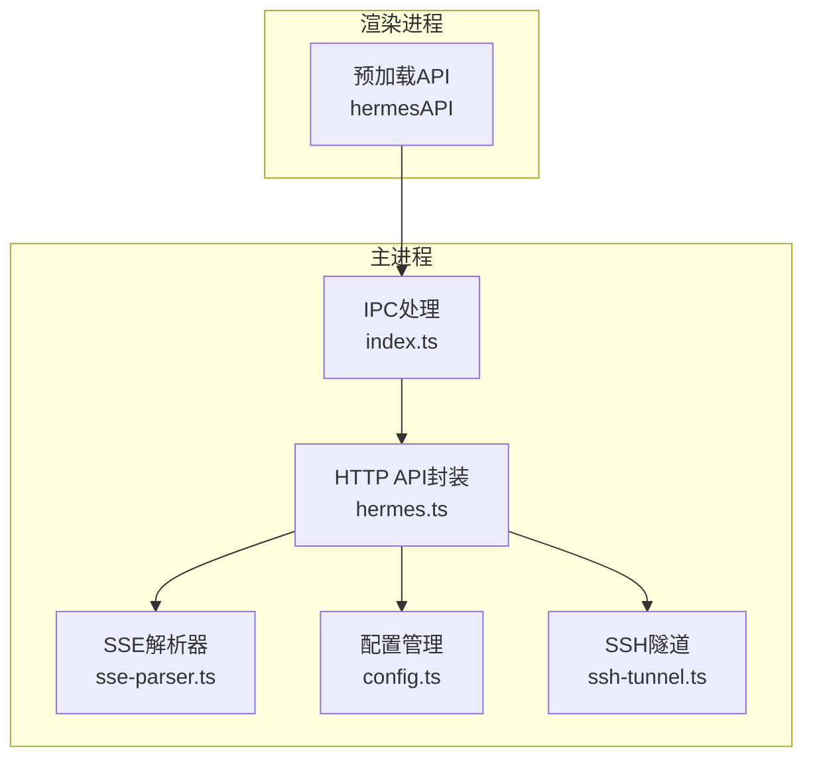
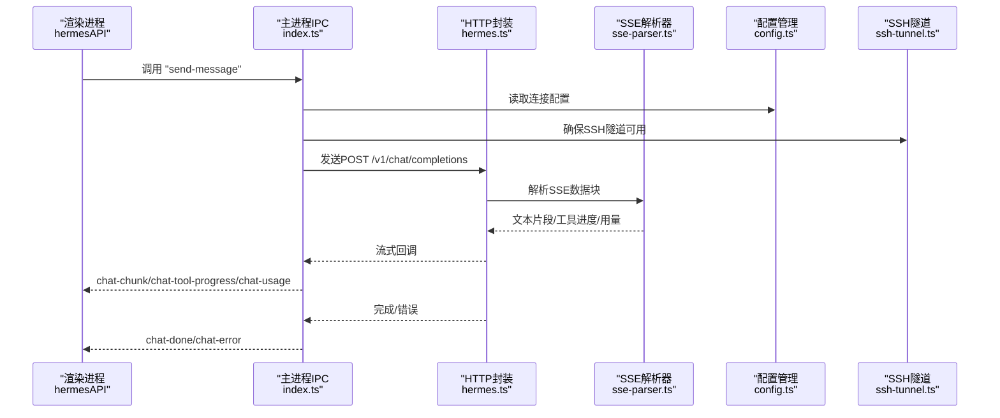
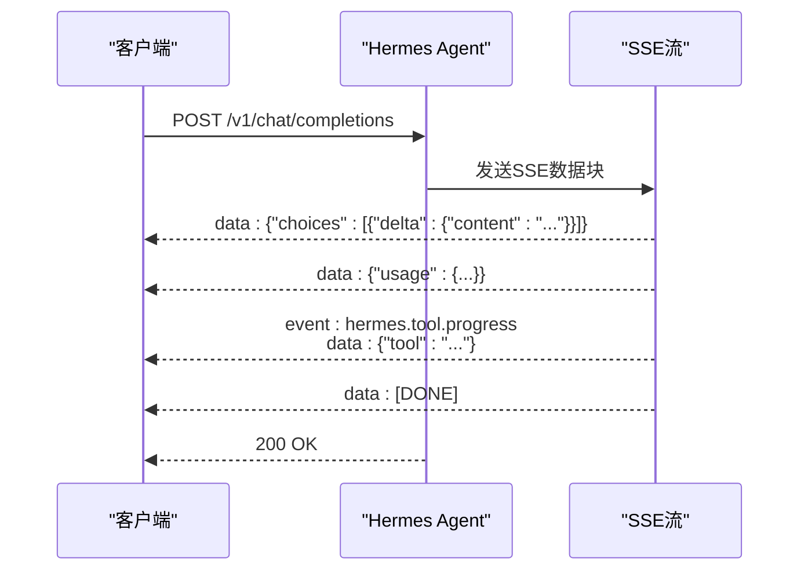
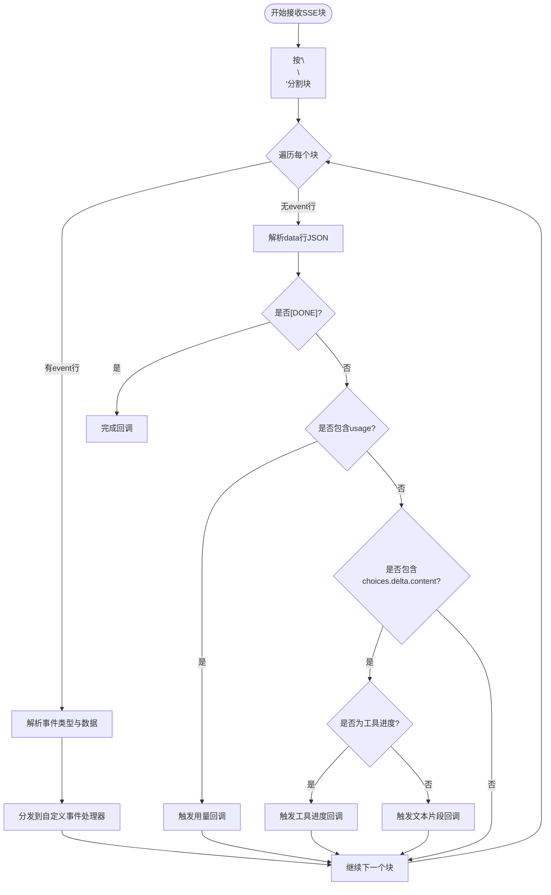
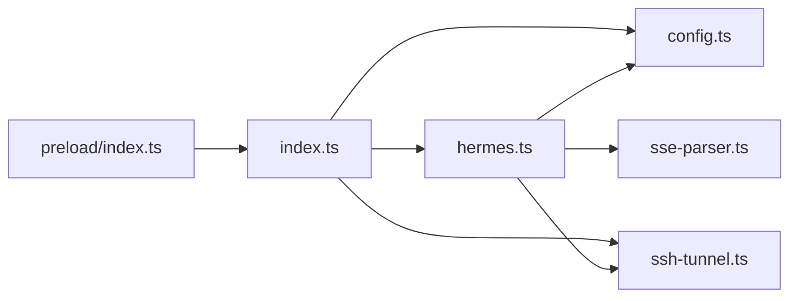

# HTTP API接口

<cite>
**本文引用的文件**
- [hermes.ts](file://src/main/hermes.ts)
- [sse-parser.ts](file://src/main/sse-parser.ts)
- [index.ts](file://src/main/index.ts)
- [config.ts](file://src/main/config.ts)
- [ssh-tunnel.ts](file://src/main/ssh-tunnel.ts)
- [index.ts](file://src/preload/index.ts)
- [sse-parser.test.ts](file://tests/sse-parser.test.ts)
</cite>

## 目录
1. [简介](#简介)
2. [项目结构](#项目结构)
3. [核心组件](#核心组件)
4. [架构总览](#架构总览)
5. [详细组件分析](#详细组件分析)
6. [依赖关系分析](#依赖关系分析)
7. [性能考量](#性能考量)
8. [故障排除指南](#故障排除指南)
9. [结论](#结论)
10. [附录](#附录)

## 简介
本文件面向Hermes Desktop的HTTP API接口，聚焦于与Hermes Agent通信的HTTP接口，覆盖远程连接模式下的API端点、认证机制、请求格式与响应结构。文档同时阐述HTTP SSE流式传输协议、WebSocket连接处理、错误码定义与重试机制，并为每个API端点提供详细的URL模式、HTTP方法、请求头、请求体格式与响应示例。此外，还包含安全考虑、性能优化与故障排除指南，帮助开发者与运维人员正确集成与维护该接口。

## 项目结构
Hermes Desktop通过Electron主进程封装HTTP API调用，渲染进程通过预加载脚本暴露统一的API接口。核心HTTP交互由主进程中的hermes模块负责，支持本地、远程与SSH隧道三种连接模式；SSE解析逻辑独立为可测试模块；配置管理与SSH隧道控制分别在config与ssh-tunnel模块中实现。

图表来源
- [index.ts:544-640](file://src/main/index.ts#L544-L640)
- [hermes.ts:168-434](file://src/main/hermes.ts#L168-L434)
- [sse-parser.ts:1-131](file://src/main/sse-parser.ts#L1-L131)
- [config.ts:47-74](file://src/main/config.ts#L47-L74)
- [ssh-tunnel.ts:21-63](file://src/main/ssh-tunnel.ts#L21-L63)

章节来源
- [index.ts:544-640](file://src/main/index.ts#L544-L640)
- [hermes.ts:168-434](file://src/main/hermes.ts#L168-L434)
- [config.ts:47-74](file://src/main/config.ts#L47-L74)
- [ssh-tunnel.ts:21-63](file://src/main/ssh-tunnel.ts#L21-L63)

## 核心组件
- HTTP API封装：负责构建请求、发送请求、解析SSE、处理错误与超时。
- SSE解析器：独立的SSE块解析与事件分发逻辑，便于单元测试。
- 配置管理：读取连接模式（local/remote/ssh）、远程地址与API密钥等。
- SSH隧道：在SSH模式下建立本地到远端的隧道，确保HTTP访问。
- 预加载API：向渲染进程暴露统一的调用入口，内部通过IPC转发至主进程。

章节来源
- [hermes.ts:168-434](file://src/main/hermes.ts#L168-L434)
- [sse-parser.ts:1-131](file://src/main/sse-parser.ts#L1-L131)
- [config.ts:47-74](file://src/main/config.ts#L47-L74)
- [ssh-tunnel.ts:21-63](file://src/main/ssh-tunnel.ts#L21-L63)
- [index.ts:158-228](file://src/preload/index.ts#L158-L228)

## 架构总览
Hermes Desktop在本地或远程运行Hermes Agent网关，桌面应用通过HTTP与Agent通信。当处于SSH模式时，桌面应用先建立SSH隧道，再通过本地回环地址访问Agent；在远程模式下，直接使用用户提供的远程地址。所有HTTP请求均采用SSE流式返回，支持工具进度事件与用量统计。

图表来源
- [index.ts:544-640](file://src/main/index.ts#L544-L640)
- [hermes.ts:168-434](file://src/main/hermes.ts#L168-L434)
- [sse-parser.ts:58-110](file://src/main/sse-parser.ts#L58-L110)
- [config.ts:47-74](file://src/main/config.ts#L47-L74)
- [ssh-tunnel.ts:120-153](file://src/main/ssh-tunnel.ts#L120-L153)

## 详细组件分析

### HTTP API端点与交互流程
- 端点：/v1/chat/completions
- 方法：POST
- 功能：发起对话请求，返回SSE流式响应，包含文本片段、工具进度事件与用量统计。
- 认证：根据连接模式自动添加Authorization头（Bearer Token）。
- 请求体：JSON对象，包含模型、消息数组与流式标志。
- 响应：SSE数据块，包含choices.delta.content与usage信息，以及自定义事件hermes.tool.progress。

图表来源
- [hermes.ts:190-266](file://src/main/hermes.ts#L190-L266)
- [hermes.ts:335-434](file://src/main/hermes.ts#L335-L434)
- [sse-parser.ts:58-110](file://src/main/sse-parser.ts#L58-L110)

章节来源
- [hermes.ts:190-266](file://src/main/hermes.ts#L190-L266)
- [hermes.ts:335-434](file://src/main/hermes.ts#L335-L434)
- [sse-parser.ts:58-110](file://src/main/sse-parser.ts#L58-L110)

### 认证机制
- 连接模式：
  - SSH模式：从远端读取API密钥缓存，生成Bearer Token。
  - 远程模式：使用用户配置的API密钥生成Bearer Token。
  - 本地模式：不附加认证头。
- 自动注入：在发送HTTP请求前，根据当前连接模式自动设置Authorization头。

章节来源
- [hermes.ts:52-62](file://src/main/hermes.ts#L52-L62)
- [hermes.ts:196-199](file://src/main/hermes.ts#L196-L199)
- [hermes.ts:231-234](file://src/main/hermes.ts#L231-L234)

### 请求格式
- Content-Type: application/json
- Body字段：
  - model: 模型标识符（默认hermes-agent）
  - messages: 数组，每项包含role与content
  - stream: true（启用SSE流）
- 历史会话：可选，用于延续对话上下文。

章节来源
- [hermes.ts:190-194](file://src/main/hermes.ts#L190-L194)
- [hermes.ts:178-188](file://src/main/hermes.ts#L178-L188)

### 响应结构
- 成功响应：
  - SSE数据块：choices.delta.content为文本片段
  - usage：包含prompt_tokens、completion_tokens、total_tokens及可选cost、rate_limit_remaining、rate_limit_reset
  - 自定义事件：hermes.tool.progress携带工具进度信息
  - 结束信号：data: [DONE]
- 错误响应：
  - HTTP状态非200时，读取响应体中的error.message或回退提示
  - SSE中可能包含error字段，会被捕获并上报

章节来源
- [hermes.ts:354-364](file://src/main/hermes.ts#L354-L364)
- [hermes.ts:307-316](file://src/main/hermes.ts#L307-L316)
- [hermes.ts:297-301](file://src/main/hermes.ts#L297-L301)
- [sse-parser.test.ts:147-171](file://tests/sse-parser.test.ts#L147-L171)

### SSE流式传输协议
- 数据块解析：按“event:”与“data:”行拆分，支持自定义事件类型
- 文本片段：从choices.delta.content提取
- 工具进度：自定义事件hermes.tool.progress，兼容旧版内联模式
- 用量统计：usage字段在SSE中随流推送
- 结束条件：收到[DONE]或连接结束

图表来源
- [hermes.ts:369-387](file://src/main/hermes.ts#L369-L387)
- [hermes.ts:268-280](file://src/main/hermes.ts#L268-L280)
- [hermes.ts:282-333](file://src/main/hermes.ts#L282-L333)
- [sse-parser.ts:116-130](file://src/main/sse-parser.ts#L116-L130)
- [sse-parser.ts:58-110](file://src/main/sse-parser.ts#L58-L110)

章节来源
- [hermes.ts:369-387](file://src/main/hermes.ts#L369-L387)
- [hermes.ts:268-280](file://src/main/hermes.ts#L268-L280)
- [hermes.ts:282-333](file://src/main/hermes.ts#L282-L333)
- [sse-parser.ts:116-130](file://src/main/sse-parser.ts#L116-L130)
- [sse-parser.ts:58-110](file://src/main/sse-parser.ts#L58-L110)

### WebSocket连接处理
- 当前实现仅使用HTTP+SSERequests进行流式通信，未发现WebSocket专用端点或处理逻辑。
- 若未来需要WebSocket，建议复用现有认证与连接配置模块，保持一致的鉴权与错误处理策略。

章节来源
- [hermes.ts:168-434](file://src/main/hermes.ts#L168-L434)

### 错误码定义与重试机制
- HTTP状态码：
  - 200：成功，SSE流正常
  - 非200：读取响应体中的error.message或回退提示
- SSE错误：
  - SSE中error字段被捕获并上报
- 超时与异常：
  - 请求超时：120秒
  - 健康检查超时：1500毫秒
  - SSH隧道健康检查：3000毫秒
- 重试策略：
  - 未实现自动重试；建议在上层业务中基于错误类型与状态码实现指数退避重试

章节来源
- [hermes.ts:102-121](file://src/main/hermes.ts#L102-L121)
- [hermes.ts:354-364](file://src/main/hermes.ts#L354-L364)
- [hermes.ts:421-424](file://src/main/hermes.ts#L421-L424)
- [ssh-tunnel.ts:30-48](file://src/main/ssh-tunnel.ts#L30-L48)

### 预加载API与IPC桥接
- 渲染进程通过预加载脚本暴露hermesAPI，内部通过IPC调用主进程的处理函数
- 关键事件：
  - chat-chunk：文本片段
  - chat-tool-progress：工具进度
  - chat-usage：用量统计
  - chat-done：完成
  - chat-error：错误

章节来源
- [index.ts:158-228](file://src/preload/index.ts#L158-L228)
- [index.ts:544-640](file://src/main/index.ts#L544-L640)

## 依赖关系分析
- hermes.ts依赖：
  - config.ts：读取连接配置与API密钥
  - ssh-tunnel.ts：在SSH模式下确保隧道可用
  - sse-parser.ts：SSE解析与事件分发
- index.ts依赖：
  - hermes.ts：HTTP API封装
  - config.ts：配置读写
  - ssh-tunnel.ts：SSH隧道控制
- 预加载API依赖：
  - index.ts：IPC处理

图表来源
- [hermes.ts:15-18](file://src/main/hermes.ts#L15-L18)
- [index.ts:31-50](file://src/main/index.ts#L31-L50)
- [index.ts:544-640](file://src/main/index.ts#L544-L640)
- [index.ts:1-3](file://src/preload/index.ts#L1-L3)

章节来源
- [hermes.ts:15-18](file://src/main/hermes.ts#L15-L18)
- [index.ts:31-50](file://src/main/index.ts#L31-L50)
- [index.ts:544-640](file://src/main/index.ts#L544-L640)
- [index.ts:1-3](file://src/preload/index.ts#L1-L3)

## 性能考量
- 流式传输：SSE减少首字节延迟，提升用户体验
- 缓存策略：配置读取与模型配置具备内存缓存（TTL 5秒），降低频繁读取开销
- 健康检查：主进程定期轮询API服务器健康状态，避免不必要的失败重试
- SSH隧道：隧道端口选择与健康检查确保低延迟连接

章节来源
- [config.ts:77-99](file://src/main/config.ts#L77-L99)
- [hermes.ts:694-704](file://src/main/hermes.ts#L694-L704)
- [ssh-tunnel.ts:65-80](file://src/main/ssh-tunnel.ts#L65-L80)
- [ssh-tunnel.ts:50-57](file://src/main/ssh-tunnel.ts#L50-L57)

## 故障排除指南
- 连接失败：
  - 检查连接模式与远程地址配置
  - 使用testRemoteConnection验证远程可达性
- SSH隧道问题：
  - 确认隧道端口开放与健康检查通过
  - 使用testSshConnection进行连通性测试
- 认证失败：
  - 确认API密钥已正确配置
  - SSH模式下确认远端API密钥已缓存
- 超时与断流：
  - 检查网络稳定性与代理设置
  - 观察SSE流是否提前结束或出现[DONE]但无内容
- 错误排查：
  - 查看IPC事件chat-error获取详细错误信息
  - 使用readLogs查看应用日志

章节来源
- [hermes.ts:854-878](file://src/main/hermes.ts#L854-L878)
- [ssh-tunnel.ts:169-219](file://src/main/ssh-tunnel.ts#L169-L219)
- [index.ts:513-522](file://src/main/index.ts#L513-L522)
- [index.ts:223-228](file://src/preload/index.ts#L223-L228)

## 结论
Hermes Desktop通过统一的HTTP API封装与SSE流式传输，实现了与Hermes Agent的高效通信。其设计支持本地、远程与SSH三种连接模式，并在认证、错误处理与性能方面提供了良好的基础。建议在上层业务中结合错误码与状态码实现稳健的重试与降级策略，以进一步提升可靠性。

## 附录

### API端点清单与规范
- 端点：/v1/chat/completions
  - 方法：POST
  - 认证：根据连接模式自动添加Authorization头
  - 请求头：
    - Content-Type: application/json
    - Authorization: Bearer <token>（按需）
  - 请求体：
    - model: 字符串
    - messages: 数组，每项含role与content
    - stream: true
  - 响应：
    - SSE数据块：choices.delta.content为文本片段
    - 自定义事件：hermes.tool.progress
    - 用量：usage字段
    - 结束：data: [DONE]

章节来源
- [hermes.ts:190-266](file://src/main/hermes.ts#L190-L266)
- [hermes.ts:335-434](file://src/main/hermes.ts#L335-L434)
- [hermes.ts:268-280](file://src/main/hermes.ts#L268-L280)
- [hermes.ts:307-316](file://src/main/hermes.ts#L307-L316)

### 安全考虑
- 传输加密：HTTPS优先，必要时通过SSH隧道
- 凭证管理：API密钥通过配置模块集中管理，避免硬编码
- 权限最小化：仅在SSH模式下缓存远端API密钥，避免长期持久化
- 输入校验：环境变量名与值遵循严格规则，防止注入

章节来源
- [config.ts:169-179](file://src/main/config.ts#L169-L179)
- [config.ts:134-167](file://src/main/config.ts#L134-L167)