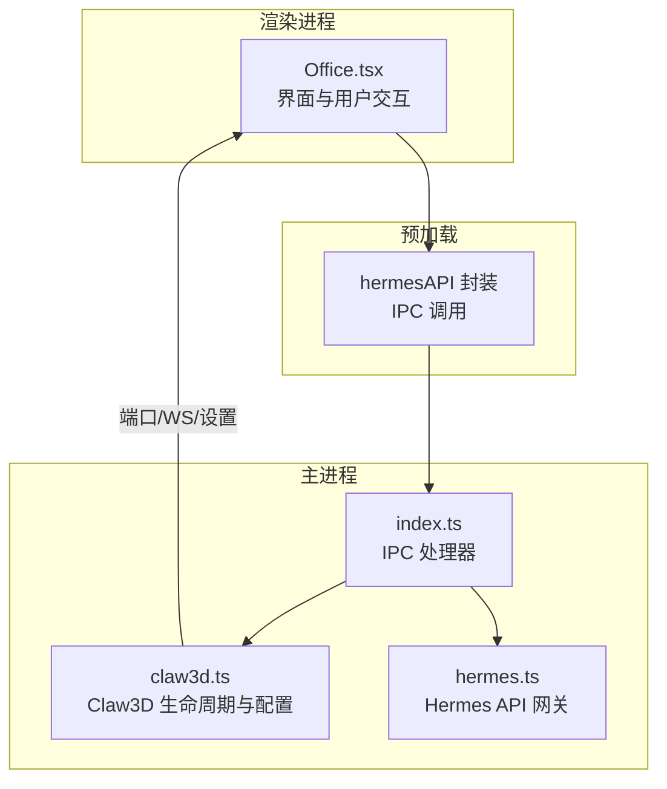
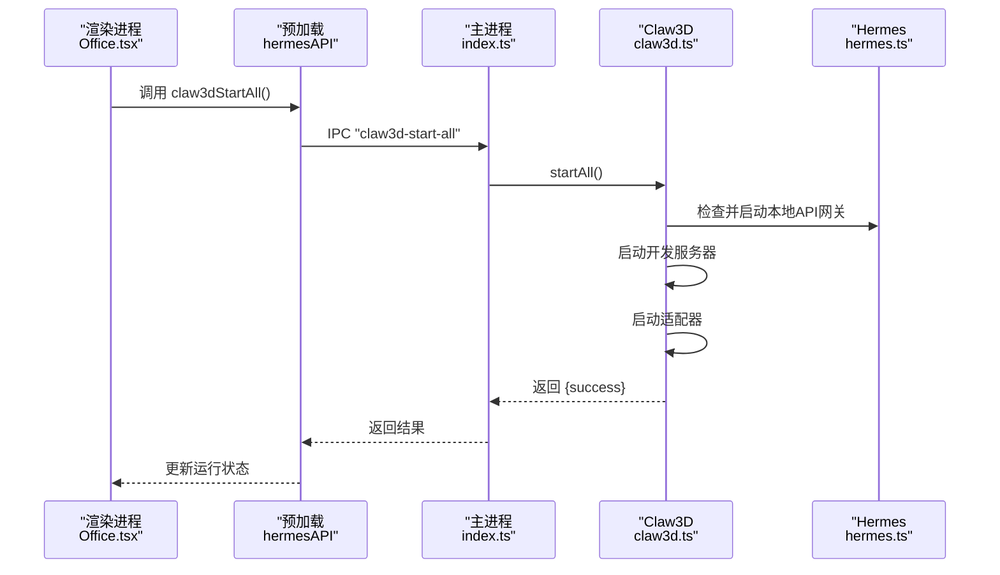
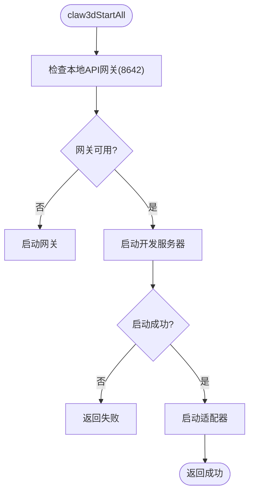
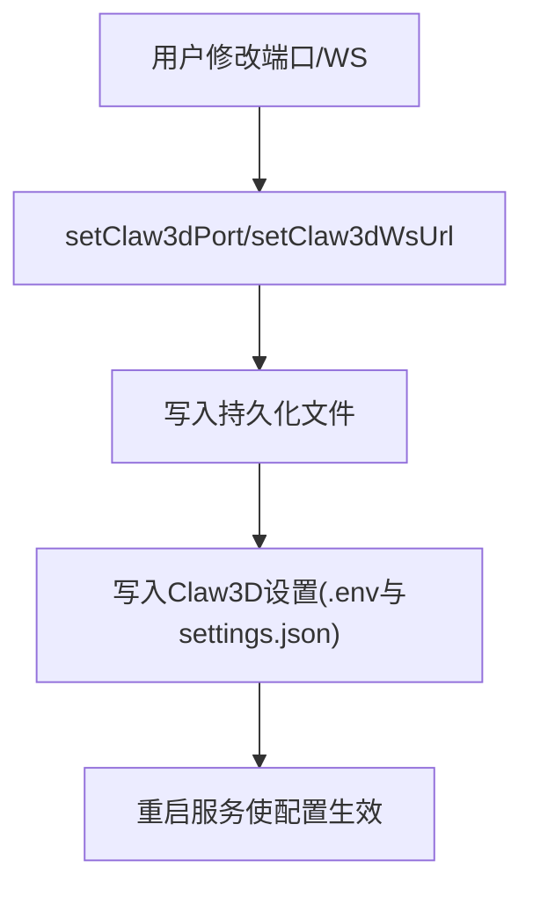
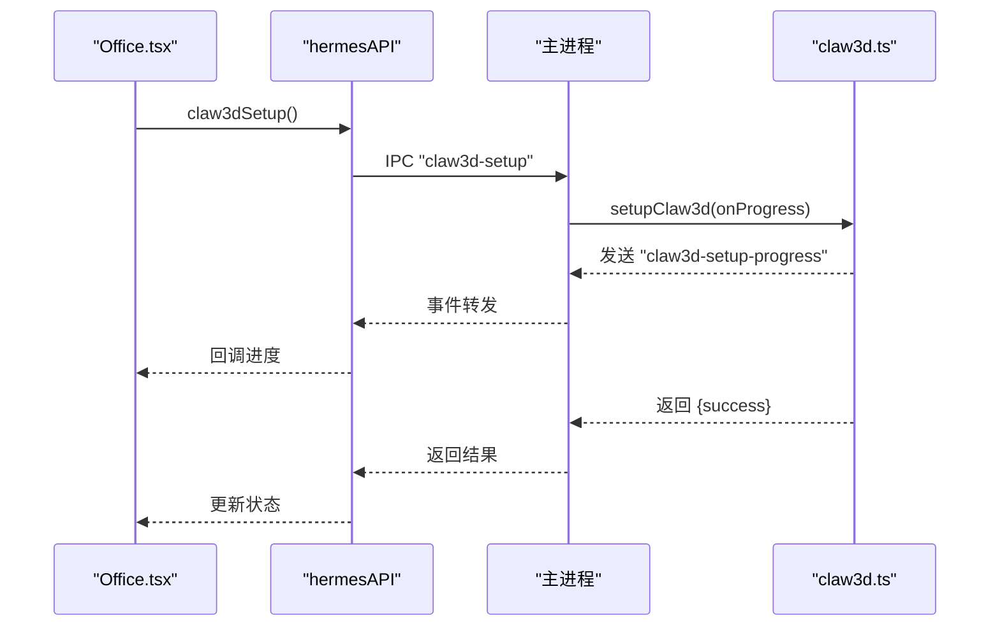
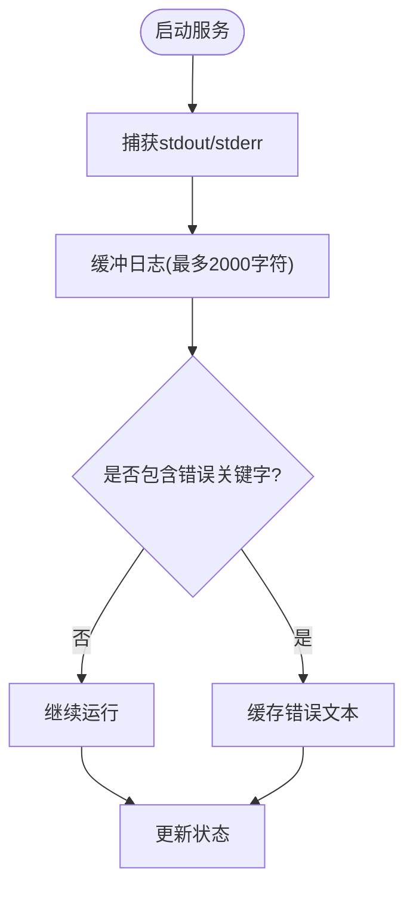
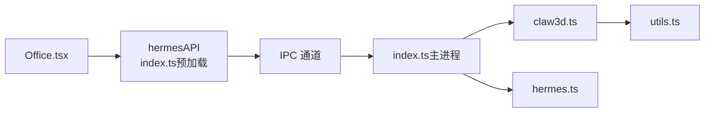

# 3D办公室API

<cite>
**本文档引用的文件**
- [claw3d.ts](file://src/main/claw3d.ts)
- [index.ts（主进程）](file://src/main/index.ts)
- [index.ts（预加载）](file://src/preload/index.ts)
- [Office.tsx](file://src/renderer/src/screens/Office/Office.tsx)
- [index.d.ts](file://src/preload/index.d.ts)
- [claw3d-command-resolution.test.ts](file://tests/claw3d-command-resolution.test.ts)
- [hermes.ts](file://src/main/hermes.ts)
- [utils.ts](file://src/main/utils.ts)
</cite>

## 目录
1. [简介](#简介)
2. [项目结构](#项目结构)
3. [核心组件](#核心组件)
4. [架构总览](#架构总览)
5. [详细组件分析](#详细组件分析)
6. [依赖关系分析](#依赖关系分析)
7. [性能考虑](#性能考虑)
8. [故障排查指南](#故障排查指南)
9. [结论](#结论)
10. [附录](#附录)

## 简介
本文件系统性地记录了3D办公室（Claw3D）在桌面应用中的管理接口与运行机制，包括：
- 状态查询与控制：claw3dStatus、claw3dStartAll、claw3dStopAll
- 配置管理：claw3dGetPort、claw3dSetPort、claw3dGetWsUrl、claw3dSetWsUrl
- 日志与进度：claw3dGetLogs、onClaw3dSetupProgress
- 启动流程与端口管理、WebSocket连接、配置参数、状态监控与日志管理
- 性能优化、资源管理与故障恢复策略

## 项目结构
3D办公室功能由三部分协作完成：
- 主进程（Electron）：负责子进程管理、文件系统操作、端口检测、配置持久化
- 预加载脚本：暴露hermesAPI给渲染进程，封装IPC调用
- 渲染进程（React）：提供UI交互、状态轮询、日志展示与设置面板

图表来源
- [Office.tsx:1-489](file://src/renderer/src/screens/Office/Office.tsx#L1-L489)
- [index.ts（预加载）:470-531](file://src/preload/index.ts#L470-L531)
- [index.ts（主进程）:891-932](file://src/main/index.ts#L891-L932)
- [claw3d.ts:136-170](file://src/main/claw3d.ts#L136-L170)
- [hermes.ts:20-33](file://src/main/hermes.ts#L20-L33)

章节来源
- [Office.tsx:1-489](file://src/renderer/src/screens/Office/Office.tsx#L1-L489)
- [index.ts（预加载）:470-531](file://src/preload/index.ts#L470-L531)
- [index.ts（主进程）:891-932](file://src/main/index.ts#L891-L932)
- [claw3d.ts:136-170](file://src/main/claw3d.ts#L136-L170)
- [hermes.ts:20-33](file://src/main/hermes.ts#L20-L33)

## 核心组件
- 状态模型（Claw3dStatus）
  - 字段：cloned、installed、devServerRunning、adapterRunning、running、port、portInUse、wsUrl、error
  - 用途：统一描述Claw3D仓库状态、服务运行状态、端口占用与错误信息
- 进度模型（Claw3dSetupProgress）
  - 字段：step、totalSteps、title、detail、log
  - 用途：安装过程的步骤与日志流式传输
- 关键接口
  - 状态查询：claw3dStatus
  - 安装：claw3dSetup（配合onClaw3dSetupProgress）
  - 启停：claw3dStartAll、claw3dStopAll
  - 端口与WS：claw3dGetPort、claw3dSetPort、claw3dGetWsUrl、claw3dSetWsUrl
  - 日志：claw3dGetLogs
  - 子服务启停：claw3dStartDev、claw3dStopDev、claw3dStartAdapter、claw3dStopAdapter

章节来源
- [claw3d.ts:250-268](file://src/main/claw3d.ts#L250-L268)
- [claw3d.ts:262-268](file://src/main/claw3d.ts#L262-L268)
- [index.ts（预加载）:470-531](file://src/preload/index.ts#L470-L531)
- [index.ts（主进程）:891-932](file://src/main/index.ts#L891-L932)

## 架构总览
3D办公室的运行链路如下：
- 渲染进程通过hermesAPI发起IPC请求
- 主进程根据请求分发到claw3d.ts或hermes.ts执行具体逻辑
- claw3d.ts负责：
  - 仓库克隆与依赖安装
  - 开发服务器与适配器进程管理
  - 端口与WebSocket URL配置写入
  - 日志采集与错误缓存
- hermes.ts负责：
  - 获取Hermes API网关地址
  - 确保本地API网关可用（必要时启动）

图表来源
- [Office.tsx:160-182](file://src/renderer/src/screens/Office/Office.tsx#L160-L182)
- [index.ts（预加载）:520-523](file://src/preload/index.ts#L520-L523)
- [index.ts（主进程）:916](file://src/main/index.ts#L916)
- [claw3d.ts:837-873](file://src/main/claw3d.ts#L837-L873)
- [hermes.ts:20-33](file://src/main/hermes.ts#L20-L33)

## 详细组件分析

### 状态查询与控制
- claw3dStatus
  - 功能：返回仓库状态、安装状态、服务运行状态、端口占用、WebSocket URL与错误信息
  - 实现要点：检查PID文件、进程存在性、端口占用；清理过期错误
- claw3dStartAll / claw3dStopAll
  - StartAll：确保本地API网关可用后，依次启动开发服务器与适配器
  - StopAll：停止开发服务器与适配器，并清空错误缓存

图表来源
- [claw3d.ts:837-873](file://src/main/claw3d.ts#L837-L873)
- [hermes.ts:20-33](file://src/main/hermes.ts#L20-L33)

章节来源
- [claw3d.ts:319-341](file://src/main/claw3d.ts#L319-L341)
- [claw3d.ts:837-880](file://src/main/claw3d.ts#L837-L880)
- [index.ts（主进程）:892](file://src/main/index.ts#L892)
- [index.ts（主进程）:916-920](file://src/main/index.ts#L916-L920)

### 端口管理与WebSocket连接
- 端口
  - 默认端口：3000
  - 保存位置：~/.hermes/claw3d-port
  - 读取与设置：getClaw3dPort/setClaw3dPort
- WebSocket URL
  - 默认值：ws://localhost:18789
  - 保存位置：~/.hermes/claw3d-ws-url
  - 写入Claw3D设置：~/.openclaw/claw3d/settings.json 与 .env
- 端口占用检测：通过TCP连接127.0.0.1:port进行快速探测

图表来源
- [claw3d.ts:136-170](file://src/main/claw3d.ts#L136-L170)
- [claw3d.ts:176-229](file://src/main/claw3d.ts#L176-L229)

章节来源
- [claw3d.ts:136-170](file://src/main/claw3d.ts#L136-L170)
- [claw3d.ts:176-229](file://src/main/claw3d.ts#L176-L229)
- [index.ts（主进程）:905-914](file://src/main/index.ts#L905-L914)
- [index.ts（预加载）:512-518](file://src/preload/index.ts#L512-L518)

### 安装与配置流程
- 安装步骤
  - 步骤1：克隆仓库（若不存在则clone，否则pull）
  - 步骤2：使用pnpm安装依赖
  - 步骤3：生成Claw3D设置与.env文件
- 进度回调：onClaw3dSetupProgress，实时推送步骤标题、详情与日志片段

图表来源
- [Office.tsx:136-158](file://src/renderer/src/screens/Office/Office.tsx#L136-L158)
- [index.ts（预加载）:486-510](file://src/preload/index.ts#L486-L510)
- [index.ts（主进程）:894-903](file://src/main/index.ts#L894-L903)
- [claw3d.ts:514-644](file://src/main/claw3d.ts#L514-L644)

章节来源
- [Office.tsx:136-158](file://src/renderer/src/screens/Office/Office.tsx#L136-L158)
- [index.ts（预加载）:486-510](file://src/preload/index.ts#L486-L510)
- [index.ts（主进程）:894-903](file://src/main/index.ts#L894-L903)
- [claw3d.ts:514-644](file://src/main/claw3d.ts#L514-L644)

### 日志管理与错误处理
- 日志来源
  - 开发服务器日志：devServerLogs（最多保留最近2000字符）
  - 适配器日志：adapterLogs（最多保留最近2000字符）
  - 错误缓存：devServerError、adapterError
- 日志获取：claw3dGetLogs，合并输出
- 错误识别：从stderr中提取错误文本并截断，避免重复提示

图表来源
- [claw3d.ts:667-730](file://src/main/claw3d.ts#L667-L730)
- [claw3d.ts:753-814](file://src/main/claw3d.ts#L753-L814)
- [claw3d.ts:882-889](file://src/main/claw3d.ts#L882-L889)

章节来源
- [claw3d.ts:667-730](file://src/main/claw3d.ts#L667-L730)
- [claw3d.ts:753-814](file://src/main/claw3d.ts#L753-L814)
- [claw3d.ts:882-889](file://src/main/claw3d.ts#L882-L889)
- [index.ts（主进程）:921](file://src/main/index.ts#L921)
- [index.ts（预加载）:523](file://src/preload/index.ts#L523)

### 命令解析与跨平台兼容
- Windows命令脚本支持：优先选择.exe可执行文件，否则使用.cmd/.bat脚本
- 跨平台路径查找：使用which/where进行命令解析，支持缓存
- 参数转义：Windows下对命令行参数进行引号转义，避免空格问题

章节来源
- [claw3d.ts:44-114](file://src/main/claw3d.ts#L44-L114)
- [claw3d-command-resolution.test.ts:1-48](file://tests/claw3d-command-resolution.test.ts#L1-L48)

## 依赖关系分析
- 渲染进程依赖预加载层提供的hermesAPI
- 预加载层通过IPC与主进程通信
- 主进程处理器委托给claw3d.ts与hermes.ts
- claw3d.ts依赖utils.ts进行安全文件写入与ANSI转义

图表来源
- [Office.tsx:136-182](file://src/renderer/src/screens/Office/Office.tsx#L136-L182)
- [index.ts（预加载）:470-531](file://src/preload/index.ts#L470-L531)
- [index.ts（主进程）:891-932](file://src/main/index.ts#L891-L932)
- [claw3d.ts:1-14](file://src/main/claw3d.ts#L1-L14)
- [utils.ts:80-84](file://src/main/utils.ts#L80-L84)

章节来源
- [Office.tsx:136-182](file://src/renderer/src/screens/Office/Office.tsx#L136-L182)
- [index.ts（预加载）:470-531](file://src/preload/index.ts#L470-L531)
- [index.ts（主进程）:891-932](file://src/main/index.ts#L891-L932)
- [claw3d.ts:1-14](file://src/main/claw3d.ts#L1-L14)
- [utils.ts:80-84](file://src/main/utils.ts#L80-L84)

## 性能考虑
- 进程树管理
  - 使用SIGTERM优雅终止，3秒后强制SIGKILL，避免僵尸进程
  - 在非Windows平台使用进程组（detached），便于批量终止
- 日志缓冲
  - 限制日志长度，避免内存膨胀
- 端口检测
  - 本地TCP连接超时仅300ms，保证UI响应速度
- 文件写入
  - safeWriteFile自动创建目录，避免ENOENT异常导致崩溃
- 命令解析缓存
  - pnpm/node命令解析结果缓存，减少多次查找开销

章节来源
- [claw3d.ts:646-665](file://src/main/claw3d.ts#L646-L665)
- [claw3d.ts:703-718](file://src/main/claw3d.ts#L703-L718)
- [claw3d.ts:231-248](file://src/main/claw3d.ts#L231-L248)
- [utils.ts:80-84](file://src/main/utils.ts#L80-L84)
- [claw3d.ts:343-426](file://src/main/claw3d.ts#L343-L426)

## 故障排查指南
- 端口被占用
  - 现象：状态显示portInUse=true，启动失败
  - 处理：通过claw3dSetPort更换端口，或释放占用端口
- WebSocket URL不正确
  - 现象：无法连接到适配器
  - 处理：通过claw3dSetWsUrl修正，默认为ws://localhost:18789
- 服务启动失败
  - 检查日志：claw3dGetLogs查看devServer与adapter日志
  - 常见原因：端口冲突、依赖未安装、Node/PNPM不可用
- 安装失败
  - 查看安装进度回调，定位失败步骤
  - 确认网络与git/pnpm可用性
- 进程残留
  - 手动清理PID文件或重启应用
  - 使用stopAll确保所有子进程被终止

章节来源
- [Office.tsx:399-414](file://src/renderer/src/screens/Office/Office.tsx#L399-L414)
- [claw3d.ts:882-889](file://src/main/claw3d.ts#L882-L889)
- [index.ts（主进程）:916-932](file://src/main/index.ts#L916-L932)

## 结论
3D办公室API通过清晰的IPC分层设计，实现了对Claw3D生命周期的完整控制。其特性包括：
- 可靠的状态查询与可视化反馈
- 灵活的端口与WebSocket配置
- 流式的安装进度与日志输出
- 跨平台命令解析与进程管理
- 资源与性能的稳健控制

这些能力共同构成了一个易于使用且具备良好可观测性的3D办公环境管理方案。

## 附录

### API定义与行为说明
- claw3dStatus
  - 返回字段：cloned、installed、devServerRunning、adapterRunning、running、port、portInUse、wsUrl、error
  - 行为：聚合仓库状态、服务状态、端口占用与错误
- claw3dSetup
  - 输入：无
  - 输出：{success, error?}
  - 行为：克隆/更新仓库并安装依赖，写入配置
- onClaw3dSetupProgress
  - 输入：回调函数(progress)
  - 行为：持续推送安装进度与日志
- claw3dGetPort / claw3dSetPort
  - 输入/输出：端口号
  - 行为：读取/写入端口配置并更新Claw3D设置
- claw3dGetWsUrl / claw3dSetWsUrl
  - 输入/输出：WebSocket URL
  - 行为：读取/写入WS URL并更新Claw3D设置
- claw3dStartAll / claw3dStopAll
  - 输入：无
  - 输出：{success, error?}
  - 行为：启动/停止开发服务器与适配器，并确保本地API网关可用
- claw3dGetLogs
  - 输入：无
  - 输出：字符串（合并的日志）
  - 行为：返回devServer与adapter的最新日志

章节来源
- [index.d.ts:336-368](file://src/preload/index.d.ts#L336-L368)
- [index.ts（主进程）:891-932](file://src/main/index.ts#L891-L932)
- [index.ts（预加载）:470-531](file://src/preload/index.ts#L470-L531)
- [claw3d.ts:136-170](file://src/main/claw3d.ts#L136-L170)
- [claw3d.ts:837-880](file://src/main/claw3d.ts#L837-L880)