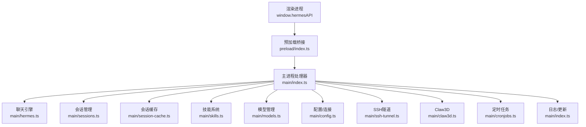
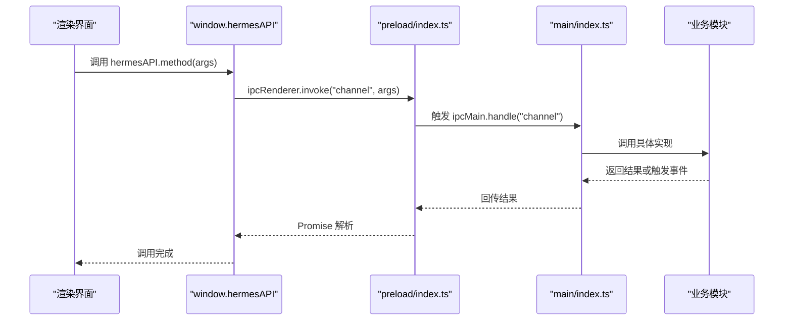
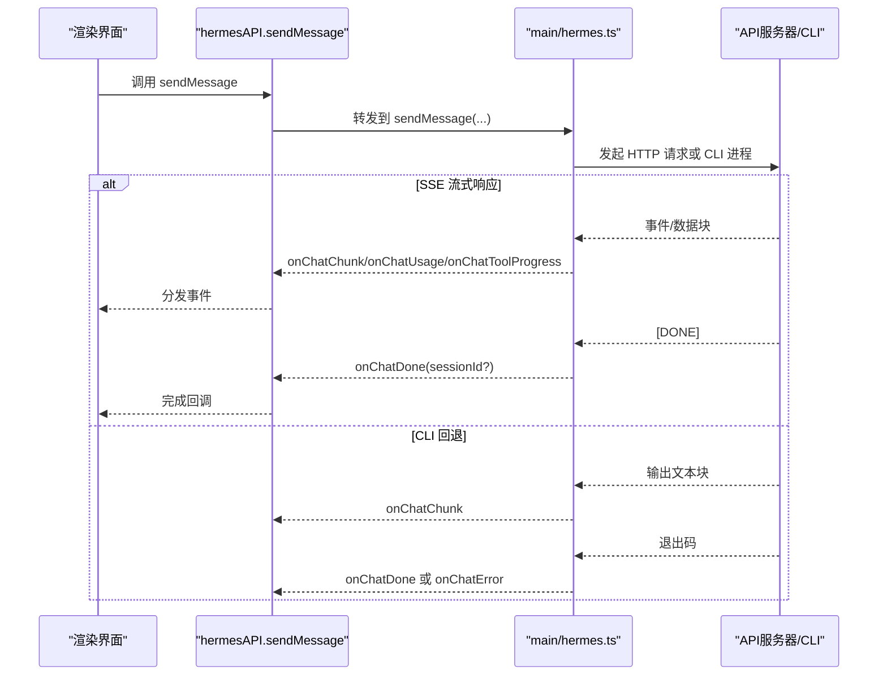
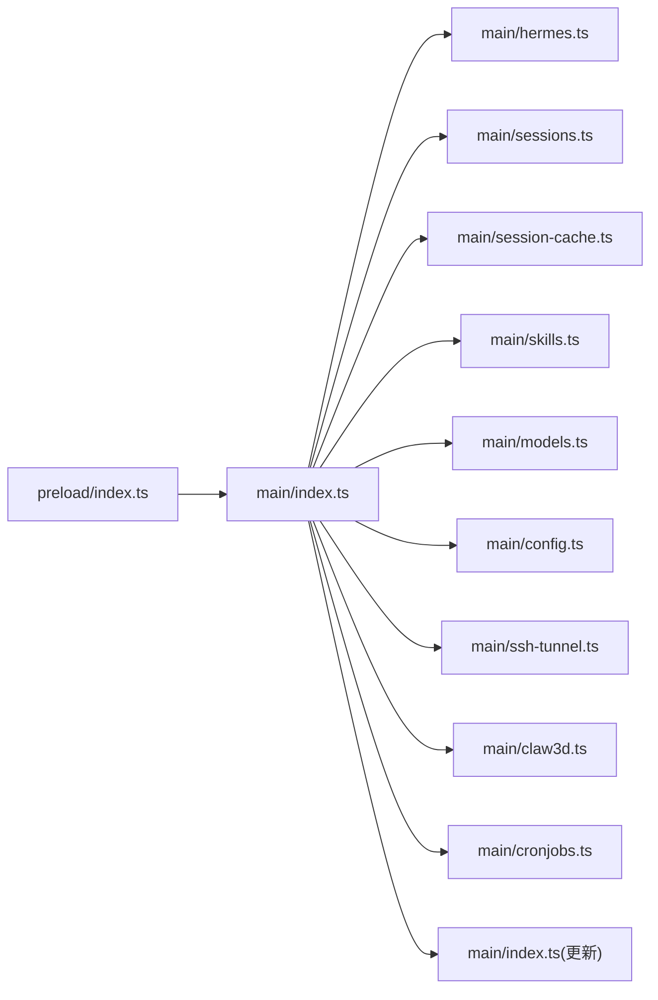

# IPC API接口

<cite>
**本文档引用的文件**
- [src/preload/index.ts](file://src/preload/index.ts)
- [src/preload/index.d.ts](file://src/preload/index.d.ts)
- [src/main/index.ts](file://src/main/index.ts)
- [src/main/hermes.ts](file://src/main/hermes.ts)
- [src/main/sessions.ts](file://src/main/sessions.ts)
- [src/main/session-cache.ts](file://src/main/session-cache.ts)
- [src/main/skills.ts](file://src/main/skills.ts)
- [src/main/models.ts](file://src/main/models.ts)
- [src/shared/i18n/index.ts](file://src/shared/i18n/index.ts)
- [tests/ipc-handlers.test.ts](file://tests/ipc-handlers.test.ts)
- [tests/preload-api-surface.test.ts](file://tests/preload-api-surface.test.ts)
</cite>

## 目录
1. [简介](#简介)
2. [项目结构](#项目结构)
3. [核心组件](#核心组件)
4. [架构总览](#架构总览)
5. [详细组件分析](#详细组件分析)
6. [依赖关系分析](#依赖关系分析)
7. [性能考虑](#性能考虑)
8. [故障排除指南](#故障排除指南)
9. [结论](#结论)
10. [附录](#附录)

## 简介
本文件为 Hermes Desktop 的 IPC API 接口完整参考文档，覆盖通过 `window.hermesAPI` 暴露的全部 100+ 个 IPC 通道。内容包括安装管理、配置管理、聊天引擎、会话管理、技能系统、3D 办公室、更新与日志、SSH 隧道、定时任务、工具集、记忆体、人格（Soul）、模型管理、MCP 服务器、备份导入、以及菜单事件等模块的接口定义、参数说明、返回值类型、错误处理与使用示例。

## 项目结构
Hermes Desktop 的 IPC 架构采用标准的 Electron 双进程模型：
- 渲染进程通过 `preload/index.ts` 中的 `hermesAPI` 对象调用 `ipcRenderer.invoke(channel, ...args)`
- 主进程在 `main/index.ts` 中注册 `ipcMain.handle(channel, handler)` 处理器，并委托到各业务模块（如 `hermes.ts`、`sessions.ts`、`skills.ts` 等）

图表来源
- [src/preload/index.ts:688-700](file://src/preload/index.ts#L688-L700)
- [src/main/index.ts:1-200](file://src/main/index.ts#L1-L200)

章节来源
- [src/preload/index.ts:1-701](file://src/preload/index.ts#L1-L701)
- [src/main/index.ts:1-200](file://src/main/index.ts#L1-L200)

## 核心组件
- hermesAPI：通过 `contextBridge.exposeInMainWorld` 暴露给渲染进程的完整 API 表面，包含安装、配置、聊天、会话、技能、模型、Claw3D、更新、日志、SSH、定时任务等模块。
- ElectronAPI：仅暴露运行时环境信息（平台、版本），供调试与兼容性判断。
- 类型声明：`src/preload/index.d.ts` 提供完整的 TypeScript 接口定义，确保调用方类型安全。

章节来源
- [src/preload/index.ts:4-686](file://src/preload/index.ts#L4-L686)
- [src/preload/index.d.ts:29-471](file://src/preload/index.d.ts#L29-L471)

## 架构总览
IPC 调用链路遵循“预加载桥接 → 主进程处理器 → 业务模块”的分层设计，支持同步返回与事件流式推送（如聊天流、安装进度、更新进度）。

图表来源
- [src/preload/index.ts:1-701](file://src/preload/index.ts#L1-L701)
- [src/main/index.ts:291-1004](file://src/main/index.ts#L291-L1004)

## 详细组件分析

### 安装管理
- 方法
  - `checkInstall()`：检查安装状态（已安装、已配置、有密钥）
  - `verifyInstall()`：验证安装完整性
  - `startInstall()`：启动安装流程
  - `getHermesVersion()` / `refreshHermesVersion()`：获取/刷新版本
  - `runHermesDoctor()` / `runHermesUpdate()`：诊断与更新
  - `checkOpenClaw()` / `runClawMigrate()`：迁移 OpenClaw
- 事件
  - `onInstallProgress(callback)`：安装进度回调，返回 step/totalSteps/title/detail/log
- 使用示例
  - 启动安装后订阅进度事件，完成后轮询版本信息
- 错误处理
  - 所有 IPC 调用均返回 Promise；失败时由主进程抛出异常或返回错误对象

章节来源
- [src/preload/index.ts:15-68](file://src/preload/index.ts#L15-L68)
- [src/main/index.ts:291-325](file://src/main/index.ts#L291-L325)

### 配置与连接模式
- 方法
  - `getEnv(profile?)` / `setEnv(key, value, profile?)`：读取/设置环境变量
  - `getConfig(key, profile?)` / `setConfig(key, value, profile?)`：读取/设置配置项
  - `getHermesHome(profile?)`：获取 Hermes 目录
  - `getModelConfig(profile?)` / `setModelConfig(provider, model, baseUrl, profile?)`：模型配置
  - `isRemoteMode()` / `isRemoteOnlyMode()`：远程模式检测
  - `getConnectionConfig()` / `setConnectionConfig(mode, remoteUrl, apiKey?)`：连接配置
  - `setSshConfig(host, port, username, keyPath, remotePort, localPort)`：SSH 配置
  - `testRemoteConnection(url, apiKey?)` / `testSshConnection(...)`：连通性测试
  - `isSshTunnelActive()` / `startSshTunnel()` / `stopSshTunnel()`：SSH 隧道控制
- 使用示例
  - 切换到 SSH 模式前先 `testSshConnection`，再启动隧道
- 错误处理
  - 远程/SSH 模式下，API 请求自动注入鉴权头；失败时返回错误信息

章节来源
- [src/preload/index.ts:74-156](file://src/preload/index.ts#L74-L156)
- [src/main/index.ts:371-538](file://src/main/index.ts#L371-L538)

### 聊天引擎与流式响应
- 方法
  - `sendMessage(message, profile?, resumeSessionId?, history?)`：发送消息，返回 `{ response, sessionId? }`
  - `abortChat()`：中止当前聊天
- 事件
  - `onChatChunk(callback)`：增量文本块
  - `onChatDone(callback)`：会话结束（可携带 sessionId）
  - `onChatToolProgress(callback)`：工具执行进度
  - `onChatUsage(callback)`：用量统计（prompt/completion/total tokens，可选 cost/rate limit）
  - `onChatError(callback)`：错误事件
- 实现要点
  - 优先使用本地/远程 HTTP API（SSE 流）；若不可用则回退到 CLI
  - 自动探测 SSH 隧道健康状态，必要时自动启动
- 使用示例
  - 订阅 `onChatChunk` 实时显示；订阅 `onChatDone` 更新 UI 状态
- 错误处理
  - SSE 异常、超时、空响应时进行探测请求以获取真实错误

图表来源
- [src/main/hermes.ts:168-434](file://src/main/hermes.ts#L168-L434)
- [src/main/index.ts:641-660](file://src/main/index.ts#L641-L660)

章节来源
- [src/preload/index.ts:158-228](file://src/preload/index.ts#L158-L228)
- [src/main/hermes.ts:94-434](file://src/main/hermes.ts#L94-L434)

### 网关管理
- 方法
  - `startGateway()` / `stopGateway()` / `gatewayStatus()`：网关启停与状态查询
- 使用示例
  - 在本地模式首次使用聊天前确保网关运行

章节来源
- [src/preload/index.ts:230-233](file://src/preload/index.ts#L230-L233)
- [src/main/index.ts:649-660](file://src/main/index.ts#L649-L660)

### 平台开关
- 方法
  - `getPlatformEnabled(profile?)` / `setPlatformEnabled(platform, enabled, profile?)`：启用/禁用平台（如 api_server）

章节来源
- [src/preload/index.ts:235-243](file://src/preload/index.ts#L235-L243)
- [src/main/index.ts:79-81](file://src/main/index.ts#L79-L81)

### 会话管理
- 方法
  - `listSessions(limit?, offset?)`：列出会话摘要
  - `getSessionMessages(sessionId)`：获取会话消息列表
  - `searchSessions(query, limit?)`：全文检索会话
  - `listCachedSessions(limit?, offset?)` / `syncSessionCache()`：本地会话缓存
  - `updateSessionTitle(sessionId, title)`：更新缓存标题
  - `deleteSession(sessionId)`：删除会话（数据库+文件系统）
- 数据模型
  - 会话摘要：id/source/startedAt/endedAt/messageCount/model/title/preview
  - 会话消息：id/role/content/timestamp
  - 搜索结果：sessionId/title/startedAt/source/messageCount/model/snippet
- 使用示例
  - 首次进入会话页面调用 `syncSessionCache`，后续使用 `listCachedSessions` 快速加载

章节来源
- [src/preload/index.ts:245-282](file://src/preload/index.ts#L245-L282)
- [src/main/sessions.ts:8-186](file://src/main/sessions.ts#L8-L186)
- [src/main/session-cache.ts:15-251](file://src/main/session-cache.ts#L15-L251)

### 用户档案（Profiles）
- 方法
  - `listProfiles()` / `createProfile(name, clone)` / `deleteProfile(name)` / `setActiveProfile(name)`
- 使用示例
  - 新建档案时可选择克隆默认档案；切换活动档案后刷新相关配置

章节来源
- [src/preload/index.ts:289-301](file://src/preload/index.ts#L289-L301)
- [src/main/index.ts:91-95](file://src/main/index.ts#L91-L95)

### 记忆体（Memory）
- 方法
  - `readMemory(profile?)`：读取记忆体与用户档案统计
  - `addMemoryEntry(content, profile?)` / `updateMemoryEntry(index, content, profile?)` / `removeMemoryEntry(index, profile?)`
  - `writeUserProfile(content, profile?)`：写入用户档案
- 使用示例
  - 将用户偏好或上下文写入记忆体，提升个性化体验

章节来源
- [src/preload/index.ts:303-329](file://src/preload/index.ts#L303-L329)
- [src/main/index.ts:97-102](file://src/main/index.ts#L97-L102)

### 人格（Soul）
- 方法
  - `readSoul(profile?)` / `writeSoul(content, profile?)` / `resetSoul(profile?)`
- 使用示例
  - 存储角色设定或长期记忆片段

章节来源
- [src/preload/index.ts:331-337](file://src/preload/index.ts#L331-L337)
- [src/main/index.ts:103-103](file://src/main/index.ts#L103-L103)

### 工具集（Tools）
- 方法
  - `getToolsets(profile?)` / `setToolsetEnabled(key, enabled, profile?)`
- 使用示例
  - 根据场景启用/禁用特定工具（如搜索、文件操作等）

章节来源
- [src/preload/index.ts:339-350](file://src/preload/index.ts#L339-L350)
- [src/main/index.ts:104-104](file://src/main/index.ts#L104-L104)

### 技能系统（Skills）
- 方法
  - `listInstalledSkills(profile?)` / `listBundledSkills()`：列出已安装/内置技能
  - `getSkillContent(skillPath)`：获取技能详情内容
  - `installSkill(identifier, profile?)` / `uninstallSkill(name, profile?)`：安装/卸载技能
- 使用示例
  - 从内置仓库浏览技能，安装到指定档案；查看 SKILL.md 内容用于展示

章节来源
- [src/preload/index.ts:352-378](file://src/preload/index.ts#L352-L378)
- [src/main/skills.ts:68-292](file://src/main/skills.ts#L68-L292)

### 模型管理（Models）
- 方法
  - `listModels()` / `addModel(name, provider, model, baseUrl)` / `removeModel(id)` / `updateModel(id, fields)`
- 使用示例
  - 添加自定义模型或第三方服务模型；更新模型字段

章节来源
- [src/preload/index.ts:380-468](file://src/preload/index.ts#L380-L468)
- [src/main/models.ts:116-168](file://src/main/models.ts#L116-L168)

### 3D 办公室（Claw3D）
- 方法
  - `claw3dStatus()`：获取状态（是否克隆/安装/开发服务器/适配器运行/端口/WS地址等）
  - `claw3dSetup()`：初始化设置
  - `onClaw3dSetupProgress(callback)`：设置进度事件
  - `claw3dGetPort()` / `claw3dSetPort(port)` / `claw3dGetWsUrl()` / `claw3dSetWsUrl(url)`
  - `claw3dStartAll()` / `claw3dStopAll()` / `claw3dGetLogs()`
  - `claw3dStartDev()` / `claw3dStopDev()` / `claw3dStartAdapter()` / `claw3dStopAdapter()`
- 使用示例
  - 初始化后启动开发服务器与适配器，实时查看日志

章节来源
- [src/preload/index.ts:470-531](file://src/preload/index.ts#L470-L531)
- [src/main/index.ts:891-932](file://src/main/index.ts#L891-L932)

### 更新与日志
- 方法
  - `checkForUpdates()` / `downloadUpdate()` / `installUpdate()` / `getAppVersion()`
  - `onUpdateAvailable(callback)` / `onUpdateDownloadProgress(callback)` / `onUpdateDownloaded(callback)`
  - `readLogs(logFile?, lines?)`：读取日志文件内容与路径
- 使用示例
  - 应用启动后检查更新，下载完成后提示安装

章节来源
- [src/preload/index.ts:533-563](file://src/preload/index.ts#L533-L563)
- [src/preload/index.ts:681-685](file://src/preload/index.ts#L681-L685)
- [src/main/index.ts:1111-1174](file://src/main/index.ts#L1111-L1174)
- [src/main/index.ts:999-1004](file://src/main/index.ts#L999-L1004)

### 语言与本地化
- 方法
  - `getLocale()` / `setLocale(locale)`：获取/设置应用语言
- 使用示例
  - 根据系统语言初始化，允许用户切换

章节来源
- [src/preload/index.ts:70-72](file://src/preload/index.ts#L70-L72)
- [src/shared/i18n/index.ts:259-267](file://src/shared/i18n/index.ts#L259-L267)

### 菜单事件
- 方法
  - `onMenuNewChat(callback)` / `onMenuSearchSessions(callback)`：原生菜单事件转发
- 使用示例
  - 绑定快捷键触发新对话或打开会话搜索

章节来源
- [src/preload/index.ts:565-576](file://src/preload/index.ts#L565-L576)
- [src/main/index.ts:1035-1046](file://src/main/index.ts#L1035-L1046)

### 定时任务（Cron Jobs）
- 方法
  - `listCronJobs(includeDisabled?, profile?)` / `createCronJob(...)` / `removeCronJob(...)`
  - `pauseCronJob(...)` / `resumeCronJob(...)` / `triggerCronJob(...)`
- 使用示例
  - 创建定时提醒或周期性任务，支持暂停/恢复/立即触发

章节来源
- [src/preload/index.ts:578-639](file://src/preload/index.ts#L578-L639)
- [src/main/index.ts:934-963](file://src/main/index.ts#L934-L963)

### 备份/导入/调试
- 方法
  - `runHermesBackup(profile?)` / `runHermesImport(archivePath, profile?)`：备份与导入
  - `runHermesDump()`：生成调试转储
- 使用示例
  - 导出配置与会话历史，跨设备迁移

章节来源
- [src/preload/index.ts:645-658](file://src/preload/index.ts#L645-L658)
- [src/main/index.ts:970-984](file://src/main/index.ts#L970-L984)

### 外部工具与Shell
- 方法
  - `openExternal(url)`：安全打开外部链接
- 使用示例
  - 点击帮助链接或外部资源

章节来源
- [src/preload/index.ts:641-643](file://src/preload/index.ts#L641-L643)
- [src/main/index.ts:965-968](file://src/main/index.ts#L965-L968)

### 凭据池（Credential Pool）
- 方法
  - `getCredentialPool()` / `setCredentialPool(provider, entries)`
- 使用示例
  - 统一管理多提供商的凭据条目

章节来源
- [src/preload/index.ts:428-436](file://src/preload/index.ts#L428-L436)
- [src/main/index.ts:859-871](file://src/main/index.ts#L859-L871)

### 记忆体提供者与MCP服务器
- 方法
  - `discoverMemoryProviders(profile?)`：发现可用的记忆体提供者
  - `listMcpServers(profile?)`：列出 MCP 服务器
- 使用示例
  - 集成外部记忆体或工具协议

章节来源
- [src/preload/index.ts:660-686](file://src/preload/index.ts#L660-L686)
- [src/main/index.ts:987-997](file://src/main/index.ts#L987-L997)

## 依赖关系分析

图表来源
- [src/preload/index.ts:1-701](file://src/preload/index.ts#L1-L701)
- [src/main/index.ts:1-1234](file://src/main/index.ts#L1-L1234)

章节来源
- [tests/ipc-handlers.test.ts:1-117](file://tests/ipc-handlers.test.ts#L1-L117)
- [tests/preload-api-surface.test.ts:1-212](file://tests/preload-api-surface.test.ts#L1-L212)

## 性能考虑
- 本地会话缓存：通过 `syncSessionCache` 与 `listCachedSessions` 降低数据库访问频率，提升启动与翻页性能
- 健康检查：聊天引擎对本地 API 服务器进行定期健康检查，避免无效请求
- SSH 隧道：自动启动与健康探测，减少手动干预
- SSE 流式：优先使用 HTTP SSE，避免 CLI 进程开销
- 日志读取：限制行数与文件范围，避免大文件读取阻塞

## 故障排除指南
- 安装问题
  - 使用 `checkInstall` 与 `verifyInstall` 确认安装状态；若失败使用 `runHermesDoctor` 获取诊断信息
- 连接问题
  - 使用 `testRemoteConnection` 和 `testSshConnection` 检查连通性；确认 `getConnectionConfig` 返回的配置正确
  - 若 SSH 隧道异常，调用 `isSshTunnelActive` 并重新 `startSshTunnel`
- 聊天问题
  - 若 SSE 无输出，系统会自动探测非流式请求以揭示真实错误；可通过 `onChatError` 获取错误信息
  - 使用 `abortChat` 中止长时间无响应的请求
- 会话问题
  - 使用 `searchSessions` 进行全文检索；若未命中，检查数据库中是否存在 FTS 表
- 权限与安全
  - `openExternal` 仅允许白名单 URL；不合法链接会被阻止

章节来源
- [src/main/hermes.ts:218-266](file://src/main/hermes.ts#L218-L266)
- [src/main/index.ts:185-194](file://src/main/index.ts#L185-L194)

## 结论
本文档提供了 Hermes Desktop IPC API 的完整参考，涵盖安装、配置、聊天、会话、技能、模型、3D 办公室、更新、日志、SSH、定时任务等模块。通过统一的 `window.hermesAPI` 接口，开发者可以以一致的方式访问桌面应用能力，并结合事件流与异步 Promise 模式构建流畅的用户体验。建议在生产环境中：
- 正确订阅事件并在组件卸载时移除监听
- 对长耗时操作提供取消机制（如 `abortChat`）
- 使用缓存接口（如会话缓存）优化性能
- 严格校验输入参数与错误返回，提供友好的用户反馈

## 附录
- API 调用模式
  - 同步调用：`await hermesAPI.method(args)`，返回 Promise
  - 事件订阅：`const off = hermesAPI.onXxx(callback)`，返回移除函数
- 最佳实践
  - 在应用启动时检查更新与健康状态
  - 使用 `profile` 参数区分不同用户配置
  - 对外部链接使用 `openExternal` 并确保 URL 白名单
  - 对大文件/日志读取限制大小与行数