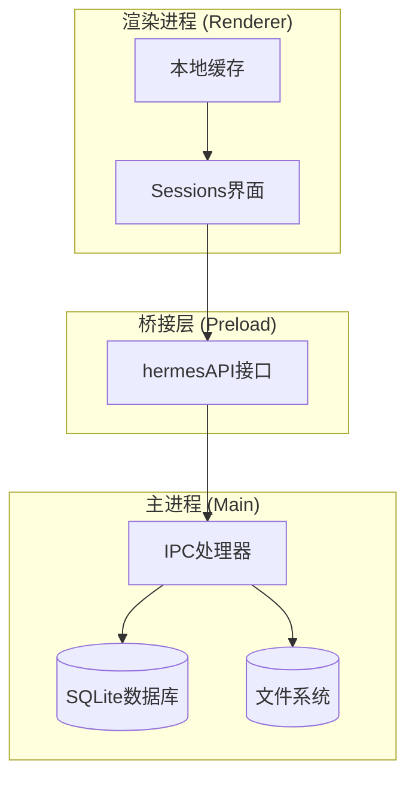
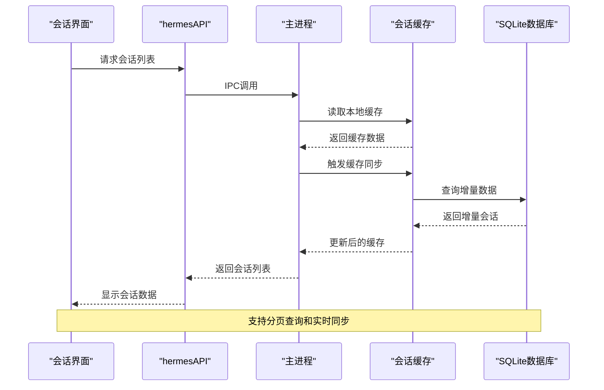
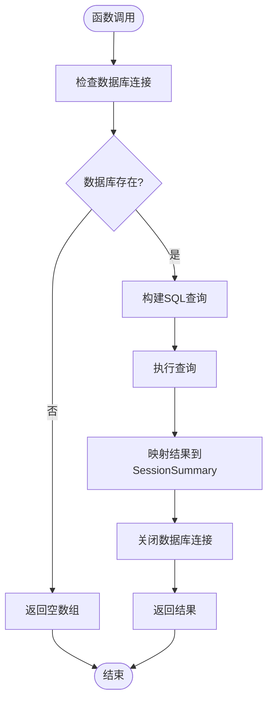
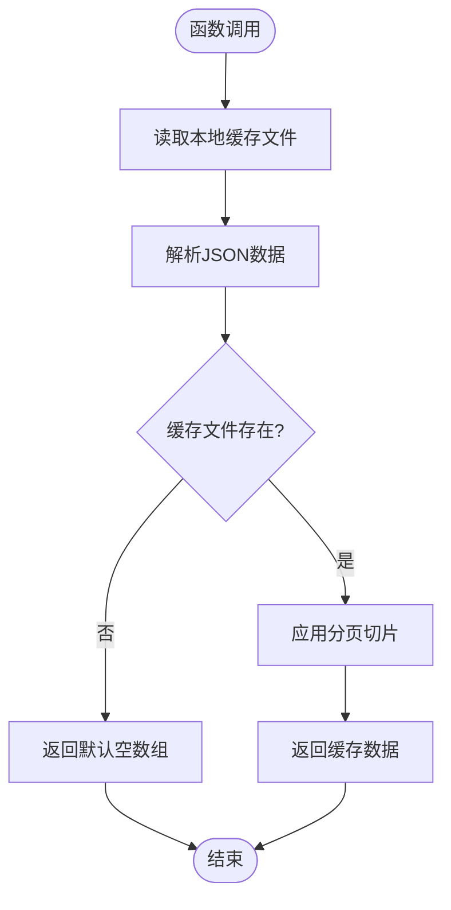
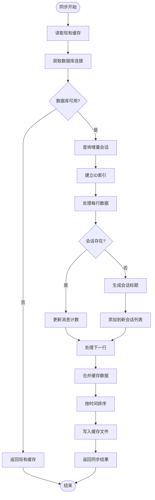
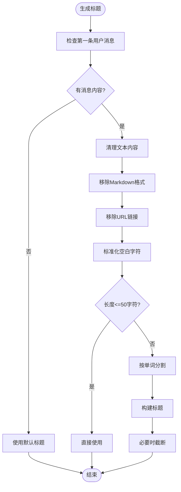
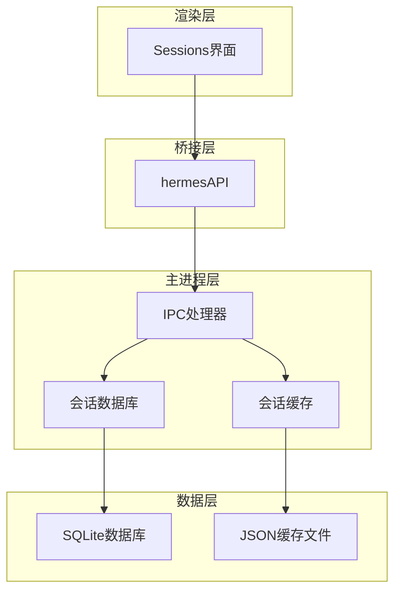
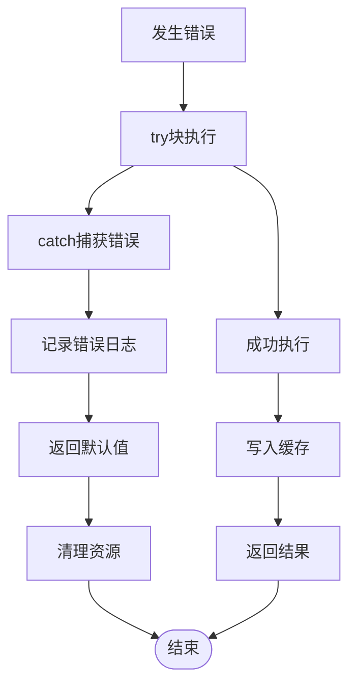

# 会话列表API

<cite>
**本文档引用的文件**
- [sessions.ts](file://src/main/sessions.ts)
- [session-cache.ts](file://src/main/session-cache.ts)
- [index.ts](file://src/main/index.ts)
- [index.ts](file://src/preload/index.ts)
- [Sessions.tsx](file://src/renderer/src/screens/Sessions/Sessions.tsx)
- [sessions.ts](file://src/shared/i18n/locales/zh-CN/sessions.ts)
- [sessions-delete-feature.md](file://docs/sessions-delete-feature.md)
- [sessions-delete-fix-2026-05-14.md](file://docs/sessions-delete-fix-2026-05-14.md)
- [SKILL.md](file://.agents/skills/hermes-agent/SKILL.md)
</cite>

## 目录
1. [简介](#简介)
2. [项目结构](#项目结构)
3. [核心组件](#核心组件)
4. [架构概览](#架构概览)
5. [详细组件分析](#详细组件分析)
6. [依赖关系分析](#依赖关系分析)
7. [性能考虑](#性能考虑)
8. [故障排除指南](#故障排除指南)
9. [结论](#结论)

## 简介

会话列表API是Hermes Desktop应用中用于管理和检索用户会话的核心功能模块。该API提供了三种主要的会话列表管理接口：`listSessions`（数据库直接查询）、`listCachedSessions`（本地缓存查询）和`syncSessionCache`（缓存同步）。这些接口共同构成了一个高效、响应迅速的会话管理系统，支持分页查询、实时缓存同步和智能标题生成。

该系统采用双层架构设计，结合了SQLite数据库的持久化存储和本地JSON缓存的快速访问，实现了最佳的用户体验和性能表现。通过智能的缓存策略和增量同步机制，系统能够在大量会话数据的情况下保持流畅的用户界面响应。

## 项目结构

会话列表API的实现分布在三个主要层次：

**图表来源**
- [index.ts:82-88](file://src/main/index.ts#L82-L88)
- [index.ts:380-411](file://src/preload/index.ts#L380-L411)

**章节来源**
- [index.ts:82-88](file://src/main/index.ts#L82-L88)
- [index.ts:380-411](file://src/preload/index.ts#L380-L411)

## 核心组件

会话列表API由以下核心组件构成：

### 数据模型

系统定义了三种主要的数据结构：

1. **SessionSummary** - 数据库查询结果格式
2. **CachedSession** - 本地缓存格式  
3. **SearchResult** - 搜索结果格式

### 接口函数

1. **listSessions(limit, offset)** - 直接从数据库查询会话列表
2. **listCachedSessions(limit, offset)** - 从本地缓存读取会话列表
3. **syncSessionCache()** - 同步数据库到本地缓存

**章节来源**
- [sessions.ts:8-34](file://src/main/sessions.ts#L8-L34)
- [session-cache.ts:15-27](file://src/main/session-cache.ts#L15-L27)

## 架构概览

会话列表API采用分层架构设计，确保了良好的分离关注点和可维护性：

**图表来源**
- [Sessions.tsx:199-222](file://src/renderer/src/screens/Sessions/Sessions.tsx#L199-L222)
- [index.ts:691-700](file://src/main/index.ts#L691-L700)

## 详细组件分析

### listSessions - 数据库直接查询

`listSessions`函数提供最准确但相对较慢的会话查询方式：

**图表来源**
- [sessions.ts:46-89](file://src/main/sessions.ts#L46-L89)

**参数说明：**
- `limit` (可选): 返回的最大会话数量，默认30
- `offset` (可选): 分页偏移量，默认0

**返回值：**
- `SessionSummary[]`: 包含会话基本信息的数组

**错误处理：**
- 数据库不存在时返回空数组
- 查询异常时捕获并返回空数组

**章节来源**
- [sessions.ts:46-89](file://src/main/sessions.ts#L46-L89)

### listCachedSessions - 本地缓存查询

`listCachedSessions`提供最快的会话访问方式，完全避免数据库IO：

**图表来源**
- [session-cache.ts:170-176](file://src/main/session-cache.ts#L170-L176)

**参数说明：**
- `limit` (可选): 返回的最大会话数量，默认50
- `offset` (可选): 分页偏移量，默认0

**返回值：**
- `CachedSession[]`: 包含缓存会话信息的数组

**性能特点：**
- O(1)时间复杂度
- 无数据库依赖
- 实时缓存一致性

**章节来源**
- [session-cache.ts:170-176](file://src/main/session-cache.ts#L170-L176)

### syncSessionCache - 缓存同步

`syncSessionCache`是整个会话系统的核心同步机制：

**图表来源**
- [session-cache.ts:83-167](file://src/main/session-cache.ts#L83-L167)

**优化特性：**
- 使用Map进行O(1)查找，避免O(N²)复杂度
- 增量同步，仅获取自上次同步以来的新会话
- 智能标题生成，基于第一条用户消息

**章节来源**
- [session-cache.ts:83-167](file://src/main/session-cache.ts#L83-L167)

### 标题生成算法

会话标题生成是缓存同步过程中的重要功能：

**图表来源**
- [session-cache.ts:29-58](file://src/main/session-cache.ts#L29-L58)

**算法特点：**
- 移除Markdown标记和URL链接
- 保持自然语言可读性
- 控制标题长度在合理范围内
- 回退到默认标题

**章节来源**
- [session-cache.ts:29-58](file://src/main/session-cache.ts#L29-L58)

## 依赖关系分析

会话列表API的依赖关系展现了清晰的分层架构：

**图表来源**
- [index.ts:82-88](file://src/main/index.ts#L82-L88)
- [index.ts:380-411](file://src/preload/index.ts#L380-L411)

**依赖特点：**
- 渲染层仅通过预加载API访问
- 主进程提供严格的IPC边界
- 缓存层独立于数据库层
- 文件系统作为缓存持久化介质

**章节来源**
- [index.ts:82-88](file://src/main/index.ts#L82-L88)
- [index.ts:380-411](file://src/preload/index.ts#L380-L411)

## 性能考虑

会话列表API在设计时充分考虑了性能优化：

### 缓存策略优化

1. **增量同步**: `syncSessionCache`仅获取自上次同步以来的新会话
2. **内存索引**: 使用Map建立ID到会话对象的映射，避免重复扫描
3. **批量操作**: 单次同步处理数千个会话，性能保持稳定

### 查询优化

1. **分页机制**: 支持`limit`和`offset`参数进行高效分页
2. **索引利用**: SQLite查询使用适当的索引和排序
3. **连接复用**: 数据库连接在单次操作中复用

### 内存管理

1. **及时释放**: 所有数据库连接在finally块中正确关闭
2. **渐进式处理**: 大数据集分批处理，避免内存峰值
3. **缓存淘汰**: 本地缓存文件定期更新，保持最新状态

## 故障排除指南

### 常见问题及解决方案

**问题1: 会话列表为空**
- 检查数据库文件是否存在
- 验证SQLite连接权限
- 确认会话表中有数据

**问题2: 缓存不同步**
- 检查缓存文件读写权限
- 验证JSON格式有效性
- 确认同步函数正常执行

**问题3: 标题生成异常**
- 检查第一条用户消息内容
- 验证国际化资源加载
- 确认文本清理算法正常工作

**问题4: 性能问题**
- 监控数据库查询时间
- 检查缓存命中率
- 分析内存使用情况

### 错误处理机制

系统实现了多层次的错误处理：

**章节来源**
- [sessions.ts:46-89](file://src/main/sessions.ts#L46-L89)
- [session-cache.ts:60-75](file://src/main/session-cache.ts#L60-L75)

## 结论

会话列表API通过精心设计的双层架构和智能缓存策略，为Hermes Desktop应用提供了高效、可靠的会话管理功能。系统的主要优势包括：

1. **高性能**: 本地缓存提供毫秒级响应，数据库查询支持精确控制
2. **可扩展性**: 增量同步机制支持大规模会话数据管理
3. **可靠性**: 完善的错误处理和资源管理确保系统稳定性
4. **用户体验**: 智能标题生成和实时同步提升用户满意度

该API的设计充分体现了现代桌面应用的最佳实践，为后续的功能扩展和性能优化奠定了坚实基础。通过合理的分层架构和清晰的职责分离，系统既保证了功能的完整性，又确保了代码的可维护性和可测试性。