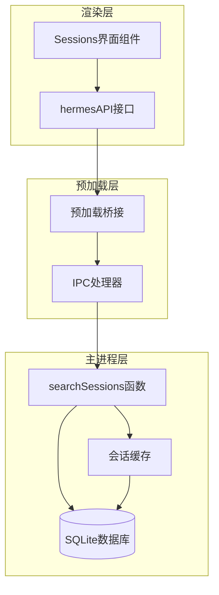
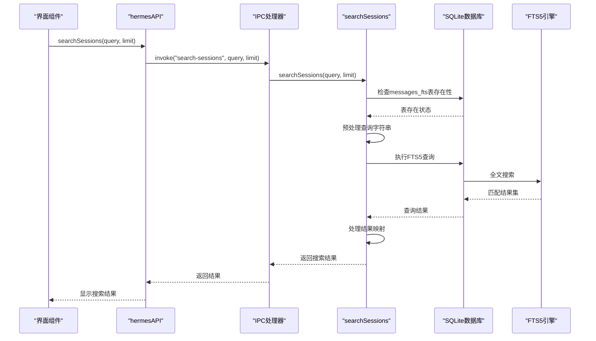
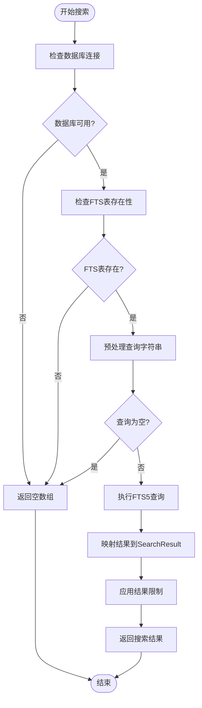
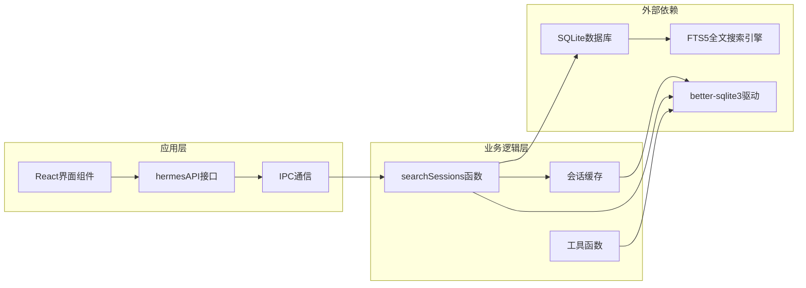

# 会话搜索API

<cite>
**本文档引用的文件**
- [sessions.ts](file://src/main/sessions.ts)
- [Sessions.tsx](file://src/renderer/src/screens/Sessions/Sessions.tsx)
- [index.ts](file://src/preload/index.ts)
- [index.ts](file://src/main/index.ts)
- [session-cache.ts](file://src/main/session-cache.ts)
- [sessions.ts](file://src/shared/i18n/locales/zh-CN/sessions.ts)
</cite>

## 目录
1. [简介](#简介)
2. [项目结构](#项目结构)
3. [核心组件](#核心组件)
4. [架构概览](#架构概览)
5. [详细组件分析](#详细组件分析)
6. [依赖关系分析](#依赖关系分析)
7. [性能考虑](#性能考虑)
8. [故障排除指南](#故障排除指南)
9. [结论](#结论)

## 简介

会话搜索API是Hermes桌面应用中的一个核心功能模块，负责提供高效的会话内容搜索能力。该系统基于SQLite FTS5全文搜索引擎，支持实时搜索、相关性评分、结果高亮等功能。本文档将深入解析searchSessions等会话搜索接口的实现原理，包括搜索算法、关键词匹配机制、相关性评分策略，以及性能优化和索引管理的实现细节。

## 项目结构

会话搜索功能涉及三个主要层次：

**图表来源**
- [Sessions.tsx:171-383](file://src/renderer/src/screens/Sessions/Sessions.tsx#L171-L383)
- [index.ts:412-426](file://src/preload/index.ts#L412-L426)
- [index.ts:852-857](file://src/main/index.ts#L852-L857)

**章节来源**
- [sessions.ts:91-156](file://src/main/sessions.ts#L91-L156)
- [Sessions.tsx:171-383](file://src/renderer/src/screens/Sessions/Sessions.tsx#L171-L383)

## 核心组件

### 主要数据结构

会话搜索API定义了几个关键的数据接口：

**搜索结果接口** (`SearchResult`)
- `sessionId`: 会话唯一标识符
- `title`: 会话标题
- `startedAt`: 会话开始时间戳
- `source`: 会话来源
- `messageCount`: 消息数量
- `model`: 使用的模型
- `snippet`: 匹配内容的高亮片段

**会话摘要接口** (`SessionSummary`)
- `id`: 会话ID
- `source`: 来源信息
- `startedAt`: 开始时间
- `endedAt`: 结束时间或null
- `messageCount`: 消息计数
- `model`: 模型名称
- `title`: 标题
- `preview`: 预览内容

**章节来源**
- [sessions.ts:26-34](file://src/main/sessions.ts#L26-L34)
- [sessions.ts:8-17](file://src/main/sessions.ts#L8-L17)

### 搜索算法实现

搜索算法基于SQLite FTS5全文搜索引擎，采用以下核心策略：

1. **查询预处理**: 将输入查询字符串按空白字符分割，过滤空词，对每个词进行安全包装
2. **前缀匹配**: 为每个词添加星号(*)通配符，实现前缀匹配
3. **相关性排序**: 利用SQLite的rank排序机制，按相关性降序排列
4. **去重处理**: 使用DISTINCT关键字避免重复结果

**章节来源**
- [sessions.ts:105-111](file://src/main/sessions.ts#L105-L111)
- [sessions.ts:128-129](file://src/main/sessions.ts#L128-L129)

## 架构概览

会话搜索API采用分层架构设计，确保良好的性能和可维护性：

**图表来源**
- [Sessions.tsx:230-234](file://src/renderer/src/screens/Sessions/Sessions.tsx#L230-L234)
- [index.ts:412-426](file://src/preload/index.ts#L412-L426)
- [index.ts:852-857](file://src/main/index.ts#L852-L857)
- [sessions.ts:91-156](file://src/main/sessions.ts#L91-L156)

## 详细组件分析

### 搜索接口实现

#### searchSessions函数

`searchSessions`是核心搜索函数，实现了完整的搜索流程：

**查询验证阶段**
- 检查数据库连接状态
- 验证FTS5虚拟表是否存在
- 预处理查询字符串，确保安全性

**搜索执行阶段**
- 使用SQLite FTS5 MATCH操作符执行全文搜索
- 通过JOIN关联messages和sessions表获取完整信息
- 利用snippet函数生成高亮显示的匹配片段

**结果处理阶段**
- 映射数据库结果到SearchResult接口
- 设置默认值处理可能的null值
- 限制结果数量避免性能问题

**图表来源**
- [sessions.ts:91-156](file://src/main/sessions.ts#L91-L156)

**章节来源**
- [sessions.ts:91-156](file://src/main/sessions.ts#L91-L156)

#### 前端搜索集成

前端组件通过防抖机制实现智能搜索体验：

**搜索防抖机制**
- 300毫秒延迟避免频繁搜索请求
- 实时显示搜索状态指示器
- 自动清除搜索结果列表

**结果展示优化**
- 使用高亮标记突出显示匹配内容
- 支持多种会话标签显示
- 提供删除功能集成

**章节来源**
- [Sessions.tsx:222-238](file://src/renderer/src/screens/Sessions/Sessions.tsx#L222-L238)
- [Sessions.tsx:87-99](file://src/renderer/src/screens/Sessions/Sessions.tsx#L87-L99)

### 数据库索引与优化

#### FTS5全文索引

系统使用SQLite FTS5虚拟表实现高效全文搜索：

**索引结构**
- 虚拟表名: `messages_fts`
- 内容字段: `content` (来自messages表的content字段)
- 同步机制: 通过触发器自动同步主表数据

**性能特性**
- 支持前缀匹配(*)和通配符搜索
- 内置相关性评分(rank)
- 内存友好的增量更新
- 并发读取优化

**章节来源**
- [.agents/skills/hermes-agent/SKILL.md:543-544](file://.agents/skills/hermes-agent/SKILL.md#L543-L544)

#### 会话缓存系统

为了提升性能，系统实现了本地会话缓存：

**缓存策略**
- 快速读取: 无数据库访问的本地缓存
- 增量同步: 仅同步自上次同步以来的新会话
- O(N)复杂度优化: 使用Map数据结构避免二次方复杂度

**缓存数据结构**
- `sessions.json`: 存储会话基本信息
- `_index.json`: WebUI会话索引文件
- 内存中的缓存映射表

**章节来源**
- [session-cache.ts:83-167](file://src/main/session-cache.ts#L83-L167)

### 结果高亮实现

系统提供了完整的搜索结果高亮功能：

**高亮标记格式**
- 使用`<<`和`>>`作为高亮标记
- 通过正则表达式`/(<<.*?>>)/g`识别高亮部分
- React组件动态渲染高亮文本

**高亮处理流程**
1. SQLite FTS5 snippet函数生成带标记的片段
2. 前端正则表达式分割文本
3. 匹配到的高亮部分使用`<mark>`标签包裹
4. 渲染为最终的高亮HTML结构

**章节来源**
- [Sessions.tsx:87-99](file://src/renderer/src/screens/Sessions/Sessions.tsx#L87-L99)
- [sessions.ts:124-124](file://src/main/sessions.ts#L124-L124)

## 依赖关系分析

会话搜索API的依赖关系呈现清晰的分层结构：

**图表来源**
- [sessions.ts:1-6](file://src/main/sessions.ts#L1-L6)
- [index.ts:15-426](file://src/preload/index.ts#L15-L426)
- [session-cache.ts:1-8](file://src/main/session-cache.ts#L1-L8)

**章节来源**
- [index.ts:852-857](file://src/main/index.ts#L852-L857)
- [index.ts:412-426](file://src/preload/index.ts#L412-L426)

## 性能考虑

### 查询性能优化

**索引优化**
- FTS5虚拟表提供高效的全文搜索能力
- 使用MATCH操作符进行快速查询
- rank排序基于相关性评分，无需额外计算

**内存优化**
- 防抖机制减少不必要的查询请求
- 本地缓存避免重复的数据库访问
- 分页查询限制单次结果数量

**并发处理**
- SQLite WAL模式支持并发读取
- 连接池管理避免资源泄漏
- 异常处理确保数据库连接正确关闭

### 缓存策略

**多级缓存**
- 会话缓存: 本地JSON文件存储
- 数据库连接缓存: 连接复用
- 查询结果缓存: 前端防抖缓存

**缓存失效**
- 增量同步: 基于时间戳的增量更新
- 手动刷新: 用户可见性变化时重新加载
- 定期清理: 过期数据的自动清理

**章节来源**
- [session-cache.ts:83-167](file://src/main/session-cache.ts#L83-L167)
- [Sessions.tsx:222-238](file://src/renderer/src/screens/Sessions/Sessions.tsx#L222-L238)

## 故障排除指南

### 常见问题诊断

**搜索结果为空**
1. 检查FTS5表是否存在
2. 验证查询字符串是否为空
3. 确认数据库连接正常
4. 查看是否有足够的搜索内容

**性能问题**
1. 检查防抖延迟设置
2. 验证结果数量限制
3. 监控数据库连接状态
4. 查看系统资源使用情况

**高亮显示异常**
1. 确认snippet函数正确返回标记
2. 检查正则表达式匹配逻辑
3. 验证CSS样式是否正确加载

### 错误处理机制

系统实现了多层次的错误处理：

**数据库错误处理**
- 连接失败时优雅降级为空结果
- 查询异常捕获并返回空数组
- 数据库连接自动关闭确保资源释放

**前端错误处理**
- 搜索防抖定时器清理
- 加载状态正确更新
- 用户反馈信息显示

**章节来源**
- [sessions.ts:151-155](file://src/main/sessions.ts#L151-L155)
- [Sessions.tsx:223-237](file://src/renderer/src/screens/Sessions/Sessions.tsx#L223-L237)

## 结论

会话搜索API通过精心设计的架构和优化策略，为用户提供了高效、准确的会话内容搜索体验。系统的核心优势包括：

1. **高效的全文搜索**: 基于SQLite FTS5的高性能全文搜索引擎
2. **智能相关性排序**: 利用rank字段实现自然的相关性评分
3. **实时搜索体验**: 防抖机制和高亮显示提供流畅的用户体验
4. **性能优化**: 多级缓存和连接管理确保系统响应速度
5. **健壮的错误处理**: 完善的异常处理机制保证系统稳定性

该实现为类似的应用场景提供了优秀的参考模板，展示了如何在桌面应用中集成高效的全文搜索功能。