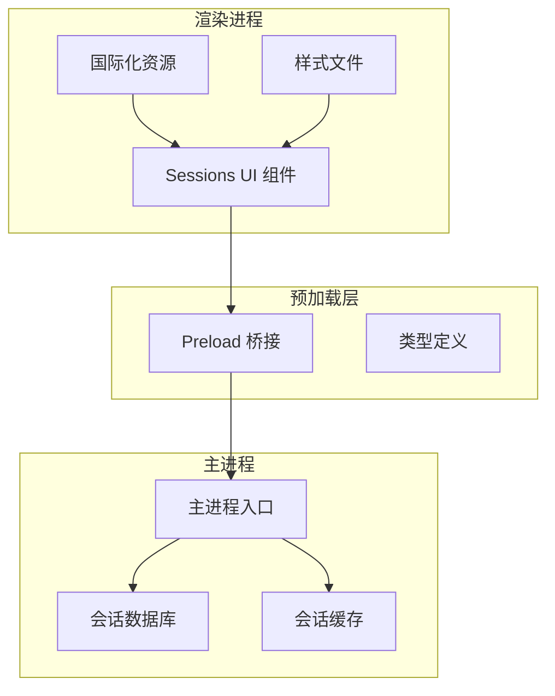
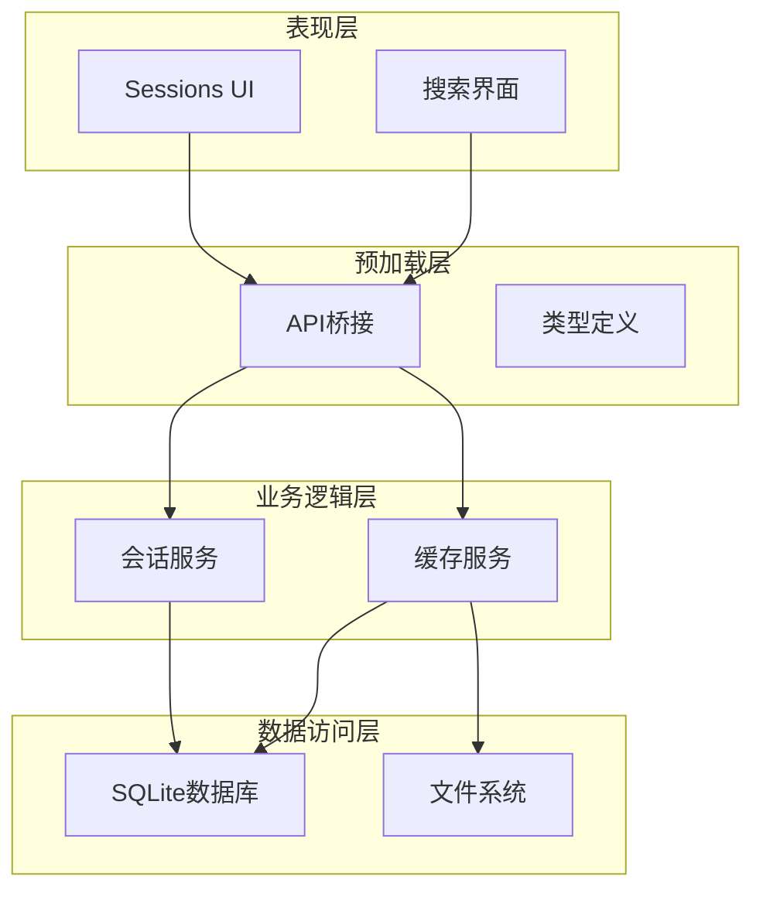
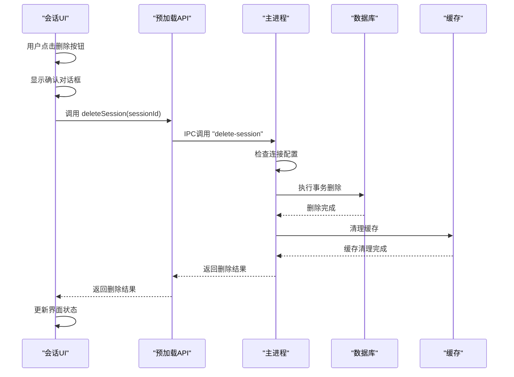
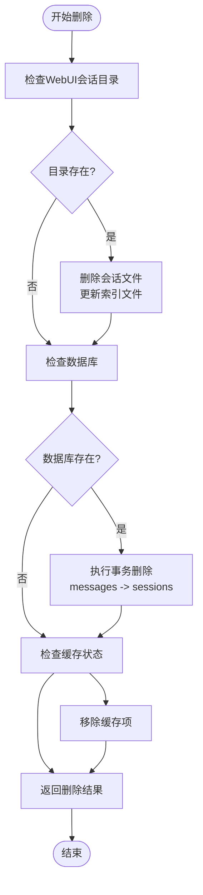
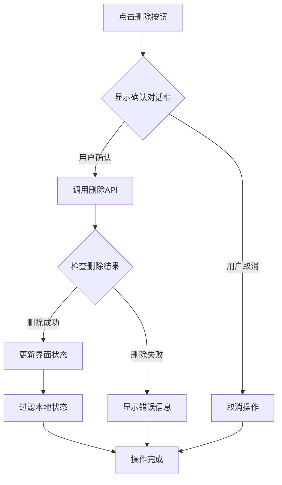
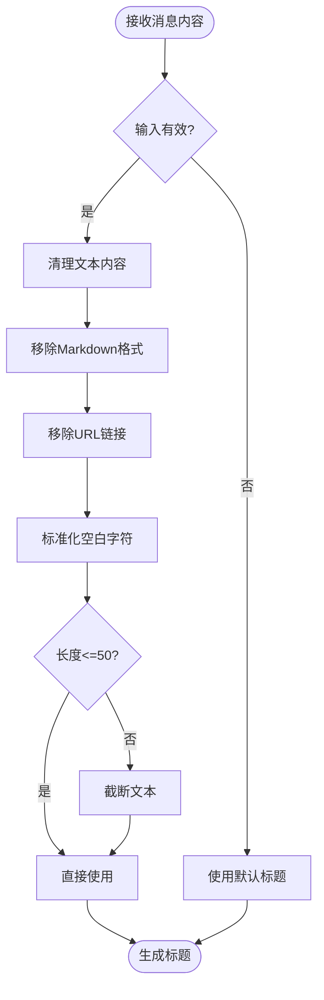
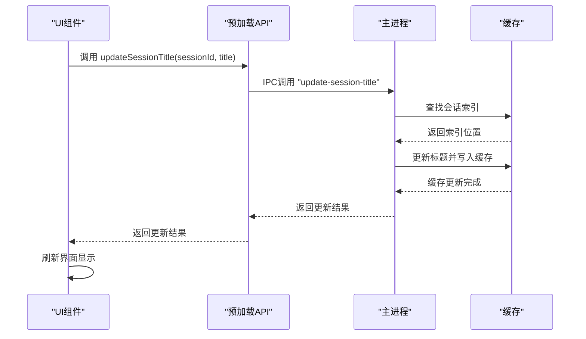
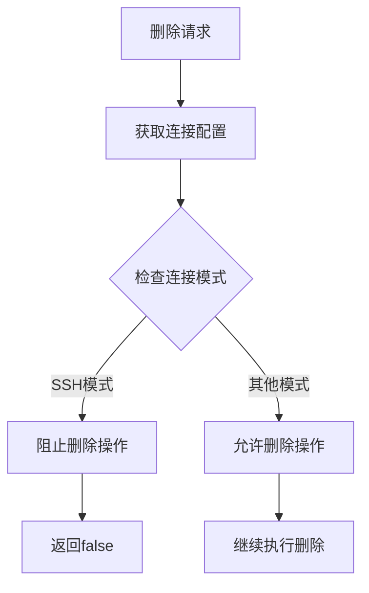
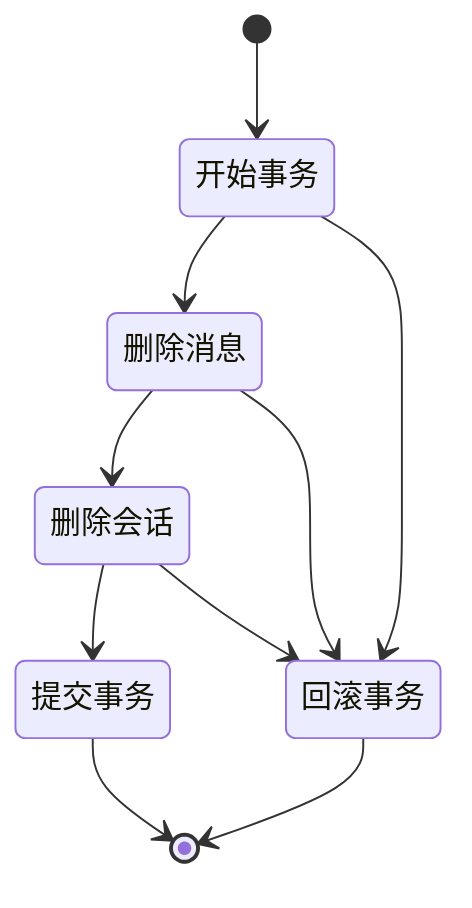
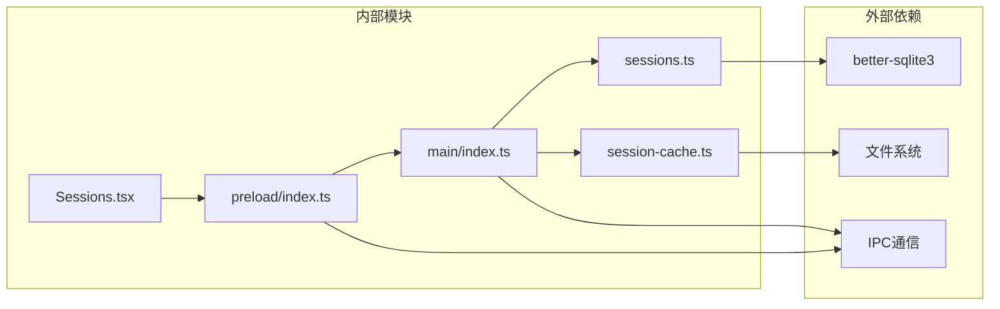

# 会话管理API

<cite>
**本文档引用的文件**
- [sessions.ts](file://src/main/sessions.ts)
- [session-cache.ts](file://src/main/session-cache.ts)
- [index.ts](file://src/main/index.ts)
- [index.ts](file://src/preload/index.ts)
- [index.d.ts](file://src/preload/index.d.ts)
- [Sessions.tsx](file://src/renderer/src/screens/Sessions/Sessions.tsx)
- [sessions.ts](file://src/shared/i18n/locales/zh-CN/sessions.ts)
- [sessions.ts](file://src/shared/i18n/locales/en/sessions.ts)
- [main.css](file://src/renderer/src/assets/main.css)
- [sessions-delete-feature.md](file://docs/sessions-delete-feature.md)
- [sessions-delete-fix-2026-05-14.md](file://docs/sessions-delete-fix-2026-05-14.md)
</cite>

## 目录
1. [简介](#简介)
2. [项目结构](#项目结构)
3. [核心组件](#核心组件)
4. [架构概览](#架构概览)
5. [详细组件分析](#详细组件分析)
6. [依赖关系分析](#依赖关系分析)
7. [性能考虑](#性能考虑)
8. [故障排除指南](#故障排除指南)
9. [结论](#结论)

## 简介

本文档详细介绍了 Hermes Desktop 应用程序中的会话管理API，重点分析了会话标题更新机制、删除确认流程和数据清理策略。该系统实现了完整的会话生命周期管理，包括会话的创建、查询、更新和删除功能。

会话管理API采用分层架构设计，通过IPC通信在主进程和渲染进程之间传递数据。系统支持多种删除策略，包括基础删除和完整删除，确保数据的一致性和完整性。

## 项目结构

会话管理功能分布在以下关键文件中：

**图表来源**
- [Sessions.tsx:171-382](file://src/renderer/src/screens/Sessions/Sessions.tsx#L171-L382)
- [index.ts:15-701](file://src/preload/index.ts#L15-L701)
- [index.ts:93-99](file://src/main/index.ts#L93-L99)

**章节来源**
- [sessions.ts:1-212](file://src/main/sessions.ts#L1-L212)
- [session-cache.ts:1-252](file://src/main/session-cache.ts#L1-L252)
- [index.ts:93-99](file://src/main/index.ts#L93-L99)

## 核心组件

### 会话数据库层

会话数据库层负责与SQLite数据库交互，提供会话数据的持久化存储。主要功能包括：

- **会话列表查询**：支持分页和排序的会话列表获取
- **会话消息检索**：按会话ID获取相关消息
- **会话搜索**：基于全文搜索的会话查询
- **会话删除**：事务性删除指定会话及其消息

### 会话缓存层

会话缓存层提供高性能的本地缓存机制：

- **缓存同步**：从数据库同步会话数据到本地缓存
- **快速读取**：直接从缓存读取会话信息，避免数据库访问
- **标题生成**：自动生成会话标题
- **缓存清理**：删除指定会话的缓存数据

### IPC通信层

IPC通信层负责进程间的数据传输：

- **预加载桥接**：在渲染进程中暴露安全的API接口
- **主进程处理器**：处理来自渲染进程的请求
- **类型安全**：通过TypeScript定义确保API调用的安全性

**章节来源**
- [sessions.ts:36-212](file://src/main/sessions.ts#L36-L212)
- [session-cache.ts:60-198](file://src/main/session-cache.ts#L60-L198)
- [index.ts:409-410](file://src/preload/index.ts#L409-L410)

## 架构概览

会话管理系统的整体架构采用分层设计，确保各层职责清晰分离：

**图表来源**
- [Sessions.tsx:171-197](file://src/renderer/src/screens/Sessions/Sessions.tsx#L171-L197)
- [index.ts:15-701](file://src/preload/index.ts#L15-L701)
- [session-cache.ts:83-167](file://src/main/session-cache.ts#L83-L167)

## 详细组件分析

### 会话删除机制

会话删除功能提供了两种删除策略：

#### 基础删除流程

**图表来源**
- [sessions-delete-feature.md:93-99](file://docs/sessions-delete-feature.md#L93-L99)
- [sessions.ts:188-212](file://src/main/sessions.ts#L188-L212)
- [session-cache.ts:191-198](file://src/main/session-cache.ts#L191-L198)

#### 完整删除流程

完整删除功能处理更复杂的情况，包括文件系统清理：

**图表来源**
- [session-cache.ts:200-251](file://src/main/session-cache.ts#L200-L251)

#### 删除确认流程

删除确认流程确保用户操作的可逆性：

**图表来源**
- [Sessions.tsx:186-197](file://src/renderer/src/screens/Sessions/Sessions.tsx#L186-L197)

**章节来源**
- [sessions-delete-feature.md:1-216](file://docs/sessions-delete-feature.md#L1-L216)
- [sessions-delete-fix-2026-05-14.md:1-71](file://docs/sessions-delete-fix-2026-05-14.md#L1-L71)

### 会话标题更新机制

会话标题更新机制提供了动态标题管理功能：

#### 标题生成算法

**图表来源**
- [session-cache.ts:29-58](file://src/main/session-cache.ts#L29-L58)

#### 标题更新流程

**图表来源**
- [session-cache.ts:178-189](file://src/main/session-cache.ts#L178-L189)
- [index.ts:406-407](file://src/preload/index.ts#L406-L407)

**章节来源**
- [session-cache.ts:29-189](file://src/main/session-cache.ts#L29-L189)

### 数据清理策略

系统实现了多层次的数据清理策略：

#### 文件系统清理

- **会话文件删除**：删除对应的JSON会话文件
- **索引文件更新**：从索引文件中移除已删除会话的引用
- **最佳努力原则**：即使清理失败也不影响主要操作的完成

#### 数据库清理

- **事务保证**：使用SQLite事务确保数据一致性
- **外键约束**：先删除消息再删除会话，遵循外键约束
- **异常处理**：捕获并处理清理过程中的异常

#### 缓存清理

- **实时更新**：删除操作完成后立即更新本地缓存
- **状态同步**：确保UI界面与实际数据状态一致

**章节来源**
- [session-cache.ts:200-251](file://src/main/session-cache.ts#L200-L251)

### 安全验证机制

系统实施了多层安全验证：

#### 连接模式验证

**图表来源**
- [sessions-delete-feature.md:93-99](file://docs/sessions-delete-feature.md#L93-L99)

#### 用户确认机制

- **浏览器原生确认框**：使用window.confirm确保用户明确同意
- **不可逆操作提示**：提供明确的不可逆操作警告
- **即时反馈**：删除操作的即时结果反馈

**章节来源**
- [sessions-delete-feature.md:129-141](file://docs/sessions-delete-feature.md#L129-L141)

### 并发控制和数据一致性

系统通过以下机制保证并发安全和数据一致性：

#### 事务处理

**图表来源**
- [sessions.ts:196-210](file://src/main/sessions.ts#L196-L210)

#### 缓存一致性

- **原子操作**：缓存更新作为原子操作执行
- **状态检查**：删除前后检查缓存状态变化
- **UI同步**：确保界面状态与缓存状态同步

**章节来源**
- [sessions.ts:196-210](file://src/main/sessions.ts#L196-L210)
- [session-cache.ts:191-198](file://src/main/session-cache.ts#L191-L198)

## 依赖关系分析

会话管理API的依赖关系如下：

**图表来源**
- [sessions.ts:1-6](file://src/main/sessions.ts#L1-L6)
- [session-cache.ts:1-13](file://src/main/session-cache.ts#L1-L13)
- [index.ts:1-1](file://src/preload/index.ts#L1-L1)

**章节来源**
- [sessions.ts:1-212](file://src/main/sessions.ts#L1-L212)
- [session-cache.ts:1-252](file://src/main/session-cache.ts#L1-L252)

## 性能考虑

### 缓存优化

系统通过本地缓存显著提升性能：

- **零数据库访问**：listCachedSessions完全从缓存读取
- **智能同步**：仅同步自上次同步以来更新的会话
- **内存映射**：使用Map数据结构实现O(1)查找性能

### 数据库优化

- **索引利用**：合理使用SQLite索引提高查询性能
- **批量操作**：使用事务进行批量删除操作
- **连接池管理**：及时关闭数据库连接释放资源

### 前端优化

- **组件记忆化**：使用React.memo避免不必要的重渲染
- **状态局部化**：只在需要的组件中维护状态
- **异步加载**：使用异步操作避免阻塞UI线程

## 故障排除指南

### 常见问题及解决方案

#### 删除操作无响应

**问题描述**：点击删除按钮后没有反应

**可能原因**：
1. SSH模式下禁用了删除功能
2. 缓存清理逻辑缺陷
3. IPC通信失败

**解决步骤**：
1. 检查当前连接模式
2. 验证缓存清理逻辑
3. 检查IPC通信状态

**章节来源**
- [sessions-delete-fix-2026-05-14.md:1-71](file://docs/sessions-delete-fix-2026-05-14.md#L1-L71)

#### 删除后界面不更新

**问题描述**：删除成功但界面仍然显示已删除的会话

**解决方法**：
1. 确保前端正确处理删除结果
2. 检查本地状态过滤逻辑
3. 验证缓存同步机制

#### 数据不一致问题

**问题描述**：数据库和缓存状态不一致

**解决方法**：
1. 检查事务提交状态
2. 验证缓存更新顺序
3. 实施数据一致性检查

**章节来源**
- [session-cache.ts:244-250](file://src/main/session-cache.ts#L244-L250)

## 结论

Hermes Desktop的会话管理API实现了完整的会话生命周期管理功能。通过分层架构设计、事务处理机制和多层缓存策略，系统确保了数据的一致性和操作的可靠性。

主要特点包括：

- **完整的删除功能**：支持基础删除和完整删除两种策略
- **安全的用户确认**：通过浏览器原生确认框确保用户意图明确
- **事务性数据操作**：使用SQLite事务保证数据一致性
- **高性能缓存机制**：通过本地缓存提升系统响应速度
- **多层清理策略**：确保删除操作的彻底性和完整性

该API为会话管理提供了可靠、高效且用户友好的解决方案，满足了现代桌面应用程序对会话管理的需求。