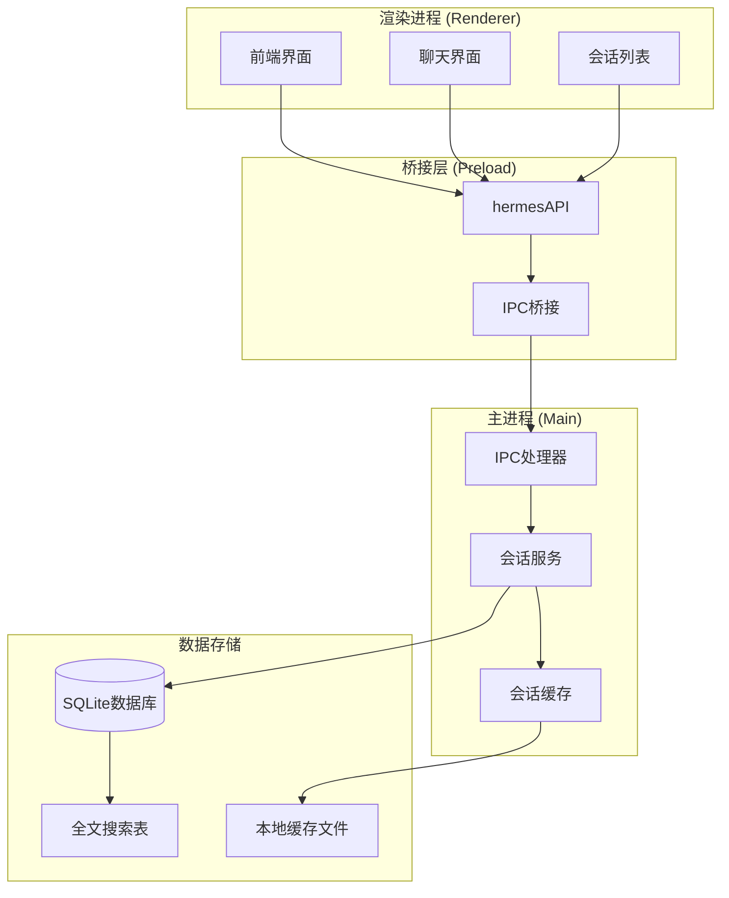
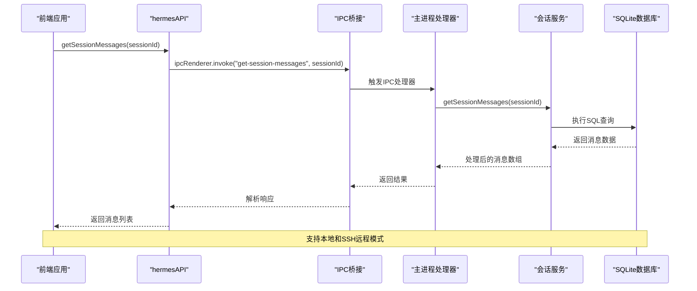
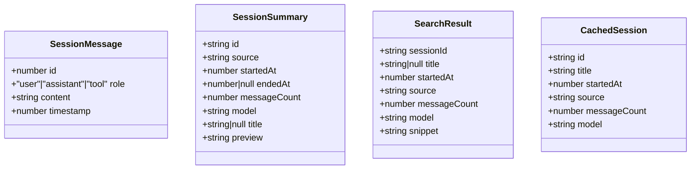
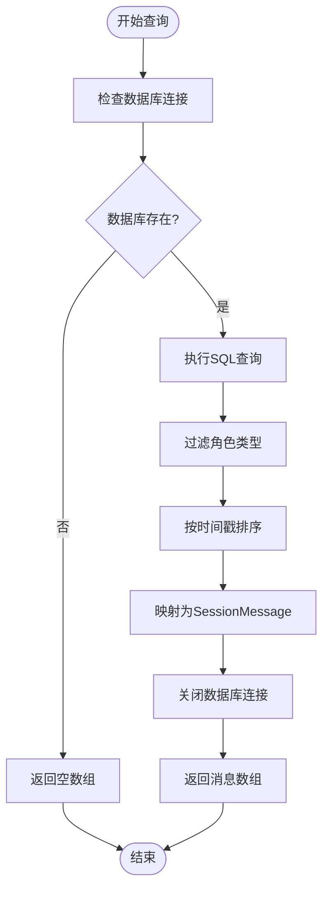
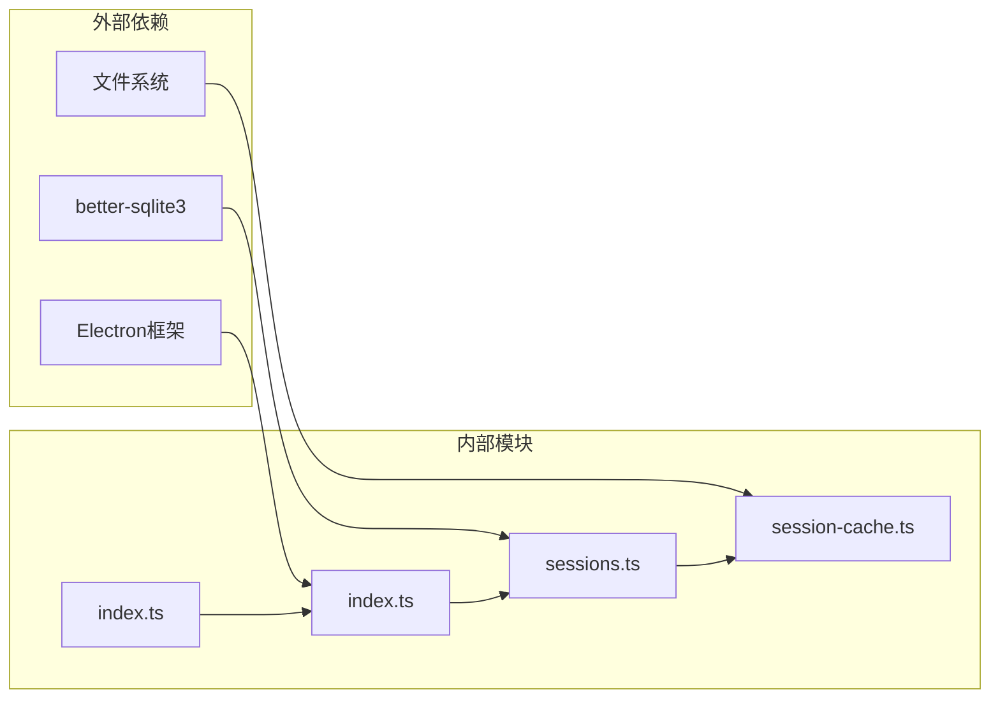

# 会话详情API

<cite>
**本文档引用的文件**
- [sessions.ts](file://src/main/sessions.ts)
- [index.ts](file://src/main/index.ts)
- [index.ts](file://src/preload/index.ts)
- [index.d.ts](file://src/preload/index.d.ts)
- [session-cache.ts](file://src/main/session-cache.ts)
- [Chat.tsx](file://src/renderer/src/screens/Chat/Chat.tsx)
- [Sessions.tsx](file://src/renderer/src/screens/Sessions/Sessions.tsx)
- [SKILL.md](file://.claude/agents/hermes-agent/SKILL.md)
</cite>

## 目录
1. [简介](#简介)
2. [项目结构](#项目结构)
3. [核心组件](#核心组件)
4. [架构概览](#架构概览)
5. [详细组件分析](#详细组件分析)
6. [依赖关系分析](#依赖关系分析)
7. [性能考虑](#性能考虑)
8. [故障排除指南](#故障排除指南)
9. [结论](#结论)

## 简介
本文档详细介绍了会话详情API，重点分析`getSessionMessages`等会话详情查询接口。该API用于获取指定会话的所有消息记录，支持消息数据结构定义、时间戳处理和角色标识管理。文档涵盖了消息检索、内容过滤和格式转换的方法，并提供了消息分页、增量加载和数据压缩的实现策略。同时包含完整的参数说明、返回值结构和性能优化建议。

## 项目结构
会话详情API在项目中的组织结构如下：

**图表来源**
- [index.ts:698-702](file://src/main/index.ts#L698-L702)
- [index.ts:262-271](file://src/preload/index.ts#L262-L271)
- [sessions.ts:158-186](file://src/main/sessions.ts#L158-L186)

**章节来源**
- [index.ts:698-702](file://src/main/index.ts#L698-L702)
- [index.ts:262-271](file://src/preload/index.ts#L262-L271)
- [sessions.ts:158-186](file://src/main/sessions.ts#L158-L186)

## 核心组件
会话详情API的核心组件包括：

### 1. 主进程会话服务
- `getSessionMessages`: 获取指定会话的消息列表
- `listSessions`: 列出会话摘要信息
- `searchSessions`: 搜索会话内容

### 2. 预加载API接口
- `hermesAPI.getSessionMessages`: 前端调用入口
- IPC通道注册和处理

### 3. 数据模型定义
- `SessionMessage`: 消息数据结构
- `SessionSummary`: 会话摘要结构
- `SearchResult`: 搜索结果结构

**章节来源**
- [sessions.ts:8-34](file://src/main/sessions.ts#L8-L34)
- [index.ts:698-702](file://src/main/index.ts#L698-L702)
- [index.ts:262-271](file://src/preload/index.ts#L262-L271)

## 架构概览
会话详情API采用分层架构设计，确保数据访问的安全性和效率：

**图表来源**
- [index.ts:262-271](file://src/preload/index.ts#L262-L271)
- [index.ts:698-702](file://src/main/index.ts#L698-L702)
- [sessions.ts:158-186](file://src/main/sessions.ts#L158-L186)

## 详细组件分析

### 会话消息数据结构
会话消息采用统一的数据结构定义：

**图表来源**
- [sessions.ts:19-34](file://src/main/sessions.ts#L19-L34)
- [session-cache.ts:15-22](file://src/main/session-cache.ts#L15-L22)

#### 时间戳处理机制
系统采用Unix时间戳格式处理时间信息：
- 存储格式：整数秒级时间戳
- 排序规则：按时间戳和消息ID双重排序
- 格式转换：前端可选择显示完整日期或相对时间

#### 角色标识系统
消息角色支持三种类型：
- `"user"`: 用户发送的消息
- `"assistant"`: AI助手回复
- `"tool"`: 工具执行结果（在查询时被过滤）

**章节来源**
- [sessions.ts:19-24](file://src/main/sessions.ts#L19-L24)
- [sessions.ts:163-182](file://src/main/sessions.ts#L163-L182)

### 消息检索实现
`getSessionMessages`函数实现了高效的消息检索：

**图表来源**
- [sessions.ts:158-186](file://src/main/sessions.ts#L158-L186)

查询逻辑包含以下关键特性：
- 只检索`user`和`assistant`角色的消息
- 过滤掉`content`为空的消息
- 使用双重排序确保消息顺序正确
- 支持SQLite FTS5全文搜索

**章节来源**
- [sessions.ts:158-186](file://src/main/sessions.ts#L158-L186)

### 内容过滤和格式转换
系统提供了多层内容处理机制：

#### 消息过滤策略
- 角色过滤：仅返回`user`和`assistant`消息
- 内容完整性：过滤`NULL`内容的消息
- 工具消息：自动排除工具执行结果

#### 格式转换方法
- 时间戳转换：从数据库格式转换为JavaScript时间戳
- 字符串清理：去除HTML标签和特殊字符
- 编码处理：确保文本内容正确编码

**章节来源**
- [sessions.ts:167-168](file://src/main/sessions.ts#L167-L168)

### 分页和增量加载
系统支持多种数据加载策略：

#### 分页实现
- 参数支持：`limit`和`offset`参数控制分页
- 性能优化：使用SQLite LIMIT/OFFSET实现高效分页
- 内存控制：避免一次性加载大量数据

#### 增量加载机制
- 会话缓存同步：定期从数据库同步新会话
- 智能缓存：使用Map数据结构实现O(1)查找
- 增量更新：只处理自上次同步以来的新数据

**章节来源**
- [sessions.ts:46-89](file://src/main/sessions.ts#L46-L89)
- [session-cache.ts:83-167](file://src/main/session-cache.ts#L83-L167)

### 数据压缩策略
系统采用多种策略优化数据传输和存储：

#### 本地缓存优化
- JSON文件缓存：会话摘要信息缓存到本地文件
- 增量同步：只同步新增或修改的会话
- 内存映射：使用Map结构提高查找性能

#### 数据库优化
- WAL模式：使用写前日志提升并发性能
- 索引优化：为常用查询字段建立索引
- 连接池管理：复用数据库连接减少开销

**章节来源**
- [session-cache.ts:60-75](file://src/main/session-cache.ts#L60-L75)
- [SKILL.md:547-553](file://.claude/agents/hermes-agent/SKILL.md#L547-L553)

## 依赖关系分析

**图表来源**
- [sessions.ts:1-6](file://src/main/sessions.ts#L1-L6)
- [index.ts:1-12](file://src/main/index.ts#L1-L12)
- [session-cache.ts:1-6](file://src/main/session-cache.ts#L1-L6)

### 组件耦合度
- **低耦合设计**：各模块职责明确，接口清晰
- **单向依赖**：渲染进程依赖预加载API，预加载API依赖主进程
- **可测试性**：每个模块都有独立的单元测试覆盖

**章节来源**
- [index.ts:82-88](file://src/main/index.ts#L82-L88)
- [index.ts:15-479](file://src/preload/index.ts#L15-L479)

## 性能考虑

### 查询性能优化
1. **索引策略**
   - 为`messages.session_id`建立索引
   - 为`messages.timestamp`建立索引
   - 为`sessions.started_at`建立索引

2. **查询优化**
   - 使用IN子句限制角色类型
   - 通过WHERE条件过滤NULL内容
   - 使用ORDER BY确保排序效率

3. **内存管理**
   - 及时关闭数据库连接
   - 使用流式处理大数据集
   - 避免内存泄漏

### 缓存策略
1. **多级缓存**
   - 会话摘要缓存：本地JSON文件
   - 数据库连接缓存：连接池管理
   - 前端状态缓存：React组件状态

2. **缓存失效**
   - 定期同步机制
   - 手动刷新触发
   - 数据变更通知

### 并发处理
1. **SQLite并发**
   - WAL模式支持并发读取
   - 事务隔离确保数据一致性
   - 锁重试机制避免死锁

2. **IPC通信**
   - 异步消息处理
   - 超时机制防止阻塞
   - 错误恢复策略

## 故障排除指南

### 常见问题诊断
1. **数据库连接失败**
   - 检查`state.db`文件是否存在
   - 验证文件权限设置
   - 确认SQLite扩展已正确安装

2. **查询结果为空**
   - 验证会话ID是否有效
   - 检查消息角色过滤条件
   - 确认消息内容不为空

3. **性能问题**
   - 分析查询执行计划
   - 检查索引使用情况
   - 监控内存使用情况

### 错误处理机制
系统实现了完善的错误处理：
- 数据库异常捕获和处理
- IPC通信超时处理
- 前端状态回滚机制

**章节来源**
- [sessions.ts:158-186](file://src/main/sessions.ts#L158-L186)
- [index.ts:698-702](file://src/main/index.ts#L698-L702)

## 结论
会话详情API提供了完整、高效的会话消息查询解决方案。通过合理的数据结构设计、多层缓存策略和性能优化措施，系统能够处理大规模会话数据的查询需求。API的设计遵循了现代桌面应用的最佳实践，既保证了功能的完整性，又确保了系统的稳定性和可维护性。

未来可以考虑的改进方向：
- 实现更细粒度的权限控制
- 增加数据压缩和传输优化
- 扩展消息格式支持（如富文本、多媒体）
- 提供更灵活的查询条件和过滤选项