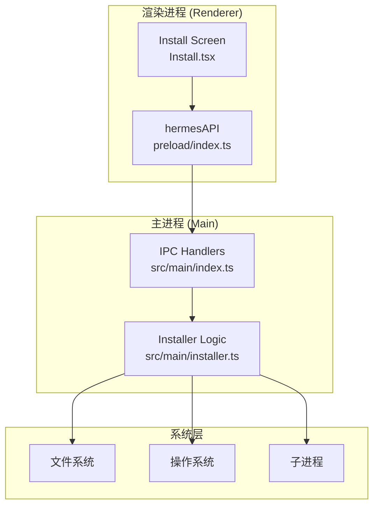
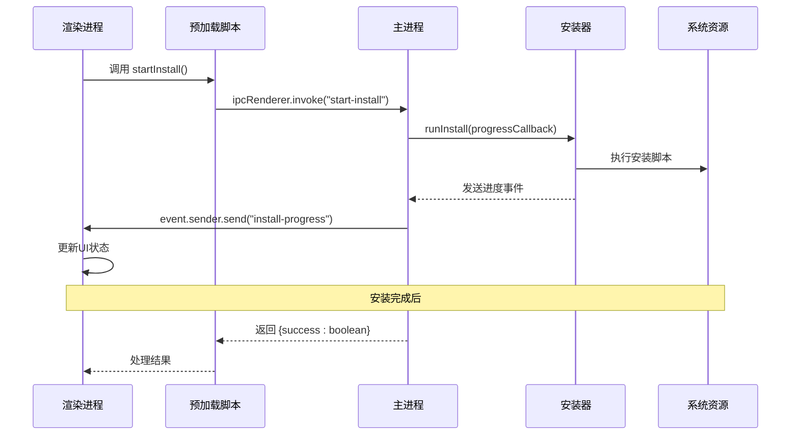
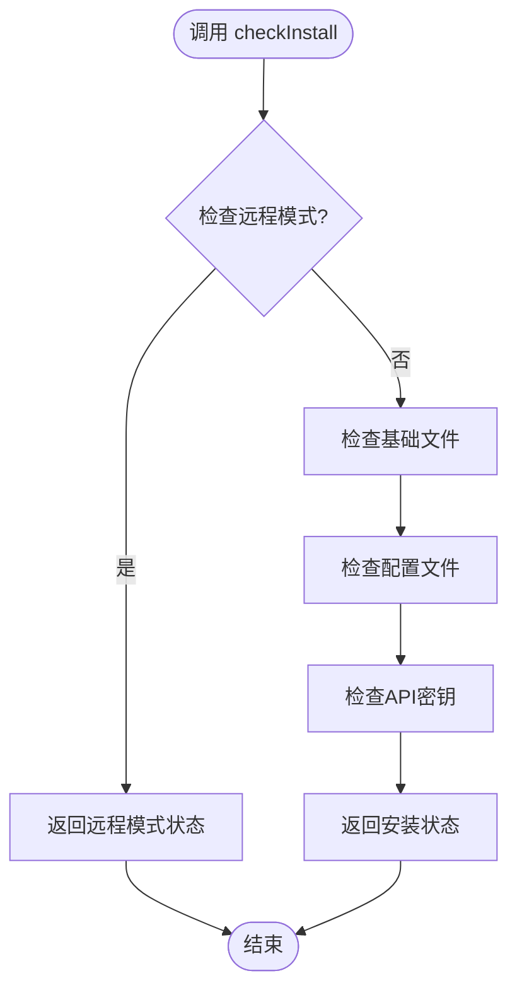
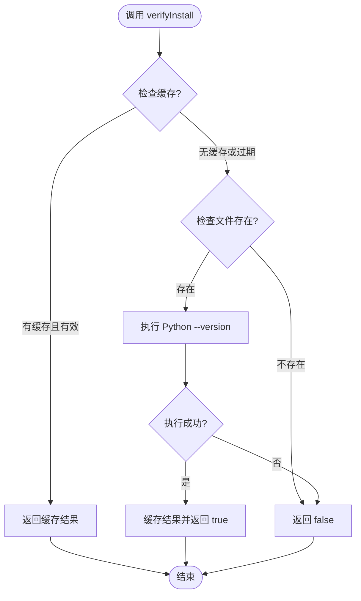
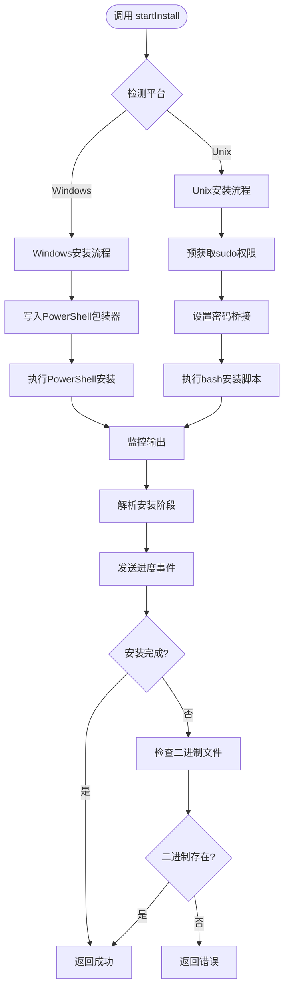
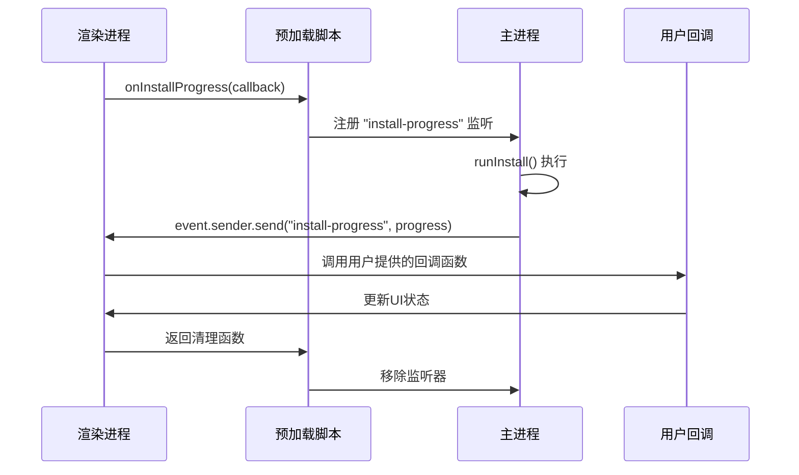
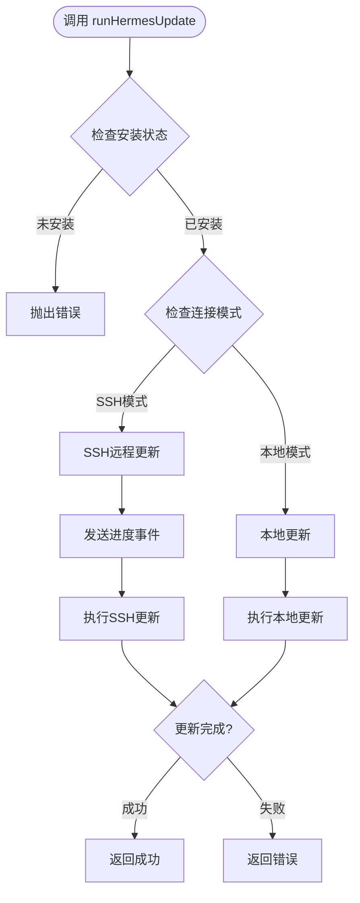
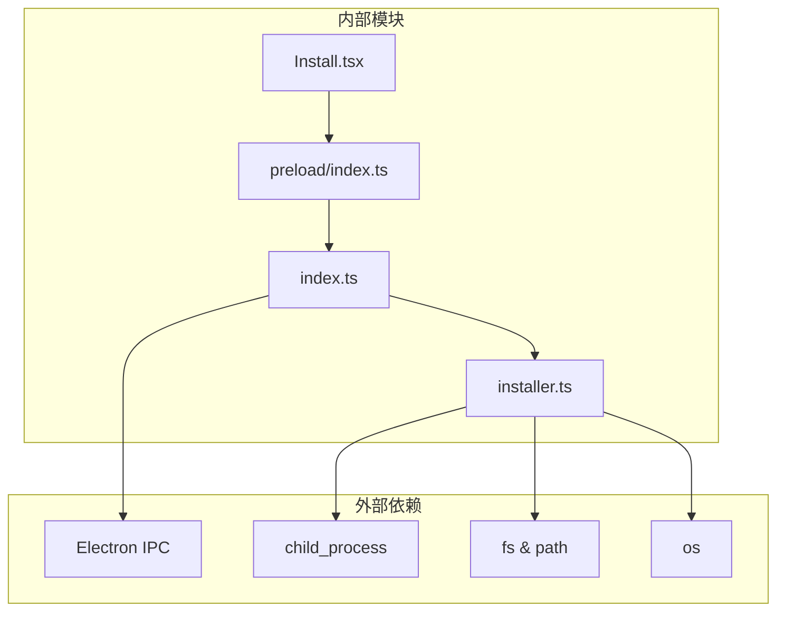

# 安装管理API

<cite>
**本文档引用的文件**
- [src/main/installer.ts](file://src/main/installer.ts)
- [src/main/index.ts](file://src/main/index.ts)
- [src/preload/index.ts](file://src/preload/index.ts)
- [src/preload/index.d.ts](file://src/preload/index.d.ts)
- [src/renderer/src/screens/Install/Install.tsx](file://src/renderer/src/screens/Install/Install.tsx)
- [src/shared/i18n/locales/zh-CN/install.ts](file://src/shared/i18n/locales/zh-CN/install.ts)
- [tests/installer-platform.test.ts](file://tests/installer-platform.test.ts)
- [tests/installer-utils.test.ts](file://tests/installer-utils.test.ts)
- [tests/ipc-handlers.test.ts](file://tests/ipc-handlers.test.ts)
</cite>

## 目录
1. [简介](#简介)
2. [项目结构](#项目结构)
3. [核心组件](#核心组件)
4. [架构概览](#架构概览)
5. [详细组件分析](#详细组件分析)
6. [依赖关系分析](#依赖关系分析)
7. [性能考虑](#性能考虑)
8. [故障排除指南](#故障排除指南)
9. [结论](#结论)

## 简介

安装管理API是Hermes Desktop应用的核心功能模块，负责管理Hermes Agent的完整生命周期。该API提供了从安装检测、验证到安装执行的完整IPC接口，支持跨平台操作（Windows和Unix系统），并具备完善的进度监控和错误处理机制。

本API主要包含以下核心功能：
- 安装状态检查（checkInstall）
- 深度安装验证（verifyInstall）  
- 安装执行（startInstall）
- 安装进度监听（onInstallProgress）
- 更新管理（runHermesUpdate）
- 迁移支持（runClawMigrate）

## 项目结构

安装管理API的实现采用分层架构设计，主要分布在三个层次：



**图表来源**
- [src/renderer/src/screens/Install/Install.tsx:1-171](file://src/renderer/src/screens/Install/Install.tsx#L1-L171)
- [src/preload/index.ts:15-52](file://src/preload/index.ts#L15-L52)
- [src/main/index.ts:290-307](file://src/main/index.ts#L290-L307)

**章节来源**
- [src/main/installer.ts:1-800](file://src/main/installer.ts#L1-L800)
- [src/main/index.ts:1-200](file://src/main/index.ts#L1-L200)

## 核心组件

### 安装状态数据结构

安装管理API定义了两个关键的数据结构来描述安装状态和进度信息：

```mermaid
classDiagram
class InstallStatus {
+boolean installed
+boolean configured
+boolean hasApiKey
+boolean verified
}
class InstallProgress {
+number step
+number totalSteps
+string title
+string detail
+string log
}
class HermesAPI {
+checkInstall() InstallStatus
+verifyInstall() boolean
+startInstall() {success : boolean, error? : string}
+onInstallProgress(callback) Function
}
HermesAPI --> InstallStatus : 返回
HermesAPI --> InstallProgress : 接收
```

**图表来源**
- [src/preload/index.d.ts:14-27](file://src/preload/index.d.ts#L14-L27)
- [src/preload/index.d.ts:29-36](file://src/preload/index.d.ts#L29-L36)

### 主要API接口

安装管理API提供以下核心接口：

1. **checkInstall** - 检查当前安装状态
2. **verifyInstall** - 验证安装的有效性  
3. **startInstall** - 启动安装过程
4. **onInstallProgress** - 监听安装进度事件

**章节来源**
- [src/preload/index.d.ts:30-36](file://src/preload/index.d.ts#L30-L36)
- [src/preload/index.ts:17-26](file://src/preload/index.ts#L17-L26)

## 架构概览

安装管理API采用Electron标准的IPC通信模式，实现了主进程和渲染进程之间的安全通信：



**图表来源**
- [src/main/index.ts:298-307](file://src/main/index.ts#L298-L307)
- [src/preload/index.ts:25-26](file://src/preload/index.ts#L25-L26)
- [src/renderer/src/screens/Install/Install.tsx:40-53](file://src/renderer/src/screens/Install/Install.tsx#L40-L53)

## 详细组件分析

### 安装状态检查 (checkInstall)

checkInstall方法提供快速的安装状态检查，不进行深度验证，主要用于UI状态判断。

**方法签名**: `checkInstall() -> Promise<InstallStatus>`

**返回值**:
- `installed`: 基础文件是否存在
- `configured`: 配置文件是否存在  
- `hasApiKey`: 是否配置了API密钥
- `verified`: 安装是否通过验证

**实现逻辑**:


**图表来源**
- [src/main/installer.ts:153-213](file://src/main/installer.ts#L153-L213)

**章节来源**
- [src/main/installer.ts:153-213](file://src/main/installer.ts#L153-L213)
- [src/main/index.ts:292-294](file://src/main/index.ts#L292-L294)

### 深度安装验证 (verifyInstall)

verifyInstall方法执行深度验证，确保Hermes Agent能够正常运行。

**方法签名**: `verifyInstall() -> Promise<boolean>`

**实现特点**:
- 使用缓存机制避免重复验证
- 通过执行Python命令验证安装有效性
- 支持超时控制和错误处理

**验证流程**:


**图表来源**
- [src/main/installer.ts:220-246](file://src/main/installer.ts#L220-L246)

**章节来源**
- [src/main/installer.ts:220-246](file://src/main/installer.ts#L220-L246)
- [src/main/index.ts:296](file://src/main/index.ts#L296)

### 安装执行 (startInstall)

startInstall方法启动完整的安装过程，支持跨平台操作。

**方法签名**: `startInstall() -> Promise<{success: boolean, error?: string}>`

**安装步骤**:
1. **Windows平台**: 使用PowerShell执行安装脚本
2. **Unix平台**: 预先获取sudo权限，然后执行安装
3. **进度监控**: 实时解析安装输出并发送进度事件

**安装流程**:


**图表来源**
- [src/main/installer.ts:517-650](file://src/main/installer.ts#L517-L650)
- [src/main/installer.ts:676-799](file://src/main/installer.ts#L676-L799)

**章节来源**
- [src/main/installer.ts:517-650](file://src/main/installer.ts#L517-L650)
- [src/main/index.ts:298-307](file://src/main/index.ts#L298-L307)

### 进度事件监听 (onInstallProgress)

onInstallProgress提供实时的安装进度监控能力。

**方法签名**: `onInstallProgress(callback) -> Function`

**进度数据结构**:
- `step`: 当前步骤编号 (1-7)
- `totalSteps`: 总步骤数 (固定为7)
- `title`: 步骤标题
- `detail`: 详细描述
- `log`: 日志内容

**事件处理流程**:


**图表来源**
- [src/preload/index.ts:28-52](file://src/preload/index.ts#L28-L52)
- [src/main/index.ts:300](file://src/main/index.ts#L300)

**章节来源**
- [src/preload/index.ts:28-52](file://src/preload/index.ts#L28-L52)
- [src/renderer/src/screens/Install/Install.tsx:34-59](file://src/renderer/src/screens/Install/Install.tsx#L34-L59)

### 更新管理 (runHermesUpdate)

runHermesUpdate提供Hermes Agent的更新功能，支持本地和SSH远程更新。

**方法签名**: `runHermesUpdate() -> Promise<{success: boolean, error?: string}>`

**更新流程**:


**图表来源**
- [src/main/index.ts:326-351](file://src/main/index.ts#L326-L351)

**章节来源**
- [src/main/index.ts:326-351](file://src/main/index.ts#L326-L351)

## 依赖关系分析

安装管理API的依赖关系体现了清晰的分层架构：



**图表来源**
- [src/main/installer.ts:1-16](file://src/main/installer.ts#L1-L16)
- [src/main/index.ts:1-30](file://src/main/index.ts#L1-L30)

**章节来源**
- [src/main/installer.ts:1-16](file://src/main/installer.ts#L1-L16)
- [src/main/index.ts:1-30](file://src/main/index.ts#L1-L30)

## 性能考虑

### 缓存策略

安装管理API采用了多级缓存机制来优化性能：

1. **验证缓存**: `verifyInstall()` 方法使用5分钟TTL缓存
2. **版本缓存**: `getHermesVersion()` 方法避免重复的Python进程调用
3. **路径缓存**: `getEnhancedPath()` 方法缓存增强的PATH环境变量

### 平台优化

针对不同平台进行了专门优化：

- **Windows PowerShell**: 自动选择pwsh.exe作为首选PowerShell
- **Unix sudo**: 预热sudo凭证缓存，避免交互式密码输入
- **路径增强**: 自动添加常见开发工具路径到PATH

**章节来源**
- [src/main/installer.ts:217-246](file://src/main/installer.ts#L217-L246)
- [src/main/installer.ts:249-296](file://src/main/installer.ts#L249-L296)
- [src/main/installer.ts:56-104](file://src/main/installer.ts#L56-L104)

## 故障排除指南

### 常见安装问题及解决方案

| 问题类型 | 错误表现 | 解决方案 |
|---------|---------|---------|
| 权限不足 | 安装在apt包管理器步骤卡住 | 预先提供sudo密码或手动授权 |
| 网络连接 | 下载依赖失败 | 检查网络连接或使用代理 |
| 磁盘空间 | 空间不足导致安装失败 | 清理磁盘空间后重试 |
| 杀毒软件 | 文件被隔离 | 添加例外或暂时关闭防护 |

### 错误处理机制

安装管理API提供了多层次的错误处理：

1. **文件存在性检查**: 在安装前验证必要文件
2. **进程超时控制**: 设置合理的超时时间
3. **降级策略**: 即使脚本退出码非零，只要二进制文件存在就视为成功
4. **详细日志记录**: 提供完整的安装日志便于调试

**章节来源**
- [src/main/installer.ts:624-639](file://src/main/installer.ts#L624-L639)
- [src/renderer/src/screens/Install/Install.tsx:99-139](file://src/renderer/src/screens/Install/Install.tsx#L99-L139)

### 异常恢复机制

当安装过程中出现异常时，系统提供以下恢复选项：

1. **重试安装**: 允许用户重新开始安装过程
2. **复制日志**: 方便用户收集诊断信息
3. **社区支持**: 提供官方Telegram群组链接
4. **手动安装**: 支持通过终端手动执行安装脚本

**章节来源**
- [src/renderer/src/screens/Install/Install.tsx:104-136](file://src/renderer/src/screens/Install/Install.tsx#L104-L136)

## 结论

安装管理API为Hermes Desktop提供了完整、可靠的安装和管理解决方案。通过精心设计的IPC接口、跨平台兼容性和强大的错误处理机制，确保了用户能够获得流畅的安装体验。

主要优势包括：
- **跨平台支持**: 统一的API接口支持Windows和Unix系统
- **实时进度监控**: 完整的安装进度反馈机制
- **智能错误处理**: 多层次的错误检测和恢复策略
- **性能优化**: 缓存机制和平台特定优化
- **用户体验**: 友好的错误提示和社区支持

该API的设计充分考虑了生产环境的需求，为Hermes Desktop的稳定运行奠定了坚实基础。