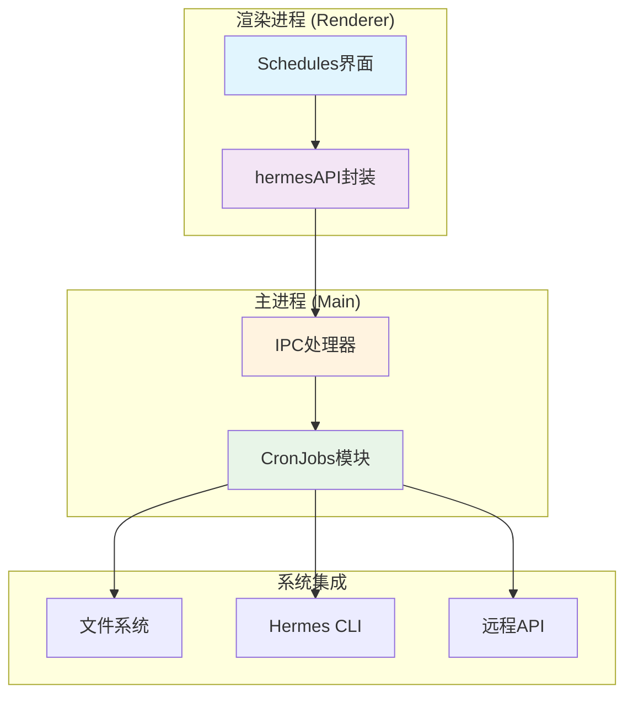
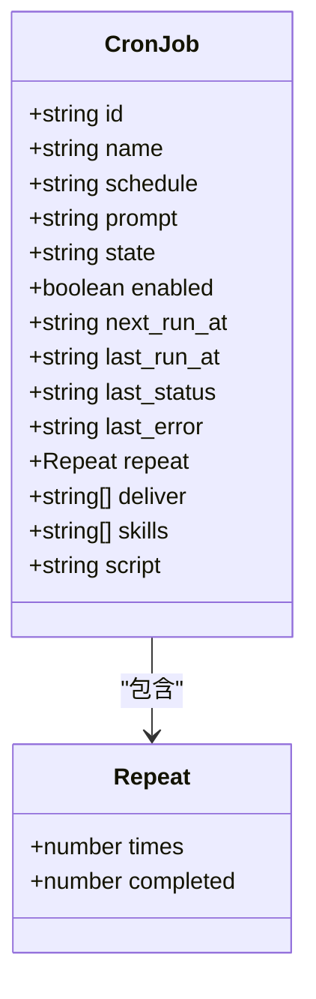
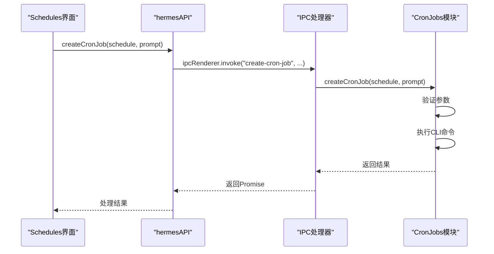
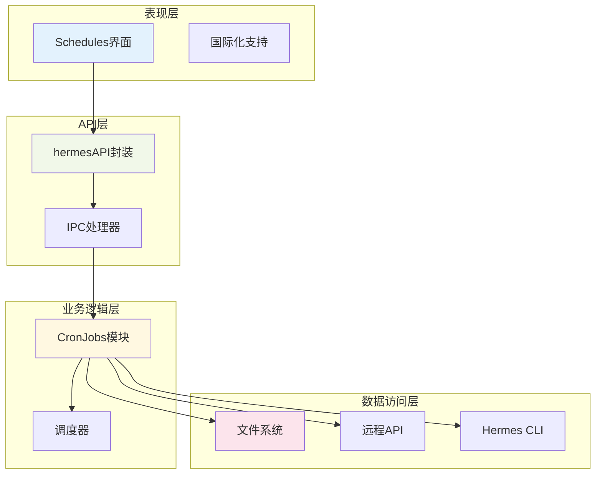
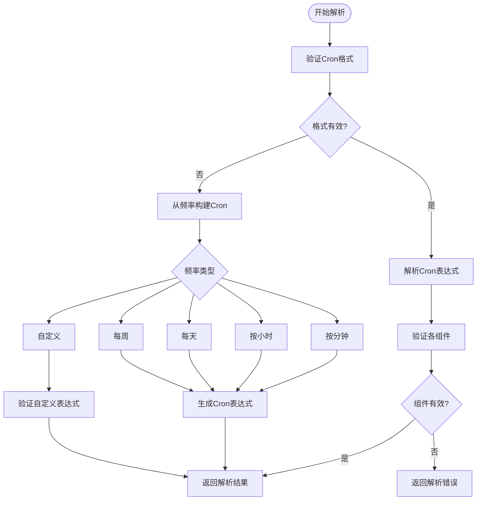
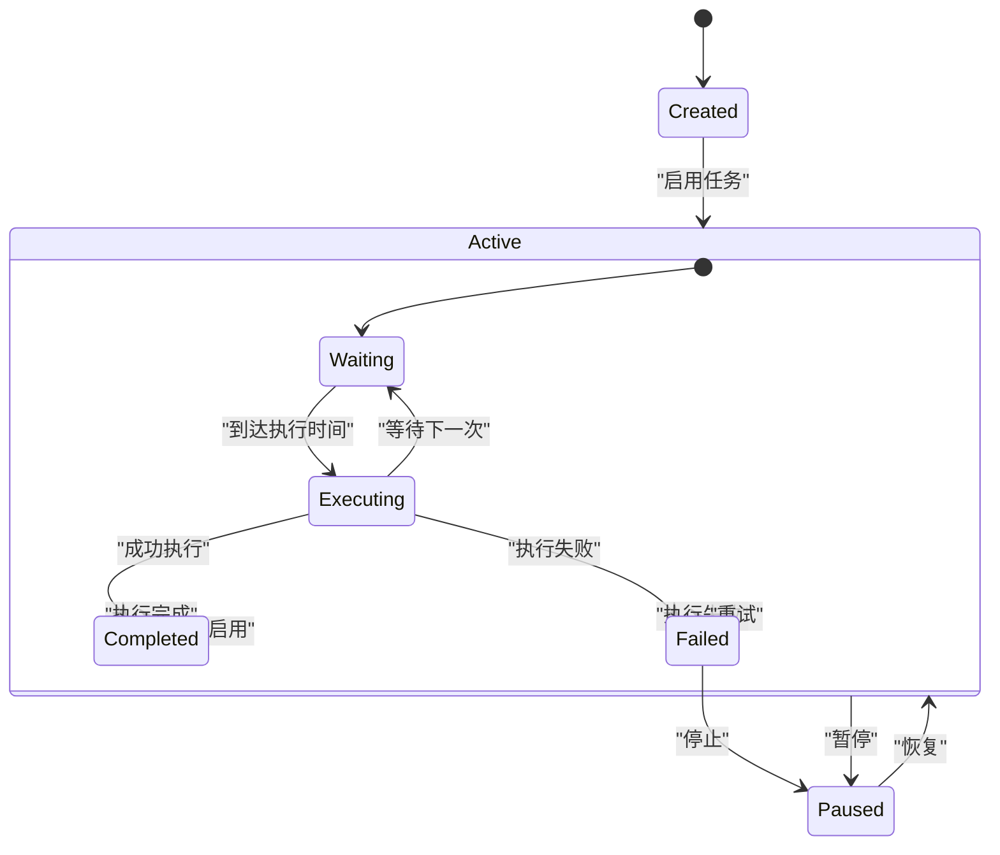
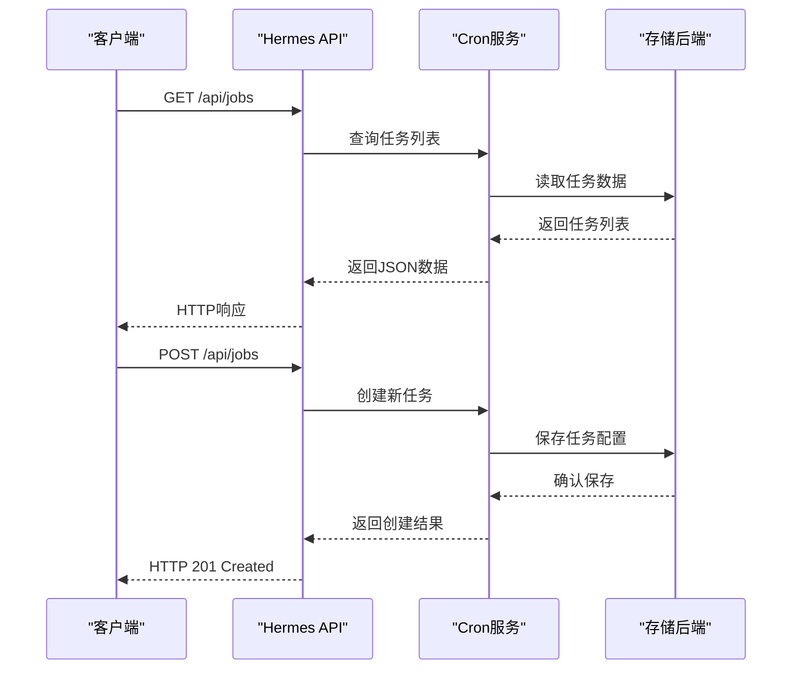
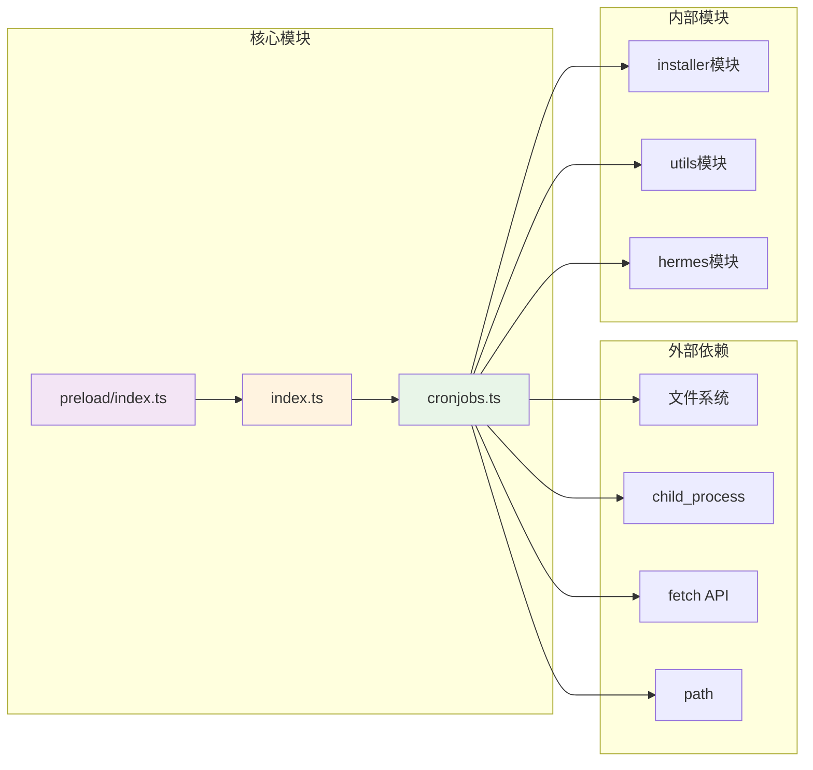

# 定时任务API

<cite>
**本文档引用的文件**
- [src/main/cronjobs.ts](file://src/main/cronjobs.ts)
- [src/main/index.ts](file://src/main/index.ts)
- [src/preload/index.ts](file://src/preload/index.ts)
- [src/renderer/src/screens/Schedules/Schedules.tsx](file://src/renderer/src/screens/Schedules/Schedules.tsx)
- [src/shared/i18n/locales/zh-CN/schedules.ts](file://src/shared/i18n/locales/zh-CN/schedules.ts)
- [src/shared/i18n/locales/en/schedules.ts](file://src/shared/i18n/locales/en/schedules.ts)
- [tests/ipc-handlers.test.ts](file://tests/ipc-handlers.test.ts)
</cite>

## 目录
1. [简介](#简介)
2. [项目结构](#项目结构)
3. [核心组件](#核心组件)
4. [架构概览](#架构概览)
5. [详细组件分析](#详细组件分析)
6. [依赖关系分析](#依赖关系分析)
7. [性能考虑](#性能考虑)
8. [故障排除指南](#故障排除指南)
9. [结论](#结论)

## 简介

定时任务API是Hermes桌面应用中的核心功能模块，允许用户创建、管理和执行基于Cron表达式的自动化任务。该模块提供了完整的任务生命周期管理，包括任务创建、状态跟踪、执行控制和结果交付。

该API支持本地模式和远程模式两种运行方式，通过Electron的IPC机制实现前后端通信。系统集成了Cron表达式解析、任务调度机制和执行状态跟踪功能，为用户提供了一个强大而灵活的自动化任务管理平台。

## 项目结构

定时任务API的实现遵循Electron应用的标准架构模式，主要分布在以下三个层次：

**图表来源**
- [src/main/cronjobs.ts:1-281](file://src/main/cronjobs.ts#L1-L281)
- [src/main/index.ts:934-963](file://src/main/index.ts#L934-L963)
- [src/preload/index.ts:578-640](file://src/preload/index.ts#L578-L640)

**章节来源**
- [src/main/cronjobs.ts:1-281](file://src/main/cronjobs.ts#L1-L281)
- [src/main/index.ts:934-963](file://src/main/index.ts#L934-L963)
- [src/preload/index.ts:578-640](file://src/preload/index.ts#L578-L640)

## 核心组件

定时任务API由四个核心组件构成，每个组件都有明确的职责分工：

### CronJob数据模型

CronJob接口定义了任务的完整数据结构，包括基本属性、状态信息和执行历史：

**图表来源**
- [src/main/cronjobs.ts:9-24](file://src/main/cronjobs.ts#L9-L24)

### IPC通信层

IPC层负责前后端之间的消息传递，提供了类型安全的API封装：

**图表来源**
- [src/preload/index.ts:601-615](file://src/preload/index.ts#L601-L615)
- [src/main/index.ts:940-949](file://src/main/index.ts#L940-L949)

**章节来源**
- [src/main/cronjobs.ts:9-24](file://src/main/cronjobs.ts#L9-L24)
- [src/preload/index.ts:578-640](file://src/preload/index.ts#L578-L640)
- [src/main/index.ts:934-963](file://src/main/index.ts#L934-L963)

## 架构概览

定时任务API采用分层架构设计，确保了良好的可维护性和扩展性：

**图表来源**
- [src/renderer/src/screens/Schedules/Schedules.tsx:56-92](file://src/renderer/src/screens/Schedules/Schedules.tsx#L56-L92)
- [src/preload/index.ts:578-640](file://src/preload/index.ts#L578-L640)
- [src/main/cronjobs.ts:87-136](file://src/main/cronjobs.ts#L87-L136)

## 详细组件分析

### Cron表达式解析与验证

Cron表达式解析是定时任务的核心功能之一，系统支持标准的Cron格式和用户友好的频率选择器：

**图表来源**
- [src/renderer/src/screens/Schedules/Schedules.tsx:125-163](file://src/renderer/src/screens/Schedules/Schedules.tsx#L125-L163)

### 任务调度机制

系统实现了完整的任务调度机制，支持多种调度策略：

**图表来源**
- [src/main/cronjobs.ts:14-24](file://src/main/cronjobs.ts#L14-L24)

### 远程模式集成

系统支持远程模式，允许通过HTTP API管理定时任务：

**图表来源**
- [src/main/cronjobs.ts:91-113](file://src/main/cronjobs.ts#L91-L113)
- [src/main/cronjobs.ts:178-197](file://src/main/cronjobs.ts#L178-L197)

**章节来源**
- [src/renderer/src/screens/Schedules/Schedules.tsx:125-163](file://src/renderer/src/screens/Schedules/Schedules.tsx#L125-L163)
- [src/main/cronjobs.ts:87-136](file://src/main/cronjobs.ts#L87-L136)
- [src/main/cronjobs.ts:178-280](file://src/main/cronjobs.ts#L178-L280)

## 依赖关系分析

定时任务API的依赖关系清晰明确，遵循单一职责原则：

**图表来源**
- [src/main/cronjobs.ts:1-7](file://src/main/cronjobs.ts#L1-L7)
- [src/main/index.ts:113-119](file://src/main/index.ts#L113-L119)
- [src/preload/index.ts:578-640](file://src/preload/index.ts#L578-L640)

**章节来源**
- [src/main/cronjobs.ts:1-7](file://src/main/cronjobs.ts#L1-L7)
- [src/main/index.ts:113-119](file://src/main/index.ts#L113-L119)
- [src/preload/index.ts:578-640](file://src/preload/index.ts#L578-L640)

## 性能考虑

定时任务API在设计时充分考虑了性能优化：

### 异步操作优化
- 使用异步文件读取避免阻塞主线程
- 实现超时机制防止长时间阻塞
- 缓存远程API响应减少网络请求

### 内存管理
- 及时清理事件监听器
- 合理使用Promise避免内存泄漏
- 控制并发执行数量

### 错误处理策略
- 实现重试机制处理临时故障
- 提供详细的错误信息便于调试
- 确保异常情况下的资源清理

## 故障排除指南

### 常见问题及解决方案

**任务无法创建**
- 检查Cron表达式格式是否正确
- 验证prompt内容是否为空
- 确认deliver目标是否有效

**任务无法执行**
- 检查系统时间和时区设置
- 验证Hermes CLI是否正常工作
- 查看任务状态和错误信息

**远程模式连接失败**
- 确认API地址和认证信息
- 检查网络连接状态
- 验证防火墙设置

**章节来源**
- [src/main/cronjobs.ts:133-135](file://src/main/cronjobs.ts#L133-L135)
- [src/main/cronjobs.ts:96-97](file://src/main/cronjobs.ts#L96-L97)

## 结论

定时任务API为Hermes桌面应用提供了完整的自动化任务管理功能。通过清晰的架构设计、完善的错误处理机制和灵活的配置选项，该模块能够满足各种复杂的定时任务需求。

系统的主要优势包括：
- 支持本地和远程两种运行模式
- 提供直观的用户界面和丰富的配置选项
- 实现了可靠的错误处理和状态跟踪
- 具备良好的性能表现和扩展性

未来可以考虑的功能增强包括：任务依赖管理、更精细的执行统计、任务模板系统等，这些改进将进一步提升用户体验和系统功能完整性。