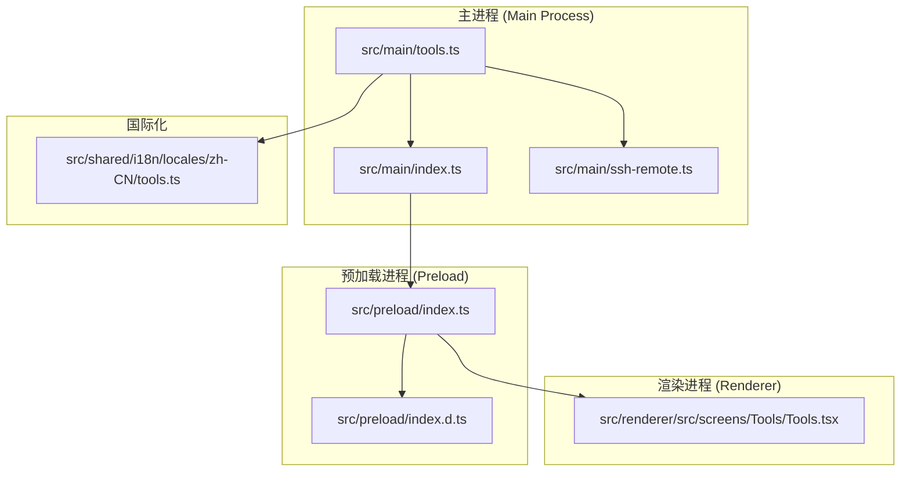
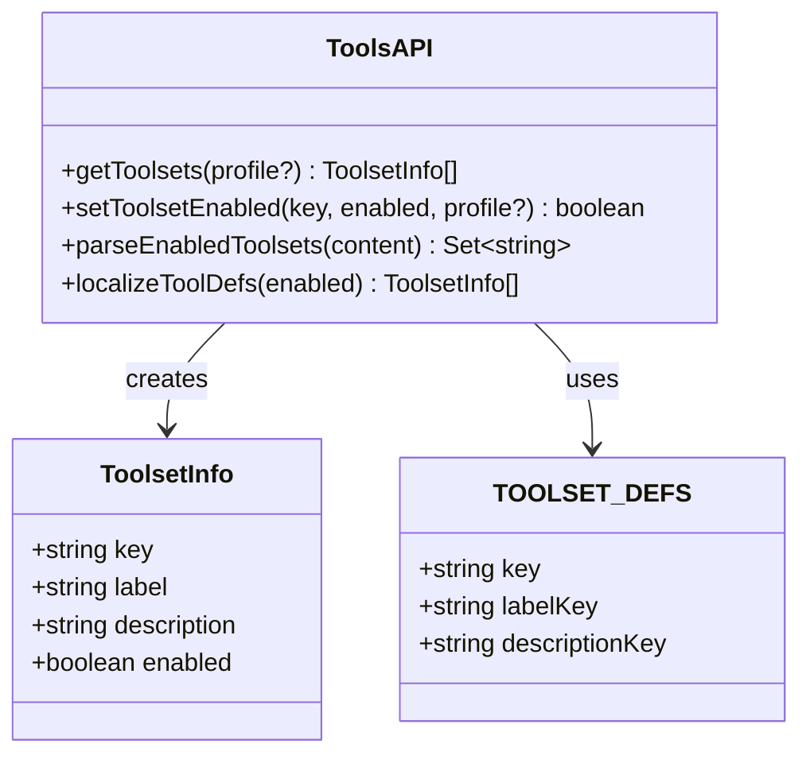
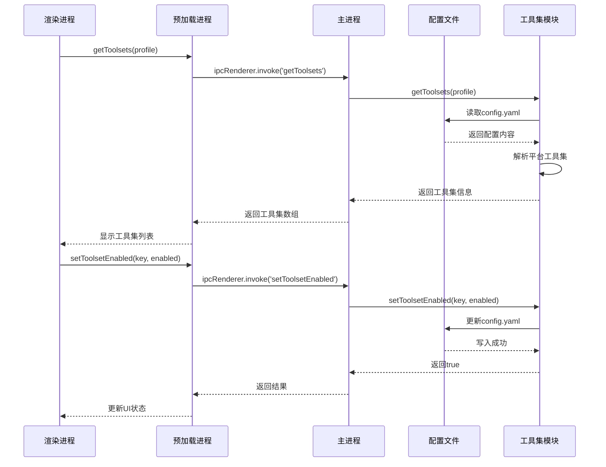
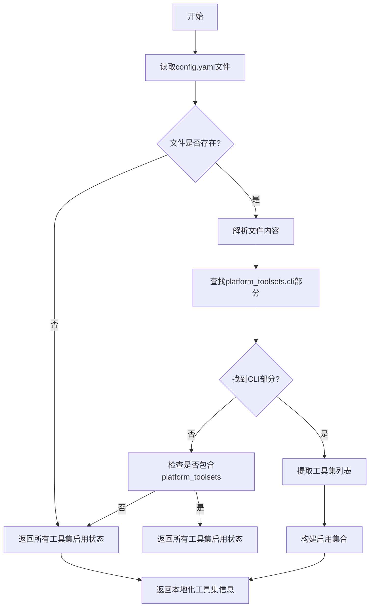
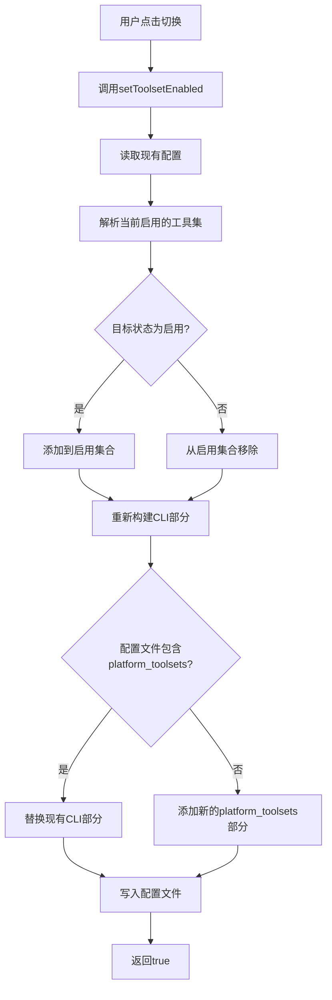
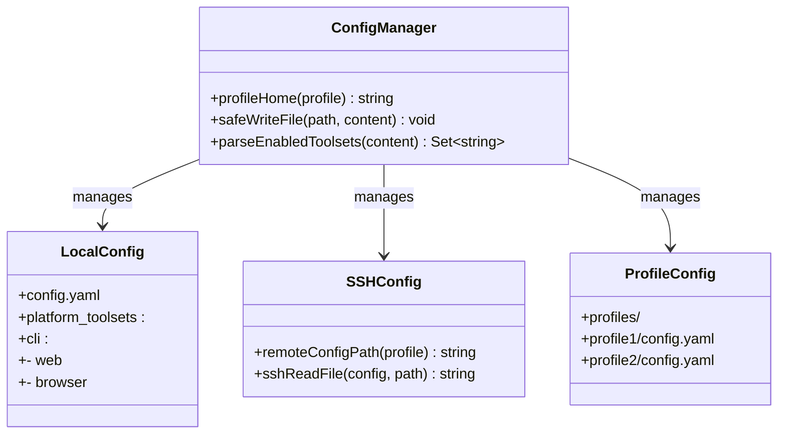
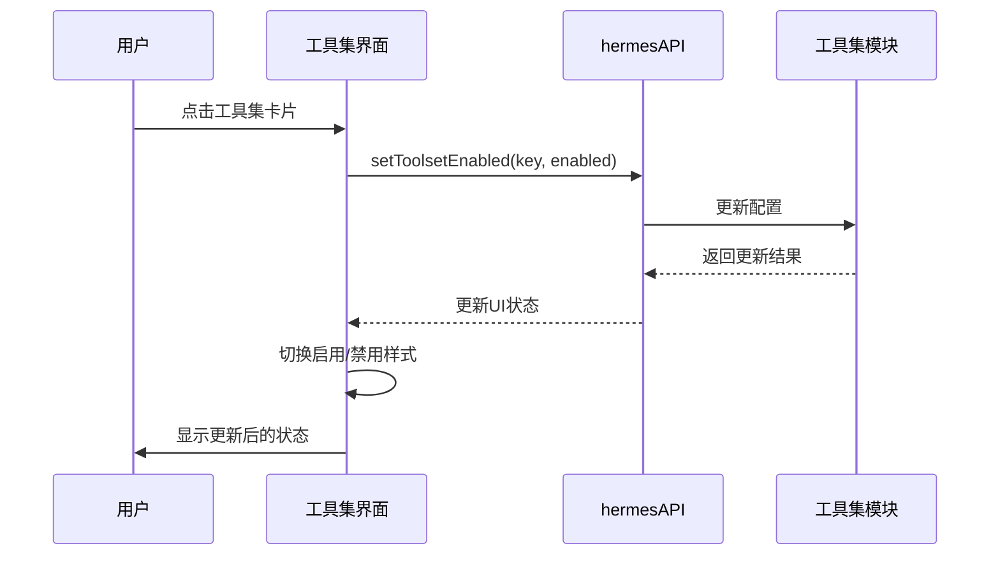
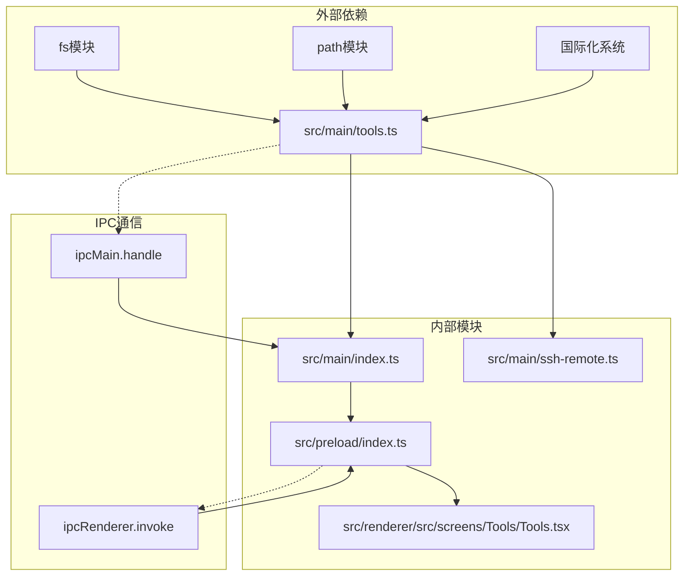

# 工具集管理API

<cite>
**本文档引用的文件**
- [src/main/tools.ts](file://src/main/tools.ts)
- [src/renderer/src/screens/Tools/Tools.tsx](file://src/renderer/src/screens/Tools/Tools.tsx)
- [src/main/index.ts](file://src/main/index.ts)
- [src/preload/index.ts](file://src/preload/index.ts)
- [src/preload/index.d.ts](file://src/preload/index.d.ts)
- [src/main/ssh-remote.ts](file://src/main/ssh-remote.ts)
- [src/shared/i18n/locales/zh-CN/tools.ts](file://src/shared/i18n/locales/zh-CN/tools.ts)
</cite>

## 目录
1. [简介](#简介)
2. [项目结构](#项目结构)
3. [核心组件](#核心组件)
4. [架构概览](#架构概览)
5. [详细组件分析](#详细组件分析)
6. [依赖关系分析](#依赖关系分析)
7. [性能考虑](#性能考虑)
8. [故障排除指南](#故障排除指南)
9. [结论](#结论)

## 简介

工具集管理API是Hermes桌面应用中的核心功能模块，负责管理系统中14种不同的工具集（toolsets）。这些工具集包括网络访问、浏览器操作、终端执行、文件系统操作、代码执行、视觉识别、图像生成、文本转语音、技能管理、记忆存储、会话搜索、澄清问题、代理委托、定时任务、多智能体协作和待办事项等功能。

该API提供了完整的工具集生命周期管理，包括发现、启用/禁用控制、配置管理、动态加载、状态监控和依赖检查等功能。通过统一的接口，用户可以在图形界面中直观地管理各种工具集的可用性和功能。

## 项目结构

工具集管理API在项目中的组织结构如下：

**图表来源**
- [src/main/tools.ts:1-294](file://src/main/tools.ts#L1-L294)
- [src/main/index.ts:103](file://src/main/index.ts#L103)
- [src/preload/index.ts:14](file://src/preload/index.ts#L14)

**章节来源**
- [src/main/tools.ts:1-294](file://src/main/tools.ts#L1-L294)
- [src/renderer/src/screens/Tools/Tools.tsx:1-388](file://src/renderer/src/screens/Tools/Tools.tsx#L1-L388)

## 核心组件

### 工具集定义系统

工具集管理API基于一个预定义的工具集列表，包含14种核心工具集：

| 工具集键 | 功能描述 | 国际化键 |
|---------|----------|----------|
| web | 网络浏览和HTTP请求 | tools.web.label/description |
| browser | 浏览器自动化 | tools.browser.label/description |
| terminal | 终端命令执行 | tools.terminal.label/description |
| file | 文件系统操作 | tools.file.label/description |
| code_execution | 代码执行能力 | tools.code_execution.label/description |
| vision | 视觉识别和图像处理 | tools.vision.label/description |
| image_gen | 图像生成工具 | tools.image_gen.label/description |
| tts | 文本转语音 | tools.tts.label/description |
| skills | 技能管理 | tools.skills.label/description |
| memory | 记忆存储 | tools.memory.label/description |
| session_search | 会话搜索 | tools.session_search.label/description |
| clarify | 问题澄清 | tools.clarify.label/description |
| delegation | 代理委托 | tools.delegation.label/description |
| cronjob | 定时任务 | tools.cronjob.label/description |
| moa | 多智能体协作 | tools.moa.label/description |
| todo | 待办事项管理 | tools.todo.label/description |

### 数据结构设计

**图表来源**
- [src/main/tools.ts:7-12](file://src/main/tools.ts#L7-L12)
- [src/main/tools.ts:14-99](file://src/main/tools.ts#L14-L99)

**章节来源**
- [src/main/tools.ts:7-111](file://src/main/tools.ts#L7-L111)

## 架构概览

工具集管理API采用分层架构设计，确保了良好的模块分离和可维护性：

**图表来源**
- [src/main/index.ts:784](file://src/main/index.ts#L784)
- [src/main/index.ts:791](file://src/main/index.ts#L791)
- [src/preload/index.ts:339](file://src/preload/index.ts#L339)
- [src/preload/index.ts:344](file://src/preload/index.ts#L344)

## 详细组件分析

### 工具集发现机制

工具集发现机制通过解析配置文件中的`platform_toolsets.cli`部分来确定哪些工具集当前处于启用状态：

**图表来源**
- [src/main/tools.ts:170](file://src/main/tools.ts#L170)
- [src/main/tools.ts:178](file://src/main/tools.ts#L178)

**章节来源**
- [src/main/tools.ts:170-191](file://src/main/tools.ts#L170-L191)

### 启用/禁用控制机制

工具集的启用和禁用通过修改配置文件中的`platform_toolsets.cli`部分来实现：

**图表来源**
- [src/main/tools.ts:193](file://src/main/tools.ts#L193)
- [src/main/tools.ts:201](file://src/main/tools.ts#L201)

**章节来源**
- [src/main/tools.ts:193-293](file://src/main/tools.ts#L193-L293)

### 配置管理机制

配置管理机制支持多种配置场景，包括本地配置、SSH远程配置和不同配置文件格式：

**图表来源**
- [src/main/tools.ts:1](file://src/main/tools.ts#L1)
- [src/main/ssh-remote.ts:454](file://src/main/ssh-remote.ts#L454)

**章节来源**
- [src/main/tools.ts:1](file://src/main/tools.ts#L1)
- [src/main/ssh-remote.ts:454-465](file://src/main/ssh-remote.ts#L454-L465)

### 国际化支持

工具集管理API完全支持国际化，通过翻译键来提供多语言支持：

**章节来源**
- [src/shared/i18n/locales/zh-CN/tools.ts:1-200](file://src/shared/i18n/locales/zh-CN/tools.ts)

### 用户界面集成

渲染进程中的工具集管理界面提供了直观的用户交互体验：

**图表来源**
- [src/renderer/src/screens/Tools/Tools.tsx:280](file://src/renderer/src/screens/Tools/Tools.tsx#L280)
- [src/renderer/src/screens/Tools/Tools.tsx:287](file://src/renderer/src/screens/Tools/Tools.tsx#L287)

**章节来源**
- [src/renderer/src/screens/Tools/Tools.tsx:259-388](file://src/renderer/src/screens/Tools/Tools.tsx#L259-L388)

## 依赖关系分析

工具集管理API的依赖关系图展示了各组件之间的交互模式：

**图表来源**
- [src/main/tools.ts:1](file://src/main/tools.ts#L1)
- [src/main/index.ts:103](file://src/main/index.ts#L103)
- [src/preload/index.ts:14](file://src/preload/index.ts#L14)

**章节来源**
- [src/main/index.ts:103](file://src/main/index.ts#L103)
- [src/preload/index.ts:14](file://src/preload/index.ts#L14)

## 性能考虑

工具集管理API在设计时充分考虑了性能优化：

### 缓存策略
- 工具集状态在内存中缓存，避免频繁的文件I/O操作
- 配置文件解析结果进行缓存，减少重复解析开销

### 异步处理
- 所有文件操作都采用异步方式，避免阻塞主线程
- IPC通信使用Promise模式，提供非阻塞的跨进程调用

### 内存优化
- 使用Set数据结构存储启用的工具集，提供O(1)的查找性能
- 按需加载国际化资源，避免不必要的内存占用

## 故障排除指南

### 常见问题及解决方案

**问题1: 工具集状态不更新**
- 检查配置文件权限是否正确
- 确认IPC通信是否正常工作
- 验证工具集名称是否正确

**问题2: SSH远程配置无法保存**
- 检查SSH连接是否稳定
- 验证远程路径权限
- 确认远程服务器配置文件格式

**问题3: 国际化显示异常**
- 检查翻译键是否存在于对应的语言文件中
- 验证国际化系统的加载顺序
- 确认语言设置是否正确

**章节来源**
- [src/main/tools.ts:188](file://src/main/tools.ts#L188)
- [src/main/tools.ts:290](file://src/main/tools.ts#L290)

## 结论

工具集管理API为Hermes桌面应用提供了完整、灵活且用户友好的工具集管理解决方案。通过清晰的架构设计、完善的国际化支持和高效的性能优化，该API能够满足复杂应用场景下的工具集管理需求。

主要优势包括：
- **模块化设计**：清晰的职责分离和良好的可维护性
- **跨平台支持**：同时支持本地和SSH远程配置管理
- **用户体验友好**：直观的图形界面和即时的状态反馈
- **国际化完善**：全面的多语言支持
- **性能优化**：高效的缓存策略和异步处理机制

该API为Hermes生态系统中的工具集管理奠定了坚实的基础，为未来的功能扩展和维护提供了良好的框架。