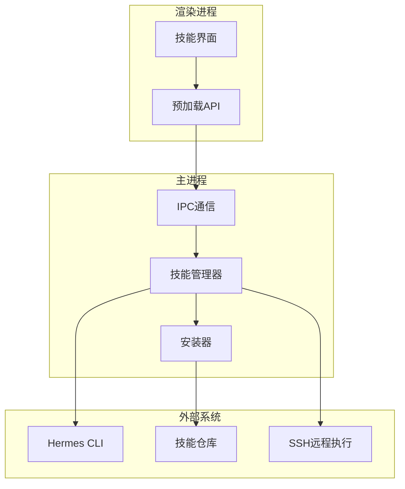
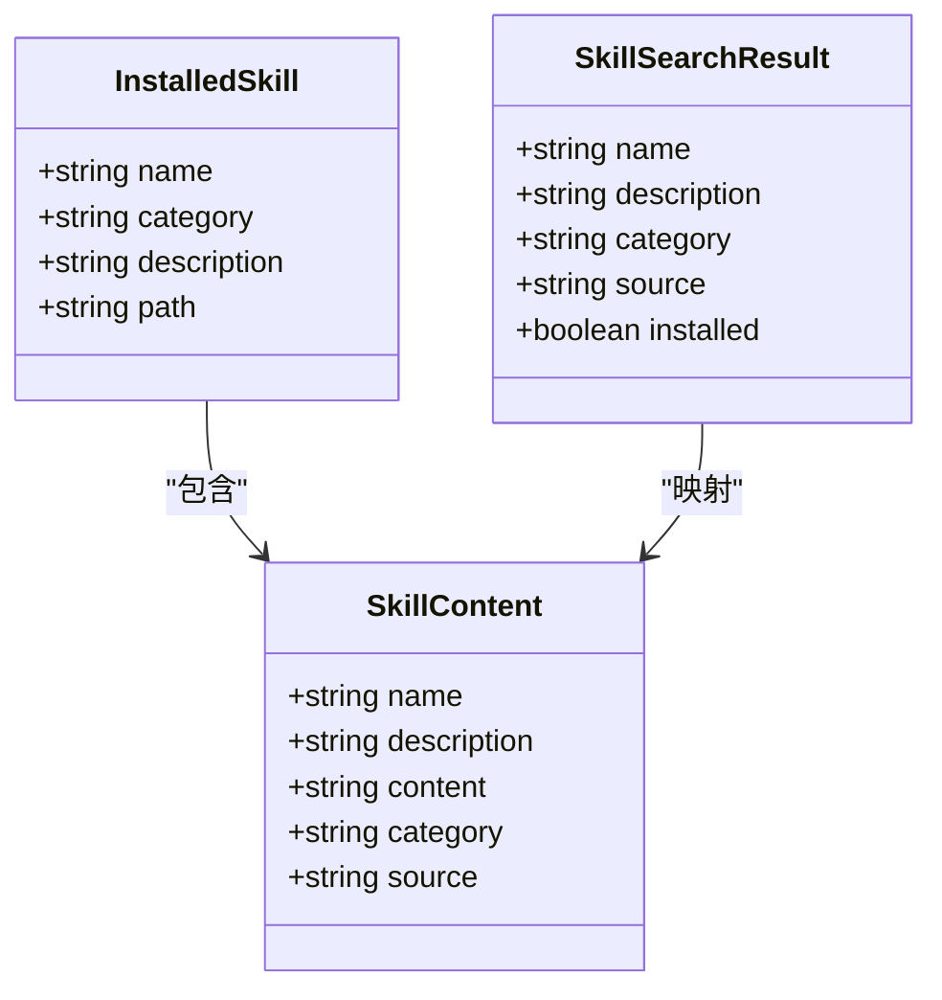
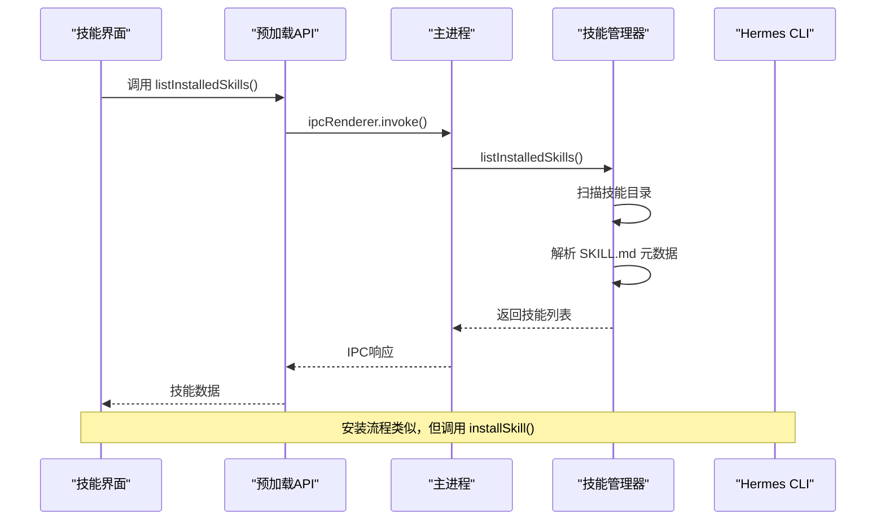
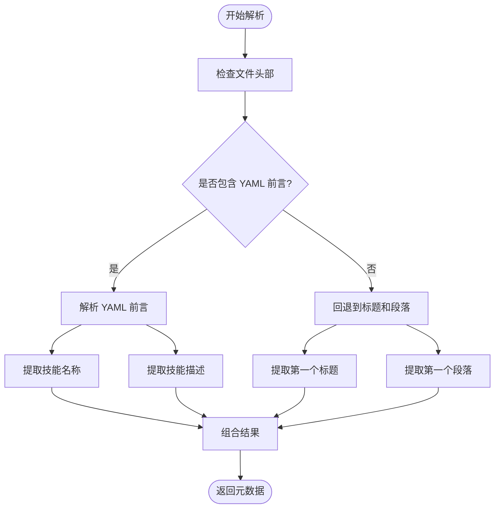
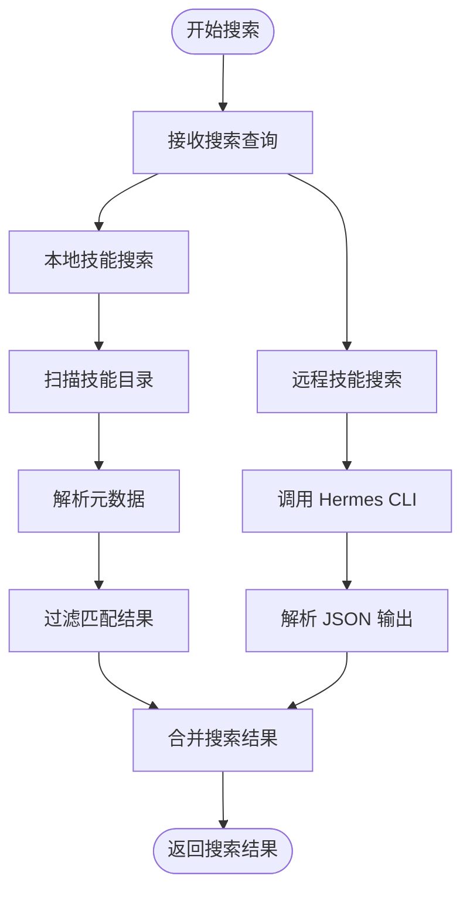
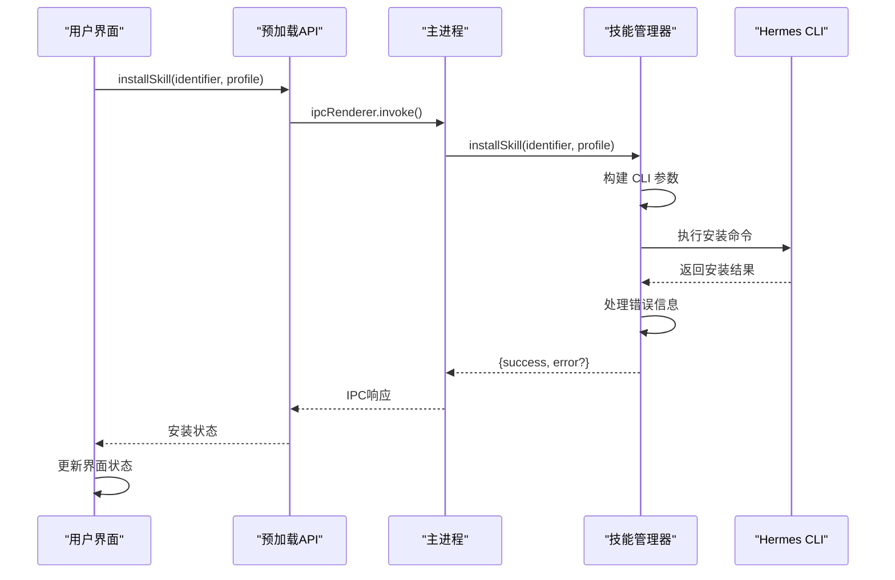
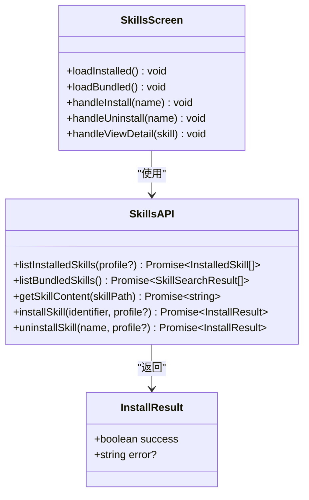
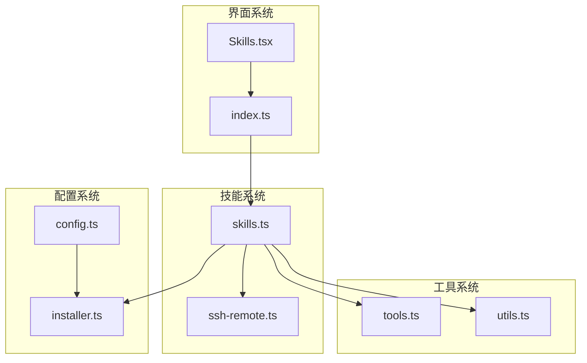

# 技能系统API

<cite>
**本文档引用的文件**
- [skills.ts](file://src/main/skills.ts)
- [index.ts](file://src/main/index.ts)
- [index.ts](file://src/preload/index.ts)
- [Skills.tsx](file://src/renderer/src/screens/Skills/Skills.tsx)
- [installer.ts](file://src/main/installer.ts)
- [ssh-remote.ts](file://src/main/ssh-remote.ts)
- [skills.ts](file://src/shared/i18n/locales/zh-CN/skills.ts)
- [skills-lock.json](file://skills-lock.json)
</cite>

## 目录
1. [简介](#简介)
2. [项目结构](#项目结构)
3. [核心组件](#核心组件)
4. [架构概览](#架构概览)
5. [详细组件分析](#详细组件分析)
6. [依赖关系分析](#依赖关系分析)
7. [性能考虑](#性能考虑)
8. [故障排除指南](#故障排除指南)
9. [结论](#结论)

## 简介

技能系统是 Hermes 桌面应用的核心功能模块，允许用户管理和使用各种 AI 技能。该系统提供了完整的技能生命周期管理，包括技能发现、安装、卸载、内容解析和依赖管理。技能以 Markdown 格式定义，包含 YAML 前言元数据，支持复杂的技能分类和版本控制。

## 项目结构

技能系统采用分层架构设计，主要由以下组件构成：

**图表来源**
- [Skills.tsx:1-363](file://src/renderer/src/screens/Skills/Skills.tsx#L1-363)
- [index.ts:352-379](file://src/preload/index.ts#L352-379)
- [index.ts:796-824](file://src/main/index.ts#L796-824)

**章节来源**
- [skills.ts:1-293](file://src/main/skills.ts#L1-293)
- [index.ts:796-824](file://src/main/index.ts#L796-824)
- [index.ts:352-379](file://src/preload/index.ts#L352-379)

## 核心组件

### 技能数据模型

技能系统定义了两个核心数据结构：

**图表来源**
- [skills.ts:14-27](file://src/main/skills.ts#L14-27)

### 技能文件结构

每个技能都遵循统一的文件结构规范：

| 文件路径 | 描述 | 必需性 |
|---------|------|--------|
| `SKILL.md` | 技能描述文件，包含 YAML 前言元数据 | 必需 |
| `scripts/` | 可选的脚本文件夹 | 可选 |
| `references/` | 可选的参考文件夹 | 可选 |

**章节来源**
- [skills.ts:29-62](file://src/main/skills.ts#L29-62)
- [.agents/skills/electron-pro/SKILL.md:1-153](file://.agents/skills/electron-pro/SKILL.md#L1-153)

## 架构概览

技能系统采用 IPC（进程间通信）模式，通过预加载 API 暴露给渲染进程使用：

**图表来源**
- [Skills.tsx:41-44](file://src/renderer/src/screens/Skills/Skills.tsx#L41-44)
- [index.ts:352-379](file://src/preload/index.ts#L352-379)
- [index.ts:796-824](file://src/main/index.ts#L796-824)

## 详细组件分析

### 技能内容解析器

技能内容解析器负责从 SKILL.md 文件中提取元数据和内容：

**图表来源**
- [skills.ts:29-62](file://src/main/skills.ts#L29-62)

**章节来源**
- [skills.ts:29-62](file://src/main/skills.ts#L29-62)

### 技能搜索机制

技能搜索功能支持两种模式：本地搜索和远程搜索：

**图表来源**
- [skills.ts:133-178](file://src/main/skills.ts#L133-178)

**章节来源**
- [skills.ts:133-178](file://src/main/skills.ts#L133-178)

### 技能安装管理

技能安装过程涉及多个步骤和错误处理：

**图表来源**
- [skills.ts:236-263](file://src/main/skills.ts#L236-263)
- [index.ts:812-819](file://src/main/index.ts#L812-819)

**章节来源**
- [skills.ts:236-263](file://src/main/skills.ts#L236-263)
- [index.ts:812-819](file://src/main/index.ts#L812-819)

### 渲染进程集成

渲染进程通过预加载 API 访问技能系统：

**图表来源**
- [index.ts:352-379](file://src/preload/index.ts#L352-379)
- [Skills.tsx:41-90](file://src/renderer/src/screens/Skills/Skills.tsx#L41-90)

**章节来源**
- [index.ts:352-379](file://src/preload/index.ts#L352-379)
- [Skills.tsx:41-90](file://src/renderer/src/screens/Skills/Skills.tsx#L41-90)

## 依赖关系分析

技能系统与其他系统组件的依赖关系如下：

**图表来源**
- [skills.ts:1-12](file://src/main/skills.ts#L1-12)
- [installer.ts:18-33](file://src/main/installer.ts#L18-33)
- [ssh-remote.ts:124-221](file://src/main/ssh-remote.ts#L124-221)

**章节来源**
- [skills.ts:1-12](file://src/main/skills.ts#L1-12)
- [installer.ts:18-33](file://src/main/installer.ts#L18-33)
- [ssh-remote.ts:124-221](file://src/main/ssh-remote.ts#L124-221)

## 性能考虑

技能系统的性能优化策略包括：

### 缓存机制
- 技能元数据缓存：避免重复解析 SKILL.md 文件
- 版本信息缓存：减少 Python 进程调用频率
- 搜索结果缓存：在短时间内重用搜索结果

### 异步处理
- 使用 Promise 和 async/await 模式
- 非阻塞的文件系统操作
- 并行技能扫描和解析

### 内存管理
- 限制单次读取的文件大小（4000 字符）
- 及时释放文件句柄和内存
- 错误处理中的资源清理

## 故障排除指南

### 常见问题及解决方案

| 问题类型 | 症状 | 可能原因 | 解决方案 |
|---------|------|----------|----------|
| 安装失败 | `success: false` | CLI 调用错误 | 检查 Hermes 安装状态 |
| 技能解析失败 | 元数据缺失 | SKILL.md 格式错误 | 验证 YAML 前言格式 |
| 搜索无结果 | 空数组返回 | 网络连接问题 | 检查网络连接和 CLI 可用性 |
| 权限错误 | 文件访问失败 | 权限不足 | 检查文件系统权限 |

**章节来源**
- [skills.ts:258-262](file://src/main/skills.ts#L258-262)
- [skills.ts:175-177](file://src/main/skills.ts#L175-177)

### 调试技巧

1. **启用详细日志**：检查安装器输出和错误信息
2. **验证文件结构**：确保 SKILL.md 文件格式正确
3. **测试 CLI 功能**：直接运行 `hermes skills` 命令验证
4. **检查环境变量**：确认 HERMES_HOME 和 PATH 设置正确

## 结论

技能系统为 Hermes 桌面应用提供了完整的技能管理解决方案。通过清晰的架构设计、完善的错误处理机制和高效的性能优化策略，该系统能够稳定地支持用户技能的发现、安装、管理和使用。

系统的主要优势包括：
- **模块化设计**：清晰的职责分离和接口定义
- **安全性**：通过 SSH 远程执行和权限控制确保安全
- **可扩展性**：支持自定义技能和第三方集成
- **用户体验**：直观的界面和流畅的交互体验

未来可以考虑的功能增强包括：
- 技能版本管理和自动更新
- 技能依赖关系图谱
- 技能市场和社区分享功能
- 更精细的权限控制和沙箱执行