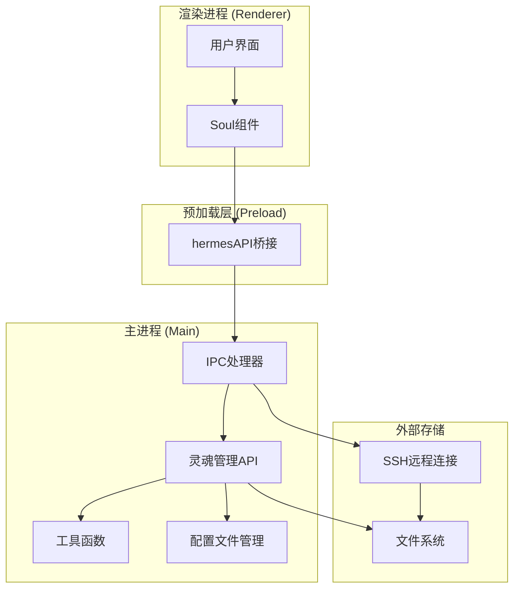
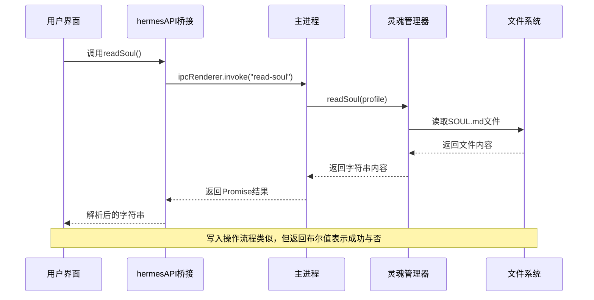
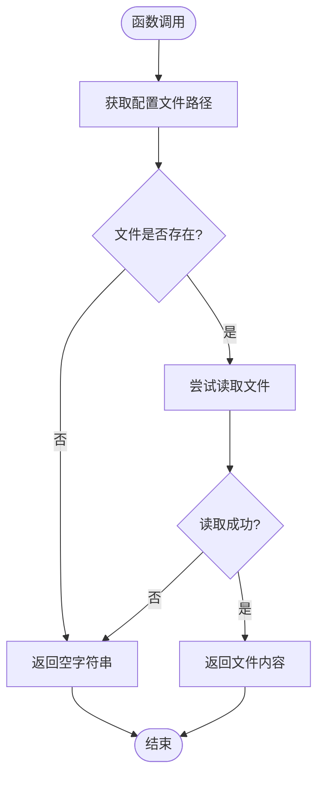
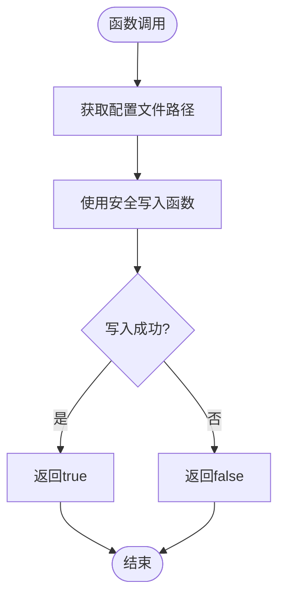
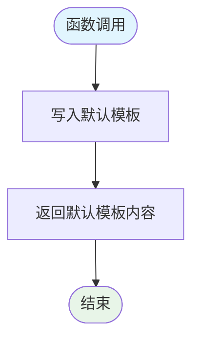
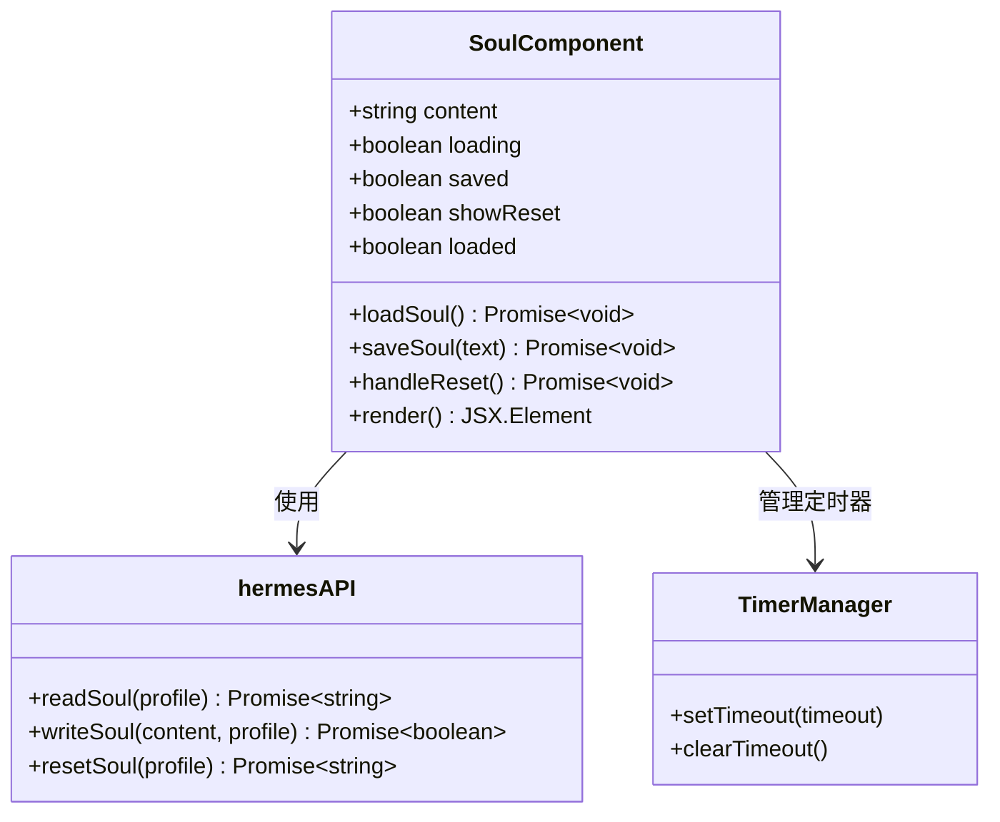
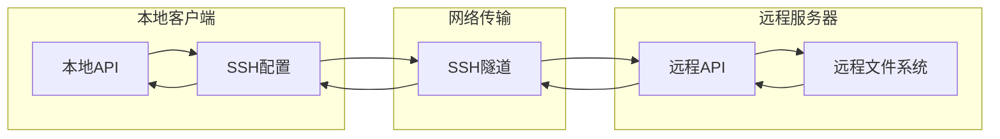
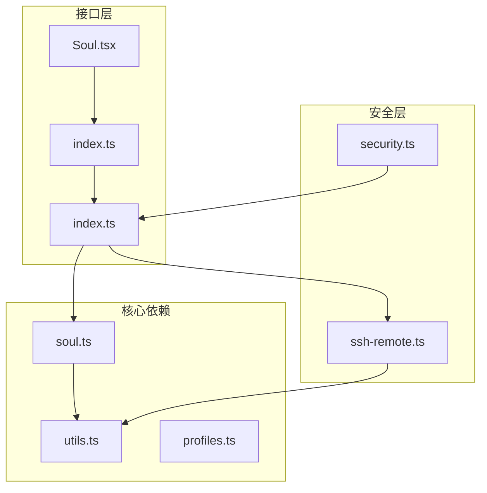

# 灵魂管理API

<cite>
**本文档引用的文件**
- [soul.ts](file://src/main/soul.ts)
- [index.ts](file://src/main/index.ts)
- [index.ts](file://src/preload/index.ts)
- [Soul.tsx](file://src/renderer/src/screens/Soul/Soul.tsx)
- [utils.ts](file://src/main/utils.ts)
- [profiles.ts](file://src/main/profiles.ts)
- [security.ts](file://src/main/security.ts)
- [ssh-remote.ts](file://src/main/ssh-remote.ts)
- [soul.ts](file://src/shared/i18n/locales/zh-CN/soul.ts)
- [soul.ts](file://src/shared/i18n/locales/en/soul.ts)
</cite>

## 目录
1. [简介](#简介)
2. [项目结构](#项目结构)
3. [核心组件](#核心组件)
4. [架构概览](#架构概览)
5. [详细组件分析](#详细组件分析)
6. [依赖关系分析](#依赖关系分析)
7. [性能考虑](#性能考虑)
8. [故障排除指南](#故障排除指南)
9. [结论](#结论)

## 简介

灵魂管理API是Hermes桌面应用中的一个关键功能模块，负责管理和维护AI代理的"人格"或"灵魂"配置。该API允许用户自定义AI助手的行为模式、沟通风格和个性特征，通过SOUL.md文件实现持久化存储。

本API提供了三个核心接口：
- `readSoul`: 读取现有的灵魂配置
- `writeSoul`: 写入新的灵魂配置
- `resetSoul`: 将灵魂配置重置为默认值

## 项目结构

Hermes桌面应用采用Electron架构，分为三个主要层次：

**图表来源**
- [index.ts:764-779](file://src/main/index.ts#L764-L779)
- [index.ts:331-337](file://src/preload/index.ts#L331-L337)

**章节来源**
- [index.ts:1-200](file://src/main/index.ts#L1-L200)
- [index.ts:1-701](file://src/preload/index.ts#L1-L701)

## 核心组件

### 灵魂管理API接口

灵魂管理API的核心实现位于主进程的`soul.ts`文件中，提供了三个核心函数：

1. **readSoul**: 从文件系统读取灵魂配置
2. **writeSoul**: 向文件系统写入新的灵魂配置  
3. **resetSoul**: 将灵魂配置重置为默认模板

### 数据存储机制

灵魂配置采用文件系统存储，每个配置文件都是一个标准的Markdown文件（SOUL.md），支持以下特性：

- **位置**: 默认配置位于`~/.hermes/SOUL.md`，命名配置位于`~/.hermes/profiles/{name}/SOUL.md`
- **格式**: Markdown文本格式，支持富文本标记
- **编码**: UTF-8编码
- **权限**: 使用安全写入函数确保文件完整性

**章节来源**
- [soul.ts:1-38](file://src/main/soul.ts#L1-L38)
- [utils.ts:46-49](file://src/main/utils.ts#L46-L49)

## 架构概览

Hermes应用采用分层架构设计，确保安全性和可维护性：

**图表来源**
- [index.ts:332-333](file://src/preload/index.ts#L332-L333)
- [index.ts:765-768](file://src/main/index.ts#L765-L768)

## 详细组件分析

### 主进程API实现

#### readSoul函数
负责从指定配置文件中读取灵魂配置：

**图表来源**
- [soul.ts:12-21](file://src/main/soul.ts#L12-L21)

#### writeSoul函数
负责向指定配置文件写入新的灵魂配置：

**图表来源**
- [soul.ts:23-32](file://src/main/soul.ts#L23-L32)

#### resetSoul函数
负责将配置重置为默认模板：

**图表来源**
- [soul.ts:34-37](file://src/main/soul.ts#L34-L37)

**章节来源**
- [soul.ts:1-38](file://src/main/soul.ts#L1-L38)

### 渲染进程集成

#### Soul组件实现
渲染进程中的Soul组件提供了完整的用户交互界面：

**图表来源**
- [Soul.tsx:9-127](file://src/renderer/src/screens/Soul/Soul.tsx#L9-L127)

#### 自动保存机制
组件实现了智能的自动保存功能：

- **延迟保存**: 500毫秒防抖延迟
- **状态反馈**: 保存成功后显示"已保存"提示
- **加载状态**: 初始加载时显示加载指示器

**章节来源**
- [Soul.tsx:1-127](file://src/renderer/src/screens/Soul/Soul.tsx#L1-L127)

### SSH远程支持

系统还支持通过SSH连接到远程主机进行灵魂配置管理：

**图表来源**
- [ssh-remote.ts:393-409](file://src/main/ssh-remote.ts#L393-L409)

**章节来源**
- [ssh-remote.ts:388-409](file://src/main/ssh-remote.ts#L388-L409)

## 依赖关系分析

### 组件耦合度

**图表来源**
- [index.ts:103-104](file://src/main/index.ts#L103-L104)
- [index.ts:331-337](file://src/preload/index.ts#L331-L337)

### 外部依赖

系统依赖的关键外部组件：

1. **Electron框架**: 提供跨平台桌面应用基础
2. **Node.js文件系统**: 提供文件操作能力
3. **SSH库**: 支持远程文件操作
4. **IPC通信**: 实现进程间通信

**章节来源**
- [index.ts:1-128](file://src/main/index.ts#L1-L128)

## 性能考虑

### 文件操作优化

1. **异步I/O**: 所有文件操作都使用异步方法，避免阻塞主线程
2. **错误处理**: 包含完整的异常捕获机制，防止应用崩溃
3. **内存管理**: 及时清理定时器和事件监听器

### 缓存策略

- **即时反馈**: UI层提供即时的状态反馈
- **防抖机制**: 自动保存采用500毫秒防抖，减少不必要的写入操作
- **懒加载**: 配置文件仅在需要时才被读取

## 故障排除指南

### 常见问题及解决方案

#### 文件读取失败
**症状**: `readSoul`返回空字符串
**可能原因**:
- SOUL.md文件不存在
- 文件权限不足
- 文件损坏

**解决方法**:
1. 检查文件是否存在：`~/.hermes/SOUL.md`
2. 验证文件权限设置
3. 使用`resetSoul`恢复默认配置

#### 文件写入失败
**症状**: `writeSoul`返回false
**可能原因**:
- 磁盘空间不足
- 目录权限不足
- 文件被其他进程占用

**解决方法**:
1. 检查磁盘空间
2. 验证目录写入权限
3. 关闭可能占用文件的其他程序

#### SSH连接问题
**症状**: 远程操作失败
**可能原因**:
- SSH配置错误
- 网络连接不稳定
- 远程服务器权限问题

**解决方法**:
1. 验证SSH连接配置
2. 测试网络连通性
3. 检查远程服务器权限设置

**章节来源**
- [soul.ts:12-37](file://src/main/soul.ts#L12-L37)
- [ssh-remote.ts:393-409](file://src/main/ssh-remote.ts#L393-L409)

## 结论

Hermes的灵魂管理API是一个设计精良的配置管理系统，具有以下特点：

### 技术优势
1. **简洁性**: API接口简单明了，易于理解和使用
2. **安全性**: 采用多层安全防护机制
3. **可扩展性**: 支持本地和远程两种部署模式
4. **可靠性**: 完善的错误处理和恢复机制

### 功能特性
1. **持久化存储**: 基于文件系统的可靠存储
2. **个性化配置**: 支持多配置文件和命名配置
3. **实时同步**: 自动保存和即时反馈机制
4. **隐私保护**: 严格的访问控制和数据隔离

### 应用场景
- AI助手个性化定制
- 团队协作环境下的配置管理
- 多用户环境下的独立配置
- 远程开发环境的配置同步

该API为Hermes应用提供了强大的配置管理能力，是构建高质量AI助手体验的重要基础设施。