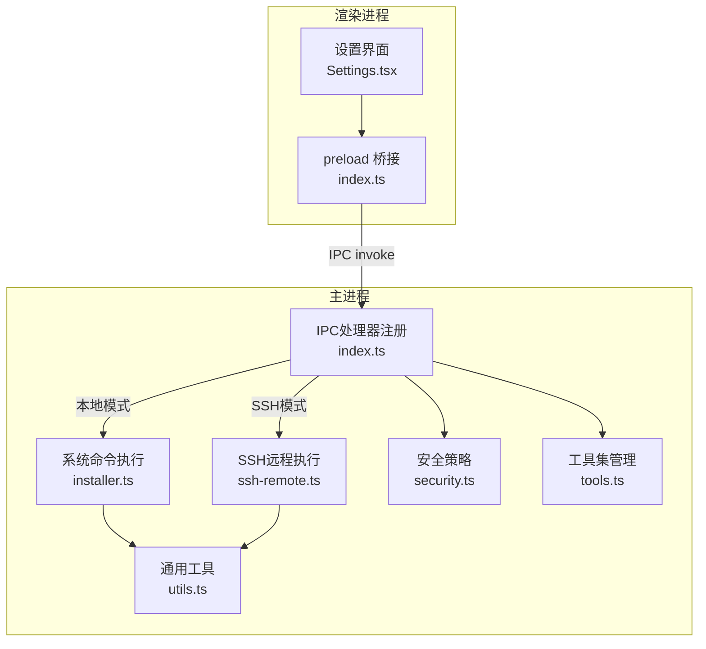
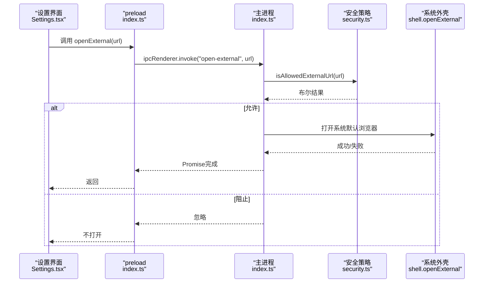
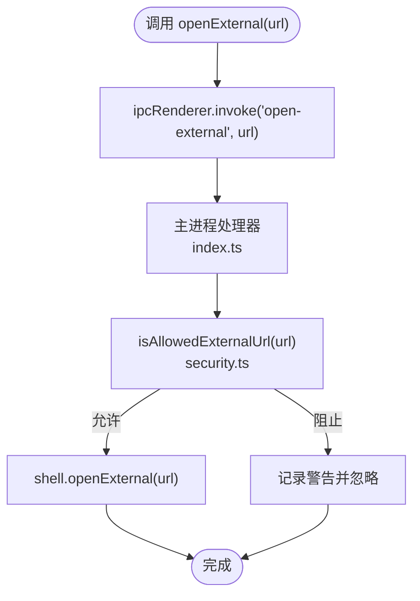
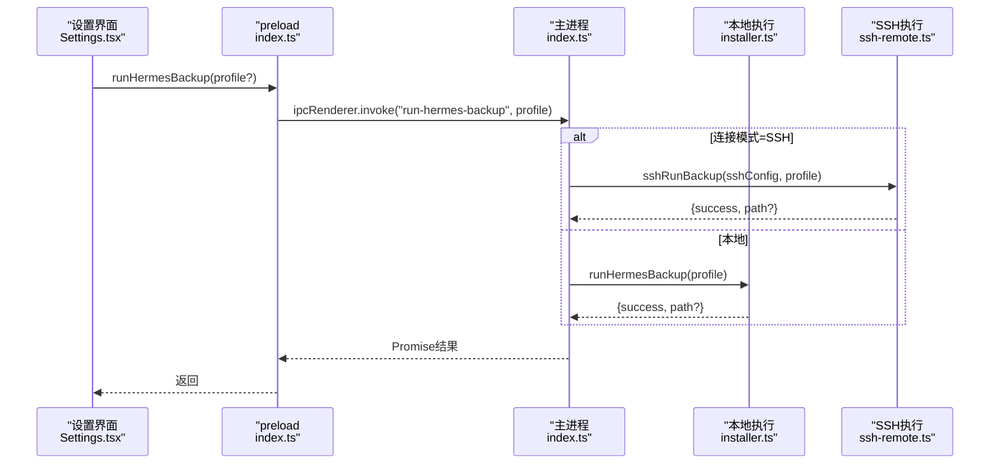
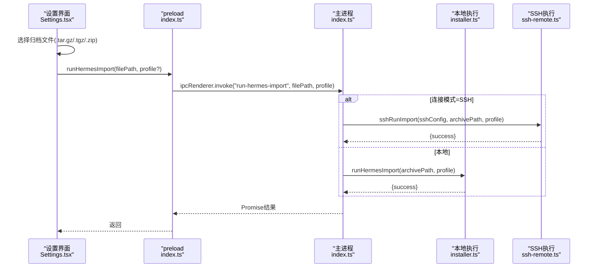
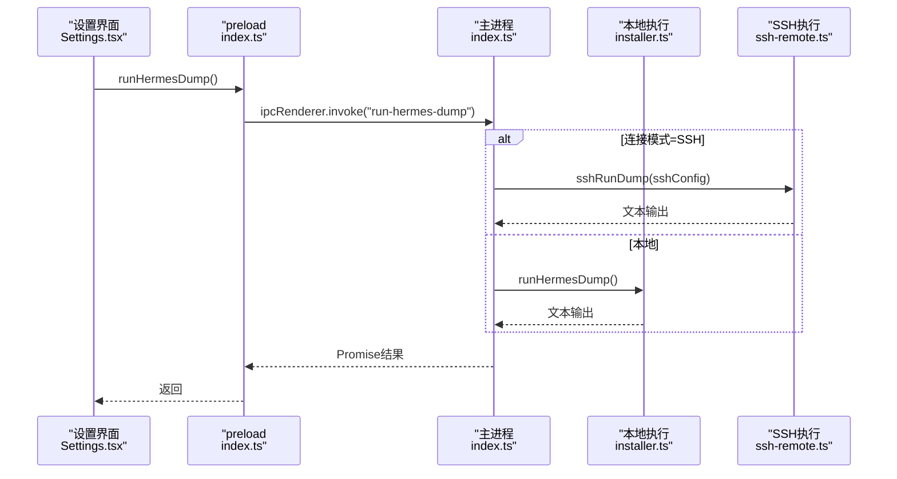
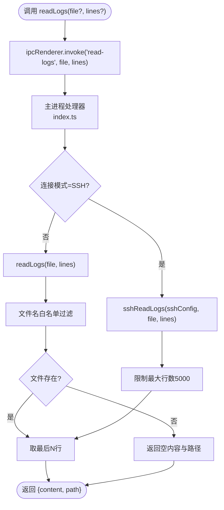
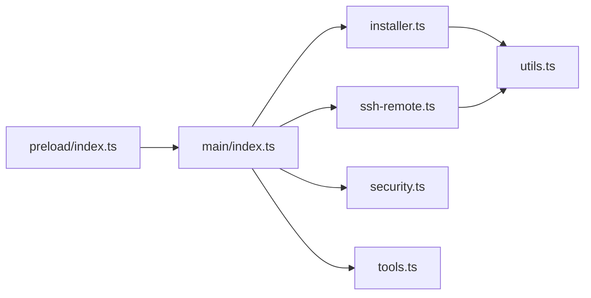

# 实用工具API

<cite>
**本文档引用的文件**
- [src/preload/index.ts](file://src/preload/index.ts)
- [src/main/index.ts](file://src/main/index.ts)
- [src/main/installer.ts](file://src/main/installer.ts)
- [src/main/utils.ts](file://src/main/utils.ts)
- [src/main/tools.ts](file://src/main/tools.ts)
- [src/main/security.ts](file://src/main/security.ts)
- [src/main/ssh-remote.ts](file://src/main/ssh-remote.ts)
- [src/renderer/src/screens/Settings/Settings.tsx](file://src/renderer/src/screens/Settings/Settings.tsx)
- [tests/ipc-handlers.test.ts](file://tests/ipc-handlers.test.ts)
- [tests/electron-security.test.ts](file://tests/electron-security.test.ts)
- [tests/installer-utils.test.ts](file://tests/installer-utils.test.ts)
</cite>

## 目录
1. [简介](#简介)
2. [项目结构](#项目结构)
3. [核心组件](#核心组件)
4. [架构总览](#架构总览)
5. [详细组件分析](#详细组件分析)
6. [依赖关系分析](#依赖关系分析)
7. [性能考量](#性能考量)
8. [故障排除指南](#故障排除指南)
9. [结论](#结论)

## 简介
本文件面向开发者与运维人员，系统性梳理Hermes Desktop中的实用工具API，包括：
- 外部链接打开：openExternal
- 备份与导入：runHermesBackup、runHermesImport
- 调试转储：runHermesDump
- 日志读取：readLogs

重点阐述接口职责、数据流、安全限制、权限验证、错误处理与最佳实践，并通过图示展示调用链路与依赖关系。

## 项目结构
实用工具API位于主进程与渲染进程之间，通过IPC通道进行交互。preload层暴露hermesAPI供渲染端调用；主进程在index.ts中注册对应IPC处理器；具体实现分布在installer.ts（系统命令执行）、ssh-remote.ts（SSH远程执行）、security.ts（安全策略）与utils.ts/tools.ts（通用工具与配置）。

图表来源
- [src/renderer/src/screens/Settings/Settings.tsx:254-292](file://src/renderer/src/screens/Settings/Settings.tsx#L254-L292)
- [src/preload/index.ts:642-685](file://src/preload/index.ts#L642-L685)
- [src/main/index.ts:290-1005](file://src/main/index.ts#L290-L1005)
- [src/main/installer.ts:813-924](file://src/main/installer.ts#L813-L924)
- [src/main/ssh-remote.ts:942-960](file://src/main/ssh-remote.ts#L942-L960)
- [src/main/security.ts:20-23](file://src/main/security.ts#L20-L23)
- [src/main/utils.ts:46-84](file://src/main/utils.ts#L46-L84)
- [src/main/tools.ts:170-191](file://src/main/tools.ts#L170-L191)

章节来源
- [src/preload/index.ts:642-685](file://src/preload/index.ts#L642-L685)
- [src/main/index.ts:290-1005](file://src/main/index.ts#L290-L1005)

## 核心组件
- openExternal：渲染端调用，主进程校验URL协议后交由系统默认浏览器打开。
- runHermesBackup：触发本地或SSH环境下的Hermes备份，返回备份路径或错误。
- runHermesImport：触发本地或SSH环境下的Hermes导入，返回成功与否及错误信息。
- runHermesDump：触发本地或SSH环境下的Hermes调试转储，返回文本内容。
- readLogs：读取本地或SSH环境的日志文件尾部N行，返回内容与路径。

章节来源
- [src/preload/index.ts:642-685](file://src/preload/index.ts#L642-L685)
- [src/main/index.ts:975-1004](file://src/main/index.ts#L975-L1004)
- [src/main/installer.ts:813-924](file://src/main/installer.ts#L813-L924)
- [src/main/ssh-remote.ts:942-960](file://src/main/ssh-remote.ts#L942-L960)

## 架构总览
以下序列图展示从渲染端到主进程再到系统命令执行的整体流程，以openExternal为例，其他API遵循相同模式。

图表来源
- [src/renderer/src/screens/Settings/Settings.tsx:287-292](file://src/renderer/src/screens/Settings/Settings.tsx#L287-L292)
- [src/preload/index.ts:642-643](file://src/preload/index.ts#L642-L643)
- [src/main/index.ts:185-194](file://src/main/index.ts#L185-L194)
- [src/main/security.ts:20-23](file://src/main/security.ts#L20-L23)

## 详细组件分析

### openExternal：外部链接打开控制
- 渲染端API：preload暴露openExternal(url)，内部通过ipcRenderer.invoke("open-external", url)。
- 主进程处理：index.ts注册"open-external"处理器，调用openExternalUrl。
- 安全校验：security.ts提供isAllowedExternalUrl，仅允许https/http/mailto协议。
- 行为：若URL被允许，使用shell.openExternal打开；否则记录警告并忽略。

图表来源
- [src/preload/index.ts:642-643](file://src/preload/index.ts#L642-L643)
- [src/main/index.ts:185-194](file://src/main/index.ts#L185-L194)
- [src/main/security.ts:20-23](file://src/main/security.ts#L20-L23)

章节来源
- [src/preload/index.ts:642-643](file://src/preload/index.ts#L642-L643)
- [src/main/index.ts:185-194](file://src/main/index.ts#L185-L194)
- [src/main/security.ts:20-23](file://src/main/security.ts#L20-L23)
- [tests/electron-security.test.ts:72-88](file://tests/electron-security.test.ts#L72-L88)

### runHermesBackup：备份流程
- 渲染端API：preload暴露runHermesBackup(profile?)，返回Promise<{success, path?, error?}>。
- 主进程处理：index.ts注册"run-hermes-backup"处理器，根据连接模式选择本地或SSH执行。
- 本地执行：installer.ts调用Hermes CLI备份，解析输出提取备份文件路径。
- SSH执行：ssh-remote.ts通过SSH执行hermes backup，返回结果。
- 错误处理：捕获execFile错误，截断stderr片段作为错误信息；超时120秒。

图表来源
- [src/renderer/src/screens/Settings/Settings.tsx:254-264](file://src/renderer/src/screens/Settings/Settings.tsx#L254-L264)
- [src/preload/index.ts:646-649](file://src/preload/index.ts#L646-L649)
- [src/main/index.ts:975-978](file://src/main/index.ts#L975-L978)
- [src/main/installer.ts:813-850](file://src/main/installer.ts#L813-L850)
- [src/main/ssh-remote.ts:1072-1079](file://src/main/ssh-remote.ts#L1072-L1079)

章节来源
- [src/preload/index.ts:646-649](file://src/preload/index.ts#L646-L649)
- [src/main/index.ts:975-978](file://src/main/index.ts#L975-L978)
- [src/main/installer.ts:813-850](file://src/main/installer.ts#L813-L850)
- [src/main/ssh-remote.ts:1072-1079](file://src/main/ssh-remote.ts#L1072-L1079)

### runHermesImport：导入流程
- 渲染端API：preload暴露runHermesImport(archivePath, profile?)，返回Promise<{success, error?}>。
- 主进程处理：index.ts注册"run-hermes-import"处理器，根据连接模式选择本地或SSH执行。
- 本地执行：installer.ts调用Hermes CLI import，解析输出判断成功。
- SSH执行：ssh-remote.ts通过SSH执行hermes import，返回结果。
- 文件选择：Settings.tsx通过HTML input[type=file]选择归档文件，传入绝对路径。

图表来源
- [src/renderer/src/screens/Settings/Settings.tsx:266-285](file://src/renderer/src/screens/Settings/Settings.tsx#L266-L285)
- [src/preload/index.ts:651-655](file://src/preload/index.ts#L651-L655)
- [src/main/index.ts:975-978](file://src/main/index.ts#L975-L978)
- [src/main/installer.ts:852-890](file://src/main/installer.ts#L852-L890)
- [src/main/ssh-remote.ts:1068-1070](file://src/main/ssh-remote.ts#L1068-L1070)

章节来源
- [src/preload/index.ts:651-655](file://src/preload/index.ts#L651-L655)
- [src/main/index.ts:975-978](file://src/main/index.ts#L975-L978)
- [src/main/installer.ts:852-890](file://src/main/installer.ts#L852-L890)
- [src/main/ssh-remote.ts:1068-1070](file://src/main/ssh-remote.ts#L1068-L1070)

### runHermesDump：调试转储
- 渲染端API：preload暴露runHermesDump()，返回Promise<string>。
- 主进程处理：index.ts注册"run-hermes-dump"处理器，根据连接模式选择本地或SSH执行。
- 本地执行：installer.ts调用Hermes CLI dump，超时30秒。
- SSH执行：ssh-remote.ts通过SSH执行hermes dump，超时60秒。
- 输出处理：stripAnsi清理ANSI转义码，确保渲染端显示整洁。

图表来源
- [src/renderer/src/screens/Settings/Settings.tsx:287-292](file://src/renderer/src/screens/Settings/Settings.tsx#L287-L292)
- [src/preload/index.ts:658](file://src/preload/index.ts#L658)
- [src/main/index.ts:980-985](file://src/main/index.ts#L980-L985)
- [src/main/installer.ts:896-924](file://src/main/installer.ts#L896-L924)
- [src/main/ssh-remote.ts:1072-1079](file://src/main/ssh-remote.ts#L1072-L1079)

章节来源
- [src/preload/index.ts:658](file://src/preload/index.ts#L658)
- [src/main/index.ts:980-985](file://src/main/index.ts#L980-L985)
- [src/main/installer.ts:896-924](file://src/main/installer.ts#L896-L924)
- [src/main/ssh-remote.ts:1072-1079](file://src/main/ssh-remote.ts#L1072-L1079)

### readLogs：日志读取
- 渲染端API：preload暴露readLogs(logFile?, lines?)，返回Promise<{content, path}>。
- 主进程处理：index.ts注册"read-logs"处理器，根据连接模式选择本地或SSH执行。
- 本地执行：installer.ts读取~/.hermes/logs目录下agent.log/errors.log/gateway.log，返回最后N行。
- SSH执行：ssh-remote.ts通过tail读取远端日志，限制最大行数5000。
- 安全与健壮性：文件名白名单过滤，不存在或读取异常时返回空内容与路径。

图表来源
- [src/preload/index.ts:681-685](file://src/preload/index.ts#L681-L685)
- [src/main/index.ts:999-1004](file://src/main/index.ts#L999-L1004)
- [src/main/installer.ts:1107-1129](file://src/main/installer.ts#L1107-L1129)
- [src/main/ssh-remote.ts:942-960](file://src/main/ssh-remote.ts#L942-L960)

章节来源
- [src/preload/index.ts:681-685](file://src/preload/index.ts#L681-L685)
- [src/main/index.ts:999-1004](file://src/main/index.ts#L999-L1004)
- [src/main/installer.ts:1107-1129](file://src/main/installer.ts#L1107-L1129)
- [src/main/ssh-remote.ts:942-960](file://src/main/ssh-remote.ts#L942-L960)
- [tests/installer-utils.test.ts:21-49](file://tests/installer-utils.test.ts#L21-L49)

## 依赖关系分析
- preload与主进程：preload通过contextBridge暴露hermesAPI，主进程通过ipcMain.handle注册对应通道。
- 主进程与实现模块：index.ts集中注册所有IPC处理器，按连接模式分派至installer.ts或ssh-remote.ts。
- 安全模块：security.ts提供URL协议与导航/WebView策略，index.ts在窗口事件中应用。
- 工具模块：utils.ts提供路径与文件写入等通用能力；tools.ts提供工具集配置读写。

图表来源
- [src/preload/index.ts:688-700](file://src/preload/index.ts#L688-L700)
- [src/main/index.ts:290-1005](file://src/main/index.ts#L290-L1005)
- [src/main/installer.ts:1-20](file://src/main/installer.ts#L1-L20)
- [src/main/ssh-remote.ts:1-20](file://src/main/ssh-remote.ts#L1-L20)
- [src/main/security.ts:1-18](file://src/main/security.ts#L1-L18)
- [src/main/utils.ts:1-10](file://src/main/utils.ts#L1-L10)
- [src/main/tools.ts:1-12](file://src/main/tools.ts#L1-L12)

章节来源
- [src/preload/index.ts:688-700](file://src/preload/index.ts#L688-L700)
- [src/main/index.ts:290-1005](file://src/main/index.ts#L290-L1005)

## 性能考量
- 备份/导入/转储：均设置合理超时（120秒/60秒），避免长时间阻塞UI线程。
- 日志读取：默认读取最近200-300行，SSH模式限制最大5000行，防止大文件导致内存压力。
- ANSI清理：对子进程输出统一stripAnsi，减少渲染端文本处理成本。
- 文件写入：safeWriteFile自动创建父目录，避免ENOENT崩溃与重复IO。

## 故障排除指南
- openExternal未生效
  - 检查URL协议是否为https/http/mailto。
  - 查看主进程日志中"[SECURITY] Blocked unsafe external URL"提示。
  - 参考测试用例验证URL合法性。

- runHermesBackup/Import失败
  - 确认Hermes已安装且CLI可用。
  - 检查超时与错误信息截断，关注stderr片段。
  - SSH模式需确认隧道与远端环境。

- readLogs无内容
  - 确认日志文件存在且在白名单内。
  - 检查权限与路径拼接逻辑。
  - SSH模式确认远端路径与tail命令可用。

- 安全策略相关问题
  - will-navigate/will-attach-webview被阻止时，检查URL是否符合白名单。
  - 确保webPreferences严格隔离与沙箱启用。

章节来源
- [src/main/security.ts:20-23](file://src/main/security.ts#L20-L23)
- [src/main/index.ts:250-281](file://src/main/index.ts#L250-L281)
- [tests/electron-security.test.ts:72-88](file://tests/electron-security.test.ts#L72-L88)
- [tests/installer-utils.test.ts:21-49](file://tests/installer-utils.test.ts#L21-L49)

## 结论
实用工具API通过严格的IPC边界与安全策略，实现了从渲染端到系统命令/远程执行的可控访问。openExternal确保外部链接安全打开；runHermesBackup/Import提供备份与迁移能力；runHermesDump便于快速诊断；readLogs支持本地与远程日志采集。配合超时控制、ANSI清理与文件白名单，整体具备良好的稳定性与安全性。