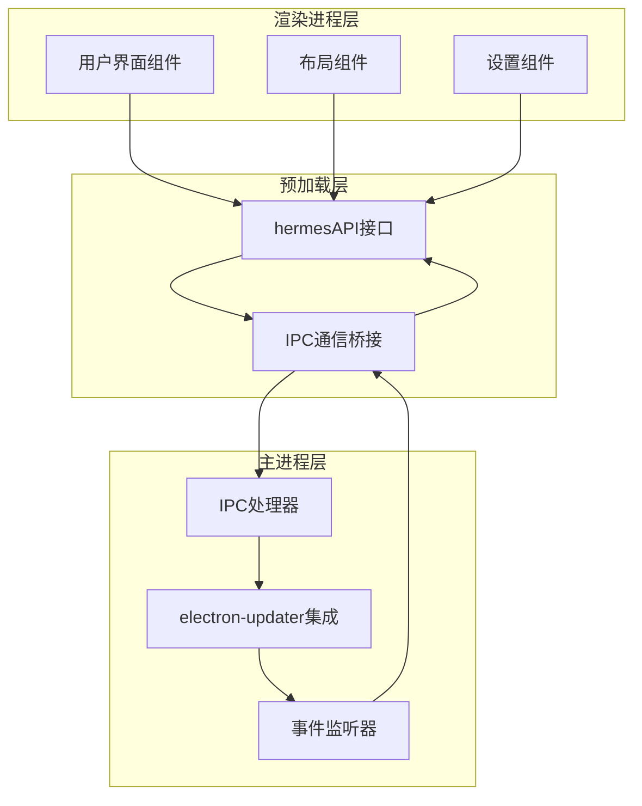
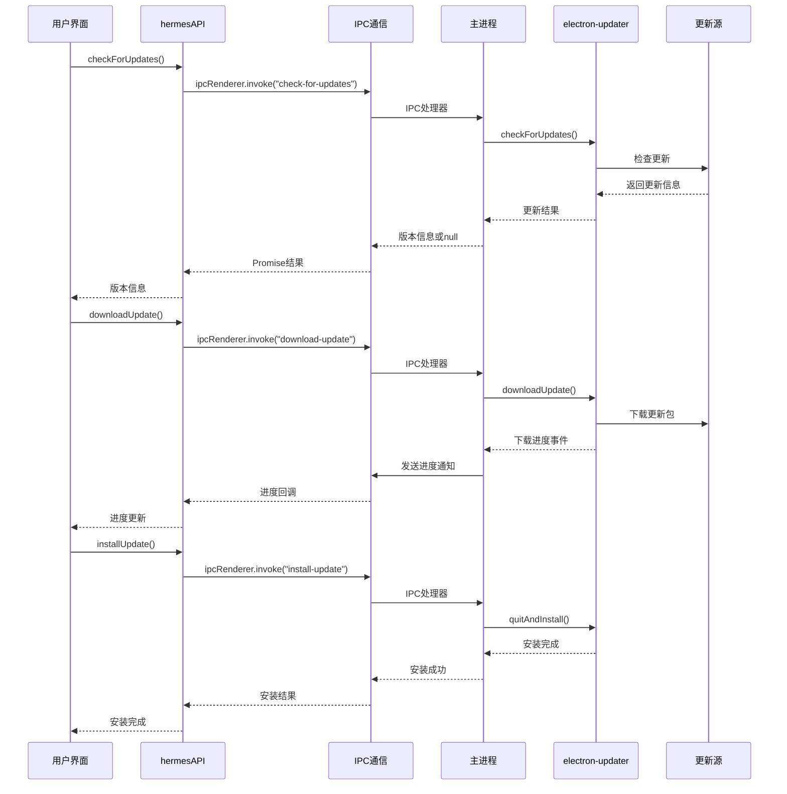
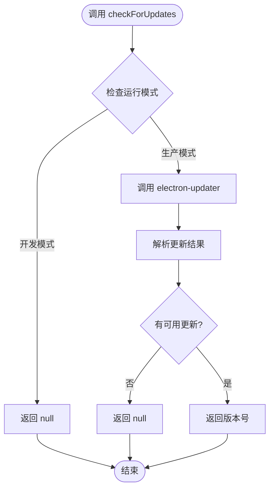
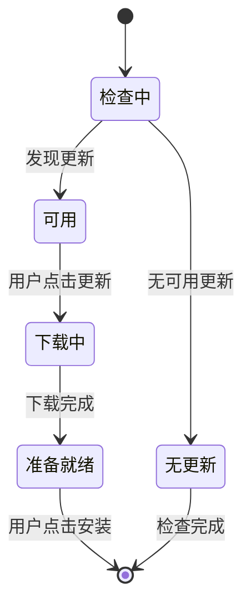
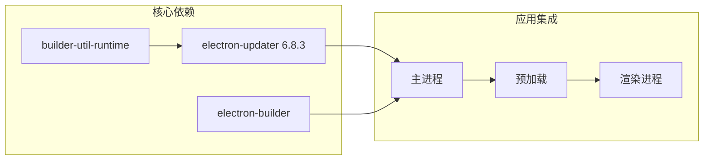
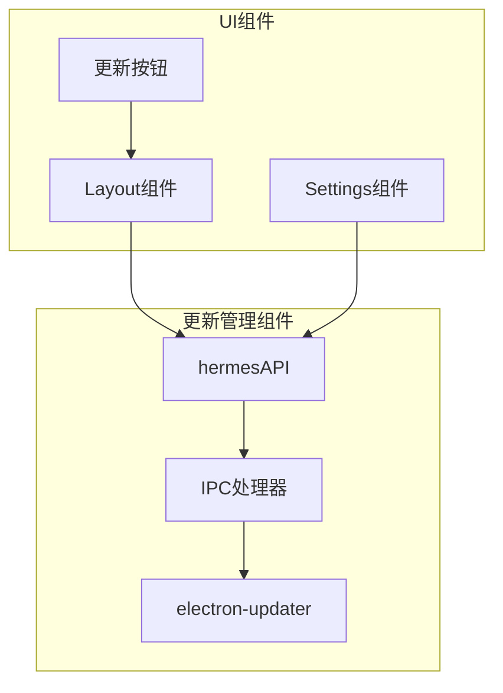
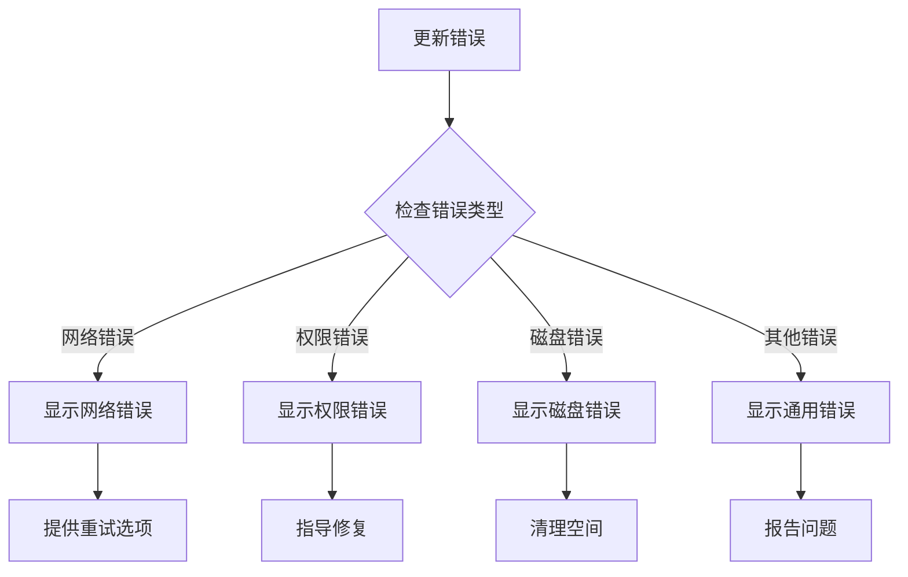

# 更新管理API

<cite>
**本文档引用的文件**
- [src/main/index.ts](file://src/main/index.ts)
- [src/preload/index.ts](file://src/preload/index.ts)
- [src/renderer/src/screens/Layout/Layout.tsx](file://src/renderer/src/screens/Layout/Layout.tsx)
- [src/renderer/src/screens/Settings/Settings.tsx](file://src/renderer/src/screens/Settings/Settings.tsx)
- [package.json](file://package.json)
- [electron-builder.yml](file://electron-builder.yml)
</cite>

## 目录
1. [简介](#简介)
2. [项目结构](#项目结构)
3. [核心组件](#核心组件)
4. [架构概览](#架构概览)
5. [详细组件分析](#详细组件分析)
6. [依赖关系分析](#依赖关系分析)
7. [性能考虑](#性能考虑)
8. [故障排除指南](#故障排除指南)
9. [结论](#结论)

## 简介

更新管理API是Hermes Desktop应用程序中用于处理软件自动更新的核心功能模块。该系统基于electron-updater库实现，提供了完整的应用更新生命周期管理，包括更新检查、下载、安装以及用户通知等功能。

本API支持多种更新场景：
- 开发模式下的禁用更新（开发时跳过自动更新）
- 生产环境下的自动更新检查
- 用户手动触发更新检查
- 后台自动更新下载
- 安静安装模式（应用退出时自动安装）

## 项目结构

更新管理功能分布在三个主要层次：



**图表来源**
- [src/preload/index.ts:533-563](file://src/preload/index.ts#L533-L563)
- [src/main/index.ts:1111-1174](file://src/main/index.ts#L1111-L1174)

**章节来源**
- [src/main/index.ts:1111-1174](file://src/main/index.ts#L1111-L1174)
- [src/preload/index.ts:533-563](file://src/preload/index.ts#L533-L563)

## 核心组件

### 主进程更新管理器

主进程使用electron-updater库实现完整的更新管理功能：

- **自动下载禁用**：通过`autoDownload = false`配置，允许应用控制下载时机
- **自动安装配置**：`autoInstallOnAppQuit = true`确保应用退出时自动安装更新
- **事件监听**：监听更新相关的所有重要事件

### 预加载层API接口

预加载脚本暴露了完整的更新管理API给渲染进程：

- `checkForUpdates()`: 检查可用更新
- `downloadUpdate()`: 下载更新包
- `installUpdate()`: 安装更新
- `getAppVersion()`: 获取当前应用版本
- 通知回调：`onUpdateAvailable()`, `onUpdateDownloadProgress()`, `onUpdateDownloaded()`

### 渲染进程集成

多个UI组件集成了更新管理功能：
- 布局组件中的更新按钮
- 设置页面中的更新状态显示
- 自动更新检查和用户交互

**章节来源**
- [src/main/index.ts:1111-1174](file://src/main/index.ts#L1111-L1174)
- [src/preload/index.ts:533-563](file://src/preload/index.ts#L533-L563)
- [src/renderer/src/screens/Layout/Layout.tsx:136-143](file://src/renderer/src/screens/Layout/Layout.tsx#L136-L143)

## 架构概览

更新管理系统的整体架构采用分层设计，确保安全性和可靠性：



**图表来源**
- [src/main/index.ts:1153-1169](file://src/main/index.ts#L1153-L1169)
- [src/preload/index.ts:533-563](file://src/preload/index.ts#L533-L563)

**章节来源**
- [src/main/index.ts:1111-1174](file://src/main/index.ts#L1111-L1174)
- [src/preload/index.ts:533-563](file://src/preload/index.ts#L533-L563)

## 详细组件分析

### checkForUpdates 接口

检查可用更新的核心接口，支持两种工作模式：

#### 开发模式行为
- 在开发环境中返回`null`，跳过自动更新检查
- 允许开发者在本地调试时不被更新机制干扰

#### 生产模式行为
- 调用electron-updater的`checkForUpdates()`方法
- 解析返回的更新信息，提取版本号
- 异常情况下返回`null`



**图表来源**
- [src/main/index.ts:1153-1160](file://src/main/index.ts#L1153-L1160)

**章节来源**
- [src/main/index.ts:1153-1160](file://src/main/index.ts#L1153-L1160)

### downloadUpdate 接口

下载更新包的接口实现：

#### 下载流程
1. 调用electron-updater的`downloadUpdate()`方法
2. 启动后台下载进程
3. 通过事件系统实时推送下载进度
4. 支持断点续传和完整性校验

#### 进度监控
- 监听`download-progress`事件
- 将进度转换为百分比发送到渲染进程
- 提供精确的下载状态反馈

**章节来源**
- [src/main/index.ts:1162-1165](file://src/main/index.ts#L1162-L1165)
- [src/main/index.ts:1139-1143](file://src/main/index.ts#L1139-L1143)

### installUpdate 接口

安装更新的最终步骤：

#### 安装机制
- 调用`quitAndInstall(false, true)`方法
- 参数含义：`allowDowngrade=false`，`restart=true`
- 应用退出后自动替换文件并重启

#### 安全保证
- 文件完整性验证
- 权限检查
- 回滚机制准备

**章节来源**
- [src/main/index.ts:1167-1169](file://src/main/index.ts#L1167-L1169)

### 更新通知系统

#### onUpdateAvailable 通知
- 监听`update-available`事件
- 发送版本号和发布说明
- 触发UI更新按钮显示

#### onUpdateDownloadProgress 通知
- 实时推送下载进度
- 百分比格式化显示
- 用户界面进度条更新

#### onUpdateDownloaded 通知
- 下载完成后触发
- 准备安装状态切换
- 用户提示"重启以更新"

**章节来源**
- [src/main/index.ts:1132-1147](file://src/main/index.ts#L1132-L1147)
- [src/preload/index.ts:540-563](file://src/preload/index.ts#L540-L563)

### UI集成组件

#### 布局组件中的更新按钮


**图表来源**
- [src/renderer/src/screens/Layout/Layout.tsx:136-143](file://src/renderer/src/screens/Layout/Layout.tsx#L136-L143)

#### 设置页面中的更新状态
- 显示当前应用版本
- 显示检测到的更新版本
- 提供手动检查更新选项
- 展示更新日志和说明

**章节来源**
- [src/renderer/src/screens/Layout/Layout.tsx:136-143](file://src/renderer/src/screens/Layout/Layout.tsx#L136-L143)
- [src/renderer/src/screens/Settings/Settings.tsx:109-163](file://src/renderer/src/screens/Settings/Settings.tsx#L109-L163)

## 依赖关系分析

### 外部依赖

更新管理系统依赖以下关键组件：



**图表来源**
- [package.json:32](file://package.json#L32)
- [package.json:54](file://package.json#L54)

### 内部组件依赖



**图表来源**
- [src/preload/index.ts:533-563](file://src/preload/index.ts#L533-L563)
- [src/main/index.ts:1111-1174](file://src/main/index.ts#L1111-L1174)

**章节来源**
- [package.json:27-68](file://package.json#L27-L68)
- [src/preload/index.ts:533-563](file://src/preload/index.ts#L533-L563)

## 性能考虑

### 更新检查优化
- **延迟检查**：应用启动后5秒再执行首次检查，避免影响启动速度
- **条件检查**：开发模式下跳过检查，减少不必要的网络请求
- **缓存机制**：利用electron-updater的内置缓存机制

### 下载性能
- **后台下载**：下载过程不影响用户正常使用应用
- **进度反馈**：实时进度更新，提升用户体验
- **断点续传**：支持网络中断后的续传

### 内存管理
- **事件清理**：组件卸载时自动清理IPC监听器
- **资源释放**：下载完成后及时释放内存资源

## 故障排除指南

### 常见问题及解决方案

#### 更新检查失败
**症状**：`checkForUpdates()`返回`null`
**原因**：
- 网络连接问题
- 更新服务器不可达
- 开发模式禁用

**解决方法**：
```javascript
// 手动重试检查
try {
  const version = await window.hermesAPI.checkForUpdates();
  if (version) {
    // 显示更新可用
  }
} catch (error) {
  // 记录错误并提示用户
}
```

#### 下载失败
**症状**：下载进度停滞或失败
**原因**：
- 网络不稳定
- 磁盘空间不足
- 权限问题

**解决方法**：
1. 检查网络连接
2. 确保有足够的磁盘空间
3. 重新启动应用
4. 手动删除临时下载文件

#### 安装失败
**症状**：应用无法正常重启
**原因**：
- 文件权限问题
- 病毒扫描软件拦截
- 系统兼容性问题

**解决方法**：
1. 以管理员权限运行
2. 暂时关闭杀毒软件
3. 手动下载最新版本安装包

**章节来源**
- [src/main/index.ts:1149-1151](file://src/main/index.ts#L1149-L1151)

### 错误处理策略

#### 事件错误处理


#### 用户反馈机制
- **错误通知**：通过桌面通知向用户报告错误
- **日志记录**：详细记录错误信息便于诊断
- **降级处理**：在错误情况下保持应用基本功能

**章节来源**
- [src/main/index.ts:1149-1151](file://src/main/index.ts#L1149-L1151)

## 结论

Hermes Desktop的更新管理API提供了一个完整、可靠且用户友好的应用更新解决方案。通过分层架构设计，系统实现了：

### 主要优势
- **安全性**：基于electron-updater的专业更新框架
- **可靠性**：完善的错误处理和回滚机制
- **用户体验**：无缝的后台更新体验
- **可维护性**：清晰的代码结构和文档

### 技术特点
- 支持多平台（Windows、macOS、Linux）
- 自动更新检查和下载
- 用户可控的安装时机
- 完整的进度反馈机制
- 强大的错误处理能力

### 未来改进方向
- 增加更新包签名验证
- 支持增量更新以减少下载量
- 提供更详细的更新日志
- 增强网络异常处理能力

该更新管理API为Hermes Desktop提供了坚实的基础，确保用户能够获得最新的功能和安全补丁，同时保持应用的稳定性和可靠性。