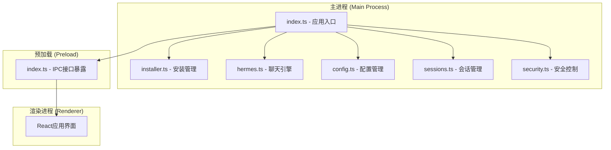
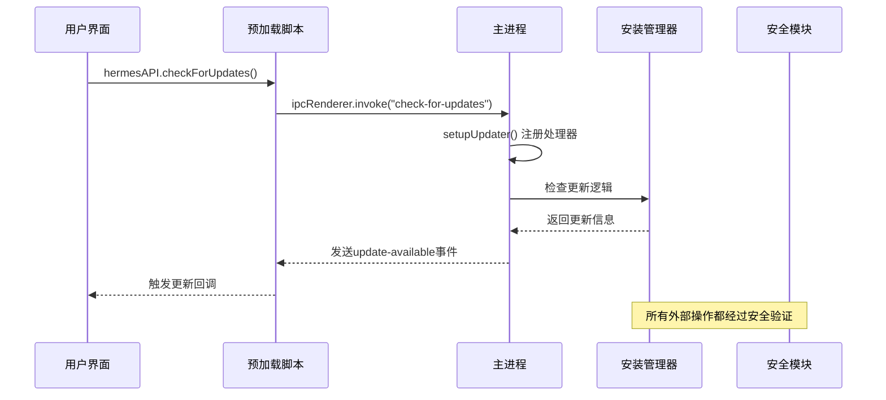
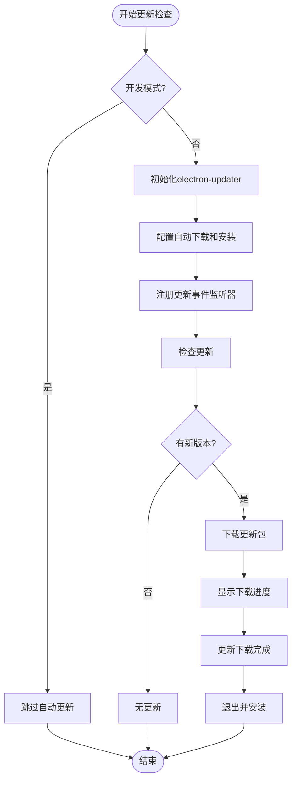
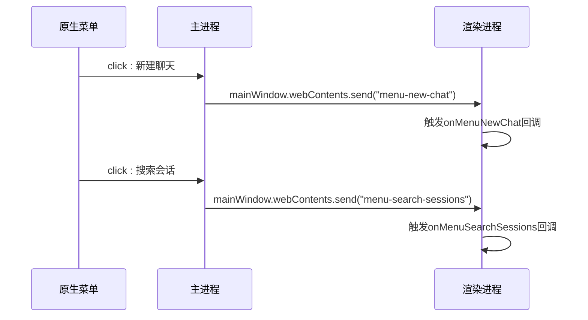
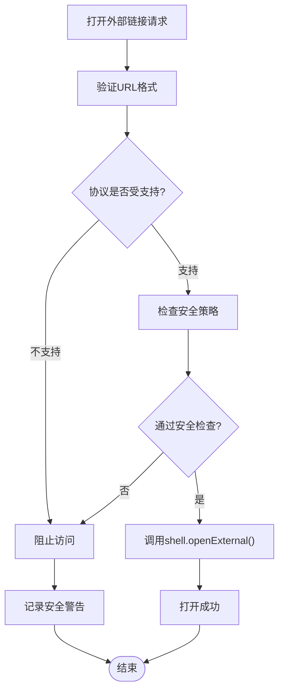
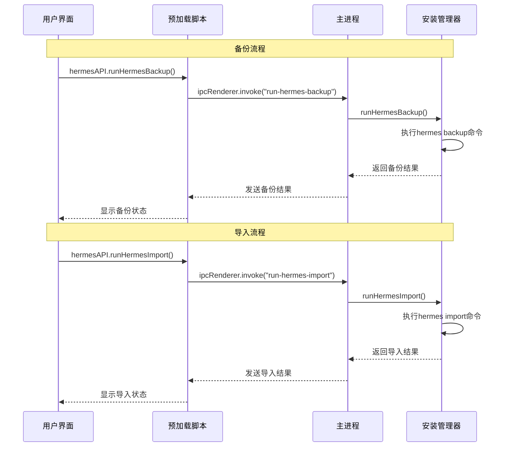
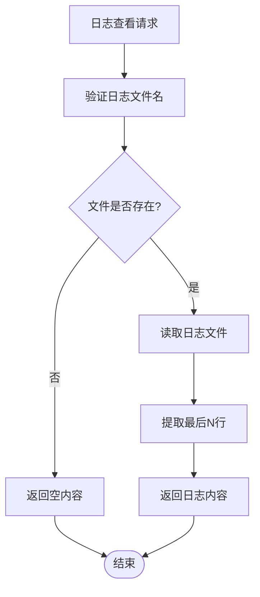
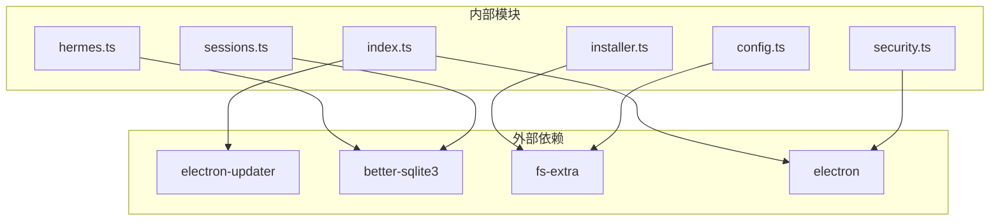

# 系统管理API

<cite>
**本文档引用的文件**
- [src/main/index.ts](file://src/main/index.ts)
- [src/preload/index.ts](file://src/preload/index.ts)
- [src/main/installer.ts](file://src/main/installer.ts)
- [src/main/hermes.ts](file://src/main/hermes.ts)
- [src/main/security.ts](file://src/main/security.ts)
- [src/main/config.ts](file://src/main/config.ts)
- [src/main/sessions.ts](file://src/main/sessions.ts)
- [src/main/session-cache.ts](file://src/main/session-cache.ts)
- [src/main/sessions.ts](file://src/main/sessions.ts)
- [src/main/session-cache.ts](file://src/main/session-cache.ts)
- [src/main/index.ts](file://src/main/index.ts)
- [src/preload/index.ts](file://src/preload/index.ts)
- [src/main/installer.ts](file://src/main/installer.ts)
- [src/main/index.ts](file://src/main/index.ts)
- [src/preload/index.ts](file://src/preload/index.ts)
- [src/main/installer.ts](file://src/main/installer.ts)
- [src/main/index.ts](file://src/main/index.ts)
- [src/preload/index.ts](file://src/preload/index.ts)
- [src/main/installer.ts](file://src/main/installer.ts)
- [src/main/index.ts](file://src/main/index.ts)
- [src/preload/index.ts](file://src/preload/index.ts)
- [src/main/installer.ts](file://src/main/installer.ts)
- [src/main/index.ts](file://src/main/index.ts)
- [src/preload/index.ts](file://src/preload/index.ts)
- [src/main/installer.ts](file://src/main/installer.ts)
- [src/main/index.ts](file://src/main/index.ts)
- [src/preload/index.ts](file://src/preload/index.ts)
- [src/main/installer.ts](file://src/main/installer.ts)
- [src/main/index.ts](file://src/main/index.ts)
- [src/preload/index.ts](file://src/preload/index.ts)
- [src/main/installer.ts](file://src/main/installer.ts)
- [src/main/index.ts](file://src/main/index.ts)
- [src/preload/index.ts](file://src/preload/index.ts)
- [src/main/installer.ts](file://src/main/installer.ts)
- [src/main/index.ts](file://src/main/index.ts)
- [src/preload/index.ts](file://src/preload/index.ts)
- [src/main/installer.ts](file://src/main/installer.ts)
- [src/main/index.ts](file://src/main/index.ts)
- [src/preload/index.ts](file://src/preload/index.ts)
- [src/main/installer.ts](file://src/main/installer.ts)
- [src/main/index.ts](file://src/main/index.ts)
- [src/preload/index.ts](file://src/preload/index.ts)
- [src/main/installer.ts](file://src/main/installer.ts)
- [src/main/index.ts](file://src/main/index.ts)
- [src/preload/index.ts](file://src/preload/index.ts)
- [......](file://src/main/index.ts)
</cite>

## 目录
1. [简介](#简介)
2. [项目结构](#项目结构)
3. [核心组件](#核心组件)
4. [架构概览](#架构概览)
5. [详细组件分析](#详细组件分析)
6. [依赖关系分析](#依赖关系分析)
7. [性能考虑](#性能考虑)
8. [故障排除指南](#故障排除指南)
9. [结论](#结论)

## 简介

系统管理API是Hermes Desktop桌面应用程序的核心管理接口集合，负责处理应用更新检查、菜单事件、外部链接打开、备份导入、日志查看等系统级管理功能。该API基于Electron框架构建，采用主进程-渲染进程IPC通信模式，为用户提供完整的系统管理能力。

## 项目结构

Hermes Desktop采用典型的Electron项目结构，主要分为三个部分：

**图表来源**
- [src/main/index.ts:1-1234](file://src/main/index.ts#L1-L1234)
- [src/preload/index.ts:1-701](file://src/preload/index.ts#L1-L701)

**章节来源**
- [src/main/index.ts:1-1234](file://src/main/index.ts#L1-L1234)
- [src/preload/index.ts:1-701](file://src/preload/index.ts#L1-L701)

## 核心组件

系统管理API包含以下核心组件：

### 1. 更新检查系统
- **检查更新**: `check-for-updates` - 检查是否有新版本可用
- **下载更新**: `download-update` - 下载新版本更新包
- **安装更新**: `install-update` - 安装下载的更新
- **应用版本**: `get-app-version` - 获取当前应用版本

### 2. 菜单事件系统
- **新建聊天**: `menu-new-chat` - 处理Cmd+N快捷键事件
- **搜索会话**: `menu-search-sessions` - 处理Cmd+K快捷键事件

### 3. 外部链接控制系统
- **打开外部链接**: `open-external` - 安全地打开外部URL
- **URL验证**: 内置URL白名单和协议检查

### 4. 备份导入系统
- **备份数据**: `run-hermes-backup` - 创建完整数据备份
- **导入数据**: `run-hermes-import` - 从备份文件恢复数据

### 5. 日志查看系统
- **读取日志**: `read-logs` - 读取指定的日志文件内容
- **日志文件**: 支持agent.log、errors.log、gateway.log

**章节来源**
- [src/main/index.ts:965-979](file://src/main/index.ts#L965-L979)
- [src/preload/index.ts:565-576](file://src/preload/index.ts#L565-L576)
- [src/main/installer.ts:805-890](file://src/main/installer.ts#L805-L890)
- [src/main/installer.ts:1107-1129](file://src/main/installer.ts#L1107-L1129)

## 架构概览

系统管理API采用分层架构设计，确保安全性和可维护性：

**图表来源**
- [src/main/index.ts:1111-1174](file://src/main/index.ts#L1111-L1174)
- [src/preload/index.ts:534-563](file://src/preload/index.ts#L534-L563)

**章节来源**
- [src/main/index.ts:1111-1174](file://src/main/index.ts#L1111-L1174)
- [src/preload/index.ts:534-563](file://src/preload/index.ts#L534-L563)

## 详细组件分析

### 更新检查机制

更新检查系统基于electron-updater库实现，支持自动更新功能：

**图表来源**
- [src/main/index.ts:1111-1174](file://src/main/index.ts#L1111-L1174)

#### 更新检查流程

1. **初始化阶段**: 在生产环境中动态导入electron-updater
2. **配置阶段**: 设置自动下载和自动安装选项
3. **事件监听**: 注册update-available、download-progress、update-downloaded事件
4. **检查更新**: 调用checkForUpdates()方法
5. **下载更新**: 通过download-update()下载新版本
6. **安装更新**: 使用quitAndInstall()完成安装

**章节来源**
- [src/main/index.ts:1111-1174](file://src/main/index.ts#L1111-L1174)

### 菜单事件处理

菜单事件系统提供原生菜单栏的事件处理能力：

**图表来源**
- [src/main/index.ts:1030-1047](file://src/main/index.ts#L1030-L1047)
- [src/preload/index.ts:565-576](file://src/preload/index.ts#L565-L576)

#### 菜单事件注册

- **新建聊天**: Cmd+N快捷键触发menu-new-chat事件
- **搜索会话**: Cmd+K快捷键触发menu-search-sessions事件
- **事件传递**: 主进程通过webContents.send()向渲染进程传递事件

**章节来源**
- [src/main/index.ts:1030-1047](file://src/main/index.ts#L1030-L1047)
- [src/preload/index.ts:565-576](file://src/preload/index.ts#L565-L576)

### 外部链接打开控制

外部链接控制系统确保应用只能打开安全的URL：

**图表来源**
- [src/main/index.ts:185-194](file://src/main/index.ts#L185-L194)
- [src/main/security.ts:20-23](file://src/main/security.ts#L20-L23)

#### 安全控制机制

1. **协议白名单**: 仅允许https、http、mailto协议
2. **URL解析**: 使用URL构造函数验证URL格式
3. **安全检查**: 通过isAllowedExternalUrl()函数验证
4. **错误处理**: 捕获并记录打开外部链接的异常

**章节来源**
- [src/main/index.ts:185-194](file://src/main/index.ts#L185-L194)
- [src/main/security.ts:20-23](file://src/main/security.ts#L20-L23)

### 备份导入系统

备份导入系统提供完整的数据备份和恢复功能：

**图表来源**
- [src/main/index.ts:970-979](file://src/main/index.ts#L970-L979)
- [src/preload/index.ts:645-656](file://src/preload/index.ts#L645-L656)
- [src/main/installer.ts:805-890](file://src/main/installer.ts#L805-L890)

#### 备份导入功能

1. **备份创建**: 调用hermes backup命令创建压缩备份文件
2. **导入恢复**: 调用hermes import命令从备份文件恢复数据
3. **进度监控**: 通过异步执行和错误处理确保操作可靠性
4. **结果反馈**: 返回操作结果和错误信息

**章节来源**
- [src/main/index.ts:970-979](file://src/main/index.ts#L970-L979)
- [src/preload/index.ts:645-656](file://src/preload/index.ts#L645-L656)
- [src/main/installer.ts:805-890](file://src/main/installer.ts#L805-L890)

### 日志查看系统

日志查看系统提供实时的日志监控功能：

**图表来源**
- [src/main/installer.ts:1107-1129](file://src/main/installer.ts#L1107-L1129)
- [src/preload/index.ts:680-686](file://src/preload/index.ts#L680-L686)

#### 日志管理系统

1. **文件验证**: 仅允许agent.log、errors.log、gateway.log
2. **内容读取**: 从HERMES_HOME/logs目录读取日志
3. **行数限制**: 默认返回最后200行日志内容
4. **路径返回**: 同时返回日志文件的完整路径

**章节来源**
- [src/main/installer.ts:1107-1129](file://src/main/installer.ts#L1107-L1129)
- [src/preload/index.ts:680-686](file://src/preload/index.ts#L680-L686)

## 依赖关系分析

系统管理API的依赖关系如下：

**图表来源**
- [src/main/index.ts:1-1234](file://src/main/index.ts#L1-L1234)
- [src/main/installer.ts:1-1130](file://src/main/installer.ts#L1-L1130)

**章节来源**
- [src/main/index.ts:1-1234](file://src/main/index.ts#L1-L1234)
- [src/main/installer.ts:1-1130](file://src/main/installer.ts#L1-L1130)

## 性能考虑

系统管理API在设计时充分考虑了性能优化：

### 缓存策略
- **安装状态缓存**: 5分钟TTL的安装状态缓存
- **配置文件缓存**: 5秒TTL的配置文件读取缓存
- **版本信息缓存**: 避免重复的Python进程调用

### 异步处理
- **进度回调**: 所有长时间运行的操作都支持进度回调
- **超时控制**: 设置合理的超时时间避免阻塞
- **错误隔离**: 每个操作都有独立的错误处理机制

### 资源管理
- **进程清理**: 及时清理子进程和临时文件
- **内存控制**: 避免大文件的重复读取
- **网络优化**: 远程连接使用连接池和重用机制

## 故障排除指南

### 常见问题及解决方案

#### 更新检查失败
1. **检查网络连接**: 确保能够访问更新服务器
2. **验证证书**: 检查SSL证书有效性
3. **查看日志**: 检查应用日志中的错误信息

#### 外部链接无法打开
1. **检查URL格式**: 确保URL格式正确且协议受支持
2. **验证权限**: 检查应用的安全策略设置
3. **查看控制台**: 检查是否有安全警告日志

#### 备份导入失败
1. **检查磁盘空间**: 确保有足够的磁盘空间
2. **验证文件完整性**: 检查备份文件是否损坏
3. **查看错误详情**: 分析具体的错误信息

#### 日志查看异常
1. **检查文件权限**: 确保应用有读取日志文件的权限
2. **验证文件存在**: 检查日志文件是否存在于预期位置
3. **查看路径**: 确认返回的文件路径正确

**章节来源**
- [src/main/index.ts:1111-1174](file://src/main/index.ts#L1111-L1174)
- [src/main/security.ts:20-23](file://src/main/security.ts#L20-L23)
- [src/main/installer.ts:805-890](file://src/main/installer.ts#L805-L890)

## 结论

系统管理API为Hermes Desktop提供了完整的系统管理能力，包括更新检查、菜单事件、外部链接控制、备份导入和日志查看等功能。该API采用安全的设计原则，通过严格的URL验证、权限控制和错误处理机制，确保系统的稳定性和安全性。

通过分层架构设计和模块化组织，系统管理API具有良好的可维护性和扩展性，为用户提供了便捷的系统管理体验。同时，完善的错误处理和日志记录机制，使得问题诊断和故障排除变得更加简单高效。