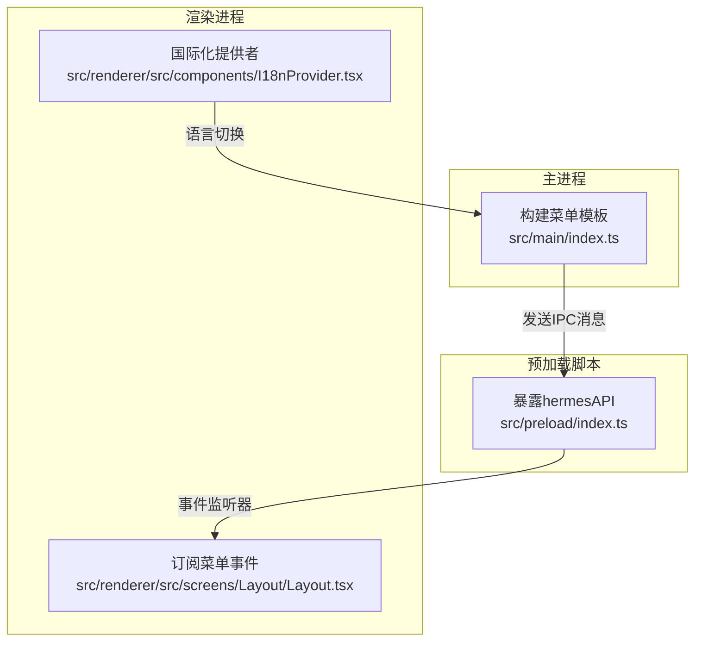
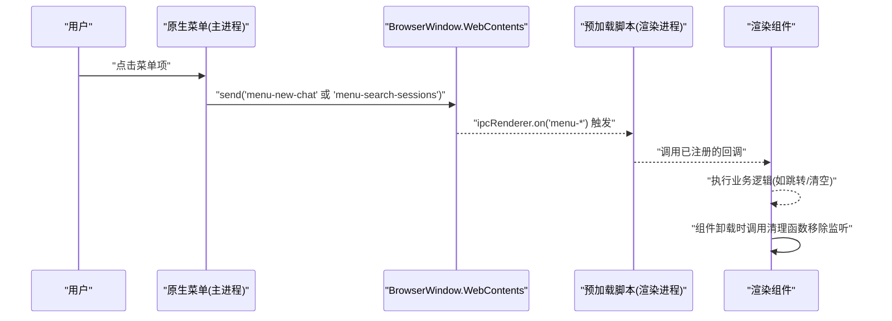
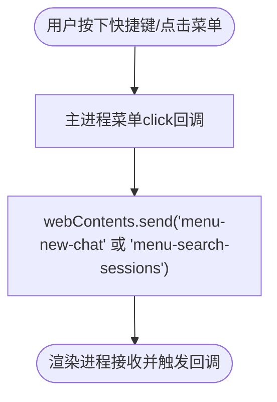
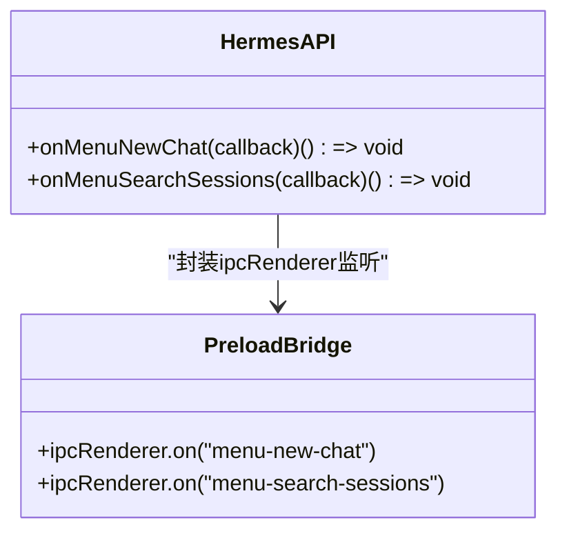
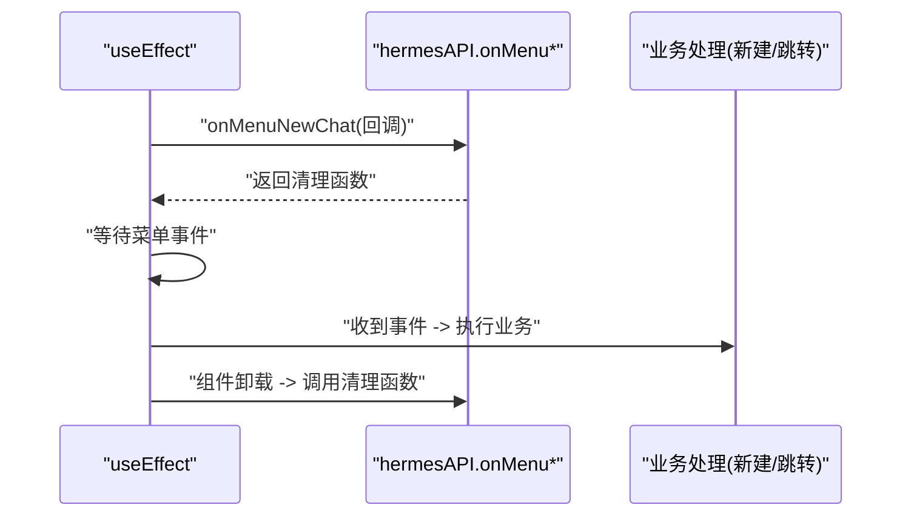
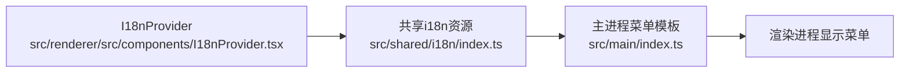
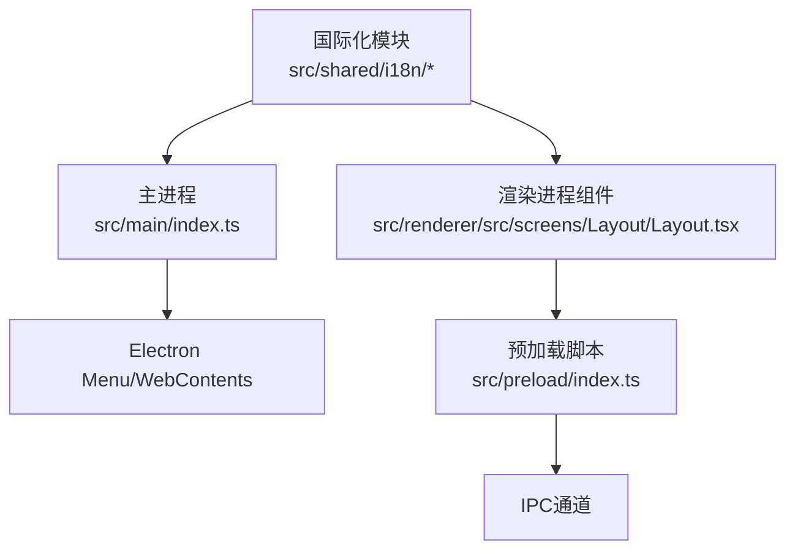

# 菜单事件API

<cite>
**本文档引用的文件**
- [src/main/index.ts](file://src/main/index.ts)
- [src/preload/index.ts](file://src/preload/index.ts)
- [src/renderer/src/screens/Layout/Layout.tsx](file://src/renderer/src/screens/Layout/Layout.tsx)
- [src/shared/i18n/index.ts](file://src/shared/i18n/index.ts)
- [src/shared/i18n/config.ts](file://src/shared/i18n/config.ts)
- [src/shared/i18n/types.ts](file://src/shared/i18n/types.ts)
- [src/renderer/src/components/I18nProvider.tsx](file://src/renderer/src/components/I18nProvider.tsx)
- [src/renderer/src/components/useI18n.ts](file://src/renderer/src/components/useI18n.ts)
- [src/main/locale.ts](file://src/main/locale.ts)
</cite>

## 目录
1. [简介](#简介)
2. [项目结构](#项目结构)
3. [核心组件](#核心组件)
4. [架构总览](#架构总览)
5. [详细组件分析](#详细组件分析)
6. [依赖关系分析](#依赖关系分析)
7. [性能考虑](#性能考虑)
8. [故障排除指南](#故障排除指南)
9. [结论](#结论)

## 简介
本文件系统性地记录并说明菜单事件API的设计与实现，重点覆盖以下方面：
- 原生菜单栏事件处理机制：通过Electron原生菜单模板定义菜单项、快捷键绑定与点击回调。
- 菜单事件监听接口：在渲染进程中通过预加载脚本暴露的onMenuNewChat、onMenuSearchSessions等API，实现对菜单事件的订阅与注销。
- 快捷键绑定：在菜单模板中为“新建对话”和“搜索会话”等菜单项配置跨平台快捷键。
- 菜单状态管理：当前实现以静态菜单为主，未见动态启用/禁用或复选框状态管理逻辑；可通过扩展实现更丰富的状态控制。
- 事件注册与注销：预加载API返回清理函数，确保事件监听器可被显式移除，避免内存泄漏。
- 事件传播与冲突处理：菜单点击事件由主进程转发到渲染进程，当前未见冲突检测与处理逻辑，建议在业务层进行防抖与互斥控制。
- 菜单定制与国际化：菜单项标签来自共享i18n资源，可在不同语言环境下显示对应文本。
- 用户体验优化：结合示例组件展示如何在收到菜单事件后执行页面跳转、清空会话等操作。

## 项目结构
菜单事件相关的核心位置如下：
- 主进程：构建原生菜单模板，定义菜单项、快捷键与点击回调（向渲染进程发送IPC消息）。
- 预加载脚本：在渲染上下文中暴露hermesAPI，提供onMenuNewChat、onMenuSearchSessions等监听接口。
- 渲染进程：在布局组件中订阅菜单事件，执行相应UI行为（如跳转到会话列表、新建对话）。
- 国际化：共享i18n模块提供多语言资源，菜单项标签随语言切换而更新。

**图表来源**
- [src/main/index.ts:1007-1109](file://src/main/index.ts#L1007-L1109)
- [src/preload/index.ts:565-576](file://src/preload/index.ts#L565-L576)
- [src/renderer/src/screens/Layout/Layout.tsx:153-165](file://src/renderer/src/screens/Layout/Layout.tsx#L153-L165)
- [src/renderer/src/components/I18nProvider.tsx:31-83](file://src/renderer/src/components/I18nProvider.tsx#L31-L83)

**章节来源**
- [src/main/index.ts:1007-1109](file://src/main/index.ts#L1007-L1109)
- [src/preload/index.ts:565-576](file://src/preload/index.ts#L565-L576)
- [src/renderer/src/screens/Layout/Layout.tsx:153-165](file://src/renderer/src/screens/Layout/Layout.tsx#L153-L165)
- [src/renderer/src/components/I18nProvider.tsx:31-83](file://src/renderer/src/components/I18nProvider.tsx#L31-L83)

## 核心组件
- 主进程菜单构建器：负责生成菜单模板，为特定菜单项设置accelerator与click回调，点击时通过webContents.send向渲染进程发送自定义IPC消息。
- 预加载API：在渲染上下文暴露hermesAPI，提供onMenuNewChat与onMenuSearchSessions两个事件监听方法，内部基于ipcRenderer.on注册监听，并返回一个用于移除监听的清理函数。
- 渲染进程订阅者：在布局组件中使用useEffect订阅菜单事件，收到事件后执行业务逻辑（如跳转到会话视图、新建对话），并在组件卸载时调用清理函数移除监听。

关键实现路径参考：
- 主进程菜单模板与点击回调：[src/main/index.ts:1007-1109](file://src/main/index.ts#L1007-L1109)
- 预加载API事件监听器：[src/preload/index.ts:565-576](file://src/preload/index.ts#L565-L576)
- 渲染进程订阅与清理：[src/renderer/src/screens/Layout/Layout.tsx:153-165](file://src/renderer/src/screens/Layout/Layout.tsx#L153-L165)

**章节来源**
- [src/main/index.ts:1007-1109](file://src/main/index.ts#L1007-L1109)
- [src/preload/index.ts:565-576](file://src/preload/index.ts#L565-L576)
- [src/renderer/src/screens/Layout/Layout.tsx:153-165](file://src/renderer/src/screens/Layout/Layout.tsx#L153-L165)

## 架构总览
菜单事件从原生菜单触发，经主进程转发到渲染进程，再由预加载API分发给订阅者。整体流程如下：

**图表来源**
- [src/main/index.ts:1035-1045](file://src/main/index.ts#L1035-L1045)
- [src/preload/index.ts:566-576](file://src/preload/index.ts#L566-L576)
- [src/renderer/src/screens/Layout/Layout.tsx:153-165](file://src/renderer/src/screens/Layout/Layout.tsx#L153-L165)

## 详细组件分析

### 组件A：原生菜单与快捷键绑定
- 菜单项定义：在主进程的菜单模板中，为“Chat”子菜单添加“New Chat”和“Search Sessions”两项，并分别配置accelerator与click回调。
- 快捷键策略：使用“CmdOrCtrl+N”和“CmdOrCtrl+K”，适配macOS与Windows/Linux平台。
- 事件传播：click回调通过webContents.send向渲染进程发送自定义通道名，渲染侧通过预加载API监听。

**图表来源**
- [src/main/index.ts:1032-1046](file://src/main/index.ts#L1032-L1046)

**章节来源**
- [src/main/index.ts:1032-1046](file://src/main/index.ts#L1032-L1046)

### 组件B：预加载API事件监听器
- 接口设计：onMenuNewChat与onMenuSearchSessions均返回清理函数，用于移除ipcRenderer.on监听。
- 注册与注销：在渲染组件中订阅事件时保存清理函数，在useEffect的cleanup中统一调用，确保无泄漏。
- 类型安全：回调签名均为无参函数，简化了事件负载与处理复杂度。

**图表来源**
- [src/preload/index.ts:565-576](file://src/preload/index.ts#L565-L576)

**章节来源**
- [src/preload/index.ts:565-576](file://src/preload/index.ts#L565-L576)

### 组件C：渲染进程订阅与业务处理
- 订阅方式：在布局组件的useEffect中订阅菜单事件，收到事件后执行业务逻辑（例如新建对话、跳转到会话视图）。
- 生命周期管理：在cleanup中调用清理函数，确保组件卸载时移除监听。
- 与国际化协作：虽然菜单项标签来自主进程模板，但渲染侧仍可利用i18n进行界面文案本地化。

**图表来源**
- [src/renderer/src/screens/Layout/Layout.tsx:153-165](file://src/renderer/src/screens/Layout/Layout.tsx#L153-L165)

**章节来源**
- [src/renderer/src/screens/Layout/Layout.tsx:153-165](file://src/renderer/src/screens/Layout/Layout.tsx#L153-L165)

### 组件D：国际化支持与菜单定制
- 菜单标签国际化：主进程模板中的label字段可直接使用共享i18n资源，实现多语言显示。
- 语言切换流程：渲染侧通过I18nProvider读取/写入语言设置，并同步到主进程；主进程可根据当前语言重新构建菜单模板。
- 菜单定制建议：若需动态启用/禁用菜单项或显示复选框状态，可在主进程根据应用状态重建菜单模板，或在渲染侧通过其他UI控件实现替代方案。

**图表来源**
- [src/renderer/src/components/I18nProvider.tsx:31-83](file://src/renderer/src/components/I18nProvider.tsx#L31-L83)
- [src/shared/i18n/index.ts:1-200](file://src/shared/i18n/index.ts#L1-200)
- [src/main/index.ts:1007-1109](file://src/main/index.ts#L1007-L1109)

**章节来源**
- [src/renderer/src/components/I18nProvider.tsx:31-83](file://src/renderer/src/components/I18nProvider.tsx#L31-L83)
- [src/shared/i18n/index.ts:1-200](file://src/shared/i18n/index.ts#L1-200)
- [src/shared/i18n/config.ts:1-6](file://src/shared/i18n/config.ts#L1-L6)
- [src/shared/i18n/types.ts:1-5](file://src/shared/i18n/types.ts#L1-L5)
- [src/main/locale.ts:1-14](file://src/main/locale.ts#L1-L14)

## 依赖关系分析
- 主进程依赖Electron Menu与webContents，负责构建菜单模板与发送IPC消息。
- 预加载脚本依赖ipcRenderer，负责桥接主进程与渲染进程的事件通信。
- 渲染进程依赖React Hooks与hermesAPI，负责订阅事件并执行业务逻辑。
- 国际化模块独立于菜单事件，但可影响菜单标签显示。

**图表来源**
- [src/main/index.ts:1007-1109](file://src/main/index.ts#L1007-L1109)
- [src/preload/index.ts:565-576](file://src/preload/index.ts#L565-L576)
- [src/renderer/src/screens/Layout/Layout.tsx:153-165](file://src/renderer/src/screens/Layout/Layout.tsx#L153-L165)
- [src/shared/i18n/index.ts:1-200](file://src/shared/i18n/index.ts#L1-200)

**章节来源**
- [src/main/index.ts:1007-1109](file://src/main/index.ts#L1007-L1109)
- [src/preload/index.ts:565-576](file://src/preload/index.ts#L565-L576)
- [src/renderer/src/screens/Layout/Layout.tsx:153-165](file://src/renderer/src/screens/Layout/Layout.tsx#L153-L165)
- [src/shared/i18n/index.ts:1-200](file://src/shared/i18n/index.ts#L1-200)

## 性能考虑
- 事件监听器数量：菜单事件监听器数量有限，开销极低，无需额外优化。
- IPC消息频率：菜单事件通常由用户交互触发，频率可控，不会产生高频IPC压力。
- 内存泄漏防护：务必在组件卸载时调用清理函数移除监听，避免累积监听器导致内存泄漏。
- 渲染侧处理复杂度：在回调中尽量保持轻量逻辑，重任务可异步执行或委托到后台线程。

## 故障排除指南
- 问题：菜单事件无法触发
  - 检查主进程是否正确构建菜单模板并发送IPC消息。
  - 检查预加载API是否成功注册监听器。
  - 检查渲染组件是否在正确的生命周期内订阅并返回清理函数。
- 问题：重复注册监听导致多次触发
  - 确保每次订阅都保存清理函数，并在cleanup中调用。
  - 避免在多个组件中重复订阅同一事件。
- 问题：语言切换后菜单标签未更新
  - 若需动态更新菜单标签，应在语言变更时重建菜单模板。
  - 当前实现中菜单标签来自共享i18n资源，需确保主进程在语言切换后重新构建菜单。
- 问题：内存泄漏
  - 确保在组件卸载时调用清理函数移除监听。
  - 对于长生命周期组件，检查是否存在遗漏的清理逻辑。

**章节来源**
- [src/main/index.ts:1035-1045](file://src/main/index.ts#L1035-L1045)
- [src/preload/index.ts:566-576](file://src/preload/index.ts#L566-L576)
- [src/renderer/src/screens/Layout/Layout.tsx:153-165](file://src/renderer/src/screens/Layout/Layout.tsx#L153-L165)

## 结论
菜单事件API通过Electron原生菜单与IPC实现了简洁高效的事件分发机制。预加载脚本提供了易用的事件监听接口，渲染侧可在组件生命周期内安全地订阅与注销事件。当前实现以静态菜单为主，国际化通过共享i18n资源实现；若需更复杂的菜单状态管理与动态定制，可在主进程层面扩展菜单模板的构建逻辑。遵循清理函数的使用规范可有效避免内存泄漏，提升应用稳定性。