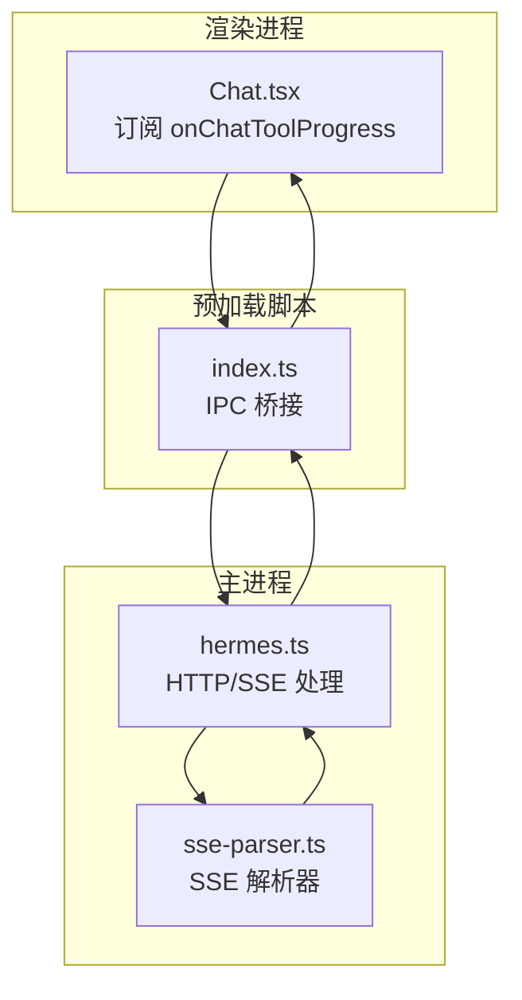
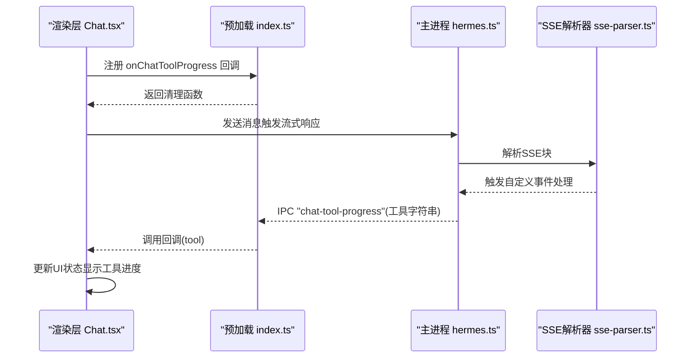
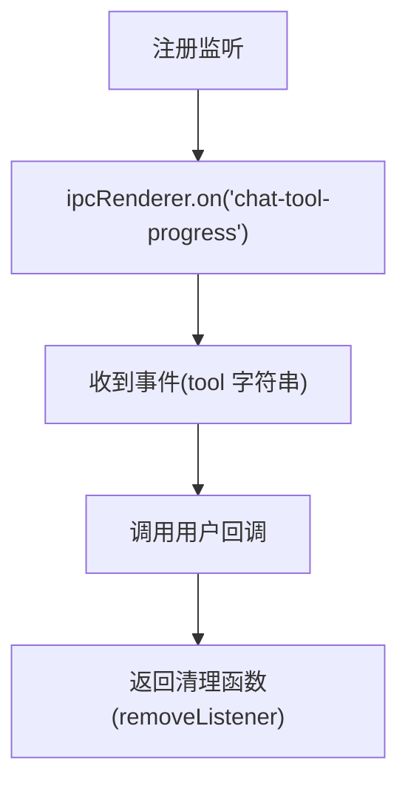
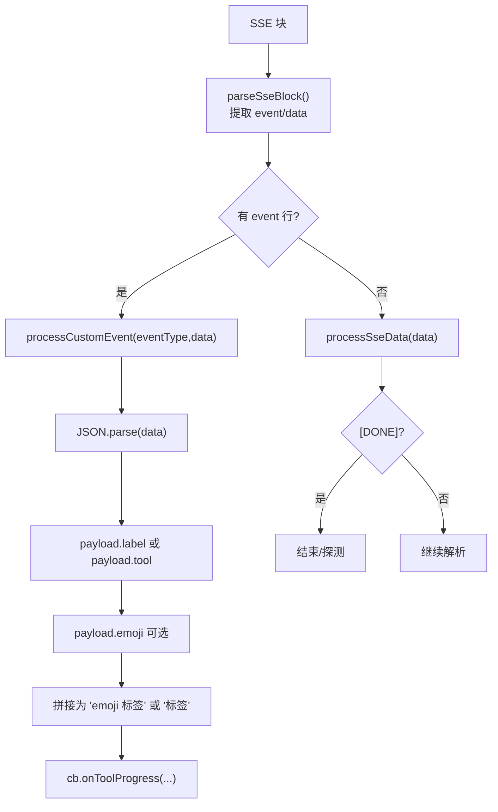
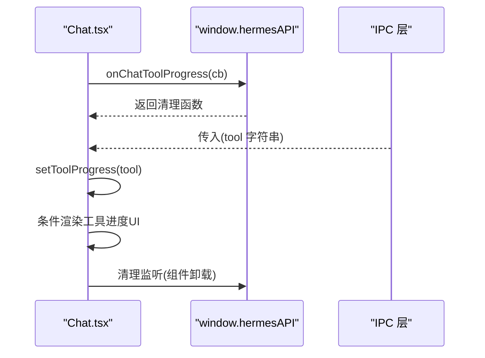
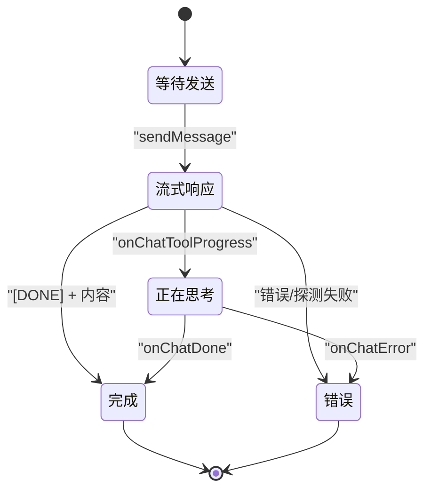

# 工具进度API

<cite>
**本文档引用的文件**
- [src/preload/index.ts](file://src/preload/index.ts)
- [src/preload/index.d.ts](file://src/preload/index.d.ts)
- [src/main/sse-parser.ts](file://src/main/sse-parser.ts)
- [src/main/hermes.ts](file://src/main/hermes.ts)
- [src/renderer/src/screens/Chat/Chat.tsx](file://src/renderer/src/screens/Chat/Chat.tsx)
- [tests/sse-parser.test.ts](file://tests/sse-parser.test.ts)
</cite>

## 目录
1. [简介](#简介)
2. [项目结构](#项目结构)
3. [核心组件](#核心组件)
4. [架构总览](#架构总览)
5. [详细组件分析](#详细组件分析)
6. [依赖关系分析](#依赖关系分析)
7. [性能考量](#性能考量)
8. [故障排查指南](#故障排查指南)
9. [结论](#结论)
10. [附录](#附录)

## 简介
本文件系统性阐述工具进度API的设计与实现，重点围绕 onChatToolProgress 接口，覆盖以下方面：
- 实时通知机制：SSE 自定义事件 hermes.tool.progress 的解析与转发
- 工具标识与进度展示：工具名、表情符号与标签的组合呈现
- 生命周期管理：从发送消息到完成回调的完整链路
- 进度数据格式规范与更新频率控制：SSE 事件与内容注入的双通道策略
- 监听注册、事件处理与状态跟踪：渲染层订阅与UI联动
- 异常处理、进度丢失恢复与用户反馈：错误捕获与探测回退
- 实际使用示例：在聊天界面中监听工具进度并更新UI

## 项目结构
工具进度API横跨主进程（Electron 主线程）、预加载脚本（Preload）与渲染进程（React UI），采用IPC与SSE双向通信：
- 主进程负责HTTP请求、SSE解析与事件分发
- 预加载脚本封装IPC接口，暴露 onChatToolProgress 给渲染层
- 渲染层订阅进度事件，驱动UI状态更新

图表来源
- [src/renderer/src/screens/Chat/Chat.tsx:287-308](file://src/renderer/src/screens/Chat/Chat.tsx#L287-L308)
- [src/preload/index.ts:191-196](file://src/preload/index.ts#L191-L196)
- [src/main/hermes.ts:168-434](file://src/main/hermes.ts#L168-L434)
- [src/main/sse-parser.ts:1-131](file://src/main/sse-parser.ts#L1-L131)

章节来源
- [src/preload/index.ts:191-196](file://src/preload/index.ts#L191-L196)
- [src/main/hermes.ts:168-434](file://src/main/hermes.ts#L168-L434)
- [src/main/sse-parser.ts:1-131](file://src/main/sse-parser.ts#L1-L131)
- [src/renderer/src/screens/Chat/Chat.tsx:287-308](file://src/renderer/src/screens/Chat/Chat.tsx#L287-L308)

## 核心组件
- 预加载API：onChatToolProgress 将主进程发出的 "chat-tool-progress" IPC 事件转发给渲染层回调
- 主进程SSE解析器：识别自定义事件 hermes.tool.progress，提取工具信息并触发回调
- 渲染层订阅：在聊天组件中注册进度监听，更新UI状态

章节来源
- [src/preload/index.d.ts:118-118](file://src/preload/index.d.ts#L118-L118)
- [src/preload/index.ts:191-196](file://src/preload/index.ts#L191-L196)
- [src/main/sse-parser.ts:29-46](file://src/main/sse-parser.ts#L29-L46)
- [src/main/hermes.ts:269-280](file://src/main/hermes.ts#L269-L280)

## 架构总览
工具进度API的端到端流程如下：

图表来源
- [src/renderer/src/screens/Chat/Chat.tsx:287-308](file://src/renderer/src/screens/Chat/Chat.tsx#L287-L308)
- [src/preload/index.ts:191-196](file://src/preload/index.ts#L191-L196)
- [src/main/hermes.ts:268-280](file://src/main/hermes.ts#L268-L280)
- [src/main/sse-parser.ts:29-46](file://src/main/sse-parser.ts#L29-L46)

## 详细组件分析

### onChatToolProgress 接口与IPC桥接
- 预加载脚本提供 onChatToolProgress(callback) 方法，内部通过 ipcRenderer.on 订阅 "chat-tool-progress" 事件，并返回移除监听的函数
- 渲染层通过 window.hermesAPI.onChatToolProgress 注册回调，接收来自主进程的工具进度字符串

图表来源
- [src/preload/index.ts:191-196](file://src/preload/index.ts#L191-L196)

章节来源
- [src/preload/index.d.ts:118-118](file://src/preload/index.d.ts#L118-L118)
- [src/preload/index.ts:191-196](file://src/preload/index.ts#L191-L196)

### SSE 自定义事件 hermes.tool.progress 的解析与分发
- 主进程在处理SSE数据时，会解析每个块，若包含 event: 行则视为自定义事件
- 当事件类型为 "hermes.tool.progress" 时，解析JSON负载，优先使用 label，其次使用 tool，emoji可选
- 解析后的字符串（emoji+空格+标签或工具名）通过回调传递给预加载层，再由IPC发送到渲染层

图表来源
- [src/main/hermes.ts:370-387](file://src/main/hermes.ts#L370-L387)
- [src/main/hermes.ts:269-280](file://src/main/hermes.ts#L269-L280)
- [src/main/sse-parser.ts:116-130](file://src/main/sse-parser.ts#L116-L130)
- [src/main/sse-parser.ts:29-46](file://src/main/sse-parser.ts#L29-L46)

章节来源
- [src/main/sse-parser.ts:29-46](file://src/main/sse-parser.ts#L29-L46)
- [src/main/sse-parser.ts:116-130](file://src/main/sse-parser.ts#L116-L130)
- [src/main/hermes.ts:268-280](file://src/main/hermes.ts#L268-L280)
- [src/main/hermes.ts:370-387](file://src/main/hermes.ts#L370-L387)

### 渲染层监听与UI状态更新
- 在聊天组件中注册 onChatToolProgress 监听，设置本地状态 toolProgress
- 当存在工具进度且当前消息为代理回复时，显示独立的工具进度条；否则在输入区域显示“正在思考”占位
- 支持清理监听：组件卸载时调用返回的清理函数，避免内存泄漏

图表来源
- [src/renderer/src/screens/Chat/Chat.tsx:287-308](file://src/renderer/src/screens/Chat/Chat.tsx#L287-L308)

章节来源
- [src/renderer/src/screens/Chat/Chat.tsx:287-308](file://src/renderer/src/screens/Chat/Chat.tsx#L287-L308)

### 工具调用生命周期管理
- 发送消息：渲染层调用 sendMessage，主进程根据连接模式选择HTTP API或CLI回退
- 流式响应：主进程建立HTTP连接，按SSE块解析，实时分发内容、工具进度与用量
- 完成与错误：当收到 [DONE] 且有内容时触发完成；无内容时进行探测请求以揭示真实错误
- 中止：支持 abortChat 中止当前对话

图表来源
- [src/main/hermes.ts:168-434](file://src/main/hermes.ts#L168-L434)
- [src/preload/index.ts:173-173](file://src/preload/index.ts#L173-L173)

章节来源
- [src/main/hermes.ts:168-434](file://src/main/hermes.ts#L168-L434)
- [src/preload/index.ts:173-173](file://src/preload/index.ts#L173-L173)

### 进度数据格式规范与更新频率
- 数据格式：SSE 自定义事件 hermes.tool.progress 的负载为JSON对象，字段包括
  - tool：工具键名（必填或回退字段）
  - label：人类可读标签（优先使用）
  - emoji：表情符号（可选）
- 输出格式：预加载层将 "emoji 标签" 或 "标签" 作为单一字符串传递给渲染层
- 更新频率：SSE 流式推送，每次事件块到达即更新一次
- 兼容性：支持将工具进度以“反引号包裹”的内联模式注入到内容中，主进程仍能识别并转为独立进度事件

章节来源
- [src/main/sse-parser.ts:34-40](file://src/main/sse-parser.ts#L34-L40)
- [src/main/sse-parser.ts:96-104](file://src/main/sse-parser.ts#L96-L104)
- [tests/sse-parser.test.ts:49-111](file://tests/sse-parser.test.ts#L49-L111)

### 异常处理、进度丢失恢复与用户反馈
- 错误捕获：SSE数据解析异常会被静默跳过；自定义事件JSON解析异常也会被忽略
- 进度丢失恢复：当流式响应为空时，主进程发起非流式探测请求，以揭示真实错误并触发错误回调
- 用户反馈：渲染层在有工具进度时优先显示进度UI；否则显示“正在思考”占位，提升交互感知

章节来源
- [src/main/sse-parser.ts:105-107](file://src/main/sse-parser.ts#L105-L107)
- [src/main/sse-parser.ts:41-43](file://src/main/sse-parser.ts#L41-L43)
- [src/main/hermes.ts:218-266](file://src/main/hermes.ts#L218-L266)
- [src/renderer/src/screens/Chat/Chat.tsx:807-822](file://src/renderer/src/screens/Chat/Chat.tsx#L807-L822)

### 实际使用示例
- 在渲染层注册监听：
  - 使用 window.hermesAPI.onChatToolProgress 注册回调
  - 返回的清理函数用于组件卸载时移除监听
- 更新UI状态：
  - 将回调参数赋值到组件状态，条件渲染工具进度UI
- 处理执行结果：
  - 结合 onChatDone 与 onChatError，完成会话状态管理

章节来源
- [src/renderer/src/screens/Chat/Chat.tsx:287-308](file://src/renderer/src/screens/Chat/Chat.tsx#L287-L308)

## 依赖关系分析
- 预加载脚本依赖 Electron IPC 与 hermesAPI 类型声明
- 主进程依赖 SSE 解析器与HTTP客户端，负责事件分发
- 渲染层依赖预加载API与React状态管理

图表来源
- [src/renderer/src/screens/Chat/Chat.tsx:287-308](file://src/renderer/src/screens/Chat/Chat.tsx#L287-L308)
- [src/preload/index.ts:191-196](file://src/preload/index.ts#L191-L196)
- [src/main/hermes.ts:168-434](file://src/main/hermes.ts#L168-L434)
- [src/main/sse-parser.ts:1-131](file://src/main/sse-parser.ts#L1-L131)

章节来源
- [src/preload/index.ts:191-196](file://src/preload/index.ts#L191-L196)
- [src/main/hermes.ts:168-434](file://src/main/hermes.ts#L168-L434)
- [src/main/sse-parser.ts:1-131](file://src/main/sse-parser.ts#L1-L131)
- [src/renderer/src/screens/Chat/Chat.tsx:287-308](file://src/renderer/src/screens/Chat/Chat.tsx#L287-L308)

## 性能考量
- SSE 流式解析：按块增量处理，降低内存占用
- 事件分流：自定义事件与数据事件分离，避免重复解析
- 探测回退：空流时的非流式探测仅在必要时触发，减少额外开销
- UI更新：单次事件触发一次状态更新，避免频繁重渲染

## 故障排查指南
- 未收到工具进度事件
  - 检查是否正确注册 onChatToolProgress 并在组件卸载时调用清理函数
  - 确认主进程已正确解析 hermes.tool.progress 事件
- 进度字符串为空或格式异常
  - 确保后端负载包含 tool 或 label 字段
  - 检查 emoji 是否为可选字段，不影响基本显示
- 流式响应为空但无错误
  - 主进程会自动探测真实错误；检查网络连接与模型配置
- 单元测试参考
  - 测试覆盖了事件解析、回退逻辑与错误处理场景

章节来源
- [tests/sse-parser.test.ts:49-111](file://tests/sse-parser.test.ts#L49-L111)
- [src/main/sse-parser.ts:29-46](file://src/main/sse-parser.ts#L29-L46)
- [src/main/hermes.ts:218-266](file://src/main/hermes.ts#L218-L266)

## 结论
工具进度API通过SSE自定义事件与IPC桥接，实现了对工具执行进度的实时、可靠通知。其设计兼顾了向后兼容（内联进度注入）与现代事件模型（独立事件），并在异常场景下提供了稳健的探测与回退机制。渲染层通过简单的监听与状态更新即可实现丰富的用户反馈。

## 附录
- 关键实现路径
  - 预加载API定义与实现：[src/preload/index.d.ts:118-118](file://src/preload/index.d.ts#L118-L118)，[src/preload/index.ts:191-196](file://src/preload/index.ts#L191-L196)
  - SSE解析器：[src/main/sse-parser.ts:29-46](file://src/main/sse-parser.ts#L29-L46)，[src/main/sse-parser.ts:116-130](file://src/main/sse-parser.ts#L116-L130)
  - 主进程SSE处理与事件分发：[src/main/hermes.ts:268-280](file://src/main/hermes.ts#L268-L280)，[src/main/hermes.ts:370-387](file://src/main/hermes.ts#L370-L387)
  - 渲染层监听与UI更新：[src/renderer/src/screens/Chat/Chat.tsx:287-308](file://src/renderer/src/screens/Chat/Chat.tsx#L287-L308)