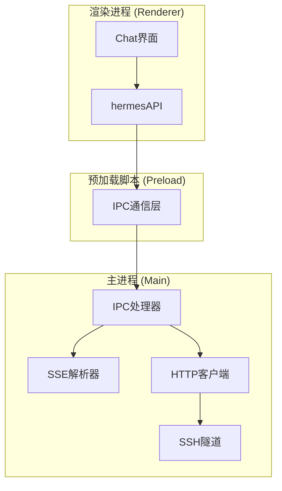
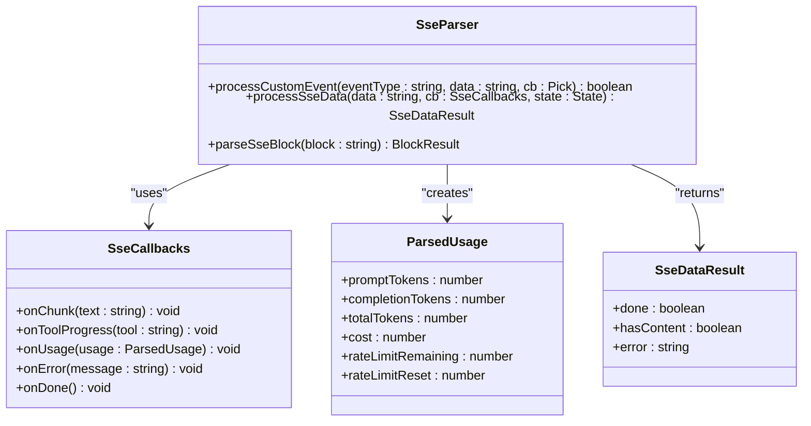
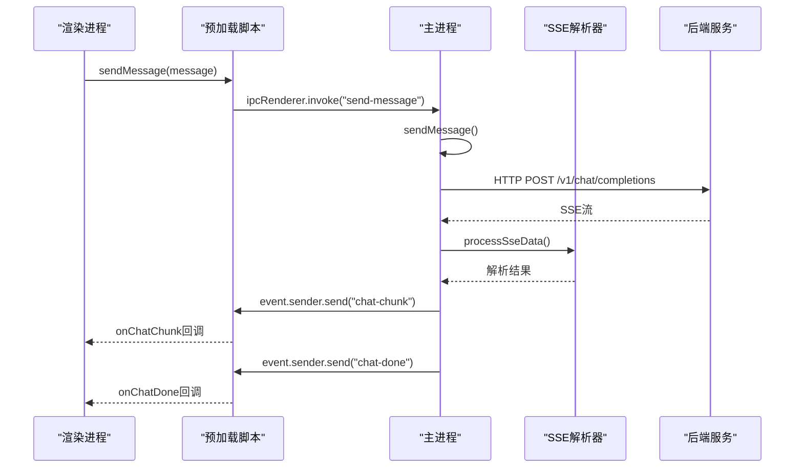
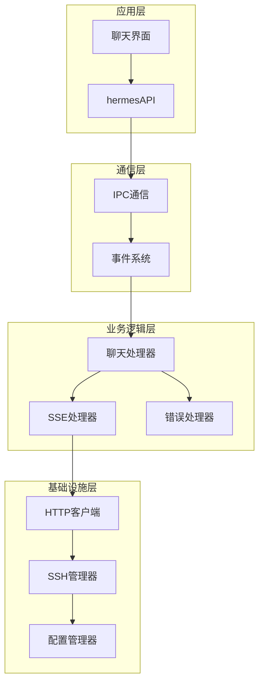
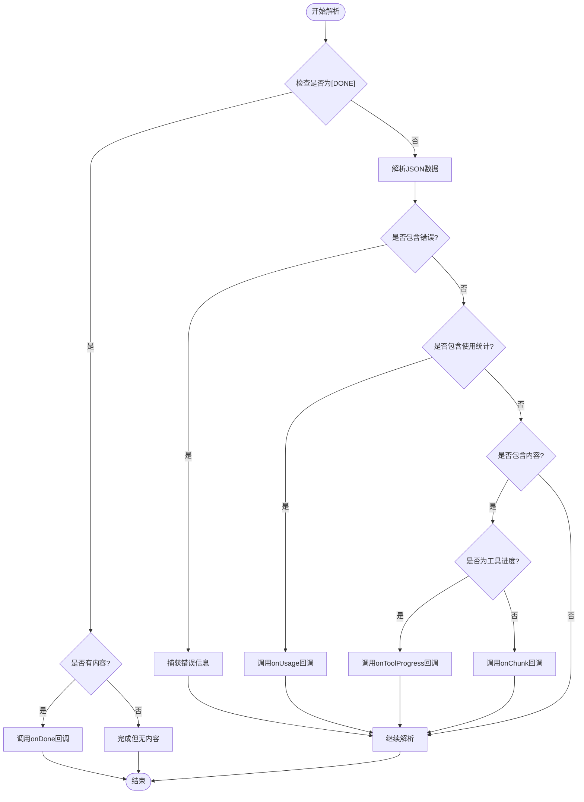
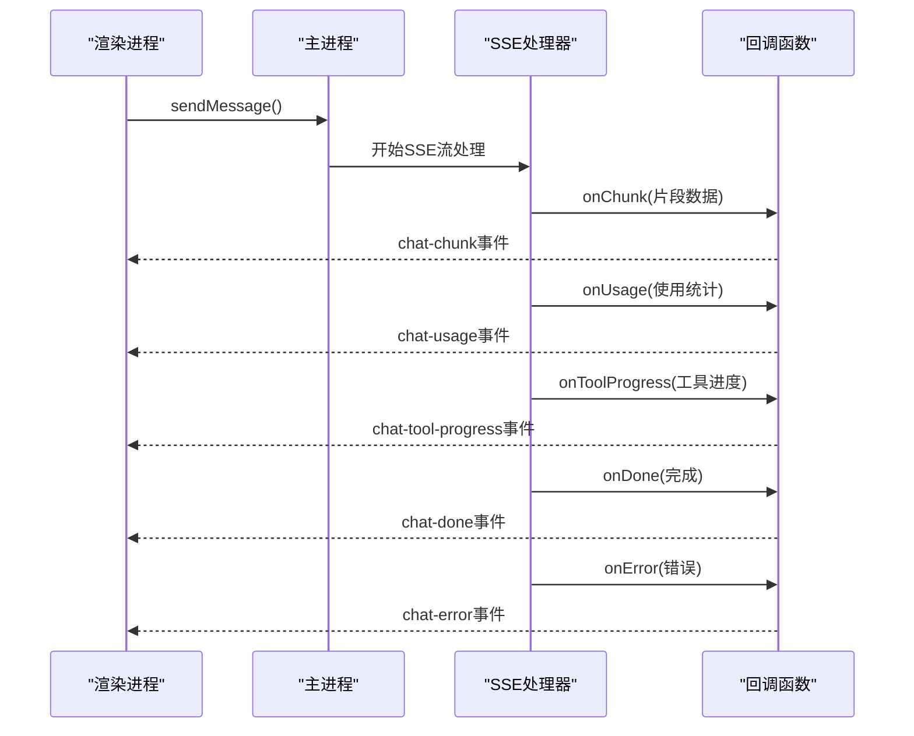
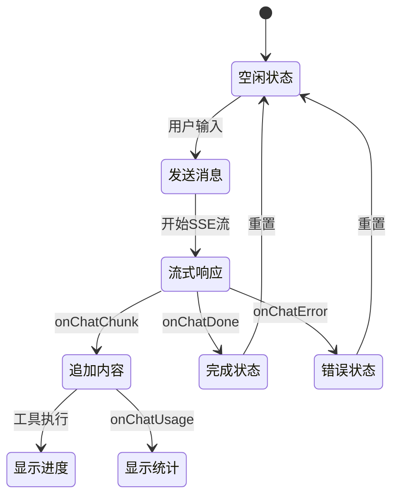
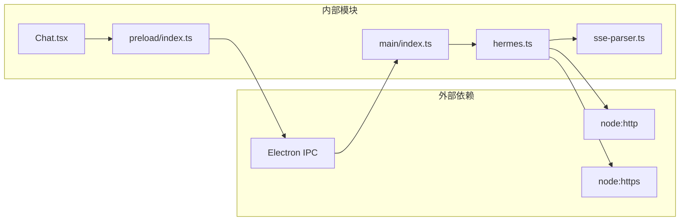

# 流式响应API

<cite>
**本文档引用的文件**
- [src/main/sse-parser.ts](file://src/main/sse-parser.ts)
- [src/main/hermes.ts](file://src/main/hermes.ts)
- [src/main/index.ts](file://src/main/index.ts)
- [src/preload/index.ts](file://src/preload/index.ts)
- [src/renderer/src/screens/Chat/Chat.tsx](file://src/renderer/src/screens/Chat/Chat.tsx)
- [tests/sse-parser.test.ts](file://tests/sse-parser.test.ts)
- [src/main/ssh-tunnel.ts](file://src/main/ssh-tunnel.ts)
</cite>

## 目录
1. [简介](#简介)
2. [项目结构](#项目结构)
3. [核心组件](#核心组件)
4. [架构概览](#架构概览)
5. [详细组件分析](#详细组件分析)
6. [依赖关系分析](#依赖关系分析)
7. [性能考虑](#性能考虑)
8. [故障排除指南](#故障排除指南)
9. [结论](#结论)

## 简介

流式响应API是Hermes Desktop应用的核心功能之一，它实现了基于Server-Sent Events (SSE) 的实时消息传输机制。该系统允许用户与AI代理进行实时对话，其中响应内容以增量方式逐步返回，提供流畅的用户体验。

本API支持以下关键特性：
- 实时流式响应处理
- 多种事件类型监听（内容片段、工具进度、使用统计、完成事件）
- 错误处理和恢复机制
- 断线重连和超时处理
- 数据完整性验证
- 内存管理优化

## 项目结构

流式响应API的实现分布在三个主要层次中：



**图表来源**
- [src/renderer/src/screens/Chat/Chat.tsx:244-308](file://src/renderer/src/screens/Chat/Chat.tsx#L244-L308)
- [src/preload/index.ts:157-228](file://src/preload/index.ts#L157-L228)
- [src/main/index.ts:544-640](file://src/main/index.ts#L544-L640)

**章节来源**
- [src/renderer/src/screens/Chat/Chat.tsx:1-800](file://src/renderer/src/screens/Chat/Chat.tsx#L1-L800)
- [src/preload/index.ts:1-701](file://src/preload/index.ts#L1-L701)
- [src/main/index.ts:544-743](file://src/main/index.ts#L544-L743)

## 核心组件

### 1. SSE解析器 (SSE Parser)

SSE解析器是流式响应API的核心组件，负责解析服务器发送的SSE事件并提取有用的数据。



**图表来源**
- [src/main/sse-parser.ts:14-130](file://src/main/sse-parser.ts#L14-L130)

### 2. 主进程处理器

主进程负责处理来自渲染进程的请求，并与后端服务建立SSE连接。



**图表来源**
- [src/main/index.ts:544-640](file://src/main/index.ts#L544-L640)
- [src/main/hermes.ts:168-434](file://src/main/hermes.ts#L168-L434)

**章节来源**
- [src/main/sse-parser.ts:1-131](file://src/main/sse-parser.ts#L1-L131)
- [src/main/hermes.ts:153-434](file://src/main/hermes.ts#L153-L434)

## 架构概览

流式响应API采用分层架构设计，确保了良好的模块化和可维护性：



**图表来源**
- [src/preload/index.ts:157-228](file://src/preload/index.ts#L157-L228)
- [src/main/index.ts:544-640](file://src/main/index.ts#L544-L640)
- [src/main/hermes.ts:168-434](file://src/main/hermes.ts#L168-L434)

## 详细组件分析

### SSE数据解析组件

SSE数据解析组件是整个流式响应系统的核心，负责处理从服务器接收到的原始SSE数据。

#### 数据格式规范

SSE事件遵循标准格式：
- `event: hermes.tool.progress` - 自定义事件类型
- `data: {JSON数据}` - 事件载荷

#### 解析流程



**图表来源**
- [src/main/sse-parser.ts:58-110](file://src/main/sse-parser.ts#L58-L110)

#### 错误处理机制

SSE解析器实现了多层次的错误处理：

1. **JSON解析错误**：跳过格式错误的数据块
2. **SSE错误事件**：捕获服务器返回的错误信息
3. **网络异常**：处理连接中断和超时情况
4. **数据完整性**：验证解析结果的完整性

**章节来源**
- [src/main/sse-parser.ts:58-110](file://src/main/sse-parser.ts#L58-L110)
- [tests/sse-parser.test.ts:191-248](file://tests/sse-parser.test.ts#L191-L248)

### 预加载脚本API

预加载脚本提供了渲染进程访问流式响应API的接口：

#### 回调函数接口

| 接口名称 | 参数类型 | 描述 |
|---------|----------|------|
| onChatChunk | `(chunk: string) => void` | 接收响应片段数据 |
| onChatDone | `(sessionId?: string) => void` | 处理完成事件，包含会话ID |
| onChatError | `(error: string) => void` | 处理错误事件 |
| onChatToolProgress | `(tool: string) => void` | 处理工具执行进度 |
| onChatUsage | `(usage: ParsedUsage) => void` | 处理使用统计信息 |

#### 使用示例

```typescript
// 注册流式响应监听器
const cleanupChunk = window.hermesAPI.onChatChunk((chunk) => {
  console.log('收到响应片段:', chunk);
});

const cleanupDone = window.hermesAPI.onChatDone((sessionId) => {
  console.log('会话完成，会话ID:', sessionId);
});

const cleanupError = window.hermesAPI.onChatError((error) => {
  console.error('发生错误:', error);
});

// 清理监听器
cleanupChunk();
cleanupDone();
cleanupError();
```

**章节来源**
- [src/preload/index.ts:175-228](file://src/preload/index.ts#L175-L228)

### 主进程事件处理器

主进程负责协调整个流式响应过程：

#### 事件分发流程



**图表来源**
- [src/main/index.ts:586-635](file://src/main/index.ts#L586-L635)

**章节来源**
- [src/main/index.ts:544-640](file://src/main/index.ts#L544-L640)

### 聊天界面集成

聊天界面集成了流式响应API，提供了完整的用户交互体验：

#### 实时更新机制



**图表来源**
- [src/renderer/src/screens/Chat/Chat.tsx:244-308](file://src/renderer/src/screens/Chat/Chat.tsx#L244-L308)

**章节来源**
- [src/renderer/src/screens/Chat/Chat.tsx:244-308](file://src/renderer/src/screens/Chat/Chat.tsx#L244-L308)

## 依赖关系分析

流式响应API的依赖关系体现了清晰的分层架构：



**图表来源**
- [src/main/hermes.ts:1-20](file://src/main/hermes.ts#L1-L20)
- [src/preload/index.ts:1-14](file://src/preload/index.ts#L1-L14)

### 关键依赖关系

1. **SSE解析器依赖**：独立于Electron和HTTP环境，便于单元测试
2. **主进程依赖**：依赖Node.js的HTTP/HTTPS模块和Electron IPC
3. **预加载脚本依赖**：依赖Electron的IPC渲染器
4. **渲染进程依赖**：通过预加载脚本访问API

**章节来源**
- [src/main/sse-parser.ts:1-131](file://src/main/sse-parser.ts#L1-L131)
- [src/main/hermes.ts:1-800](file://src/main/hermes.ts#L1-L800)

## 性能考虑

### 内存管理优化

1. **缓冲区管理**：使用增量缓冲区避免内存泄漏
2. **回调清理**：提供清理函数防止内存泄漏
3. **对象池**：复用解析器状态对象
4. **垃圾回收**：及时释放未使用的监听器

### 网络性能优化

1. **连接复用**：利用HTTP keep-alive减少连接开销
2. **超时控制**：设置合理的超时时间避免资源占用
3. **断线重试**：实现智能重连机制
4. **流量控制**：限制同时进行的流式请求数量

### 数据处理优化

1. **增量解析**：逐块解析SSE数据避免大对象创建
2. **事件去重**：过滤重复的工具进度事件
3. **内容压缩**：对大量文本内容进行压缩处理
4. **缓存策略**：缓存会话元数据减少重复计算

## 故障排除指南

### 常见问题及解决方案

#### 1. SSE连接失败

**症状**：onChatError回调被触发，显示连接错误

**可能原因**：
- 网络连接不稳定
- 服务器端点不可用
- 认证凭据无效

**解决步骤**：
1. 检查网络连接状态
2. 验证API密钥配置
3. 确认服务器可达性
4. 查看详细的错误信息

#### 2. 流式响应中断

**症状**：onChatDone回调在没有内容的情况下触发

**可能原因**：
- 服务器提前关闭连接
- 请求超时
- 网络中断

**解决步骤**：
1. 检查服务器日志
2. 增加超时时间
3. 实现断线重连机制
4. 验证网络稳定性

#### 3. 内存泄漏问题

**症状**：长时间运行后内存使用量持续增长

**可能原因**：
- 未清理的事件监听器
- 缓冲区未正确释放
- 回调函数持有引用

**解决步骤**：
1. 确保每次使用后调用清理函数
2. 检查回调函数的闭包引用
3. 实施内存使用监控
4. 定期进行垃圾回收

### 调试技巧

#### 启用详细日志

```typescript
// 在开发环境中启用详细日志
window.hermesAPI.onChatError((error) => {
  console.error('流式响应错误:', {
    timestamp: Date.now(),
    error: error,
    stack: new Error().stack
  });
});
```

#### 监控性能指标

```typescript
// 监控流式响应性能
let startTime = Date.now();
let chunkCount = 0;
let totalBytes = 0;

const cleanup = window.hermesAPI.onChatChunk((chunk) => {
  chunkCount++;
  totalBytes += chunk.length;
  
  if (chunkCount % 10 === 0) {
    const elapsed = Date.now() - startTime;
    console.log(`性能指标: ${chunkCount}个片段, ${totalBytes}字节, ${elapsed}ms`);
  }
});
```

**章节来源**
- [src/main/hermes.ts:417-424](file://src/main/hermes.ts#L417-L424)
- [src/renderer/src/screens/Chat/Chat.tsx:275-286](file://src/renderer/src/screens/Chat/Chat.tsx#L275-L286)

## 结论

流式响应API通过精心设计的架构和实现，为Hermes Desktop应用提供了高效、可靠的实时消息传输能力。该系统的主要优势包括：

1. **模块化设计**：清晰的分层架构便于维护和扩展
2. **健壮的错误处理**：多层错误检测和恢复机制
3. **性能优化**：内存管理和网络优化确保系统稳定运行
4. **易于使用**：简洁的API接口降低集成难度
5. **可测试性**：独立的解析器模块支持全面的单元测试

通过合理使用这些组件和遵循最佳实践，开发者可以构建出高性能、用户体验优秀的流式响应应用。