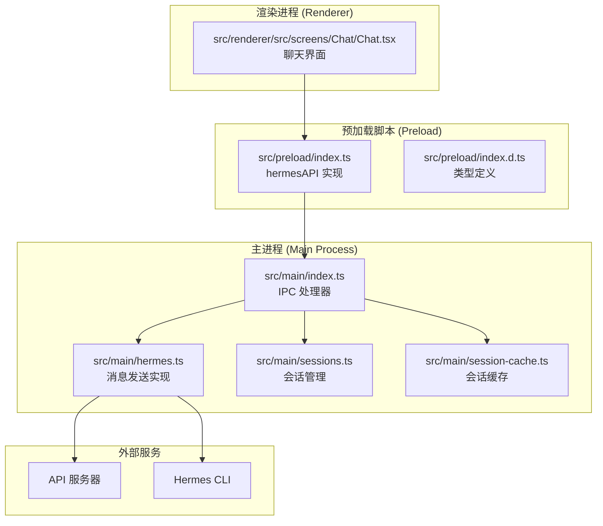
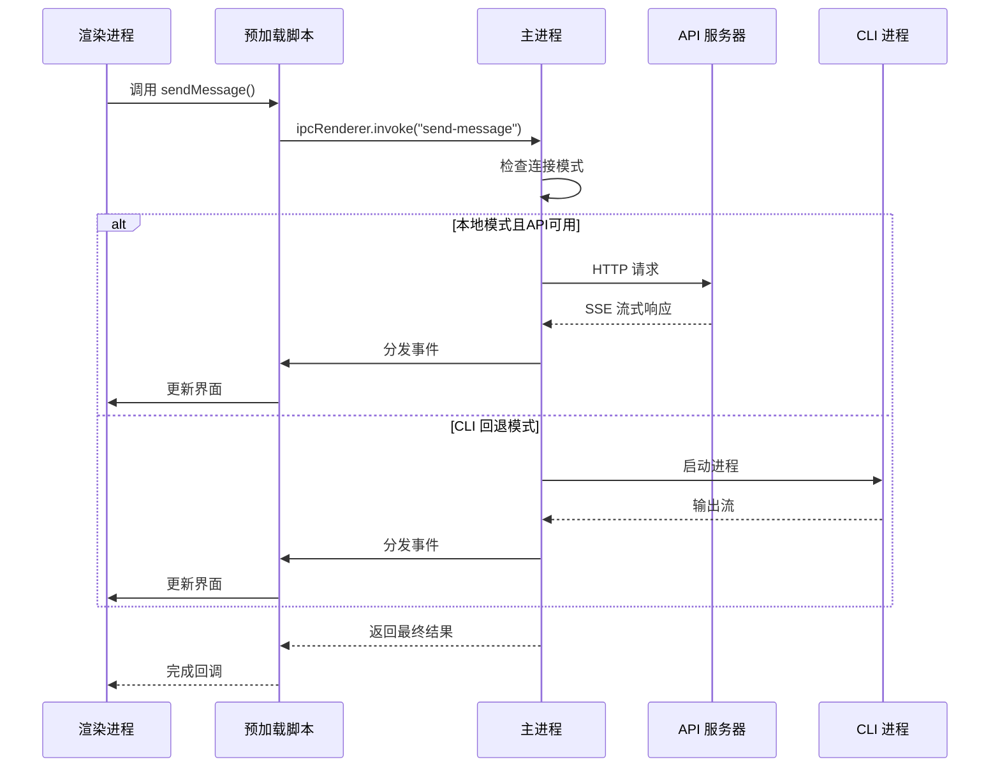
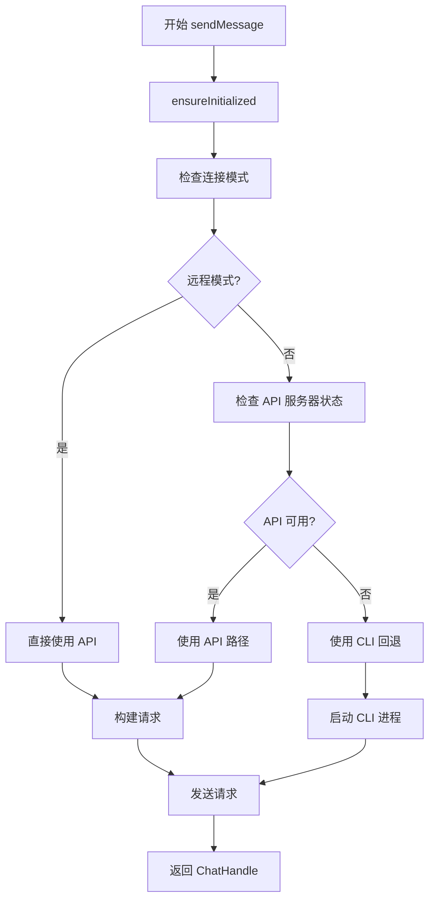
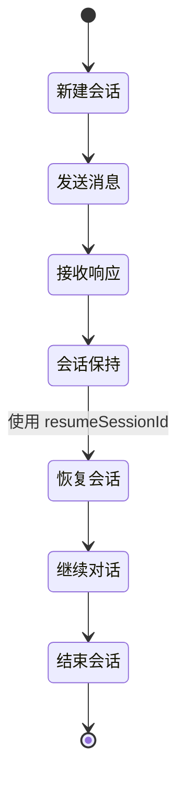
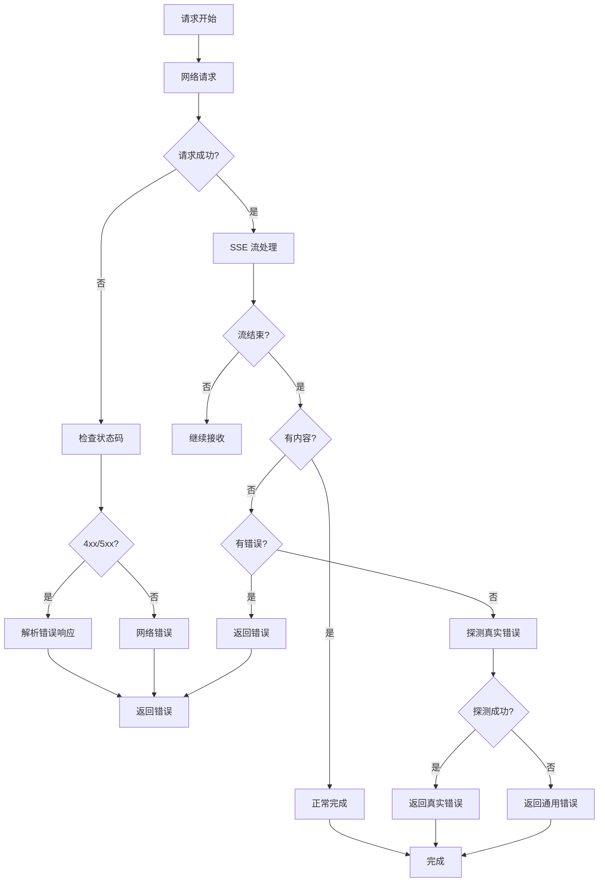
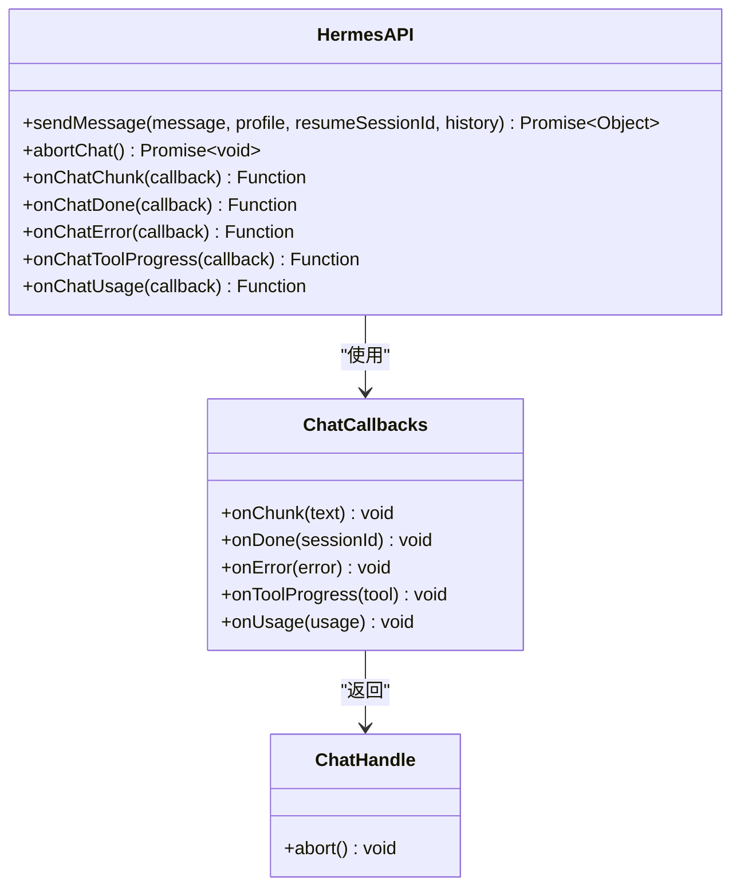
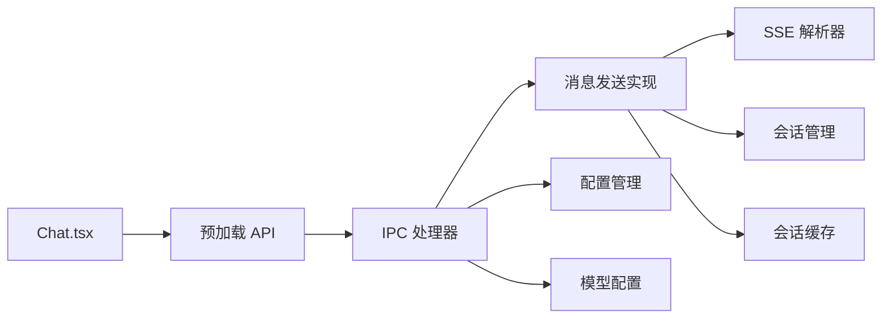

# 消息发送API

<cite>
**本文档引用的文件**
- [src/main/hermes.ts](file://src/main/hermes.ts)
- [src/preload/index.ts](file://src/preload/index.ts)
- [src/preload/index.d.ts](file://src/preload/index.d.ts)
- [src/main/index.ts](file://src/main/index.ts)
- [src/renderer/src/screens/Chat/Chat.tsx](file://src/renderer/src/screens/Chat/Chat.tsx)
- [src/main/sse-parser.ts](file://src/main/sse-parser.ts)
- [src/main/sessions.ts](file://src/main/sessions.ts)
- [src/main/session-cache.ts](file://src/main/session-cache.ts)
- [docs/hermes-desktop-architecture.md](file://docs/hermes-desktop-architecture.md)
</cite>

## 目录
1. [简介](#简介)
2. [项目结构](#项目结构)
3. [核心组件](#核心组件)
4. [架构概览](#架构概览)
5. [详细组件分析](#详细组件分析)
6. [依赖关系分析](#依赖关系分析)
7. [性能考虑](#性能考虑)
8. [故障排除指南](#故障排除指南)
9. [结论](#结论)

## 简介

本文档详细介绍了 Hermes 桌面应用中的消息发送 API，重点分析 `sendMessage` 接口的完整实现。该 API 支持异步消息发送、会话恢复、历史消息传递和多种错误处理策略。

Hermes 是一个基于 Electron 的桌面应用，提供了与后端 AI 服务交互的能力。消息发送 API 是其核心功能之一，支持本地模式和远程模式两种运行方式。

## 项目结构

Hermes 应用采用典型的 Electron 架构，主要分为三个进程：



**图表来源**
- [docs/hermes-desktop-architecture.md:43-181](file://docs/hermes-desktop-architecture.md#L43-L181)
- [src/main/hermes.ts:1-887](file://src/main/hermes.ts#L1-L887)

**章节来源**
- [docs/hermes-desktop-architecture.md:43-181](file://docs/hermes-desktop-architecture.md#L43-L181)

## 核心组件

### sendMessage 接口定义

`sendMessage` 是消息发送 API 的核心函数，具有以下签名：

```typescript
export async function sendMessage(
  message: string,
  cb: ChatCallbacks,
  profile?: string,
  resumeSessionId?: string,
  history?: Array<{ role: string; content: string }>
): Promise<ChatHandle>
```

**参数说明：**

1. **message** (`string`): 用户要发送的消息内容
2. **cb** (`ChatCallbacks`): 回调函数对象，包含事件处理函数
3. **profile** (`string`, 可选): 配置文件名称，用于指定不同的模型配置
4. **resumeSessionId** (`string`, 可选): 会话恢复 ID，用于继续之前的对话
5. **history** (`Array<{ role: string; content: string }>, 可选): 历史消息数组

**返回值：** `Promise<ChatHandle>` - 返回一个可取消的操作句柄

**章节来源**
- [src/main/hermes.ts:654-679](file://src/main/hermes.ts#L654-L679)

### ChatCallbacks 接口

回调函数接口定义了消息发送过程中的各种事件处理：

```typescript
export interface ChatCallbacks {
  onChunk: (text: string) => void;           // 接收流式响应片段
  onDone: (sessionId?: string) => void;      // 发送完成
  onError: (error: string) => void;          // 发生错误
  onToolProgress?: (tool: string) => void;   // 工具执行进度
  onUsage?: (usage: Usage) => void;          // 使用量统计
}
```

**章节来源**
- [src/main/hermes.ts:153-166](file://src/main/hermes.ts#L153-L166)

## 架构概览

消息发送 API 采用双路径设计，支持本地 API 服务器和 CLI 两种模式：



**图表来源**
- [src/main/hermes.ts:654-679](file://src/main/hermes.ts#L654-L679)
- [src/main/index.ts:544-640](file://src/main/index.ts#L544-L640)

## 详细组件分析

### 消息发送流程

#### 1. 参数验证和初始化

sendMessage 函数首先进行必要的初始化检查：



**图表来源**
- [src/main/hermes.ts:654-679](file://src/main/hermes.ts#L654-L679)

#### 2. API 路径实现

当 API 服务器可用时，sendMessageViaApi 函数负责处理：

**消息构建：**
- 将历史消息转换为标准 OpenAI 格式
- 将当前用户消息添加到消息数组末尾
- 设置流式响应标志

**SSE 流处理：**
- 解析服务器发送事件 (SSE) 格式
- 提取增量内容并实时更新界面
- 处理自定义事件如工具进度通知

**错误处理：**
- 监听网络超时和连接错误
- 处理 API 返回的错误状态码
- 实现探测机制以获取真实错误信息

**章节来源**
- [src/main/hermes.ts:168-434](file://src/main/hermes.ts#L168-L434)

#### 3. CLI 回退路径

当 API 不可用或在某些情况下，系统会回退到 CLI 模式：

**环境准备：**
- 注入所有必要的 API 密钥到环境变量
- 设置正确的模型提供商配置
- 处理自定义端点的特殊配置

**输出解析：**
- 过滤 ANSI 转义序列
- 提取会话 ID 信息
- 处理标准错误输出

**章节来源**
- [src/main/hermes.ts:442-646](file://src/main/hermes.ts#L442-L646)

### 会话管理

#### 会话恢复机制

会话恢复功能允许用户继续之前的对话：



**图表来源**
- [src/main/hermes.ts:201-216](file://src/main/hermes.ts#L201-L216)

#### 历史消息处理

历史消息以标准 OpenAI 格式传递：

| 字段名 | 类型 | 必需 | 描述 |
|--------|------|------|------|
| role | string | 是 | 消息角色，支持 "user"、"assistant"、"tool" |
| content | string | 是 | 消息内容文本 |

**章节来源**
- [src/main/hermes.ts:178-188](file://src/main/hermes.ts#L178-L188)

### 错误处理策略

系统实现了多层次的错误处理机制：



**图表来源**
- [src/main/hermes.ts:218-266](file://src/main/hermes.ts#L218-L266)

**章节来源**
- [src/main/hermes.ts:417-424](file://src/main/hermes.ts#L417-L424)

### 预加载 API 实现

预加载脚本提供了浏览器安全的 API 暴露：



**图表来源**
- [src/preload/index.d.ts:108-129](file://src/preload/index.d.ts#L108-L129)
- [src/preload/index.ts:159-171](file://src/preload/index.ts#L159-L171)

**章节来源**
- [src/preload/index.ts:159-171](file://src/preload/index.ts#L159-L171)
- [src/preload/index.d.ts:108-129](file://src/preload/index.d.ts#L108-L129)

## 依赖关系分析

### 组件间依赖



**图表来源**
- [src/main/index.ts:544-640](file://src/main/index.ts#L544-L640)
- [src/main/hermes.ts:1-887](file://src/main/hermes.ts#L1-L887)

### 外部依赖

消息发送 API 依赖于以下外部组件：

1. **HTTP 客户端**: Node.js 内置的 http/https 模块
2. **SSE 解析器**: 自定义的服务器发送事件解析逻辑
3. **进程管理**: child_process 模块用于 CLI 模式
4. **数据库访问**: better-sqlite3 用于会话数据存储

**章节来源**
- [src/main/hermes.ts:1-887](file://src/main/hermes.ts#L1-L887)

## 性能考虑

### 流式响应优化

系统采用服务器发送事件 (SSE) 实现流式响应，具有以下优势：

1. **低延迟**: 内容可以立即显示，无需等待完整响应
2. **内存效率**: 逐块处理响应，避免大对象内存占用
3. **实时性**: 支持实时更新用户界面

### 缓存策略

- **API 服务器状态缓存**: 避免频繁的健康检查
- **会话缓存**: 本地存储最近的会话信息
- **配置缓存**: 减少重复的配置读取操作

### 连接管理

- **超时控制**: 120 秒的请求超时时间
- **重试机制**: 在特定错误情况下自动重试
- **连接池**: 复用现有的网络连接

## 故障排除指南

### 常见问题诊断

1. **API 服务器不可达**
   - 检查本地 API 服务器是否启动
   - 验证防火墙设置
   - 确认端口 8642 是否被占用

2. **认证失败**
   - 验证 API 密钥配置
   - 检查连接模式设置
   - 确认 SSH 隧道状态

3. **流式响应中断**
   - 检查网络连接稳定性
   - 验证 SSE 服务器配置
   - 查看客户端日志

### 调试技巧

使用渲染进程中的聊天组件可以监控消息发送状态：

```typescript
// 监听消息片段
const cleanupChunk = window.hermesAPI.onChatChunk((chunk) => {
  console.log('收到片段:', chunk);
});

// 监听完成事件
const cleanupDone = window.hermesAPI.onChatDone((sessionId) => {
  console.log('会话完成:', sessionId);
});

// 监听错误
const cleanupError = window.hermesAPI.onChatError((error) => {
  console.error('发送错误:', error);
});
```

**章节来源**
- [src/renderer/src/screens/Chat/Chat.tsx:246-288](file://src/renderer/src/screens/Chat/Chat.tsx#L246-L288)

## 结论

Hermes 消息发送 API 提供了一个强大而灵活的接口，支持多种运行模式和丰富的功能特性。其设计充分考虑了性能、可靠性和用户体验，通过流式响应和会话管理等机制，为用户提供了流畅的对话体验。

关键特性包括：
- **双路径设计**: 支持本地 API 和 CLI 两种模式
- **流式响应**: 实时显示生成内容
- **会话管理**: 完整的会话生命周期管理
- **错误处理**: 多层次的错误检测和恢复
- **性能优化**: 缓存、超时控制和资源管理

该 API 为开发者提供了清晰的扩展点，可以根据具体需求进行定制和优化。