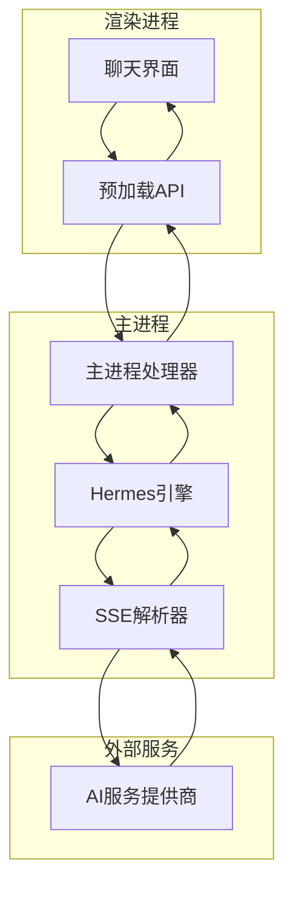
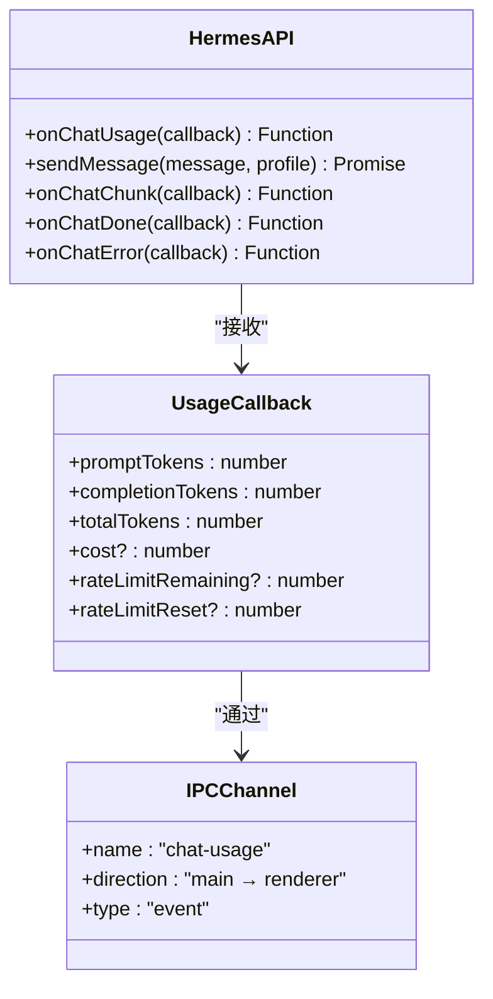
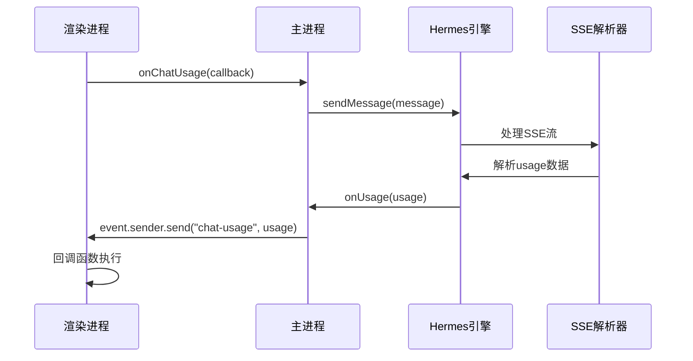
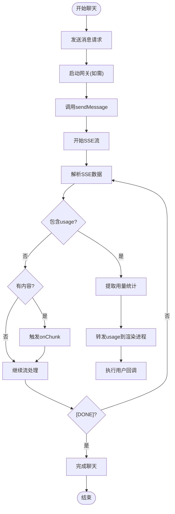
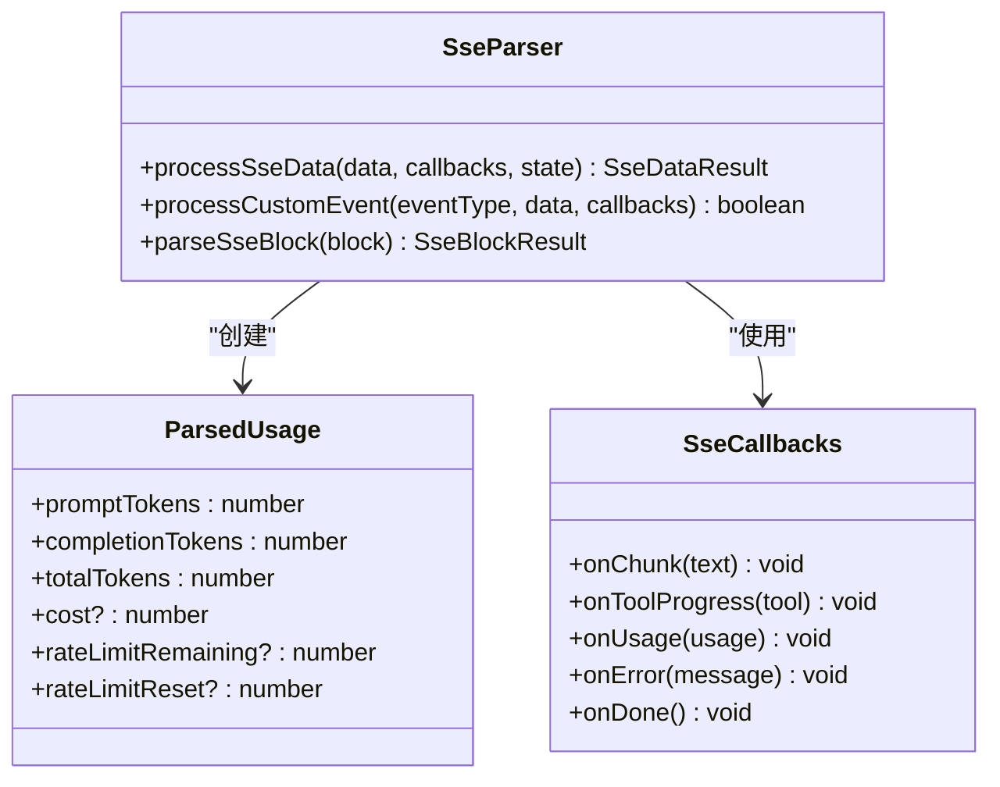
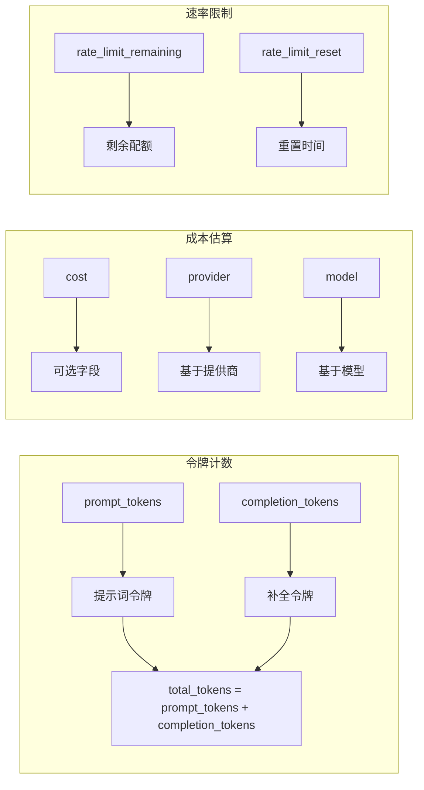
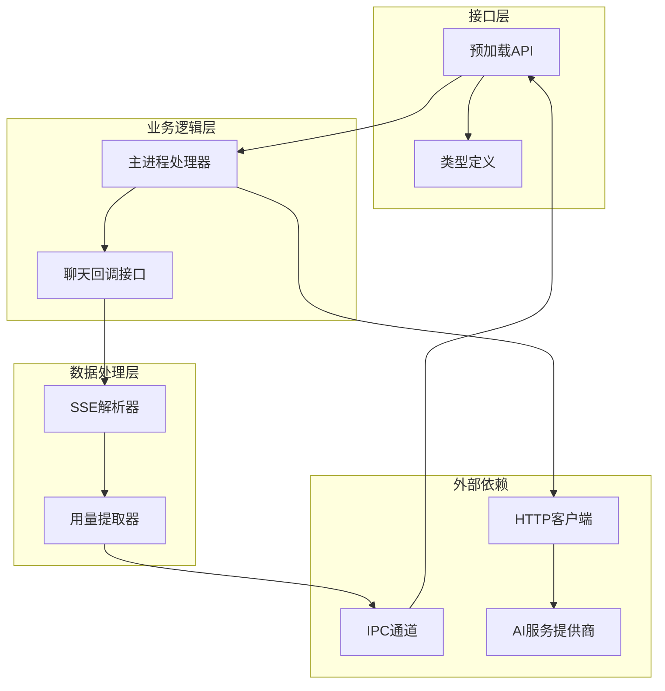
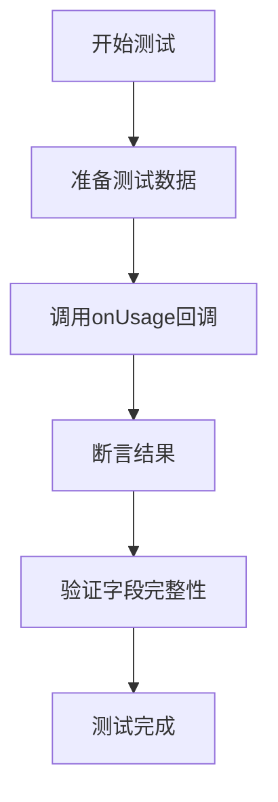

# 用量追踪API

<cite>
**本文档引用的文件**
- [src/preload/index.ts](file://src/preload/index.ts)
- [src/preload/index.d.ts](file://src/preload/index.d.ts)
- [src/main/index.ts](file://src/main/index.ts)
- [src/main/hermes.ts](file://src/main/hermes.ts)
- [src/main/sse-parser.ts](file://src/main/sse-parser.ts)
- [src/renderer/src/screens/Chat/Chat.tsx](file://src/renderer/src/screens/Chat/Chat.tsx)
- [tests/sse-parser.test.ts](file://tests/sse-parser.test.ts)
</cite>

## 目录
1. [简介](#简介)
2. [项目结构](#项目结构)
3. [核心组件](#核心组件)
4. [架构概览](#架构概览)
5. [详细组件分析](#详细组件分析)
6. [依赖关系分析](#依赖关系分析)
7. [性能考虑](#性能考虑)
8. [故障排除指南](#故障排除指南)
9. [结论](#结论)
10. [附录](#附录)

## 简介

用量追踪API是Hermes桌面应用中用于监控和统计AI对话服务使用情况的核心功能。该API提供了实时的令牌使用统计、成本估算和速率限制监控能力，帮助用户有效管理AI服务的使用成本和配额。

本API通过Electron的IPC机制实现跨进程通信，支持以下关键指标：
- **promptTokens**: 提示词令牌数
- **completionTokens**: 补全令牌数  
- **totalTokens**: 总令牌数
- **cost**: 费用估算
- **rateLimitRemaining**: 剩余配额
- **rateLimitReset**: 配额重置时间

## 项目结构

用量追踪API的实现采用分层架构设计，主要分布在三个层次：



**图表来源**
- [src/preload/index.ts:198-221](file://src/preload/index.ts#L198-L221)
- [src/main/index.ts:545-640](file://src/main/index.ts#L545-L640)
- [src/main/hermes.ts:168-434](file://src/main/hermes.ts#L168-L434)

**章节来源**
- [src/preload/index.ts:198-221](file://src/preload/index.ts#L198-L221)
- [src/main/index.ts:545-640](file://src/main/index.ts#L545-L640)
- [src/main/hermes.ts:168-434](file://src/main/hermes.ts#L168-L434)

## 核心组件

### 预加载API接口

预加载API提供了onChatUsage方法，这是用量追踪功能的入口点：



**图表来源**
- [src/preload/index.d.ts:119-128](file://src/preload/index.d.ts#L119-L128)
- [src/preload/index.ts:198-221](file://src/preload/index.ts#L198-L221)

用量统计对象的关键字段说明：
- **promptTokens**: 用户输入提示词的令牌计数
- **completionTokens**: AI模型生成内容的令牌计数
- **totalTokens**: promptTokens与completionTokens的总和
- **cost**: 可选的成本估算值
- **rateLimitRemaining**: 可选的剩余配额数量
- **rateLimitReset**: 可选的配额重置时间戳

**章节来源**
- [src/preload/index.d.ts:119-128](file://src/preload/index.d.ts#L119-L128)
- [src/preload/index.ts:198-221](file://src/preload/index.ts#L198-L221)

### 主进程处理器

主进程负责转发用量统计数据从Hermes引擎到渲染进程：



**图表来源**
- [src/main/index.ts:545-640](file://src/main/index.ts#L545-L640)
- [src/main/hermes.ts:306-316](file://src/main/hermes.ts#L306-L316)

**章节来源**
- [src/main/index.ts:545-640](file://src/main/index.ts#L545-L640)
- [src/main/hermes.ts:306-316](file://src/main/hermes.ts#L306-L316)

## 架构概览

用量追踪API采用事件驱动的架构模式，实现了完整的数据流管道：



**图表来源**
- [src/main/hermes.ts:282-333](file://src/main/hermes.ts#L282-L333)
- [src/main/index.ts:628-630](file://src/main/index.ts#L628-L630)

**章节来源**
- [src/main/hermes.ts:282-333](file://src/main/hermes.ts#L282-L333)
- [src/main/index.ts:628-630](file://src/main/index.ts#L628-L630)

## 详细组件分析

### SSE数据解析器

SSE解析器是用量追踪的核心组件，负责从服务器发送的SSE流中提取用量统计信息：



**图表来源**
- [src/main/sse-parser.ts:1-54](file://src/main/sse-parser.ts#L1-L54)

SSE解析器的处理流程：
1. 接收原始SSE数据块
2. 解析事件类型和数据内容
3. 检测是否为[DONE]标记
4. 提取usage字段中的统计信息
5. 调用相应的回调函数

**章节来源**
- [src/main/sse-parser.ts:1-54](file://src/main/sse-parser.ts#L1-L54)

### 用量统计计算

用量统计的计算遵循以下规则：



**图表来源**
- [src/main/sse-parser.ts:5-12](file://src/main/sse-parser.ts#L5-L12)
- [src/main/hermes.ts:306-316](file://src/main/hermes.ts#L306-L316)

**章节来源**
- [src/main/sse-parser.ts:5-12](file://src/main/sse-parser.ts#L5-L12)
- [src/main/hermes.ts:306-316](file://src/main/hermes.ts#L306-L316)

### 实时更新机制

用量统计数据通过SSE流实现实时传输，更新频率取决于上游服务的响应速度。系统设计确保：

- **增量更新**: 每个usage块只包含自上次更新以来的变化
- **错误处理**: 网络中断或服务错误时的优雅降级
- **内存管理**: 及时清理不再需要的事件监听器

**章节来源**
- [src/main/index.ts:628-630](file://src/main/index.ts#L628-L630)
- [src/preload/index.ts:218-221](file://src/preload/index.ts#L218-L221)

## 依赖关系分析

用量追踪API的依赖关系图展示了各组件间的交互：



**图表来源**
- [src/preload/index.ts:198-221](file://src/preload/index.ts#L198-L221)
- [src/main/index.ts:545-640](file://src/main/index.ts#L545-L640)
- [src/main/hermes.ts:153-166](file://src/main/hermes.ts#L153-L166)

**章节来源**
- [src/preload/index.ts:198-221](file://src/preload/index.ts#L198-L221)
- [src/main/index.ts:545-640](file://src/main/index.ts#L545-L640)
- [src/main/hermes.ts:153-166](file://src/main/hermes.ts#L153-L166)

## 性能考虑

### 内存使用优化

用量追踪API在设计时充分考虑了内存使用效率：

- **事件监听器管理**: 自动清理不再使用的监听器，防止内存泄漏
- **增量数据处理**: 只处理必要的usage数据，避免重复计算
- **异步处理**: 使用Promise和async/await避免阻塞主线程

### 网络性能

- **SSE流式处理**: 支持流式数据传输，减少内存占用
- **超时控制**: 设置合理的请求超时时间，避免长时间等待
- **健康检查**: 定期检查API服务器状态，及时发现连接问题

### 数据准确性保证

- **字段验证**: 对所有usage字段进行类型检查和边界验证
- **默认值处理**: 对缺失的可选字段提供合理默认值
- **错误恢复**: 网络错误时的自动重试机制

## 故障排除指南

### 常见问题及解决方案

**问题1: 无法接收到用量数据**
- 检查是否正确订阅了onChatUsage事件
- 确认上游服务返回了usage字段
- 验证IPC通道是否正常工作

**问题2: 用量统计不准确**
- 检查令牌计数的计算逻辑
- 验证成本估算的公式
- 确认速率限制数据的来源

**问题3: 性能问题**
- 监控内存使用情况
- 检查事件监听器的数量
- 优化SSE数据处理逻辑

### 调试技巧

使用测试文件中的断言模式来验证用量追踪功能：



**图表来源**
- [tests/sse-parser.test.ts:147-171](file://tests/sse-parser.test.ts#L147-L171)

**章节来源**
- [tests/sse-parser.test.ts:147-171](file://tests/sse-parser.test.ts#L147-L171)

## 结论

用量追踪API为Hermes桌面应用提供了完整的AI服务使用监控能力。通过事件驱动的架构设计和高效的SSE数据处理机制，该API能够实时、准确地统计和报告用量信息。

关键优势包括：
- **实时性**: 基于SSE流的实时数据传输
- **准确性**: 严格的字段验证和错误处理
- **可扩展性**: 模块化的架构设计支持功能扩展
- **可靠性**: 完善的错误处理和性能优化

未来可以考虑的功能增强：
- 更详细的成本分析和趋势预测
- 用户自定义的用量报告
- 集成更多的AI服务提供商
- 提供用量数据的导出功能

## 附录

### 实际使用示例

以下是一个典型的用量追踪使用场景：

```typescript
// 订阅用量事件
const unsubscribe = hermesAPI.onChatUsage((usage) => {
  console.log('令牌使用:', {
    prompt: usage.promptTokens,
    completion: usage.completionTokens,
    total: usage.totalTokens,
    cost: usage.cost,
    remaining: usage.rateLimitRemaining,
    reset: usage.rateLimitReset
  });
});

// 发送消息触发用量统计
try {
  const result = await hermesAPI.sendMessage('你好');
  // 用量数据会通过onChatUsage回调实时返回
} catch (error) {
  console.error('聊天错误:', error);
} finally {
  // 取消订阅
  unsubscribe();
}
```

### API参考

**onChatUsage方法参数**:
- **callback**: `(usage: UsageObject) => void`
  - `usage`: 用量统计对象
    - `promptTokens`: number - 提示词令牌数
    - `completionTokens`: number - 补全令牌数
    - `totalTokens`: number - 总令牌数
    - `cost?`: number - 成本估算（可选）
    - `rateLimitRemaining?`: number - 剩余配额（可选）
    - `rateLimitReset?`: number - 配额重置时间（可选）

**返回值**:
- `() => void`: 取消订阅函数

**章节来源**
- [src/preload/index.d.ts:119-128](file://src/preload/index.d.ts#L119-L128)
- [src/preload/index.ts:198-221](file://src/preload/index.ts#L198-L221)