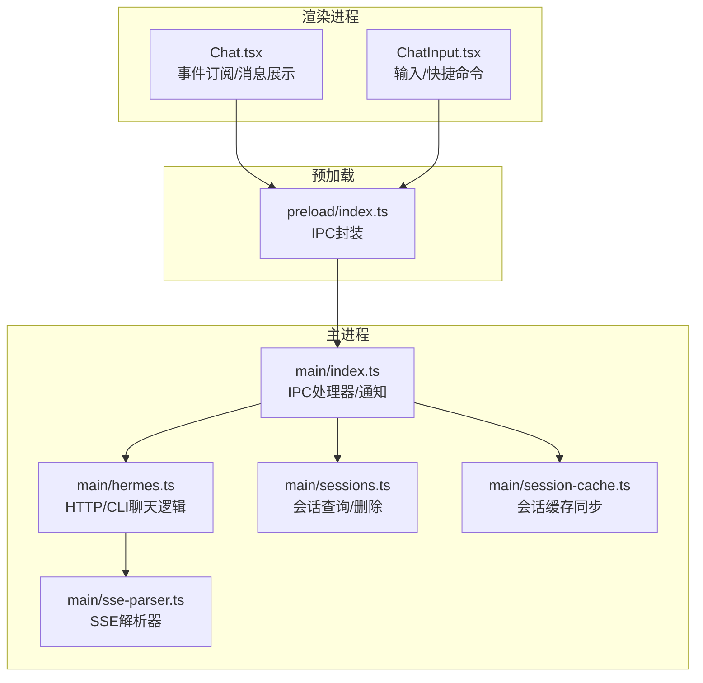
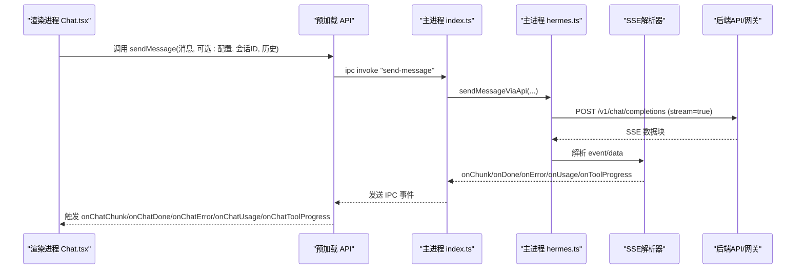
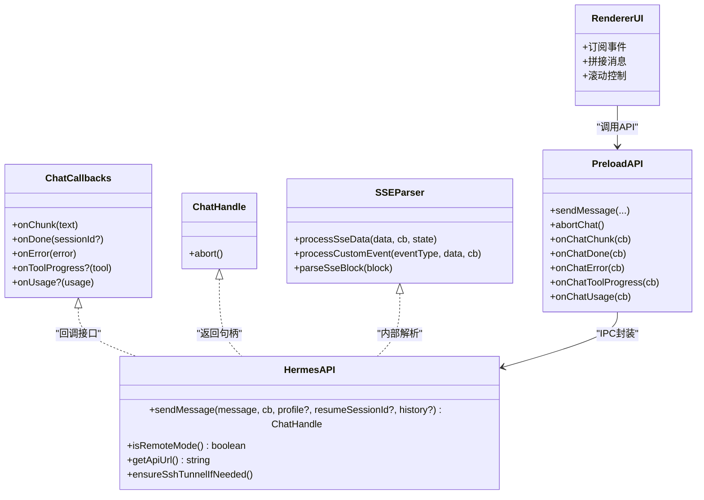

# 聊天引擎API

<cite>
**本文引用的文件列表**
- [src/main/hermes.ts](file://src/main/hermes.ts)
- [src/main/sse-parser.ts](file://src/main/sse-parser.ts)
- [src/main/index.ts](file://src/main/index.ts)
- [src/preload/index.ts](file://src/preload/index.ts)
- [src/renderer/src/screens/Chat/Chat.tsx](file://src/renderer/src/screens/Chat/Chat.tsx)
- [src/renderer/src/screens/Chat/ChatInput.tsx](file://src/renderer/src/screens/Chat/ChatInput.tsx)
- [src/main/sessions.ts](file://src/main/sessions.ts)
- [src/main/session-cache.ts](file://src/main/session-cache.ts)
- [src/shared/i18n/locales/zh-CN/chat.ts](file://src/shared/i18n/locales/zh-CN/chat.ts)
</cite>

## 目录
1. [简介](#简介)
2. [项目结构](#项目结构)
3. [核心组件](#核心组件)
4. [架构总览](#架构总览)
5. [详细组件分析](#详细组件分析)
6. [依赖关系分析](#依赖关系分析)
7. [性能考量](#性能考量)
8. [故障排查指南](#故障排查指南)
9. [结论](#结论)
10. [附录：使用示例与最佳实践](#附录使用示例与最佳实践)

## 简介
本文件系统性梳理桌面应用中的聊天引擎API，覆盖 sendMessage、abortChat、onChatChunk、onChatDone、onChatError 等接口的参数、消息格式、事件监听机制与错误处理；解释流式响应（SSE）实现原理、消息队列管理与聊天中断处理；并给出聊天历史管理、消息过滤与响应优化的实现细节与最佳实践。

## 项目结构
聊天引擎由三部分协作构成：
- 主进程（Main）：负责HTTP API调用、SSE解析、CLI回退、网关生命周期与会话缓存同步。
- 预加载（Preload）：封装IPC通道，暴露统一的API给渲染进程。
- 渲染进程（Renderer）：UI层，负责事件订阅、消息展示、输入与中断控制。

图表来源
- [src/renderer/src/screens/Chat/Chat.tsx:244-308](file://src/renderer/src/screens/Chat/Chat.tsx#L244-L308)
- [src/renderer/src/screens/Chat/ChatInput.tsx:1-330](file://src/renderer/src/screens/Chat/ChatInput.tsx#L1-L330)
- [src/preload/index.ts:159-228](file://src/preload/index.ts#L159-L228)
- [src/main/index.ts:579-647](file://src/main/index.ts#L579-L647)
- [src/main/hermes.ts:168-434](file://src/main/hermes.ts#L168-L434)
- [src/main/sse-parser.ts:1-130](file://src/main/sse-parser.ts#L1-L130)
- [src/main/sessions.ts:1-212](file://src/main/sessions.ts#L1-L212)
- [src/main/session-cache.ts:82-162](file://src/main/session-cache.ts#L82-L162)

章节来源
- [src/main/hermes.ts:1-887](file://src/main/hermes.ts#L1-L887)
- [src/preload/index.ts:150-250](file://src/preload/index.ts#L150-L250)
- [src/main/index.ts:579-647](file://src/main/index.ts#L579-L647)
- [src/renderer/src/screens/Chat/Chat.tsx:1-895](file://src/renderer/src/screens/Chat/Chat.tsx#L1-L895)
- [src/renderer/src/screens/Chat/ChatInput.tsx:1-330](file://src/renderer/src/screens/Chat/ChatInput.tsx#L1-L330)
- [src/main/sse-parser.ts:1-130](file://src/main/sse-parser.ts#L1-L130)
- [src/main/sessions.ts:1-212](file://src/main/sessions.ts#L1-L212)
- [src/main/session-cache.ts:82-162](file://src/main/session-cache.ts#L82-L162)

## 核心组件
- 主进程聊天核心：HTTP API流式请求、SSE解析、CLI回退、健康检查与网关管理。
- 预加载API：统一的IPC接口，暴露 sendMessage、abortChat、onChatChunk、onChatDone、onChatError、onChatToolProgress、onChatUsage 等。
- 渲染进程UI：订阅事件、拼接消息、滚动控制、快速模式、令牌用量统计与会话标题生成。

章节来源
- [src/main/hermes.ts:153-166](file://src/main/hermes.ts#L153-L166)
- [src/preload/index.ts:159-228](file://src/preload/index.ts#L159-L228)
- [src/renderer/src/screens/Chat/Chat.tsx:244-308](file://src/renderer/src/screens/Chat/Chat.tsx#L244-L308)

## 架构总览
桌面端聊天采用“主进程HTTP API + SSE流式传输”的路径；在本地模式下通过本地网关（默认端口）提供服务，在远程模式下直连远端URL。若HTTP不可用则回退到CLI模式。渲染进程通过预加载API订阅事件，实时更新UI。

图表来源
- [src/main/index.ts:579-647](file://src/main/index.ts#L579-L647)
- [src/main/hermes.ts:168-434](file://src/main/hermes.ts#L168-L434)
- [src/main/sse-parser.ts:58-110](file://src/main/sse-parser.ts#L58-L110)
- [src/preload/index.ts:159-228](file://src/preload/index.ts#L159-L228)
- [src/renderer/src/screens/Chat/Chat.tsx:244-308](file://src/renderer/src/screens/Chat/Chat.tsx#L244-L308)

## 详细组件分析

### sendMessage 接口
- 功能：发起一次聊天请求，支持可选的历史消息、会话恢复与模型配置。
- 参数
  - message: string — 用户消息文本
  - profile?: string — 使用的配置档名（可选）
  - resumeSessionId?: string — 会话ID（可选），用于续聊
  - history?: Array<{ role: string; content: string }> — 历史消息数组（可选）
- 返回值：Promise<ChatHandle> — 可调用 abort() 中断请求
- 行为要点
  - 自动构建标准OpenAI风格的消息数组（将“agent”角色映射为“assistant”）
  - 启用流式响应（stream=true），并携带认证头
  - 支持远程模式（SSH隧道或远端URL）与本地模式（HTTP API）
  - 若HTTP不可用则回退到CLI模式
- 错误处理
  - API返回非200时解析错误体并回调 onError
  - 流结束但无内容时触发探测请求以揭示真实错误
  - 超时与网络异常统一转为错误回调
- 事件回调
  - onChunk：增量文本片段
  - onDone：完成（可选返回会话ID）
  - onError：错误信息
  - onToolProgress：工具进度（SSE自定义事件或注入内容）
  - onUsage：令牌用量（prompt/completion/total，以及可选成本与限流信息）

章节来源
- [src/main/hermes.ts:168-434](file://src/main/hermes.ts#L168-L434)
- [src/main/hermes.ts:654-679](file://src/main/hermes.ts#L654-L679)

### abortChat 接口
- 功能：中断当前进行中的聊天请求
- 实现机制
  - 主进程维护一个可调用的 abort 函数（来自 AbortController）
  - 预加载API提供 ipc invoke "abort-chat"
  - 渲染侧通过 window.hermesAPI.abortChat() 调用
- 注意事项
  - 仅在有活跃请求时有效
  - 中断后会触发 onError 回调（由主进程转发）

章节来源
- [src/main/index.ts:642-647](file://src/main/index.ts#L642-L647)
- [src/preload/index.ts:173-173](file://src/preload/index.ts#L173-L173)
- [src/renderer/src/screens/Chat/Chat.tsx:580-584](file://src/renderer/src/screens/Chat/Chat.tsx#L580-L584)

### onChatChunk 回调
- 功能：接收流式响应的增量文本片段
- 行为
  - 将最新片段追加到当前“agent”消息末尾
  - 若无agent消息且片段可见，则新建一条agent消息
  - 自动滚动到底部（除非用户手动向上滚动）
- 适用场景：实时渲染、Markdown渲染、工具进度提示

章节来源
- [src/renderer/src/screens/Chat/Chat.tsx:244-308](file://src/renderer/src/screens/Chat/Chat.tsx#L244-L308)

### onChatDone 回调
- 功能：聊天完成时触发
- 行为
  - 若返回会话ID，保存到组件状态，并异步同步会话缓存
  - 清理工具进度与加载状态
- 适用场景：会话归档、统计与后续续聊

章节来源
- [src/renderer/src/screens/Chat/Chat.tsx:265-273](file://src/renderer/src/screens/Chat/Chat.tsx#L265-L273)
- [src/main/index.ts:593-596](file://src/main/index.ts#L593-L596)

### onChatError 回调
- 功能：聊天过程中出现错误时触发
- 行为
  - 追加一条“错误”消息到UI
  - 清理工具进度与加载状态
- 适用场景：错误提示、日志记录

章节来源
- [src/renderer/src/screens/Chat/Chat.tsx:275-286](file://src/renderer/src/screens/Chat/Chat.tsx#L275-L286)
- [src/main/index.ts:613-617](file://src/main/index.ts#L613-L617)

### onChatToolProgress 与 onChatUsage
- onChatToolProgress：工具进度事件（SSE自定义事件 hermes.tool.progress 或注入内容）
- onChatUsage：累计令牌用量（prompt/completion/total，以及可选成本与限流信息）
- 渲染侧行为
  - 工具进度：显示在消息区域上方或状态栏
  - 用量：累加并展示在头部，支持格式化显示

章节来源
- [src/renderer/src/screens/Chat/Chat.tsx:288-299](file://src/renderer/src/screens/Chat/Chat.tsx#L288-L299)
- [src/main/sse-parser.ts:29-46](file://src/main/sse-parser.ts#L29-L46)
- [src/main/sse-parser.ts:82-92](file://src/main/sse-parser.ts#L82-L92)

### 流式响应（SSE）实现原理
- 协议与解析
  - 主进程通过HTTP客户端向 /v1/chat/completions 发起POST请求，开启流式响应
  - 逐块解析SSE：支持 event/data 行，识别 [DONE] 结束标记
  - 提取 choices[0].delta.content 作为增量文本
  - 提取 usage 作为最终用量信息
  - 处理自定义事件 hermes.tool.progress
- 容错与探测
  - 当流结束但无内容时，发起一次性非流式请求以揭示真实错误
  - 对于异常JSON或空数据块，安全跳过
- 统一回调
  - onChunk/onDone/onError/onUsage/onToolProgress 由主进程在收到SSE后触发

章节来源
- [src/main/hermes.ts:268-434](file://src/main/hermes.ts#L268-L434)
- [src/main/sse-parser.ts:58-110](file://src/main/sse-parser.ts#L58-L110)

### 消息队列管理与消息过滤
- 消息队列
  - 渲染侧维护 messages 数组，按角色与时间顺序排列
  - 新增消息时自动去空白，避免空消息污染
- 过滤策略
  - 渲染侧在渲染前过滤掉空内容消息
  - CLI模式下会去除ANSI噪声与无关输出
- 会话ID与续聊
  - onDone 回调中返回的 sessionId 用于后续 sendMessage 的 resumeSessionId 参数

章节来源
- [src/renderer/src/screens/Chat/Chat.tsx:624-627](file://src/renderer/src/screens/Chat/Chat.tsx#L624-L627)
- [src/main/hermes.ts:346-347](file://src/main/hermes.ts#L346-L347)
- [src/main/hermes.ts:658-658](file://src/main/hermes.ts#L658-L658)

### 聊天中断处理
- 中断点
  - 用户点击停止按钮或调用 abortChat
  - 主进程通过 AbortController 触发请求中断
- 回调链路
  - 中断后触发 onError（由主进程转发）
  - 渲染侧清理加载状态并允许重新输入

章节来源
- [src/renderer/src/screens/Chat/Chat.tsx:580-584](file://src/renderer/src/screens/Chat/Chat.tsx#L580-L584)
- [src/main/index.ts:642-647](file://src/main/index.ts#L642-L647)

### 聊天历史管理与会话缓存
- 会话查询
  - 列表：按开始时间倒序，支持分页
  - 搜索：基于FTS5全文检索，返回会话ID、标题、摘要
  - 获取消息：按时间戳排序返回用户与助手消息
- 会话缓存
  - 本地缓存文件存储最近会话，首次启动全量同步，之后增量同步
  - 标题生成：从第一条用户消息提取，长度截断并去URL
- 同步策略
  - 仅拉取上次同步时间后的新增/更新会话，避免O(N^2)复杂度

章节来源
- [src/main/sessions.ts:46-89](file://src/main/sessions.ts#L46-L89)
- [src/main/sessions.ts:91-156](file://src/main/sessions.ts#L91-L156)
- [src/main/sessions.ts:158-186](file://src/main/sessions.ts#L158-L186)
- [src/main/session-cache.ts:82-162](file://src/main/session-cache.ts#L82-L162)

## 依赖关系分析

图表来源
- [src/main/hermes.ts:153-166](file://src/main/hermes.ts#L153-L166)
- [src/main/hermes.ts:94-96](file://src/main/hermes.ts#L94-L96)
- [src/main/sse-parser.ts:58-110](file://src/main/sse-parser.ts#L58-L110)
- [src/preload/index.ts:159-228](file://src/preload/index.ts#L159-L228)
- [src/renderer/src/screens/Chat/Chat.tsx:244-308](file://src/renderer/src/screens/Chat/Chat.tsx#L244-L308)

章节来源
- [src/main/hermes.ts:153-166](file://src/main/hermes.ts#L153-L166)
- [src/main/sse-parser.ts:1-130](file://src/main/sse-parser.ts#L1-L130)
- [src/preload/index.ts:159-228](file://src/preload/index.ts#L159-L228)
- [src/renderer/src/screens/Chat/Chat.tsx:244-308](file://src/renderer/src/screens/Chat/Chat.tsx#L244-L308)

## 性能考量
- 流式渲染：SSE增量推送，UI即时更新，减少等待感
- 会话缓存：增量同步，避免全量扫描，启动更快
- 快速模式：通过配置项切换服务等级，降低延迟
- 输入防抖：渲染侧自动高度调整与滚动控制，避免频繁重排
- CLI回退：HTTP不可用时自动降级，保证可用性

章节来源
- [src/main/session-cache.ts:82-162](file://src/main/session-cache.ts#L82-L162)
- [src/renderer/src/screens/Chat/Chat.tsx:202-207](file://src/renderer/src/screens/Chat/Chat.tsx#L202-L207)
- [src/main/hermes.ts:668-678](file://src/main/hermes.ts#L668-L678)

## 故障排查指南
- 无法连接后端
  - 检查 isRemoteMode 与 getApiUrl 返回值
  - 远程模式需确认SSH隧道或远端URL可用
- 流式响应为空
  - 观察是否触发探测请求（probeRealError）以揭示真实错误
  - 查看 onChatError 回调中的错误信息
- 中断无效
  - 确认当前存在活跃请求（currentChatAbort 存在）
  - 再次调用 abortChat 或检查前端状态
- 会话列表不更新
  - 确认已调用 syncSessionCache 并等待后台同步完成
  - 检查本地缓存文件是否存在与可读

章节来源
- [src/main/hermes.ts:218-266](file://src/main/hermes.ts#L218-L266)
- [src/main/index.ts:642-647](file://src/main/index.ts#L642-L647)
- [src/main/session-cache.ts:82-162](file://src/main/session-cache.ts#L82-L162)

## 结论
该聊天引擎API以SSE流式传输为核心，结合主进程HTTP调用与CLI回退，提供稳定可靠的聊天体验。通过事件驱动的回调机制，渲染层可实时响应增量内容、工具进度与用量统计。配合会话缓存与历史管理，实现高效的历史检索与续聊能力。建议在生产环境中充分利用快速模式、会话缓存与错误探测机制，以获得更佳的用户体验与稳定性。

## 附录：使用示例与最佳实践

### 使用示例（伪代码）
- 发送消息并监听事件
  - 渲染侧订阅 onChatChunk/onChatDone/onChatError/onChatToolProgress/onChatUsage
  - 调用 window.hermesAPI.sendMessage(消息, 配置档, 会话ID, 历史)
- 中断聊天
  - 调用 window.hermesAPI.abortChat()
- 续聊
  - 将上次 onChatDone 返回的 sessionId 传入 resumeSessionId
- 快速模式
  - 通过 setConfig(agent.service_tier, fast|normal) 切换

章节来源
- [src/renderer/src/screens/Chat/Chat.tsx:341-390](file://src/renderer/src/screens/Chat/Chat.tsx#L341-L390)
- [src/renderer/src/screens/Chat/Chat.tsx:580-584](file://src/renderer/src/screens/Chat/Chat.tsx#L580-L584)
- [src/renderer/src/screens/Chat/Chat.tsx:666-690](file://src/renderer/src/screens/Chat/Chat.tsx#L666-L690)

### 最佳实践
- UI层
  - 订阅所有必要事件，确保错误与完成状态一致清理
  - 对增量内容进行最小化重绘，避免频繁DOM操作
  - 提供“快速提问”入口，不影响当前上下文
- 主进程
  - 保持SSE解析健壮性，忽略异常块
  - 在流结束后进行探测请求，提升错误可见性
  - 控制AbortController生命周期，避免重复回调
- 会话与历史
  - 使用会话缓存进行增量同步，避免全量扫描
  - 标题生成遵循截断与去URL规则，提升可读性
  - 搜索使用FTS5，注意查询词清洗与引号包裹

章节来源
- [src/main/sse-parser.ts:58-110](file://src/main/sse-parser.ts#L58-L110)
- [src/main/hermes.ts:218-266](file://src/main/hermes.ts#L218-L266)
- [src/main/session-cache.ts:39-58](file://src/main/session-cache.ts#L39-L58)
- [src/main/sessions.ts:91-156](file://src/main/sessions.ts#L91-L156)