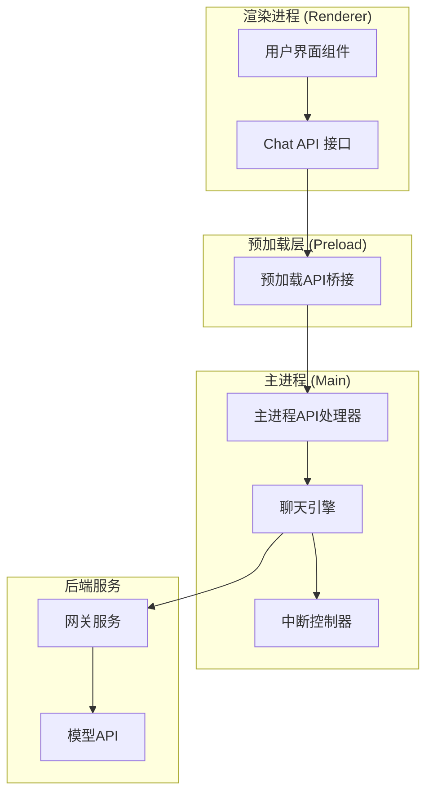
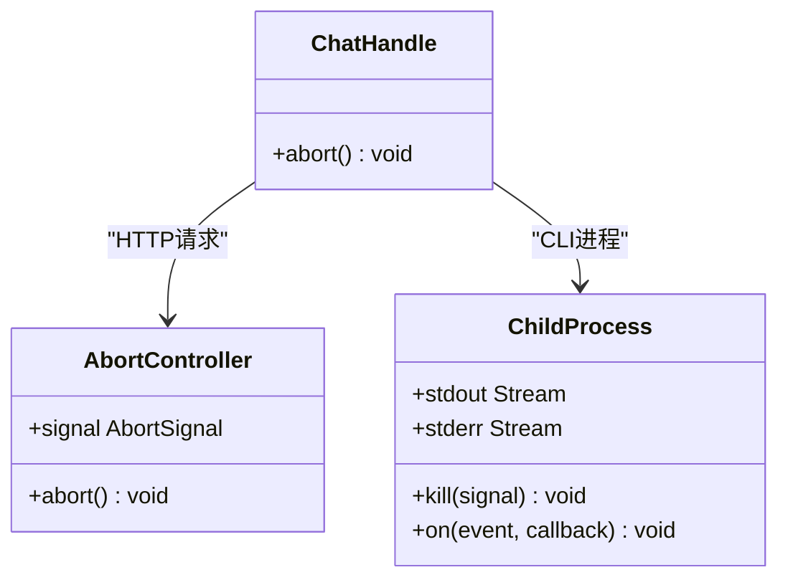
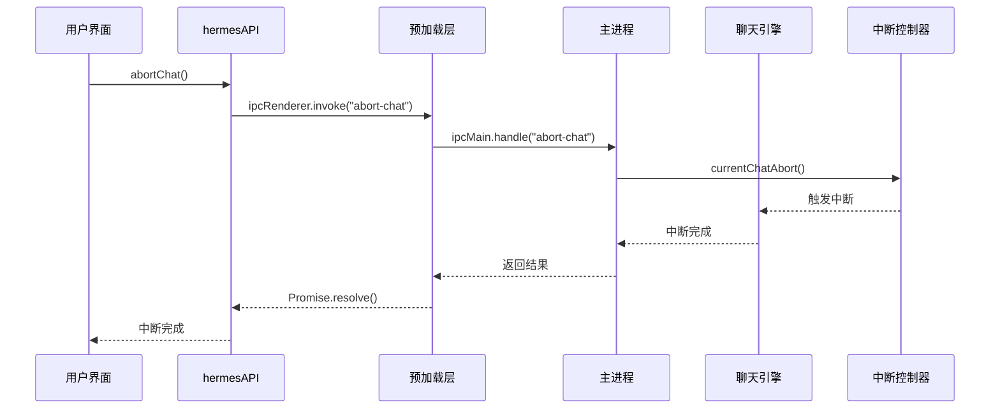
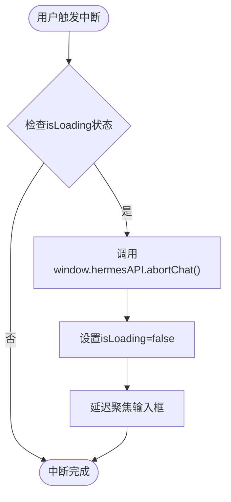
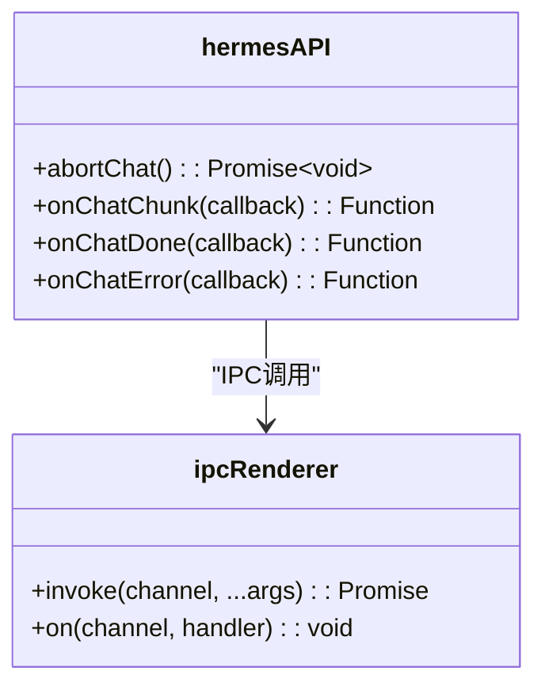
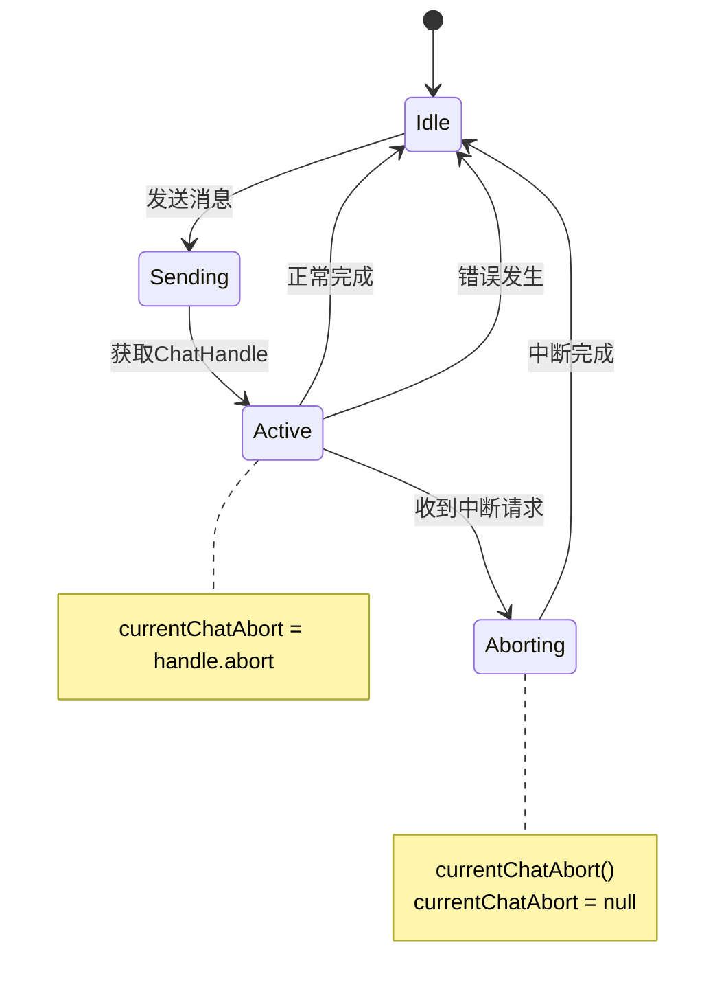
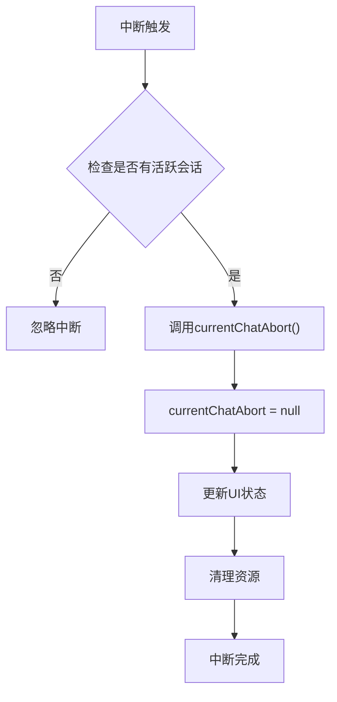
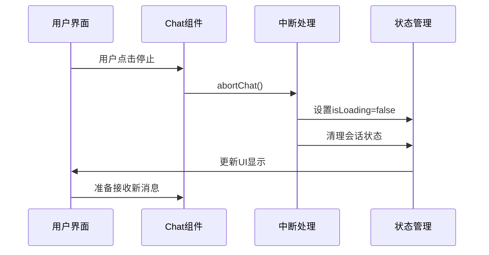
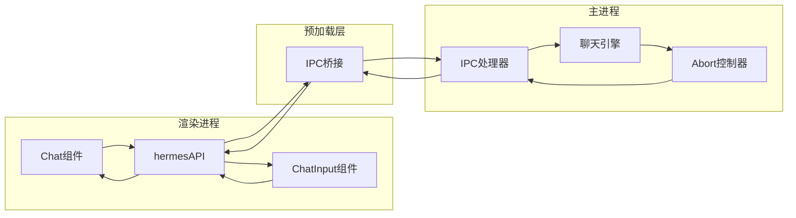
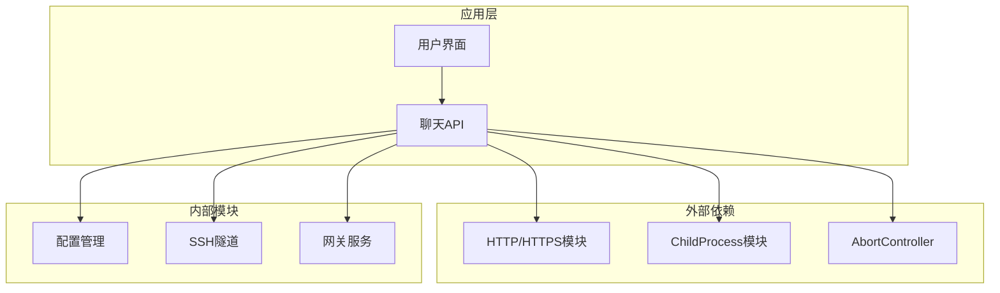

# 聊天控制API

<cite>
**本文档引用的文件**
- [hermes.ts](file://src/main/hermes.ts)
- [index.ts](file://src/main/index.ts)
- [index.ts](file://src/preload/index.ts)
- [Chat.tsx](file://src/renderer/src/screens/Chat/Chat.tsx)
- [ChatInput.tsx](file://src/renderer/src/screens/Chat/ChatInput.tsx)
- [chat.ts](file://src/shared/i18n/locales/zh-CN/chat.ts)
</cite>

## 目录
1. [简介](#简介)
2. [项目结构](#项目结构)
3. [核心组件](#核心组件)
4. [架构概览](#架构概览)
5. [详细组件分析](#详细组件分析)
6. [依赖关系分析](#依赖关系分析)
7. [性能考虑](#性能考虑)
8. [故障排除指南](#故障排除指南)
9. [结论](#结论)

## 简介

聊天控制API是Hermes Desktop应用中的核心通信模块，负责管理与后端聊天服务的交互。该API提供了完整的聊天生命周期管理，包括消息发送、流式响应处理、中断控制和状态同步等功能。本文档专注于`abortChat`接口的实现和使用方法，详细说明聊天中断的触发条件、中断确认机制和状态恢复流程。

## 项目结构

Hermes Desktop采用Electron架构，将聊天控制API分为三个主要层次：

**图表来源**
- [Chat.tsx:1-895](file://src/renderer/src/screens/Chat/Chat.tsx#L1-L895)
- [index.ts:1-701](file://src/preload/index.ts#L1-L701)
- [index.ts:544-647](file://src/main/index.ts#L544-L647)

**章节来源**
- [Chat.tsx:1-895](file://src/renderer/src/screens/Chat/Chat.tsx#L1-L895)
- [index.ts:1-701](file://src/preload/index.ts#L1-L701)
- [index.ts:180-190](file://src/main/index.ts#L180-L190)

## 核心组件

### ChatHandle 接口

`ChatHandle`是聊天控制的核心接口，提供了统一的中断控制能力：

**图表来源**
- [hermes.ts:94-96](file://src/main/hermes.ts#L94-L96)
- [hermes.ts:176-176](file://src/main/hermes.ts#L176-L176)
- [hermes.ts:638-645](file://src/main/hermes.ts#L638-L645)

### 中断机制类型

系统支持两种中断机制：

1. **HTTP请求中断**：通过AbortController的signal中断正在进行的HTTP请求
2. **CLI进程中断**：通过发送SIGTERM信号中断子进程，必要时使用SIGKILL强制终止

**章节来源**
- [hermes.ts:94-96](file://src/main/hermes.ts#L94-L96)
- [hermes.ts:430-434](file://src/main/hermes.ts#L430-L434)
- [hermes.ts:638-645](file://src/main/hermes.ts#L638-L645)

## 架构概览

聊天控制API的完整架构如下：

**图表来源**
- [Chat.tsx:580-584](file://src/renderer/src/screens/Chat/Chat.tsx#L580-L584)
- [index.ts:173-173](file://src/preload/index.ts#L173-L173)
- [index.ts:642-647](file://src/main/index.ts#L642-L647)

## 详细组件分析

### abortChat 接口实现

#### 渲染进程端实现

在渲染进程中，`abortChat`接口通过`window.hermesAPI.abortChat()`调用：

**图表来源**
- [Chat.tsx:580-584](file://src/renderer/src/screens/Chat/Chat.tsx#L580-L584)

#### 预加载层实现

预加载层提供IPC桥接，将前端调用转发到主进程：

**图表来源**
- [index.ts:158-173](file://src/preload/index.ts#L158-L173)

#### 主进程实现

主进程维护全局的`currentChatAbort`变量来跟踪当前活跃的聊天会话：

**图表来源**
- [index.ts:182-183](file://src/main/index.ts#L182-L183)
- [index.ts:637-637](file://src/main/index.ts#L637-L637)
- [index.ts:642-647](file://src/main/index.ts#L642-L647)

**章节来源**
- [Chat.tsx:580-584](file://src/renderer/src/screens/Chat/Chat.tsx#L580-L584)
- [index.ts:173-173](file://src/preload/index.ts#L173-L173)
- [index.ts:182-183](file://src/main/index.ts#L182-L183)
- [index.ts:637-647](file://src/main/index.ts#L637-L647)

### 中断触发条件

系统支持多种中断触发场景：

#### 用户主动中断
- 点击停止按钮
- 按下ESC键
- 执行/Clear命令

#### 系统自动中断
- 新消息发送前的自动中断
- 网络连接异常时的自动中断
- 超时情况下的自动中断

#### 中断确认机制

**图表来源**
- [index.ts:642-647](file://src/main/index.ts#L642-L647)
- [index.ts:593-595](file://src/main/index.ts#L593-L595)
- [index.ts:613-615](file://src/main/index.ts#L613-L615)

**章节来源**
- [Chat.tsx:586-596](file://src/renderer/src/screens/Chat/Chat.tsx#L586-L596)
- [index.ts:642-647](file://src/main/index.ts#L642-L647)

### 状态恢复流程

中断后的状态恢复包括多个步骤：

1. **UI状态重置**：清除加载状态，恢复输入框焦点
2. **会话状态清理**：重置会话ID和使用统计
3. **资源释放**：清理事件监听器和定时器
4. **重新初始化**：为新的聊天会话做好准备

**图表来源**
- [Chat.tsx:580-584](file://src/renderer/src/screens/Chat/Chat.tsx#L580-L584)
- [Chat.tsx:586-596](file://src/renderer/src/screens/Chat/Chat.tsx#L586-L596)

**章节来源**
- [Chat.tsx:580-596](file://src/renderer/src/screens/Chat/Chat.tsx#L580-L596)

### 进程间通信机制

系统采用Electron的IPC机制实现进程间通信：

**图表来源**
- [index.ts:158-173](file://src/preload/index.ts#L158-L173)
- [index.ts:544-647](file://src/main/index.ts#L544-L647)

**章节来源**
- [index.ts:158-173](file://src/preload/index.ts#L158-L173)
- [index.ts:544-647](file://src/main/index.ts#L544-L647)

### 资源清理策略

系统实现了多层次的资源清理策略：

#### HTTP请求清理
- 使用AbortController中断网络请求
- 清理事件监听器
- 释放内存资源

#### CLI进程清理
- 发送SIGTERM信号优雅终止
- 3秒后发送SIGKILL强制终止
- 清理进程句柄

#### UI资源清理
- 移除事件监听器
- 清空状态变量
- 释放DOM引用

**章节来源**
- [hermes.ts:430-434](file://src/main/hermes.ts#L430-L434)
- [hermes.ts:638-645](file://src/main/hermes.ts#L638-L645)

## 依赖关系分析

**图表来源**
- [hermes.ts:1-20](file://src/main/hermes.ts#L1-L20)
- [hermes.ts:94-96](file://src/main/hermes.ts#L94-L96)
- [hermes.ts:430-434](file://src/main/hermes.ts#L430-L434)

**章节来源**
- [hermes.ts:1-20](file://src/main/hermes.ts#L1-L20)
- [hermes.ts:94-96](file://src/main/hermes.ts#L94-L96)

## 性能考虑

### 中断响应时间
- HTTP请求中断：几乎实时（毫秒级）
- CLI进程中断：通常在几秒内完成
- 资源清理：微秒级到毫秒级

### 内存管理
- 及时清理事件监听器，防止内存泄漏
- 合理使用AbortController，避免悬挂请求
- 及时释放DOM引用和状态变量

### 并发控制
- 全局currentChatAbort变量确保单一会话控制
- 防止同时存在多个活跃的聊天会话
- 自动中断机制避免资源竞争

## 故障排除指南

### 常见问题及解决方案

#### 中断无效
**症状**：调用abortChat()后聊天仍在继续
**原因**：
- 没有活跃的聊天会话
- 中断请求过早或过晚
- 网络请求已完成

**解决方案**：
- 确保在isLoading为true时调用
- 检查currentChatAbort是否已设置
- 验证网络连接状态

#### 中断后UI状态不正确
**症状**：输入框无法输入，按钮状态异常
**原因**：
- 中断处理完成后状态未正确更新
- 事件监听器未正确移除

**解决方案**：
- 确保在中断回调中设置isLoading=false
- 检查所有事件监听器的清理
- 验证setTimeout回调的执行

#### 资源泄漏
**症状**：长时间使用后内存占用持续增长
**原因**：
- 事件监听器未正确移除
- DOM引用未清理
- AbortController未正确释放

**解决方案**：
- 在组件卸载时清理所有监听器
- 使用useEffect返回值清理函数
- 确保及时释放DOM引用

**章节来源**
- [Chat.tsx:580-596](file://src/renderer/src/screens/Chat/Chat.tsx#L580-L596)
- [index.ts:642-647](file://src/main/index.ts#L642-L647)

## 结论

聊天控制API通过AbortController和进程间通信机制，提供了可靠的聊天中断功能。其设计特点包括：

1. **多层中断支持**：同时支持HTTP请求和CLI进程的中断
2. **状态一致性**：通过全局变量和事件机制保证状态同步
3. **资源管理**：完善的资源清理策略防止内存泄漏
4. **用户体验**：即时的中断响应和流畅的状态切换

最佳实践建议：
- 在用户界面中始终检查isLoading状态再调用abortChat()
- 及时清理事件监听器和状态变量
- 提供清晰的中断反馈给用户
- 实现适当的错误处理和重试机制

该API为Hermes Desktop提供了稳定可靠的聊天控制能力，支持复杂的中断场景和状态管理需求。