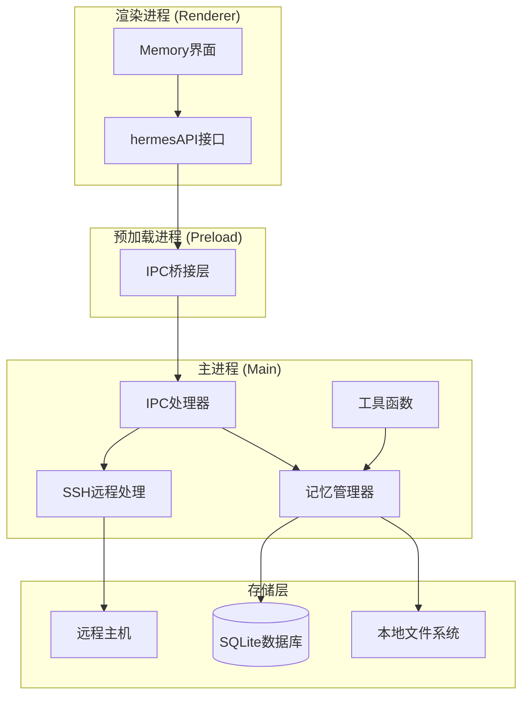
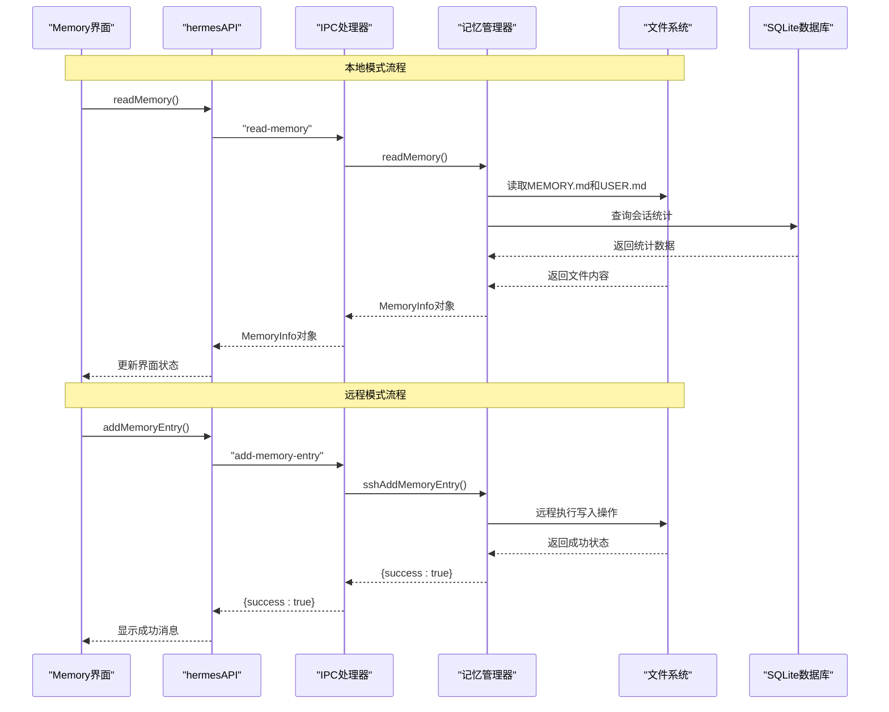
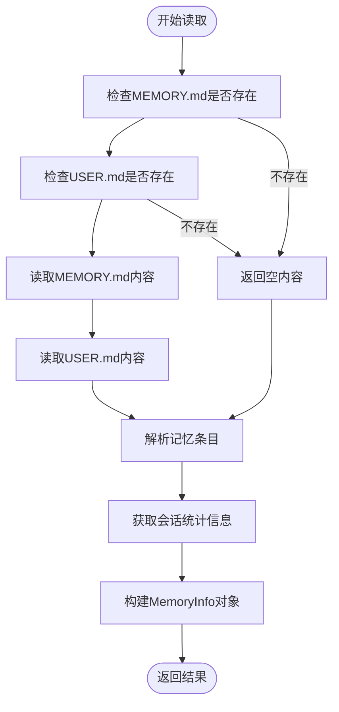
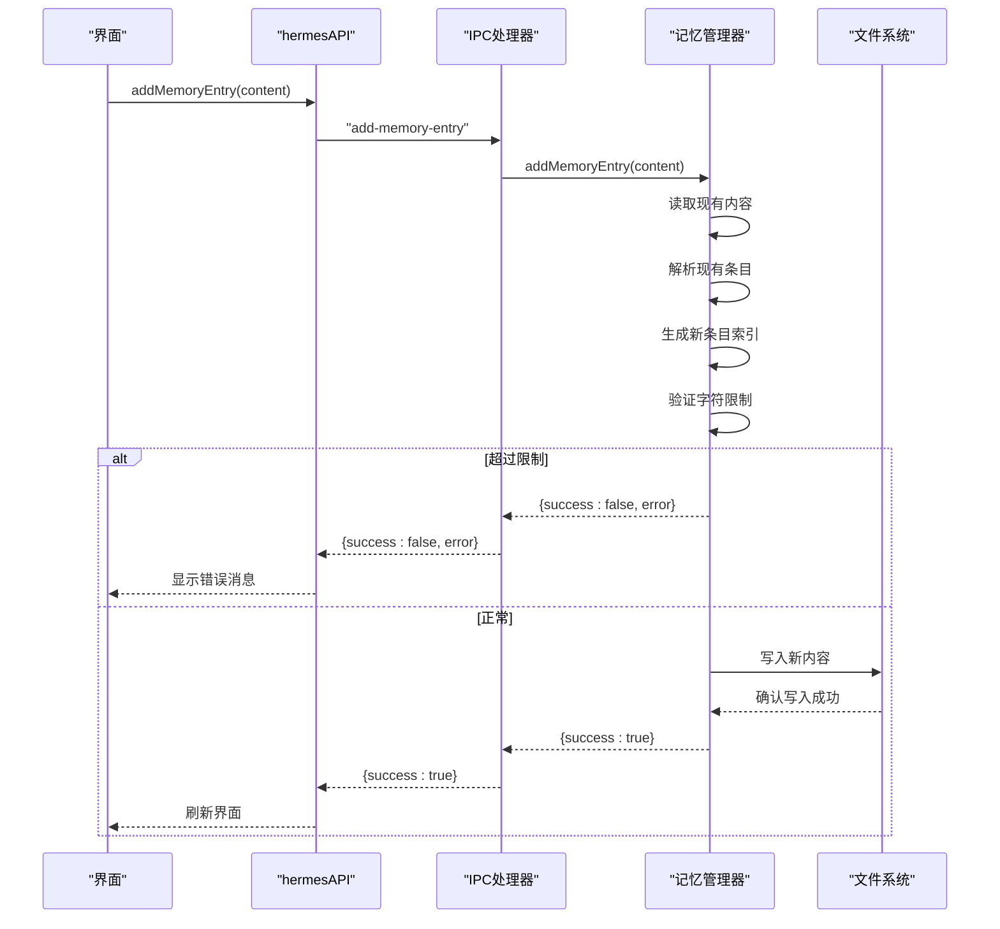
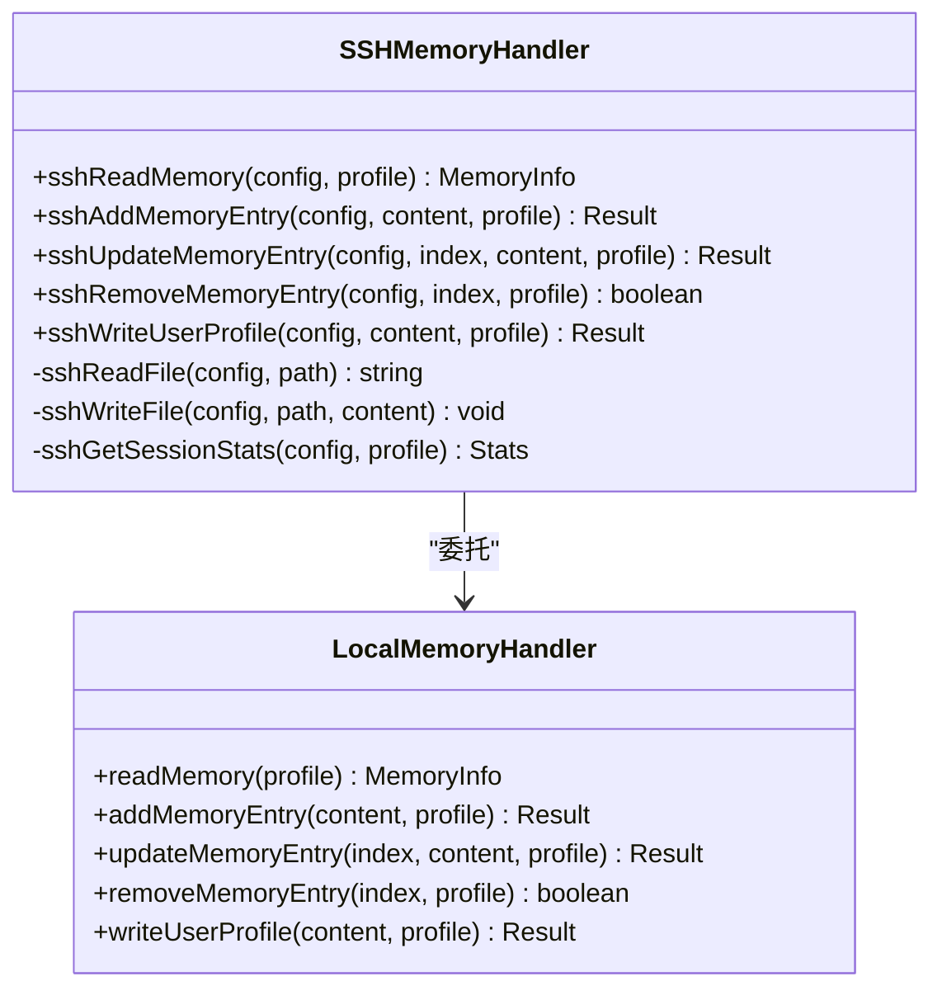
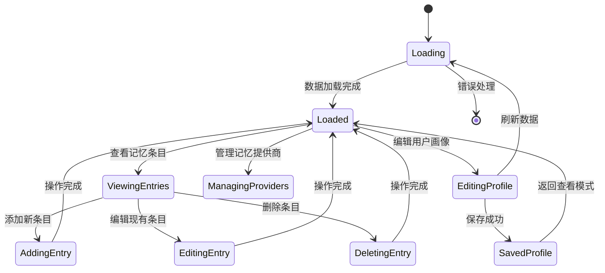

# 记忆管理API

<cite>
**本文档引用的文件**
- [memory.ts](file://src/main/memory.ts)
- [index.ts](file://src/main/index.ts)
- [ssh-remote.ts](file://src/main/ssh-remote.ts)
- [Memory.tsx](file://src/renderer/src/screens/Memory/Memory.tsx)
- [index.ts](file://src/preload/index.ts)
- [utils.ts](file://src/main/utils.ts)
- [profiles.ts](file://src/main/profiles.ts)
- [Settings.tsx](file://src/renderer/src/screens/Settings/Settings.tsx)
</cite>

## 目录
1. [简介](#简介)
2. [项目结构](#项目结构)
3. [核心组件](#核心组件)
4. [架构概览](#架构概览)
5. [详细组件分析](#详细组件分析)
6. [依赖关系分析](#依赖关系分析)
7. [性能考虑](#性能考虑)
8. [故障排除指南](#故障排除指南)
9. [结论](#结论)

## 简介

记忆管理API是Hermes桌面应用中的核心功能模块，负责管理AI代理的记忆数据和用户画像信息。该系统提供了完整的记忆生命周期管理，包括读取、写入、更新、删除操作，以及与外部记忆提供商的集成能力。

系统采用本地文件存储机制，将记忆数据以纯文本文件的形式保存在用户的配置目录中，同时支持通过SSH连接到远程主机进行分布式记忆管理。每个记忆条目都有严格的字符限制和版本控制机制，确保数据的完整性和安全性。

## 项目结构

记忆管理功能分布在三个主要层次中：



**图表来源**
- [Memory.tsx:86-130](file://src/renderer/src/screens/Memory/Memory.tsx#L86-L130)
- [index.ts:303-330](file://src/preload/index.ts#L303-L330)
- [index.ts:725-758](file://src/main/index.ts#L725-L758)

**章节来源**
- [memory.ts:1-207](file://src/main/memory.ts#L1-L207)
- [Memory.tsx:1-612](file://src/renderer/src/screens/Memory/Memory.tsx#L1-L612)

## 核心组件

### 数据模型

记忆管理系统定义了两个核心数据结构：

**MemoryInfo 结构**：
- `memory`: 代理记忆数据
  - `content`: 记忆内容字符串
  - `exists`: 文件是否存在标志
  - `lastModified`: 最后修改时间戳
  - `entries`: 记忆条目数组
  - `charCount`: 当前字符数
  - `charLimit`: 字符数限制
- `user`: 用户画像数据
  - `content`: 用户信息内容
  - `exists`: 文件是否存在标志
  - `lastModified`: 最后修改时间戳
  - `charCount`: 当前字符数
  - `charLimit`: 字符数限制
- `stats`: 统计信息
  - `totalSessions`: 总会话数
  - `totalMessages`: 总消息数

**MemoryEntry 结构**：
- `index`: 条目索引号
- `content`: 条目内容

### 存储结构

系统使用以下文件结构存储记忆数据：

```
~/.hermes/
├── memories/
│   ├── MEMORY.md          # 代理记忆文件
│   └── USER.md           # 用户画像文件
└── profiles/
    └── [profile_name]/
        └── memories/
            ├── MEMORY.md
            └── USER.md
```

**章节来源**
- [memory.ts:10-32](file://src/main/memory.ts#L10-L32)
- [memory.ts:34-40](file://src/main/memory.ts#L34-L40)

## 架构概览

记忆管理API采用分层架构设计，实现了本地和远程两种运行模式：



**图表来源**
- [Memory.tsx:112-125](file://src/renderer/src/screens/Memory/Memory.tsx#L112-L125)
- [index.ts:725-758](file://src/main/index.ts#L725-L758)
- [ssh-remote.ts:321-334](file://src/main/ssh-remote.ts#L321-L334)

## 详细组件分析

### 读取操作 (readMemory)

readMemory函数负责从文件系统中读取所有记忆数据，并返回完整的MemoryInfo对象。



**图表来源**
- [memory.ts:110-128](file://src/main/memory.ts#L110-L128)

**章节来源**
- [memory.ts:110-128](file://src/main/memory.ts#L110-L128)
- [Memory.tsx:112-125](file://src/renderer/src/screens/Memory/Memory.tsx#L112-L125)

### 写入操作

#### 添加记忆条目 (addMemoryEntry)

添加新记忆条目的过程包括内容验证、索引生成和文件写入：



**图表来源**
- [memory.ts:132-153](file://src/main/memory.ts#L132-L153)
- [Memory.tsx:132-146](file://src/renderer/src/screens/Memory/Memory.tsx#L132-L146)

#### 更新记忆条目 (updateMemoryEntry)

更新操作需要验证索引的有效性并保持字符限制：

**章节来源**
- [memory.ts:155-180](file://src/main/memory.ts#L155-L180)
- [Memory.tsx:148-163](file://src/renderer/src/screens/Memory/Memory.tsx#L148-L163)

#### 删除记忆条目 (removeMemoryEntry)

删除操作提供边界检查和原子性保证：

**章节来源**
- [memory.ts:182-192](file://src/main/memory.ts#L182-L192)
- [Memory.tsx:165-169](file://src/renderer/src/screens/Memory/Memory.tsx#L165-L169)

#### 写入用户画像 (writeUserProfile)

用户画像写入操作具有独立的字符限制和验证机制：

**章节来源**
- [memory.ts:194-206](file://src/main/memory.ts#L194-L206)
- [Memory.tsx:171-185](file://src/renderer/src/screens/Memory/Memory.tsx#L171-L185)

### SSH远程处理

当系统处于SSH连接模式时，所有记忆操作都会通过远程执行：



**图表来源**
- [ssh-remote.ts:296-365](file://src/main/ssh-remote.ts#L296-L365)
- [memory.ts:110-206](file://src/main/memory.ts#L110-L206)

**章节来源**
- [ssh-remote.ts:296-365](file://src/main/ssh-remote.ts#L296-L365)

### 用户界面集成

Memory界面组件提供了完整的用户交互体验：



**图表来源**
- [Memory.tsx:86-130](file://src/renderer/src/screens/Memory/Memory.tsx#L86-L130)

**章节来源**
- [Memory.tsx:86-612](file://src/renderer/src/screens/Memory/Memory.tsx#L86-L612)

## 依赖关系分析

记忆管理API的依赖关系相对简单且清晰：

```mermaid
graph TD
MemoryAPI[memory.ts] --> Utils[utils.ts]
MemoryAPI --> BetterSqlite[better-sqlite3]
MemoryAPI --> Path[path]
MemoryAPI --> FS[fs]
PreloadAPI[index.ts] --> MemoryAPI
PreloadAPI --> SSHRemote[ssh-remote.ts]
MainIPC[index.ts] --> MemoryAPI
MainIPC --> SSHRemote
RendererUI[Memory.tsx] --> PreloadAPI
SSHRemote --> MemoryAPI : "委托"
SSHRemote --> SSHLib[ssh-exec]
```

**图表来源**
- [memory.ts:1-4](file://src/main/memory.ts#L1-L4)
- [index.ts:725-758](file://src/main/index.ts#L725-L758)
- [index.ts:303-330](file://src/preload/index.ts#L303-L330)

**章节来源**
- [memory.ts:1-4](file://src/main/memory.ts#L1-L4)
- [utils.ts:1-85](file://src/main/utils.ts#L1-L85)

## 性能考虑

### 字符限制优化

系统实现了严格的字符限制来控制内存使用：

- **代理记忆限制**: 2200字符
- **用户画像限制**: 1375字符

这些限制通过统一的验证逻辑确保数据完整性。

### 异步操作处理

所有文件操作都是异步的，避免阻塞主线程：

- 文件读写使用异步API
- SSH操作使用Promise包装
- UI更新采用React状态管理

### 缓存策略

界面层实现了智能缓存机制：

- 数据加载完成后缓存结果
- 只在必要时重新加载
- 支持手动刷新功能

## 故障排除指南

### 常见问题及解决方案

**问题**: 记忆条目无法保存
- **原因**: 超过字符限制或文件权限问题
- **解决**: 检查内容长度，确认文件权限

**问题**: 远程连接失败
- **原因**: SSH认证失败或网络问题
- **解决**: 配置正确的SSH密钥，检查网络连接

**问题**: 记忆数据丢失
- **原因**: 文件被意外删除或损坏
- **解决**: 使用备份功能恢复数据

### 错误处理机制

系统提供了完善的错误处理：

```mermaid
flowchart TD
Operation[操作执行] --> Success{操作成功?}
Success --> |是| SuccessHandler[成功处理]
Success --> |否| ErrorHandler[错误处理]
ErrorHandler --> CheckType{错误类型}
CheckType --> |文件权限| PermissionError[权限错误]
CheckType --> |磁盘空间| SpaceError[空间不足]
CheckType --> |网络问题| NetworkError[网络错误]
CheckType --> |其他| OtherError[其他错误]
PermissionError --> UserAction[用户操作建议]
SpaceError --> CleanupAction[清理操作建议]
NetworkError --> ReconnectAction[重连操作建议]
OtherError --> LogError[记录日志]
SuccessHandler --> UIUpdate[更新界面]
UserAction --> UIUpdate
CleanupAction --> UIUpdate
ReconnectAction --> UIUpdate
LogError --> UIUpdate
```



**章节来源**
- [memory.ts:144-149](file://src/main/memory.ts#L144-L149)
- [Memory.tsx:132-146](file://src/renderer/src/screens/Memory/Memory.tsx#L132-L146)

## 结论

记忆管理API是一个设计精良的数据管理模块，具有以下特点：

1. **模块化设计**: 清晰的职责分离和接口定义
2. **双模式支持**: 同时支持本地和远程操作
3. **数据安全**: 完整的验证和错误处理机制
4. **用户体验**: 直观的界面和及时的状态反馈
5. **扩展性**: 支持外部记忆提供商集成

该系统为Hermes AI代理提供了可靠的记忆管理能力，确保用户能够在不同会话间保持一致的交互体验。通过合理的架构设计和严格的实现规范，系统能够稳定地处理各种复杂的记忆管理场景。