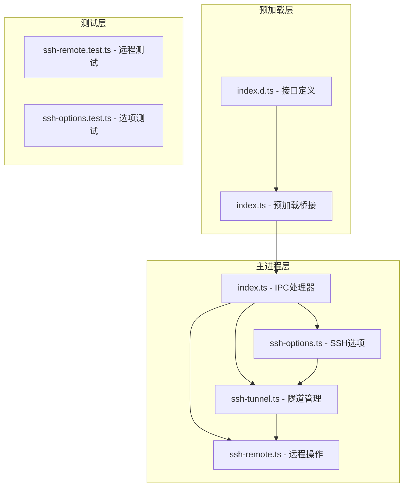
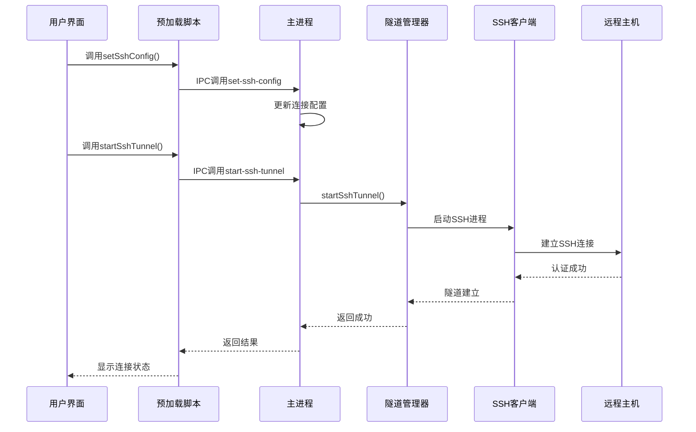
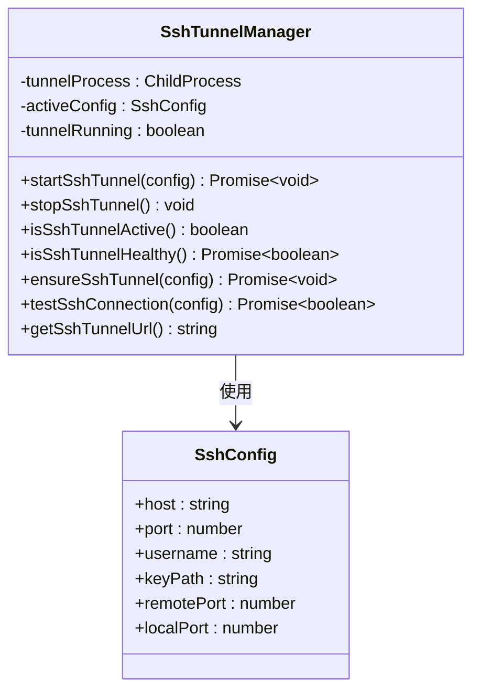
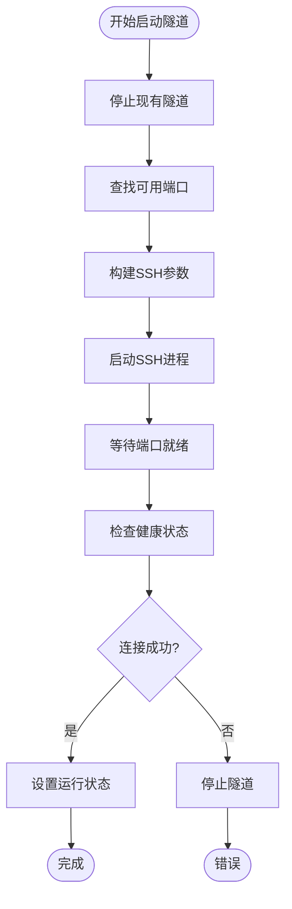
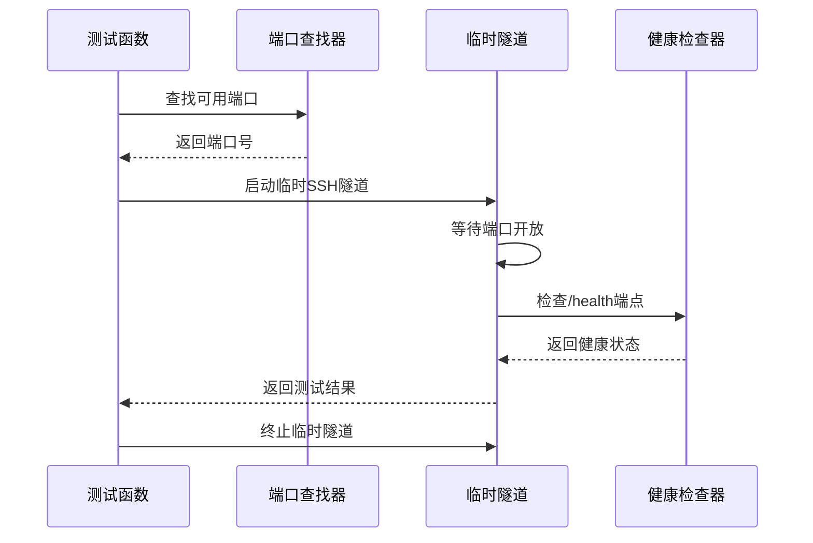
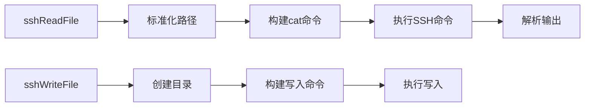
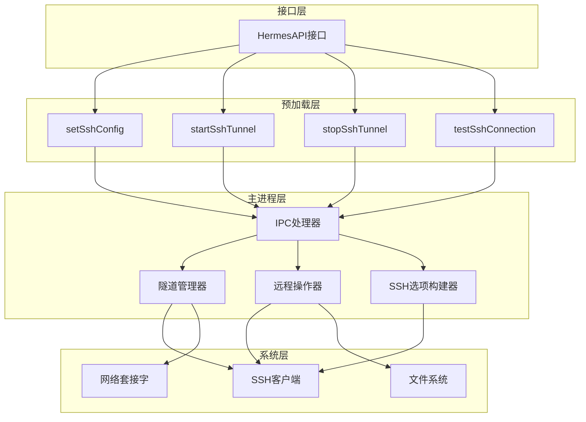

# SSH连接API

<cite>
**本文档引用的文件**
- [ssh-tunnel.ts](file://src/main/ssh-tunnel.ts)
- [ssh-remote.ts](file://src/main/ssh-remote.ts)
- [ssh-options.ts](file://src/main/ssh-options.ts)
- [index.d.ts](file://src/preload/index.d.ts)
- [index.ts](file://src/preload/index.ts)
- [index.ts](file://src/main/index.ts)
- [ssh-remote.test.ts](file://tests/ssh-remote.test.ts)
- [ssh-options.test.ts](file://tests/ssh-options.test.ts)
</cite>

## 目录
1. [简介](#简介)
2. [项目结构](#项目结构)
3. [核心组件](#核心组件)
4. [架构概览](#架构概览)
5. [详细组件分析](#详细组件分析)
6. [依赖关系分析](#依赖关系分析)
7. [性能考虑](#性能考虑)
8. [故障排除指南](#故障排除指南)
9. [结论](#结论)

## 简介

SSH连接API是Hermes桌面应用中用于建立和管理SSH隧道连接的核心模块。该API提供了完整的SSH连接生命周期管理，包括连接测试、隧道建立、状态监控和断开处理。系统支持基于密钥认证的SSH连接，实现了端口转发功能，允许本地应用通过SSH隧道访问远程主机上的Hermes服务。

该API采用Electron IPC架构设计，通过预加载脚本暴露给渲染进程，同时在主进程中实现具体的SSH操作逻辑。系统支持多种SSH配置选项，包括密钥路径、端口配置和连接参数优化。

## 项目结构

SSH连接功能分布在以下关键文件中：

**图表来源**
- [index.d.ts:87-107](file://src/preload/index.d.ts#L87-L107)
- [index.ts:127-156](file://src/preload/index.ts#L127-L156)
- [ssh-tunnel.ts:1-220](file://src/main/ssh-tunnel.ts#L1-L220)
- [ssh-remote.ts:1-1144](file://src/main/ssh-remote.ts#L1-L1144)

**章节来源**
- [ssh-tunnel.ts:1-220](file://src/main/ssh-tunnel.ts#L1-L220)
- [ssh-remote.ts:1-1144](file://src/main/ssh-remote.ts#L1-L1144)
- [ssh-options.ts:1-22](file://src/main/ssh-options.ts#L1-L22)

## 核心组件

SSH连接API由四个核心组件构成：

### 1. SSH配置接口 (SshConfig)
定义了SSH连接的所有必要参数：
- 主机地址和端口
- 用户名和密钥路径
- 本地和远程端口映射

### 2. 隧道管理器
负责SSH隧道的生命周期管理，包括启动、停止、健康检查和状态监控。

### 3. 远程操作执行器
封装了所有通过SSH执行的远程操作，如文件读写、配置管理和服务控制。

### 4. SSH选项构建器
根据操作系统平台生成优化的SSH连接参数。

**章节来源**
- [ssh-tunnel.ts:8-15](file://src/main/ssh-tunnel.ts#L8-L15)
- [ssh-tunnel.ts:17-28](file://src/main/ssh-tunnel.ts#L17-L28)
- [ssh-options.ts:1-22](file://src/main/ssh-options.ts#L1-L22)

## 架构概览

SSH连接API采用分层架构设计，确保了良好的模块化和可维护性：

**图表来源**
- [index.ts:492-511](file://src/main/index.ts#L492-L511)
- [index.ts:524-542](file://src/main/index.ts#L524-L542)
- [ssh-tunnel.ts:120-153](file://src/main/ssh-tunnel.ts#L120-L153)

## 详细组件分析

### SSH隧道管理器

#### 核心功能
隧道管理器提供了完整的SSH隧道生命周期管理：

**图表来源**
- [ssh-tunnel.ts:17-28](file://src/main/ssh-tunnel.ts#L17-L28)
- [ssh-tunnel.ts:8-15](file://src/main/ssh-tunnel.ts#L8-L15)

#### 隧道启动流程
隧道启动过程包含多个验证步骤：

**图表来源**
- [ssh-tunnel.ts:120-153](file://src/main/ssh-tunnel.ts#L120-L153)
- [ssh-tunnel.ts:82-101](file://src/main/ssh-tunnel.ts#L82-L101)

**章节来源**
- [ssh-tunnel.ts:120-166](file://src/main/ssh-tunnel.ts#L120-L166)

### SSH连接测试

#### 测试流程
连接测试功能通过临时隧道验证SSH连通性和远程服务健康状态：

**图表来源**
- [ssh-tunnel.ts:169-219](file://src/main/ssh-tunnel.ts#L169-L219)

**章节来源**
- [ssh-tunnel.ts:169-219](file://src/main/ssh-tunnel.ts#L169-L219)

### 远程操作执行器

#### 文件操作
远程文件操作通过SSH执行bash命令实现：

**图表来源**
- [ssh-remote.ts:103-122](file://src/main/ssh-remote.ts#L103-L122)

**章节来源**
- [ssh-remote.ts:103-122](file://src/main/ssh-remote.ts#L103-L122)

### SSH选项管理

#### 平台特定配置
SSH选项根据操作系统自动调整连接参数：

| 平台 | ControlMaster | ControlPath | ControlPersist |
|------|---------------|-------------|----------------|
| Windows | no | none | no |
| 其他平台 | auto | ~/.ssh/cm-hermes-%r@%h:%p | 60s |

**章节来源**
- [ssh-options.ts:1-22](file://src/main/ssh-options.ts#L1-L22)

## 依赖关系分析

SSH连接API的依赖关系体现了清晰的分层架构：

**图表来源**
- [index.d.ts:87-107](file://src/preload/index.d.ts#L87-L107)
- [index.ts:127-156](file://src/preload/index.ts#L127-L156)
- [index.ts:492-542](file://src/main/index.ts#L492-L542)

**章节来源**
- [index.ts:492-542](file://src/main/index.ts#L492-L542)

## 性能考虑

### 连接复用优化
系统通过SSH连接复用来提高性能：

1. **控制套接字复用**: 在非Windows平台上启用SSH控制套接字
2. **持久连接**: 控制连接保持60秒
3. **自动重用**: 复用现有连接而非建立新连接

### 超时和重试机制
- 端口等待超时: 12秒
- 健康检查超时: 20秒
- 连接超时: 15秒
- 自动重试间隔: 500毫秒

### 内存管理
- 临时隧道使用后自动清理
- 进程退出时清理资源
- 健康检查使用HTTP请求而非长连接

## 故障排除指南

### 常见问题诊断

#### 认证失败
可能原因:
- SSH密钥权限不正确
- 主机密钥验证失败
- 用户名或主机名错误

解决方法:
- 检查SSH密钥文件权限
- 更新已知主机列表
- 验证连接参数

#### 连接超时
可能原因:
- 网络连接问题
- 防火墙阻拦
- 远程服务未启动

解决方法:
- 检查网络连通性
- 配置防火墙规则
- 启动远程服务

#### 端口占用
解决方法:
- 使用不同的本地端口
- 检查端口占用情况
- 清理僵尸进程

**章节来源**
- [ssh-remote.ts:74-89](file://src/main/ssh-remote.ts#L74-L89)
- [ssh-tunnel.ts:82-101](file://src/main/ssh-tunnel.ts#L82-L101)

## 结论

SSH连接API为Hermes桌面应用提供了强大而可靠的远程连接能力。通过精心设计的架构和完善的错误处理机制，该API能够满足各种复杂的SSH连接需求。

主要优势包括：
- 完整的连接生命周期管理
- 平台特定的优化配置
- 健壮的错误处理和恢复机制
- 清晰的接口设计和文档

未来可以考虑的改进方向：
- 添加连接池管理
- 实现更智能的重连策略
- 增加连接监控和统计功能
- 支持更多SSH认证方式