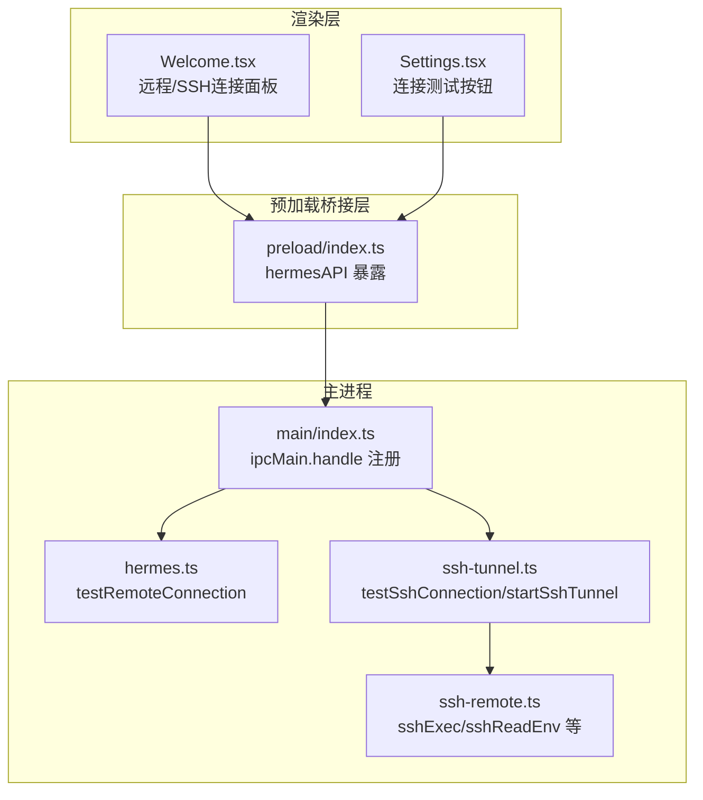
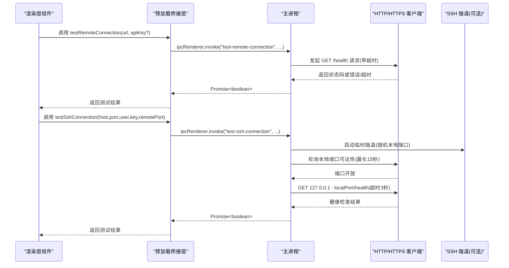
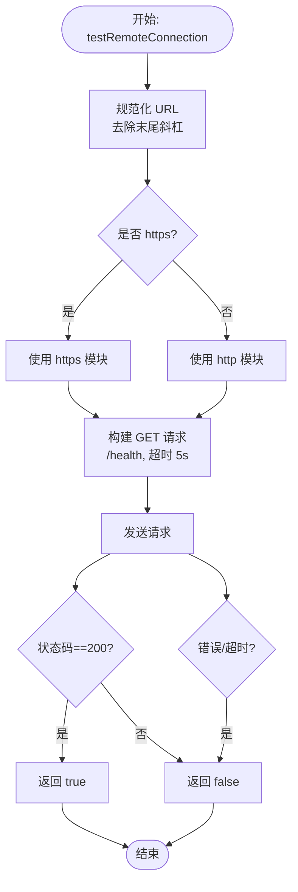
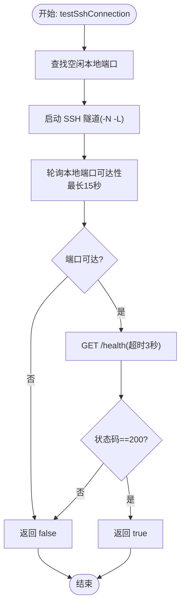
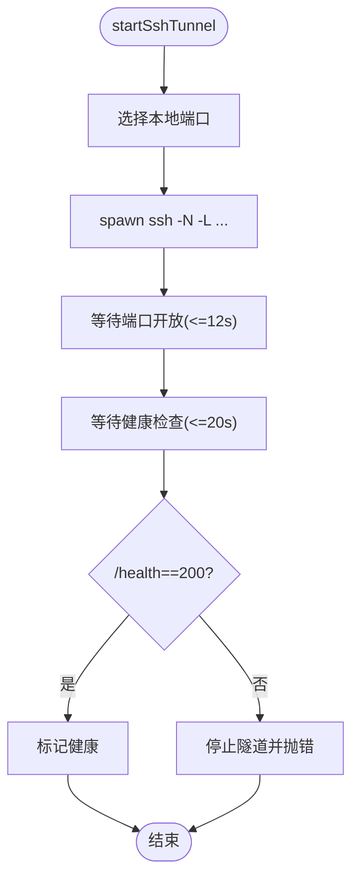
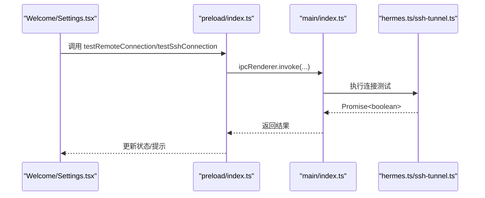
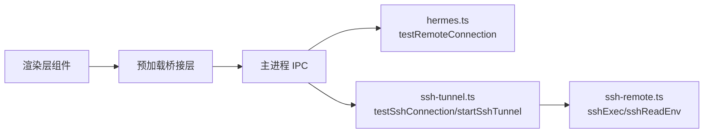

# 连接测试API

<cite>
**本文档引用的文件**
- [src/main/hermes.ts](file://src/main/hermes.ts)
- [src/main/index.ts](file://src/main/index.ts)
- [src/preload/index.ts](file://src/preload/index.ts)
- [src/main/ssh-tunnel.ts](file://src/main/ssh-tunnel.ts)
- [src/main/ssh-remote.ts](file://src/main/ssh-remote.ts)
- [src/renderer/src/screens/Welcome/Welcome.tsx](file://src/renderer/src/screens/Welcome/Welcome.tsx)
- [src/renderer/src/screens/Settings/Settings.tsx](file://src/renderer/src/screens/Settings/Settings.tsx)
- [tests/ssh-remote.test.ts](file://tests/ssh-remote.test.ts)
</cite>

## 目录
1. [简介](#简介)
2. [项目结构](#项目结构)
3. [核心组件](#核心组件)
4. [架构总览](#架构总览)
5. [详细组件分析](#详细组件分析)
6. [依赖关系分析](#依赖关系分析)
7. [性能考量](#性能考量)
8. [故障排查指南](#故障排查指南)
9. [结论](#结论)
10. [附录](#附录)

## 简介
本文件系统化梳理了连接测试API的设计与实现，重点覆盖以下内容：
- testRemoteConnection 远程连接测试接口的工作原理与调用链路
- SSH隧道连接测试 testSshConnection 的实现细节与健康检查策略
- 不同连接模式（本地/远程/SSH）下的测试方法与超时设置
- 错误诊断与常见问题定位
- 自动化脚本、批量测试与结果统计的实现思路

## 项目结构
连接测试能力由主进程、预加载桥接层与渲染层三部分协同完成：
- 主进程：提供 IPC 处理函数与底层连接测试逻辑
- 预加载桥接层：暴露 hermesAPI 接口给渲染层调用
- 渲染层：提供用户界面与交互流程，触发连接测试

图表来源
- [src/renderer/src/screens/Welcome/Welcome.tsx:45-110](file://src/renderer/src/screens/Welcome/Welcome.tsx#L45-L110)
- [src/renderer/src/screens/Settings/Settings.tsx:217-243](file://src/renderer/src/screens/Settings/Settings.tsx#L217-L243)
- [src/preload/index.ts:137-147](file://src/preload/index.ts#L137-L147)
- [src/main/index.ts:514-522](file://src/main/index.ts#L514-L522)
- [src/main/hermes.ts:854-878](file://src/main/hermes.ts#L854-L878)
- [src/main/ssh-tunnel.ts:169-219](file://src/main/ssh-tunnel.ts#L169-L219)
- [src/main/ssh-remote.ts:37-65](file://src/main/ssh-remote.ts#L37-L65)

章节来源
- [src/main/index.ts:514-522](file://src/main/index.ts#L514-L522)
- [src/preload/index.ts:137-147](file://src/preload/index.ts#L137-L147)
- [src/main/hermes.ts:854-878](file://src/main/hermes.ts#L854-L878)
- [src/main/ssh-tunnel.ts:169-219](file://src/main/ssh-tunnel.ts#L169-L219)

## 核心组件
- testRemoteConnection(url, apiKey?)
  - 功能：向指定 URL 的 /health 端点发起 GET 请求，校验返回状态码为 200
  - 超时：5 秒；异常或超时均视为失败
  - 认证：可选 Bearer Token
- testSshConnection(config)
  - 功能：通过临时 SSH 隧道探测本地端口可达性，并访问 /health
  - 超时：整体约 20 秒；端口可达性轮询最长 15 秒；健康检查请求超时 3 秒
  - 健康检查：本地 127.0.0.1:localPort/health
- startSshTunnel(config)
  - 功能：启动持久 SSH 隧道，等待端口开放与健康检查通过
  - 超时：端口等待最多 12 秒；健康检查最多 20 秒

章节来源
- [src/main/hermes.ts:854-878](file://src/main/hermes.ts#L854-L878)
- [src/main/ssh-tunnel.ts:30-57](file://src/main/ssh-tunnel.ts#L30-L57)
- [src/main/ssh-tunnel.ts:82-101](file://src/main/ssh-tunnel.ts#L82-L101)
- [src/main/ssh-tunnel.ts:120-153](file://src/main/ssh-tunnel.ts#L120-L153)
- [src/main/ssh-tunnel.ts:169-219](file://src/main/ssh-tunnel.ts#L169-L219)

## 架构总览
连接测试在渲染层通过 hermesAPI 触发，在主进程注册的 IPC 处理函数中执行具体逻辑，最终返回布尔值表示“是否可达”。

图表来源
- [src/preload/index.ts:137-147](file://src/preload/index.ts#L137-L147)
- [src/main/index.ts:514-522](file://src/main/index.ts#L514-L522)
- [src/main/hermes.ts:854-878](file://src/main/hermes.ts#L854-L878)
- [src/main/ssh-tunnel.ts:169-219](file://src/main/ssh-tunnel.ts#L169-L219)

## 详细组件分析

### 远程连接测试：testRemoteConnection
- 输入参数
  - url: 目标服务器地址（自动去除末尾斜杠）
  - apiKey?: 可选认证令牌
- 实现要点
  - 自动识别 http/https 并选择对应模块
  - 设置请求方法为 GET，超时 5000ms
  - 成功条件：响应状态码为 200
  - 异常/超时均返回 false
- 使用场景
  - 直连远程服务器（如通过反向代理或内网直连）
  - 验证服务器可达性与 /health 端点可用性

图表来源
- [src/main/hermes.ts:854-878](file://src/main/hermes.ts#L854-L878)

章节来源
- [src/main/hermes.ts:854-878](file://src/main/hermes.ts#L854-L878)

### SSH 连接测试：testSshConnection
- 输入参数
  - config: 包含 host/port/username/keyPath/remotePort/localPort
- 实现要点
  - 选择一个空闲本地端口（默认从 19642 开始）
  - 以 -N 选项启动 SSH 隧道，将本地端口转发到 127.0.0.1:remotePort
  - 轮询本地端口可达性，最长 15 秒
  - 端口可达后，向 127.0.0.1:localPort/health 发起 GET 请求，超时 3 秒
  - 成功条件：端口可达且健康检查返回 200
- 关键超时
  - 端口可达性轮询：最长 15 秒
  - 健康检查请求：3 秒
  - 整体：约 20 秒

图表来源
- [src/main/ssh-tunnel.ts:169-219](file://src/main/ssh-tunnel.ts#L169-L219)

章节来源
- [src/main/ssh-tunnel.ts:169-219](file://src/main/ssh-tunnel.ts#L169-L219)

### SSH 隧道管理：startSshTunnel 与健康检查
- 端口选择与隧道启动
  - 优先使用配置中的 localPort，否则寻找空闲端口
  - 以 -N -L 参数启动隧道，转发到 127.0.0.1:remotePort
- 健康检查策略
  - 等待端口开放（最长 12 秒）
  - 执行 /health 检查（超时 20 秒），周期性轮询
- 健康状态判定
  - 端口开放且 /health 返回 200 则认为健康
  - 否则停止隧道并抛出错误

图表来源
- [src/main/ssh-tunnel.ts:120-153](file://src/main/ssh-tunnel.ts#L120-L153)
- [src/main/ssh-tunnel.ts:30-57](file://src/main/ssh-tunnel.ts#L30-L57)

章节来源
- [src/main/ssh-tunnel.ts:120-153](file://src/main/ssh-tunnel.ts#L120-L153)
- [src/main/ssh-tunnel.ts:30-57](file://src/main/ssh-tunnel.ts#L30-L57)

### 渲染层调用与UI反馈
- Welcome.tsx
  - 提供“远程连接”和“SSH连接”两种面板
  - 调用 window.hermesAPI.testRemoteConnection 或 testSshConnection
  - 根据返回结果更新状态与提示信息
- Settings.tsx
  - 提供“测试连接”按钮，根据当前连接模式调用相应测试函数
  - 显示成功/失败状态提示

图表来源
- [src/renderer/src/screens/Welcome/Welcome.tsx:45-110](file://src/renderer/src/screens/Welcome/Welcome.tsx#L45-L110)
- [src/renderer/src/screens/Settings/Settings.tsx:217-243](file://src/renderer/src/screens/Settings/Settings.tsx#L217-L243)
- [src/preload/index.ts:137-147](file://src/preload/index.ts#L137-L147)
- [src/main/index.ts:514-522](file://src/main/index.ts#L514-L522)

章节来源
- [src/renderer/src/screens/Welcome/Welcome.tsx:45-110](file://src/renderer/src/screens/Welcome/Welcome.tsx#L45-L110)
- [src/renderer/src/screens/Settings/Settings.tsx:217-243](file://src/renderer/src/screens/Settings/Settings.tsx#L217-L243)

## 依赖关系分析
- 渲染层依赖预加载桥接层提供的 hermesAPI
- 预加载桥接层通过 ipcRenderer.invoke 与主进程通信
- 主进程通过 ipcMain.handle 注册处理函数
- 远程测试依赖 Node 内置 http/https 模块
- SSH 测试依赖 ssh 命令与本地端口健康检查

图表来源
- [src/preload/index.ts:137-147](file://src/preload/index.ts#L137-L147)
- [src/main/index.ts:514-522](file://src/main/index.ts#L514-L522)
- [src/main/hermes.ts:854-878](file://src/main/hermes.ts#L854-L878)
- [src/main/ssh-tunnel.ts:169-219](file://src/main/ssh-tunnel.ts#L169-L219)
- [src/main/ssh-remote.ts:37-65](file://src/main/ssh-remote.ts#L37-L65)

章节来源
- [src/main/index.ts:514-522](file://src/main/index.ts#L514-L522)
- [src/preload/index.ts:137-147](file://src/preload/index.ts#L137-L147)

## 性能考量
- 远程连接测试
  - 单次请求，超时 5 秒，开销极低
  - 适合频繁调用的 UI 反馈
- SSH 连接测试
  - 启动临时隧道与端口轮询，整体约 20 秒
  - 建议在用户点击“测试连接”后再触发，避免后台无谓开销
- 健康检查轮询
  - 隧道启动阶段采用 500ms 轮询，避免阻塞主线程
  - 健康检查单次请求超时 20 秒，防止长时间卡死

[本节为通用指导，不直接分析具体文件]

## 故障排查指南
- 远程连接失败
  - 检查 URL 是否正确，是否以 / 结尾
  - 若需要认证，确认 API Key 正确
  - 确认服务器 /health 端点可达且返回 200
- SSH 连接失败
  - 确认主机名、端口、用户名、密钥路径正确
  - 确认远端 Hermes 网关已运行
  - 确认远端端口（默认 8642）正确
  - 查看 SSH 错误信息（如公钥认证失败、主机密钥校验失败）
- 隧道健康检查失败
  - 检查本地端口是否被占用
  - 检查防火墙与安全组规则
  - 重新启动隧道并重试

章节来源
- [src/renderer/src/screens/Welcome/Welcome.tsx:60-68](file://src/renderer/src/screens/Welcome/Welcome.tsx#L60-L68)
- [src/renderer/src/screens/Welcome/Welcome.tsx:101-104](file://src/renderer/src/screens/Welcome/Welcome.tsx#L101-L104)
- [src/main/ssh-remote.ts:74-89](file://src/main/ssh-remote.ts#L74-L89)

## 结论
连接测试API通过清晰的职责分离与超时控制，提供了可靠的远程与SSH连接验证能力。远程测试简洁高效，SSH测试通过临时隧道与健康检查确保端到端可用性。建议在 UI 中按需触发测试，并结合错误信息进行快速诊断。

[本节为总结性内容，不直接分析具体文件]

## 附录

### API 定义与调用规范
- testRemoteConnection(url: string, apiKey?: string): Promise<boolean>
  - 用途：验证远程服务器 /health 可达性
  - 超时：5 秒
  - 认证：可选 Bearer Token
- testSshConnection(config: SshConfig): Promise<boolean>
  - 用途：通过临时隧道验证 SSH 连接与健康检查
  - 超时：约 20 秒
  - 返回：true 表示连接与健康检查均通过

章节来源
- [src/preload/index.ts:137-147](file://src/preload/index.ts#L137-L147)
- [src/main/index.ts:514-522](file://src/main/index.ts#L514-L522)
- [src/main/hermes.ts:854-878](file://src/main/hermes.ts#L854-L878)
- [src/main/ssh-tunnel.ts:169-219](file://src/main/ssh-tunnel.ts#L169-L219)

### 自动化脚本与批量测试思路
- 单测参考
  - 可参考现有单元测试对 SSH 配置写入的断言，扩展为连接测试的自动化用例
- 批量测试
  - 读取配置文件中的多组连接参数，循环调用 testRemoteConnection 或 testSshConnection
  - 统计成功/失败数量与失败原因分类
- 结果统计
  - 记录每个目标的测试时间、状态与错误摘要
  - 输出汇总报告（成功率、平均耗时、失败列表）

章节来源
- [tests/ssh-remote.test.ts:1-26](file://tests/ssh-remote.test.ts#L1-L26)