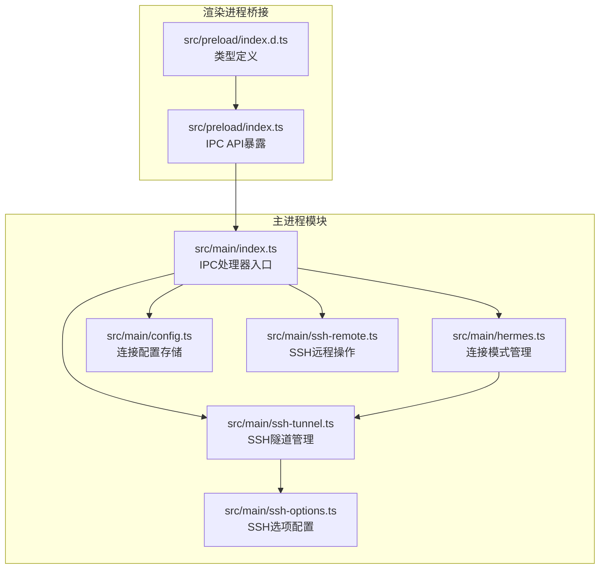
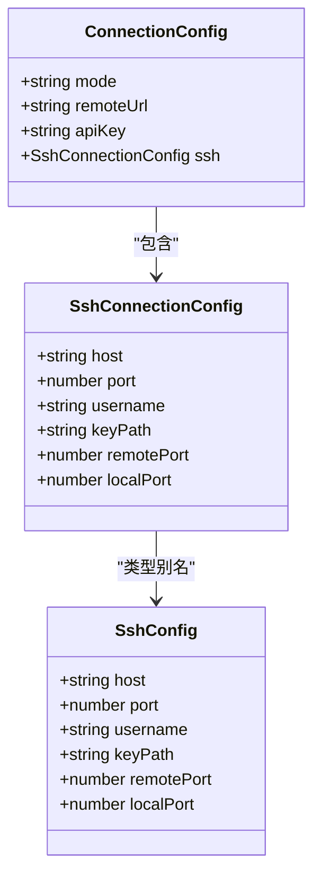
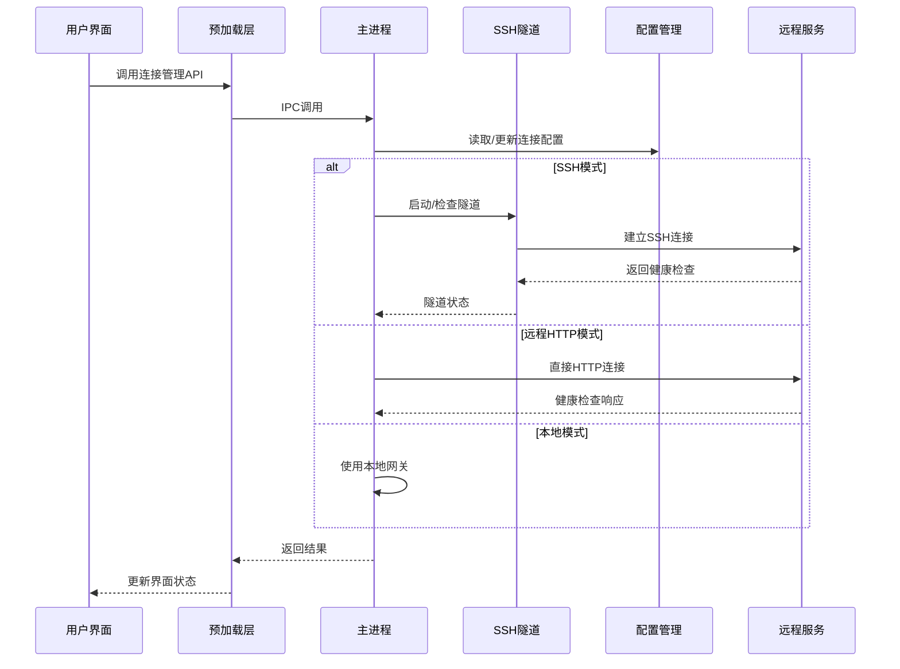
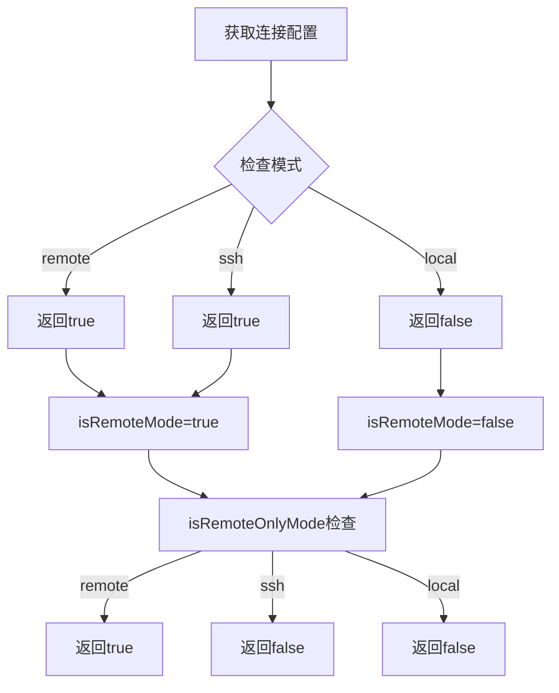
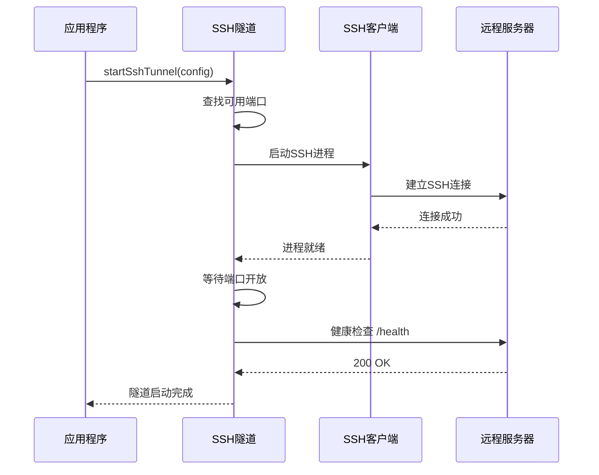
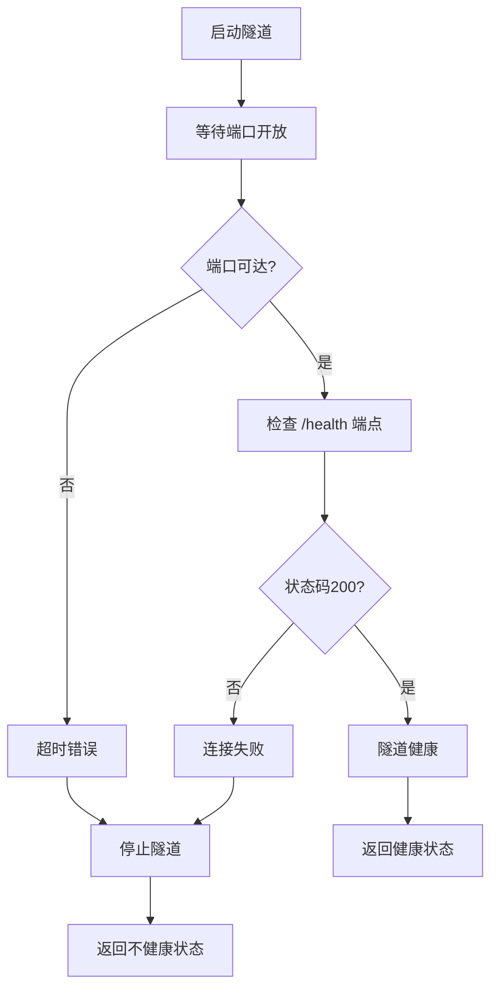
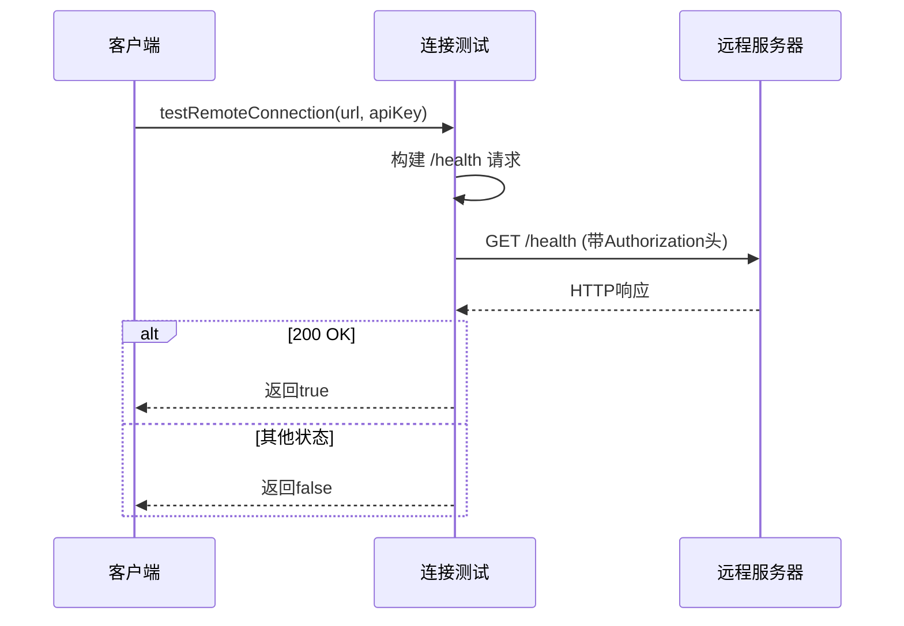
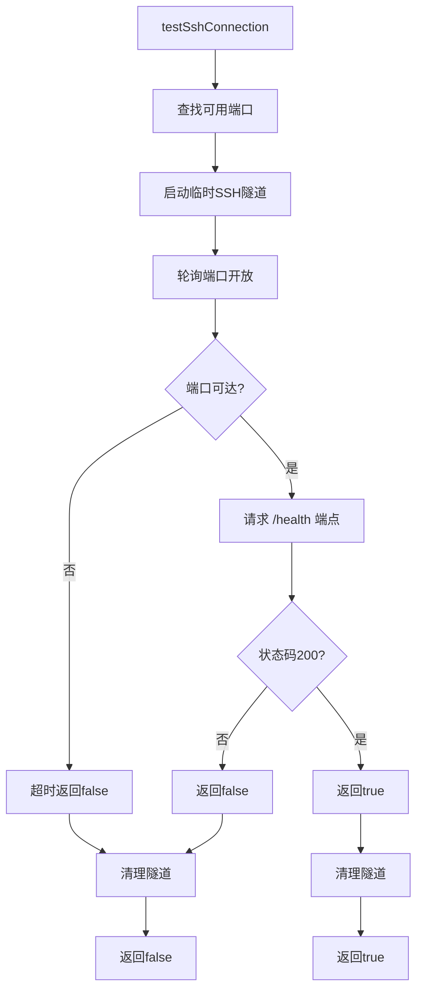
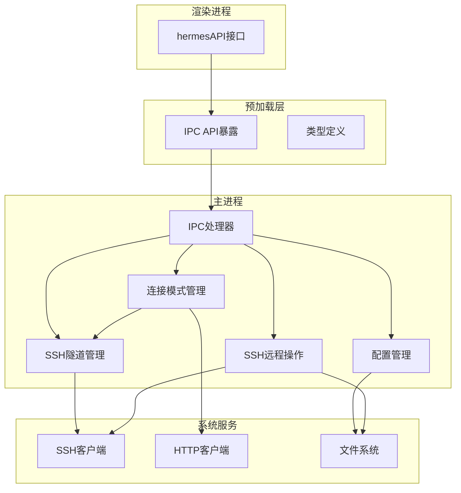

# 连接管理API

<cite>
**本文档引用的文件**
- [src/main/index.ts](file://src/main/index.ts)
- [src/main/hermes.ts](file://src/main/hermes.ts)
- [src/main/ssh-tunnel.ts](file://src/main/ssh-tunnel.ts)
- [src/main/ssh-options.ts](file://src/main/ssh-options.ts)
- [src/main/config.ts](file://src/main/config.ts)
- [src/main/ssh-remote.ts](file://src/main/ssh-remote.ts)
- [src/preload/index.ts](file://src/preload/index.ts)
- [src/preload/index.d.ts](file://src/preload/index.d.ts)
</cite>

## 目录
1. [简介](#简介)
2. [项目结构](#项目结构)
3. [核心组件](#核心组件)
4. [架构概览](#架构概览)
5. [详细组件分析](#详细组件分析)
6. [依赖关系分析](#依赖关系分析)
7. [性能考虑](#性能考虑)
8. [故障排查指南](#故障排查指南)
9. [结论](#结论)

## 简介

连接管理API是Hermes桌面应用中负责管理不同连接模式的核心模块。该系统支持三种连接模式：本地模式（local）、远程HTTP模式（remote）和SSH隧道模式（ssh）。通过统一的IPC接口，应用程序可以在不同的运行环境中无缝切换连接方式，确保用户能够根据需要选择最适合的连接策略。

本API提供了完整的连接配置管理、连接测试、隧道管理和状态监控功能，涵盖了从基础连接建立到高级安全认证的完整生命周期管理。

## 项目结构

连接管理API主要分布在以下核心文件中：

**图表来源**
- [src/main/index.ts:1-1234](file://src/main/index.ts#L1-L1234)
- [src/main/hermes.ts:1-887](file://src/main/hermes.ts#L1-L887)
- [src/main/ssh-tunnel.ts:1-220](file://src/main/ssh-tunnel.ts#L1-L220)
- [src/main/config.ts:1-440](file://src/main/config.ts#L1-L440)

**章节来源**
- [src/main/index.ts:290-542](file://src/main/index.ts#L290-L542)
- [src/main/hermes.ts:35-62](file://src/main/hermes.ts#L35-L62)
- [src/main/ssh-tunnel.ts:8-24](file://src/main/ssh-tunnel.ts#L8-L24)

## 核心组件

### 连接模式类型定义

连接管理API基于统一的连接配置结构，支持三种运行模式：

**图表来源**
- [src/main/config.ts:17-22](file://src/main/config.ts#L17-L22)
- [src/main/ssh-tunnel.ts:8-15](file://src/main/ssh-tunnel.ts#L8-L15)

### IPC接口总览

连接管理API通过Electron IPC提供统一的接口调用：

| 接口名称 | 参数类型 | 返回值 | 描述 |
|---------|----------|--------|------|
| isRemoteMode | 无 | boolean | 检查是否处于远程模式 |
| isRemoteOnlyMode | 无 | boolean | 检查是否为纯远程HTTP模式 |
| getConnectionConfig | 无 | ConnectionConfig | 获取当前连接配置 |
| setConnectionConfig | mode, remoteUrl, apiKey | boolean | 设置连接配置 |
| setSshConfig | host, port, username, keyPath, remotePort, localPort | boolean | 设置SSH连接配置 |
| testRemoteConnection | url, apiKey | boolean | 测试远程连接 |
| testSshConnection | host, port, username, keyPath, remotePort | boolean | 测试SSH连接 |
| isSshTunnelActive | 无 | boolean | 检查SSH隧道状态 |
| startSshTunnel | 无 | boolean | 启动SSH隧道 |
| stopSshTunnel | 无 | boolean | 停止SSH隧道 |

**章节来源**
- [src/main/index.ts:473-542](file://src/main/index.ts#L473-L542)
- [src/preload/index.ts:103-156](file://src/preload/index.ts#L103-L156)

## 架构概览

连接管理API采用分层架构设计，确保不同连接模式之间的平滑切换：

**图表来源**
- [src/main/index.ts:524-542](file://src/main/index.ts#L524-L542)
- [src/main/hermes.ts:64-69](file://src/main/hermes.ts#L64-L69)
- [src/main/ssh-tunnel.ts:120-153](file://src/main/ssh-tunnel.ts#L120-L153)

## 详细组件分析

### 连接模式管理

#### isRemoteMode 和 isRemoteOnlyMode

这两个函数用于判断当前的连接模式状态：

**图表来源**
- [src/main/hermes.ts:35-43](file://src/main/hermes.ts#L35-L43)

#### 连接配置管理

连接配置通过JSON文件持久化存储，支持以下字段：

| 字段名 | 类型 | 必需 | 默认值 | 描述 |
|--------|------|------|--------|------|
| connectionMode | "local" \| "remote" \| "ssh" | 是 | "local" | 连接模式 |
| remoteUrl | string | remote模式时必需 | "" | 远程服务器URL |
| remoteApiKey | string | remote模式时可选 | "" | 远程API密钥 |
| sshConfig.host | string | ssh模式时必需 | "" | SSH主机地址 |
| sshConfig.port | number | ssh模式时可选 | 22 | SSH端口号 |
| sshConfig.username | string | ssh模式时必需 | "" | SSH用户名 |
| sshConfig.keyPath | string | ssh模式时可选 | "~/.ssh/id_rsa" | SSH密钥路径 |
| sshConfig.remotePort | number | ssh模式时可选 | 8642 | 远程端口号 |
| sshConfig.localPort | number | ssh模式时可选 | 18642 | 本地端口号 |

**章节来源**
- [src/main/config.ts:47-74](file://src/main/config.ts#L47-L74)
- [src/main/config.ts:8-22](file://src/main/config.ts#L8-L22)

### SSH隧道管理

#### SSH隧道启动流程

**图表来源**
- [src/main/ssh-tunnel.ts:120-153](file://src/main/ssh-tunnel.ts#L120-L153)
- [src/main/ssh-tunnel.ts:50-57](file://src/main/ssh-tunnel.ts#L50-L57)

#### SSH隧道健康检查

SSH隧道提供了多层次的健康检查机制：

**图表来源**
- [src/main/ssh-tunnel.ts:30-48](file://src/main/ssh-tunnel.ts#L30-L48)
- [src/main/ssh-tunnel.ts:82-101](file://src/main/ssh-tunnel.ts#L82-L101)

**章节来源**
- [src/main/ssh-tunnel.ts:120-166](file://src/main/ssh-tunnel.ts#L120-L166)

### 连接测试机制

#### 远程连接测试

远程连接测试通过HTTP请求验证目标服务器的可达性和认证状态：

**图表来源**
- [src/main/hermes.ts:854-878](file://src/main/hermes.ts#L854-L878)

#### SSH连接测试

SSH连接测试使用临时隧道验证SSH连通性和远程服务可用性：

**图表来源**
- [src/main/ssh-tunnel.ts:169-219](file://src/main/ssh-tunnel.ts#L169-L219)

**章节来源**
- [src/main/hermes.ts:854-878](file://src/main/hermes.ts#L854-L878)
- [src/main/ssh-tunnel.ts:169-219](file://src/main/ssh-tunnel.ts#L169-L219)

### 安全性保障

#### SSH认证机制

SSH连接采用了多层安全措施：

1. **密钥认证**：支持私钥文件认证，自动使用默认SSH密钥路径
2. **主机密钥验证**：启用严格主机密钥检查，防止中间人攻击
3. **控制套接字复用**：在非Windows平台使用SSH控制套接字提高连接效率
4. **连接超时控制**：设置合理的连接超时时间防止资源泄露

#### API密钥管理

远程连接模式支持两种认证方式：
- **Bearer Token认证**：通过Authorization头传递API密钥
- **匿名访问**：某些场景下允许无认证访问（如通过SSH隧道）

**章节来源**
- [src/main/ssh-options.ts:1-22](file://src/main/ssh-options.ts#L1-L22)
- [src/main/hermes.ts:52-62](file://src/main/hermes.ts#L52-L62)

## 依赖关系分析

连接管理API的依赖关系呈现清晰的分层结构：

**图表来源**
- [src/main/index.ts:1-1234](file://src/main/index.ts#L1-L1234)
- [src/preload/index.ts:1-701](file://src/preload/index.ts#L1-L701)

**章节来源**
- [src/main/index.ts:290-542](file://src/main/index.ts#L290-L542)
- [src/main/hermes.ts:15-18](file://src/main/hermes.ts#L15-L18)

## 性能考虑

### 连接池优化

SSH连接管理采用了智能的连接池策略：
- **控制套接字复用**：在Unix-like系统上启用SSH控制套接字，减少重复握手开销
- **隧道复用**：同一配置的隧道可以被多次复用，避免重复建立连接
- **健康检查缓存**：隧道健康状态进行短期缓存，减少频繁检查的开销

### 超时和重试机制

系统实现了多层次的超时和重试策略：
- **连接超时**：SSH连接超时时间为20秒，HTTP连接超时为5秒
- **隧道启动超时**：SSH隧道启动超时时间为12秒，健康检查超时为20秒
- **自动重连**：在聊天过程中检测到连接异常会自动尝试重新建立连接

### 内存管理

- **配置缓存**：连接配置在内存中有5秒的缓存时间，减少频繁读取磁盘的开销
- **进程管理**：SSH隧道进程采用适当的生命周期管理，避免僵尸进程产生

## 故障排查指南

### 常见连接问题诊断

#### SSH连接失败

**症状**：`testSshConnection`返回false或隧道无法启动

**可能原因**：
1. SSH密钥配置错误
2. 远程服务器SSH服务未启动
3. 网络防火墙阻止SSH连接
4. 远程端口配置不正确

**解决步骤**：
1. 验证SSH密钥路径和权限
2. 确认远程服务器SSH服务状态
3. 检查防火墙规则
4. 验证远程端口配置（默认8642）

#### 远程HTTP连接失败

**症状**：`testRemoteConnection`返回false

**可能原因**：
1. URL格式错误
2. API密钥无效
3. 服务器未启动
4. 网络连接问题

**解决步骤**：
1. 验证URL格式（包含协议和端口）
2. 检查API密钥有效性
3. 确认服务器运行状态
4. 测试网络连通性

#### 隧道健康检查失败

**症状**：隧道已启动但`isSshTunnelHealthy`返回false

**可能原因**：
1. 远程服务未启动
2. 端口转发配置错误
3. 防火墙阻断本地回环连接

**解决步骤**：
1. 检查远程服务状态
2. 验证端口转发配置
3. 检查本地防火墙设置

### 调试工具和日志

系统提供了丰富的调试信息：
- **IPC调用日志**：记录所有IPC接口的调用和响应
- **连接状态监控**：实时显示连接模式和隧道状态
- **错误详情**：详细的错误信息帮助定位问题

**章节来源**
- [src/main/ssh-tunnel.ts:169-219](file://src/main/ssh-tunnel.ts#L169-L219)
- [src/main/hermes.ts:854-878](file://src/main/hermes.ts#L854-L878)

## 结论

连接管理API为Hermes桌面应用提供了强大而灵活的多模式连接支持。通过统一的接口设计和完善的错误处理机制，用户可以在本地、远程HTTP和SSH隧道三种模式之间无缝切换。

该系统的主要优势包括：
- **统一接口**：所有连接模式通过相同的API接口提供服务
- **智能切换**：根据配置自动选择最优的连接策略
- **安全保障**：多重认证和加密机制确保连接安全
- **故障恢复**：自动重连和健康检查机制提高系统稳定性
- **性能优化**：连接池和缓存机制提升整体性能

未来可以考虑的改进方向：
- 增加连接监控和统计功能
- 支持更复杂的代理和VPN场景
- 实现连接质量评估和自动优化
- 提供更详细的连接诊断工具