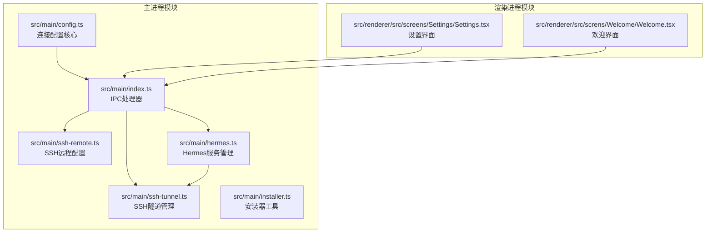
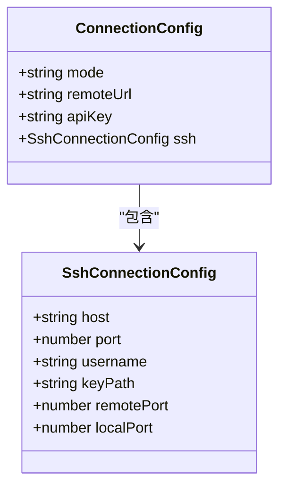
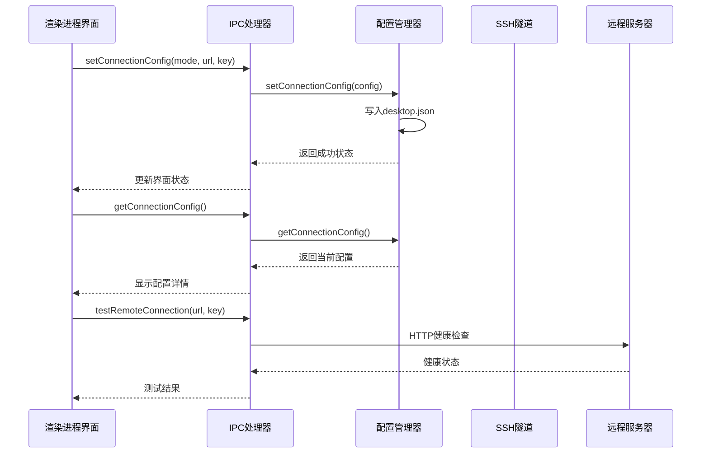
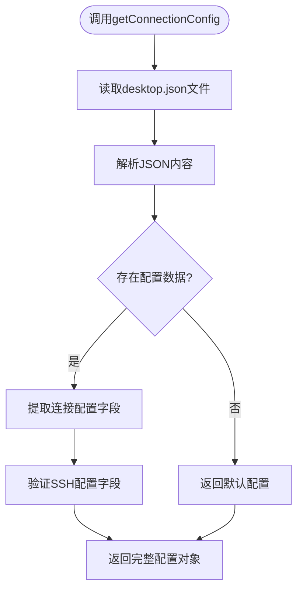
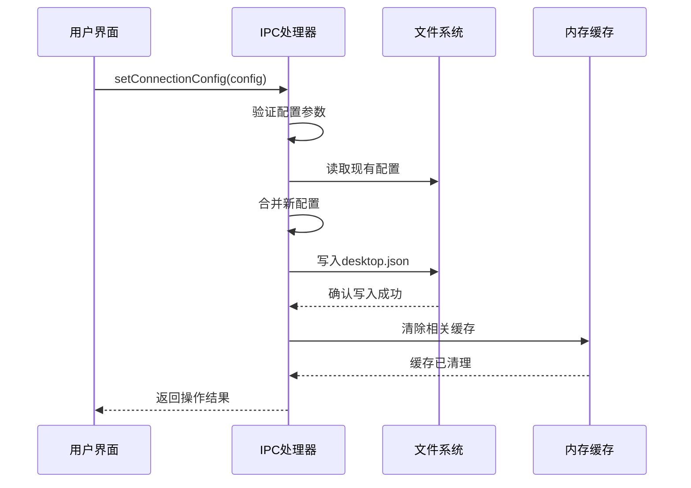
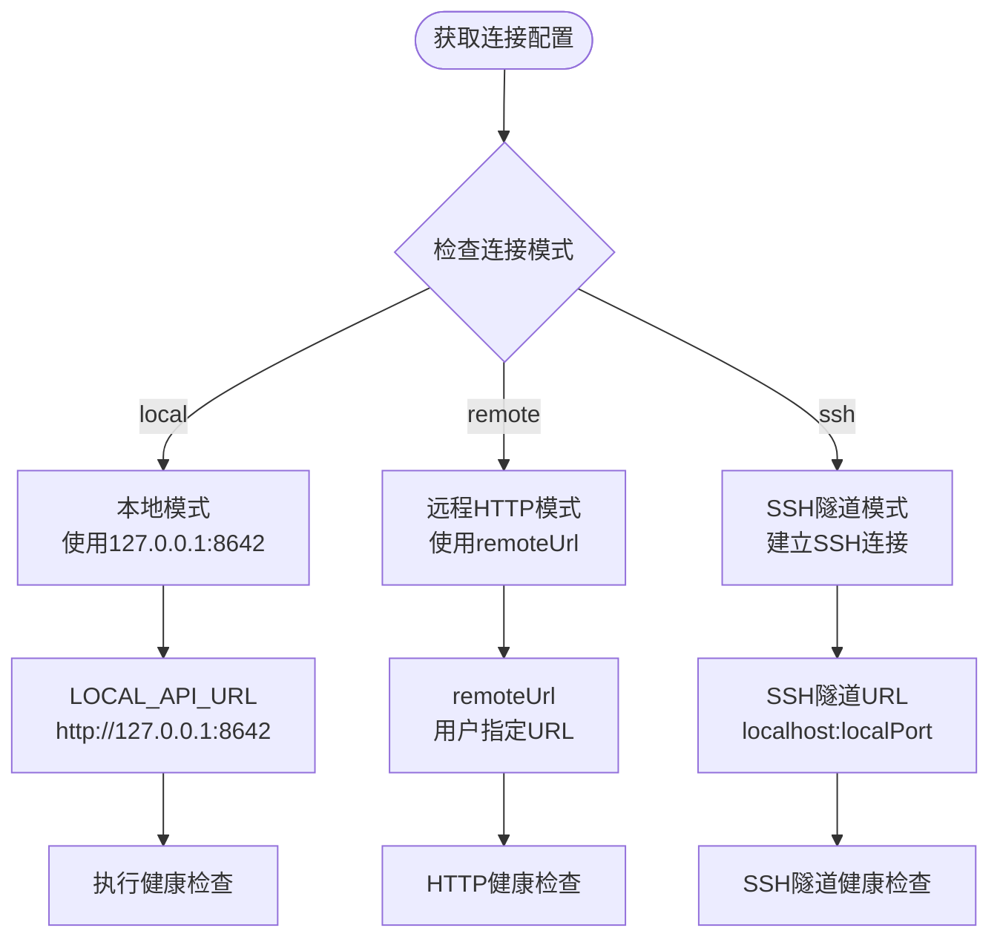
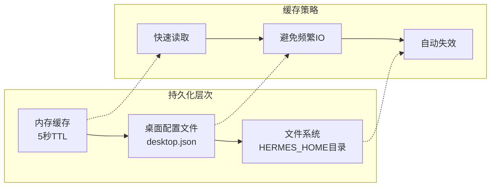
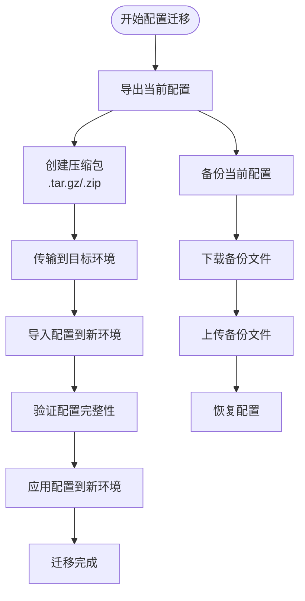
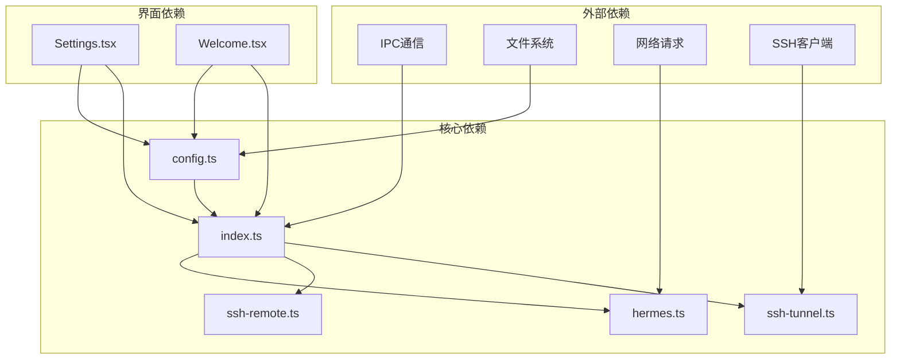

# 连接配置API

<cite>
**本文档引用的文件**
- [src/main/config.ts](file://src/main/config.ts)
- [src/main/index.ts](file://src/main/index.ts)
- [src/renderer/src/screens/Settings/Settings.tsx](file://src/renderer/src/screens/Settings/Settings.tsx)
- [src/main/ssh-remote.ts](file://src/main/ssh-remote.ts)
- [src/main/ssh-tunnel.ts](file://src/main/ssh-tunnel.ts)
- [src/main/hermes.ts](file://src/main/hermes.ts)
- [src/main/installer.ts](file://src/main/installer.ts)
- [src/renderer/src/screns/Welcome/Welcome.tsx](file://src/renderer/src/screns/Welcome/Welcome.tsx)
</cite>

## 目录
1. [简介](#简介)
2. [项目结构](#项目结构)
3. [核心组件](#核心组件)
4. [架构概览](#架构概览)
5. [详细组件分析](#详细组件分析)
6. [依赖关系分析](#依赖关系分析)
7. [性能考虑](#性能考虑)
8. [故障排除指南](#故障排除指南)
9. [结论](#结论)

## 简介

连接配置API是Hermes桌面应用程序的核心功能模块，负责管理用户与Hermes代理服务器的连接方式。该API支持三种连接模式：本地连接、远程HTTP连接和SSH隧道连接，为用户提供灵活的部署选项。

本API提供了完整的连接配置管理功能，包括配置参数验证、持久化存储、配置导入导出以及配置模板和迁移机制。通过统一的接口设计，用户可以在不同的连接模式之间无缝切换，同时保持配置的一致性和安全性。

## 项目结构

连接配置API主要分布在以下关键文件中：

**图表来源**
- [src/main/config.ts:1-81](file://src/main/config.ts#L1-L81)
- [src/main/index.ts:473-543](file://src/main/index.ts#L473-L543)

**章节来源**
- [src/main/config.ts:1-81](file://src/main/config.ts#L1-L81)
- [src/main/index.ts:473-543](file://src/main/index.ts#L473-L543)

## 核心组件

### 连接配置数据模型

连接配置API基于统一的数据结构来管理不同类型的连接信息：

**图表来源**
- [src/main/config.ts:8-22](file://src/main/config.ts#L8-L22)

### 配置持久化机制

连接配置采用JSON格式存储在桌面配置文件中，确保配置的持久性和跨会话一致性：

| 配置项 | 类型 | 默认值 | 描述 |
|--------|------|--------|------|
| connectionMode | string | "local" | 连接模式（local/remote/ssh） |
| remoteUrl | string | "" | 远程服务器URL |
| remoteApiKey | string | "" | 远程服务器API密钥 |
| sshConfig.host | string | "" | SSH主机地址 |
| sshConfig.port | number | 22 | SSH端口号 |
| sshConfig.username | string | "" | SSH用户名 |
| sshConfig.keyPath | string | "" | SSH密钥路径 |
| sshConfig.remotePort | number | 8642 | 远程端口 |
| sshConfig.localPort | number | 18642 | 本地端口 |

**章节来源**
- [src/main/config.ts:47-74](file://src/main/config.ts#L47-L74)

## 架构概览

连接配置API采用分层架构设计，通过IPC通信实现主进程和渲染进程之间的安全交互：

**图表来源**
- [src/main/index.ts:479-522](file://src/main/index.ts#L479-L522)
- [src/main/config.ts:47-74](file://src/main/config.ts#L47-L74)

## 详细组件分析

### getConnectionConfig 接口

`getConnectionConfig`接口负责从持久化存储中读取当前的连接配置信息：

**图表来源**
- [src/main/config.ts:47-63](file://src/main/config.ts#L47-L63)

**章节来源**
- [src/main/config.ts:47-63](file://src/main/config.ts#L47-L63)

### setConnectionConfig 接口

`setConnectionConfig`接口提供完整的配置更新功能，支持所有连接模式：

**图表来源**
- [src/main/index.ts:479-490](file://src/main/index.ts#L479-L490)
- [src/main/config.ts:65-74](file://src/main/config.ts#L65-L74)

**章节来源**
- [src/main/index.ts:479-490](file://src/main/index.ts#L479-L490)
- [src/main/config.ts:65-74](file://src/main/config.ts#L65-L74)

### 连接模式选择逻辑

系统根据连接配置自动选择合适的连接模式：

**图表来源**
- [src/main/hermes.ts:22-33](file://src/main/hermes.ts#L22-L33)
- [src/main/hermes.ts:35-43](file://src/main/hermes.ts#L35-L43)

**章节来源**
- [src/main/hermes.ts:22-43](file://src/main/hermes.ts#L22-L43)

### 配置参数验证规则

连接配置API实施了严格的参数验证机制，确保配置的安全性和有效性：

#### SSH配置验证
- 主机名必须是非空字符串
- 端口号必须是有效的数字（默认22）
- 用户名必须是非空字符串
- 密钥路径可为空但必须有效
- 端口范围验证（1-65535）

#### 远程连接验证
- URL格式验证（必须是有效的HTTP/HTTPS地址）
- API密钥格式验证（可选，但格式正确时进行验证）
- 网络连通性测试

#### 本地连接验证
- 本地端口可用性检查
- 网关进程状态验证

**章节来源**
- [src/renderer/src/screens/Settings/Settings.tsx:217-243](file://src/renderer/src/screens/Settings/Settings.tsx#L217-L243)
- [src/main/ssh-remote.ts:587-589](file://src/main/ssh-remote.ts#L587-L589)

### 配置持久化机制

连接配置采用多层持久化策略，确保数据的可靠性和一致性：

**图表来源**
- [src/main/config.ts:76-99](file://src/main/config.ts#L76-L99)
- [src/main/config.ts:40-45](file://src/main/config.ts#L40-L45)

**章节来源**
- [src/main/config.ts:76-99](file://src/main/config.ts#L76-L99)
- [src/main/config.ts:40-45](file://src/main/config.ts#L40-L45)

### 本地连接配置示例

本地连接是最简单的部署方式，适用于在同一台机器上运行Hermes代理服务器：

| 参数 | 建议值 | 说明 |
|------|--------|------|
| 连接模式 | local | 选择本地模式 |
| 服务器地址 | http://127.0.0.1:8642 | 本地回环地址 |
| API密钥 | 留空 | 本地模式不需要API密钥 |
| SSH配置 | 不适用 | 本地模式不使用SSH |

### 远程HTTP连接配置示例

远程HTTP连接适用于Hermes代理服务器部署在远程服务器上的场景：

| 参数 | 示例值 | 说明 |
|------|--------|------|
| 连接模式 | remote | 选择远程模式 |
| 服务器地址 | http://192.168.1.100:8642 | 远程服务器IP和端口 |
| API密钥 | sk-xxxxxxxxxxxxxxxx | 服务器认证密钥 |
| SSH配置 | 不适用 | 远程HTTP模式不使用SSH |

### SSH连接配置示例

SSH连接提供了最安全的远程访问方式，通过加密隧道传输数据：

| 参数 | 示例值 | 说明 |
|------|--------|------|
| 连接模式 | ssh | 选择SSH隧道模式 |
| SSH主机 | hermes.example.com | 远程服务器主机名或IP |
| SSH端口 | 22 | SSH服务端口 |
| SSH用户名 | hermes | SSH登录用户名 |
| SSH密钥路径 | ~/.ssh/id_rsa | 私钥文件路径 |
| 远程端口 | 8642 | 远程Hermes服务端口 |
| 本地端口 | 18642 | 本地转发端口 |

**章节来源**
- [src/renderer/src/screens/Settings/Settings.tsx:597-666](file://src/renderer/src/screens/Settings/Settings.tsx#L597-L666)

### 配置导入导出功能

系统提供了完整的配置导入导出机制，支持用户在不同环境间迁移配置：

**图表来源**
- [src/renderer/src/screens/Settings/Settings.tsx:254-285](file://src/renderer/src/screens/Settings/Settings.tsx#L254-L285)
- [src/main/installer.ts:805-890](file://src/main/installer.ts#L805-L890)

**章节来源**
- [src/renderer/src/screens/Settings/Settings.tsx:254-285](file://src/renderer/src/screens/Settings/Settings.tsx#L254-L285)
- [src/main/installer.ts:805-890](file://src/main/installer.ts#L805-L890)

### 配置模板和迁移

系统支持配置模板功能，允许用户快速应用预定义的配置方案：

#### 配置模板类型
- **开发环境模板**：包含调试选项和开发工具配置
- **生产环境模板**：优化性能和安全性的生产配置
- **自定义模板**：用户创建的特定用途配置方案

#### 配置迁移流程
1. **检测源环境**：识别当前配置和环境设置
2. **生成迁移计划**：确定需要转换的配置项
3. **执行迁移操作**：应用配置转换和更新
4. **验证迁移结果**：确保配置正确应用
5. **清理临时文件**：移除迁移过程中的临时数据

**章节来源**
- [src/main/installer.ts:852-890](file://src/main/installer.ts#L852-L890)

## 依赖关系分析

连接配置API与其他系统组件存在紧密的依赖关系：

**图表来源**
- [src/main/index.ts:1-81](file://src/main/index.ts#L1-L81)
- [src/renderer/src/screens/Settings/Settings.tsx:109-127](file://src/renderer/src/screens/Settings/Settings.tsx#L109-L127)

**章节来源**
- [src/main/index.ts:1-81](file://src/main/index.ts#L1-L81)
- [src/renderer/src/screens/Settings/Settings.tsx:109-127](file://src/renderer/src/screens/Settings/Settings.tsx#L109-L127)

## 性能考虑

连接配置API在设计时充分考虑了性能优化：

### 缓存策略
- **内存缓存**：配置数据在5秒内缓存，减少频繁的文件IO操作
- **智能失效**：配置更新时自动清除相关缓存条目
- **批量读取**：支持并发读取多个配置项

### 异步处理
- **非阻塞操作**：所有文件操作都是异步的
- **超时控制**：网络请求设置合理的超时时间
- **错误恢复**：自动重试机制和优雅降级

### 资源管理
- **连接池**：SSH连接复用和管理
- **进程监控**：后台进程状态监控
- **内存优化**：及时释放不再使用的资源

## 故障排除指南

### 常见问题及解决方案

#### 连接配置无法保存
**症状**：修改配置后重启应用发现配置未生效
**原因**：文件写入失败或权限不足
**解决**：检查HERMES_HOME目录权限，确保有写入权限

#### SSH连接失败
**症状**：SSH隧道无法建立或连接中断
**原因**：网络问题、认证失败或端口冲突
**解决**：验证SSH密钥有效性，检查防火墙设置

#### 远程连接超时
**症状**：远程服务器响应超时
**原因**：网络延迟过高或服务器负载过重
**解决**：增加超时时间，检查服务器状态

#### 配置验证错误
**症状**：配置参数被拒绝
**原因**：参数格式不符合要求
**解决**：参考配置验证规则修正参数

**章节来源**
- [src/main/ssh-tunnel.ts:125-153](file://src/main/ssh-tunnel.ts#L125-L153)
- [src/main/ssh-remote.ts:587-589](file://src/main/ssh-remote.ts#L587-L589)

## 结论

连接配置API为Hermes桌面应用程序提供了强大而灵活的连接管理能力。通过统一的接口设计和完善的错误处理机制，用户可以轻松地在不同的连接模式之间切换，满足各种部署需求。

该API的主要优势包括：
- **多模式支持**：支持本地、远程HTTP和SSH三种连接模式
- **安全可靠**：严格的参数验证和安全的配置存储
- **易于使用**：直观的配置界面和详细的错误提示
- **可扩展性**：模块化的架构设计便于功能扩展

未来的发展方向包括增强配置模板功能、改进迁移工具以及优化性能表现，为用户提供更好的使用体验。