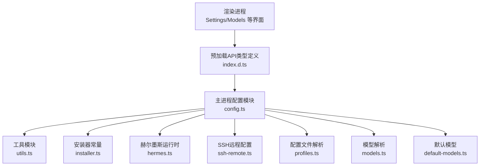
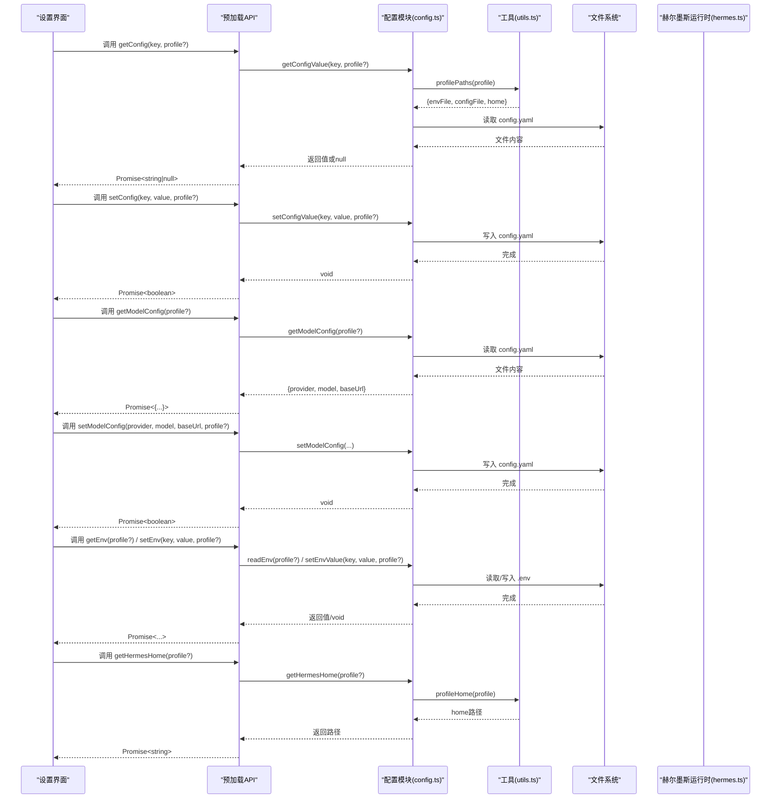
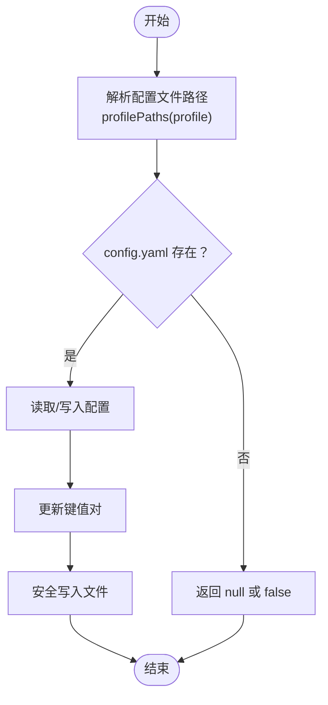
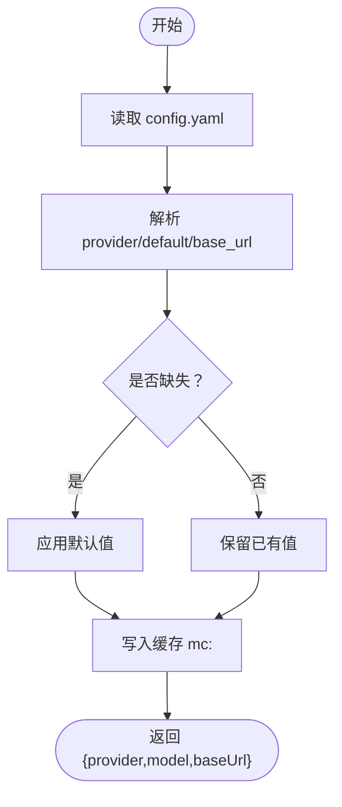
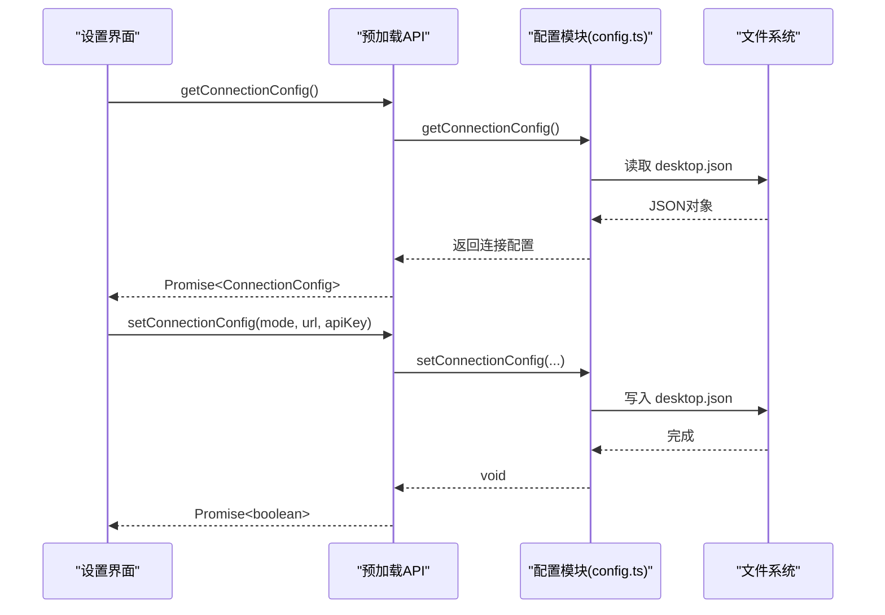
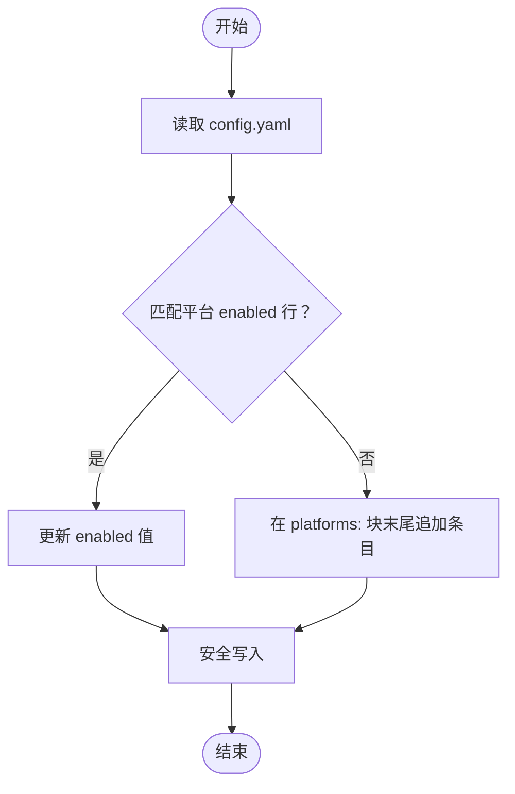
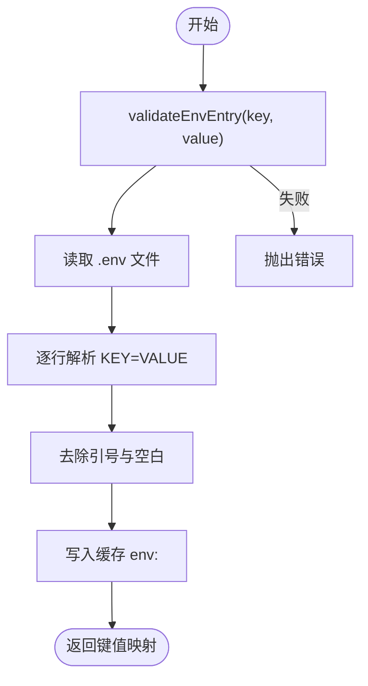
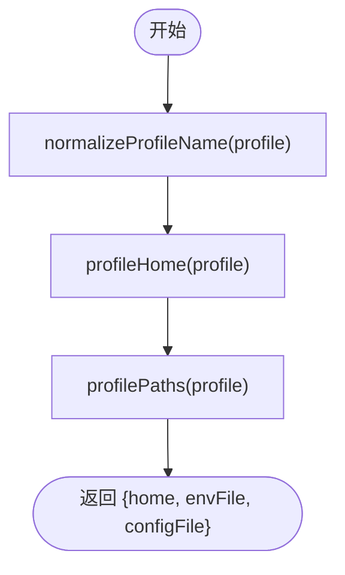
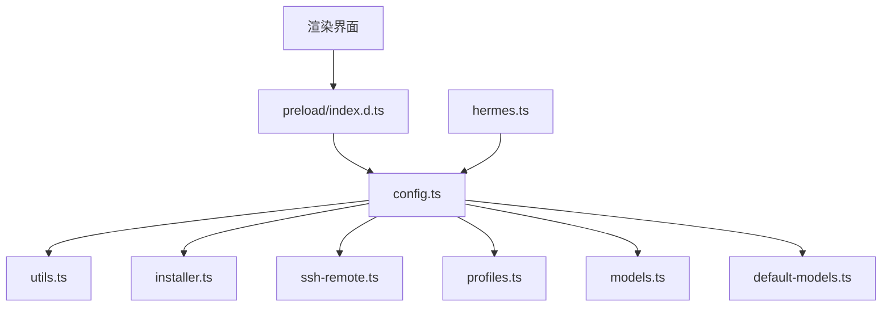

# 基础配置API

<cite>
**本文档引用的文件**
- [src/main/config.ts](file://src/main/config.ts)
- [src/main/utils.ts](file://src/main/utils.ts)
- [src/preload/index.d.ts](file://src/preload/index.d.ts)
- [src/main/hermes.ts](file://src/main/hermes.ts)
- [src/main/profiles.ts](file://src/main/profiles.ts)
- [src/main/ssh-remote.ts](file://src/main/ssh-remote.ts)
- [src/main/default-models.ts](file://src/main/default-models.ts)
- [src/main/models.ts](file://src/main/models.ts)
- [src/shared/i18n/config.ts](file://src/shared/i18n/config.ts)
</cite>

## 目录
1. [简介](#简介)
2. [项目结构](#项目结构)
3. [核心组件](#核心组件)
4. [架构总览](#架构总览)
5. [详细组件分析](#详细组件分析)
6. [依赖关系分析](#依赖关系分析)
7. [性能考虑](#性能考虑)
8. [故障排除指南](#故障排除指南)
9. [结论](#结论)
10. [附录](#附录)

## 简介
本文件系统性梳理桌面应用的基础配置API，重点覆盖以下接口与能力：
- 配置键值对读写：getConfig、setConfig
- 模型配置管理：getModelConfig、setModelConfig
- 连接模式配置：getConnectionConfig、setConnectionConfig、setSshConfig
- 平台开关配置：getPlatformEnabled、setPlatformEnabled
- 环境变量管理：getEnv、setEnv（含校验）
- 配置作用域与文件布局：基于“默认配置”与“按配置文件”的分层
- 配置验证、缓存与失效策略
- 配置同步与回滚（通过备份导入流程）

本指南面向开发者与高级用户，既提供代码级细节，也给出可操作的使用建议。

## 项目结构
基础配置API主要位于主进程模块中，配合预加载桥接类型定义，形成从渲染层到主进程的完整调用链路。关键文件与职责如下：
- 主进程配置模块：负责配置文件读写、缓存、校验与平台开关
- 工具模块：提供路径解析、正则转义、安全写入等通用能力
- 预加载类型定义：声明IPC接口契约，确保前端调用签名一致
- 赫尔墨斯运行时：消费配置决定HTTP API或CLI回退路径
- SSH远程配置：支持远端配置读写与校验
- 默认模型与模型解析：为模型配置提供默认值与解析逻辑

图表来源
- [src/preload/index.d.ts:51-106](file://src/preload/index.d.ts#L51-L106)
- [src/main/config.ts:1-440](file://src/main/config.ts#L1-L440)
- [src/main/utils.ts:1-85](file://src/main/utils.ts#L1-L85)
- [src/main/hermes.ts:1-887](file://src/main/hermes.ts#L1-L887)
- [src/main/ssh-remote.ts:562-597](file://src/main/ssh-remote.ts#L562-L597)
- [src/main/profiles.ts:1-200](file://src/main/profiles.ts#L1-L200)
- [src/main/models.ts:47-76](file://src/main/models.ts#L47-L76)
- [src/main/default-models.ts:1-47](file://src/main/default-models.ts#L1-L47)

章节来源
- [src/main/config.ts:1-440](file://src/main/config.ts#L1-L440)
- [src/main/utils.ts:1-85](file://src/main/utils.ts#L1-L85)
- [src/preload/index.d.ts:51-106](file://src/preload/index.d.ts#L51-L106)

## 核心组件
本节聚焦基础配置API的关键函数与数据结构，包括：
- 配置键值对读写：getConfigValue、setConfigValue
- 模型配置：getModelConfig、setModelConfig
- 连接配置：getConnectionConfig、setConnectionConfig、setSshConfig
- 平台开关：getPlatformEnabled、setPlatformEnabled
- 环境变量：readEnv、setEnvValue（含validateEnvEntry）
- 配置作用域：getHermesHome
- 缓存与失效：内存缓存（TTL）、前缀失效
- 错误处理与校验：非法字符、非法键名、非法配置名

章节来源
- [src/main/config.ts:180-305](file://src/main/config.ts#L180-L305)
- [src/main/config.ts:47-74](file://src/main/config.ts#L47-L74)
- [src/main/config.ts:317-394](file://src/main/config.ts#L317-L394)
- [src/main/config.ts:101-179](file://src/main/config.ts#L101-L179)
- [src/main/config.ts:303-305](file://src/main/config.ts#L303-L305)
- [src/main/utils.ts:46-66](file://src/main/utils.ts#L46-L66)

## 架构总览
下图展示基础配置API在系统中的位置与交互关系：

图表来源
- [src/preload/index.d.ts:51-106](file://src/preload/index.d.ts#L51-L106)
- [src/main/config.ts:180-305](file://src/main/config.ts#L180-L305)
- [src/main/config.ts:101-179](file://src/main/config.ts#L101-L179)
- [src/main/utils.ts:46-66](file://src/main/utils.ts#L46-L66)
- [src/main/hermes.ts:22-62](file://src/main/hermes.ts#L22-L62)

## 详细组件分析

### 配置键值对读写 API
- 接口名称：getConfig、setConfig
- 对应实现：getConfigValue、setConfigValue
- 功能说明：
  - 读取指定 profile 的 config.yaml 中的键值对，返回字符串或 null
  - 写入指定 profile 的 config.yaml 中的键值对，若不存在则忽略
- 参数与返回：
  - getConfig(key: string, profile?: string): Promise<string | null>
  - setConfig(key: string, value: string, profile?: string): Promise<boolean>
- 作用域与文件：
  - 使用 profilePaths 解析 config.yaml 路径
  - 支持默认配置与命名配置文件
- 读取优先级：
  - 以当前激活的 profile 为准；未指定时使用默认配置
- 验证与安全：
  - 写入时对值进行基本合法性检查（避免破坏YAML语法）
- 同步与回滚：
  - 通过备份导入流程实现配置回滚（见附录）

图表来源
- [src/main/config.ts:180-213](file://src/main/config.ts#L180-L213)
- [src/main/utils.ts:55-66](file://src/main/utils.ts#L55-L66)

章节来源
- [src/main/config.ts:180-213](file://src/main/config.ts#L180-L213)
- [src/main/utils.ts:55-66](file://src/main/utils.ts#L55-L66)
- [src/preload/index.d.ts:54-55](file://src/preload/index.d.ts#L54-L55)

### 模型配置管理 API
- 接口名称：getModelConfig、setModelConfig
- 对应实现：getModelConfig、setModelConfig
- 功能说明：
  - 读取 provider、default model、base_url 三元组
  - 写入时更新对应字段，并在需要时追加 base_url
  - 自动禁用智能路由（smart_model_routing），启用流式输出（streaming=true）
- 参数与返回：
  - getModelConfig(profile?: string): Promise<{ provider: string; model: string; baseUrl: string }>
  - setModelConfig(provider: string, model: string, baseUrl: string, profile?: string): Promise<boolean>
- 默认值与有效范围：
  - provider 默认 "auto"
  - model 默认 ""
  - baseUrl 默认 ""
- 缓存策略：
  - 以 "mc:<profile>" 为键缓存5秒，避免频繁IO

图表来源
- [src/main/config.ts:215-246](file://src/main/config.ts#L215-L246)
- [src/main/config.ts:248-301](file://src/main/config.ts#L248-L301)

章节来源
- [src/main/config.ts:215-246](file://src/main/config.ts#L215-L246)
- [src/main/config.ts:248-301](file://src/main/config.ts#L248-L301)
- [src/main/default-models.ts:20-47](file://src/main/default-models.ts#L20-L47)
- [src/main/models.ts:47-76](file://src/main/models.ts#L47-L76)

### 连接配置管理 API
- 接口名称：getConnectionConfig、setConnectionConfig、setSshConfig
- 对应实现：getConnectionConfig、setConnectionConfig
- 功能说明：
  - 读取连接模式（local/remote/ssh）与相关参数
  - 写入连接配置，支持SSH子配置
- 参数与返回：
  - getConnectionConfig(): Promise<{ mode, remoteUrl, apiKey, ssh }>
  - setConnectionConfig(mode, remoteUrl, apiKey?): Promise<boolean>
  - setSshConfig(...)：在预加载类型中声明
- 作用域与文件：
  - 连接配置存储于 desktop.json（位于 HERMES_HOME 下）
  - 通过 lazy getter 访问，避免循环依赖

图表来源
- [src/main/config.ts:47-74](file://src/main/config.ts#L47-L74)
- [src/main/config.ts:26-45](file://src/main/config.ts#L26-L45)
- [src/preload/index.d.ts:83-96](file://src/preload/index.d.ts#L83-L96)

章节来源
- [src/main/config.ts:47-74](file://src/main/config.ts#L47-L74)
- [src/main/config.ts:26-45](file://src/main/config.ts#L26-L45)
- [src/preload/index.d.ts:83-96](file://src/preload/index.d.ts#L83-L96)

### 平台开关配置 API
- 接口名称：getPlatformEnabled、setPlatformEnabled
- 对应实现：getPlatformEnabled、setPlatformEnabled
- 功能说明：
  - 读取/设置 platforms: 下各平台的 enabled 开关
  - 支持 telegram、discord、slack、whatsapp、signal
- 参数与返回：
  - getPlatformEnabled(profile?: string): Promise<Record<string, boolean>>
  - setPlatformEnabled(platform: string, enabled: boolean, profile?: string): Promise<boolean>
- 写入策略：
  - 若平台条目存在则更新，否则在 platforms: 块末尾追加

图表来源
- [src/main/config.ts:317-394](file://src/main/config.ts#L317-L394)

章节来源
- [src/main/config.ts:317-394](file://src/main/config.ts#L317-L394)

### 环境变量管理 API
- 接口名称：getEnv、setEnv
- 对应实现：readEnv、setEnvValue（含 validateEnvEntry）
- 功能说明：
  - 读取指定 profile 的 .env 文件，解析 KEY=VALUE 行
  - 设置环境变量值，支持单引号/双引号包裹与注释行跳过
- 参数与返回：
  - getEnv(profile?: string): Promise<Record<string, string>>
  - setEnv(key: string, value: string, profile?: string): Promise<boolean>
- 校验规则：
  - 键名必须满足字母、数字、下划线，且不能以数字开头
  - 值必须为单行字符串，不允许包含空字符、回车、换行
- 缓存策略：
  - 以 "env:<profile>" 为键缓存5秒，写入后按前缀失效

图表来源
- [src/main/config.ts:169-179](file://src/main/config.ts#L169-L179)
- [src/main/config.ts:101-179](file://src/main/config.ts#L101-L179)
- [src/main/config.ts:77-99](file://src/main/config.ts#L77-L99)

章节来源
- [src/main/config.ts:169-179](file://src/main/config.ts#L169-L179)
- [src/main/config.ts:101-179](file://src/main/config.ts#L101-L179)
- [src/main/config.ts:77-99](file://src/main/config.ts#L77-L99)

### 配置作用域与路径解析
- 接口名称：getHermesHome
- 对应实现：getHermesHome、profileHome、profilePaths
- 功能说明：
  - 返回指定 profile 的家目录路径
  - 默认配置指向 ~/.hermes；命名配置位于 ~/.hermes/profiles/<name>
- 关键点：
  - profile 名称校验：仅允许小写字母、数字、下划线、连字符，且不以连字符开头
  - 路径解析：统一通过 profilePaths 获取 .env 与 config.yaml 的标准位置

图表来源
- [src/main/utils.ts:29-66](file://src/main/utils.ts#L29-L66)

章节来源
- [src/main/utils.ts:29-66](file://src/main/utils.ts#L29-L66)
- [src/main/config.ts:303-305](file://src/main/config.ts#L303-L305)

### 配置验证、回滚与同步
- 配置验证：
  - 环境变量键名校验与值单行限制
  - SSH 远端配置写入前对非法字符进行拒绝
- 配置回滚：
  - 通过备份导入流程实现：先导出当前配置，再从归档恢复
- 配置同步：
  - 通过赫尔墨斯运行时自动注入 API server 配置（仅本地模式）
  - 会话缓存同步采用高效算法，避免二次方复杂度

章节来源
- [src/main/config.ts:169-179](file://src/main/config.ts#L169-L179)
- [src/main/ssh-remote.ts:581-597](file://src/main/ssh-remote.ts#L581-L597)
- [src/main/hermes.ts:127-147](file://src/main/hermes.ts#L127-L147)
- [src/main/hermes.ts:694-711](file://src/main/hermes.ts#L694-L711)

## 依赖关系分析
基础配置API的依赖关系如下：

图表来源
- [src/main/config.ts:1-440](file://src/main/config.ts#L1-L440)
- [src/main/utils.ts:1-85](file://src/main/utils.ts#L1-L85)
- [src/preload/index.d.ts:51-106](file://src/preload/index.d.ts#L51-L106)
- [src/main/hermes.ts:1-887](file://src/main/hermes.ts#L1-L887)
- [src/main/ssh-remote.ts:562-597](file://src/main/ssh-remote.ts#L562-L597)
- [src/main/profiles.ts:1-200](file://src/main/profiles.ts#L1-L200)
- [src/main/models.ts:47-76](file://src/main/models.ts#L47-L76)
- [src/main/default-models.ts:1-47](file://src/main/default-models.ts#L1-L47)

章节来源
- [src/main/config.ts:1-440](file://src/main/config.ts#L1-L440)
- [src/main/utils.ts:1-85](file://src/main/utils.ts#L1-L85)
- [src/preload/index.d.ts:51-106](file://src/preload/index.d.ts#L51-L106)

## 性能考虑
- 缓存策略：
  - 内存缓存（Map）+ TTL（5秒）用于高频读取（模型配置、环境变量）
  - 写入后按前缀失效，保证一致性
- IO优化：
  - safeWriteFile 在写入前确保父目录存在，避免ENOENT异常
  - 正则转义 escapeRegex 避免注入与错误匹配
- 复杂度控制：
  - 会话缓存同步采用线性时间复杂度，避免大规模数据下的二次方开销

章节来源
- [src/main/config.ts:77-99](file://src/main/config.ts#L77-L99)
- [src/main/config.ts:80-84](file://src/main/config.ts#L80-L84)
- [src/main/utils.ts:72-74](file://src/main/utils.ts#L72-L74)
- [src/main/hermes.ts:694-711](file://src/main/hermes.ts#L694-L711)

## 故障排除指南
- 环境变量设置失败：
  - 检查键名是否符合规则（字母、数字、下划线，不以数字开头）
  - 检查值是否包含非法字符（空字符、回车、换行）
- SSH 远端配置写入被拒绝：
  - 确认值不包含引号、反斜杠、换行符等破坏YAML的字符
- 配置读取为空：
  - 确认目标 profile 的 config.yaml 是否存在
  - 检查键名大小写与注释行是否影响匹配
- 连接配置无效：
  - 检查 desktop.json 是否存在且可解析
  - 确认连接模式与远程地址/密钥配置正确
- 配置回滚：
  - 使用备份导入功能进行回滚，确保备份文件完整

章节来源
- [src/main/config.ts:169-179](file://src/main/config.ts#L169-L179)
- [src/main/ssh-remote.ts:581-597](file://src/main/ssh-remote.ts#L581-L597)
- [src/main/config.ts:180-213](file://src/main/config.ts#L180-L213)
- [src/main/config.ts:47-74](file://src/main/config.ts#L47-L74)

## 结论
基础配置API围绕“配置文件 + 缓存 + 校验 + 作用域”的设计，提供了稳定、可扩展的配置管理能力。通过明确的读写接口、严格的输入校验与合理的缓存策略，既能满足日常使用，也能支撑多配置文件与SSH远端场景。建议在生产环境中结合备份导入流程进行配置回滚，并遵循键值命名规范以避免YAML解析问题。

## 附录

### API 参考与使用示例

- getConfig(key: string, profile?: string): Promise<string | null>
  - 功能：读取指定 profile 的 config.yaml 中的键值
  - 返回：字符串值或 null
  - 示例：读取默认配置中的某个键
  - 章节来源
    - [src/main/config.ts:180-192](file://src/main/config.ts#L180-L192)
    - [src/preload/index.d.ts:54-55](file://src/preload/index.d.ts#L54-L55)

- setConfig(key: string, value: string, profile?: string): Promise<boolean>
  - 功能：写入指定 profile 的 config.yaml 中的键值
  - 返回：是否成功
  - 示例：设置默认模型名称
  - 章节来源
    - [src/main/config.ts:194-213](file://src/main/config.ts#L194-L213)
    - [src/preload/index.d.ts:54-55](file://src/preload/index.d.ts#L54-L55)

- getModelConfig(profile?: string): Promise<{ provider: string; model: string; baseUrl: string }>
  - 功能：读取模型配置三元组
  - 返回：包含 provider、model、baseUrl 的对象
  - 示例：获取当前模型配置
  - 章节来源
    - [src/main/config.ts:215-246](file://src/main/config.ts#L215-L246)
    - [src/preload/index.d.ts:57-65](file://src/preload/index.d.ts#L57-L65)

- setModelConfig(provider: string, model: string, baseUrl: string, profile?: string): Promise<boolean>
  - 功能：写入模型配置，必要时追加 base_url 并调整相关开关
  - 返回：是否成功
  - 示例：设置自定义提供商与基础URL
  - 章节来源
    - [src/main/config.ts:248-301](file://src/main/config.ts#L248-L301)
    - [src/preload/index.d.ts:57-65](file://src/preload/index.d.ts#L57-L65)

- getEnv(profile?: string): Promise<Record<string, string>>
- setEnv(key: string, value: string, profile?: string): Promise<boolean>
  - 功能：读取/设置 .env 文件中的环境变量
  - 返回：读取返回键值映射；设置返回布尔值
  - 示例：设置 OPENAI_API_KEY
  - 章节来源
    - [src/main/config.ts:101-179](file://src/main/config.ts#L101-L179)
    - [src/preload/index.d.ts:52-56](file://src/preload/index.d.ts#L52-L56)

- getHermesHome(profile?: string): Promise<string>
  - 功能：获取指定 profile 的家目录路径
  - 返回：路径字符串
  - 示例：获取默认配置路径
  - 章节来源
    - [src/main/config.ts:303-305](file://src/main/config.ts#L303-L305)
    - [src/preload/index.d.ts](file://src/preload/index.d.ts#L56)

- getPlatformEnabled(profile?: string): Promise<Record<string, boolean>>
- setPlatformEnabled(platform: string, enabled: boolean, profile?: string): Promise<boolean>
  - 功能：读取/设置平台开关
  - 返回：布尔值
  - 示例：启用 Telegram 平台
  - 章节来源
    - [src/main/config.ts:317-394](file://src/main/config.ts#L317-L394)
    - [src/preload/index.d.ts:137-142](file://src/preload/index.d.ts#L137-L142)

- getConnectionConfig(): Promise<ConnectionConfig>
- setConnectionConfig(mode: "local" | "remote" | "ssh", remoteUrl: string, apiKey?: string): Promise<boolean>
- setSshConfig(...): Promise<boolean>
  - 功能：读取/设置连接配置（含SSH）
  - 返回：布尔值
  - 示例：设置远程模式与API密钥
  - 章节来源
    - [src/main/config.ts:47-74](file://src/main/config.ts#L47-L74)
    - [src/preload/index.d.ts:83-103](file://src/preload/index.d.ts#L83-L103)

### 配置项清单与默认值
- 模型配置（config.yaml）
  - provider: 字符串，默认 "auto"
  - default: 字符串，默认 ""
  - base_url: 字符串，默认 ""
  - 章节来源
    - [src/main/config.ts:229-242](file://src/main/config.ts#L229-L242)
    - [src/main/default-models.ts:20-47](file://src/main/default-models.ts#L20-L47)

- 连接配置（desktop.json）
  - connectionMode: "local" | "remote" | "ssh"
  - remoteUrl: 字符串
  - remoteApiKey: 字符串
  - ssh: 包含 host、port、username、keyPath、remotePort、localPort
  - 章节来源
    - [src/main/config.ts:47-74](file://src/main/config.ts#L47-L74)
    - [src/main/config.ts:26-45](file://src/main/config.ts#L26-L45)

- 环境变量（.env）
  - 键名规则：字母、数字、下划线，不以数字开头
  - 值规则：单行字符串，不含空字符、回车、换行
  - 章节来源
    - [src/main/config.ts:169-179](file://src/main/config.ts#L169-L179)
    - [src/main/config.ts:101-179](file://src/main/config.ts#L101-L179)

### 配置读取优先级与作用域
- 作用域顺序：命名配置 > 默认配置
- 文件优先级：.env > config.yaml > desktop.json
- 缓存优先级：内存缓存（TTL） > 文件系统
- 章节来源
  - [src/main/utils.ts:46-66](file://src/main/utils.ts#L46-L66)
  - [src/main/config.ts:77-99](file://src/main/config.ts#L77-L99)

### 配置验证与错误处理
- 键名校验：validateEnvEntry
- 值校验：禁止多行与特殊字符
- SSH写入校验：拒绝破坏YAML的字符
- 章节来源
  - [src/main/config.ts:169-179](file://src/main/config.ts#L169-L179)
  - [src/main/ssh-remote.ts:581-597](file://src/main/ssh-remote.ts#L581-L597)

### 配置同步与回滚
- 同步：赫尔墨斯运行时自动注入 API server 配置（本地模式）
- 回滚：通过备份导入流程实现
- 章节来源
  - [src/main/hermes.ts:127-147](file://src/main/hermes.ts#L127-L147)
  - [src/main/hermes.ts:694-711](file://src/main/hermes.ts#L694-L711)