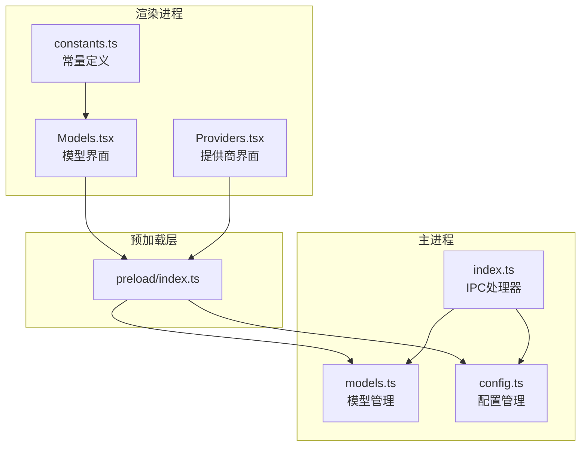
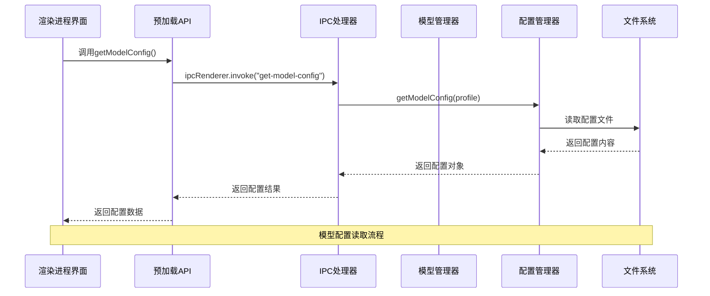
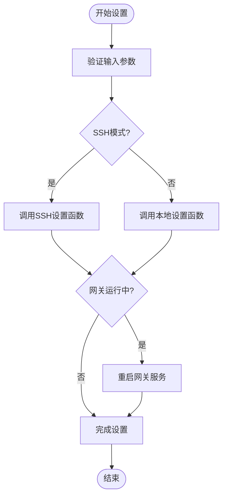
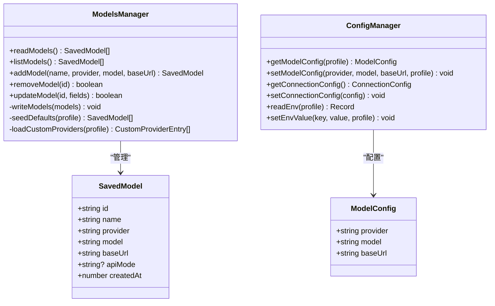
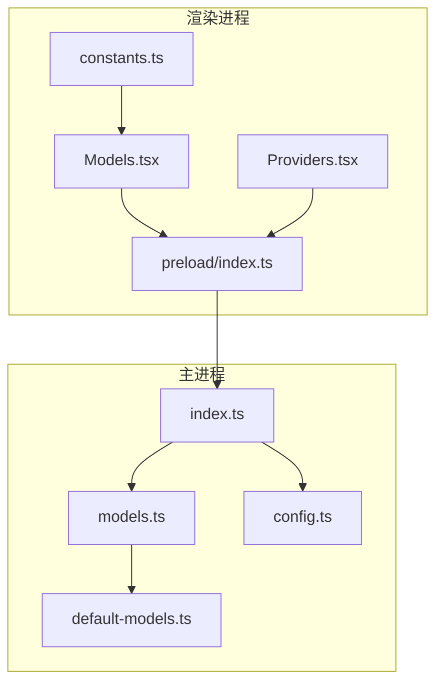
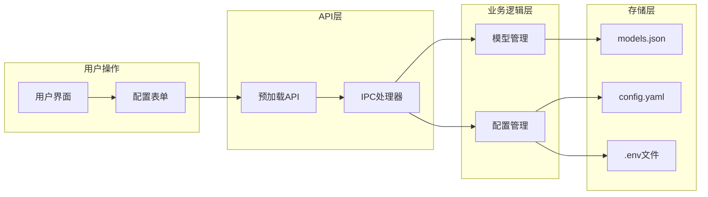

# 模型配置API

<cite>
**本文档引用的文件**
- [src/main/models.ts](file://src/main/models.ts)
- [src/main/config.ts](file://src/main/config.ts)
- [src/preload/index.ts](file://src/preload/index.ts)
- [src/renderer/src/screens/Models/Models.tsx](file://src/renderer/src/screens/Models/Models.tsx)
- [src/renderer/src/screens/Providers/Providers.tsx](file://src/renderer/src/screens/Providers/Providers.tsx)
- [src/renderer/src/constants.ts](file://src/renderer/src/constants.ts)
- [src/main/default-models.ts](file://src/main/default-models.ts)
- [src/main/index.ts](file://src/main/index.ts)
</cite>

## 目录
1. [简介](#简介)
2. [项目结构](#项目结构)
3. [核心组件](#核心组件)
4. [架构概览](#架构概览)
5. [详细组件分析](#详细组件分析)
6. [依赖关系分析](#依赖关系分析)
7. [性能考虑](#性能考虑)
8. [故障排除指南](#故障排除指南)
9. [结论](#结论)

## 简介

本文档详细介绍了Hermes桌面应用中的模型配置API系统。该系统提供了完整的模型管理功能，包括模型配置的获取、设置、列表查看、添加和删除操作。系统支持多种AI模型提供商，包括OpenRouter、Anthropic、OpenAI等主流服务，同时也支持本地自定义模型。

模型配置API采用Electron IPC架构设计，通过预加载脚本暴露给渲染进程，实现了安全的跨进程通信。系统还提供了模型库管理功能，允许用户保存和管理自己的模型配置。

## 项目结构

模型配置API系统主要分布在以下文件中：



**图表来源**
- [src/preload/index.ts:15-101](file://src/preload/index.ts#L15-L101)
- [src/main/models.ts:10-169](file://src/main/models.ts#L10-L169)
- [src/main/config.ts:215-301](file://src/main/config.ts#L215-L301)

**章节来源**
- [src/preload/index.ts:1-701](file://src/preload/index.ts#L1-L701)
- [src/main/models.ts:1-169](file://src/main/models.ts#L1-L169)
- [src/main/config.ts:1-440](file://src/main/config.ts#L1-L440)

## 核心组件

### 模型数据结构

系统定义了标准的模型配置数据结构：

| 字段名 | 类型 | 必填 | 描述 |
|--------|------|------|------|
| id | string | 是 | 模型唯一标识符 |
| name | string | 是 | 模型显示名称 |
| provider | string | 是 | 模型提供商标识符 |
| model | string | 是 | 具体模型ID |
| baseUrl | string | 否 | 自定义基础URL |
| apiMode | string | 否 | API模式配置 |
| createdAt | number | 是 | 创建时间戳 |

### 模型提供商支持

系统支持以下模型提供商：

| 提供商键 | 名称 | 特点 |
|----------|------|------|
| auto | 自动检测 | 智能选择最佳模型 |
| openrouter | OpenRouter | 支持200+模型的统一API |
| anthropic | Anthropic | Claude系列模型 |
| openai | OpenAI | GPT系列模型 |
| google | Google | Gemini系列模型 |
| xai | xAI | Grok系列模型 |
| nous | Nous | 分布式推理平台 |
| custom | 本地/自定义 | 本地部署或自定义API |

**章节来源**
- [src/main/models.ts:10-18](file://src/main/models.ts#L10-L18)
- [src/renderer/src/constants.ts:17-29](file://src/renderer/src/constants.ts#L17-L29)
- [src/main/default-models.ts:13-48](file://src/main/default-models.ts#L13-L48)

## 架构概览

模型配置API采用分层架构设计，确保了安全性、可维护性和扩展性：



**图表来源**
- [src/preload/index.ts:90-93](file://src/preload/index.ts#L90-L93)
- [src/main/index.ts:425-429](file://src/main/index.ts#L425-L429)
- [src/main/config.ts:215-246](file://src/main/config.ts#L215-L246)

**章节来源**
- [src/main/index.ts:425-471](file://src/main/index.ts#L425-L471)
- [src/preload/index.ts:90-101](file://src/preload/index.ts#L90-L101)

## 详细组件分析

### getModelConfig API

#### 功能描述
获取当前活动的模型配置信息，包括提供商、模型ID和基础URL。

#### 参数说明
- `profile?: string` - 可选的配置文件路径，用于多配置文件场景

#### 返回值
```typescript
{
  provider: string;  // 模型提供商
  model: string;     // 模型ID
  baseUrl: string;   // 基础URL
}
```

#### 实现细节
- 使用内存缓存机制，缓存有效期5秒
- 支持SSH远程模式下的配置读取
- 默认值：provider="auto"，model=""，baseUrl=""

**章节来源**
- [src/preload/index.ts:90-93](file://src/preload/index.ts#L90-L93)
- [src/main/index.ts:425-429](file://src/main/index.ts#L425-L429)
- [src/main/config.ts:215-246](file://src/main/config.ts#L215-L246)

### setModelConfig API

#### 功能描述
设置模型配置并自动重启网关服务以应用新配置。

#### 参数说明
- `provider: string` - 模型提供商标识符
- `model: string` - 模型ID
- `baseUrl: string` - 基础URL
- `profile?: string` - 可选的配置文件路径

#### 返回值
- `Promise<boolean>` - 设置是否成功

#### 实现逻辑


**图表来源**
- [src/main/index.ts:431-471](file://src/main/index.ts#L431-L471)
- [src/main/config.ts:248-301](file://src/main/config.ts#L248-L301)

**章节来源**
- [src/preload/index.ts:95-101](file://src/preload/index.ts#L95-L101)
- [src/main/index.ts:431-471](file://src/main/index.ts#L431-L471)

### listModels API

#### 功能描述
列出所有已保存的模型配置。

#### 返回值
- `Promise<SavedModel[]>` - 模型配置数组

#### 实现特性
- 如果模型文件不存在，自动播种默认模型
- 支持从配置文件加载自定义提供商
- 包含创建时间戳信息

**章节来源**
- [src/preload/index.ts:439-448](file://src/preload/index.ts#L439-L448)
- [src/main/models.ts:116-121](file://src/main/models.ts#L116-L121)

### addModel API

#### 功能描述
添加新的模型配置到模型库中。

#### 参数说明
- `name: string` - 模型显示名称
- `provider: string` - 模型提供商
- `model: string` - 模型ID
- `baseUrl: string` - 基础URL

#### 返回值
- `Promise<SavedModel>` - 新创建的模型配置

#### 去重机制
- 基于 `model + provider` 组合进行去重检查
- 如果相同模型已存在，直接返回现有配置

**章节来源**
- [src/preload/index.ts:450-462](file://src/preload/index.ts#L450-L462)
- [src/main/models.ts:123-148](file://src/main/models.ts#L123-L148)

### 模型管理器类图



**图表来源**
- [src/main/models.ts:10-169](file://src/main/models.ts#L10-L169)
- [src/main/config.ts:215-301](file://src/main/config.ts#L215-L301)

**章节来源**
- [src/main/models.ts:10-169](file://src/main/models.ts#L10-L169)
- [src/main/config.ts:215-301](file://src/main/config.ts#L215-L301)

## 依赖关系分析

### 模块间依赖



**图表来源**
- [src/renderer/src/screens/Models/Models.tsx:1-366](file://src/renderer/src/screens/Models/Models.tsx#L1-L366)
- [src/renderer/src/screens/Providers/Providers.tsx:36-82](file://src/renderer/src/screens/Providers/Providers.tsx#L36-L82)
- [src/main/index.ts:89-89](file://src/main/index.ts#L89-L89)

### 数据流分析



**图表来源**
- [src/preload/index.ts:15-101](file://src/preload/index.ts#L15-L101)
- [src/main/models.ts:8-31](file://src/main/models.ts#L8-L31)
- [src/main/config.ts:26-45](file://src/main/config.ts#L26-L45)

**章节来源**
- [src/main/index.ts:89-89](file://src/main/index.ts#L89-L89)
- [src/preload/index.ts:15-101](file://src/preload/index.ts#L15-L101)

## 性能考虑

### 缓存策略
- **内存缓存**：模型配置使用5秒TTL的内存缓存，减少重复读取开销
- **文件监控**：配置变更时自动失效相关缓存条目

### 异步处理
- 所有IPC调用都是异步的，避免阻塞UI线程
- 大文件读写操作在后台线程执行

### 内存优化
- 模型列表采用延迟加载策略
- 环境变量读取支持增量解析

## 故障排除指南

### 常见问题及解决方案

#### 模型配置无法保存
1. **检查文件权限**：确保 `.hermes` 目录具有写入权限
2. **验证配置格式**：确认 `config.yaml` 格式正确
3. **检查磁盘空间**：确保有足够的磁盘空间

#### 模型切换失败
1. **重启网关服务**：执行 `restartGateway()` 重新启动服务
2. **检查网络连接**：验证API密钥和网络连通性
3. **清除缓存**：调用 `invalidateCache()` 清除配置缓存

#### 模型库为空
1. **检查默认模型**：确认 `default-models.ts` 中的默认模型配置
2. **手动添加模型**：使用 `addModel()` API 添加自定义模型
3. **重建模型文件**：删除 `models.json` 文件让系统重新生成

**章节来源**
- [src/main/config.ts:76-99](file://src/main/config.ts#L76-L99)
- [src/main/models.ts:77-114](file://src/main/models.ts#L77-L114)

## 结论

Hermes桌面应用的模型配置API系统提供了完整、安全且高效的模型管理功能。通过清晰的分层架构设计和严格的类型定义，系统确保了良好的可维护性和扩展性。

关键特性包括：
- **多提供商支持**：覆盖主流AI服务提供商
- **安全的IPC通信**：通过预加载脚本提供受控访问
- **智能缓存机制**：提升性能和用户体验
- **完善的错误处理**：提供详细的故障诊断信息
- **灵活的配置管理**：支持本地和SSH远程模式

该API系统为开发者提供了强大的模型配置能力，同时保持了简洁易用的接口设计，适合各种规模的应用场景。