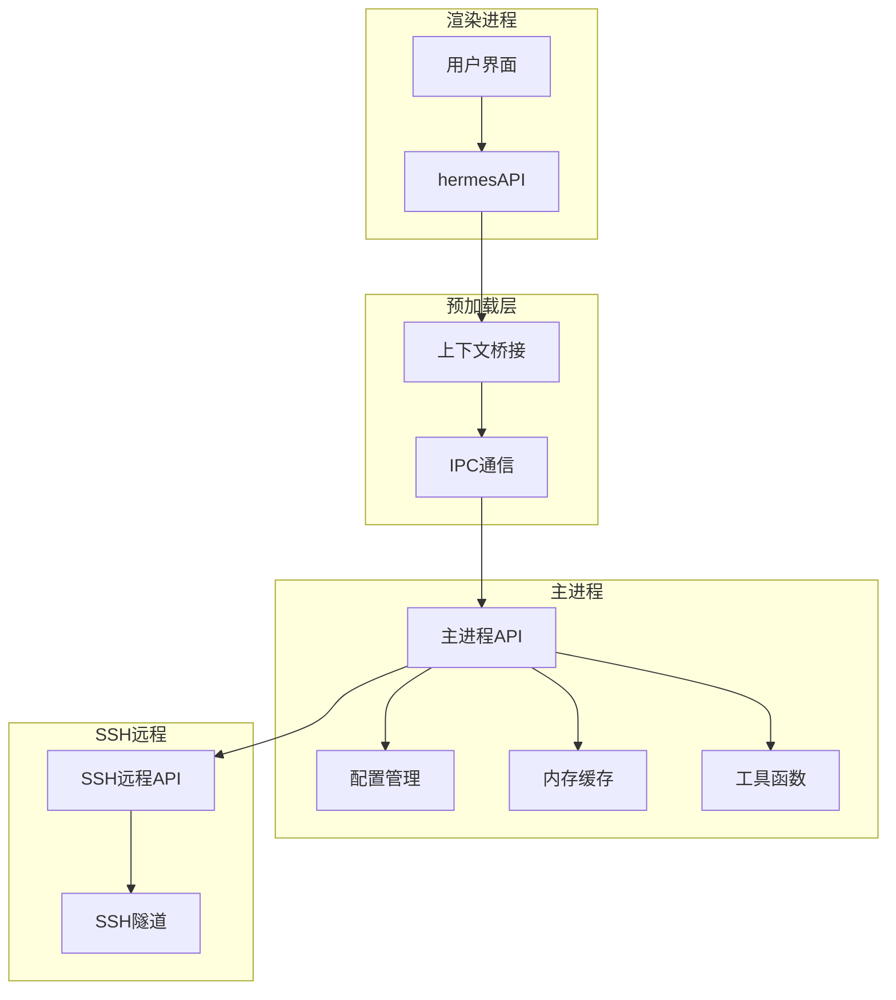
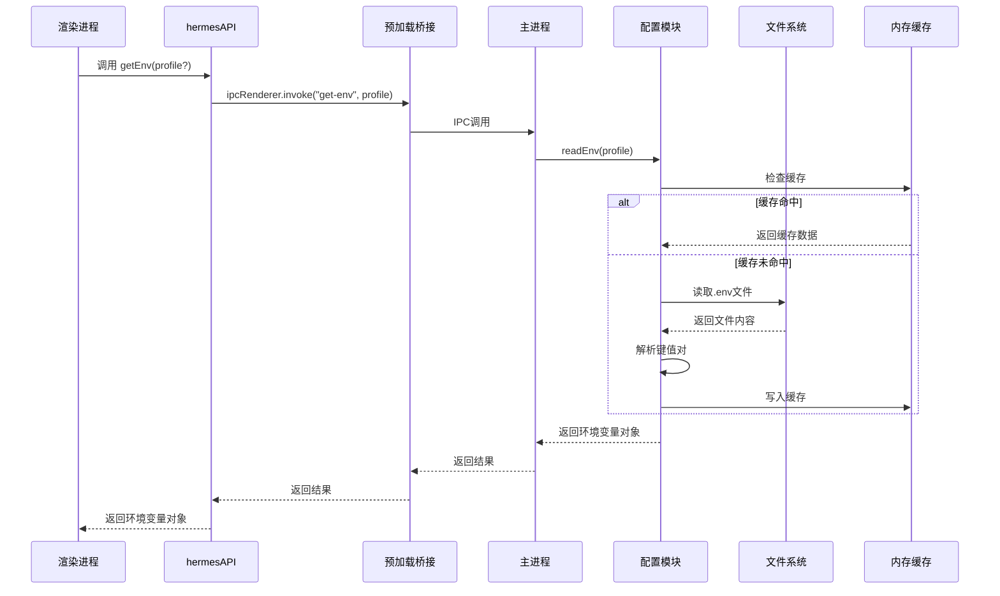
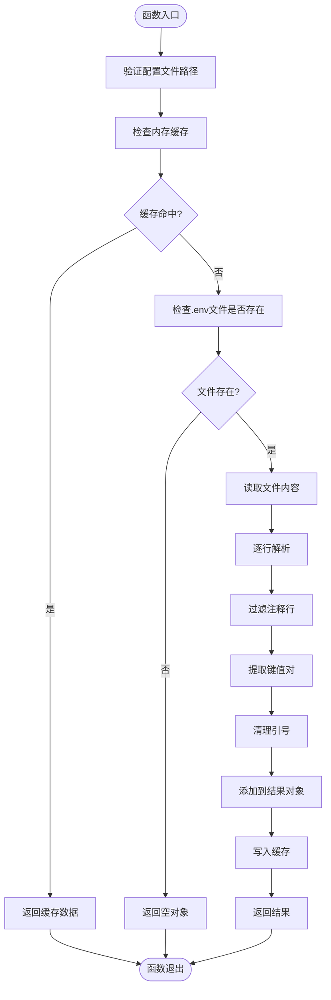
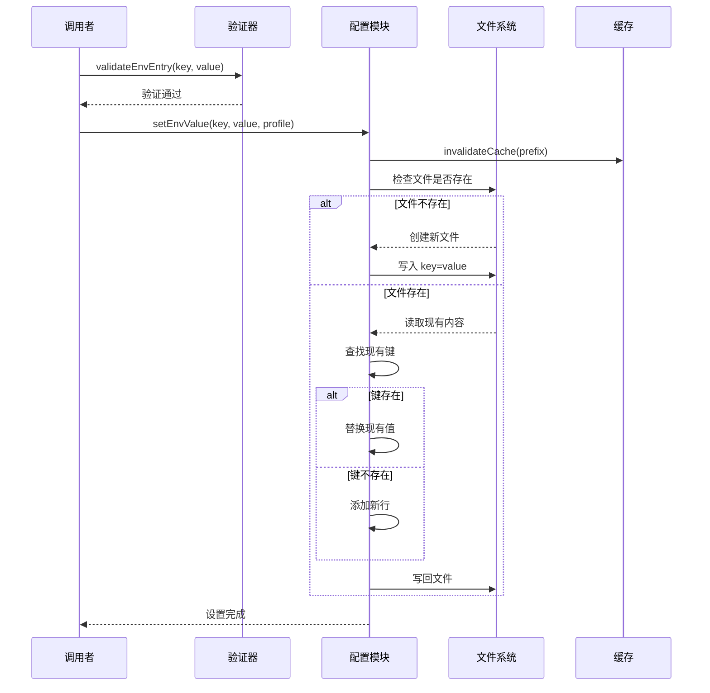
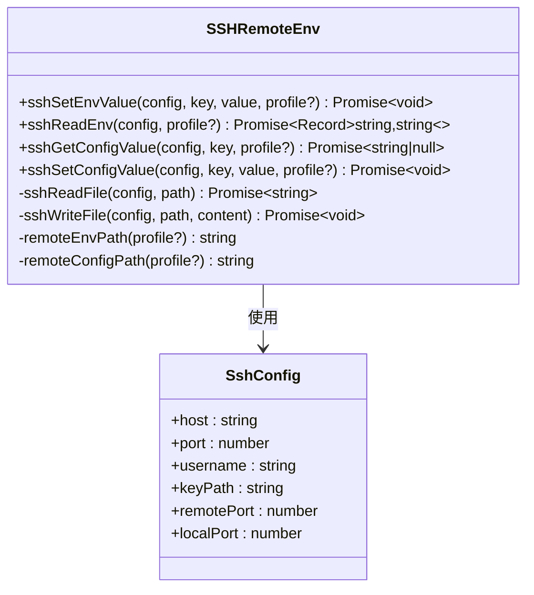
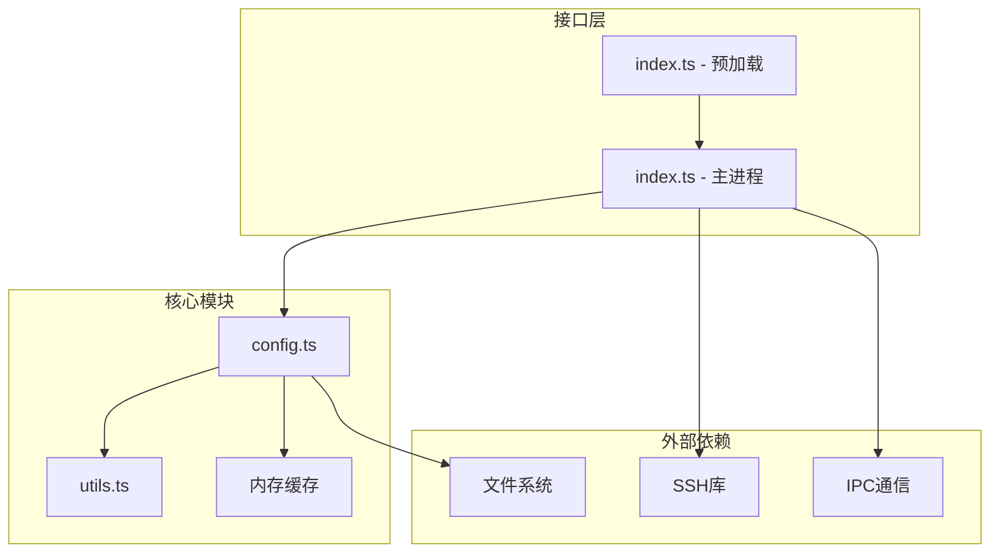
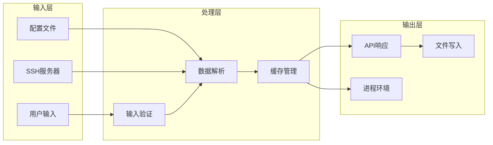

# 环境变量API

<cite>
**本文档引用的文件**
- [config.ts](file://src/main/config.ts)
- [index.ts](file://src/main/index.ts)
- [index.ts](file://src/preload/index.ts)
- [ssh-remote.ts](file://src/main/ssh-remote.ts)
- [utils.ts](file://src/main/utils.ts)
- [hermes.ts](file://src/main/hermes.ts)
- [env-validation.test.ts](file://tests/env-validation.test.ts)
</cite>

## 目录
1. [简介](#简介)
2. [项目结构](#项目结构)
3. [核心组件](#核心组件)
4. [架构概览](#架构概览)
5. [详细组件分析](#详细组件分析)
6. [依赖关系分析](#依赖关系分析)
7. [性能考量](#性能考量)
8. [故障排除指南](#故障排除指南)
9. [结论](#结论)

## 简介
本文件详细记录了Hermes Desktop应用中的环境变量API，包括getEnv、setEnv等环境变量管理接口。文档解释了环境变量的作用域机制、继承关系和覆盖规则，并提供了最佳实践、安全考虑和性能优化建议。同时，文档涵盖了环境变量的动态更新、实时生效和配置热加载的实现细节，并为每个API提供了完整的参数说明、作用域范围和实际使用场景示例。

## 项目结构
环境变量API在项目中通过多层架构实现：
- 主进程API：提供本地环境变量读写能力
- 预加载桥接：向渲染进程暴露安全的API接口
- SSH远程支持：支持远程服务器上的环境变量管理
- 缓存机制：提升读取性能并支持缓存失效



**图表来源**
- [index.ts:372-398](file://src/main/index.ts#L372-L398)
- [index.ts:75-79](file://src/preload/index.ts#L75-L79)
- [config.ts:101-167](file://src/main/config.ts#L101-L167)

**章节来源**
- [config.ts:1-440](file://src/main/config.ts#L1-L440)
- [index.ts:1-800](file://src/main/index.ts#L1-L800)
- [index.ts:1-701](file://src/preload/index.ts#L1-L701)

## 核心组件
环境变量API由以下核心组件构成：

### 1. 本地环境变量管理
- `readEnv(profile?: string)`: 读取指定配置文件中的环境变量
- `setEnvValue(key: string, value: string, profile?: string)`: 设置环境变量值
- `validateEnvEntry(key: string, value: string)`: 验证环境变量键值对

### 2. SSH远程环境变量管理
- `sshSetEnvValue(config, key, value, profile?)`: 远程设置环境变量
- `sshReadEnv(config, profile?)`: 远程读取环境变量

### 3. 缓存与验证机制
- 内存缓存（5秒TTL）：避免频繁文件I/O操作
- 键名验证：确保符合环境变量命名规范
- 值验证：防止多行字符串注入

**章节来源**
- [config.ts:79-179](file://src/main/config.ts#L79-L179)
- [ssh-remote.ts:541-567](file://src/main/ssh-remote.ts#L541-L567)

## 架构概览
环境变量API采用分层架构设计，确保安全性、可扩展性和性能：



**图表来源**
- [index.ts:75-76](file://src/preload/index.ts#L75-L76)
- [index.ts:372-376](file://src/main/index.ts#L372-L376)
- [config.ts:101-132](file://src/main/config.ts#L101-L132)

## 详细组件分析

### 环境变量读取器（readEnv）
readEnv函数负责从指定配置文件中读取环境变量，实现了智能解析和缓存机制。



**图表来源**
- [config.ts:101-132](file://src/main/config.ts#L101-L132)

**API参数说明**
- `profile?: string`: 配置文件名，支持"default"或自定义名称
- 返回值: `Record<string, string>` - 环境变量键值对映射

**作用域范围**
- 默认作用域：`~/.hermes/.env`
- 命名配置文件：`~/.hermes/profiles/{name}/.env`
- 支持相对路径解析，防止路径遍历攻击

**章节来源**
- [config.ts:101-132](file://src/main/config.ts#L101-L132)
- [utils.ts:55-66](file://src/main/utils.ts#L55-L66)

### 环境变量设置器（setEnvValue）
setEnvValue函数提供安全的环境变量写入功能，包含完整的输入验证和文件操作。



**图表来源**
- [config.ts:134-167](file://src/main/config.ts#L134-L167)
- [config.ts:169-179](file://src/main/config.ts#L169-L179)

**API参数说明**
- `key: string`: 环境变量名称，必须符合命名规范
- `value: string`: 环境变量值，必须为单行字符串
- `profile?: string`: 可选的配置文件名

**验证规则**
- 键名必须匹配正则表达式：`^[A-Za-z_][A-Za-z0-9_]*$`
- 值不能包含控制字符：`\0`, `\r`, `\n`
- 支持引号包裹的值，自动去除引号

**章节来源**
- [config.ts:134-179](file://src/main/config.ts#L134-L179)
- [env-validation.test.ts:30-75](file://tests/env-validation.test.ts#L30-L75)

### SSH远程环境变量管理
SSH远程环境变量管理提供了跨网络的安全环境变量操作能力。



**图表来源**
- [ssh-remote.ts:541-567](file://src/main/ssh-remote.ts#L541-L567)
- [ssh-remote.ts:569-597](file://src/main/ssh-remote.ts#L569-L597)

**章节来源**
- [ssh-remote.ts:541-597](file://src/main/ssh-remote.ts#L541-L597)

### 缓存机制与性能优化
环境变量API实现了智能缓存机制来提升性能：

```mermaid
graph LR
subgraph "缓存策略"
TTL[5秒TTL]
Prefix[前缀缓存键]
Invalidate[批量失效]
end
subgraph "缓存键格式"
EnvKey[env:{profile}]
McKey[mc:{profile}]
end
subgraph "失效触发"
SetEnv[setEnvValue调用]
SetConfig[setConfigValue调用]
ModelChange[模型配置变更]
end
TTL --> Prefix
Prefix --> Invalidate
EnvKey --> Invalidate
McKey --> Invalidate
SetEnv --> Invalidate
SetConfig --> Invalidate
ModelChange --> Invalidate
```

**图表来源**
- [config.ts:77-99](file://src/main/config.ts#L77-L99)
- [config.ts:141-142](file://src/main/config.ts#L141-L142)

**章节来源**
- [config.ts:77-99](file://src/main/config.ts#L77-L99)

## 依赖关系分析

### 组件耦合度
环境变量API具有良好的内聚性和低耦合性：



**图表来源**
- [index.ts:68-81](file://src/main/index.ts#L68-L81)
- [index.ts:4-13](file://src/preload/index.ts#L4-L13)

**章节来源**
- [index.ts:68-81](file://src/main/index.ts#L68-L81)
- [index.ts:4-13](file://src/preload/index.ts#L4-L13)

### 数据流分析
环境变量数据在系统中的流转过程：



**图表来源**
- [config.ts:169-179](file://src/main/config.ts#L169-L179)
- [hermes.ts:734-739](file://src/main/hermes.ts#L734-L739)

## 性能考量

### 缓存策略
- **TTL设置**：5秒缓存时间平衡了实时性和性能
- **前缀索引**：按配置文件类型区分缓存键
- **批量失效**：写操作时统一清理相关缓存

### I/O优化
- **延迟读取**：仅在需要时才访问文件系统
- **增量更新**：修改现有文件而非重建
- **目录预创建**：自动创建必要的目录结构

### 安全优化
- **输入验证**：双重验证确保数据安全
- **路径限制**：严格的路径解析防止越权访问
- **最小权限**：仅授予必要的文件访问权限

## 故障排除指南

### 常见问题诊断

**问题1：环境变量不生效**
- 检查配置文件路径是否正确
- 验证键名是否符合命名规范
- 确认缓存是否需要刷新

**问题2：SSH连接失败**
- 验证SSH配置参数
- 检查网络连通性
- 确认远程文件权限

**问题3：缓存异常**
- 手动清除缓存
- 检查TTL设置
- 验证缓存键格式

### 调试技巧
- 启用详细的日志记录
- 使用单元测试验证功能
- 监控文件系统访问模式

**章节来源**
- [env-validation.test.ts:20-75](file://tests/env-validation.test.ts#L20-L75)

## 结论
Hermes Desktop的环境变量API设计体现了现代桌面应用的最佳实践：

1. **安全性优先**：完整的输入验证和路径限制
2. **性能优化**：智能缓存和高效的文件操作
3. **可扩展性**：支持本地和远程两种模式
4. **易用性**：简洁的API接口和清晰的错误处理

该API为开发者提供了可靠、安全且高性能的环境变量管理解决方案，支持从简单的本地开发到复杂的分布式部署场景。