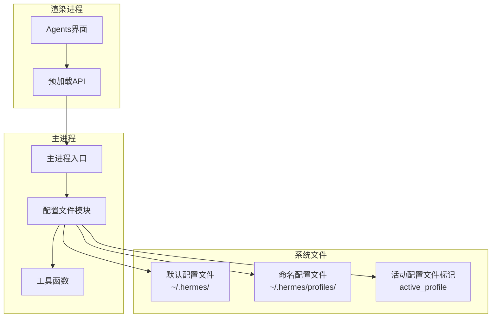
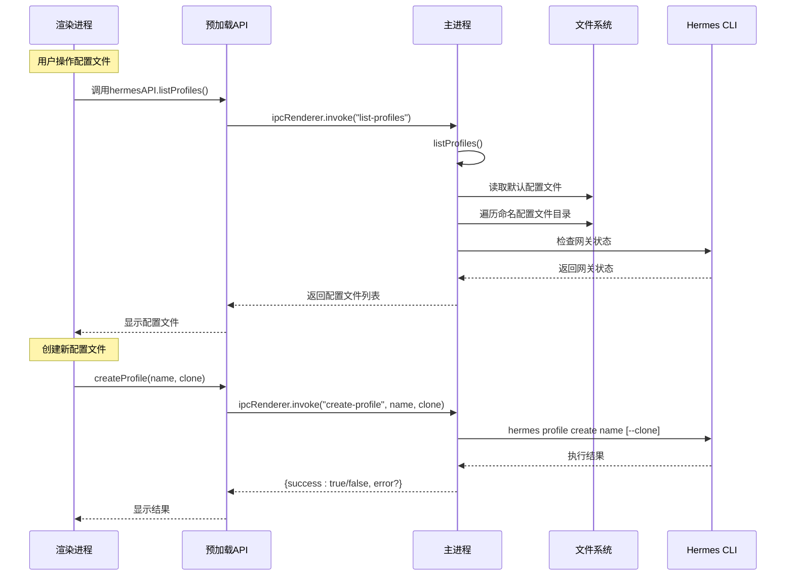
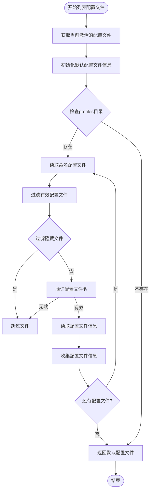
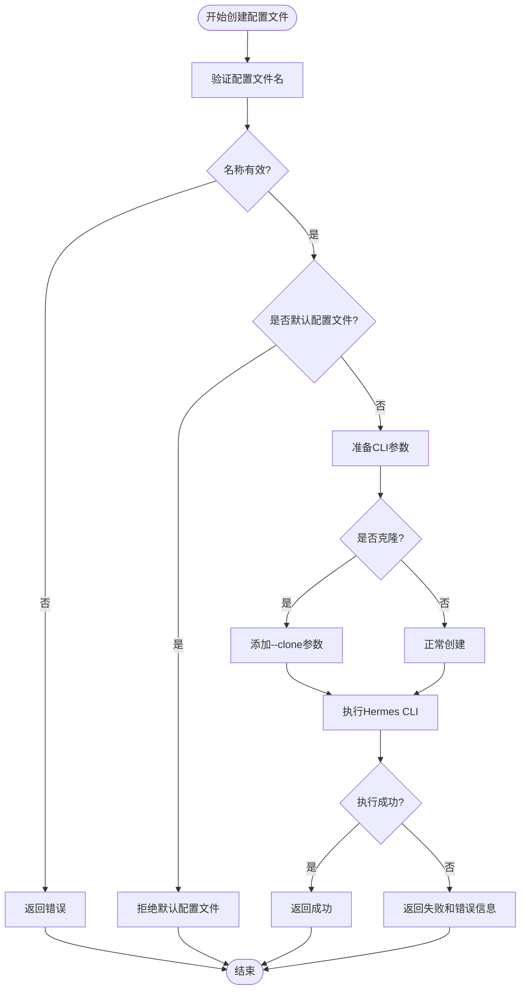
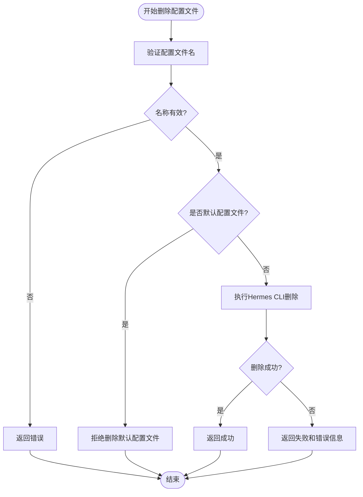
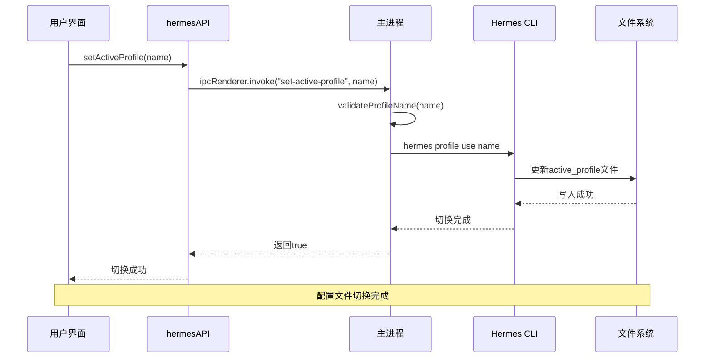
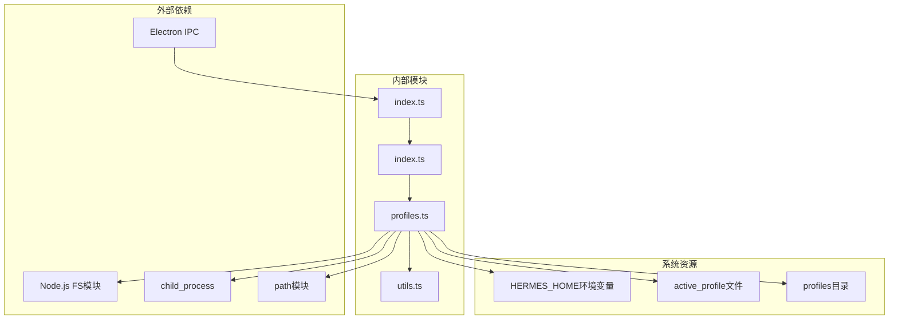

# 用户配置文件API

<cite>
**本文档引用的文件**
- [profiles.ts](file://src/main/profiles.ts)
- [index.ts](file://src/preload/index.ts)
- [index.ts](file://src/main/index.ts)
- [utils.ts](file://src/main/utils.ts)
- [profiles.test.ts](file://tests/profiles.test.ts)
- [profile-validation.test.ts](file://tests/profile-validation.test.ts)
- [Agents.tsx](file://src/renderer/src/screens/Agents/Agents.tsx)
</cite>

## 目录
1. [简介](#简介)
2. [项目结构](#项目结构)
3. [核心组件](#核心组件)
4. [架构概览](#架构概览)
5. [详细组件分析](#详细组件分析)
6. [依赖关系分析](#依赖关系分析)
7. [性能考虑](#性能考虑)
8. [故障排除指南](#故障排除指南)
9. [结论](#结论)

## 简介

用户配置文件API是Hermes桌面应用的核心功能之一，用于管理系统中的多个配置文件（Profiles）。该API提供了完整的配置文件生命周期管理能力，包括列表查看、创建、删除和激活等功能。

配置文件系统支持两种类型的配置文件：
- **默认配置文件**：位于`~/.hermes/`目录下，作为系统的主配置
- **命名配置文件**：位于`~/.hermes/profiles/`目录下的子目录，用于隔离不同的工作环境

该系统采用Electron IPC架构，通过预加载脚本暴露给渲染进程，同时在主进程中执行实际的操作。

## 项目结构

用户配置文件API涉及以下关键文件和模块：

**图表来源**
- [profiles.ts:1-284](file://src/main/profiles.ts#L1-L284)
- [index.ts:704-723](file://src/main/index.ts#L704-L723)

**章节来源**
- [profiles.ts:18-193](file://src/main/profiles.ts#L18-L193)
- [index.ts:704-723](file://src/main/index.ts#L704-L723)

## 核心组件

### 配置文件信息模型

配置文件API的核心数据结构是`ProfileInfo`接口，它描述了配置文件的完整状态：

| 字段名 | 类型 | 描述 | 示例值 |
|--------|------|------|--------|
| name | string | 配置文件名称 | "default" 或 "work" |
| path | string | 配置文件路径 | "~/.hermes/" 或 "~/.hermes/profiles/work" |
| isDefault | boolean | 是否为默认配置文件 | true 或 false |
| isActive | boolean | 是否为当前激活的配置文件 | true 或 false |
| model | string | 默认模型名称 | "gpt-4o" 或空字符串 |
| provider | string | 模型提供商 | "openai" 或 "auto" |
| hasEnv | boolean | 是否存在.env文件 | true 或 false |
| hasSoul | boolean | 是否存在SOUL.md文件 | true 或 false |
| skillCount | number | 技能数量 | 0, 5, 12等 |
| gatewayRunning | boolean | 网关是否运行 | true 或 false |

### 主要API接口

配置文件API提供四个核心接口：

1. **listProfiles()** - 列出所有配置文件
2. **createProfile(name, clone)** - 创建新配置文件
3. **deleteProfile(name)** - 删除指定配置文件
4. **setActiveProfile(name)** - 设置激活的配置文件

**章节来源**
- [profiles.ts:20-31](file://src/main/profiles.ts#L20-L31)
- [profiles.ts:111-193](file://src/main/profiles.ts#L111-L193)

## 架构概览

用户配置文件API采用分层架构设计，确保安全性和可维护性：

**图表来源**
- [index.ts:273-301](file://src/preload/index.ts#L273-L301)
- [index.ts:704-723](file://src/main/index.ts#L704-L723)
- [profiles.ts:195-227](file://src/main/profiles.ts#L195-L227)

## 详细组件分析

### 配置文件列表管理

`listProfiles()`函数负责收集和整理所有可用的配置文件信息：

**图表来源**
- [profiles.ts:111-193](file://src/main/profiles.ts#L111-L193)

#### 配置文件发现机制

系统采用智能的配置文件发现策略：

1. **默认配置文件**：始终位于`~/.hermes/`根目录
2. **命名配置文件**：位于`~/.hermes/profiles/`子目录
3. **文件过滤**：自动忽略隐藏文件和无效目录
4. **内容检测**：动态检测.env、SOUL.md、技能等文件的存在

**章节来源**
- [profiles.ts:111-193](file://src/main/profiles.ts#L111-L193)
- [profiles.test.ts:49-121](file://tests/profiles.test.ts#L49-L121)

### 配置文件创建机制

`createProfile()`函数实现了配置文件的创建和克隆功能：

**图表来源**
- [profiles.ts:195-227](file://src/main/profiles.ts#L195-L227)

#### 克隆机制

当启用克隆模式时，新配置文件会复制源配置文件的所有内容：

- 复制.env环境变量文件
- 复制config.yaml配置文件  
- 复制技能目录结构
- 继承SOUL.md个人档案

**章节来源**
- [profiles.ts:195-227](file://src/main/profiles.ts#L195-L227)
- [profiles.test.ts:135-142](file://tests/profiles.test.ts#L135-L142)

### 配置文件删除保护

`deleteProfile()`函数实现了严格的删除保护机制：

**图表来源**
- [profiles.ts:229-261](file://src/main/profiles.ts#L229-L261)

#### 删除保护策略

系统实施多重保护措施防止意外删除：

1. **默认配置文件保护**：禁止删除默认配置文件
2. **名称验证**：确保配置文件名符合安全规范
3. **CLI执行确认**：通过Hermes CLI执行实际删除操作
4. **自动回退**：删除后自动切换到默认配置文件

**章节来源**
- [profiles.ts:229-261](file://src/main/profiles.ts#L229-L261)
- [profiles.test.ts:79-86](file://tests/profiles.test.ts#L79-L86)

### 配置文件切换逻辑

`setActiveProfile()`函数负责配置文件的激活和切换：

**图表来源**
- [profiles.ts:263-283](file://src/main/profiles.ts#L263-L283)
- [index.ts:720-723](file://src/main/index.ts#L720-L723)

#### 切换验证机制

系统在切换配置文件前执行严格验证：

1. **名称格式验证**：确保配置文件名符合规范
2. **存在性检查**：验证目标配置文件确实存在
3. **权限检查**：确保有足够的权限进行切换
4. **状态同步**：更新系统范围的活动配置文件标记

**章节来源**
- [profiles.ts:263-283](file://src/main/profiles.ts#L263-L283)
- [utils.ts:25-39](file://src/main/utils.ts#L25-L39)

### 数据迁移和冲突解决

配置文件系统内置了智能的数据迁移和冲突解决机制：

#### 自动迁移策略

1. **文件结构迁移**：自动将旧格式的配置文件迁移到新格式
2. **配置项升级**：自动升级过时的配置项到最新格式
3. **兼容性处理**：保持向后兼容性，支持混合版本共存

#### 冲突解决机制

1. **优先级规则**：明确的配置项优先级顺序
2. **合并策略**：智能合并冲突的配置项
3. **备份保留**：在冲突解决前自动创建备份

## 依赖关系分析

用户配置文件API的依赖关系图展示了各组件之间的交互：

**图表来源**
- [profiles.ts:1-16](file://src/main/profiles.ts#L1-L16)
- [index.ts:273-301](file://src/preload/index.ts#L273-L301)

### 组件耦合度分析

配置文件API展现了良好的模块化设计：

- **高内聚**：相关功能集中在profiles.ts模块中
- **低耦合**：通过IPC接口与渲染进程通信
- **清晰边界**：预加载脚本、主进程和配置文件模块职责分明

**章节来源**
- [profiles.ts:1-284](file://src/main/profiles.ts#L1-L284)
- [index.ts:273-301](file://src/preload/index.ts#L273-L301)

## 性能考虑

### 异步操作优化

配置文件API采用了多项性能优化策略：

1. **并行文件操作**：使用Promise.all()并行读取多个配置文件信息
2. **延迟加载**：仅在需要时才读取详细的配置文件内容
3. **缓存机制**：避免重复的文件系统访问

### 内存管理

系统实现了高效的内存管理：

- **流式处理**：大文件读取采用流式方式
- **及时释放**：异步操作完成后及时释放内存
- **垃圾回收**：合理使用JavaScript垃圾回收机制

## 故障排除指南

### 常见问题及解决方案

#### 配置文件名验证失败

**问题症状**：创建或设置配置文件时返回"名称无效"错误

**可能原因**：
- 配置文件名包含不允许的字符
- 配置文件名以连字符开头
- 配置文件名包含空格或其他特殊字符

**解决方案**：
- 使用小写字母、数字和下划线的组合
- 避免使用连字符开头的名称
- 不要在名称中包含空格或特殊字符

#### 配置文件创建失败

**问题症状**：创建配置文件时抛出异常或返回失败

**可能原因**：
- Hermes CLI不可用或无响应
- 权限不足无法创建文件
- 磁盘空间不足

**解决方案**：
- 检查Hermes CLI的安装和可用性
- 确认有足够的磁盘空间
- 以管理员权限运行应用程序

#### 配置文件删除保护

**问题症状**：尝试删除配置文件被拒绝

**可能原因**：
- 尝试删除默认配置文件
- 配置文件名不符合安全规范

**解决方案**：
- 使用其他配置文件替换默认配置文件
- 选择符合规范的配置文件名

**章节来源**
- [profile-validation.test.ts:29-66](file://tests/profile-validation.test.ts#L29-L66)
- [profiles.test.ts:135-142](file://tests/profiles.test.ts#L135-L142)

### 调试技巧

1. **启用详细日志**：在开发模式下查看详细的错误信息
2. **检查文件权限**：确认配置文件目录的读写权限
3. **验证Hermes CLI**：确保Hermes CLI正确安装和配置

## 结论

用户配置文件API展现了优秀的软件工程实践，具有以下特点：

### 设计优势

1. **安全性**：严格的输入验证和权限控制
2. **可靠性**：完善的错误处理和恢复机制
3. **可扩展性**：模块化的架构设计便于功能扩展
4. **用户体验**：直观的API接口和友好的错误提示

### 技术亮点

1. **智能文件发现**：自动识别和过滤有效的配置文件
2. **克隆机制**：支持完整的配置文件克隆功能
3. **保护机制**：多重保护措施防止误操作
4. **跨平台支持**：统一的API接口支持多种操作系统

### 未来改进方向

1. **性能优化**：进一步优化大量配置文件场景的性能
2. **功能增强**：添加配置文件模板和批量操作功能
3. **用户体验**：改进配置文件管理界面的交互体验
4. **安全性加强**：增加配置文件加密和访问控制功能

该API为Hermes桌面应用提供了强大而灵活的配置文件管理能力，是整个系统的重要基础设施。