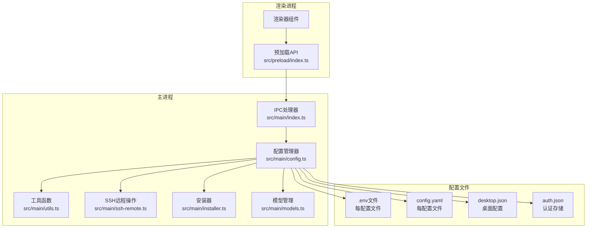
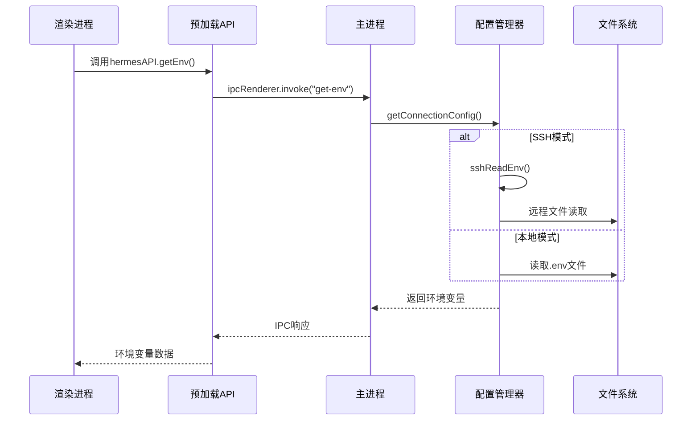
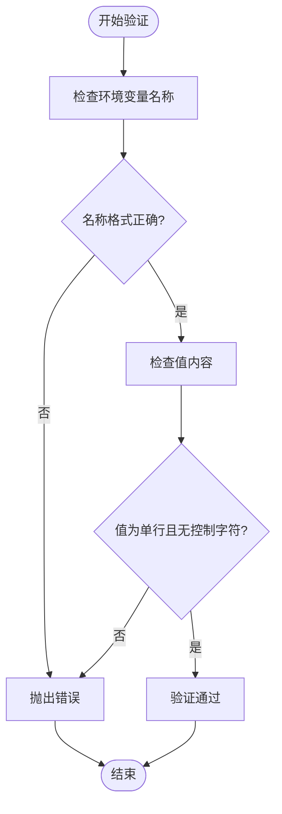
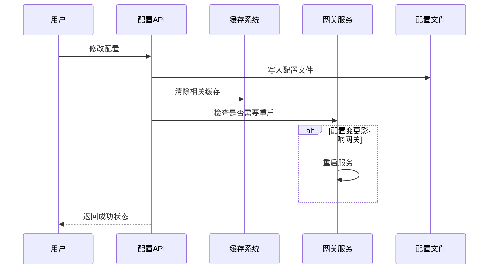
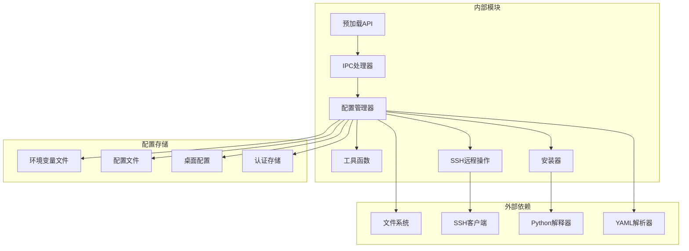

# 配置管理API

<cite>
**本文档引用的文件**
- [src/main/config.ts](file://src/main/config.ts)
- [src/main/index.ts](file://src/main/index.ts)
- [src/preload/index.ts](file://src/preload/index.ts)
- [src/main/utils.ts](file://src/main/utils.ts)
- [src/main/ssh-remote.ts](file://src/main/ssh-remote.ts)
- [src/main/installer.ts](file://src/main/installer.ts)
- [src/main/models.ts](file://src/main/models.ts)
- [tests/env-validation.test.ts](file://tests/env-validation.test.ts)
- [tests/profile-validation.test.ts](file://tests/profile-validation.test.ts)
</cite>

## 目录
1. [简介](#简介)
2. [项目结构](#项目结构)
3. [核心组件](#核心组件)
4. [架构概览](#架构概览)
5. [详细组件分析](#详细组件分析)
6. [依赖关系分析](#依赖关系分析)
7. [性能考虑](#性能考虑)
8. [故障排除指南](#故障排除指南)
9. [结论](#结论)

## 简介

配置管理API是Hermes Desktop应用的核心基础设施，负责管理应用的各种配置、环境变量和模型配置。该API提供了完整的IPC接口，支持本地配置管理和SSH远程配置管理两种模式，实现了配置的层次化存储、缓存机制和热更新功能。

本API主要包含以下功能：
- 环境变量管理（getEnv、setEnv）
- 应用配置管理（getConfig、setConfig）
- 模型配置管理（getModelConfig、setModelConfig）
- 连接配置管理（连接模式、SSH配置）
- 配置备份和迁移
- 配置验证和错误处理

## 项目结构

配置管理API在项目中的组织结构如下：



**图表来源**
- [src/preload/index.ts:1-701](file://src/preload/index.ts#L1-L701)
- [src/main/index.ts:366-471](file://src/main/index.ts#L366-L471)
- [src/main/config.ts:1-440](file://src/main/config.ts#L1-L440)

**章节来源**
- [src/main/config.ts:1-440](file://src/main/config.ts#L1-L440)
- [src/main/index.ts:366-471](file://src/main/index.ts#L366-L471)
- [src/preload/index.ts:74-101](file://src/preload/index.ts#L74-L101)

## 核心组件

### 配置管理器 (Config Manager)

配置管理器是整个配置系统的核心，负责：
- 环境变量的读取、设置和验证
- 应用配置的解析和修改
- 模型配置的管理
- 缓存机制的实现
- SSH远程配置的支持

### IPC处理器 (IPC Handlers)

IPC处理器负责将渲染进程的请求转发到配置管理器：
- 提供同步和异步的IPC接口
- 处理SSH模式下的远程配置操作
- 实现配置变更后的自动重启功能

### 工具函数 (Utility Functions)

工具函数提供基础的配置管理能力：
- 配置文件路径解析
- 正则表达式转义
- 安全文件写入
- 配置文件路径生成

**章节来源**
- [src/main/config.ts:76-176](file://src/main/config.ts#L76-L176)
- [src/main/index.ts:366-471](file://src/main/index.ts#L366-L471)
- [src/main/utils.ts:41-85](file://src/main/utils.ts#L41-L85)

## 架构概览

配置管理API采用分层架构设计，实现了清晰的职责分离：



**图表来源**
- [src/preload/index.ts:74-79](file://src/preload/index.ts#L74-L79)
- [src/main/index.ts:372-376](file://src/main/index.ts#L372-L376)
- [src/main/config.ts:101-132](file://src/main/config.ts#L101-L132)

### 配置层次结构

系统采用多层配置结构：

```mermaid
graph TB
subgraph "配置层次"
Global[全局配置<br/>~/.hermes/]
Profile[配置文件<br/>~/.hermes/profiles/<name>/]
Local[本地配置<br/>~/.hermes/<name>.json>
end
subgraph "配置类型"
Env[环境变量<br/>.env文件]
ConfigYaml[应用配置<br/>config.yaml]
Desktop[桌面配置<br/>desktop.json]
Auth[认证配置<br/>auth.json]
end
Global --> Env
Global --> ConfigYaml
Global --> Desktop
Global --> Auth
Profile --> Env
Profile --> ConfigYaml
Local --> Desktop
```

**图表来源**
- [src/main/utils.ts:41-66](file://src/main/utils.ts#L41-L66)
- [src/main/config.ts:24-45](file://src/main/config.ts#L24-L45)

## 详细组件分析

### 环境变量管理API

#### getEnv API

**功能描述**: 获取指定配置文件的环境变量集合

**参数说明**:
- `profile?: string`: 配置文件名称，默认为"默认"配置
- 返回值: `Promise<Record<string, string>>` - 环境变量键值对

**作用域范围**: 支持默认配置和命名配置文件

**使用示例**:
```typescript
// 获取默认配置的环境变量
const env = await window.hermesAPI.getEnv();

// 获取特定配置的环境变量
const profileEnv = await window.hermesAPI.getEnv("work");
```

**实现细节**:
- 支持SSH模式下的远程环境变量读取
- 实现5秒缓存机制
- 忽略注释行和无效行
- 自动去除引号包装的值

#### setEnv API

**功能描述**: 设置指定的环境变量值

**参数说明**:
- `key: string`: 环境变量名称
- `value: string`: 环境变量值
- `profile?: string`: 配置文件名称

**配置项类型**: 字符串类型

**作用域范围**: 支持默认配置和命名配置文件

**使用示例**:
```typescript
// 设置API密钥
await window.hermesAPI.setEnv("OPENAI_API_KEY", "sk-xxxxxxxx");

// 设置特定配置的变量
await window.hermesAPI.setEnv("HF_TOKEN", "hf_xxxxxxx", "work");
```

**实现细节**:
- 执行严格的环境变量名称验证
- 支持SSH模式下的远程设置
- 自动重启网关服务以应用新配置
- 支持API密钥和令牌的特殊处理

**章节来源**
- [src/preload/index.ts:74-79](file://src/preload/index.ts#L74-L79)
- [src/main/index.ts:372-398](file://src/main/index.ts#L372-L398)
- [src/main/config.ts:101-176](file://src/main/config.ts#L101-L176)

### 应用配置管理API

#### getConfig API

**功能描述**: 获取指定配置项的值

**参数说明**:
- `key: string`: 配置项名称
- `profile?: string`: 配置文件名称

**返回值**: `Promise<string | null>` - 配置值或null

**配置项类型**: 字符串类型

**作用域范围**: 支持默认配置和命名配置文件

**使用示例**:
```typescript
// 获取默认模型
const model = await window.hermesAPI.getConfig("default", "work");

// 获取提供商
const provider = await window.hermesAPI.getConfig("provider");
```

**实现细节**:
- 使用正则表达式精确匹配配置项
- 支持SSH模式下的远程读取
- 忽略注释和空行
- 返回null表示配置项不存在

#### setConfig API

**功能描述**: 设置指定配置项的值

**参数说明**:
- `key: string`: 配置项名称
- `value: string`: 配置值
- `profile?: string`: 配置文件名称

**配置项类型**: 字符串类型

**作用域范围**: 支持默认配置和命名配置文件

**使用示例**:
```typescript
// 设置默认模型
await window.hermesAPI.setConfig("default", "gpt-4o", "work");

// 设置提供商
await window.hermesAPI.setConfig("provider", "openai");
```

**实现细节**:
- 支持SSH模式下的远程设置
- 自动添加引号包装
- 保持配置文件格式一致性

**章节来源**
- [src/preload/index.ts:81-85](file://src/preload/index.ts#L81-L85)
- [src/main/index.ts:400-417](file://src/main/index.ts#L400-L417)
- [src/main/config.ts:181-213](file://src/main/config.ts#L181-L213)

### 模型配置管理API

#### getModelConfig API

**功能描述**: 获取模型配置信息

**参数说明**:
- `profile?: string`: 配置文件名称

**返回值**: `Promise<{ provider: string; model: string; baseUrl: string }>` - 模型配置对象

**配置项类型**: 对象类型，包含provider、model、baseUrl属性

**作用域范围**: 支持默认配置和命名配置文件

**使用示例**:
```typescript
// 获取默认配置的模型信息
const modelConfig = await window.hermesAPI.getModelConfig();

// 获取特定配置的模型信息
const workConfig = await window.hermesAPI.getModelConfig("work");
```

**实现细节**:
- 从config.yaml文件中提取模型配置
- 实现5秒缓存机制
- 提供默认值（provider: "auto", model: "", baseUrl: ""）

#### setModelConfig API

**功能描述**: 设置模型配置信息

**参数说明**:
- `provider: string`: 模型提供商
- `model: string`: 模型名称
- `baseUrl: string`: 基础URL
- `profile?: string`: 配置文件名称

**配置项类型**: 对象类型

**作用域范围**: 支持默认配置和命名配置文件

**使用示例**:
```typescript
// 设置工作配置的模型
await window.hermesAPI.setModelConfig(
    "openai", 
    "gpt-4o", 
    "https://api.openai.com/v1", 
    "work"
);

// 设置默认配置的模型
await window.hermesAPI.setModelConfig("anthropic", "claude-3", "");
```

**实现细节**:
- 自动禁用智能模型路由
- 启用流式传输支持
- 支持SSH模式下的远程设置
- 自动重启网关服务

**章节来源**
- [src/preload/index.ts:90-101](file://src/preload/index.ts#L90-L101)
- [src/main/index.ts:425-471](file://src/main/index.ts#L425-L471)
- [src/main/config.ts:215-301](file://src/main/config.ts#L215-L301)

### 配置验证规则

系统实现了严格的配置验证机制：

#### 环境变量验证



**图表来源**
- [src/main/config.ts:169-179](file://src/main/config.ts#L169-L179)

**验证规则**:
- 环境变量名称必须以字母或下划线开头
- 只允许字母、数字和下划线
- 值必须为单行字符串，不能包含换行符
- 不能包含NULL字符

#### 配置文件验证

- 支持YAML格式的config.yaml文件
- 自动忽略注释行和空行
- 严格匹配配置项格式
- 支持引号包装的字符串值

**章节来源**
- [src/main/config.ts:169-179](file://src/main/config.ts#L169-L179)
- [tests/env-validation.test.ts:1-43](file://tests/env-validation.test.ts#L1-43)

### 配置热更新机制

系统实现了智能的配置热更新机制：



**图表来源**
- [src/main/config.ts:95-99](file://src/main/config.ts#L95-L99)
- [src/main/index.ts:387-396](file://src/main/index.ts#L387-L396)

**热更新特性**:
- 自动清除相关缓存条目
- 智能检测配置变更的影响范围
- 条件性重启相关服务
- 支持SSH模式下的远程热更新

**章节来源**
- [src/main/config.ts:76-99](file://src/main/config.ts#L76-L99)
- [src/main/index.ts:387-396](file://src/main/index.ts#L387-L396)

### 配置备份和迁移

系统提供了完整的配置备份和迁移功能：

#### 备份功能

**功能描述**: 创建当前配置的完整备份

**参数说明**:
- `profile?: string`: 配置文件名称

**返回值**: `{ success: boolean; path?: string; error?: string }`

**使用示例**:
```typescript
// 备份默认配置
const backupResult = await window.hermesAPI.runHermesBackup();

// 备份特定配置
const workBackup = await window.hermesAPI.runHermesBackup("work");
```

**实现细节**:
- 调用底层Hermes CLI进行备份
- 支持自定义备份文件名
- 错误处理和进度反馈
- 支持SSH模式下的远程备份

#### 迁移功能

**功能描述**: 从备份文件恢复配置

**参数说明**:
- `archivePath: string`: 备份文件路径
- `profile?: string`: 目标配置文件名称

**返回值**: `{ success: boolean; error?: string }`

**使用示例**:
```typescript
// 从备份文件恢复
const importResult = await window.hermesAPI.runHermesImport("/path/to/backup.tar.gz");

// 恢复到特定配置
const workImport = await window.hermesAPI.runHermesImport("/path/to/backup.zip", "work");
```

**实现细节**:
- 支持多种压缩格式（tar.gz、tgz、zip）
- 自动检测备份内容
- 错误恢复和回滚机制
- 支持增量迁移

**章节来源**
- [src/main/installer.ts:805-890](file://src/main/installer.ts#L805-L890)
- [src/renderer/src/screens/Settings/Settings.tsx:254-285](file://src/renderer/src/screens/Settings/Settings.tsx#L254-L285)

## 依赖关系分析

配置管理API的依赖关系图：



**图表来源**
- [src/main/config.ts:1-440](file://src/main/config.ts#L1-L440)
- [src/main/index.ts:366-471](file://src/main/index.ts#L366-L471)
- [src/main/ssh-remote.ts:1-200](file://src/main/ssh-remote.ts#L1-L200)

**依赖特点**:
- 低耦合高内聚的设计
- 明确的职责分离
- 支持扩展和插件化
- 异常情况下的降级处理

**章节来源**
- [src/main/config.ts:1-440](file://src/main/config.ts#L1-L440)
- [src/main/index.ts:366-471](file://src/main/index.ts#L366-L471)

## 性能考虑

### 缓存策略

系统实现了多层次的缓存机制：

1. **内存缓存**: 5秒TTL的Map缓存
2. **文件系统缓存**: 避免重复读取相同文件
3. **IPC缓存**: 减少跨进程调用开销

### 性能优化

- **延迟加载**: 配置文件按需读取
- **批量操作**: 支持一次设置多个配置项
- **异步处理**: 非阻塞的IPC通信
- **资源管理**: 及时清理临时文件和连接

## 故障排除指南

### 常见问题及解决方案

#### 环境变量设置失败

**问题症状**: `setEnv`调用抛出异常

**可能原因**:
- 环境变量名称不符合规范
- 值包含非法字符
- 文件权限不足

**解决步骤**:
1. 检查环境变量名称格式
2. 验证值内容是否为单行字符串
3. 确认文件写入权限
4. 查看错误日志获取详细信息

#### 配置读取为空

**问题症状**: `getConfig`返回null或空对象

**可能原因**:
- 配置文件不存在
- 配置项名称拼写错误
- SSH连接失败

**解决步骤**:
1. 确认配置文件存在
2. 检查配置项名称大小写
3. 验证SSH连接状态
4. 使用调试模式查看详细信息

#### 配置热更新不生效

**问题症状**: 修改配置后服务未重启

**可能原因**:
- 配置变更不影响网关服务
- 网关服务启动失败
- 缓存未正确失效

**解决步骤**:
1. 检查配置变更是否影响网关
2. 手动重启网关服务
3. 清除相关缓存条目
4. 查看服务日志

**章节来源**
- [src/main/config.ts:169-179](file://src/main/config.ts#L169-L179)
- [src/main/index.ts:387-396](file://src/main/index.ts#L387-L396)

## 结论

配置管理API为Hermes Desktop应用提供了完整、可靠、高性能的配置管理解决方案。通过分层架构设计、严格的验证机制、智能的缓存策略和完善的错误处理，该API能够满足复杂应用场景下的配置管理需求。

主要优势包括：
- **多模式支持**: 同时支持本地和SSH远程配置管理
- **强类型安全**: 严格的输入验证和类型检查
- **高性能**: 智能缓存和异步处理机制
- **可扩展性**: 模块化设计便于功能扩展
- **可靠性**: 完善的错误处理和回退机制

该API为开发者提供了清晰的接口和丰富的功能，是构建企业级配置管理系统的优秀参考实现。