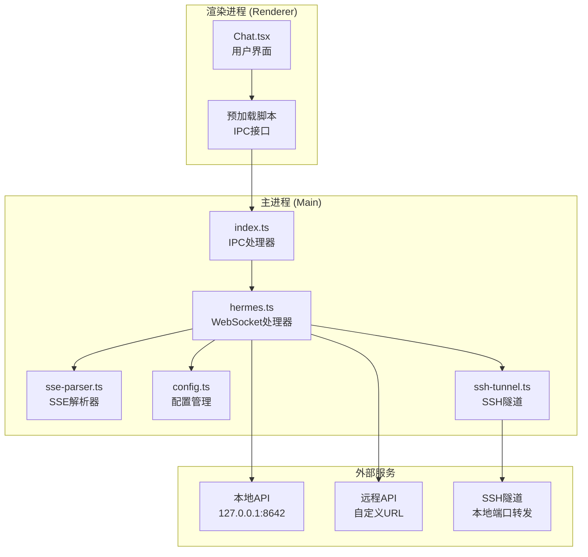
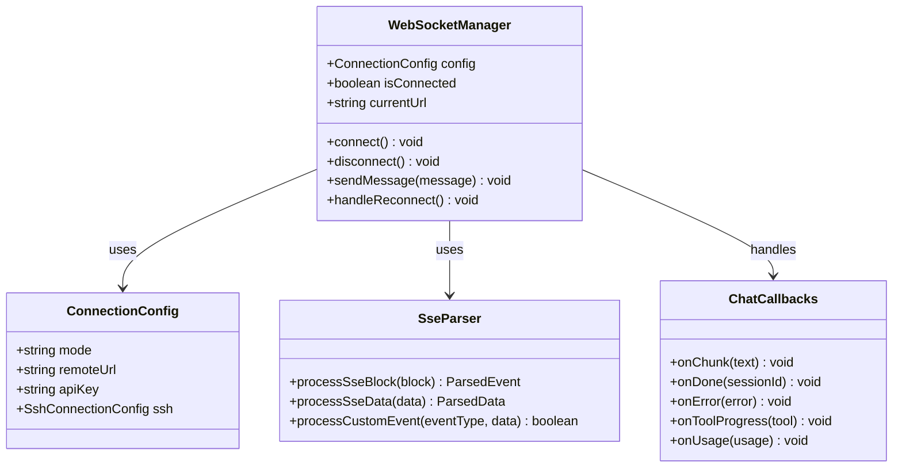
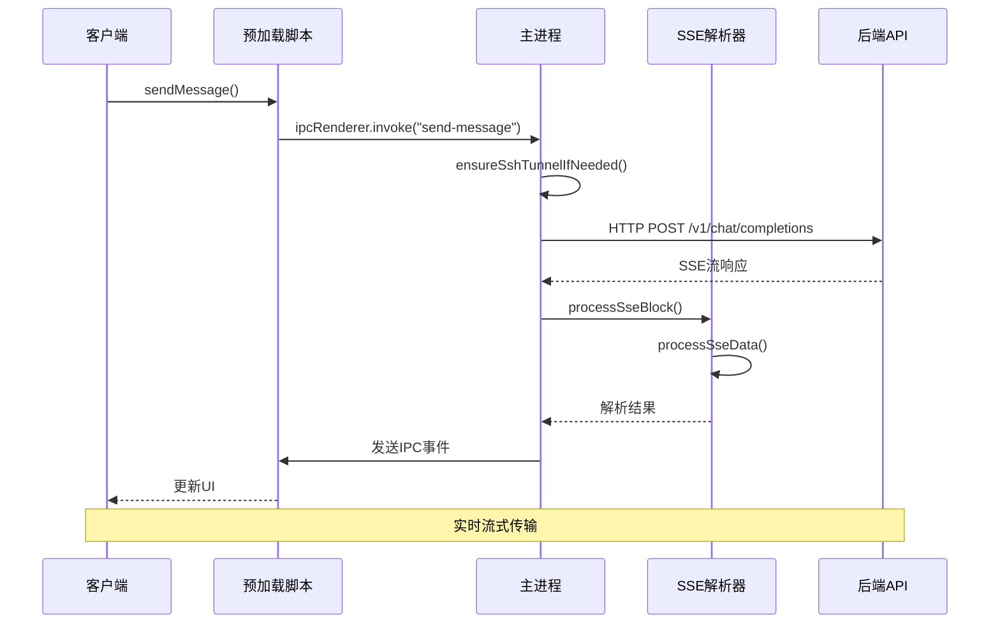
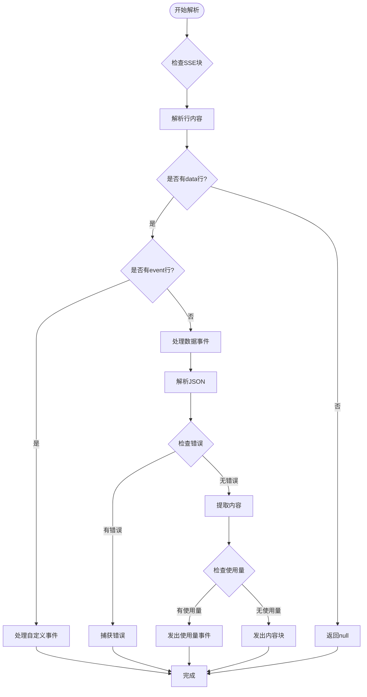
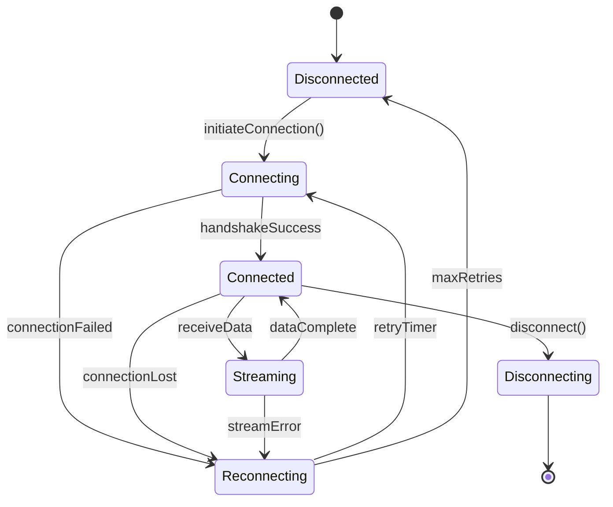
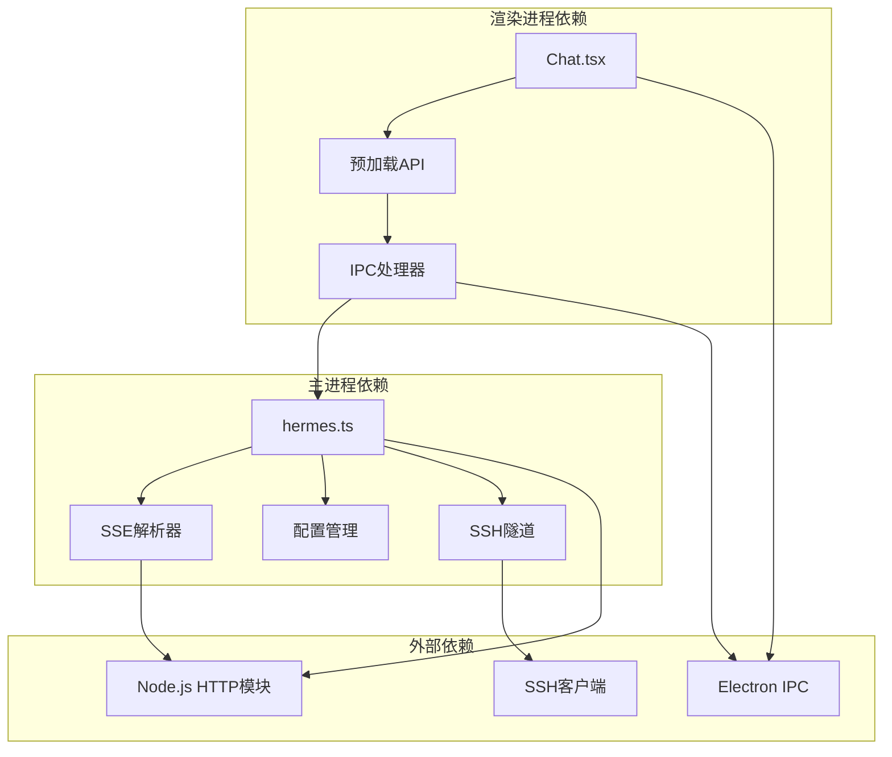
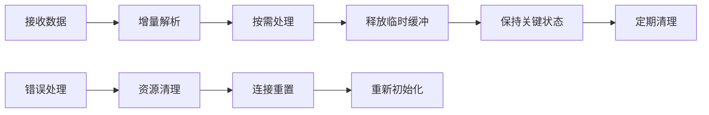

# WebSocket API接口

<cite>
**本文档引用的文件**
- [hermes.ts](file://src/main/hermes.ts)
- [sse-parser.ts](file://src/main/sse-parser.ts)
- [index.ts](file://src/main/index.ts)
- [index.ts](file://src/preload/index.ts)
- [Chat.tsx](file://src/renderer/src/screens/Chat/Chat.tsx)
- [config.ts](file://src/main/config.ts)
- [ssh-tunnel.ts](file://src/main/ssh-tunnel.ts)
- [README.md](file://README.md)
- [sse-parser.test.ts](file://tests/sse-parser.test.ts)
</cite>

## 目录
1. [简介](#简介)
2. [项目结构](#项目结构)
3. [核心组件](#核心组件)
4. [架构概览](#架构概览)
5. [详细组件分析](#详细组件分析)
6. [依赖关系分析](#依赖关系分析)
7. [性能考虑](#性能考虑)
8. [故障排除指南](#故障排除指南)
9. [结论](#结论)
10. [附录](#附录)

## 简介

Hermes Desktop 是一个基于 Electron 的桌面应用程序，提供了实时通信功能，主要通过 Server-Sent Events (SSE) 实现流式传输。该应用支持本地模式（运行在 127.0.0.1:8642）和远程模式（连接到远程 Hermes API 服务器），并提供了完整的 WebSocket 协议实现。

本项目的核心特性包括：
- 基于 SSE 的实时流式通信
- 完整的错误处理和重连机制
- 多种连接模式支持（本地、远程、SSH隧道）
- 实时工具进度跟踪
- 令牌使用量统计
- 完整的消息解析和状态管理

## 项目结构

Hermes Desktop 的 WebSocket 实现采用分层架构设计：



**图表来源**
- [hermes.ts:1-887](file://src/main/hermes.ts#L1-L887)
- [index.ts:544-640](file://src/main/index.ts#L544-L640)
- [sse-parser.ts:1-131](file://src/main/sse-parser.ts#L1-L131)

**章节来源**
- [README.md:120-132](file://README.md#L120-L132)
- [hermes.ts:168-434](file://src/main/hermes.ts#L168-L434)

## 核心组件

### WebSocket 连接管理器

Hermes Desktop 使用统一的连接管理策略，支持多种连接模式：



**图表来源**
- [hermes.ts:94-166](file://src/main/hermes.ts#L94-L166)
- [hermes.ts:54-62](file://src/main/hermes.ts#L54-L62)
- [sse-parser.ts:58-110](file://src/main/sse-parser.ts#L58-L110)

### 消息格式规范

系统支持的标准消息格式包括：

| 消息类型 | 结构 | 描述 |
|---------|------|------|
| 数据块 | `data: {json}` | 标准SSE数据块 |
| 自定义事件 | `event: hermes.tool.progress\ndata: {payload}` | 工具进度事件 |
| 流结束 | `data: [DONE]` | 流式传输结束信号 |

**章节来源**
- [hermes.ts:369-387](file://src/main/hermes.ts#L369-L387)
- [sse-parser.ts:116-130](file://src/main/sse-parser.ts#L116-L130)

## 架构概览

Hermes Desktop 的 WebSocket 架构采用事件驱动的设计模式：



**图表来源**
- [index.ts:544-640](file://src/main/index.ts#L544-L640)
- [hermes.ts:335-434](file://src/main/hermes.ts#L335-L434)
- [sse-parser.ts:58-110](file://src/main/sse-parser.ts#L58-L110)

## 详细组件分析

### SSE 解析器组件

SSE 解析器是整个 WebSocket 实现的核心组件，负责处理各种类型的事件：



**图表来源**
- [sse-parser.ts:58-110](file://src/main/sse-parser.ts#L58-L110)
- [sse-parser.ts:29-46](file://src/main/sse-parser.ts#L29-L46)

#### 自定义事件处理

系统支持特定的自定义事件类型：

| 事件类型 | 触发条件 | 数据格式 | 处理方式 |
|---------|---------|---------|---------|
| hermes.tool.progress | 工具执行进度 | `{tool: string, emoji: string, label: string}` | 更新工具进度显示 |
| [DONE] | 流结束信号 | `"[DONE]"` | 完成消息处理 |

**章节来源**
- [hermes.ts:269-280](file://src/main/hermes.ts#L269-L280)
- [sse-parser.ts:29-46](file://src/main/sse-parser.ts#L29-L46)

### 连接状态管理

连接状态管理器负责维护连接的生命周期：



**图表来源**
- [hermes.ts:652-711](file://src/main/hermes.ts#L652-L711)
- [ssh-tunnel.ts:59-63](file://src/main/ssh-tunnel.ts#L59-L63)

### 错误处理机制

系统实现了多层次的错误处理策略：

```mermaid
flowchart TD
Request[发送请求] --> CheckResponse{检查HTTP响应}
CheckResponse --> |200 OK| ParseStream[解析SSE流]
CheckResponse --> |其他状态| HandleHttpError[处理HTTP错误]
ParseStream --> CheckStream{检查流状态}
CheckStream --> |正常| ProcessEvents[处理事件]
CheckStream --> |异常| HandleStreamError[处理流错误]
ProcessEvents --> CheckDone{检查[DONE]标记}
CheckDone --> |收到| Complete[完成请求]
CheckDone --> |未收到| ProbeError[探测真实错误]
HandleHttpError --> ProbeError
HandleStreamError --> ProbeError
ProbeError --> MakeProbe[发起探测请求]
MakeProbe --> DetermineError[确定错误类型]
DetermineError --> SendError[发送错误事件]
Complete --> SendDone[发送完成事件]
```

**图表来源**
- [hermes.ts:218-266](file://src/main/hermes.ts#L218-L266)
- [hermes.ts:417-424](file://src/main/hermes.ts#L417-L424)

**章节来源**
- [hermes.ts:282-333](file://src/main/hermes.ts#L282-L333)
- [hermes.ts:413-424](file://src/main/hermes.ts#L413-L424)

## 依赖关系分析

### 组件依赖图



**图表来源**
- [index.ts:158-235](file://src/main/index.ts#L158-L235)
- [hermes.ts:1-20](file://src/main/hermes.ts#L1-L20)

### 关键依赖关系

| 组件 | 依赖项 | 用途 |
|------|-------|------|
| hermes.ts | Node.js http/https | HTTP请求处理 |
| hermes.ts | ssh-tunnel.ts | SSH隧道管理 |
| sse-parser.ts | 无外部依赖 | 纯函数解析器 |
| preload/index.ts | Electron IPC | 渲染进程通信 |
| Chat.tsx | 预加载API | 用户界面交互 |

**章节来源**
- [hermes.ts:1-19](file://src/main/hermes.ts#L1-L19)
- [index.ts:1-7](file://src/main/index.ts#L1-L7)

## 性能考虑

### 流式传输优化

系统采用了多项性能优化措施：

1. **缓冲区管理**：使用增量缓冲区避免内存峰值
2. **事件去抖动**：批量处理相似事件减少UI更新频率
3. **连接复用**：重用HTTP连接减少握手开销
4. **智能重试**：指数退避算法避免过度重试

### 内存管理策略



**图表来源**
- [hermes.ts:367-411](file://src/main/hermes.ts#L367-L411)

### 最佳实践建议

1. **合理设置超时时间**：根据网络环境调整请求超时
2. **实施背压控制**：在高流量时限制事件处理速度
3. **使用连接池**：复用连接减少建立成本
4. **实现优雅降级**：在网络异常时提供替代方案

## 故障排除指南

### 常见问题诊断

| 问题类型 | 症状 | 可能原因 | 解决方案 |
|---------|------|---------|---------|
| 连接失败 | 无法建立WebSocket连接 | 网络配置错误 | 检查防火墙和代理设置 |
| 流中断 | SSE流意外断开 | 网络不稳定 | 实施自动重连机制 |
| 解析错误 | 事件格式不正确 | 服务器端格式变更 | 更新解析器版本 |
| 内存泄漏 | 内存使用持续增长 | 事件监听器未清理 | 检查事件解绑逻辑 |

### 调试工具

系统提供了多种调试工具：

1. **日志记录**：详细的连接和事件日志
2. **性能监控**：实时连接状态和延迟监控
3. **错误报告**：结构化的错误信息收集
4. **网络诊断**：连接健康检查工具

**章节来源**
- [hermes.ts:854-878](file://src/main/hermes.ts#L854-L878)
- [config.ts:47-74](file://src/main/config.ts#L47-L74)

## 结论

Hermes Desktop 的 WebSocket 实现展现了现代实时通信系统的最佳实践。通过采用分层架构、完善的错误处理机制和性能优化策略，系统能够稳定地处理各种复杂的实时通信场景。

关键优势包括：
- **可靠性**：多重错误检测和自动恢复机制
- **可扩展性**：模块化设计支持功能扩展
- **易维护性**：清晰的代码结构和完整的测试覆盖
- **用户体验**：流畅的实时交互和及时的状态反馈

未来可以考虑的改进方向：
- 实现更智能的连接池管理
- 增加更多的性能监控指标
- 提供更丰富的调试工具
- 优化移动端的兼容性

## 附录

### API 接口定义

#### 主进程接口

| 方法 | 参数 | 返回值 | 描述 |
|------|------|-------|------|
| sendMessage | message: string, profile?: string, resumeSessionId?: string, history?: Array | Promise | 发送聊天消息 |
| abortChat | 无 | Promise | 中止当前聊天 |
| onChatChunk | callback: (chunk: string) => void | () => void | 注册内容块回调 |
| onChatDone | callback: (sessionId?: string) => void | () => void | 注册完成回调 |
| onChatError | callback: (error: string) => void | () => void | 注册错误回调 |
| onChatToolProgress | callback: (tool: string) => void | () => void | 注册工具进度回调 |
| onChatUsage | callback: (usage: Usage) => void | () => void | 注册使用量回调 |

#### 渲染进程接口

| 方法 | 参数 | 返回值 | 描述 |
|------|------|-------|------|
| sendMessage | message: string, profile?: string, resumeSessionId?: string, history?: Array | Promise | 发送聊天消息 |
| abortChat | 无 | Promise | 中止当前聊天 |
| onChatChunk | callback: (chunk: string) => void | () => void | 注册内容块回调 |
| onChatDone | callback: (sessionId?: string) => void | () => void | 注册完成回调 |
| onChatError | callback: (error: string) => void | () => void | 注册错误回调 |
| onChatToolProgress | callback: (tool: string) => void | () => void | 注册工具进度回调 |
| onChatUsage | callback: (usage: Usage) => void | () => void | 注册使用量回调 |

### 数据结构定义

#### Usage 结构

| 字段 | 类型 | 必填 | 描述 |
|------|------|------|------|
| promptTokens | number | 是 | 提示令牌数 |
| completionTokens | number | 是 | 补全令牌数 |
| totalTokens | number | 是 | 总令牌数 |
| cost | number | 否 | 成本估算 |
| rateLimitRemaining | number | 否 | 剩余速率限制 |
| rateLimitReset | number | 否 | 速率限制重置时间 |

#### ConnectionConfig 结构

| 字段 | 类型 | 必填 | 描述 |
|------|------|------|------|
| mode | "local" \| "remote" \| "ssh" | 是 | 连接模式 |
| remoteUrl | string | 否 | 远程服务器URL |
| apiKey | string | 否 | API密钥 |
| ssh | SshConnectionConfig | 否 | SSH连接配置 |

**章节来源**
- [hermes.ts:153-166](file://src/main/hermes.ts#L153-L166)
- [config.ts:17-22](file://src/main/config.ts#L17-L22)