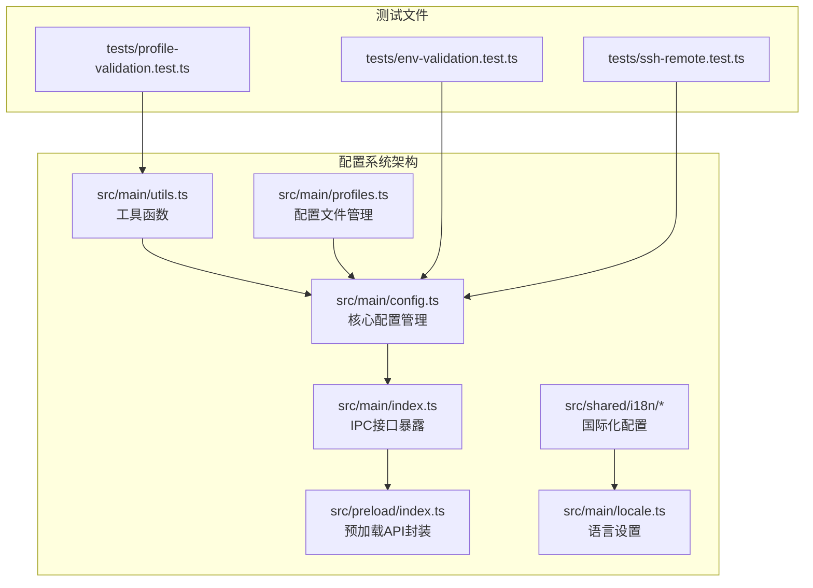
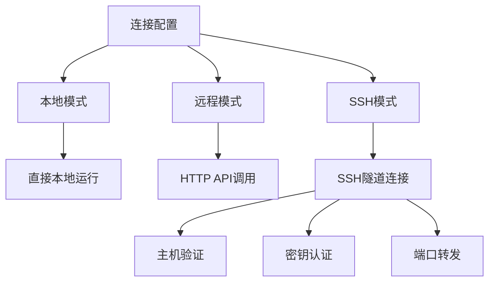
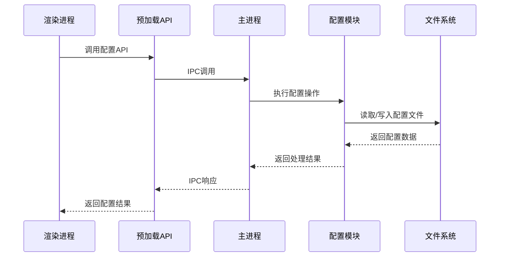
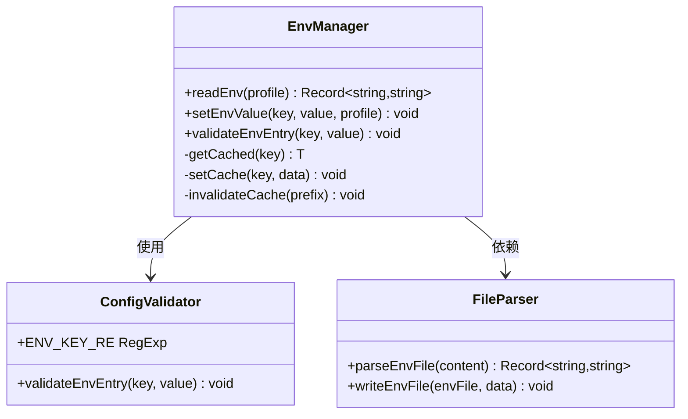
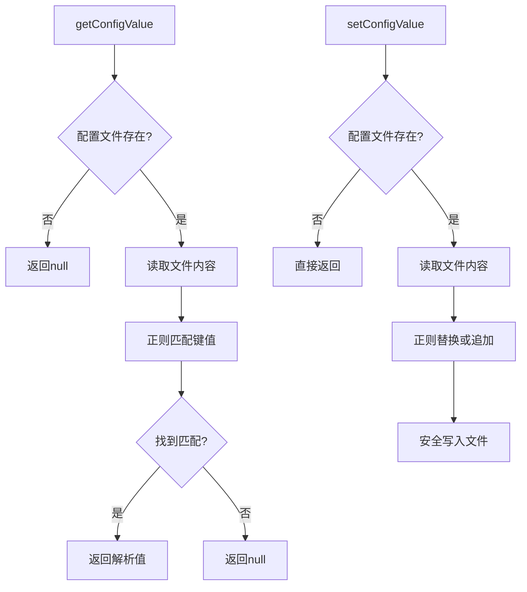
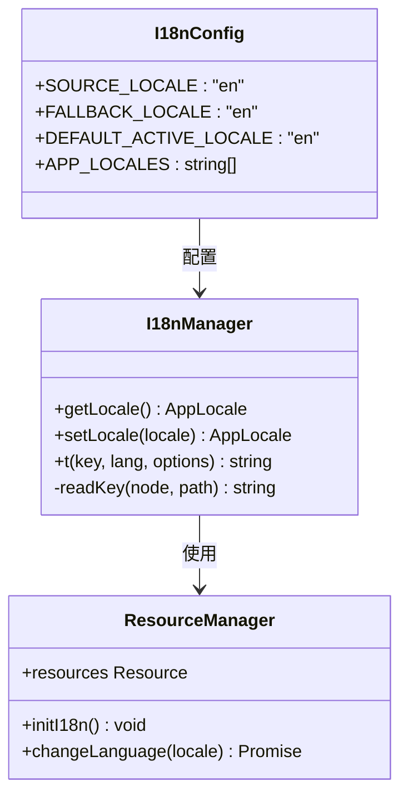
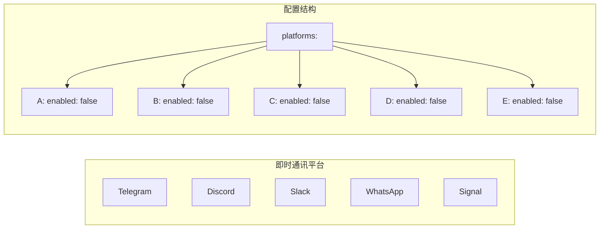
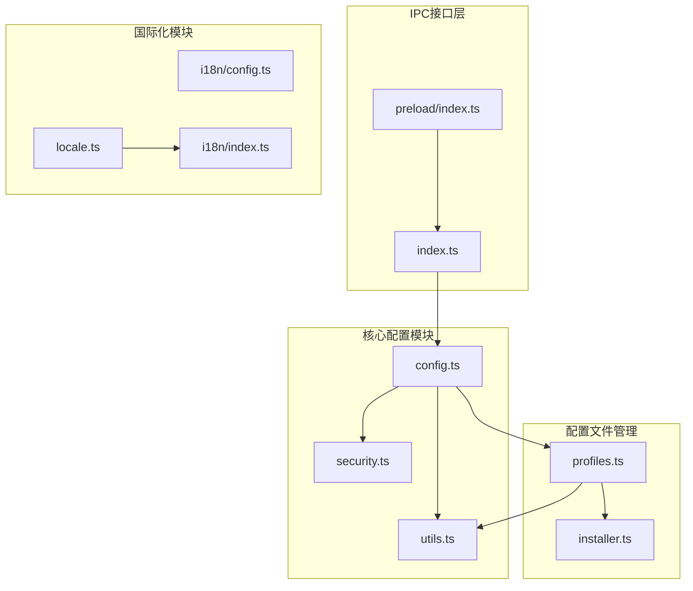

# 配置API接口

<cite>
**本文档引用的文件**
- [src/main/config.ts](file://src/main/config.ts)
- [src/main/index.ts](file://src/main/index.ts)
- [src/preload/index.ts](file://src/preload/index.ts)
- [src/shared/i18n/config.ts](file://src/shared/i18n/config.ts)
- [src/shared/i18n/index.ts](file://src/shared/i18n/index.ts)
- [src/main/utils.ts](file://src/main/utils.ts)
- [src/main/profiles.ts](file://src/main/profiles.ts)
- [src/main/locale.ts](file://src/main/locale.ts)
- [src/main/security.ts](file://src/main/security.ts)
- [tests/env-validation.test.ts](file://tests/env-validation.test.ts)
- [tests/profile-validation.test.ts](file://tests/profile-validation.test.ts)
- [tests/ssh-remote.test.ts](file://tests/ssh-remote.test.ts)
</cite>

## 目录
1. [简介](#简介)
2. [项目结构](#项目结构)
3. [核心组件](#核心组件)
4. [架构概览](#架构概览)
5. [详细组件分析](#详细组件分析)
6. [依赖关系分析](#依赖关系分析)
7. [性能考虑](#性能考虑)
8. [故障排除指南](#故障排除指南)
9. [结论](#结论)
10. [附录](#附录)

## 简介

Hermes Desktop 配置API接口是整个应用程序的核心配置管理系统，负责管理用户环境变量、配置文件、多配置文件支持和国际化配置。该系统提供了完整的配置管理功能，包括本地配置、远程配置和SSH配置模式，支持多用户配置文件切换，并集成了强大的安全验证机制。

本系统采用分层架构设计，通过IPC通信在主进程和渲染进程之间传递配置数据，确保配置操作的安全性和一致性。系统支持实时配置缓存、配置验证、配置迁移和配置同步等功能，为用户提供无缝的配置管理体验。

## 项目结构

配置系统主要分布在以下目录和文件中：



**图表来源**
- [src/main/config.ts:1-440](file://src/main/config.ts#L1-L440)
- [src/main/index.ts:1-800](file://src/main/index.ts#L1-L800)
- [src/preload/index.ts:1-701](file://src/preload/index.ts#L1-L701)

**章节来源**
- [src/main/config.ts:1-440](file://src/main/config.ts#L1-L440)
- [src/main/index.ts:1-800](file://src/main/index.ts#L1-L800)
- [src/preload/index.ts:1-701](file://src/preload/index.ts#L1-L701)

## 核心组件

### 配置文件层次结构

系统采用分层配置架构，支持多种配置文件类型：

1. **桌面配置文件** (`desktop.json`)
   - 存储连接配置信息
   - 包含本地、远程和SSH连接模式
   - 存储全局应用设置

2. **用户配置文件** (`config.yaml`)
   - 存储模型配置信息
   - 包含provider、default model和base_url
   - 支持平台启用状态配置

3. **环境变量文件** (`.env`)
   - 存储敏感配置信息
   - 支持多环境变量定义
   - 提供配置验证和缓存机制

4. **认证存储** (`auth.json`)
   - 存储凭据池信息
   - 管理第三方服务认证
   - 支持多提供者凭据管理

### 连接配置管理

系统支持三种连接模式：



**图表来源**
- [src/main/config.ts:47-74](file://src/main/config.ts#L47-L74)

**章节来源**
- [src/main/config.ts:47-74](file://src/main/config.ts#L47-L74)
- [src/main/config.ts:248-301](file://src/main/config.ts#L248-L301)

## 架构概览

配置系统的整体架构采用IPC（进程间通信）模式，通过主进程统一管理配置文件，渲染进程通过预加载API访问配置功能。



**图表来源**
- [src/preload/index.ts:74-101](file://src/preload/index.ts#L74-L101)
- [src/main/index.ts:372-417](file://src/main/index.ts#L372-L417)

**章节来源**
- [src/preload/index.ts:74-101](file://src/preload/index.ts#L74-L101)
- [src/main/index.ts:372-417](file://src/main/index.ts#L372-L417)

## 详细组件分析

### 环境变量管理组件

环境变量管理系统提供了安全的环境变量读写功能，包含完整的验证机制和缓存策略。

#### 核心功能特性

1. **环境变量验证**
   - 键名格式验证：仅允许字母、数字、下划线，不能以数字开头
   - 值内容验证：禁止换行符、回车符和NUL字符
   - 单行字符串限制：确保环境变量值为单行

2. **缓存机制**
   - 内存缓存：5秒TTL过期时间
   - 按配置文件前缀失效
   - 减少频繁文件I/O操作

3. **文件解析**
   - 支持注释行（以#开头）
   - 自动去除引号包裹的值
   - 忽略无效行格式



**图表来源**
- [src/main/config.ts:101-179](file://src/main/config.ts#L101-L179)

**章节来源**
- [src/main/config.ts:101-179](file://src/main/config.ts#L101-L179)
- [tests/env-validation.test.ts:30-76](file://tests/env-validation.test.ts#L30-L76)

### 配置文件读写组件

配置文件管理系统负责处理YAML格式的配置文件，提供精确的键值对读写功能。

#### 配置文件格式

系统使用标准的YAML格式配置文件，支持以下配置项：

```yaml
# 模型配置示例
provider: "openrouter"
default: "anthropic/claude-sonnet-4-20250514"
base_url: ""
```

#### 核心功能

1. **配置项读取**
   - 精确的正则表达式匹配
   - 支持带引号和不带引号的值
   - 忽略注释和空行

2. **配置项更新**
   - 保持原有格式和缩进
   - 自动添加缺失的配置项
   - 安全的文件写入操作

3. **默认值处理**
   - provider默认值："auto"
   - model默认值：空字符串
   - base_url默认值：空字符串



**图表来源**
- [src/main/config.ts:181-213](file://src/main/config.ts#L181-L213)

**章节来源**
- [src/main/config.ts:181-213](file://src/main/config.ts#L181-L213)
- [src/main/config.ts:215-246](file://src/main/config.ts#L215-L246)

### 多配置文件支持组件

系统支持多配置文件管理，通过配置文件夹实现用户隔离和配置切换。

#### 配置文件夹结构

```
~/.hermes/
├── desktop.json              # 桌面配置
├── active_profile           # 当前激活的配置文件
├── profiles/                # 配置文件夹
│   ├── work/               # 工作配置
│   ├── personal/           # 个人配置
│   └── development/        # 开发配置
└── auth.json               # 认证存储
```

#### 配置文件路径解析

```mermaid
flowchart TD
A[profilePaths] --> B{配置文件名}
B --> |undefined| C[~/.hermes/]
B --> |default| C
B --> |自定义名称| D[~/.hermes/profiles/{name}/]
C --> E[envFile: ~/.hermes/.env]
C --> F[configFile: ~/.hermes/config.yaml]
D --> G[envFile: ~/.hermes/profiles/{name}/.env]
D --> H[configFile: ~/.hermes/profiles/{name}/config.yaml]
```

**图表来源**
- [src/main/utils.ts:55-66](file://src/main/utils.ts#L55-L66)

**章节来源**
- [src/main/utils.ts:55-66](file://src/main/utils.ts#L55-L66)
- [src/main/profiles.ts:111-193](file://src/main/profiles.ts#L111-L193)

### 国际化配置组件

系统提供完整的国际化支持，包括语言切换、资源管理和翻译功能。

#### 支持的语言列表

| 语言代码 | 语言名称 | 文件位置 |
|---------|---------|---------|
| en | 英语 | `src/shared/i18n/locales/en/` |
| es | 西班牙语 | `src/shared/i18n/locales/es/` |
| id | 印度尼西亚语 | `src/shared/i18n/locales/id/` |
| pt-BR | 巴西葡萄牙语 | `src/shared/i18n/locales/pt-BR/` |
| zh-CN | 简体中文 | `src/shared/i18n/locales/zh-CN/` |

#### 国际化配置



**图表来源**
- [src/shared/i18n/config.ts:1-7](file://src/shared/i18n/config.ts#L1-L7)
- [src/shared/i18n/index.ts:242-287](file://src/shared/i18n/index.ts#L242-L287)

**章节来源**
- [src/shared/i18n/config.ts:1-7](file://src/shared/i18n/config.ts#L1-L7)
- [src/shared/i18n/index.ts:242-287](file://src/shared/i18n/index.ts#L242-L287)

### 平台配置管理组件

系统支持多个平台的启用/禁用配置，包括Telegram、Discord、Slack等即时通讯平台。

#### 支持的平台列表



**图表来源**
- [src/main/config.ts:309-335](file://src/main/config.ts#L309-L335)

**章节来源**
- [src/main/config.ts:309-394](file://src/main/config.ts#L309-L394)

## 依赖关系分析

配置系统各组件之间的依赖关系如下：



**图表来源**
- [src/main/config.ts:1-440](file://src/main/config.ts#L1-L440)
- [src/main/index.ts:68-81](file://src/main/index.ts#L68-L81)

**章节来源**
- [src/main/config.ts:1-440](file://src/main/config.ts#L1-L440)
- [src/main/index.ts:68-81](file://src/main/index.ts#L68-L81)

## 性能考虑

### 缓存策略

配置系统采用了多层次的缓存机制来优化性能：

1. **内存缓存**
   - 环境变量读取缓存：5秒TTL
   - 模型配置缓存：5秒TTL
   - 按配置文件前缀失效

2. **文件系统优化**
   - 安全文件写入：自动创建目录结构
   - 原子性写入：避免部分写入导致的文件损坏
   - 异步I/O操作：减少阻塞

### 性能优化建议

1. **批量操作**
   - 合并多次配置修改为单次写入
   - 使用缓存减少重复读取

2. **异步处理**
   - 长时间配置操作使用异步API
   - 避免阻塞主线程

3. **资源管理**
   - 及时清理过期缓存
   - 监控文件句柄使用情况

## 故障排除指南

### 常见问题及解决方案

#### 环境变量配置问题

**问题1：环境变量写入失败**
- 检查键名格式是否符合要求
- 确认值中不包含换行符或特殊字符
- 验证目标文件是否存在且可写

**问题2：配置文件格式错误**
- 检查YAML语法是否正确
- 确认缩进和冒号使用规范
- 验证特殊字符转义

#### 配置文件权限问题

**问题3：配置文件无法读取**
- 检查文件权限设置
- 确认用户具有读取权限
- 验证文件路径正确性

**问题4：配置文件损坏**
- 备份原始配置文件
- 重新生成配置文件
- 检查磁盘空间和权限

#### 国际化配置问题

**问题5：语言切换无效**
- 确认目标语言文件存在
- 检查语言代码格式
- 验证资源文件完整性

**问题6：翻译文本显示异常**
- 检查占位符格式
- 确认参数传递正确
- 验证字符串编码

**章节来源**
- [tests/env-validation.test.ts:43-76](file://tests/env-validation.test.ts#L43-L76)
- [tests/profile-validation.test.ts:29-67](file://tests/profile-validation.test.ts#L29-L67)

## 结论

Hermes Desktop配置API接口提供了一个完整、安全、高效的配置管理系统。系统通过分层架构设计、严格的验证机制和智能缓存策略，确保了配置操作的可靠性和平滑用户体验。

主要优势包括：
- **安全性**：完整的输入验证和安全文件写入
- **灵活性**：支持多配置文件和多连接模式
- **性能**：智能缓存和异步操作优化
- **可维护性**：清晰的代码结构和完善的测试覆盖

该配置系统为Hermes Desktop提供了坚实的基础，支持复杂的多用户场景和企业级部署需求。

## 附录

### API参考文档

#### 环境变量API

| 方法 | 参数 | 返回值 | 描述 |
|------|------|--------|------|
| readEnv | profile?: string | Record<string, string> | 读取环境变量 |
| setEnvValue | key: string, value: string, profile?: string | void | 设置环境变量 |
| validateEnvEntry | key: string, value: string | void | 验证环境变量 |

#### 配置文件API

| 方法 | 参数 | 返回值 | 描述 |
|------|------|--------|------|
| getConfigValue | key: string, profile?: string | string \| null | 获取配置值 |
| setConfigValue | key: string, value: string, profile?: string | void | 设置配置值 |
| getModelConfig | profile?: string | ModelConfig | 获取模型配置 |
| setModelConfig | provider: string, model: string, baseUrl: string, profile?: string | void | 设置模型配置 |

#### 连接配置API

| 方法 | 参数 | 返回值 | 描述 |
|------|------|--------|------|
| getConnectionConfig | - | ConnectionConfig | 获取连接配置 |
| setConnectionConfig | config: ConnectionConfig | void | 设置连接配置 |
| getPlatformEnabled | profile?: string | Record<string, boolean> | 获取平台启用状态 |
| setPlatformEnabled | platform: string, enabled: boolean, profile?: string | void | 设置平台启用状态 |

### 配置文件格式示例

#### 环境变量文件示例
```env
# OpenAI API配置
OPENAI_API_KEY=sk-...

# Hugging Face令牌
HF_TOKEN=hf_...

# 自定义配置
CUSTOM_VAR=value
```

#### 模型配置文件示例
```yaml
provider: "openrouter"
default: "anthropic/claude-sonnet-4-20250514"
base_url: ""

platforms:
  telegram:
    enabled: false
  discord:
    enabled: true
```