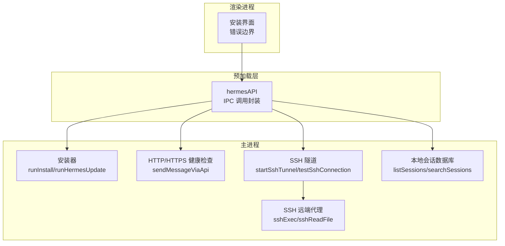
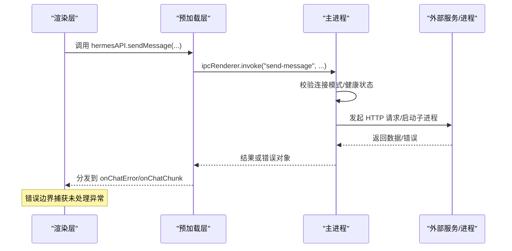
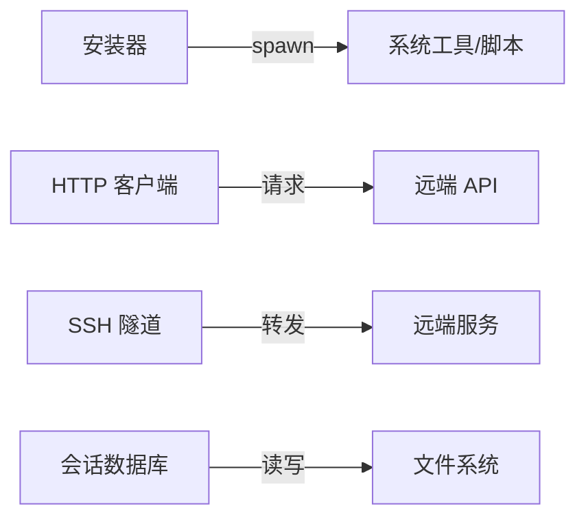

# 错误码参考

<cite>
**本文引用的文件**
- [src/main/installer.ts](file://src/main/installer.ts)
- [src/main/hermes.ts](file://src/main/hermes.ts)
- [src/main/ssh-tunnel.ts](file://src/main/ssh-tunnel.ts)
- [src/main/ssh-remote.ts](file://src/main/ssh-remote.ts)
- [src/main/sessions.ts](file://src/main/sessions.ts)
- [src/preload/index.ts](file://src/preload/index.ts)
- [src/renderer/src/components/ErrorBoundary.tsx](file://src/renderer/src/components/ErrorBoundary.tsx)
- [src/renderer/src/screens/Install/Install.tsx](file://src/renderer/src/screens/Install/Install.tsx)
- [src/shared/i18n/locales/en/errors.ts](file://src/shared/i18n/locales/en/errors.ts)
- [src/shared/i18n/locales/zh-CN/errors.ts](file://src/shared/i18n/locales/zh-CN/errors.ts)
- [src/main/index.ts](file://src/main/index.ts)
</cite>

## 目录
1. [简介](#简介)
2. [项目结构与错误处理概览](#项目结构与错误处理概览)
3. [核心错误分类与参考](#核心错误分类与参考)
4. [架构与错误传播路径](#架构与错误传播路径)
5. [详细组件与错误场景分析](#详细组件与错误场景分析)
6. [依赖关系与错误耦合分析](#依赖关系与错误耦合分析)
7. [性能与稳定性考量](#性能与稳定性考量)
8. [故障排除与调试指南](#故障排除与调试指南)
9. [结论](#结论)

## 简介
本参考文档面向 Hermes Desktop 用户与开发者，系统梳理安装、连接、API 调用、文件系统与网络等场景下的错误类型、错误信息来源、可能原因、解决步骤与预防措施，并提供日志分析、调试技巧与故障排除流程。文档以仓库中实际实现为依据，避免臆测，确保可操作性。

## 项目结构与错误处理概览
- 主进程负责安装流程、远程连接、网关与 SSH 隧道管理、会话数据库访问与 IPC 处理。
- 预加载层封装了渲染进程可用的 API，统一通过 IPC 通道与主进程交互，便于集中错误上报与处理。
- 渲染层包含错误边界组件与安装界面错误提示，用于用户可见的错误展示与重试机制。
- 国际化层提供错误文案，支持多语言提示。

图表来源
- [src/preload/index.ts:15-686](file://src/preload/index.ts#L15-L686)
- [src/main/installer.ts:517-799](file://src/main/installer.ts#L517-L799)
- [src/main/hermes.ts:168-387](file://src/main/hermes.ts#L168-L387)
- [src/main/ssh-tunnel.ts:120-219](file://src/main/ssh-tunnel.ts#L120-L219)
- [src/main/ssh-remote.ts:37-122](file://src/main/ssh-remote.ts#L37-L122)
- [src/main/sessions.ts:46-156](file://src/main/sessions.ts#L46-L156)

章节来源
- [src/preload/index.ts:15-686](file://src/preload/index.ts#L15-L686)
- [src/main/installer.ts:1-1130](file://src/main/installer.ts#L1-L1130)
- [src/main/hermes.ts:1-887](file://src/main/hermes.ts#L1-L887)
- [src/main/ssh-tunnel.ts:1-220](file://src/main/ssh-tunnel.ts#L1-L220)
- [src/main/ssh-remote.ts:1-800](file://src/main/ssh-remote.ts#L1-L800)
- [src/main/sessions.ts:1-212](file://src/main/sessions.ts#L1-L212)

## 核心错误分类与参考
以下按类别汇总错误来源、典型表现与处理建议。为避免泄露实现细节，不直接粘贴源码片段，仅给出定位路径与分析要点。

- 安装错误
  - 典型来源：安装器主流程、Windows PowerShell 可用性、安装脚本退出码容忍策略
  - 常见表现：安装脚本非零退出、Windows 缺少 PowerShell、安装完成后二进制树存在但验证失败
  - 解决步骤：重试安装、手动在终端执行安装脚本、确认 PATH 与权限、查看进度日志
  - 预防措施：提前准备 Git/Node/Python 环境、确保系统 PATH 包含必要工具、Windows 使用兼容的 PowerShell 版本
  - 参考路径
    - [安装主流程与进度解析:517-650](file://src/main/installer.ts#L517-L650)
    - [Windows 安装包装器与错误提示:676-799](file://src/main/installer.ts#L676-L799)
    - [安装后验证与 doctor 输出:215-319](file://src/main/installer.ts#L215-L319)

- 连接错误（本地/远程/SSH）
  - 典型来源：HTTP 健康检查、SSH 隧道健康检查、SSH 认证与主机密钥校验
  - 常见表现：/health 返回非 200、SSH 超时、认证失败、主机密钥变更
  - 解决步骤：检查网络连通性、确认 API 密钥、配置 SSH 密钥与主机信任、重试隧道
  - 预防措施：提前测试远程 /health、确保 SSH 密钥有效、避免主机密钥漂移
  - 参考路径
    - [HTTP 健康检查:102-121](file://src/main/hermes.ts#L102-L121)
    - [SSH 隧道启动与健康检查:120-166](file://src/main/ssh-tunnel.ts#L120-L166)
    - [SSH 执行与错误清洗:37-89](file://src/main/ssh-remote.ts#L37-L89)

- API 调用错误
  - 典型来源：HTTP 请求失败、SSE 流解析异常、远端返回错误体
  - 常见表现：请求超时、远端返回非 200、SSE 数据块解析失败、JSON 解析异常
  - 解决步骤：增加超时时间、检查远端服务状态、查看 SSE 日志、重试或切换连接模式
  - 预防措施：合理设置超时、启用健康轮询、记录完整响应体
  - 参考路径
    - [SSE 流式解析与错误处理:360-387](file://src/main/hermes.ts#L360-L387)
    - [远端连接测试:854-878](file://src/main/hermes.ts#L854-L878)

- 文件系统错误
  - 典型来源：本地 SQLite 数据库不存在、文件读写失败、路径解析异常
  - 常见表现：数据库文件缺失导致查询为空、写入失败、路径展开错误
  - 解决步骤：确认数据库文件存在、检查磁盘空间与权限、修正路径
  - 预防措施：定期备份 state.db、使用相对安全的路径策略
  - 参考路径
    - [会话列表与搜索（SQLite）:46-156](file://src/main/sessions.ts#L46-L156)

- 网络错误
  - 典型来源：DNS 解析失败、TLS 握手失败、代理阻断、防火墙拦截
  - 常见表现：连接超时、握手失败、证书错误、被中间设备阻断
  - 解决步骤：更换 DNS、检查代理/防火墙、更新证书、降级到 HTTP（仅受信任环境）
  - 预防措施：使用受信网络、保持系统时间同步、正确配置代理
  - 参考路径
    - [HTTP/HTTPS 健康检查:102-121](file://src/main/hermes.ts#L102-L121)
    - [Windows 安装脚本 TLS 强制:693-700](file://src/main/installer.ts#L693-L700)

## 架构与错误传播路径
- 渲染层通过 hermesAPI 触发 IPC 调用，主进程在对应处理器中执行业务逻辑并返回结果或抛出错误。
- 对于安装与 SSH 场景，主进程内部会通过子进程执行外部命令，错误通过回调或事件传递回渲染层。
- 错误边界组件捕获渲染层未处理的 React 错误，避免整页崩溃。

图表来源
- [src/preload/index.ts:159-173](file://src/preload/index.ts#L159-L173)
- [src/main/index.ts:1-200](file://src/main/index.ts#L1-L200)
- [src/main/hermes.ts:168-387](file://src/main/hermes.ts#L168-L387)
- [src/renderer/src/components/ErrorBoundary.tsx:15-55](file://src/renderer/src/components/ErrorBoundary.tsx#L15-L55)

章节来源
- [src/preload/index.ts:15-686](file://src/preload/index.ts#L15-L686)
- [src/main/index.ts:1-200](file://src/main/index.ts#L1-L200)
- [src/main/hermes.ts:168-387](file://src/main/hermes.ts#L168-L387)
- [src/renderer/src/components/ErrorBoundary.tsx:15-55](file://src/renderer/src/components/ErrorBoundary.tsx#L15-L55)

## 详细组件与错误场景分析

### 安装流程错误
- 场景一：安装脚本非零退出但二进制树已存在
  - 表现：安装器报告“安装脚本退出警告，但 Hermes 已成功安装”
  - 处理：接受成功，继续后续验证；若功能异常，重试安装或运行 doctor
  - 参考路径
    - [Linux/macOS 安装流程与容忍策略:584-645](file://src/main/installer.ts#L584-L645)
    - [Windows 安装流程与容忍策略:749-783](file://src/main/installer.ts#L749-L783)

- 场景二：Windows 缺少 PowerShell 或策略限制
  - 表现：无法找到 PowerShell、安装器启动失败
  - 处理：安装或启用 PowerShell、调整执行策略、手动执行安装脚本
  - 参考路径
    - [Windows PowerShell 可用性检测与错误提示:722-798](file://src/main/installer.ts#L722-L798)

- 场景三：安装进度日志与重试
  - 表现：安装界面显示百分比与日志，失败时提供重试按钮与复制日志
  - 处理：点击重试触发父级重新开始安装；复制日志便于排查
  - 参考路径
    - [安装界面错误栏与重试逻辑:99-129](file://src/renderer/src/screens/Install/Install.tsx#L99-L129)

章节来源
- [src/main/installer.ts:517-799](file://src/main/installer.ts#L517-L799)
- [src/renderer/src/screens/Install/Install.tsx:91-129](file://src/renderer/src/screens/Install/Install.tsx#L91-L129)

### SSH 连接与隧道错误
- 场景一：SSH 认证失败
  - 表现：提示“SSH 认证失败，请为此主机配置 SSH 密钥”
  - 处理：生成/添加密钥、检查密钥权限、确认目标主机公钥
  - 参考路径
    - [SSH 错误清洗与提示:74-89](file://src/main/ssh-remote.ts#L74-L89)

- 场景二：主机密钥验证失败
  - 表现：提示“SSH 主机密钥验证失败，请检查主机密钥”
  - 处理：清理 ~/.ssh/known_hosts 中对应条目、重新连接
  - 参考路径
    - [SSH 错误清洗与提示:74-89](file://src/main/ssh-remote.ts#L74-L89)

- 场景三：隧道未就绪或健康检查失败
  - 表现：隧道端口不可达或 /health 非 200
  - 处理：等待端口开放、重启隧道、检查 SSH 参数与服务器存活
  - 参考路径
    - [隧道端口等待与健康检查:82-101](file://src/main/ssh-tunnel.ts#L82-L101)
    - [隧道健康检查与超时:30-57](file://src/main/ssh-tunnel.ts#L30-L57)

章节来源
- [src/main/ssh-remote.ts:74-89](file://src/main/ssh-remote.ts#L74-L89)
- [src/main/ssh-tunnel.ts:30-101](file://src/main/ssh-tunnel.ts#L30-L101)

### API 调用与 SSE 错误
- 场景一：远端 /health 不可用
  - 表现：HTTP 请求失败或超时
  - 处理：检查网络、代理、证书；切换连接模式或重试
  - 参考路径
    - [HTTP 健康检查:102-121](file://src/main/hermes.ts#L102-L121)
    - [远端连接测试:854-878](file://src/main/hermes.ts#L854-L878)

- 场景二：SSE 数据块解析异常
  - 表现：无 data 行、JSON 解析失败、事件类型未知
  - 处理：记录原始响应体、检查远端输出格式、升级服务端实现
  - 参考路径
    - [SSE 块解析与错误分支:369-387](file://src/main/hermes.ts#L369-L387)

章节来源
- [src/main/hermes.ts:102-121](file://src/main/hermes.ts#L102-L121)
- [src/main/hermes.ts:369-387](file://src/main/hermes.ts#L369-L387)
- [src/main/hermes.ts:854-878](file://src/main/hermes.ts#L854-L878)

### 文件系统与会话数据库错误
- 场景一：state.db 不存在
  - 表现：查询返回空数组或空结果
  - 处理：确认数据库路径、检查文件是否存在、恢复备份
  - 参考路径
    - [会话列表查询:46-89](file://src/main/sessions.ts#L46-L89)
    - [会话搜索（FTS）:91-156](file://src/main/sessions.ts#L91-L156)

- 场景二：删除会话失败
  - 表现：事务回滚或异常被捕获
  - 处理：检查外键约束、确认会话 ID 存在、重试或手动清理
  - 参考路径
    - [删除会话:188-212](file://src/main/sessions.ts#L188-L212)

章节来源
- [src/main/sessions.ts:46-212](file://src/main/sessions.ts#L46-L212)

### 渲染层错误边界与用户提示
- 场景：React 组件抛出未捕获异常
  - 表现：错误边界显示标题、消息与“重试”按钮
  - 处理：记录堆栈信息、引导用户重试或刷新页面
  - 参考路径
    - [错误边界组件:15-55](file://src/renderer/src/components/ErrorBoundary.tsx#L15-L55)

- 场景：安装失败时的用户提示
  - 表现：安装界面显示错误横幅、提供重试与复制日志
  - 处理：点击重试触发安装流程；复制日志辅助诊断
  - 参考路径
    - [安装界面错误栏与动作:99-129](file://src/renderer/src/screens/Install/Install.tsx#L99-L129)

章节来源
- [src/renderer/src/components/ErrorBoundary.tsx:15-55](file://src/renderer/src/components/ErrorBoundary.tsx#L15-L55)
- [src/renderer/src/screens/Install/Install.tsx:99-129](file://src/renderer/src/screens/Install/Install.tsx#L99-L129)

## 依赖关系与错误耦合分析
- 安装器对系统 PATH、权限与外部工具强依赖，错误易在安装阶段暴露。
- SSH 隧道与远端代理紧密耦合，任一环节失败都会影响远端能力。
- API 层同时依赖本地网关与远端服务，错误来源多样，需分层排查。
- 会话数据库为本地持久化，错误通常与文件系统相关。

图表来源
- [src/main/installer.ts:517-799](file://src/main/installer.ts#L517-L799)
- [src/main/hermes.ts:168-387](file://src/main/hermes.ts#L168-L387)
- [src/main/ssh-tunnel.ts:120-166](file://src/main/ssh-tunnel.ts#L120-L166)
- [src/main/sessions.ts:36-44](file://src/main/sessions.ts#L36-L44)

章节来源
- [src/main/installer.ts:517-799](file://src/main/installer.ts#L517-L799)
- [src/main/hermes.ts:168-387](file://src/main/hermes.ts#L168-L387)
- [src/main/ssh-tunnel.ts:120-166](file://src/main/ssh-tunnel.ts#L120-L166)
- [src/main/sessions.ts:36-44](file://src/main/sessions.ts#L36-L44)

## 性能与稳定性考量
- 冷启动延迟：安装器曾包含耗时的 Python 版本检查，现已延迟至渲染层首次挂载后执行，显著降低首屏时间。
- 缓存与去抖：安装验证与版本获取具备缓存与去重逻辑，避免重复开销。
- 超时与重试：HTTP 与 SSH 操作均设置超时与重试策略，提升鲁棒性。
- 建议：在高并发或弱网环境下适当增大超时阈值，减少不必要的重试次数。

章节来源
- [src/main/installer.ts:215-292](file://src/main/installer.ts#L215-L292)
- [src/main/ssh-tunnel.ts:30-57](file://src/main/ssh-tunnel.ts#L30-L57)
- [src/main/hermes.ts:102-121](file://src/main/hermes.ts#L102-L121)

## 故障排除与调试指南

- 安装类问题
  - 步骤：打开安装日志，确认安装脚本是否报错；在 Windows 上检查 PowerShell 是否可用；在 macOS/Linux 上检查 sudo 权限与 PATH。
  - 参考路径
    - [安装日志收集与容忍策略:517-799](file://src/main/installer.ts#L517-L799)
    - [doctor 输出:298-319](file://src/main/installer.ts#L298-L319)

- 连接类问题
  - 步骤：先测试 /health；若失败，检查 API 密钥与网络；对于 SSH，先测试隧道端口可达性与健康；最后尝试重启隧道。
  - 参考路径
    - [HTTP 健康检查:102-121](file://src/main/hermes.ts#L102-L121)
    - [SSH 隧道健康检查:30-57](file://src/main/ssh-tunnel.ts#L30-L57)
    - [SSH 连接测试:168-219](file://src/main/ssh-tunnel.ts#L168-L219)

- API 与 SSE 类问题
  - 步骤：开启详细日志，观察 SSE 数据块与事件类型；若远端返回错误体，记录状态码与响应体；必要时切换连接模式。
  - 参考路径
    - [SSE 解析与错误分支:369-387](file://src/main/hermes.ts#L369-L387)
    - [远端连接测试:854-878](file://src/main/hermes.ts#L854-L878)

- 文件系统类问题
  - 步骤：确认 state.db 存在且可读；检查磁盘空间与权限；必要时从备份恢复。
  - 参考路径
    - [会话查询与搜索:46-156](file://src/main/sessions.ts#L46-L156)

- 文案与国际化
  - 步骤：若遇到“安装已损坏/健康检查未完成”的提示，可选择重新安装或忽略；文案来自国际化资源。
  - 参考路径
    - [英文错误文案:1-9](file://src/shared/i18n/locales/en/errors.ts#L1-L9)
    - [简体中文错误文案:1-8](file://src/shared/i18n/locales/zh-CN/errors.ts#L1-L8)

- 主进程异常监控
  - 步骤：关注主进程未捕获异常与未处理拒绝日志，及时定位问题。
  - 参考路径
    - [主进程异常监听:174-180](file://src/main/index.ts#L174-L180)

章节来源
- [src/main/installer.ts:298-319](file://src/main/installer.ts#L298-L319)
- [src/main/hermes.ts:102-121](file://src/main/hermes.ts#L102-L121)
- [src/main/ssh-tunnel.ts:30-57](file://src/main/ssh-tunnel.ts#L30-L57)
- [src/main/ssh-tunnel.ts:168-219](file://src/main/ssh-tunnel.ts#L168-L219)
- [src/main/sessions.ts:46-156](file://src/main/sessions.ts#L46-L156)
- [src/shared/i18n/locales/en/errors.ts:1-9](file://src/shared/i18n/locales/en/errors.ts#L1-L9)
- [src/shared/i18n/locales/zh-CN/errors.ts:1-8](file://src/shared/i18n/locales/zh-CN/errors.ts#L1-L8)
- [src/main/index.ts:174-180](file://src/main/index.ts#L174-L180)

## 结论
本文基于代码实现梳理了 Hermes Desktop 的主要错误来源与处理路径，提供了可操作的排查步骤与预防建议。建议在日常使用中：
- 关注安装日志与 doctor 输出；
- 在弱网或高延迟环境下适当放宽超时；
- 对 SSH 连接进行周期性健康检查；
- 定期备份 state.db 并监控磁盘空间；
- 利用错误边界与国际化提示提升用户体验。