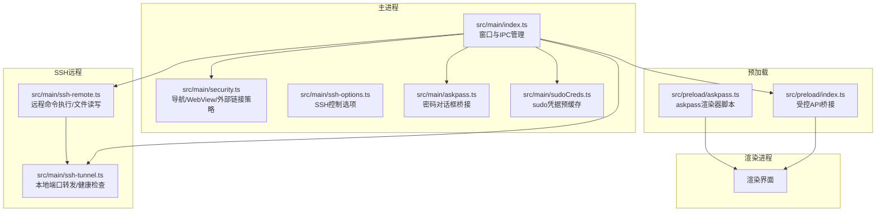
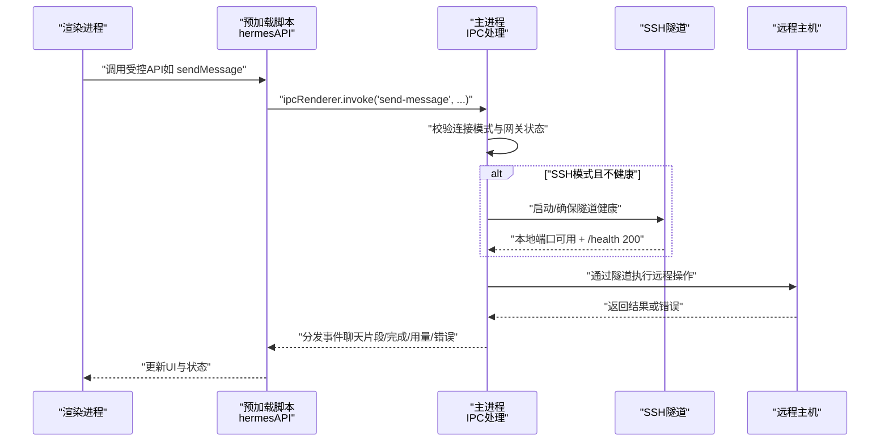
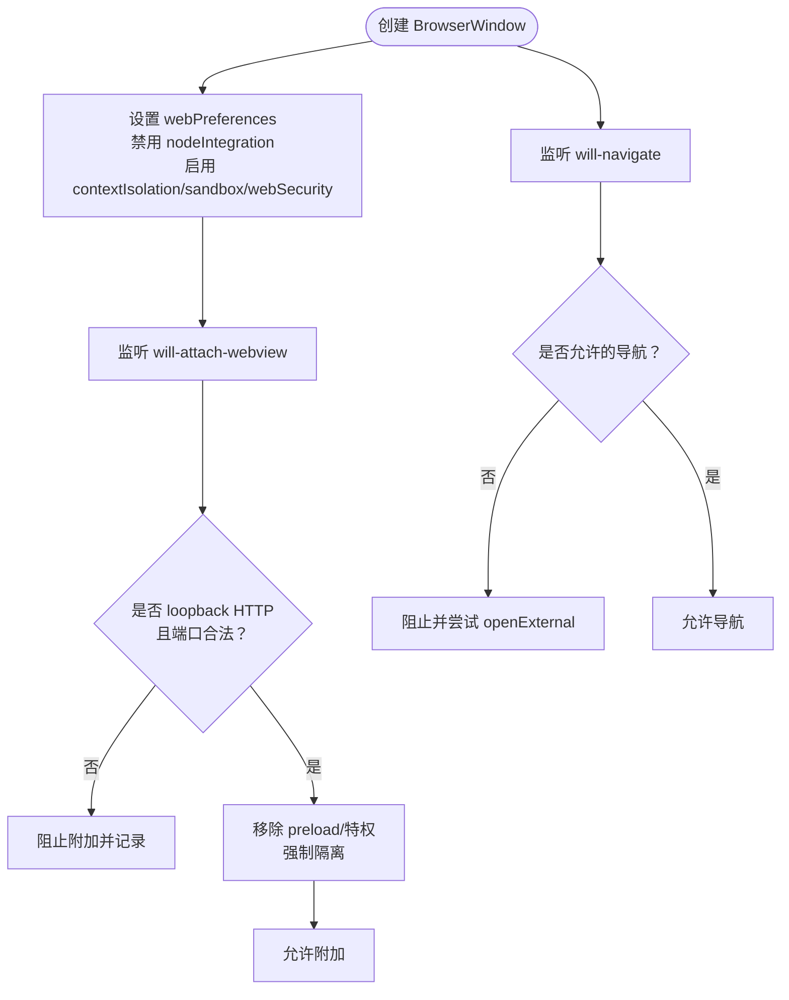
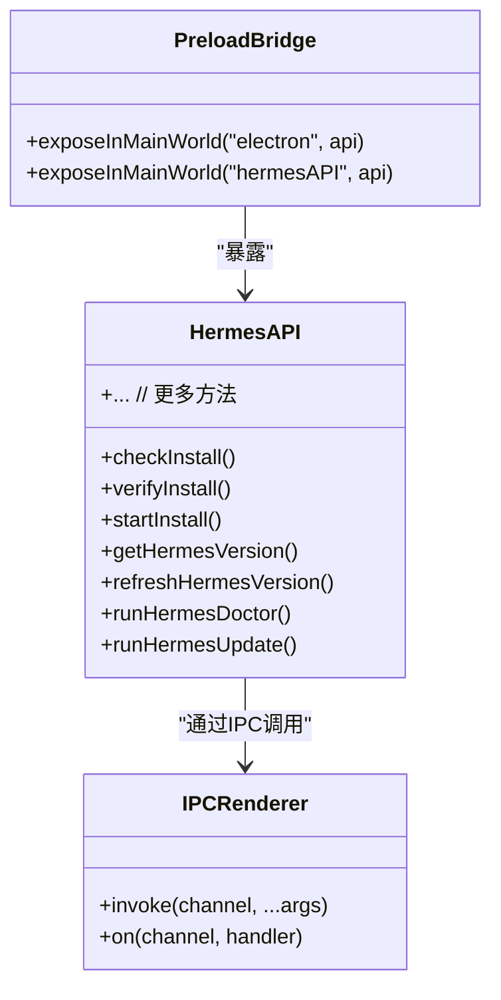
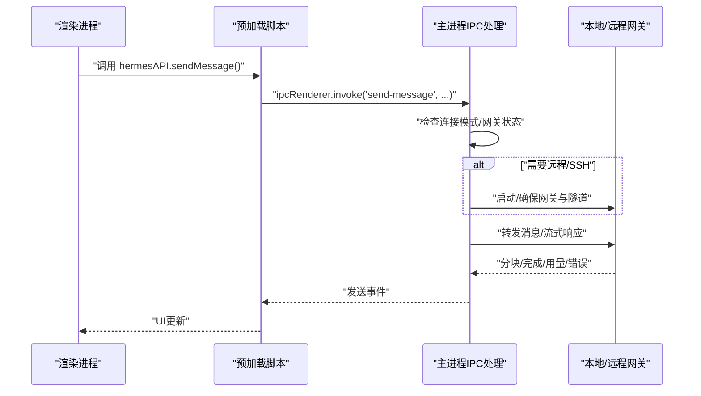
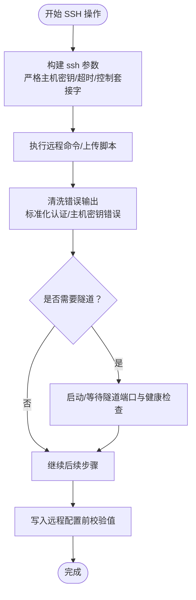
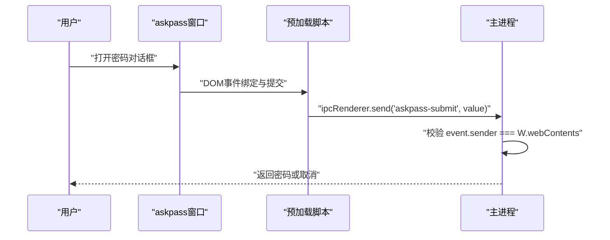
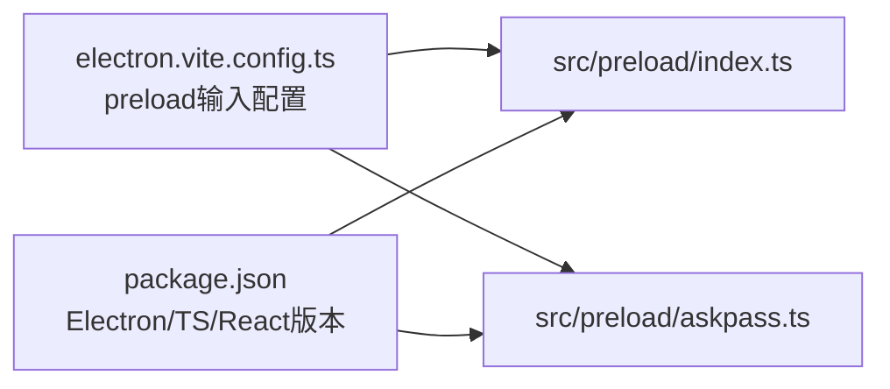

# 安全架构

<cite>
**本文档引用的文件**
- [src/main/security.ts](file://src/main/security.ts)
- [src/main/index.ts](file://src/main/index.ts)
- [src/preload/index.ts](file://src/preload/index.ts)
- [src/main/ssh-remote.ts](file://src/main/ssh-remote.ts)
- [src/main/ssh-tunnel.ts](file://src/main/ssh-tunnel.ts)
- [src/main/ssh-options.ts](file://src/main/ssh-options.ts)
- [src/main/askpass.ts](file://src/main/askpass.ts)
- [src/preload/askpass.ts](file://src/preload/askpass.ts)
- [src/shared/askpass.ts](file://src/shared/askpass.ts)
- [src/main/sudoCreds.ts](file://src/main/sudoCreds.ts)
- [tests/electron-security.test.ts](file://tests/electron-security.test.ts)
- [tests/preload-api-surface.test.ts](file://tests/preload-api-surface.test.ts)
- [tests/ssh-options.test.ts](file://tests/ssh-options.test.ts)
- [tests/ssh-remote.test.ts](file://tests/ssh-remote.test.ts)
- [tests/askpass-security.test.ts](file://tests/askpass-security.test.ts)
- [electron.vite.config.ts](file://electron.vite.config.ts)
- [package.json](file://package.json)
</cite>

## 目录
1. [简介](#简介)
2. [项目结构](#项目结构)
3. [核心组件](#核心组件)
4. [架构总览](#架构总览)
5. [详细组件分析](#详细组件分析)
6. [依赖关系分析](#依赖关系分析)
7. [性能考量](#性能考量)
8. [故障排除指南](#故障排除指南)
9. [结论](#结论)
10. [附录](#附录)

## 简介
本文件系统性阐述 Hermes Desktop 的安全架构与实现细节，覆盖上下文隔离、IPC 安全通信、SSH 连接安全与数据保护机制，并深入解析预加载脚本的安全模型、API 暴露策略与权限控制。文档同时提供安全测试方法、漏洞防护措施与最佳实践，帮助开发者构建安全可靠的桌面应用。

## 项目结构
Hermes Desktop 采用 Electron/Vite 架构，主进程负责系统级操作与安全策略执行，渲染进程承载 UI，预加载脚本通过 contextBridge 将受控 API 暴露给渲染进程。SSH 远程模式通过隧道与远程主机交互，密码输入与 sudo 凭据缓存采用专用对话框与沙箱策略。

**图表来源**
- [src/main/index.ts:196-288](file://src/main/index.ts#L196-L288)
- [src/main/security.ts:53-77](file://src/main/security.ts#L53-L77)
- [src/preload/index.ts:688-701](file://src/preload/index.ts#L688-L701)
- [src/main/ssh-remote.ts:37-65](file://src/main/ssh-remote.ts#L37-L65)
- [src/main/ssh-tunnel.ts:120-166](file://src/main/ssh-tunnel.ts#L120-L166)
- [src/main/askpass.ts:120-182](file://src/main/askpass.ts#L120-L182)
- [src/main/sudoCreds.ts:29-58](file://src/main/sudoCreds.ts#L29-L58)

**章节来源**
- [src/main/index.ts:196-288](file://src/main/index.ts#L196-L288)
- [src/main/security.ts:53-77](file://src/main/security.ts#L53-L77)
- [src/preload/index.ts:688-701](file://src/preload/index.ts#L688-L701)
- [electron.vite.config.ts:14-22](file://electron.vite.config.ts#L14-L22)

## 核心组件
- 上下文隔离与 WebView 硬化：主进程在创建 BrowserWindow/WebContents 时启用 contextIsolation、sandbox、webSecurity，并对 will-navigate、will-attach-webview 进行严格校验；附加的 webview 内容同样被强制移除特权并限制导航。
- 预加载脚本安全模型：仅通过 contextBridge 暴露受控 API（hermesAPI），确保渲染进程无法直接访问 Node.js/IPC 能力，除非经由明确的 IPC 调用通道。
- SSH 连接安全：通过 ssh 命令参数严格控制连接行为，使用控制套接字复用（非 Windows 平台）提升性能与安全性；隧道启动后进行端口可达性与健康检查；远程配置写入前进行值校验，防止 YAML 注入。
- 密码输入与 sudo 凭据：专用 askpass 对话框，通过 CSP 与最小权限策略限制渲染器能力；sudo 预缓存避免无终端场景下的死锁；提交通道绑定到特定 webContents，防止跨窗口伪造。

**章节来源**
- [src/main/security.ts:53-77](file://src/main/security.ts#L53-L77)
- [src/preload/index.ts:688-701](file://src/preload/index.ts#L688-L701)
- [src/main/ssh-tunnel.ts:120-166](file://src/main/ssh-tunnel.ts#L120-L166)
- [src/main/ssh-remote.ts:587-597](file://src/main/ssh-remote.ts#L587-L597)
- [src/main/askpass.ts:120-182](file://src/main/askpass.ts#L120-L182)
- [src/main/sudoCreds.ts:29-58](file://src/main/sudoCreds.ts#L29-L58)

## 架构总览
下图展示从渲染进程发起请求到主进程处理、必要时通过 SSH 隧道与远程主机交互的端到端流程，以及预加载脚本如何作为安全边界桥接 API。

**图表来源**
- [src/preload/index.ts:158-171](file://src/preload/index.ts#L158-L171)
- [src/main/index.ts:544-640](file://src/main/index.ts#L544-L640)
- [src/main/ssh-tunnel.ts:120-166](file://src/main/ssh-tunnel.ts#L120-L166)
- [src/main/ssh-remote.ts:37-65](file://src/main/ssh-remote.ts#L37-L65)

## 详细组件分析

### 组件A：上下文隔离与 WebView 安全
- 主进程在创建 BrowserWindow 时设置 webPreferences，禁用 nodeIntegration，启用 contextIsolation、sandbox、webSecurity，并禁止运行不安全内容。
- 对顶层导航进行白名单校验，仅允许打包后的渲染页面或开发服务器指定来源；阻止其他 file:/、http:/、https:/ 导航。
- 对 will-attach-webview 事件进行严格校验，仅允许 loopback HTTP（localhost/127.0.0.1/[::1]）且端口在 1024-65535 范围内的 URL；附加前移除 preload、node 集成等特权。
- 附加的 webContents 通过 hardenAttachedWebContents 在运行期进一步限制 window 打开、导航与重定向。

**图表来源**
- [src/main/index.ts:196-288](file://src/main/index.ts#L196-L288)
- [src/main/security.ts:25-51](file://src/main/security.ts#L25-L51)
- [src/main/security.ts:53-77](file://src/main/security.ts#L53-L77)

**章节来源**
- [src/main/index.ts:196-288](file://src/main/index.ts#L196-L288)
- [src/main/security.ts:25-51](file://src/main/security.ts#L25-L51)
- [src/main/security.ts:53-77](file://src/main/security.ts#L53-L77)
- [tests/electron-security.test.ts:18-70](file://tests/electron-security.test.ts#L18-L70)

### 组件B：预加载脚本的安全模型与 API 暴露策略
- 预加载脚本通过 contextBridge.exposeInMainWorld 暴露两个对象：process 元信息（只读）与 hermesAPI（受控方法集合）。若 contextIsolated 为假，则回退到 window 对象注入，但代码仍保持最小暴露面。
- hermesAPI 方法均通过 ipcRenderer.invoke 发起 IPC 请求，事件名采用短横线命名规范，便于审计与测试一致性验证。
- 类型声明与实现一一对应，确保类型安全与接口稳定性。

**图表来源**
- [src/preload/index.ts:4-13](file://src/preload/index.ts#L4-L13)
- [src/preload/index.ts:15-686](file://src/preload/index.ts#L15-L686)

**章节来源**
- [src/preload/index.ts:688-701](file://src/preload/index.ts#L688-L701)
- [tests/preload-api-surface.test.ts:45-63](file://tests/preload-api-surface.test.ts#L45-L63)
- [tests/preload-api-surface.test.ts:193-212](file://tests/preload-api-surface.test.ts#L193-L212)

### 组件C：IPC 安全通信与权限控制
- 主进程通过 ipcMain.handle 为每个 hermesAPI 方法提供处理函数，统一在入口处进行连接模式判断（本地/远程/SSH）与前置条件检查（如启动网关、确保隧道健康）。
- 对敏感操作（如设置环境变量、配置项、模型配置）进行条件重启网关以生效变更，避免未授权或不一致状态。
- 外部链接打开统一走 isAllowedExternalUrl 白名单校验，防止恶意协议与文件路径泄露。

**图表来源**
- [src/main/index.ts:544-640](file://src/main/index.ts#L544-L640)
- [src/main/index.ts:185-194](file://src/main/index.ts#L185-L194)

**章节来源**
- [src/main/index.ts:290-899](file://src/main/index.ts#L290-L899)
- [src/main/index.ts:185-194](file://src/main/index.ts#L185-L194)

### 组件D：SSH 连接安全与远程操作
- SSH 执行：使用严格参数构建（批处理模式、严格主机密钥检查、连接超时、控制套接字），支持 Python 脚本在远端执行与安全错误清洗。
- 隧道管理：自动选择空闲本地端口，等待端口就绪与健康检查（/health），失败时自动清理；提供测试连接功能验证连通性与远程健康。
- 远程配置写入：对 YAML 值进行非法字符校验，拒绝包含引号、反斜杠、换行等可能破坏配置的内容，防止注入攻击。
- 控制选项：Windows 平台禁用 SSH 复用以规避兼容性问题，其他平台启用自动复用与持久化，提升性能与安全性。

**图表来源**
- [src/main/ssh-remote.ts:24-65](file://src/main/ssh-remote.ts#L24-L65)
- [src/main/ssh-tunnel.ts:120-166](file://src/main/ssh-tunnel.ts#L120-L166)
- [src/main/ssh-remote.ts:587-597](file://src/main/ssh-remote.ts#L587-L597)
- [src/main/ssh-options.ts:1-22](file://src/main/ssh-options.ts#L1-L22)

**章节来源**
- [src/main/ssh-remote.ts:24-65](file://src/main/ssh-remote.ts#L24-L65)
- [src/main/ssh-tunnel.ts:120-166](file://src/main/ssh-tunnel.ts#L120-L166)
- [src/main/ssh-remote.ts:587-597](file://src/main/ssh-remote.ts#L587-L597)
- [src/main/ssh-options.ts:1-22](file://src/main/ssh-options.ts#L1-L22)
- [tests/ssh-options.test.ts:4-26](file://tests/ssh-options.test.ts#L4-L26)
- [tests/ssh-remote.test.ts:14-25](file://tests/ssh-remote.test.ts#L14-L25)

### 组件E：密码输入与 sudo 凭据缓存
- askpass 对话框：专用窗口，禁用 nodeIntegration/contextIsolation/sandbox/webviewTag，使用 CSP 严格限制脚本执行；通过预加载脚本收集用户输入并通过专用 IPC 通道提交，且限定仅来自该窗口 webContents。
- sudo 凭据预缓存：Linux 平台优先尝试非交互 sudo 验证，否则弹出对话框；成功后启动后台保活定时器刷新缓存，安装完成后清理缓存。
- askpass 渲染器脚本：最小化 DOM 事件绑定，仅处理确认/取消与回车/ESC 键盘事件，避免内联脚本与外部依赖。

**图表来源**
- [src/main/askpass.ts:120-182](file://src/main/askpass.ts#L120-L182)
- [src/preload/askpass.ts:8-27](file://src/preload/askpass.ts#L8-L27)
- [src/shared/askpass.ts:1](file://src/shared/askpass.ts#L1)
- [src/main/sudoCreds.ts:29-58](file://src/main/sudoCreds.ts#L29-L58)

**章节来源**
- [src/main/askpass.ts:120-182](file://src/main/askpass.ts#L120-L182)
- [src/preload/askpass.ts:8-27](file://src/preload/askpass.ts#L8-L27)
- [src/shared/askpass.ts:1](file://src/shared/askpass.ts#L1)
- [src/main/sudoCreds.ts:29-58](file://src/main/sudoCreds.ts#L29-L58)
- [tests/askpass-security.test.ts:18-94](file://tests/askpass-security.test.ts#L18-L94)

## 依赖关系分析
- 预加载入口配置：electron-vite 将 src/preload/index.ts 与 src/preload/askpass.ts 分别构建为独立入口，确保 askpass 对话框拥有独立的最小化预加载脚本。
- 依赖与版本：项目使用 Electron 42、TypeScript 5、React 19 等现代技术栈，配合 Vitest 进行单元测试与快照验证。

**图表来源**
- [electron.vite.config.ts:14-22](file://electron.vite.config.ts#L14-L22)
- [package.json:27-68](file://package.json#L27-L68)

**章节来源**
- [electron.vite.config.ts:14-22](file://electron.vite.config.ts#L14-L22)
- [package.json:27-68](file://package.json#L27-L68)

## 性能考量
- SSH 复用：非 Windows 平台启用 ControlMaster/ControlPath/ControlPersist，减少握手开销，提高并发效率。
- 隧道健康检查：启动后进行端口可达性与 /health 接口轮询，确保服务可用后再进行业务操作，避免无效等待。
- 预加载最小化：askpass 预加载脚本仅包含必要逻辑，降低内存占用与启动时间。
- 类型与测试驱动：严格的类型声明与测试覆盖保证 API 表面稳定，减少运行期错误导致的性能损耗。

[本节为通用指导，无需具体文件分析]

## 故障排除指南
- 外部链接被拦截：确认 URL 符合 isAllowedExternalUrl 白名单（https/http/mailto），否则会被阻止并记录安全警告。
- WebView 无法附加：检查 src 属性是否为 loopback HTTP 且端口在 1024-65535 范围内，附加前已移除 preload 与特权。
- SSH 连接失败：查看错误清洗后的提示（认证失败/主机密钥验证失败），核对密钥路径、主机与端口配置。
- 隧道不可用：确认本地端口已开放且 /health 返回 200，必要时重新启动隧道。
- askpass 不响应：确认仅来自目标窗口 webContents 的提交事件，检查 CSP 与预加载脚本是否正确加载。

**章节来源**
- [src/main/index.ts:185-194](file://src/main/index.ts#L185-L194)
- [src/main/security.ts:44-51](file://src/main/security.ts#L44-L51)
- [src/main/ssh-remote.ts:74-89](file://src/main/ssh-remote.ts#L74-L89)
- [src/main/ssh-tunnel.ts:120-166](file://src/main/ssh-tunnel.ts#L120-L166)
- [tests/askpass-security.test.ts:47-59](file://tests/askpass-security.test.ts#L47-L59)

## 结论
Hermes Desktop 通过严格的上下文隔离、受控的预加载 API 暴露、可信的 WebView 策略、安全的 SSH 通道与隧道、以及专用的密码与 sudo 流程，构建了完整的桌面应用安全基线。结合全面的测试覆盖与类型约束，项目在功能完整性与安全性之间取得了良好平衡，为开发者提供了可复用的安全实践范式。

[本节为总结性内容，无需具体文件分析]

## 附录
- 安全测试清单
  - 上下文隔离与 WebView：验证 webPreferences 默认值、导航与 webview 附件策略。
  - 预加载 API：确认方法数量、类型声明一致性与 IPC 通道命名规范。
  - SSH 选项与远程写入：验证 Windows 平台禁用复用、远程配置值校验。
  - askpass 安全：验证 CSP、最小权限、提交通道绑定与对话框行为。
- 最佳实践建议
  - 始终启用 contextIsolation/sandbox/webSecurity，禁用 nodeIntegration。
  - 使用白名单策略控制导航与 webview 附件，严格校验 URL 与端口范围。
  - 对所有 IPC 通道进行统一入口校验与错误处理，避免直接暴露系统调用。
  - SSH 参数最小化，启用严格主机密钥检查与超时控制，定期健康检查。
  - 密码输入与敏感操作使用专用对话框与 CSP，避免内联脚本与外部依赖。

[本节为通用指导，无需具体文件分析]