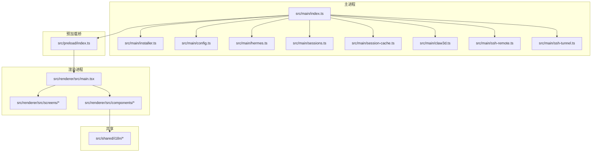
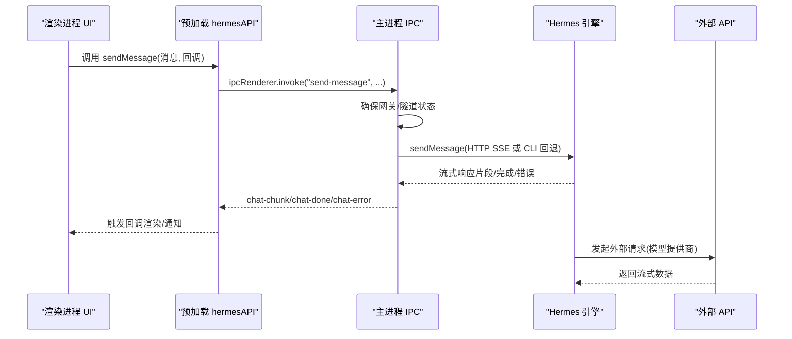
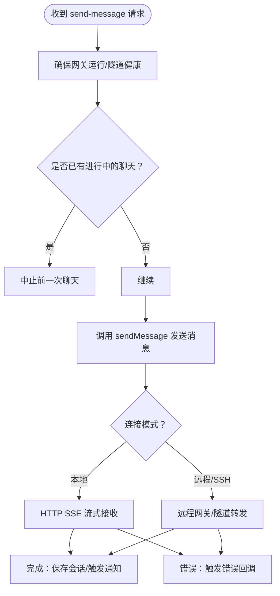
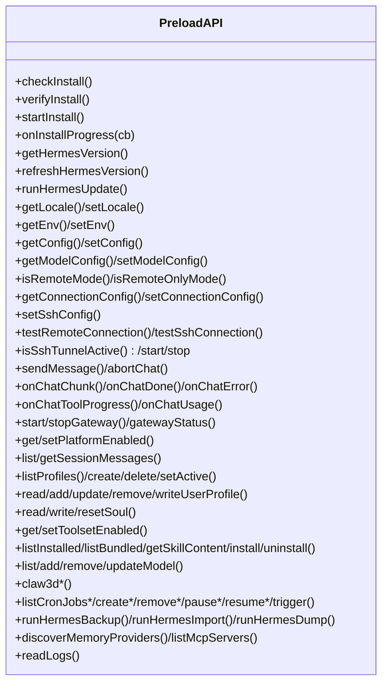
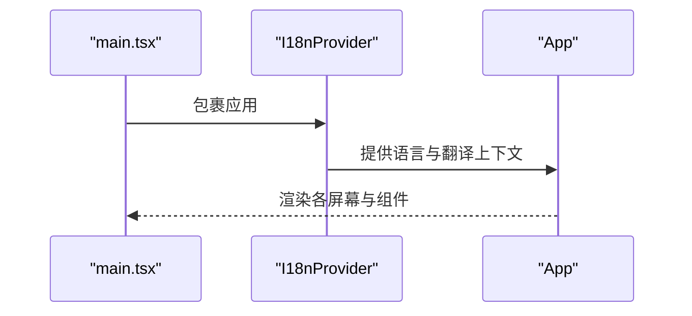
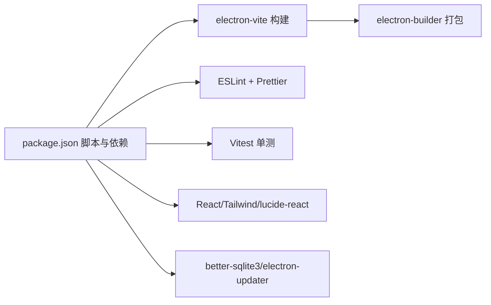

# 开发指南

<cite>
**本文引用的文件**
- [package.json](file://package.json)
- [README.md](file://README.md)
- [CONTRIBUTING.md](file://CONTRIBUTING.md)
- [electron.vite.config.ts](file://electron.vite.config.ts)
- [eslint.config.mjs](file://eslint.config.mjs)
- [vitest.config.ts](file://vitest.config.ts)
- [tsconfig.json](file://tsconfig.json)
- [tsconfig.node.json](file://tsconfig.node.json)
- [tsconfig.web.json](file://tsconfig.web.json)
- [electron-builder.yml](file://electron-builder.yml)
- [src/main/index.ts](file://src/main/index.ts)
- [src/preload/index.ts](file://src/preload/index.ts)
- [src/renderer/src/main.tsx](file://src/renderer/src/main.tsx)
- [src/shared/i18n/config.ts](file://src/shared/i18n/config.ts)
- [tests/session-cache-sync.test.ts](file://tests/session-cache-sync.test.ts)
- [docs/hermes-desktop-architecture.md](file://docs/hermes-desktop-architecture.md)
</cite>

## 目录
1. [简介](#简介)
2. [项目结构](#项目结构)
3. [核心组件](#核心组件)
4. [架构总览](#架构总览)
5. [详细组件分析](#详细组件分析)
6. [依赖分析](#依赖分析)
7. [性能考虑](#性能考虑)
8. [故障排除指南](#故障排除指南)
9. [结论](#结论)
10. [附录](#附录)

## 简介
本指南面向新加入的开发者，提供从零开始的完整开发环境搭建、代码规范、构建与测试流程、质量保证方法以及版本控制与贡献流程。项目基于 Electron + React + TypeScript，采用 Vite + electron-vite 进行开发与打包，并通过 electron-builder 输出多平台安装包。

## 项目结构
项目采用“主进程 + 预加载桥 + 渲染进程”的经典 Electron 结构，配合共享国际化与类型定义，形成清晰的职责边界与模块化组织。

图表来源
- [src/main/index.ts:1-1234](file://src/main/index.ts#L1-L1234)
- [src/preload/index.ts:1-701](file://src/preload/index.ts#L1-L701)
- [src/renderer/src/main.tsx:1-15](file://src/renderer/src/main.tsx#L1-L15)
- [src/shared/i18n/config.ts:1-7](file://src/shared/i18n/config.ts#L1-L7)

章节来源
- [README.md:178-282](file://README.md#L178-L282)
- [docs/hermes-desktop-architecture.md:18-39](file://docs/hermes-desktop-architecture.md#L18-L39)

## 核心组件
- 主进程入口与 IPC 总控：负责窗口创建、菜单、自动更新、异常捕获以及 50+ IPC 处理器注册。
- 预加载桥：通过 contextBridge 暴露 hermesAPI 到渲染进程，统一 IPC 方法签名与回调。
- 渲染进程：React 应用入口，I18nProvider 包裹，屏幕与组件按功能模块划分。
- 共享国际化：集中管理语言枚举与默认配置，支持多语言资源。

章节来源
- [src/main/index.ts:1-1234](file://src/main/index.ts#L1-L1234)
- [src/preload/index.ts:1-701](file://src/preload/index.ts#L1-L701)
- [src/renderer/src/main.tsx:1-15](file://src/renderer/src/main.tsx#L1-L15)
- [src/shared/i18n/config.ts:1-7](file://src/shared/i18n/config.ts#L1-L7)

## 架构总览
下图展示从用户交互到后端服务的关键数据流与模块协作：

图表来源
- [src/preload/index.ts:158-174](file://src/preload/index.ts#L158-L174)
- [src/main/index.ts:544-640](file://src/main/index.ts#L544-L640)
- [docs/hermes-desktop-architecture.md:220-251](file://docs/hermes-desktop-architecture.md#L220-L251)

## 详细组件分析

### 组件A：主进程 IPC 与聊天流程
- 职责：注册 50+ IPC 处理器，管理聊天生命周期、网关启停、SSH 隧道、会话与配置等。
- 关键点：异常捕获、安全导航与外链打开、webview 附加校验、渲染进程崩溃监控。
- 数据流：sendMessage -> hermes.ts -> SSE/CLI -> 回调事件 -> 渲染层更新。

图表来源
- [src/main/index.ts:544-640](file://src/main/index.ts#L544-L640)

章节来源
- [src/main/index.ts:174-288](file://src/main/index.ts#L174-L288)
- [src/main/index.ts:290-640](file://src/main/index.ts#L290-L640)

### 组件B：预加载桥 hermesAPI
- 职责：将主进程 IPC 方法以强类型暴露给渲染进程，统一事件监听与移除。
- 关键点：安装进度、聊天片段、工具进度、用量统计、更新事件等回调。
- 设计：每个功能分组（安装、聊天、配置、会话、Profile、记忆、人格、工具、技能、模型、Claw3D、定时任务、备份导入、MCP、日志等）对应一组 invoke/on 方法。

图表来源
- [src/preload/index.ts:1-701](file://src/preload/index.ts#L1-L701)

章节来源
- [src/preload/index.ts:1-701](file://src/preload/index.ts#L1-L701)

### 组件C：渲染进程应用入口与国际化
- 职责：React 根节点挂载，I18nProvider 提供多语言上下文。
- 关键点：严格模式、主题与错误边界在更高层组件中提供。

图表来源
- [src/renderer/src/main.tsx:1-15](file://src/renderer/src/main.tsx#L1-L15)

章节来源
- [src/renderer/src/main.tsx:1-15](file://src/renderer/src/main.tsx#L1-L15)
- [src/shared/i18n/config.ts:1-7](file://src/shared/i18n/config.ts#L1-L7)

## 依赖分析
- 构建与打包：electron-vite、typescript、electron-builder
- 前端：React 19、TailwindCSS 4、lucide-react、react-markdown、react-i18next
- 后端：better-sqlite3、electron-updater、@electron-toolkit 工具集
- 开发工具：ESLint + Prettier、Vitest、Vite

图表来源
- [package.json:1-70](file://package.json#L1-L70)
- [electron.vite.config.ts:1-33](file://electron.vite.config.ts#L1-L33)
- [eslint.config.mjs:1-33](file://eslint.config.mjs#L1-L33)
- [vitest.config.ts:1-19](file://vitest.config.ts#L1-L19)
- [electron-builder.yml:1-58](file://electron-builder.yml#L1-L58)

章节来源
- [package.json:1-70](file://package.json#L1-L70)
- [tsconfig.json:1-5](file://tsconfig.json#L1-L5)
- [tsconfig.node.json:1-14](file://tsconfig.node.json#L1-L14)
- [tsconfig.web.json:1-20](file://tsconfig.web.json#L1-L20)

## 性能考虑
- 会话缓存同步：单元测试覆盖了大缓存场景下的 O(N) 同步优化，避免二次方开销。
- 构建与打包：electron-vite 提供快速热更新与构建；electron-builder 针对不同平台输出优化包体。
- 渲染性能：React 19 与 TailwindCSS 4 的组合减少运行时开销；Markdown 与代码高亮按需渲染。

章节来源
- [tests/session-cache-sync.test.ts:345-371](file://tests/session-cache-sync.test.ts#L345-L371)
- [README.md:255-264](file://README.md#L255-L264)

## 故障排除指南
- 聊天 401 错误
  - 检查模型提供商与 API 密钥配置是否一致
  - 使用 curl 直接验证外部 API 可达性
- Office 连接超时
  - 检查端口占用：8642（Hermes 网关）、3000（Claw3D）、18789（Adapter）
  - 先发送一次聊天以确保网关已启动
  - 确认 Claw3D 配置文件 gateway.url 格式正确
- Dev server 退出码异常
  - Windows 下避免通过 cmd.exe 调用，直接 node server/index.js --dev
- 安装与更新
  - 首次运行可能需要网络下载 Hermes；若受限于网络，可参考 README 的替代镜像与 WSL 密码提示

章节来源
- [docs/hermes-desktop-architecture.md:345-374](file://docs/hermes-desktop-architecture.md#L345-L374)
- [README.md:50-78](file://README.md#L50-L78)

## 结论
本指南提供了从环境搭建到日常开发、测试与发布的完整路径。建议新开发者先完成依赖安装与首次运行，再逐步熟悉主进程 IPC、预加载桥与渲染进程的协作方式，最后结合测试与质量工具提升交付质量。

## 附录

### 开发环境搭建
- 前置条件
  - Node.js 与 npm（推荐使用 nvm）
  - Unix-like shell（用于首次安装时的 Hermes 安装脚本）
  - 网络访问权限（首次安装会拉取 Hermes）
- 安装依赖
  - 使用 npm 安装项目依赖
- 启动开发服务器
  - 开发模式：运行 dev 脚本
  - 新手模式：dev:fresh 脚本提供全新 HERMES_HOME 环境
- 调试配置
  - 主进程：VS Code 可附加 Electron 进程调试
  - 渲染进程：浏览器开发者工具
  - 预加载桥：通过 window.hermesAPI 在控制台查看可用方法

章节来源
- [README.md:180-216](file://README.md#L180-L216)
- [package.json:8-26](file://package.json#L8-L26)

### 代码规范与最佳实践
- 代码风格
  - 使用 ESLint 与 Prettier，遵循 flat 配置
  - React Hooks 与 React Refresh 规则已启用
- 类型安全
  - TypeScript 多项目配置分离（Node/Web），分别进行类型检查
- 命名约定
  - 主进程模块：功能模块化，如 installer、config、hermes、sessions 等
  - 预加载桥：统一以 hermesAPI 方法命名，按功能分组
  - 渲染进程：屏幕与组件采用 PascalCase，文件夹按功能划分
- 国际化
  - 使用 i18next，语言枚举集中管理，新增语言需补充资源文件

章节来源
- [eslint.config.mjs:1-33](file://eslint.config.mjs#L1-L33)
- [tsconfig.node.json:1-14](file://tsconfig.node.json#L1-L14)
- [tsconfig.web.json:1-20](file://tsconfig.web.json#L1-L20)
- [src/shared/i18n/config.ts:1-7](file://src/shared/i18n/config.ts#L1-L7)

### 构建流程与发布
- 本地构建
  - 类型检查：分别执行 node/web 类型检查
  - 构建：运行 build 脚本
- 平台打包
  - macOS：build:mac
  - Windows：build:win
  - Linux：build:linux；RPM：build:rpm
- 打包配置
  - electron-builder.yml 定义应用 ID、产品名、图标、权限、目标平台与发布渠道

章节来源
- [package.json:14-25](file://package.json#L14-L25)
- [electron-builder.yml:1-58](file://electron-builder.yml#L1-L58)

### 测试策略与质量保证
- 单元测试
  - Vitest 配置别名与 jsdom 环境
  - 覆盖关键模块：会话缓存同步、SSE 解析、IPC 表面、安全校验等
- 质量工具
  - ESLint + Prettier：统一风格与规则
  - 类型检查：双配置并行，确保主/渲染进程类型安全

章节来源
- [vitest.config.ts:1-19](file://vitest.config.ts#L1-L19)
- [tests/session-cache-sync.test.ts:1-372](file://tests/session-cache-sync.test.ts#L1-L372)
- [eslint.config.mjs:1-33](file://eslint.config.mjs#L1-L33)

### 开发工作流程与版本控制
- 分支与提交
  - 从 main 派生功能分支，保持一次逻辑变更一个提交
  - 提交信息聚焦、描述清晰，必要时关联 Issue
- 代码审查
  - 保持 PR 粒度小而专一，便于评审与合并
- 质量门禁
  - 本地运行 lint 与 typecheck，确保通过后再提交
  - 运行测试覆盖关键路径

章节来源
- [CONTRIBUTING.md:1-104](file://CONTRIBUTING.md#L1-L104)

### 常见开发任务操作步骤
- 首次运行与安装
  - 安装依赖后运行 dev，首次启动会引导安装或连接 Hermes
- 添加新的 IPC 接口
  - 在主进程 src/main/index.ts 注册 ipcMain.handle
  - 在 src/preload/index.ts 暴露对应 hermesAPI 方法
  - 在渲染进程调用 window.hermesAPI 并处理回调
- 新增屏幕与路由
  - 在 src/renderer/src/screens 下创建新屏幕组件
  - 在应用状态机中添加导航逻辑（当前为自研状态机）
- 国际化扩展
  - 在 src/shared/i18n/locales 下新增语言目录与翻译键
  - 更新语言枚举与默认语言配置

章节来源
- [README.md:227-254](file://README.md#L227-L254)
- [src/main/index.ts:290-640](file://src/main/index.ts#L290-L640)
- [src/preload/index.ts:1-701](file://src/preload/index.ts#L1-L701)
- [src/shared/i18n/config.ts:1-7](file://src/shared/i18n/config.ts#L1-L7)