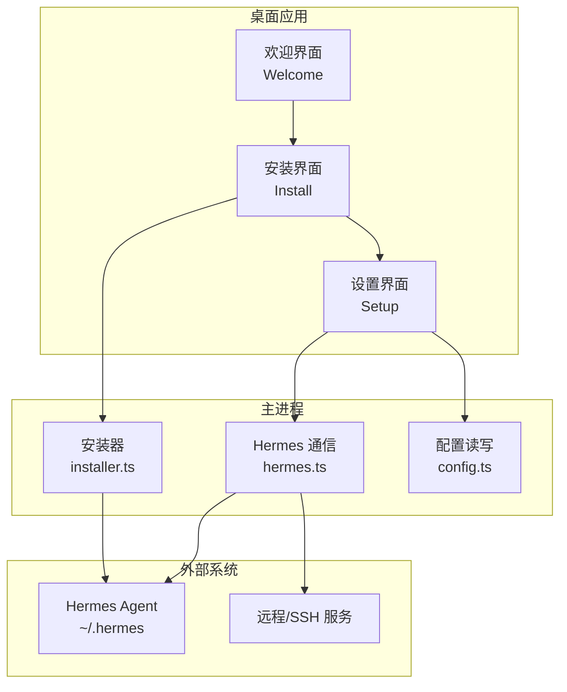
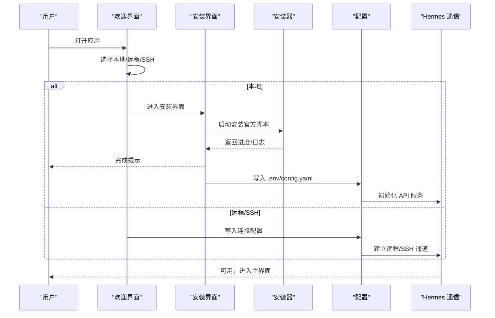
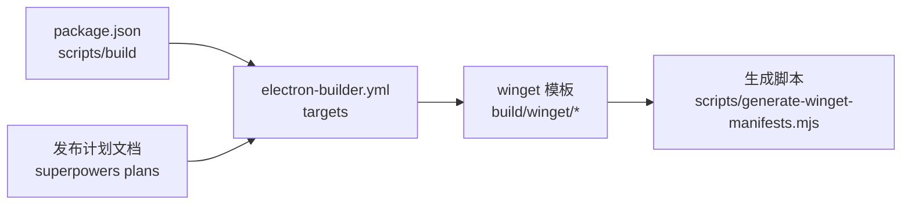

# 快速开始

<cite>
**本文引用的文件**
- [README.md](file://README.md)
- [package.json](file://package.json)
- [electron-builder.yml](file://electron-builder.yml)
- [scripts/generate-winget-manifests.mjs](file://scripts/generate-winget-manifests.mjs)
- [src/main/installer.ts](file://src/main/installer.ts)
- [src/main/hermes.ts](file://src/main/hermes.ts)
- [src/main/config.ts](file://src/main/config.ts)
- [src/renderer/src/screens/Welcome/Welcome.tsx](file://src/renderer/src/screens/Welcome/Welcome.tsx)
- [src/renderer/src/screens/Install/Install.tsx](file://src/renderer/src/screens/Install/Install.tsx)
- [src/renderer/src/screens/Setup/Setup.tsx](file://src/renderer/src/screens/Setup/Setup.tsx)
- [src/renderer/src/constants.ts](file://src/renderer/src/constants.ts)
- [docs/superpowers/plans/2026-04-30-windows-winget-fedora-rpm-release.md](file://docs/superpowers/plans/2026-04-30-windows-winget-fedora-rpm-release.md)
</cite>

## 目录
1. [简介](#简介)
2. [项目结构](#项目结构)
3. [核心组件](#核心组件)
4. [架构总览](#架构总览)
5. [详细组件分析](#详细组件分析)
6. [依赖关系分析](#依赖关系分析)
7. [性能与可用性建议](#性能与可用性建议)
8. [常见问题排查](#常见问题排查)
9. [结论](#结论)
10. [附录：基本使用示例](#附录基本使用示例)

## 简介
本指南面向首次使用 Hermes Desktop 的用户，覆盖以下内容：
- 不同平台的安装方式（Windows winget、macOS、Linux 各发行版）
- 首次运行的完整流程（从应用启动到完成初始配置）
- 本地安装与远程连接两种模式的选择与配置
- 常见安装问题的解决方案（Windows SmartScreen、macOS 应用打开、WSL 环境等）
- 基本使用示例（聊天、会话管理、基础配置）

## 项目结构
Hermes Desktop 是基于 Electron + React 的跨平台桌面应用，主要由主进程（main）与渲染进程（renderer）组成，并通过打包工具生成各平台安装包。关键特性包括：
- 跨平台安装包：Windows（NSIS 安装器）、macOS（DMG）、Linux（AppImage、deb、rpm）
- 首次运行引导：检测或安装 Hermes Agent，选择本地或远程模式，配置模型与密钥
- 远程/SSH 模式：无需暴露端口，直接通过 SSH 隧道访问远端 Hermes
- 流式聊天：支持 SSE 实时流式响应，展示工具进度、Markdown 渲染与令牌用量

图表来源
- [src/renderer/src/screens/Welcome/Welcome.tsx:1-415](file://src/renderer/src/screens/Welcome/Welcome.tsx#L1-415)
- [src/renderer/src/screens/Install/Install.tsx:1-171](file://src/renderer/src/screens/Install/Install.tsx#L1-171)
- [src/renderer/src/screens/Setup/Setup.tsx:1-275](file://src/renderer/src/screens/Setup/Setup.tsx#L1-275)
- [src/main/installer.ts:1-800](file://src/main/installer.ts#L1-800)
- [src/main/hermes.ts:1-800](file://src/main/hermes.ts#L1-800)
- [src/main/config.ts:1-440](file://src/main/config.ts#L1-440)

章节来源
- [README.md:28-131](file://README.md#L28-L131)
- [package.json:1-70](file://package.json#L1-L70)
- [electron-builder.yml:1-58](file://electron-builder.yml#L1-L58)

## 核心组件
- 安装器（主进程）：负责检测/安装 Hermes、解析安装输出阶段、处理 sudo 权限、生成增强 PATH、执行更新/迁移等
- Hermes 通信（主进程）：根据连接模式（本地/远程/SSH）选择 HTTP API 或 CLI，解析 SSE 流，注入模型与密钥，管理网关进程
- 配置（主进程）：读写 desktop.json、.env、config.yaml、auth.json，缓存与校验键值
- 渲染层（欢迎/安装/设置）：引导用户选择本地/远程/SSH，显示安装进度与日志，收集模型与密钥，保存配置

章节来源
- [src/main/installer.ts:1-800](file://src/main/installer.ts#L1-L800)
- [src/main/hermes.ts:1-800](file://src/main/hermes.ts#L1-L800)
- [src/main/config.ts:1-440](file://src/main/config.ts#L1-L440)
- [src/renderer/src/screens/Welcome/Welcome.tsx:1-415](file://src/renderer/src/screens/Welcome/Welcome.tsx#L1-L415)
- [src/renderer/src/screens/Install/Install.tsx:1-171](file://src/renderer/src/screens/Install/Install.tsx#L1-L171)
- [src/renderer/src/screens/Setup/Setup.tsx:1-275](file://src/renderer/src/screens/Setup/Setup.tsx#L1-L275)

## 架构总览
首次运行的核心流程如下：
1. 应用启动，进入“欢迎”界面，询问本地/远程/SSH 三种模式
2. 若选择本地：检查 ~/.hermes 是否已存在；若不存在则调用官方安装脚本进行安装
3. 安装完成后进入“设置”界面，选择提供商或本地模型，填写 API Key 或本地服务器地址
4. 保存配置后，进入主工作区（聊天/会话/工具等）

图表来源
- [src/renderer/src/screens/Welcome/Welcome.tsx:1-415](file://src/renderer/src/screens/Welcome/Welcome.tsx#L1-L415)
- [src/renderer/src/screens/Install/Install.tsx:1-171](file://src/renderer/src/screens/Install/Install.tsx#L1-L171)
- [src/main/installer.ts:517-650](file://src/main/installer.ts#L517-L650)
- [src/main/config.ts:47-74](file://src/main/config.ts#L47-L74)
- [src/main/hermes.ts:22-62](file://src/main/hermes.ts#L22-L62)

章节来源
- [README.md:120-131](file://README.md#L120-L131)

## 详细组件分析

### 安装与首次运行（主进程）
- 安装器职责
  - 检测当前平台，准备增强 PATH，处理 Windows PowerShell 与 Unix Shell 的差异
  - 运行官方安装脚本（bash 或 powershell），解析输出以识别安装阶段，实时回传进度
  - 在 Linux 上预热 sudo 凭据缓存，避免 Playwright 安装依赖时因无 TTY 而卡住
  - 支持更新/迁移/医生诊断等维护操作
- 关键实现要点
  - 安装阶段识别：通过正则匹配安装脚本输出中的关键阶段词，映射为 UI 步骤标题
  - 路径与环境：在 Windows 使用捆绑的 Git/Node/uv/cargo 等路径，在 Unix 使用 nvm/asdf/volta 等版本管理器路径
  - 错误容忍：即使安装脚本返回非零状态，只要二进制树存在即视为成功

章节来源
- [src/main/installer.ts:470-516](file://src/main/installer.ts#L470-L516)
- [src/main/installer.ts:517-650](file://src/main/installer.ts#L517-L650)
- [src/main/installer.ts:676-799](file://src/main/installer.ts#L676-L799)

### 连接模式与配置（主进程）
- 连接模式
  - 本地：默认监听 127.0.0.1:8642，自动确保 API 服务启用
  - 远程：指定远程 URL 与可选 API Key，通过 HTTP API 访问
  - SSH：建立本地到远端的隧道，无需暴露端口与密钥
- 配置持久化
  - desktop.json 存储连接模式、远程 URL/Key、SSH 参数
  - .env 与 config.yaml 存储模型提供商、默认模型、Base URL、启用流式等
  - auth.json 支持凭据池（OAuth 等场景）

章节来源
- [src/main/hermes.ts:22-62](file://src/main/hermes.ts#L22-L62)
- [src/main/config.ts:47-74](file://src/main/config.ts#L47-L74)
- [src/main/config.ts:248-301](file://src/main/config.ts#L248-L301)

### 渲染层：欢迎/安装/设置
- 欢迎界面
  - 提供本地安装、远程连接、SSH 连接三种入口
  - 支持手动测试远程/SSH 连通性，失败时给出明确提示
- 安装界面
  - 显示安装进度条、步骤标题、细节与完整日志
  - 失败时提供重试、复制日志、加入社区等操作
- 设置界面
  - 提供 OpenRouter、Anthropic、OpenAI、Google、xAI、Nous Portal、Qwen、MiniMax、Hugging Face、Groq 等多家提供商
  - 支持本地/自定义模型（LM Studio、Ollama、vLLM、llama.cpp 等预设）
  - 自动推断 API Key 环境变量名，保存至 .env 并写入 config.yaml

章节来源
- [src/renderer/src/screens/Welcome/Welcome.tsx:1-415](file://src/renderer/src/screens/Welcome/Welcome.tsx#L1-L415)
- [src/renderer/src/screens/Install/Install.tsx:1-171](file://src/renderer/src/screens/Install/Install.tsx#L1-L171)
- [src/renderer/src/screens/Setup/Setup.tsx:1-275](file://src/renderer/src/screens/Setup/Setup.tsx#L1-L275)
- [src/renderer/src/constants.ts:17-129](file://src/renderer/src/constants.ts#L17-L129)

### 聊天与流式响应（主进程）
- 本地模式优先走 HTTP API（127.0.0.1:8642），失败时回退到 CLI
- 远程/SSH 模式直接走远程 URL，支持 SSE 事件（含工具进度）
- 解析 SSE 数据块，提取 usage 信息与工具进度，实时渲染

章节来源
- [src/main/hermes.ts:168-434](file://src/main/hermes.ts#L168-L434)
- [src/main/hermes.ts:654-679](file://src/main/hermes.ts#L654-L679)

## 依赖关系分析
- 构建与分发
  - electron-builder 配置了多目标（NSIS、DMG、AppImage、deb、rpm），并生成 winget 清单模板与生成脚本
- 包管理与脚本
  - package.json 定义了构建与测试脚本，包括按平台打包与测试命令
- 文档与计划
  - 超能力计划文档描述了 winget 与 rpm 发布的实现步骤与产物

图表来源
- [package.json:8-26](file://package.json#L8-L26)
- [electron-builder.yml:35-58](file://electron-builder.yml#L35-L58)
- [scripts/generate-winget-manifests.mjs:1-105](file://scripts/generate-winget-manifests.mjs#L1-L105)
- [docs/superpowers/plans/2026-04-30-windows-winget-fedora-rpm-release.md:1-800](file://docs/superpowers/plans/2026-04-30-windows-winget-fedora-rpm-release.md#L1-L800)

章节来源
- [package.json:1-70](file://package.json#L1-L70)
- [electron-builder.yml:1-58](file://electron-builder.yml#L1-L58)
- [scripts/generate-winget-manifests.mjs:1-105](file://scripts/generate-winget-manifests.mjs#L1-L105)
- [docs/superpowers/plans/2026-04-30-windows-winget-fedora-rpm-release.md:1-800](file://docs/superpowers/plans/2026-04-30-windows-winget-fedora-rpm-release.md#L1-L800)

## 性能与可用性建议
- 首次安装
  - Linux 用户建议提前安装浏览器依赖，避免安装过程中等待 sudo 密码导致卡顿
  - Windows 用户注意 SmartScreen 警告，首次运行时点击“仍要运行”
- 远程/SSH
  - SSH 模式无需暴露端口与 API Key，推荐在内网或受控网络中使用
  - 如需远程直连，确保服务器端口可达且正确配置了 API Key
- 流式体验
  - 本地优先使用 HTTP API，远程/SSH 通过 SSE 推送，延迟更低
  - 若出现空响应，应用会自动发起非流式探测请求以定位错误

[本节为通用指导，不直接分析具体文件]

## 常见问题排查
- Windows SmartScreen 警告
  - 现象：首次运行安装器或应用时弹出 SmartScreen 警告
  - 处理：点击“仍要运行”，继续安装
  - 参考：[README.md:50](file://README.md#L50)
- macOS 应用无法打开
  - 现象：macOS 首次打开被阻止
  - 处理：在终端执行清理属性列表命令，或右键“打开”确认
  - 参考：[README.md:70-79](file://README.md#L70-L79)
- WSL 环境安装卡住
  - 现象：安装器在切换到 root 用户安装依赖时卡住
  - 处理：授予临时免密码 sudo 权限，安装完成后撤销
  - 参考：[README.md:52-60](file://README.md#L52-L60)
- Fedora RPM 未签名
  - 现象：系统强制签名检查时报错
  - 处理：添加跳过签名参数安装，后续重新安装新版本 RPM 升级
  - 参考：[README.md:68](file://README.md#L68)
- 安装失败或日志异常
  - 处理：在安装界面点击“复制日志”，粘贴到社区寻求帮助
  - 参考：[src/renderer/src/screens/Install/Install.tsx:67-72](file://src/renderer/src/screens/Install/Install.tsx#L67-L72)

章节来源
- [README.md:50-79](file://README.md#L50-L79)
- [README.md:68](file://README.md#L68)
- [src/renderer/src/screens/Install/Install.tsx:67-72](file://src/renderer/src/screens/Install/Install.tsx#L67-L72)

## 结论
Hermes Desktop 提供了从安装到使用的完整体验：既可本地一键安装并配置，也可通过远程或 SSH 模式安全接入远端 Hermes。借助清晰的 UI 引导与完善的错误提示，用户可以快速完成初始配置并开始日常使用。

[本节为总结，不直接分析具体文件]

## 附录：基本使用示例

### 安装与首次运行（Windows winget）
- 使用 winget 安装（待上游清单被接受）
  - 命令：winget install NousResearch.HermesDesktop
  - 参考：[README.md:40-48](file://README.md#L40-L48)
- 若 winget 尚未收录，可从 Releases 下载安装器
  - 参考：[README.md:30-39](file://README.md#L30-L39)

章节来源
- [README.md:40-48](file://README.md#L40-L48)
- [README.md:30-39](file://README.md#L30-L39)

### 安装与首次运行（macOS）
- 从 Releases 下载 DMG 并挂载
- 将应用拖入“应用程序”目录
- 首次打开被阻止时，执行清理属性列表命令或右键“打开”
- 参考：[README.md:70-79](file://README.md#L70-L79)

章节来源
- [README.md:70-79](file://README.md#L70-L79)

### 安装与首次运行（Linux 各发行版）
- Debian/Ubuntu：下载 .deb 并安装
- Fedora：下载 .rpm 并安装（可能需要跳过签名检查）
- 其他发行版：下载 AppImage 直接运行
- 参考：[README.md:32-39](file://README.md#L32-L39)，[README.md:62-69](file://README.md#L62-L69)

章节来源
- [README.md:32-39](file://README.md#L32-L39)
- [README.md:62-69](file://README.md#L62-L69)

### 首次运行：本地安装
- 启动应用后进入“欢迎”界面
- 选择“本地”安装，应用将自动运行官方安装脚本
- 安装完成后进入“设置”界面，选择提供商或本地模型，填写 API Key 或本地服务器地址
- 参考：[README.md:120-131](file://README.md#L120-L131)，[src/renderer/src/screens/Welcome/Welcome.tsx:1-415](file://src/renderer/src/screens/Welcome/Welcome.tsx#L1-L415)，[src/renderer/src/screens/Install/Install.tsx:1-171](file://src/renderer/src/screens/Install/Install.tsx#L1-L171)，[src/renderer/src/screens/Setup/Setup.tsx:1-275](file://src/renderer/src/screens/Setup/Setup.tsx#L1-L275)

章节来源
- [README.md:120-131](file://README.md#L120-L131)
- [src/renderer/src/screens/Welcome/Welcome.tsx:1-415](file://src/renderer/src/screens/Welcome/Welcome.tsx#L1-L415)
- [src/renderer/src/screens/Install/Install.tsx:1-171](file://src/renderer/src/screens/Install/Install.tsx#L1-L171)
- [src/renderer/src/screens/Setup/Setup.tsx:1-275](file://src/renderer/src/screens/Setup/Setup.tsx#L1-L275)

### 首次运行：远程连接
- 在“欢迎”界面选择“连接到远程 Hermes”
- 输入远程 URL 与 API Key（若服务器允许匿名访问可留空）
- 点击“连接”，测试成功后即可继续
- 参考：[src/renderer/src/screens/Welcome/Welcome.tsx:45-69](file://src/renderer/src/screens/Welcome/Welcome.tsx#L45-L69)，[src/main/config.ts:65-74](file://src/main/config.ts#L65-L74)

章节来源
- [src/renderer/src/screens/Welcome/Welcome.tsx:45-69](file://src/renderer/src/screens/Welcome/Welcome.tsx#L45-L69)
- [src/main/config.ts:65-74](file://src/main/config.ts#L65-L74)

### 首次运行：SSH 连接
- 在“欢迎”界面选择“通过 SSH 连接”
- 填写主机、端口、用户名、私钥路径（可选，默认 ~/.ssh/id_rsa）、远端 Hermes 端口（默认 8642）
- 点击“通过 SSH 连接”，测试成功后即可继续
- 参考：[src/renderer/src/screens/Welcome/Welcome.tsx:71-110](file://src/renderer/src/screens/Welcome/Welcome.tsx#L71-L110)，[src/main/config.ts:65-74](file://src/main/config.ts#L65-L74)

章节来源
- [src/renderer/src/screens/Welcome/Welcome.tsx:71-110](file://src/renderer/src/screens/Welcome/Welcome.tsx#L71-L110)
- [src/main/config.ts:65-74](file://src/main/config.ts#L65-L74)

### 基本使用：聊天与会话
- 选择会话或新建会话，输入消息并发送
- 查看工具进度、Markdown 渲染与令牌用量
- 使用常用 Slash 命令（如 /new、/clear、/fast、/web、/image、/browse、/code、/shell、/usage、/help 等）
- 参考：[README.md:84-89](file://README.md#L84-L89)，[README.md:87](file://README.md#L87)

章节来源
- [README.md:84-89](file://README.md#L84-L89)
- [README.md:87](file://README.md#L87)