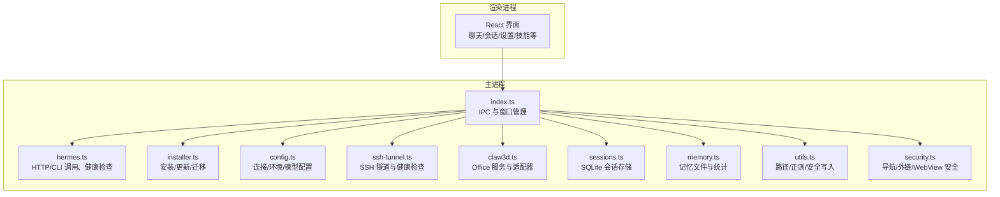
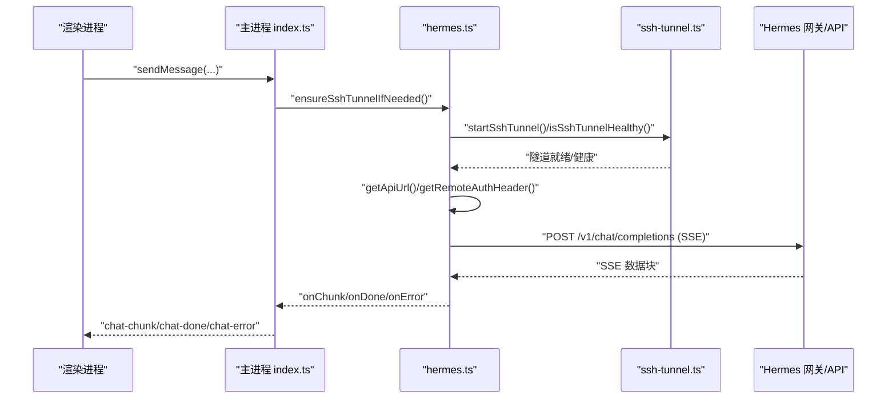
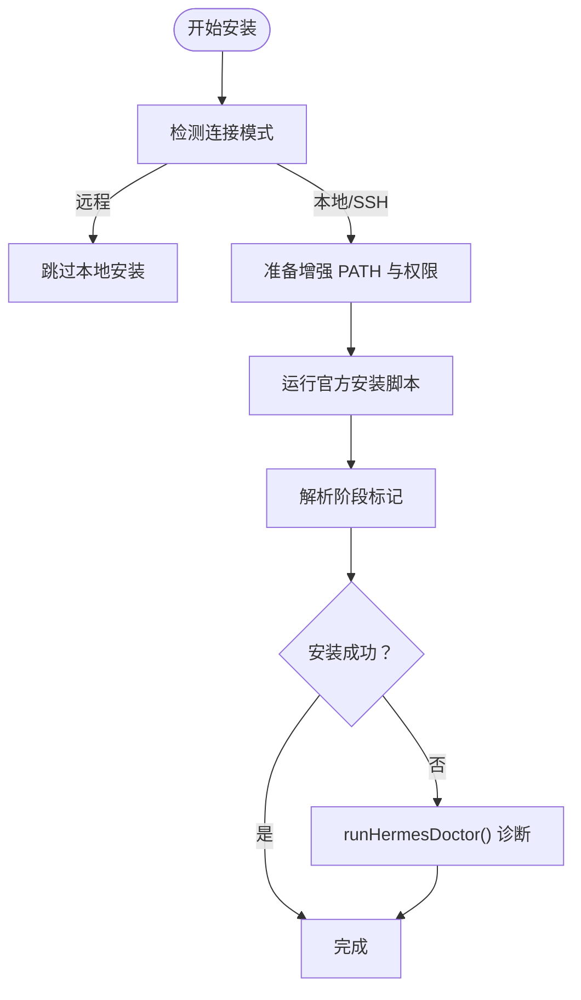
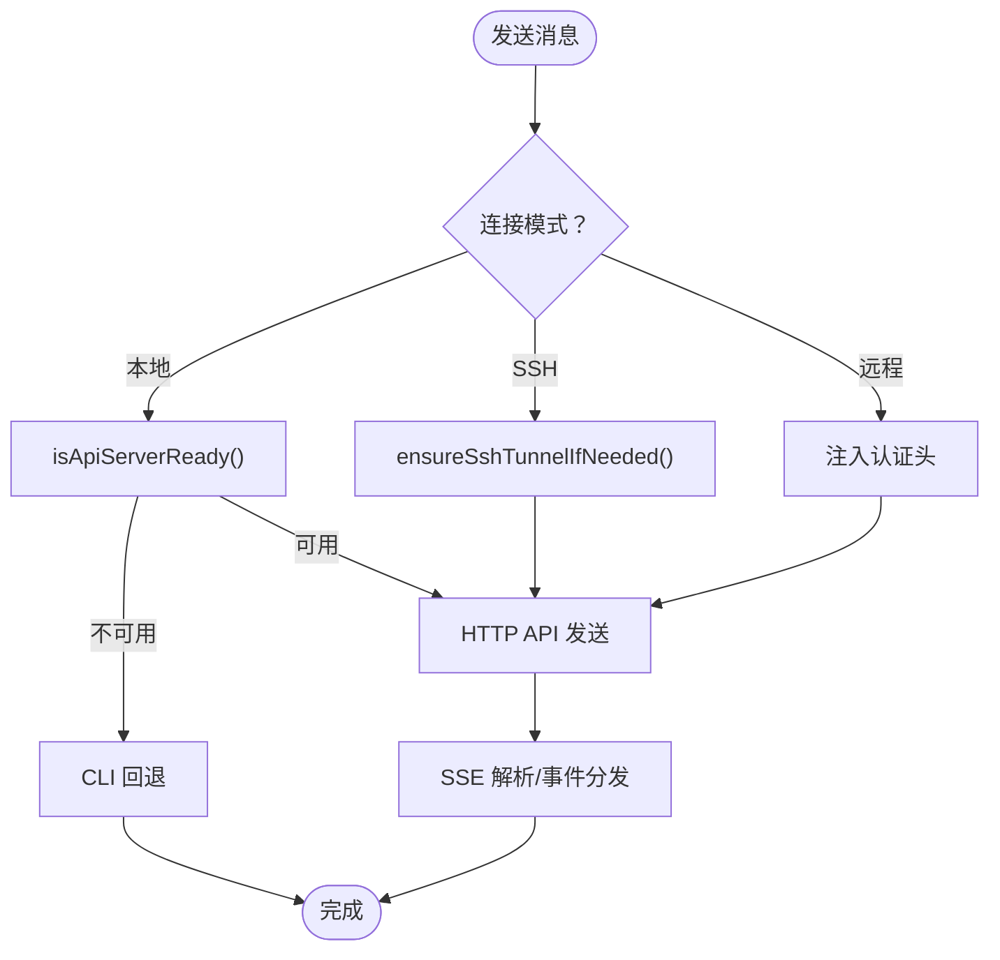
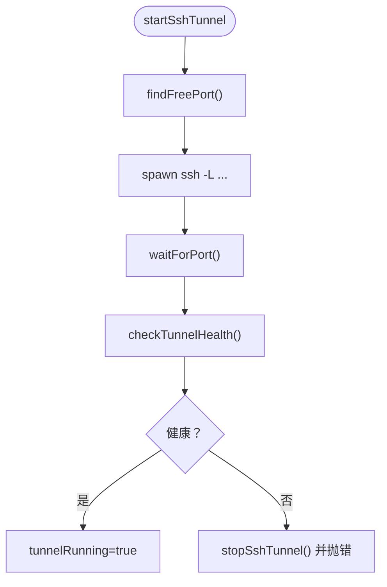
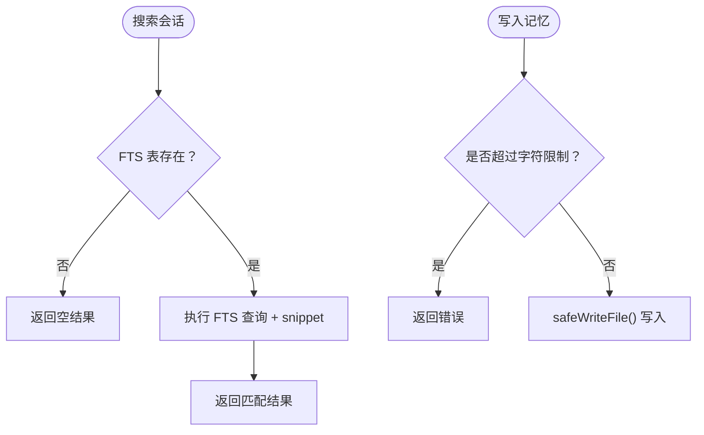
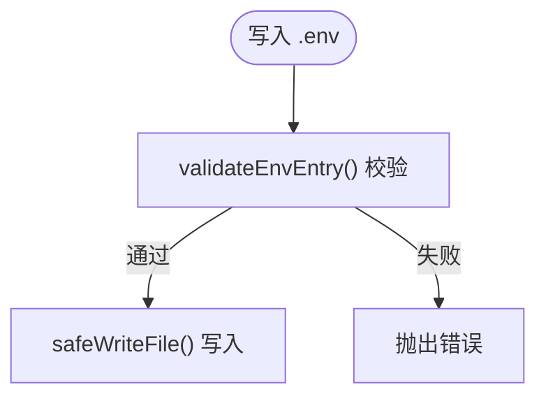
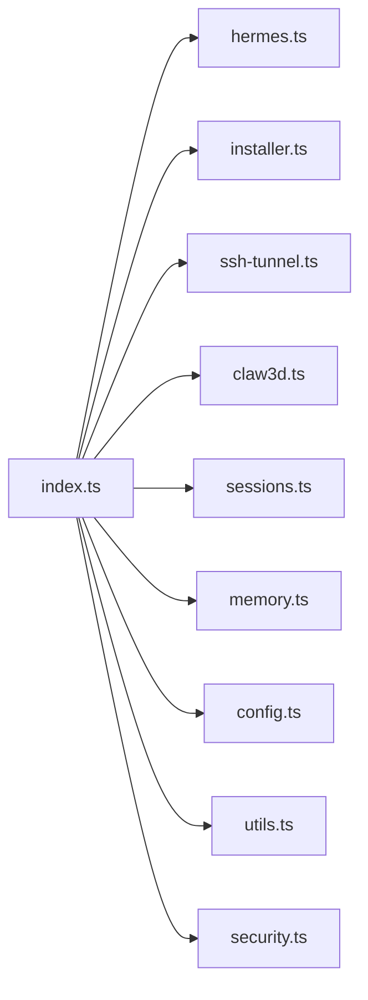

# 故障排除

<cite>
**本文引用的文件**
- [README.md](file://README.md)
- [package.json](file://package.json)
- [src/main/index.ts](file://src/main/index.ts)
- [src/main/hermes.ts](file://src/main/hermes.ts)
- [src/main/installer.ts](file://src/main/installer.ts)
- [src/main/config.ts](file://src/main/config.ts)
- [src/main/ssh-tunnel.ts](file://src/main/ssh-tunnel.ts)
- [src/main/claw3d.ts](file://src/main/claw3d.ts)
- [src/main/sessions.ts](file://src/main/sessions.ts)
- [src/main/memory.ts](file://src/main/memory.ts)
- [src/main/utils.ts](file://src/main/utils.ts)
- [src/main/security.ts](file://src/main/security.ts)
- [tests/env-validation.test.ts](file://tests/env-validation.test.ts)
- [tests/installer-platform.test.ts](file://tests/installer-platform.test.ts)
</cite>

## 目录
1. [简介](#简介)
2. [项目结构](#项目结构)
3. [核心组件](#核心组件)
4. [架构总览](#架构总览)
5. [详细组件分析](#详细组件分析)
6. [依赖关系分析](#依赖关系分析)
7. [性能考虑](#性能考虑)
8. [故障排除指南](#故障排除指南)
9. [结论](#结论)
10. [附录](#附录)

## 简介
本指南面向使用 Hermes Desktop 的用户与支持工程师，提供系统化的故障排除流程与调试技巧。内容覆盖安装问题、连接问题（本地/远程/SSH 隧道）、性能问题与兼容性问题，并给出日志分析、网络排查与系统资源监控方法。同时提供紧急恢复与数据备份策略，帮助用户自助解决问题，降低技术支持负担。

## 项目结构
Hermes Desktop 采用 Electron 主进程 + React 渲染进程的桌面应用架构。主进程负责安装器、Hermes 引擎通信、SSH 隧道、Claw3D 办公界面、会话与记忆管理等；渲染进程提供聊天、会话、设置、技能、工具、模型、记忆、Soul、网关等界面。

图示来源
- [src/main/index.ts:290-800](file://src/main/index.ts#L290-L800)
- [src/main/hermes.ts:1-800](file://src/main/hermes.ts#L1-L800)
- [src/main/installer.ts:1-800](file://src/main/installer.ts#L1-L800)
- [src/main/config.ts:1-440](file://src/main/config.ts#L1-L440)
- [src/main/ssh-tunnel.ts:1-220](file://src/main/ssh-tunnel.ts#L1-L220)
- [src/main/claw3d.ts:1-800](file://src/main/claw3d.ts#L1-L800)
- [src/main/sessions.ts:1-212](file://src/main/sessions.ts#L1-L212)
- [src/main/memory.ts:1-207](file://src/main/memory.ts#L1-L207)
- [src/main/utils.ts:1-85](file://src/main/utils.ts#L1-L85)
- [src/main/security.ts:1-78](file://src/main/security.ts#L1-L78)

章节来源
- [README.md:1-282](file://README.md#L1-L282)
- [package.json:1-70](file://package.json#L1-L70)

## 核心组件
- 安装与更新：负责首次安装、更新、迁移与诊断输出，确保 Hermes Agent 可执行环境就绪。
- 连接与通信：封装本地/远程/SSH 模式下的 API 地址解析、认证头注入、健康检查与回退策略。
- SSH 隧道：建立本地端口到远端 Hermes 网关的隧道，提供健康检查与自动重连。
- 会话与记忆：基于 SQLite 的会话检索与消息查询，以及 MEMORY.md/USER.md 的文本容量限制与写入。
- 配置与环境：桌面配置、模型配置、平台开关、凭据池与 .env 写入校验。
- 安全与合规：外链/导航/WebView 安全策略，防止不安全访问。

章节来源
- [src/main/installer.ts:1-800](file://src/main/installer.ts#L1-L800)
- [src/main/hermes.ts:1-800](file://src/main/hermes.ts#L1-L800)
- [src/main/ssh-tunnel.ts:1-220](file://src/main/ssh-tunnel.ts#L1-L220)
- [src/main/sessions.ts:1-212](file://src/main/sessions.ts#L1-L212)
- [src/main/memory.ts:1-207](file://src/main/memory.ts#L1-L207)
- [src/main/config.ts:1-440](file://src/main/config.ts#L1-L440)
- [src/main/security.ts:1-78](file://src/main/security.ts#L1-L78)

## 架构总览
下图展示从渲染进程发起一次聊天请求到响应返回的关键路径，涵盖本地 HTTP API、CLI 回退、SSH 隧道与健康检查。

图示来源
- [src/main/index.ts:544-640](file://src/main/index.ts#L544-L640)
- [src/main/hermes.ts:20-69](file://src/main/hermes.ts#L20-L69)
- [src/main/ssh-tunnel.ts:120-166](file://src/main/ssh-tunnel.ts#L120-L166)

## 详细组件分析

### 组件一：安装与更新（installer）
- 关键职责
  - 解析增强 PATH、跨平台 CLI 参数、Windows PowerShell 兼容处理
  - 首次安装、更新、迁移（OpenClaw）与 doctor 诊断
  - 进度回调与日志流输出
- 常见问题定位
  - 安装卡住：检查 sudo 缓存与 askpass 设置；查看安装脚本输出中的阶段标记
  - Windows 安装失败：确认 PowerShell 可用与 TLS 1.2 支持
  - 更新失败：查看 hermes update 输出，确认 Python 环境可用
- 诊断要点
  - 使用 runHermesDoctor 获取诊断信息
  - 通过 runClawMigrate 将旧数据迁移到新格式

图示来源
- [src/main/installer.ts:517-650](file://src/main/installer.ts#L517-L650)
- [src/main/installer.ts:298-319](file://src/main/installer.ts#L298-L319)

章节来源
- [src/main/installer.ts:1-800](file://src/main/installer.ts#L1-L800)
- [tests/installer-platform.test.ts:1-32](file://tests/installer-platform.test.ts#L1-L32)

### 组件二：连接与通信（hermes）
- 关键职责
  - 自动选择 HTTP API 或 CLI 回退路径
  - 健康轮询与缓存，避免冷启动延迟
  - 远程模式下注入认证头，SSH 模式下使用隧道地址
  - SSE 流解析、工具进度事件、用量统计
- 常见问题定位
  - API 不可用：检查本地网关是否启动、端口占用与健康检查
  - 认证失败：核对 .env 中 API Key 或远程 API Key 注入
  - 流中断：关注 SSE 解析与超时逻辑，必要时切换到 CLI
- 诊断要点
  - getApiUrl()/getRemoteAuthHeader() 返回值
  - isApiServerReady() 健康检查结果
  - 发送前 ensureSshTunnelIfNeeded()

图示来源
- [src/main/hermes.ts:648-711](file://src/main/hermes.ts#L648-L711)
- [src/main/hermes.ts:168-434](file://src/main/hermes.ts#L168-L434)

章节来源
- [src/main/hermes.ts:1-800](file://src/main/hermes.ts#L1-L800)
- [src/main/index.ts:544-640](file://src/main/index.ts#L544-L640)

### 组件三：SSH 隧道（ssh-tunnel）
- 关键职责
  - 自动寻找空闲本地端口、构建 ssh 参数、启动隧道进程
  - 提供隧道健康检查与自动重试
  - 提供临时连接测试接口
- 常见问题定位
  - 隧道无法建立：检查主机名/端口/密钥路径与 SSH 权限
  - 端口冲突：确认本地端口可用或更换
  - 健康检查失败：查看 /health 探针返回状态
- 诊断要点
  - startSshTunnel() 启动后等待端口开放与健康检查
  - isSshTunnelHealthy() 用于运行时自检

图示来源
- [src/main/ssh-tunnel.ts:120-166](file://src/main/ssh-tunnel.ts#L120-L166)
- [src/main/ssh-tunnel.ts:30-63](file://src/main/ssh-tunnel.ts#L30-L63)

章节来源
- [src/main/ssh-tunnel.ts:1-220](file://src/main/ssh-tunnel.ts#L1-L220)
- [src/main/index.ts:524-542](file://src/main/index.ts#L524-L542)

### 组件四：会话与记忆（sessions/memory）
- 关键职责
  - 会话列表、全文检索（FTS5）、消息查询
  - MEMORY.md/USER.md 文件读写与容量限制
- 常见问题定位
  - 会话搜索无结果：确认 FTS 表存在且已索引
  - 写入失败：检查字符长度限制与文件权限
- 诊断要点
  - sessions.searchSessions() 返回空数组可能表示 FTS 未就绪
  - memory 写入返回错误信息包含超出限制提示

图示来源
- [src/main/sessions.ts:91-156](file://src/main/sessions.ts#L91-L156)
- [src/main/memory.ts:132-206](file://src/main/memory.ts#L132-L206)

章节来源
- [src/main/sessions.ts:1-212](file://src/main/sessions.ts#L1-L212)
- [src/main/memory.ts:1-207](file://src/main/memory.ts#L1-L207)

### 组件五：配置与环境（config）
- 关键职责
  - 连接模式（local/remote/ssh）持久化
  - 模型配置、平台开关、凭据池
  - .env 读写与键名/值校验
- 常见问题定位
  - .env 写入失败：检查键名合法性与单行值约束
  - 配置未生效：确认缓存 TTL 已过期或已失效
- 诊断要点
  - setEnvValue() 对非法键名/多行值直接抛错
  - setModelConfig() 自动启用 streaming 并禁用 smart_model_routing

图示来源
- [src/main/config.ts:134-180](file://src/main/config.ts#L134-L180)
- [src/main/utils.ts:80-85](file://src/main/utils.ts#L80-L85)

章节来源
- [src/main/config.ts:1-440](file://src/main/config.ts#L1-L440)
- [tests/env-validation.test.ts:1-76](file://tests/env-validation.test.ts#L1-L76)

### 组件六：安全与合规（security）
- 关键职责
  - 外部链接协议白名单、应用内导航限制
  - WebView 安全首选项与附加内容安全策略
- 常见问题定位
  - 外链被拦截：确认协议在允许列表中
  - WebView 加载异常：检查主机与端口范围
- 诊断要点
  - isAllowedExternalUrl()/isAllowedAppNavigationUrl()
  - hardenWebviewPreferences() 应用的安全策略

章节来源
- [src/main/security.ts:1-78](file://src/main/security.ts#L1-L78)

## 依赖关系分析
- 主进程模块间耦合
  - index.ts 作为 IPC 中枢，调用 hermes、installer、ssh-tunnel、claw3d、sessions、memory 等
  - hermes.ts 依赖 config.ts 与 ssh-tunnel.ts，实现模式切换与健康检查
  - installer.ts 依赖 utils.ts 与 askpass/sudoCreds（间接），提供安装/更新能力
- 外部依赖
  - better-sqlite3：会话与记忆的本地存储
  - electron-updater：自动更新
  - i18n：国际化框架

图示来源
- [src/main/index.ts:1-120](file://src/main/index.ts#L1-L120)
- [src/main/hermes.ts:1-30](file://src/main/hermes.ts#L1-L30)
- [src/main/installer.ts:1-35](file://src/main/installer.ts#L1-L35)
- [src/main/config.ts:1-20](file://src/main/config.ts#L1-L20)
- [src/main/ssh-tunnel.ts:1-15](file://src/main/ssh-tunnel.ts#L1-L15)
- [src/main/claw3d.ts:1-20](file://src/main/claw3d.ts#L1-L20)
- [src/main/sessions.ts:1-5](file://src/main/sessions.ts#L1-L5)
- [src/main/memory.ts:1-4](file://src/main/memory.ts#L1-L4)
- [src/main/utils.ts:1-5](file://src/main/utils.ts#L1-L5)
- [src/main/security.ts:1-10](file://src/main/security.ts#L1-L10)

章节来源
- [package.json:27-68](file://package.json#L27-L68)

## 性能考虑
- 健康轮询与缓存
  - hermes.ts 对 API 服务器可用性进行缓存与周期性轮询，避免每次请求都做昂贵的健康检查
- 进程与端口管理
  - SSH 隧道与本地网关进程的生命周期管理，减少资源泄漏
- I/O 与数据库
  - sessions 使用 FTS5 全文检索，需确保表存在；memory 写入采用安全写入函数，避免文件损坏

章节来源
- [src/main/hermes.ts:694-711](file://src/main/hermes.ts#L694-L711)
- [src/main/sessions.ts:91-156](file://src/main/sessions.ts#L91-L156)
- [src/main/memory.ts:75-85](file://src/main/memory.ts#L75-L85)

## 故障排除指南

### 一、安装问题
- 症状
  - 安装卡在“切换到 root 用户安装依赖”或“等待 sudo 密码”
  - Windows 安装脚本报错或 PowerShell 缺失
  - 安装完成后仍提示未安装
- 诊断步骤
  - 查看安装进度回调中的阶段标记，定位具体步骤
  - 在 Windows 上确认 PowerShell 版本与 TLS 1.2 支持
  - 若 sudo 缓存失败，尝试手动输入密码或授予免密权限
- 解决方案
  - 预热 sudo 凭据与 askpass 桥接后再运行安装脚本
  - 使用终端手动运行官方安装脚本以绕过 GUI 限制
  - 成功后运行 doctor 检查环境

章节来源
- [src/main/installer.ts:553-650](file://src/main/installer.ts#L553-L650)
- [src/main/installer.ts:676-799](file://src/main/installer.ts#L676-L799)
- [src/main/installer.ts:298-319](file://src/main/installer.ts#L298-L319)

### 二、连接问题
- 症状
  - 本地模式无法聊天：API 不可用或端口被占用
  - 远程模式认证失败：API Key 错误或注入失败
  - SSH 模式无法建立：隧道端口不可达或健康检查失败
- 诊断步骤
  - 本地：检查 hermes.gateway 是否启动，端口 8642 可用
  - 远程：使用 test-remote-connection 校验 URL 与 Key
  - SSH：使用 test-ssh-connection 仅临时验证连通性
- 解决方案
  - 启动/重启网关，确保健康检查返回 200
  - 在 .env 中正确配置 API Key，必要时通过 set-env 触发网关重启
  - 重新建立 SSH 隧道，确认本地端口开放与 /health 可达

章节来源
- [src/main/hermes.ts:102-121](file://src/main/hermes.ts#L102-L121)
- [src/main/index.ts:513-522](file://src/main/index.ts#L513-L522)
- [src/main/ssh-tunnel.ts:168-219](file://src/main/ssh-tunnel.ts#L168-L219)

### 三、性能问题
- 症状
  - 首次请求延迟高、SSE 响应慢
- 诊断步骤
  - 观察健康轮询是否频繁触发，确认 API 可用性缓存生效
  - 检查渲染进程通知与长时间无响应的场景
- 解决方案
  - 避免频繁切换连接模式
  - 保持网关常驻，减少冷启动开销

章节来源
- [src/main/hermes.ts:694-711](file://src/main/hermes.ts#L694-L711)
- [src/main/index.ts:597-624](file://src/main/index.ts#L597-L624)

### 四、兼容性问题
- 症状
  - 跨平台 PATH 不一致导致命令找不到
  - Windows 上 PowerShell 5.1 与 ANSI 输出处理
- 诊断步骤
  - 检查 getEnhancedPath() 是否包含期望路径段
  - 确认 stripAnsi() 是否正确清理输出
- 解决方案
  - 使用增强 PATH 与平台特定 CLI 参数
  - 在 Windows 上优先使用 pwsh.exe 并强制 UTF-8

章节来源
- [src/main/installer.ts:56-134](file://src/main/installer.ts#L56-L134)
- [src/main/utils.ts:14-19](file://src/main/utils.ts#L14-L19)
- [tests/installer-platform.test.ts:1-32](file://tests/installer-platform.test.ts#L1-L32)

### 五、日志分析
- 日志位置
  - 主进程控制台与渲染进程日志捕获
  - hermes.ts 中的 SSE 错误与探针请求错误
  - SSH 隧道与 Claw3D 的 stdout/stderr 缓冲
- 分析要点
  - 关注 [MAIN UNCAUGHT]/[MAIN UNHANDLED REJECTION] 与 [RENDERER ERROR]
  - SSE 中的 error 字段与探针请求的非流式回退
  - SSH /health 与端口可达性检查

章节来源
- [src/main/index.ts:174-248](file://src/main/index.ts#L174-L248)
- [src/main/hermes.ts:218-266](file://src/main/hermes.ts#L218-L266)
- [src/main/ssh-tunnel.ts:30-63](file://src/main/ssh-tunnel.ts#L30-L63)
- [src/main/claw3d.ts:703-727](file://src/main/claw3d.ts#L703-L727)

### 六、网络连接排查
- 本地 API
  - 使用 http/https 请求 /health，检查 200 响应
- 远程 API
  - 通过 test-remote-connection 验证 URL 与 Key
- SSH 隧道
  - 临时端口探测与 /health 探针，确认隧道健康
- DNS/代理
  - 如遇企业代理，建议在系统级或网络层配置豁免规则

章节来源
- [src/main/hermes.ts:102-121](file://src/main/hermes.ts#L102-L121)
- [src/main/index.ts:513-522](file://src/main/index.ts#L513-L522)
- [src/main/ssh-tunnel.ts:168-219](file://src/main/ssh-tunnel.ts#L168-L219)

### 七、系统资源监控
- CPU/内存
  - 关注渲染进程崩溃事件与渲染器进程消失事件
- 磁盘
  - sessions 使用 SQLite 存储，注意磁盘空间与文件权限
  - memory 写入采用安全写入，避免部分写入
- 网络
  - SSH 隧道端口占用与健康检查频率

章节来源
- [src/main/index.ts:226-248](file://src/main/index.ts#L226-L248)
- [src/main/sessions.ts:36-44](file://src/main/sessions.ts#L36-L44)
- [src/main/memory.ts:75-85](file://src/main/memory.ts#L75-L85)

### 八、紧急恢复与数据备份策略
- 备份
  - 使用内置备份功能导出数据
  - 手动复制 ~/.hermes 目录（含 config.yaml、.env、state.db、profiles 等）
- 恢复
  - 将备份目录还原至原位，确保权限正确
  - 如需迁移 OpenClaw 数据，使用 runClawMigrate
- 诊断
  - 使用 runHermesDoctor 快速获取环境诊断信息

章节来源
- [README.md:97-98](file://README.md#L97-L98)
- [src/main/installer.ts:333-396](file://src/main/installer.ts#L333-L396)
- [src/main/installer.ts:298-319](file://src/main/installer.ts#L298-L319)

## 结论
通过以上系统化的方法，用户可快速定位并解决安装、连接、性能与兼容性问题。建议在日常使用中定期备份数据、保持网关健康与 SSH 隧道稳定，并利用内置诊断工具与日志分析能力进行预防性维护。

## 附录

### A. 常用 IPC 与诊断命令
- 安装相关
  - check-install / verify-install / start-install
  - run-hermes-doctor / run-hermes-update / run-claw-migrate
- 连接相关
  - is-remote-mode / is-remote-only-mode / get-connection-config
  - set-connection-config / set-ssh-config
  - test-remote-connection / test-ssh-connection
  - start-ssh-tunnel / stop-ssh-tunnel / is-ssh-tunnel-active
- 聊天与网关
  - send-message / abort-chat
  - start-gateway / stop-gateway / gateway-status

章节来源
- [src/main/index.ts:290-800](file://src/main/index.ts#L290-L800)

### B. 环境变量与配置校验
- .env 写入校验
  - 键名必须为字母数字下划线，不能包含换行或 NUL
- 模型配置
  - 自动启用 streaming，禁用 smart_model_routing
  - 本地自定义端点按 URL 匹配注入对应 API Key

章节来源
- [src/main/config.ts:134-180](file://src/main/config.ts#L134-L180)
- [src/main/config.ts:248-301](file://src/main/config.ts#L248-L301)
- [src/main/hermes.ts:520-555](file://src/main/hermes.ts#L520-L555)