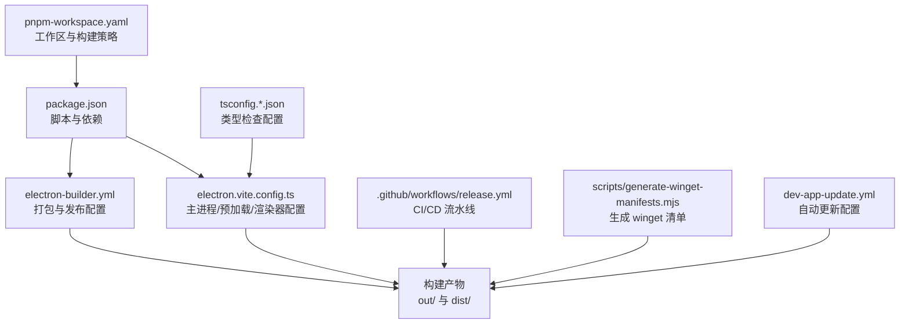
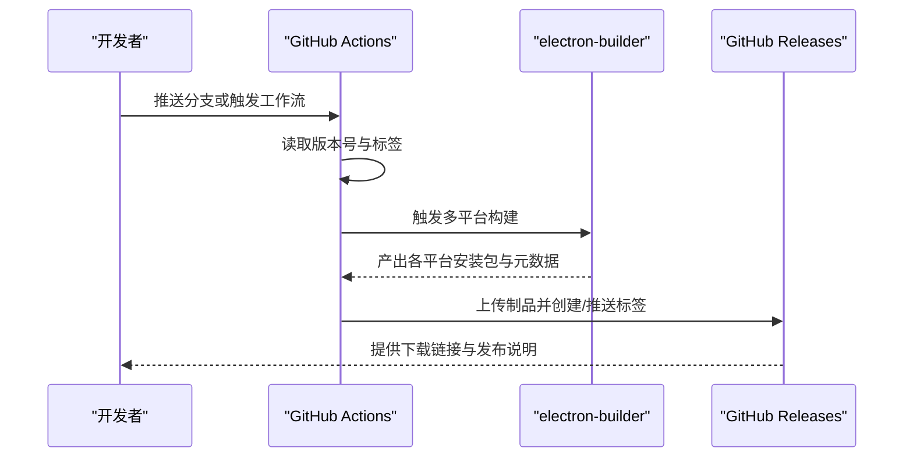
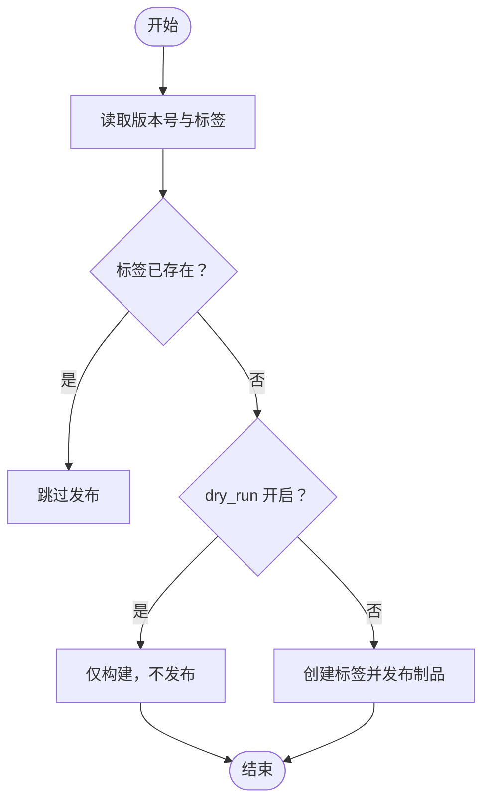
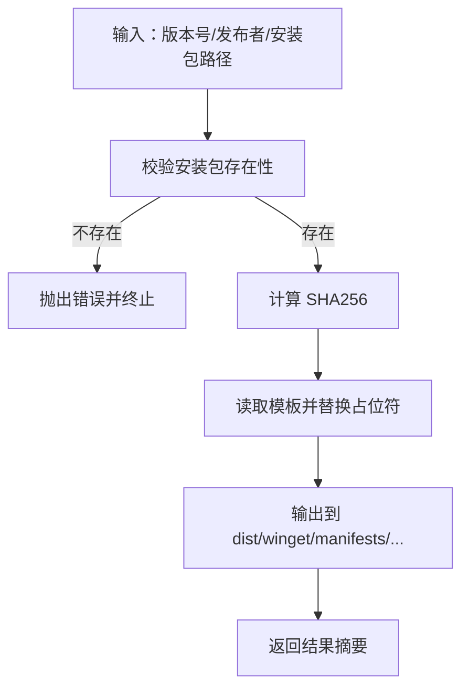
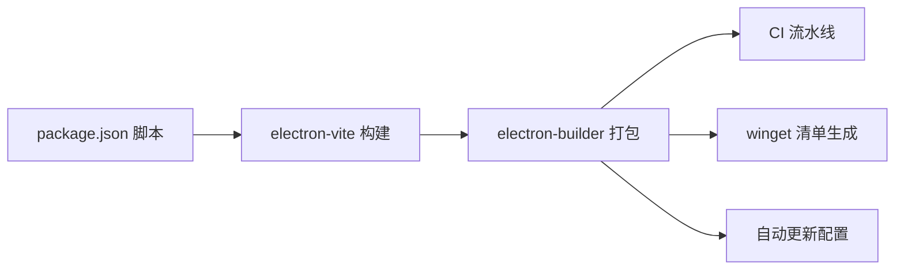

# 构建与部署

<cite>
**本文引用的文件**
- [package.json](file://package.json)
- [electron-builder.yml](file://electron-builder.yml)
- [electron.vite.config.ts](file://electron.vite.config.ts)
- [.github/workflows/release.yml](file://.github/workflows/release.yml)
- [scripts/generate-winget-manifests.mjs](file://scripts/generate-winget-manifests.mjs)
- [dev-app-update.yml](file://dev-app-update.yml)
- [pnpm-workspace.yaml](file://pnpm-workspace.yaml)
- [tsconfig.json](file://tsconfig.json)
- [tsconfig.node.json](file://tsconfig.node.json)
- [tsconfig.web.json](file://tsconfig.web.json)
- [README.md](file://README.md)
- [CONTRIBUTING.md](file://CONTRIBUTING.md)
</cite>

## 目录
1. [简介](#简介)
2. [项目结构](#项目结构)
3. [核心组件](#核心组件)
4. [架构总览](#架构总览)
5. [详细组件分析](#详细组件分析)
6. [依赖关系分析](#依赖关系分析)
7. [性能考量](#性能考量)
8. [故障排除指南](#故障排除指南)
9. [结论](#结论)
10. [附录](#附录)

## 简介
本文件面向运维与持续集成工程师，系统化阐述 Hermes Desktop 的构建、打包与发布流程，覆盖多平台构建命令、打包配置、CI/CD 流水线、自动化测试与版本管理策略，并提供发布前质量检查清单、签名与验证流程建议，以及常见问题排查方法。

## 项目结构
Hermes Desktop 采用 Electron + React + Vite 的现代桌面应用架构，使用 electron-vite 进行开发与构建，electron-builder 负责跨平台打包与分发。仓库中关键的构建与发布相关文件包括：
- 包管理与脚本：package.json
- 打包配置：electron-builder.yml
- 构建工具链配置：electron.vite.config.ts、tsconfig.*.json
- CI/CD 流水线：.github/workflows/release.yml
- Windows 包管理器（winget）清单生成：scripts/generate-winget-manifests.mjs
- 自动更新配置：dev-app-update.yml
- 工作区与依赖构建策略：pnpm-workspace.yaml

图表来源
- [package.json:1-70](file://package.json#L1-L70)
- [electron.vite.config.ts:1-33](file://electron.vite.config.ts#L1-L33)
- [electron-builder.yml:1-58](file://electron-builder.yml#L1-L58)
- [.github/workflows/release.yml:1-243](file://.github/workflows/release.yml#L1-L243)
- [scripts/generate-winget-manifests.mjs:1-105](file://scripts/generate-winget-manifests.mjs#L1-L105)
- [dev-app-update.yml:1-5](file://dev-app-update.yml#L1-L5)
- [pnpm-workspace.yaml:1-5](file://pnpm-workspace.yaml#L1-L5)
- [tsconfig.json:1-5](file://tsconfig.json#L1-L5)
- [tsconfig.node.json:1-14](file://tsconfig.node.json#L1-L14)
- [tsconfig.web.json:1-20](file://tsconfig.web.json#L1-L20)

章节来源
- [package.json:1-70](file://package.json#L1-L70)
- [electron.vite.config.ts:1-33](file://electron.vite.config.ts#L1-L33)
- [electron-builder.yml:1-58](file://electron-builder.yml#L1-L58)
- [.github/workflows/release.yml:1-243](file://.github/workflows/release.yml#L1-L243)
- [scripts/generate-winget-manifests.mjs:1-105](file://scripts/generate-winget-manifests.mjs#L1-L105)
- [dev-app-update.yml:1-5](file://dev-app-update.yml#L1-L5)
- [pnpm-workspace.yaml:1-5](file://pnpm-workspace.yaml#L1-L5)
- [tsconfig.json:1-5](file://tsconfig.json#L1-L5)
- [tsconfig.node.json:1-14](file://tsconfig.node.json#L1-L14)
- [tsconfig.web.json:1-20](file://tsconfig.web.json#L1-L20)

## 核心组件
- 构建与脚本
  - 使用 electron-vite 进行开发与生产构建；通过 package.json 中的脚本统一入口，支持类型检查、开发模式、打包与多平台构建。
- 打包与发布
  - electron-builder 配置了应用元信息、资源目录、目标平台与分发策略；GitHub 发布配置由 CI 流水线驱动。
- 类型检查与测试
  - tsconfig.node.json 与 tsconfig.web.json 分别覆盖主进程/预加载与渲染器类型检查；Vitest 作为测试运行器。
- 自动更新
  - dev-app-update.yml 指定 GitHub 作为更新源，配合 electron-updater 实现自动更新。
- 工作区与依赖
  - pnpm-workspace.yaml 控制部分原生依赖的构建策略，避免在 CI 中重复编译。

章节来源
- [package.json:8-26](file://package.json#L8-L26)
- [electron-builder.yml:1-58](file://electron-builder.yml#L1-L58)
- [tsconfig.node.json:1-14](file://tsconfig.node.json#L1-L14)
- [tsconfig.web.json:1-20](file://tsconfig.web.json#L1-L20)
- [dev-app-update.yml:1-5](file://dev-app-update.yml#L1-L5)
- [pnpm-workspace.yaml:1-5](file://pnpm-workspace.yaml#L1-L5)

## 架构总览
下图展示从本地开发到多平台发布的整体流程，包括构建、打包、上传与发布阶段。

图表来源
- [.github/workflows/release.yml:34-40](file://.github/workflows/release.yml#L34-L40)
- [.github/workflows/release.yml:84-101](file://.github/workflows/release.yml#L84-L101)
- [.github/workflows/release.yml:120-138](file://.github/workflows/release.yml#L120-L138)
- [.github/workflows/release.yml:157-171](file://.github/workflows/release.yml#L157-L171)
- [.github/workflows/release.yml:226-243](file://.github/workflows/release.yml#L226-L243)

## 详细组件分析

### 构建与打包配置（electron-builder.yml）
- 应用标识与产品名称
  - appId、productName 定义应用唯一标识与显示名称。
- 输出目录与文件过滤
  - buildResources 指向 build/；files 列表排除开发与源代码，确保最终包精简。
- 平台目标与命名
  - Windows：NSIS 安装包，artifactName 模板定义文件名；可选桌面快捷方式。
  - macOS：指定图标、权限文件、用户隐私描述；未启用 Apple Notarize。
  - Linux：同时生成 AppImage、snap、deb、rpm，设置维护者、分类、描述等。
- 发布策略
  - publish.provider 指向 GitHub，owner/repo 指定仓库，用于自动更新与发布。

章节来源
- [electron-builder.yml:1-58](file://electron-builder.yml#L1-L58)

### 构建工具链配置（electron.vite.config.ts）
- 主进程外部化
  - 将 better-sqlite3 设为 external，避免在打包时内联原生模块。
- 预加载多入口
  - 配置 index 与 askpass 两个预加载入口，便于安全桥接与密码输入处理。
- 渲染器别名与插件
  - @renderer 别名简化导入路径；集成 TailwindCSS 与 React 插件。

章节来源
- [electron.vite.config.ts:6-32](file://electron.vite.config.ts#L6-L32)

### CI/CD 流水线（release.yml）
- 版本与标签准备
  - 从 package.json 读取版本号，计算 tag；检测是否已存在，避免重复发布。
  - 支持 workflow_dispatch 输入 dry_run，控制是否跳过发布。
- 多平台构建
  - macOS：矩阵构建 x64/arm64，产出 dmg/zip 及 blockmap 与更新元数据。
  - Linux：安装 rpm 依赖后，产出 AppImage/deb/rpm。
  - Windows：产出 NSIS 安装包。
- winget 清单生成
  - 下载 Windows 安装包，调用脚本生成 winget 清单并上传制品。
- 发布阶段
  - 创建 Git 标签并推送到远端；收集所有制品并发布到 GitHub Releases。

图表来源
- [.github/workflows/release.yml:34-61](file://.github/workflows/release.yml#L34-L61)
- [.github/workflows/release.yml:204-243](file://.github/workflows/release.yml#L204-L243)

章节来源
- [.github/workflows/release.yml:22-61](file://.github/workflows/release.yml#L22-L61)
- [.github/workflows/release.yml:63-101](file://.github/workflows/release.yml#L63-L101)
- [.github/workflows/release.yml:102-138](file://.github/workflows/release.yml#L102-L138)
- [.github/workflows/release.yml:139-171](file://.github/workflows/release.yml#L139-L171)
- [.github/workflows/release.yml:172-203](file://.github/workflows/release.yml#L172-L203)
- [.github/workflows/release.yml:204-243](file://.github/workflows/release.yml#L204-L243)

### winget 清单生成（generate-winget-manifests.mjs）
- 功能概述
  - 基于当前版本与 Windows 安装包，填充模板中的占位符（版本、下载地址、SHA256、发布日期、发行说明链接），输出到 dist/winget/manifests/...。
- 关键步骤
  - 校验 NSIS 安装包是否存在；计算 SHA256；解析模板目录与输出目录；批量写入三个清单文件。
- 运行方式
  - 支持 CLI 或以 ESM 导入调用，环境变量 VERSION/PUBLISH_OWNER 控制版本与发布者。

图表来源
- [scripts/generate-winget-manifests.mjs:16-87](file://scripts/generate-winget-manifests.mjs#L16-L87)

章节来源
- [scripts/generate-winget-manifests.mjs:1-105](file://scripts/generate-winget-manifests.mjs#L1-L105)

### 自动更新配置（dev-app-update.yml）
- 指定 GitHub 作为更新提供方，配置更新缓存目录名称，与 electron-updater 协同工作。

章节来源
- [dev-app-update.yml:1-5](file://dev-app-update.yml#L1-L5)

### 类型检查与测试配置
- tsconfig.node.json 与 tsconfig.web.json
  - 分别覆盖主进程/预加载与渲染器/共享代码的类型检查范围与编译选项。
- package.json 脚本
  - 提供 typecheck:node、typecheck:web、lint、test 等标准化检查入口。

章节来源
- [tsconfig.node.json:1-14](file://tsconfig.node.json#L1-L14)
- [tsconfig.web.json:1-20](file://tsconfig.web.json#L1-L20)
- [package.json:10-14](file://package.json#L10-L14)

### 多平台构建命令与打包策略
- 通用构建
  - 先执行类型检查，再进行生产构建。
- 平台特定构建
  - macOS：electron-builder --mac
  - Windows：electron-builder --win nsis
  - Linux：electron-builder --linux AppImage deb rpm
  - RPM 专用：electron-builder --linux rpm
- 开发与调试
  - dev/dev:fresh 启动开发服务器；build:unpack 生成可解包的目录以便调试。

章节来源
- [package.json:18-25](file://package.json#L18-L25)
- [electron-builder.yml:14-52](file://electron-builder.yml#L14-L52)

## 依赖关系分析
- 组件耦合
  - electron.vite.config.ts 与 package.json 的脚本紧密耦合，前者决定构建入口与别名，后者提供统一命令。
  - electron-builder.yml 与 CI 流水线强关联，CI 步骤直接调用 electron-builder 的平台参数。
- 外部依赖
  - better-sqlite3 在主进程中 external，避免打包原生模块；Linux 打包依赖 rpm 工具链。
- 循环依赖
  - 当前配置未发现循环依赖迹象；类型检查通过 tsconfig 的 references 分离主进程与渲染器。

图表来源
- [package.json:8-26](file://package.json#L8-L26)
- [electron.vite.config.ts:6-32](file://electron.vite.config.ts#L6-L32)
- [electron-builder.yml:1-58](file://electron-builder.yml#L1-L58)
- [.github/workflows/release.yml:84-171](file://.github/workflows/release.yml#L84-L171)
- [scripts/generate-winget-manifests.mjs:16-87](file://scripts/generate-winget-manifests.mjs#L16-L87)
- [dev-app-update.yml:1-5](file://dev-app-update.yml#L1-L5)

章节来源
- [package.json:8-26](file://package.json#L8-L26)
- [electron.vite.config.ts:6-32](file://electron.vite.config.ts#L6-L32)
- [electron-builder.yml:1-58](file://electron-builder.yml#L1-L58)
- [.github/workflows/release.yml:84-171](file://.github/workflows/release.yml#L84-L171)
- [scripts/generate-winget-manifests.mjs:16-87](file://scripts/generate-winget-manifests.mjs#L16-L87)
- [dev-app-update.yml:1-5](file://dev-app-update.yml#L1-L5)

## 性能考量
- 构建性能
  - 使用 electron-vite 的快速热重载与按需打包；将 better-sqlite3 external 可减少打包体积与时间。
  - CI 中使用 npm 缓存与并行矩阵构建，缩短整体耗时。
- 打包体积
  - electron-builder 的 files 过滤规则有效剔除开发与源码，降低安装包大小。
- 更新效率
  - 使用 blockmap 与增量更新元数据，结合 GitHub Releases，提升下载与更新体验。

## 故障排除指南
- Windows 安装器未签名导致 SmartScreen 警告
  - 首次运行时提示“更多”→“仍要运行”，属于预期行为；如需规避，可在企业环境中通过组策略或软件分发渠道进行部署。
- macOS 应用未签名/未公证导致打开受限
  - 首次运行后可通过系统偏好设置允许，或使用命令清除扩展属性后重新打开。
- Fedora RPM 未 GPG 签名
  - 若系统强制校验签名，可使用跳过校验参数安装；注意自动更新不可用，需手动替换安装包。
- WSL 安装卡在切换 root 用户
  - 安装程序等待无 TTY 的 sudo 密码，可通过临时授予免密 sudo 解决，完成后恢复。
- CI 构建失败
  - 确认已安装 rpm 工具链（Linux）、Node.js 版本匹配（CI 使用 22）、且未重复发布相同标签。
- winget 清单生成失败
  - 确保 dist/ 下存在对应版本的 NSIS 安装包，模板目录存在，且环境变量 VERSION/PUBLISH_OWNER 设置正确。

章节来源
- [README.md:50-79](file://README.md#L50-L79)
- [.github/workflows/release.yml:123-125](file://.github/workflows/release.yml#L123-L125)
- [scripts/generate-winget-manifests.mjs:22-28](file://scripts/generate-winget-manifests.mjs#L22-L28)
- [scripts/generate-winget-manifests.mjs:53-59](file://scripts/generate-winget-manifests.mjs#L53-L59)

## 结论
Hermes Desktop 的构建与发布体系以 electron-vite 与 electron-builder 为核心，辅以 GitHub Actions 实现跨平台自动化打包与发布。通过严格的文件过滤、平台目标配置与 CI 并行矩阵，显著提升了交付效率。建议在生产环境中补充代码签名与公证流程，以进一步改善用户信任度与合规性。

## 附录

### 发布前质量检查清单
- 本地构建与测试
  - 运行类型检查与单元测试，确保无错误与覆盖率达标。
- 本地打包验证
  - 生成各平台安装包，验证可启动与基本功能。
- CI 预发布
  - 使用 dry_run 模式执行流水线，确认产物与元数据完整。
- 文档与说明
  - 更新发行说明与平台注意事项，确保用户指引清晰。

### 版本管理与标签策略
- 版本来源
  - 以 package.json 中 version 为准，CI 自动计算 tag=vX.Y.Z。
- 标签去重
  - 若标签已存在则跳过发布，避免重复制品。
- 发布节奏
  - 建议采用语义化版本，稳定分支（如 release）用于正式发布。

### 签名与验证流程建议
- Windows
  - 申请代码签名证书，对 NSIS 安装包进行签名；在 CI 中注入签名凭据。
- macOS
  - 申请 Developer ID，对 DMG/ZIP 进行签名与公证；配置 entitlements.plist。
- Linux
  - 对 .deb/.rpm 提供 GPG 签名；在仓库中提供签名元数据。
- 验证
  - 在各平台提供校验和与签名验证步骤，保障供应链安全。

### 运维与持续集成最佳实践
- 缓存与并行
  - 在 CI 中启用 npm/pnpm 缓存与矩阵并行，缩短构建时间。
- 安全
  - 限制 GitHub Actions 权限，仅授予发布所需内容写入权限。
- 可观测性
  - 记录构建日志与制品元数据，便于回溯与审计。

章节来源
- [package.json:8-26](file://package.json#L8-L26)
- [.github/workflows/release.yml:14-19](file://.github/workflows/release.yml#L14-L19)
- [.github/workflows/release.yml:213-218](file://.github/workflows/release.yml#L213-L218)
- [README.md:178-226](file://README.md#L178-L226)
- [CONTRIBUTING.md:35-42](file://CONTRIBUTING.md#L35-L42)