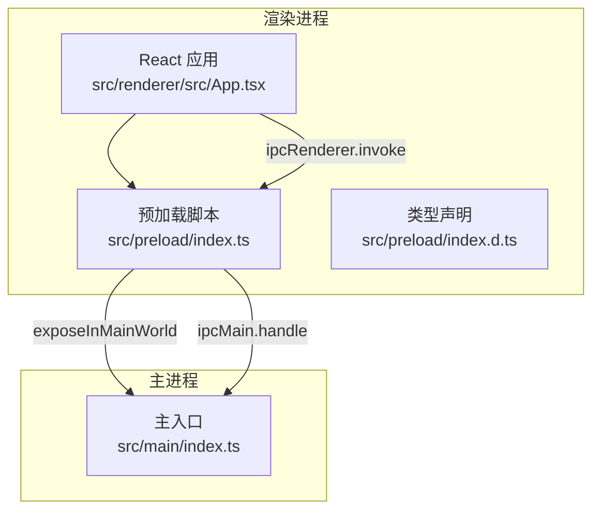
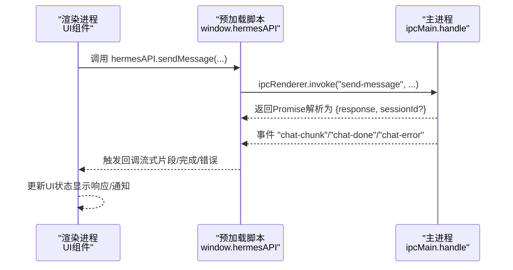
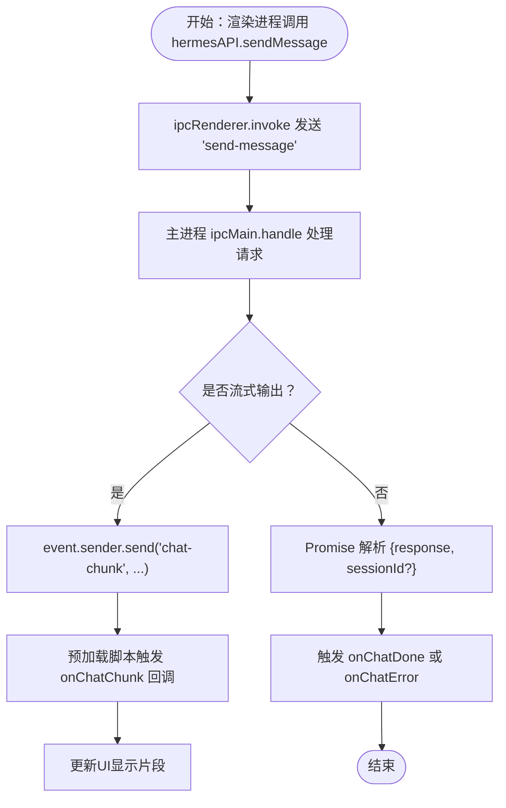
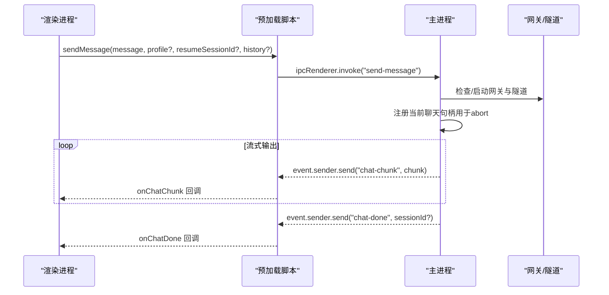
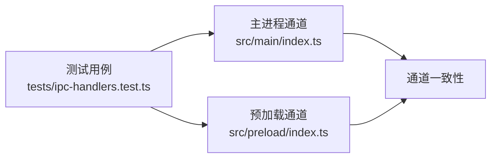

# IPC通信机制

<cite>
**本文档引用的文件**
- [src/main/index.ts](file://src/main/index.ts)
- [src/preload/index.ts](file://src/preload/index.ts)
- [src/preload/index.d.ts](file://src/preload/index.d.ts)
- [src/renderer/src/App.tsx](file://src/renderer/src/App.tsx)
- [tests/ipc-handlers.test.ts](file://tests/ipc-handlers.test.ts)
- [tests/preload-api-surface.test.ts](file://tests/preload-api-surface.test.ts)
</cite>

## 目录
1. [简介](#简介)
2. [项目结构](#项目结构)
3. [核心组件](#核心组件)
4. [架构总览](#架构总览)
5. [详细组件分析](#详细组件分析)
6. [依赖关系分析](#依赖关系分析)
7. [性能考虑](#性能考虑)
8. [故障排除指南](#故障排除指南)
9. [结论](#结论)
10. [附录](#附录)

## 简介
本文件系统性阐述Hermes Desktop的IPC（进程间通信）机制，基于Electron的ipcMain.handle与ipcRenderer.invoke实现。文档覆盖以下要点：
- window.hermesAPI全局对象的暴露机制与contextBridge安全实现
- 50+个IPC通道的功能说明、参数规范与返回值定义
- IPC消息格式、错误处理策略、异步调用模式与性能优化建议
- 在渲染进程中调用主进程功能的实际示例路径
- 在主进程中处理IPC请求的实现细节

## 项目结构
Hermes Desktop的IPC实现遵循标准Electron架构：主进程通过ipcMain.handle注册通道，预加载脚本通过contextBridge将hermesAPI暴露到渲染进程，渲染进程使用ipcRenderer.invoke进行异步调用。

**图表来源**
- [src/main/index.ts:1176-1234](file://src/main/index.ts#L1176-L1234)
- [src/preload/index.ts:688-701](file://src/preload/index.ts#L688-L701)
- [src/renderer/src/App.tsx:27-95](file://src/renderer/src/App.tsx#L27-L95)

**章节来源**
- [src/main/index.ts:1176-1234](file://src/main/index.ts#L1176-L1234)
- [src/preload/index.ts:688-701](file://src/preload/index.ts#L688-L701)
- [src/renderer/src/App.tsx:27-95](file://src/renderer/src/App.tsx#L27-L95)

## 核心组件
- 主进程IPC注册器：在主进程入口集中注册所有ipcMain.handle通道，统一管理业务逻辑与外部集成（安装、配置、会话、内存、技能、更新、日志等）。
- 预加载桥接层：通过contextBridge.exposeInMainWorld将hermesAPI暴露到渲染进程，确保仅暴露白名单方法，避免直接访问Node.js能力。
- 渲染进程API封装：渲染进程通过window.hermesAPI调用主进程功能，支持异步返回与事件监听（如聊天流式输出、安装进度、更新状态等）。

**章节来源**
- [src/main/index.ts:290-1005](file://src/main/index.ts#L290-L1005)
- [src/preload/index.ts:15-686](file://src/preload/index.ts#L15-L686)
- [src/preload/index.d.ts:29-471](file://src/preload/index.d.ts#L29-L471)

## 架构总览
下图展示了从渲染进程发起调用到主进程处理并回传结果的完整流程，包括事件驱动的流式数据（如聊天片段、安装进度）。

**图表来源**
- [src/preload/index.ts:158-233](file://src/preload/index.ts#L158-L233)
- [src/main/index.ts:544-640](file://src/main/index.ts#L544-L640)

## 详细组件分析

### 1) 全局对象暴露与安全实现
- 预加载脚本通过contextBridge.exposeInMainWorld将window.hermesAPI与window.electron暴露给渲染进程。
- 仅暴露明确的方法签名与事件监听接口，避免直接访问Node.js或Electron内部API。
- 类型声明文件index.d.ts严格约束hermesAPI的对外接口，确保类型安全。

```mermaid
classDiagram
class ContextBridge {
+exposeInMainWorld(target, api)
}
class HermesAPI {
+checkInstall()
+verifyInstall()
+startInstall()
+getLocale()
+setLocale()
+getEnv()
+setEnv()
+getConfig()
+setConfig()
+getModelConfig()
+setModelConfig()
+isRemoteMode()
+isRemoteOnlyMode()
+getConnectionConfig()
+setConnectionConfig()
+setSshConfig()
+testRemoteConnection()
+testSshConnection()
+isSshTunnelActive()
+startSshTunnel()
+stopSshTunnel()
+sendMessage()
+abortChat()
+onChatChunk()
+onChatDone()
+onChatToolProgress()
+onChatUsage()
+onChatError()
+startGateway()
+stopGateway()
+gatewayStatus()
+getPlatformEnabled()
+setPlatformEnabled()
+listSessions()
+getSessionMessages()
+listProfiles()
+createProfile()
+deleteProfile()
+setActiveProfile()
+readMemory()
+addMemoryEntry()
+updateMemoryEntry()
+removeMemoryEntry()
+writeUserProfile()
+readSoul()
+writeSoul()
+resetSoul()
+getToolsets()
+setToolsetEnabled()
+listInstalledSkills()
+listBundledSkills()
+getSkillContent()
+installSkill()
+uninstallSkill()
+listCachedSessions()
+syncSessionCache()
+updateSessionTitle()
+deleteSession()
+searchSessions()
+getCredentialPool()
+setCredentialPool()
+listModels()
+addModel()
+removeModel()
+updateModel()
+claw3dStatus()
+claw3dSetup()
+onClaw3dSetupProgress()
+claw3dGetPort()
+claw3dSetPort()
+claw3dGetWsUrl()
+claw3dSetWsUrl()
+claw3dStartAll()
+claw3dStopAll()
+claw3dGetLogs()
+claw3dStartDev()
+claw3dStopDev()
+claw3dStartAdapter()
+claw3dStopAdapter()
+checkForUpdates()
+downloadUpdate()
+installUpdate()
+getAppVersion()
+onUpdateAvailable()
+onUpdateDownloadProgress()
+onUpdateDownloaded()
+onMenuNewChat()
+onMenuSearchSessions()
+listCronJobs()
+createCronJob()
+removeCronJob()
+pauseCronJob()
+resumeCronJob()
+triggerCronJob()
+openExternal()
+runHermesBackup()
+runHermesImport()
+runHermesDump()
+discoverMemoryProviders()
+listMcpServers()
+readLogs()
}
ContextBridge --> HermesAPI : "exposeInMainWorld"
```

**图表来源**
- [src/preload/index.ts:688-701](file://src/preload/index.ts#L688-L701)
- [src/preload/index.d.ts:29-471](file://src/preload/index.d.ts#L29-L471)

**章节来源**
- [src/preload/index.ts:688-701](file://src/preload/index.ts#L688-L701)
- [src/preload/index.d.ts:29-471](file://src/preload/index.d.ts#L29-L471)

### 2) IPC通道清单与规范（50+通道）
以下通道按功能分组，每个条目包含通道名、调用方、参数与返回值概要。为避免泄露源码，此处不展示具体实现，仅给出调用规范与类型约束。

- 安装与迁移
  - check-install → Promise<{ installed: boolean; configured: boolean; hasApiKey: boolean }>
  - verify-install → Promise<boolean>
  - start-install → Promise<{ success: boolean; error?: string }>
  - run-hermes-backup → Promise<{ success: boolean; path?: string; error?: string }>
  - run-hermes-import → Promise<{ success: boolean; error?: string }>
  - run-hermes-dump → Promise<string>
  - check-openclaw → Promise<{ found: boolean; path: string | null }>
  - run-claw-migrate → Promise<{ success: boolean; error?: string }>
  - discover-memory-providers → Promise<Array<{ name: string; description: string; installed: boolean; active: boolean; envVars: string[] }>>

- 版本与诊断
  - get-hermes-version → Promise<string | null>
  - refresh-hermes-version → Promise<string | null>
  - run-hermes-doctor → Promise<string>
  - run-hermes-update → Promise<{ success: boolean; error?: string }>

- 本地/远程/SSH连接
  - is-remote-mode → Promise<boolean>
  - is-remote-only-mode → Promise<boolean>
  - get-connection-config → Promise<{ mode; remoteUrl; apiKey; ssh }>
  - set-connection-config → Promise<boolean>
  - set-ssh-config → Promise<boolean>
  - test-remote-connection → Promise<boolean>
  - test-ssh-connection → Promise<boolean>
  - is-ssh-tunnel-active → Promise<boolean>
  - start-ssh-tunnel → Promise<boolean>
  - stop-ssh-tunnel → Promise<boolean>

- 配置与环境
  - get-locale → Promise<AppLocale>
  - set-locale → Promise<AppLocale>
  - get-env → Promise<Record<string, string>>
  - set-env → Promise<boolean>
  - get-config → Promise<string | null>
  - set-config → Promise<boolean>
  - get-hermes-home → Promise<string>
  - get-model-config → Promise<{ provider; model; baseUrl }>
  - set-model-config → Promise<boolean>
  - get-platform-enabled → Promise<Record<string, boolean>>
  - set-platform-enabled → Promise<boolean>

- 网关与聊天
  - start-gateway → Promise<boolean>
  - stop-gateway → Promise<boolean>
  - gateway-status → Promise<boolean>
  - send-message → Promise<{ response: string; sessionId?: string }>
  - abort-chat → Promise<void>

  流式事件（渲染侧监听）：
  - chat-chunk → 字符串片段
  - chat-done → sessionId?
  - chat-error → 错误信息
  - chat-tool-progress → 工具名称
  - chat-usage → { promptTokens; completionTokens; totalTokens; cost?; rateLimitRemaining?; rateLimitReset? }

- 会话与缓存
  - list-sessions → Promise<Array<SessionInfo>>
  - get-session-messages → Promise<Array<Message>>
  - list-cached-sessions → Promise<Array<CachedSession>>
  - sync-session-cache → Promise<Array<CachedSession>>
  - update-session-title → Promise<void>
  - delete-session → Promise<boolean>
  - search-sessions → Promise<Array<SearchResult>>

- 配置文件与档案
  - list-profiles → Promise<Array<Profile>>
  - create-profile → Promise<{ success: boolean; error?: string }>
  - delete-profile → Promise<{ success: boolean; error?: string }>
  - set-active-profile → Promise<boolean>
  - get-credential-pool → Promise<Record<string, Array<{ key; label }>>>
  - set-credential-pool → Promise<boolean>

- 记忆与灵魂
  - read-memory → Promise<{ memory; user; stats }>
  - add-memory-entry → Promise<{ success: boolean; error?: string }>
  - update-memory-entry → Promise<{ success: boolean; error?: string }>
  - remove-memory-entry → Promise<boolean>
  - write-user-profile → Promise<{ success: boolean; error?: string }>
  - read-soul → Promise<string>
  - write-soul → Promise<boolean>
  - reset-soul → Promise<string>

- 工具集
  - get-toolsets → Promise<Array<{ key; label; description; enabled }>>
  - set-toolset-enabled → Promise<boolean>

- 模型管理
  - list-models → Promise<Array<Model>>
  - add-model → Promise<Model>
  - remove-model → Promise<boolean>
  - update-model → Promise<boolean>

- 技能管理
  - list-installed-skills → Promise<Array<Skill>>
  - list-bundled-skills → Promise<Array<BundledSkill>>
  - get-skill-content → Promise<string>
  - install-skill → Promise<{ success: boolean; error?: string }>
  - uninstall-skill → Promise<{ success: boolean; error?: string }>

- Claw3D集成
  - claw3d-status → Promise<Claw3dStatus>
  - claw3d-setup → Promise<{ success: boolean; error?: string }>
  - onClaw3dSetupProgress → 回调监听
  - claw3d-get-port → Promise<number>
  - claw3d-set-port → Promise<boolean>
  - claw3d-get-ws-url → Promise<string>
  - claw3d-set-ws-url → Promise<boolean>
  - claw3d-start-all → Promise<{ success: boolean; error?: string }>
  - claw3d-stop-all → Promise<boolean>
  - claw3d-get-logs → Promise<string>
  - claw3d-start-dev → Promise<boolean>
  - claw3d-stop-dev → Promise<boolean>
  - claw3d-start-adapter → Promise<boolean>
  - claw3d-stop-adapter → Promise<boolean>

- 更新与版本
  - check-for-updates → Promise<string | null>
  - download-update → Promise<boolean>
  - install-update → Promise<void>
  - get-app-version → Promise<string>
  - onUpdateAvailable → 回调监听
  - onUpdateDownloadProgress → 回调监听
  - onUpdateDownloaded → 回调监听

- Cron任务
  - list-cron-jobs → Promise<Array<CronJob>>
  - create-cron-job → Promise<{ success: boolean; error?: string }>
  - remove-cron-job → Promise<{ success: boolean; error?: string }>
  - pause-cron-job → Promise<{ success: boolean; error?: string }>
  - resume-cron-job → Promise<{ success: boolean; error?: string }>
  - trigger-cron-job → Promise<{ success: boolean; error?: string }>

- 外部打开与日志
  - open-external → Promise<void>
  - read-logs → Promise<{ content; path }>

- 菜单事件（原生菜单栏）
  - onMenuNewChat → 回调监听
  - onMenuSearchSessions → 回调监听

**章节来源**
- [src/main/index.ts:290-1005](file://src/main/index.ts#L290-L1005)
- [src/preload/index.ts:15-686](file://src/preload/index.ts#L15-L686)
- [src/preload/index.d.ts:29-471](file://src/preload/index.d.ts#L29-L471)

### 3) 异步调用模式与消息格式
- 异步调用：渲染进程使用window.hermesAPI.method(...).then(...)或await等待Promise解析。
- 流式事件：对于长时任务（如聊天、安装），主进程通过event.sender.send向渲染进程推送事件，预加载脚本将其转换为回调。
- 错误处理：主进程在异常时返回{ success: false, error }结构；渲染侧通过onChatError等回调接收错误信息。
- 参数校验：预加载脚本对事件回调参数进行类型断言，确保渲染侧收到期望的数据结构。

**图表来源**
- [src/preload/index.ts:175-228](file://src/preload/index.ts#L175-L228)
- [src/main/index.ts:586-639](file://src/main/index.ts#L586-L639)

**章节来源**
- [src/preload/index.ts:175-228](file://src/preload/index.ts#L175-L228)
- [src/main/index.ts:586-639](file://src/main/index.ts#L586-L639)

### 4) 实际调用示例（路径指引）
- 在渲染进程中发起聊天请求：
  - 示例路径：[src/renderer/src/App.tsx:27-95](file://src/renderer/src/App.tsx#L27-L95)
  - 关键调用：window.hermesAPI.getConnectionConfig()、window.hermesAPI.startSshTunnel()、window.hermesAPI.sendMessage()
- 在预加载脚本中监听聊天事件：
  - 示例路径：[src/preload/index.ts:175-228](file://src/preload/index.ts#L175-L228)
  - 关键调用：onChatChunk/onChatDone/onChatError

**章节来源**
- [src/renderer/src/App.tsx:27-95](file://src/renderer/src/App.tsx#L27-L95)
- [src/preload/index.ts:175-228](file://src/preload/index.ts#L175-L228)

### 5) 主进程处理逻辑（以聊天通道为例）
- 自动启动网关：若未处于远程模式且网关未运行，则在首次发送消息前启动本地网关。
- SSH隧道保障：确保SSH隧道健康，必要时自动重启并缓存远端API密钥。
- 事件驱动：将流式片段、工具进度、用量统计等通过事件推送到渲染进程。
- 通知机制：当窗口未聚焦且响应耗时较长时，桌面通知提醒用户。

**图表来源**
- [src/main/index.ts:544-640](file://src/main/index.ts#L544-L640)
- [src/preload/index.ts:175-228](file://src/preload/index.ts#L175-L228)

**章节来源**
- [src/main/index.ts:544-640](file://src/main/index.ts#L544-L640)
- [src/preload/index.ts:175-228](file://src/preload/index.ts#L175-L228)

## 依赖关系分析
- 一致性测试：通过单元测试确保主进程ipcMain.handle与预加载脚本ipcRenderer.invoke的通道名称完全匹配，避免遗漏或拼写错误。
- 命名规范：通道名采用kebab-case，便于维护与识别。
- 新旧通道兼容：测试覆盖新特性通道（备份/导入、日志、MCP、内存提供者）与历史通道的保留情况。

**图表来源**
- [tests/ipc-handlers.test.ts:38-56](file://tests/ipc-handlers.test.ts#L38-L56)
- [tests/ipc-handlers.test.ts:60-79](file://tests/ipc-handlers.test.ts#L60-L79)
- [tests/ipc-handlers.test.ts:83-117](file://tests/ipc-handlers.test.ts#L83-L117)

**章节来源**
- [tests/ipc-handlers.test.ts:38-56](file://tests/ipc-handlers.test.ts#L38-L56)
- [tests/ipc-handlers.test.ts:60-79](file://tests/ipc-handlers.test.ts#L60-L79)
- [tests/ipc-handlers.test.ts:83-117](file://tests/ipc-handlers.test.ts#L83-L117)

## 性能考虑
- 流式传输：聊天与安装等长时任务采用事件驱动的流式传输，避免一次性大块数据导致UI阻塞。
- 事件去抖：聊天片段按到达顺序累积，渲染侧及时更新，减少重绘压力。
- 自动重启：当模型配置或平台开关变更时，网关按需重启以应用新配置，避免无效等待。
- SSH隧道：在远程模式下，确保隧道健康后再发起请求，降低失败重试成本。

[本节为通用指导，无需特定文件来源]

## 故障排除指南
- 通道缺失：若出现“invoke通道未注册”错误，检查主进程是否已注册对应ipcMain.handle，预加载脚本是否已调用ipcRenderer.invoke。
- 类型不匹配：若事件回调参数类型异常，确认index.d.ts中的接口定义与主进程返回结构一致。
- 远程连接失败：检查远程URL与API密钥，使用test-remote-connection/test-ssh-connection验证连通性。
- SSH隧道问题：使用is-ssh-tunnel-active/start-ssh-tunnel/stop-ssh-tunnel排查隧道状态。
- 错误事件：通过onChatError等回调获取错误详情，结合桌面通知定位长时间无响应场景。

**章节来源**
- [src/main/index.ts:513-542](file://src/main/index.ts#L513-L542)
- [src/preload/index.ts:223-228](file://src/preload/index.ts#L223-L228)

## 结论
Hermes Desktop的IPC体系通过严格的上下文隔离与类型约束，实现了安全、可扩展且高性能的跨进程通信。50+个通道覆盖安装、配置、会话、记忆、技能、更新、日志等核心功能，配合事件驱动的流式传输与完善的错误处理，为桌面应用提供了稳定可靠的后端能力。

[本节为总结性内容，无需特定文件来源]

## 附录

### A. 通道命名与类型对照表（摘要）
- 通道命名：全部采用kebab-case，便于维护与测试。
- 类型约束：预加载脚本与类型声明文件保持同步，确保编译期安全。
- 事件通道：以小写字母开头，与主进程事件推送一一对应。

**章节来源**
- [tests/preload-api-surface.test.ts:193-212](file://tests/preload-api-surface.test.ts#L193-L212)
- [src/preload/index.d.ts:29-471](file://src/preload/index.d.ts#L29-L471)