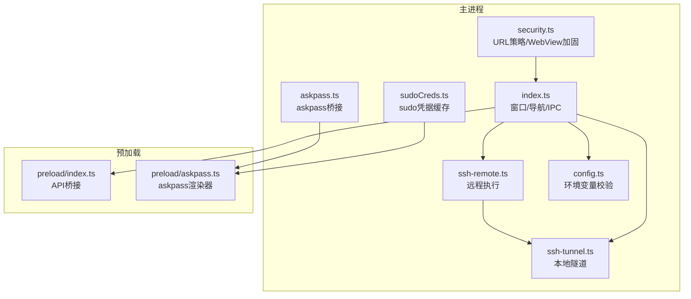
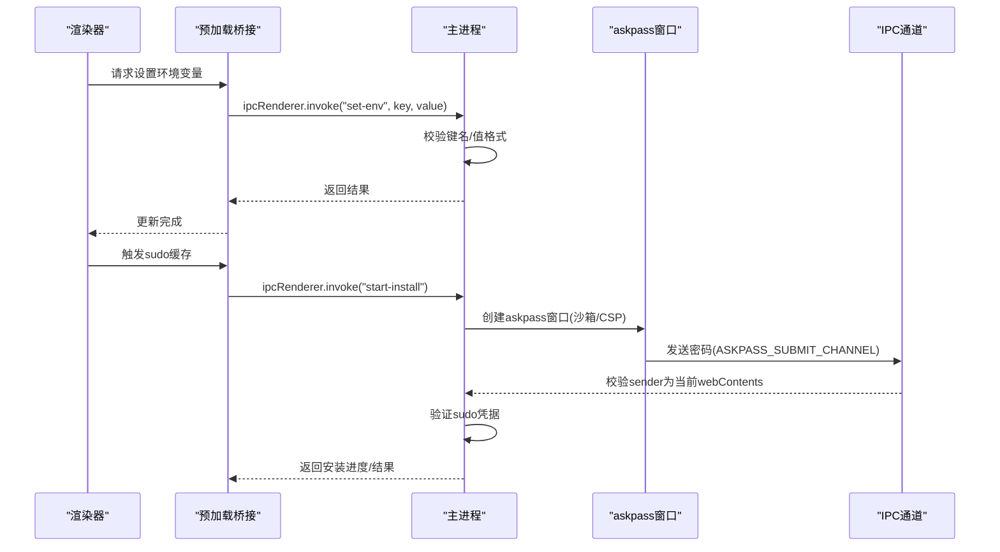
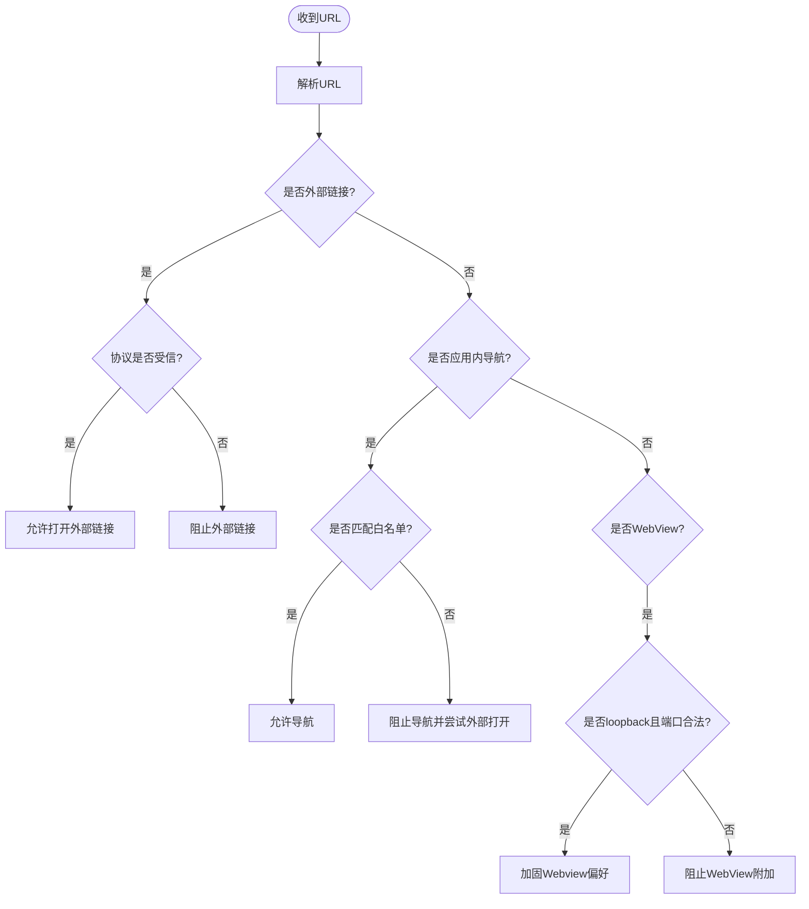
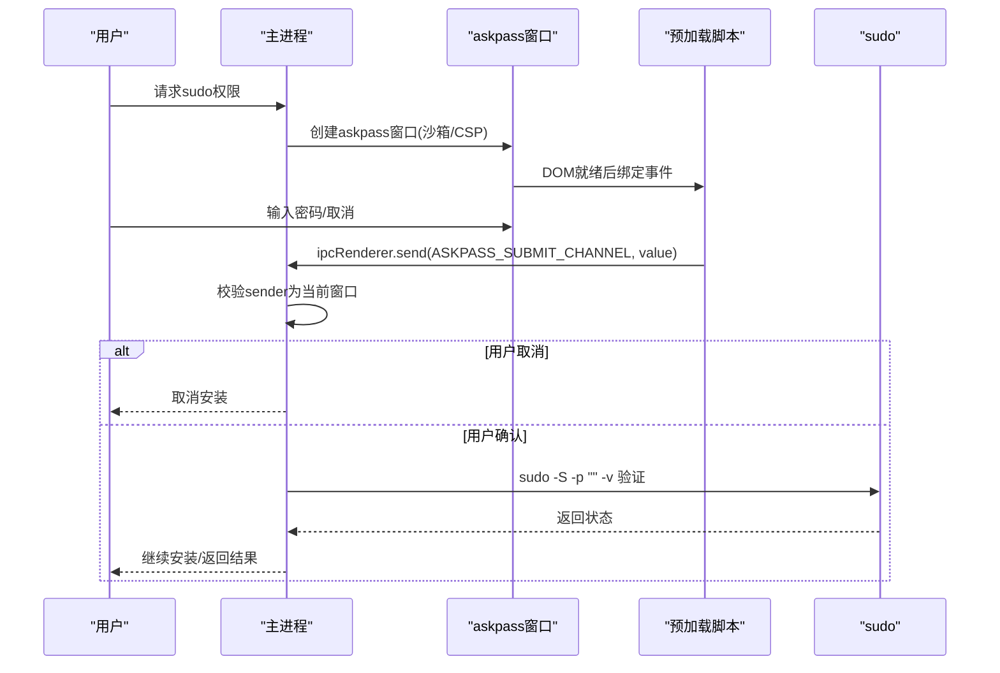
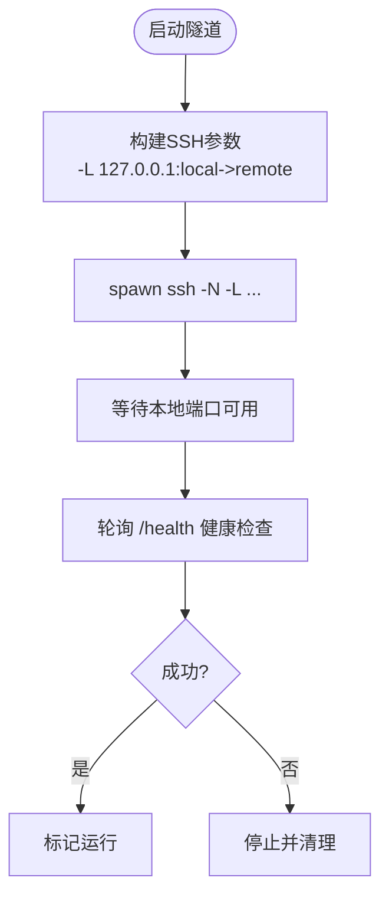
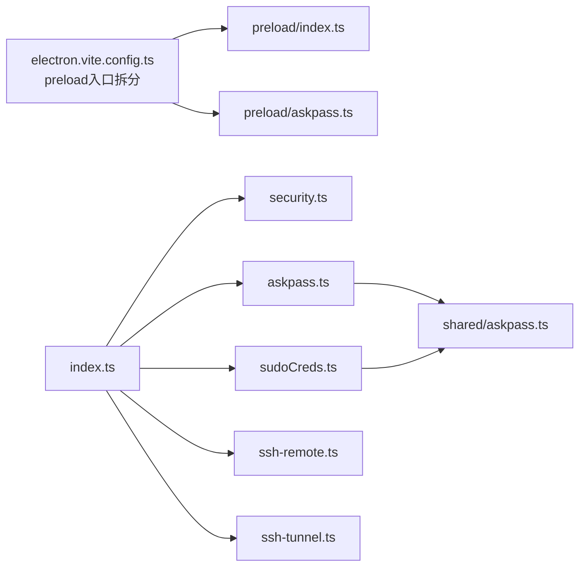

# 安全架构

<cite>
**本文引用的文件**
- [src/main/security.ts](file://src/main/security.ts)
- [src/main/index.ts](file://src/main/index.ts)
- [src/preload/index.ts](file://src/preload/index.ts)
- [src/main/askpass.ts](file://src/main/askpass.ts)
- [src/main/sudoCreds.ts](file://src/main/sudoCreds.ts)
- [src/preload/askpass.ts](file://src/preload/askpass.ts)
- [src/shared/askpass.ts](file://src/shared/askpass.ts)
- [electron.vite.config.ts](file://electron.vite.config.ts)
- [src/main/ssh-remote.ts](file://src/main/ssh-remote.ts)
- [src/main/ssh-tunnel.ts](file://src/main/ssh-tunnel.ts)
- [src/main/ssh-options.ts](file://src/main/ssh-options.ts)
- [src/main/config.ts](file://src/main/config.ts)
- [tests/electron-security.test.ts](file://tests/electron-security.test.ts)
- [tests/askpass-security.test.ts](file://tests/askpass-security.test.ts)
- [tests/env-validation.test.ts](file://tests/env-validation.test.ts)
</cite>

## 目录
1. [简介](#简介)
2. [项目结构](#项目结构)
3. [核心组件](#核心组件)
4. [架构总览](#架构总览)
5. [详细组件分析](#详细组件分析)
6. [依赖关系分析](#依赖关系分析)
7. [性能与安全权衡](#性能与安全权衡)
8. [故障排查指南](#故障排查指南)
9. [结论](#结论)
10. [附录：安全测试与审计清单](#附录安全测试与审计清单)

## 简介
本文件系统化阐述 Hermes Desktop 的安全架构与实现细节，覆盖上下文隔离、权限控制、输入验证、安全边界、sudo 密码处理、askpass 对话框、SSH 连接安全、Electron 安全最佳实践（如禁用 NodeIntegration、预加载桥接）、以及威胁建模与审计要点。文档同时提供可操作的安全测试案例与常见问题的解决方案。

## 项目结构
Hermes Desktop 的安全相关代码主要分布在以下模块：
- 主进程安全策略与窗口导航/WebView 约束：src/main/security.ts、src/main/index.ts
- 预加载桥接与 API 表面：src/preload/index.ts、src/preload/askpass.ts
- 密码输入桥接（askpass）与 sudo 凭据缓存：src/main/askpass.ts、src/main/sudoCreds.ts
- SSH 远程执行与隧道：src/main/ssh-remote.ts、src/main/ssh-tunnel.ts、src/main/ssh-options.ts
- 环境变量与配置读写校验：src/main/config.ts
- 测试与验证：tests/*.test.ts

图表来源
- [src/main/security.ts:1-78](file://src/main/security.ts#L1-L78)
- [src/main/index.ts:196-288](file://src/main/index.ts#L196-L288)
- [src/preload/index.ts:1-701](file://src/preload/index.ts#L1-L701)
- [src/main/askpass.ts:1-215](file://src/main/askpass.ts#L1-L215)
- [src/main/sudoCreds.ts:1-193](file://src/main/sudoCreds.ts#L1-L193)
- [src/preload/askpass.ts:1-28](file://src/preload/askpass.ts#L1-L28)
- [src/main/ssh-remote.ts:1-200](file://src/main/ssh-remote.ts#L1-L200)
- [src/main/ssh-tunnel.ts:1-200](file://src/main/ssh-tunnel.ts#L1-L200)
- [src/main/config.ts:101-179](file://src/main/config.ts#L101-L179)

章节来源
- [src/main/security.ts:1-78](file://src/main/security.ts#L1-L78)
- [src/main/index.ts:196-288](file://src/main/index.ts#L196-L288)
- [src/preload/index.ts:1-701](file://src/preload/index.ts#L1-L701)
- [src/main/askpass.ts:1-215](file://src/main/askpass.ts#L1-L215)
- [src/main/sudoCreds.ts:1-193](file://src/main/sudoCreds.ts#L1-L193)
- [src/preload/askpass.ts:1-28](file://src/preload/askpass.ts#L1-L28)
- [src/main/ssh-remote.ts:1-200](file://src/main/ssh-remote.ts#L1-L200)
- [src/main/ssh-tunnel.ts:1-200](file://src/main/ssh-tunnel.ts#L1-L200)
- [src/main/config.ts:101-179](file://src/main/config.ts#L101-L179)

## 核心组件
- 上下文隔离与 WebView 安全边界
  - 主进程对导航与 WebView 的严格白名单与加固策略，确保渲染器无法越权访问 Node 能力。
- 密码输入桥接（askpass）
  - 将 sudo 的交互式密码提示通过独立的受控对话框完成，并以 IPC 通道提交，避免直接 stdin 注入。
- sudo 凭据缓存
  - 在 Linux 平台上提前缓存 sudo 凭据，避免后续子进程因无 TTY 死锁；同时提供保活与清理。
- SSH 连接与隧道
  - 使用强参数与健康检查，结合本地回环端口暴露，限制远程服务可达范围。
- 预加载桥接与最小 API 表面
  - 仅暴露必要 IPC 接口，使用 contextBridge 暴露受限 API，避免全局污染。
- 环境变量与配置输入校验
  - 对键名与值进行正则与字符集约束，防止注入与跨行写入。

章节来源
- [src/main/security.ts:20-78](file://src/main/security.ts#L20-L78)
- [src/main/index.ts:250-281](file://src/main/index.ts#L250-L281)
- [src/main/askpass.ts:25-118](file://src/main/askpass.ts#L25-L118)
- [src/main/sudoCreds.ts:29-104](file://src/main/sudoCreds.ts#L29-L104)
- [src/main/ssh-tunnel.ts:120-166](file://src/main/ssh-tunnel.ts#L120-L166)
- [src/preload/index.ts:688-701](file://src/preload/index.ts#L688-L701)
- [src/main/config.ts:169-179](file://src/main/config.ts#L169-L179)

## 架构总览
Hermes Desktop 的安全架构围绕“最小权限 + 受控边界 + 明确信任链”展开：
- 渲染器通过预加载桥接调用主进程能力，不直接拥有 Node 能力。
- 主进程对导航、弹窗、外部协议与 WebView 进行白名单控制。
- askpass/sudo 对话框在独立窗口中运行，具备沙箱、隔离与 CSP。
- SSH 执行与隧道在本地回环端口上工作，严格参数与健康检查。
- 环境变量与配置写入前进行输入校验，防止注入与越权。

图表来源
- [src/preload/index.ts:78-99](file://src/preload/index.ts#L78-L99)
- [src/main/index.ts:298-307](file://src/main/index.ts#L298-L307)
- [src/main/askpass.ts:120-182](file://src/main/askpass.ts#L120-L182)
- [src/main/sudoCreds.ts:106-165](file://src/main/sudoCreds.ts#L106-L165)
- [src/shared/askpass.ts:1-2](file://src/shared/askpass.ts#L1-L2)

## 详细组件分析

### 组件一：上下文隔离与安全边界（security.ts）
- 外部链接白名单：仅允许 https/http/mailto 协议，拒绝 javascript/data/file 等高危协议。
- 应用内导航白名单：仅允许打包后的 index.html 或开发服务器特定源，防止任意文件/远程页面跳转。
- WebView URL 白名单：仅允许 loopback http://localhost/127.0.0.1/[::1]，且端口范围限定，禁止 file/remote/javascript。
- WebView 偏好加固：移除 preload/preloadURL，禁用 nodeIntegration，启用 contextIsolation/sandbox/webSecurity，禁止运行不安全内容。
- 已附加 WebContents 约束：阻止新窗口打开、拦截 will-navigate/redirect，仅允许 loopback URL。

图表来源
- [src/main/security.ts:20-78](file://src/main/security.ts#L20-L78)
- [src/main/index.ts:250-281](file://src/main/index.ts#L250-L281)

章节来源
- [src/main/security.ts:20-78](file://src/main/security.ts#L20-L78)
- [src/main/index.ts:250-281](file://src/main/index.ts#L250-L281)
- [tests/electron-security.test.ts:72-145](file://tests/electron-security.test.ts#L72-L145)

### 组件二：askpass 对话框与 sudo 凭据缓存
- askpass 桥接
  - 写入临时目录的 askpass.sh 与 sudo shim，通过 UNIX Socket 与 Python 通信，将密码从 sudo 提示传递到 GUI。
  - 对话框窗口启用沙箱、隔离、CSP、禁用 webview，拦截导航与弹窗。
- sudo 凭据缓存（Linux）
  - 非交互式检测是否已有有效缓存；否则弹出对话框收集密码并通过 sudo -S 验证并缓存。
  - 后台每 60 秒刷新缓存，安装完成后清理。
- 预加载与 IPC
  - 预加载脚本仅绑定 DOMContentLoaded 事件，通过 ipcRenderer 发送密码；主进程严格校验 event.sender 必须为当前窗口 webContents。

图表来源
- [src/main/askpass.ts:25-118](file://src/main/askpass.ts#L25-L118)
- [src/main/sudoCreds.ts:29-104](file://src/main/sudoCreds.ts#L29-L104)
- [src/preload/askpass.ts:1-28](file://src/preload/askpass.ts#L1-L28)
- [src/shared/askpass.ts:1-2](file://src/shared/askpass.ts#L1-L2)

章节来源
- [src/main/askpass.ts:25-118](file://src/main/askpass.ts#L25-L118)
- [src/main/sudoCreds.ts:29-104](file://src/main/sudoCreds.ts#L29-L104)
- [src/preload/askpass.ts:1-28](file://src/preload/askpass.ts#L1-L28)
- [tests/askpass-security.test.ts:18-95](file://tests/askpass-security.test.ts#L18-L95)

### 组件三：SSH 连接与隧道安全
- 参数与控制
  - 使用 StrictHostKeyChecking=accept-new、BatchMode=yes、ControlMaster/auto 等参数，减少交互与风险。
  - 本地隧道仅映射到 127.0.0.1:localPort -> remotePort，避免外网暴露。
- 健康检查与超时
  - 启动后等待端口开放与 /health 响应，失败自动清理进程与状态。
- 远程执行
  - 通过 sshExec/sshPython 执行命令，错误信息清洗并标准化，避免敏感信息泄露。

图表来源
- [src/main/ssh-tunnel.ts:103-166](file://src/main/ssh-tunnel.ts#L103-L166)
- [src/main/ssh-options.ts:1-22](file://src/main/ssh-options.ts#L1-22)
- [src/main/ssh-remote.ts:37-93](file://src/main/ssh-remote.ts#L37-L93)

章节来源
- [src/main/ssh-tunnel.ts:103-166](file://src/main/ssh-tunnel.ts#L103-L166)
- [src/main/ssh-options.ts:1-22](file://src/main/ssh-options.ts#L1-L22)
- [src/main/ssh-remote.ts:37-93](file://src/main/ssh-remote.ts#L37-L93)

### 组件四：预加载桥接与最小 API 表面
- contextBridge 暴露有限 API，所有 IPC 调用均通过 ipcRenderer.invoke/on，避免全局对象污染。
- 主进程对所有 IPC 处理函数进行职责分离，仅在需要时才授予能力。

章节来源
- [src/preload/index.ts:688-701](file://src/preload/index.ts#L688-L701)
- [src/main/index.ts:290-800](file://src/main/index.ts#L290-L800)

### 组件五：环境变量与配置输入校验
- 键名校验：字母、数字、下划线，不能以数字开头。
- 值校验：单行字符串，不允许换行/NUL。
- 写入策略：逐行扫描与替换，避免注入与跨行写入。

章节来源
- [src/main/config.ts:169-179](file://src/main/config.ts#L169-L179)
- [tests/env-validation.test.ts:30-75](file://tests/env-validation.test.ts#L30-L75)

## 依赖关系分析
- 预加载入口拆分：electron-vite 将主预加载与 askpass 预加载分别构建，降低攻击面。
- 主进程依赖关系：security.ts 为通用安全策略，index.ts 引用其策略并应用到窗口与 WebView；askpass/sudoCreds 依赖共享常量 ASKPASS_SUBMIT_CHANNEL；ssh-* 模块相互协作完成远程执行与隧道。

图表来源
- [electron.vite.config.ts:14-23](file://electron.vite.config.ts#L14-L23)
- [src/main/index.ts:122-127](file://src/main/index.ts#L122-L127)
- [src/main/askpass.ts:6-6](file://src/main/askpass.ts#L6-L6)
- [src/main/sudoCreds.ts:4-4](file://src/main/sudoCreds.ts#L4-L4)
- [src/shared/askpass.ts:1-2](file://src/shared/askpass.ts#L1-L2)

章节来源
- [electron.vite.config.ts:14-23](file://electron.vite.config.ts#L14-L23)
- [src/main/index.ts:122-127](file://src/main/index.ts#L122-L127)
- [src/main/askpass.ts:6-6](file://src/main/askpass.ts#L6-L6)
- [src/main/sudoCreds.ts:4-4](file://src/main/sudoCreds.ts#L4-L4)
- [src/shared/askpass.ts:1-2](file://src/shared/askpass.ts#L1-L2)

## 性能与安全权衡
- WebView 沙箱与 contextIsolation 会带来轻微性能开销，但换来显著的安全收益。
- SSH 隧道健康检查与端口探测增加启动时间，但能避免后续请求失败带来的重试成本。
- askpass/sudo 缓存减少安装过程中的阻塞与死锁风险，提升用户体验。

## 故障排查指南
- 外部链接被阻止
  - 检查 URL 协议是否为 https/http/mailto；确认主进程 openExternalUrl 路由逻辑。
  - 参考：[src/main/index.ts:185-194](file://src/main/index.ts#L185-L194)、[src/main/security.ts:20-23](file://src/main/security.ts#L20-L23)
- 应用内导航被阻止
  - 确认目标 URL 是否匹配打包后的 index.html 或开发服务器源；检查 isAllowedAppNavigationUrl。
  - 参考：[src/main/index.ts:255-268](file://src/main/index.ts#L255-L268)、[src/main/security.ts:25-42](file://src/main/security.ts#L25-L42)
- WebView 无法附加
  - 确认 src 为 loopback http 且端口在允许范围内；检查 hardenWebviewPreferences。
  - 参考：[src/main/index.ts:270-281](file://src/main/index.ts#L270-L281)、[src/main/security.ts:44-63](file://src/main/security.ts#L44-L63)
- askpass 对话框无法输入或被拦截
  - 确认 CSP 未禁用表单提交；检查预加载脚本事件绑定与 ipcMain 校验 sender。
  - 参考：[src/main/askpass.ts:120-182](file://src/main/askpass.ts#L120-L182)、[src/preload/askpass.ts:1-28](file://src/preload/askpass.ts#L1-L28)
- sudo 缓存失败或超时
  - 检查 sudo 权限与缓存 TTL；确认 keepalive 与 stop() 生命周期。
  - 参考：[src/main/sudoCreds.ts:86-104](file://src/main/sudoCreds.ts#L86-L104)
- SSH 隧道不可达
  - 检查本地端口占用、远端端口连通性与 /health 响应；确认参数与 ControlMaster 设置。
  - 参考：[src/main/ssh-tunnel.ts:120-166](file://src/main/ssh-tunnel.ts#L120-L166)、[src/main/ssh-options.ts:1-22](file://src/main/ssh-options.ts#L1-L22)
- 环境变量写入失败
  - 检查键名与值是否满足正则与单行限制；确认 .env 文件存在与写入路径。
  - 参考：[src/main/config.ts:169-179](file://src/main/config.ts#L169-L179)、[tests/env-validation.test.ts:43-75](file://tests/env-validation.test.ts#L43-L75)

## 结论
Hermes Desktop 采用多层安全边界与最小权限原则，结合严格的输入校验、沙箱与隔离、可控的 IPC 桥接以及 SSH 隧道健康检查，构建了稳健的桌面应用安全基线。通过持续的单元测试与集成测试，确保关键安全策略在运行时得到正确实施。

## 附录：安全测试与审计清单
- Electron 主进程安全
  - 主窗口 webPreferences 禁用 NodeIntegration、启用 contextIsolation/sandbox/webSecurity；拦截 will-navigate/redirect；仅允许受信外部协议。
  - 参考：[tests/electron-security.test.ts:18-70](file://tests/electron-security.test.ts#L18-L70)
- askpass 对话框安全
  - 窗口沙箱/CSP/禁用 webview；严格校验 IPC 发送方；预加载脚本仅绑定 DOM 事件。
  - 参考：[tests/askpass-security.test.ts:18-95](file://tests/askpass-security.test.ts#L18-L95)
- SSH 执行与隧道
  - 参数严格、健康检查、超时控制；远程执行输出清洗。
  - 参考：[src/main/ssh-remote.ts:37-93](file://src/main/ssh-remote.ts#L37-L93)、[src/main/ssh-tunnel.ts:120-166](file://src/main/ssh-tunnel.ts#L120-L166)
- 环境变量与配置
  - 键名/值正则校验；单行写入；缓存 TTL 控制。
  - 参考：[tests/env-validation.test.ts:30-75](file://tests/env-validation.test.ts#L30-L75)