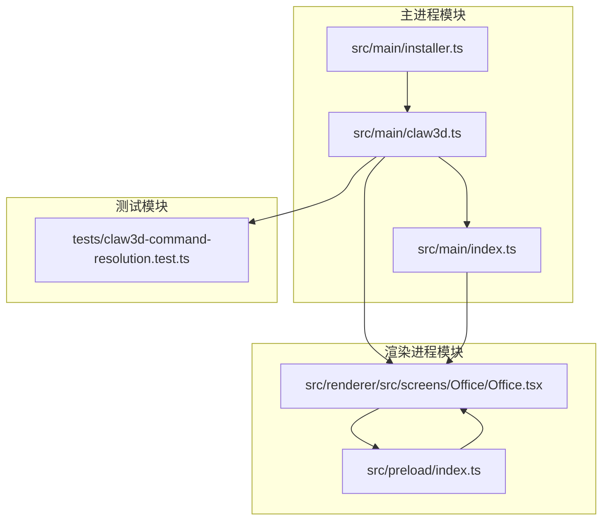
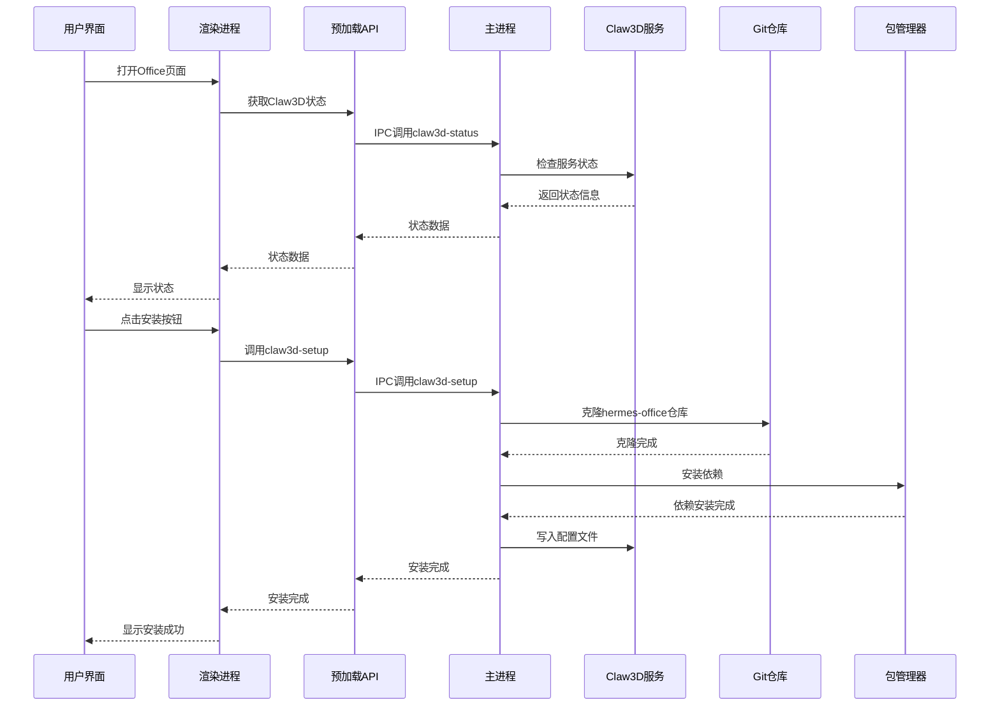
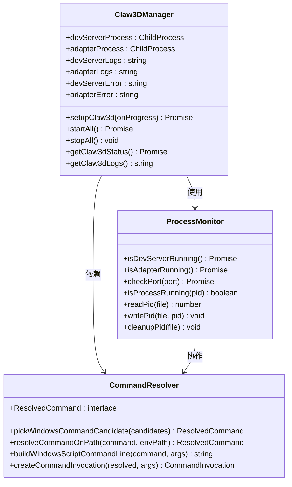
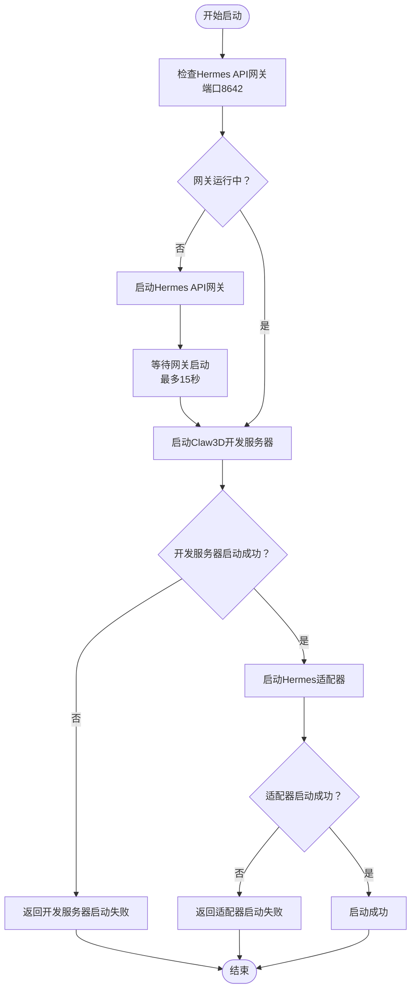
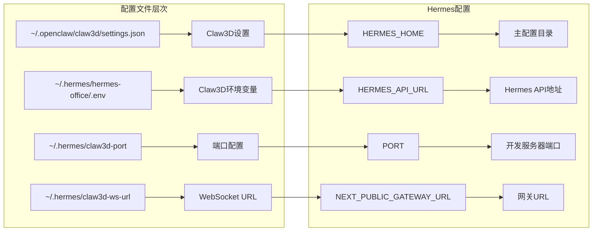
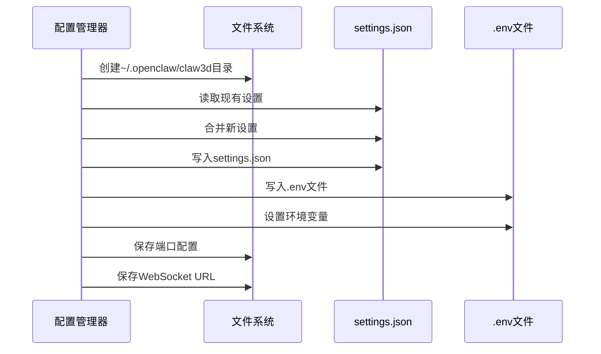
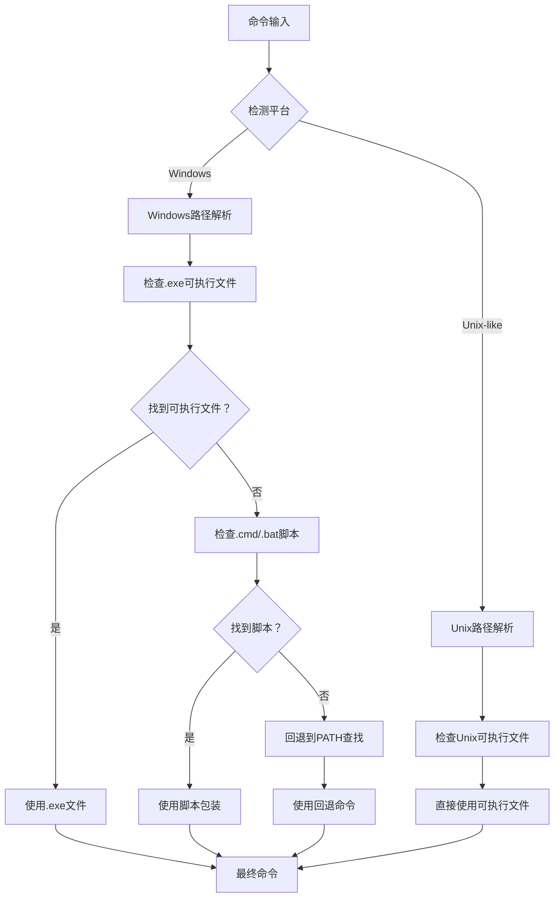
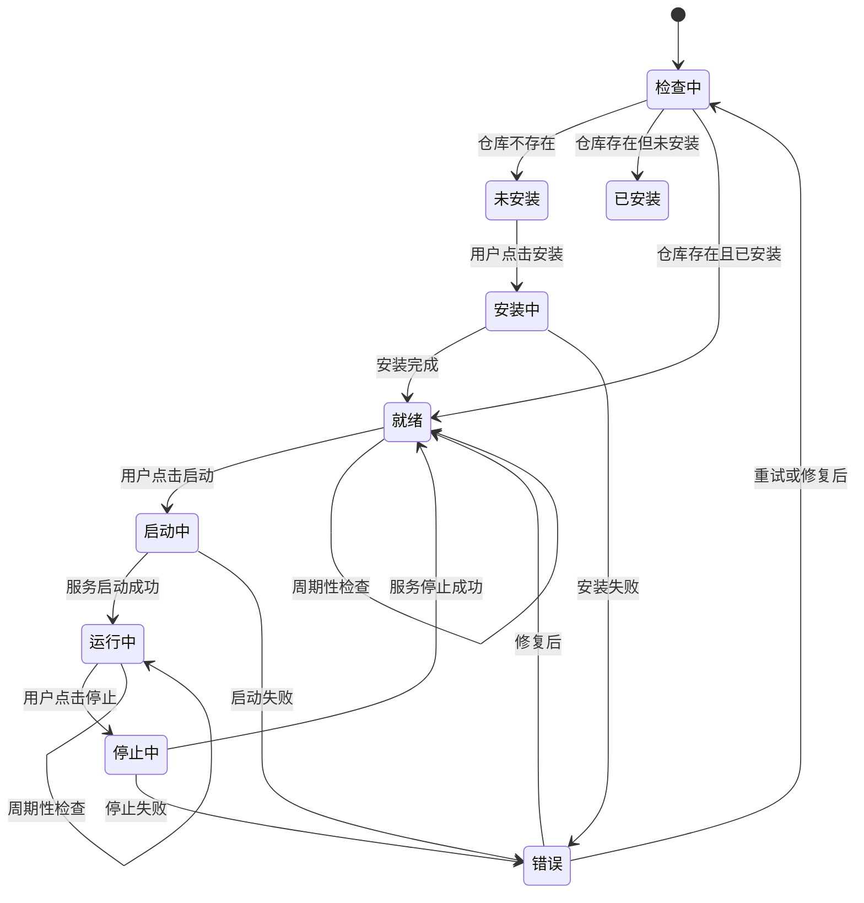
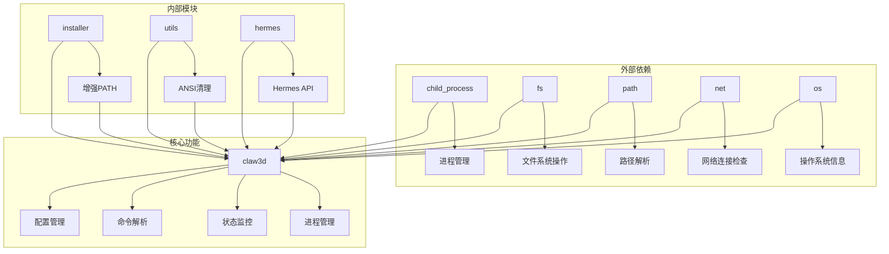
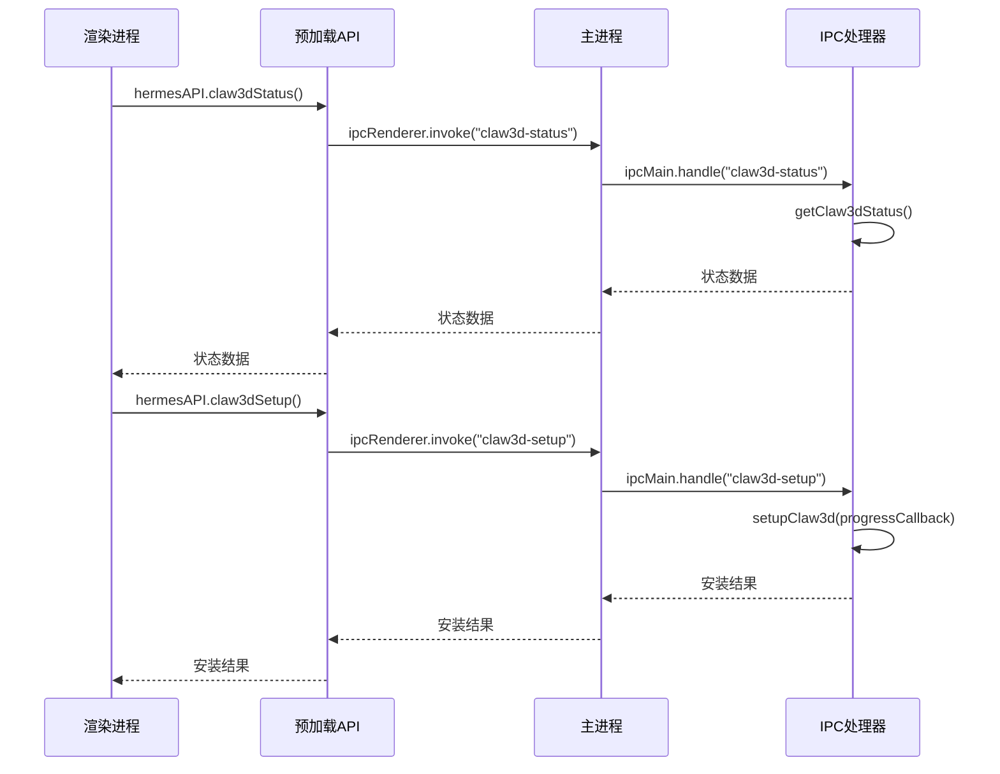

# Claw3D启动流

<cite>
**本文档引用的文件**
- [src/main/claw3d.ts](file://src/main/claw3d.ts)
- [src/main/index.ts](file://src/main/index.ts)
- [src/renderer/src/screens/Office/Office.tsx](file://src/renderer/src/screens/Office/Office.tsx)
- [src/preload/index.ts](file://src/preload/index.ts)
- [src/main/installer.ts](file://src/main/installer.ts)
- [tests/claw3d-command-resolution.test.ts](file://tests/claw3d-command-resolution.test.ts)
</cite>

## 目录
1. [简介](#简介)
2. [项目结构](#项目结构)
3. [核心组件](#核心组件)
4. [架构概览](#架构概览)
5. [详细组件分析](#详细组件分析)
6. [依赖关系分析](#依赖关系分析)
7. [性能考虑](#性能考虑)
8. [故障排除指南](#故障排除指南)
9. [结论](#结论)

## 简介

本文档详细阐述了Hermes Desktop中Claw3D启动流的技术实现。Claw3D是一个基于Web的3D办公环境，通过Hermes Desktop进行管理和控制。该启动流涵盖了从应用启动到3D环境就绪的完整流程，包括Claw3D进程管理、环境变量配置和启动参数处理。

系统采用Electron架构，通过主进程负责Claw3D的生命周期管理，渲染进程提供用户界面和交互功能。启动流程涉及多个组件的协调工作：Git仓库克隆、Node.js包管理器检测、进程启动和监控、WebSocket适配器等。

## 项目结构

Claw3D启动流相关的代码主要分布在以下文件中：

**图表来源**
- [src/main/claw3d.ts:1-890](file://src/main/claw3d.ts#L1-L890)
- [src/main/index.ts:1-1234](file://src/main/index.ts#L1-L1234)

**章节来源**
- [src/main/claw3d.ts:1-890](file://src/main/claw3d.ts#L1-L890)
- [src/main/index.ts:1-1234](file://src/main/index.ts#L1-L1234)

## 核心组件

### 主进程Claw3D管理器

主进程中的`claw3d.ts`文件提供了完整的Claw3D生命周期管理功能：

- **进程管理**：负责启动、停止和监控Claw3D开发服务器和适配器进程
- **环境配置**：自动配置`.openclaw`目录下的设置文件和`.env`环境变量
- **状态监控**：实时跟踪Claw3D服务的运行状态和端口占用情况
- **命令解析**：智能解析和执行Windows脚本和可执行文件

### 渲染进程Office界面

Office界面提供了用户友好的Claw3D管理体验：

- **状态显示**：实时显示Claw3D的安装状态、运行状态和错误信息
- **操作控制**：提供安装、启动、停止、重启等操作按钮
- **配置管理**：允许用户修改端口号和WebSocket URL
- **日志查看**：集成进程日志查看功能

### 预加载API桥接

预加载脚本建立了安全的IPC通信通道：

- **API暴露**：向渲染进程暴露所有Claw3D相关的API方法
- **事件监听**：处理安装进度、状态更新等异步事件
- **类型定义**：提供完整的TypeScript类型定义确保类型安全

**章节来源**
- [src/main/claw3d.ts:250-341](file://src/main/claw3d.ts#L250-L341)
- [src/renderer/src/screens/Office/Office.tsx:1-489](file://src/renderer/src/screens/Office/Office.tsx#L1-L489)
- [src/preload/index.ts:470-531](file://src/preload/index.ts#L470-L531)

## 架构概览

Claw3D启动流采用分层架构设计，确保各组件职责清晰且松耦合：

**图表来源**
- [src/renderer/src/screens/Office/Office.tsx:53-93](file://src/renderer/src/screens/Office/Office.tsx#L53-L93)
- [src/main/index.ts:894-903](file://src/main/index.ts#L894-L903)
- [src/main/claw3d.ts:514-644](file://src/main/claw3d.ts#L514-L644)

## 详细组件分析

### 进程管理与监控

Claw3D启动流的核心是进程管理和状态监控机制：

**图表来源**
- [src/main/claw3d.ts:26-36](file://src/main/claw3d.ts#L26-L36)
- [src/main/claw3d.ts:300-317](file://src/main/claw3d.ts#L300-L317)
- [src/main/claw3d.ts:48-134](file://src/main/claw3d.ts#L48-L134)

#### 进程启动序列

Claw3D启动遵循严格的顺序：先检查并启动Hermes API网关，然后启动开发服务器，最后启动WebSocket适配器：

**图表来源**
- [src/main/claw3d.ts:837-873](file://src/main/claw3d.ts#L837-L873)

**章节来源**
- [src/main/claw3d.ts:667-814](file://src/main/claw3d.ts#L667-L814)
- [src/main/claw3d.ts:837-873](file://src/main/claw3d.ts#L837-L873)

### 环境变量配置与设置管理

Claw3D的环境配置采用了多层结构，确保灵活性和可靠性：

**图表来源**
- [src/main/claw3d.ts:176-229](file://src/main/claw3d.ts#L176-L229)
- [src/main/claw3d.ts:136-170](file://src/main/claw3d.ts#L136-L170)

#### 设置写入流程

设置文件的写入采用了原子性和容错设计：

**图表来源**
- [src/main/claw3d.ts:176-229](file://src/main/claw3d.ts#L176-L229)

**章节来源**
- [src/main/claw3d.ts:176-229](file://src/main/claw3d.ts#L176-L229)
- [src/main/claw3d.ts:136-170](file://src/main/claw3d.ts#L136-L170)

### 命令解析与跨平台兼容性

Claw3D实现了智能的命令解析机制，支持多种平台和工具链：

**图表来源**
- [src/main/claw3d.ts:48-134](file://src/main/claw3d.ts#L48-L134)

#### Windows脚本命令行构建

针对Windows平台的特殊处理：

**章节来源**
- [src/main/claw3d.ts:48-134](file://src/main/claw3d.ts#L48-L134)
- [tests/claw3d-command-resolution.test.ts:1-48](file://tests/claw3d-command-resolution.test.ts#L1-L48)

### 状态监控与健康检查

系统实现了多层次的状态监控机制：

**图表来源**
- [src/renderer/src/screens/Office/Office.tsx:53-93](file://src/renderer/src/screens/Office/Office.tsx#L53-L93)
- [src/main/claw3d.ts:319-341](file://src/main/claw3d.ts#L319-L341)

**章节来源**
- [src/renderer/src/screens/Office/Office.tsx:53-93](file://src/renderer/src/screens/Office/Office.tsx#L53-L93)
- [src/main/claw3d.ts:319-341](file://src/main/claw3d.ts#L319-L341)

## 依赖关系分析

Claw3D启动流涉及多个模块间的复杂依赖关系：

**图表来源**
- [src/main/claw3d.ts:1-14](file://src/main/claw3d.ts#L1-L14)
- [src/main/installer.ts:56-104](file://src/main/installer.ts#L56-L104)

### IPC通信架构

主进程和渲染进程之间的IPC通信采用事件驱动模式：

**图表来源**
- [src/preload/index.ts:470-531](file://src/preload/index.ts#L470-L531)
- [src/main/index.ts:894-903](file://src/main/index.ts#L894-L903)

**章节来源**
- [src/preload/index.ts:470-531](file://src/preload/index.ts#L470-L531)
- [src/main/index.ts:891-932](file://src/main/index.ts#L891-L932)

## 性能考虑

### 启动性能优化

Claw3D启动流在多个方面进行了性能优化：

- **异步安装**：使用Promise链式调用避免阻塞UI线程
- **缓存策略**：对命令解析结果进行缓存，减少重复查找
- **增量日志**：限制日志缓冲区大小，避免内存泄漏
- **端口检查**：快速端口可用性检查，减少启动延迟

### 资源管理

- **进程树清理**：实现完整的进程树终止机制，防止僵尸进程
- **PID文件管理**：使用PID文件确保进程状态的一致性
- **文件句柄清理**：及时关闭文件描述符和网络连接
- **内存管理**：定期清理日志缓冲区，控制内存使用

### 并发控制

- **串行化安装**：确保Git克隆和依赖安装的顺序执行
- **并发进程**：开发服务器和适配器可以并行启动
- **超时控制**：为关键操作设置合理的超时时间
- **重试机制**：对临时性错误提供自动重试

## 故障排除指南

### 常见启动问题及解决方案

#### 1. Git克隆失败

**症状**：安装过程中出现Git错误
**原因**：
- 网络连接问题
- Git认证失败
- 代理配置问题

**解决方案**：
- 检查网络连接和代理设置
- 验证Git凭证配置
- 手动克隆仓库验证权限

#### 2. 依赖安装失败

**症状**：pnpm安装过程中出现错误
**原因**：
- 网络连接不稳定
- 缓存损坏
- Node.js版本不兼容

**解决方案**：
- 清理pnpm缓存
- 更新Node.js版本
- 使用镜像源加速下载

#### 3. 端口占用冲突

**症状**：开发服务器无法启动
**原因**：
- 默认端口(3000)被其他程序占用
- WebSocket端口(18789)被占用

**解决方案**：
- 修改Claw3D端口号
- 终止占用端口的进程
- 使用防火墙规则

#### 4. 进程启动失败

**症状**：开发服务器或适配器无法启动
**原因**：
- Node.js环境缺失
- 权限不足
- 路径解析错误

**解决方案**：
- 验证Node.js安装
- 检查文件权限
- 使用增强PATH

### 调试技巧

#### 日志分析

系统提供了详细的日志记录机制：

1. **进程日志**：分别记录开发服务器和适配器的日志
2. **错误追踪**：捕获并存储最近的错误信息
3. **状态监控**：实时监控服务状态变化

#### 状态检查

通过Office界面的状态指示器可以快速识别问题：

- **检查状态**：显示当前Claw3D的完整状态
- **端口占用**：提示端口冲突警告
- **错误信息**：显示具体的错误详情

**章节来源**
- [src/main/claw3d.ts:882-890](file://src/main/claw3d.ts#L882-L890)
- [src/renderer/src/screens/Office/Office.tsx:399-414](file://src/renderer/src/screens/Office/Office.tsx#L399-L414)

## 结论

Hermes Desktop的Claw3D启动流展现了现代桌面应用的优秀实践：

### 技术亮点

1. **模块化设计**：清晰的职责分离和接口定义
2. **跨平台兼容**：完善的Windows和Unix-like系统支持
3. **健壮性保证**：全面的错误处理和恢复机制
4. **用户体验**：直观的界面和实时状态反馈

### 架构优势

- **分层架构**：主进程、渲染进程、预加载脚本各司其职
- **事件驱动**：基于IPC的消息传递机制
- **异步处理**：非阻塞的用户体验
- **状态管理**：完整的生命周期跟踪

### 改进建议

1. **监控增强**：添加更详细的性能指标收集
2. **自动化测试**：扩展测试覆盖率，特别是边界条件
3. **配置热重载**：支持运行时配置的动态更新
4. **容器化支持**：考虑Docker等容器化部署选项

该启动流为开发者提供了可靠的3D办公环境基础，通过模块化的架构设计和完善的错误处理机制，确保了系统的稳定性和可维护性。