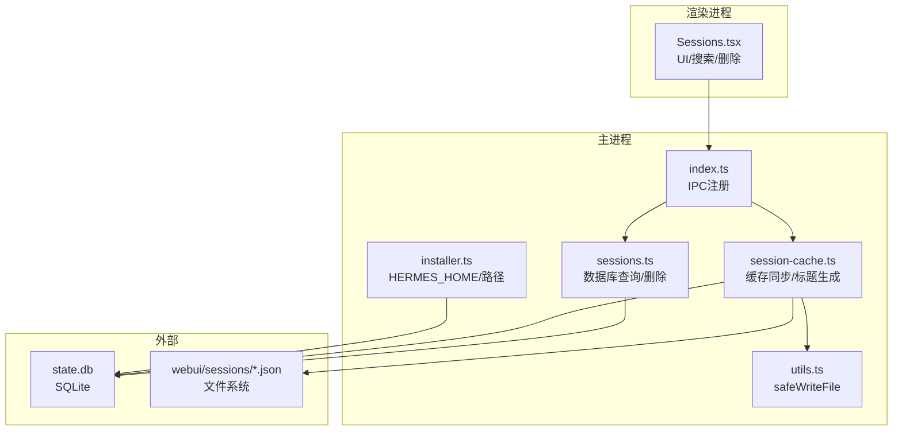
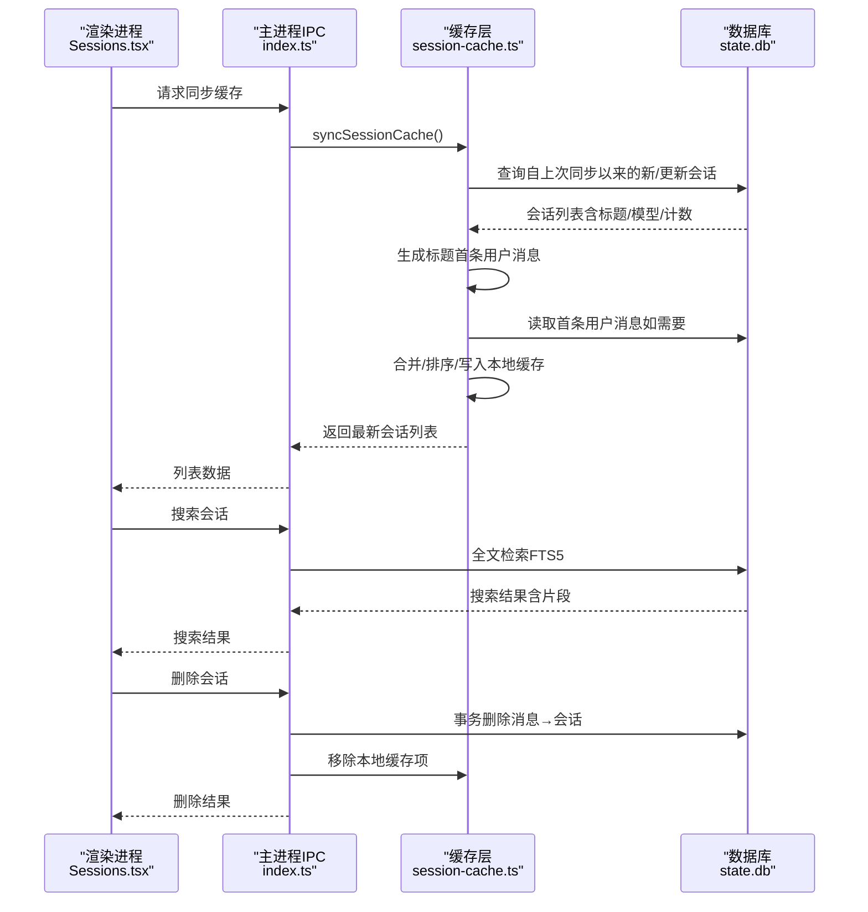
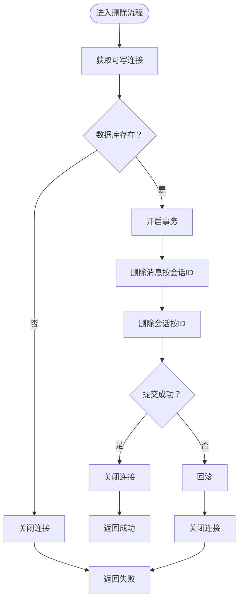
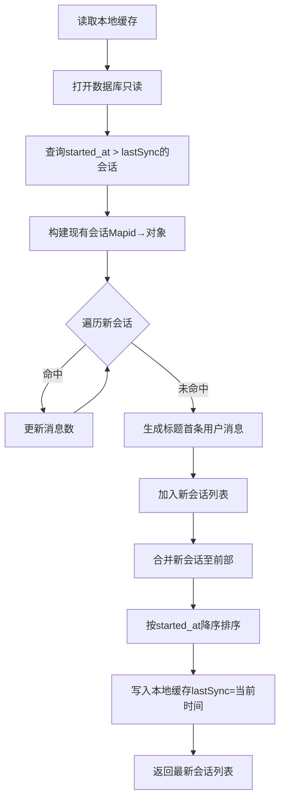
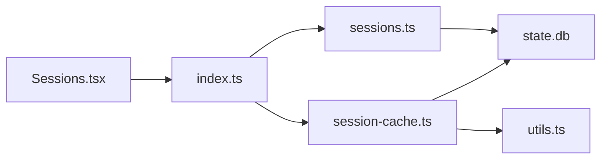

# 会话持久化流

<cite>
**本文档引用的文件**
- [sessions.ts](file://src/main/sessions.ts)
- [session-cache.ts](file://src/main/session-cache.ts)
- [installer.ts](file://src/main/installer.ts)
- [utils.ts](file://src/main/utils.ts)
- [Sessions.tsx](file://src/renderer/src/screens/Sessions/Sessions.tsx)
- [sessions.ts（国际化）](file://src/shared/i18n/locales/zh-CN/sessions.ts)
- [sessions-delete-feature.md](file://docs/sessions-delete-feature.md)
- [sessions-delete-fix-2026-05-14.md](file://docs/sessions-delete-fix-2026-05-14.md)
- [session-cache-sync.test.ts](file://tests/session-cache-sync.test.ts)
- [index.ts](file://src/main/index.ts)
</cite>

## 目录
1. [简介](#简介)
2. [项目结构](#项目结构)
3. [核心组件](#核心组件)
4. [架构总览](#架构总览)
5. [详细组件分析](#详细组件分析)
6. [依赖关系分析](#依赖关系分析)
7. [性能考量](#性能考量)
8. [故障排查指南](#故障排查指南)
9. [结论](#结论)
10. [附录](#附录)

## 简介
本文件面向Hermes Desktop的会话持久化流，系统性阐述从内存到磁盘的完整数据路径，重点覆盖以下方面：
- SQLite数据库操作与事务管理
- 会话缓存策略与增量同步
- 会话生命周期管理与删除流程
- 并发访问控制与一致性保证
- 查询优化与全文检索（FTS5）
- 会话数据流图与关键处理序列图

目标是帮助开发者与维护者快速理解并优化会话持久化子系统。

## 项目结构
围绕会话持久化的相关文件分布如下：
- 主进程数据库接口：src/main/sessions.ts
- 会话缓存与标题生成：src/main/session-cache.ts
- 应用目录与路径常量：src/main/installer.ts
- 安全写文件工具：src/main/utils.ts
- 渲染进程会话界面：src/renderer/src/screens/Sessions/Sessions.tsx
- 国际化文案：src/shared/i18n/locales/zh-CN/sessions.ts
- 删除功能文档：docs/sessions-delete-feature.md、docs/sessions-delete-fix-2026-05-14.md
- 缓存同步测试：tests/session-cache-sync.test.ts
- IPC注册入口：src/main/index.ts

图表来源
- [sessions.ts:1-212](file://src/main/sessions.ts#L1-L212)
- [session-cache.ts:1-252](file://src/main/session-cache.ts#L1-L252)
- [installer.ts:20-32](file://src/main/installer.ts#L20-L32)
- [utils.ts:80-85](file://src/main/utils.ts#L80-L85)
- [index.ts:82-88](file://src/main/index.ts#L82-L88)
- [Sessions.tsx:171-220](file://src/renderer/src/screens/Sessions/Sessions.tsx#L171-L220)

章节来源
- [sessions.ts:1-212](file://src/main/sessions.ts#L1-L212)
- [session-cache.ts:1-252](file://src/main/session-cache.ts#L1-L252)
- [installer.ts:20-32](file://src/main/installer.ts#L20-L32)
- [utils.ts:80-85](file://src/main/utils.ts#L80-L85)
- [index.ts:82-88](file://src/main/index.ts#L82-L88)
- [Sessions.tsx:171-220](file://src/renderer/src/screens/Sessions/Sessions.tsx#L171-L220)

## 核心组件
- 数据库接口（sessions.ts）
  - 提供会话列表、全文检索、消息读取、删除等能力
  - 使用只读连接进行查询，可写连接进行删除
  - 采用事务保证删除的一致性
- 会话缓存（session-cache.ts）
  - 将数据库中的会话摘要同步到本地JSON缓存
  - 增量同步：基于上次同步时间戳，仅拉取新增/更新的会话
  - 标题生成：从首条用户消息派生人类可读标题
  - 支持删除会话的本地缓存清理
- 路径与工具（installer.ts、utils.ts）
  - 定义应用数据目录（HERMES_HOME）与数据库路径
  - 提供安全写文件工具，避免目录缺失导致的异常
- 渲染进程（Sessions.tsx）
  - 列表展示、分组显示、搜索高亮、删除交互
  - 通过IPC调用主进程接口完成缓存同步与删除

章节来源
- [sessions.ts:46-211](file://src/main/sessions.ts#L46-L211)
- [session-cache.ts:83-167](file://src/main/session-cache.ts#L83-L167)
- [installer.ts:20-32](file://src/main/installer.ts#L20-L32)
- [utils.ts:80-85](file://src/main/utils.ts#L80-L85)
- [Sessions.tsx:171-220](file://src/renderer/src/screens/Sessions/Sessions.tsx#L171-L220)

## 架构总览
会话持久化流由“数据库—缓存—UI”三层协同构成：
- 数据库层：SQLite state.db，提供会话与消息的结构化存储
- 缓存层：本地JSON文件（sessions.json），承载会话摘要与标题，提升启动与列表加载性能
- UI层：渲染进程负责展示、搜索与删除操作，通过IPC与主进程交互

图表来源
- [Sessions.tsx:199-209](file://src/renderer/src/screens/Sessions/Sessions.tsx#L199-L209)
- [index.ts:82-88](file://src/main/index.ts#L82-L88)
- [session-cache.ts:83-167](file://src/main/session-cache.ts#L83-L167)
- [sessions.ts:91-156](file://src/main/sessions.ts#L91-L156)
- [sessions.ts:188-211](file://src/main/sessions.ts#L188-L211)

## 详细组件分析

### 数据库接口（sessions.ts）
- 连接管理
  - 只读查询：getDb()返回只读连接，适合高频读场景
  - 写操作：getDbWritable()返回可写连接，用于删除等写操作
- 查询能力
  - 列表：按开始时间倒序分页列出会话摘要
  - 搜索：基于FTS5虚拟表进行全文检索，返回高亮片段
  - 消息：按时间戳顺序读取指定会话的消息（排除tool）
- 删除流程
  - 开启外键约束，使用事务先删消息后删会话，保证参照完整性
  - 包装日志输出便于排障

图表来源
- [sessions.ts:188-211](file://src/main/sessions.ts#L188-L211)

章节来源
- [sessions.ts:36-44](file://src/main/sessions.ts#L36-L44)
- [sessions.ts:46-89](file://src/main/sessions.ts#L46-L89)
- [sessions.ts:91-156](file://src/main/sessions.ts#L91-L156)
- [sessions.ts:158-186](file://src/main/sessions.ts#L158-L186)
- [sessions.ts:188-211](file://src/main/sessions.ts#L188-L211)

### 会话缓存（session-cache.ts）
- 缓存结构
  - sessions.json保存会话摘要数组，包含id、标题、开始时间、来源、消息数、模型
  - lastSync记录上次同步时间戳，用于增量同步
- 增量同步算法
  - 仅查询started_at大于上次同步时间戳的会话
  - 使用Map建立现有会话的id索引，避免O(N²)合并，复杂度降为O(N)
  - 对于缺失标题的会话，从数据库读取首条用户消息并生成标题
  - 合并新会话至最前，整体按started_at降序
- 标题生成规则
  - 基于首条用户消息，去除Markdown、URL与多余空白，截断至合理长度
  - 若为空则使用国际化文案“新对话”
- 删除与清理
  - 删除会话时同步从本地缓存移除对应项
  - 删除完成后返回true，确保UI即时更新

图表来源
- [session-cache.ts:83-167](file://src/main/session-cache.ts#L83-L167)
- [session-cache.ts:29-58](file://src/main/session-cache.ts#L29-L58)

章节来源
- [session-cache.ts:15-27](file://src/main/session-cache.ts#L15-L27)
- [session-cache.ts:60-75](file://src/main/session-cache.ts#L60-L75)
- [session-cache.ts:83-167](file://src/main/session-cache.ts#L83-L167)
- [session-cache.ts:178-198](file://src/main/session-cache.ts#L178-L198)

### IPC与渲染进程交互（index.ts、Sessions.tsx）
- IPC注册
  - 主进程注册会话相关IPC处理器，包括列表、消息、搜索、缓存同步等
  - 删除会话时，主进程执行数据库删除并清理本地缓存
- 渲染进程
  - 首次加载与视图可见时触发缓存同步
  - 支持搜索输入防抖，调用搜索接口并高亮片段
  - 删除会话弹窗确认，成功后从UI状态移除

章节来源
- [index.ts:82-88](file://src/main/index.ts#L82-L88)
- [Sessions.tsx:199-209](file://src/renderer/src/screens/Sessions/Sessions.tsx#L199-L209)
- [Sessions.tsx:186-197](file://src/renderer/src/screens/Sessions/Sessions.tsx#L186-L197)

### 删除功能与一致性（sessions-delete-feature.md、sessions-delete-fix-2026-05-14.md）
- 删除链路
  - 渲染进程发起删除请求
  - 主进程执行数据库删除（事务），同时清理本地缓存
  - 若会话仅存在于缓存（数据库/webui不存在），仍需返回true以保证UI一致
- 修复要点
  - 在移除缓存前检查会话是否曾存在于缓存，确保删除语义正确

章节来源
- [sessions-delete-feature.md:1-216](file://docs/sessions-delete-feature.md#L1-L216)
- [sessions-delete-fix-2026-05-14.md:1-71](file://docs/sessions-delete-fix-2026-05-14.md#L1-L71)
- [session-cache.ts:200-251](file://src/main/session-cache.ts#L200-L251)

## 依赖关系分析
- 组件耦合
  - sessions.ts与session-cache.ts均依赖SQLite state.db
  - session-cache.ts依赖utils.safeWriteFile确保缓存落盘安全
  - Sessions.tsx通过index.ts暴露的IPC通道与主进程交互
- 外部依赖
  - better-sqlite3：提供高性能SQLite绑定
  - i18n：标题生成与UI文案依赖国际化模块

图表来源
- [sessions.ts:1-6](file://src/main/sessions.ts#L1-L6)
- [session-cache.ts:1-13](file://src/main/session-cache.ts#L1-L13)
- [utils.ts:80-85](file://src/main/utils.ts#L80-L85)
- [index.ts:82-88](file://src/main/index.ts#L82-L88)

章节来源
- [sessions.ts:1-6](file://src/main/sessions.ts#L1-L6)
- [session-cache.ts:1-13](file://src/main/session-cache.ts#L1-L13)
- [utils.ts:80-85](file://src/main/utils.ts#L80-L85)
- [index.ts:82-88](file://src/main/index.ts#L82-L88)

## 性能考量
- 增量同步优化
  - 使用Map索引现有会话，避免O(N²)合并，解决数千会话启动卡顿问题
  - 测试覆盖：1500条缓存与1500条更新场景下，同步耗时显著降低
- 查询优化
  - 会话列表与消息查询均按时间与ID排序，利用SQLite索引提升稳定性
  - 搜索使用FTS5虚拟表，配合snippet高亮，减少文本扫描成本
- I/O与并发
  - 只读查询使用只读连接，避免写锁竞争
  - 删除使用事务，减少中间态风险
- 缓存策略
  - 本地JSON缓存降低频繁读取数据库的开销
  - safeWriteFile确保父目录不存在时自动创建，避免崩溃

章节来源
- [session-cache-sync.test.ts:345-370](file://tests/session-cache-sync.test.ts#L345-L370)
- [session-cache.ts:106-111](file://src/main/session-cache.ts#L106-L111)
- [sessions.ts:91-156](file://src/main/sessions.ts#L91-L156)
- [utils.ts:80-85](file://src/main/utils.ts#L80-L85)

## 故障排查指南
- 数据库未找到或无法打开
  - 检查HERMES_HOME与state.db路径是否正确
  - 确认应用安装状态与权限
- 删除失败
  - 查看主进程日志中删除流程的输出
  - 确认外键约束已启用且事务正常提交
- 缓存不同步
  - 确认syncSessionCache被调用（首次加载与视图可见时）
  - 检查lastSync时间戳是否正确更新
- 搜索无结果
  - 确认FTS5表是否存在
  - 检查查询字符串清洗与空查询处理
- UI未更新
  - 确认删除返回值逻辑（即使数据库不存在也会根据缓存状态返回true）

章节来源
- [sessions.ts:188-211](file://src/main/sessions.ts#L188-L211)
- [session-cache.ts:200-251](file://src/main/session-cache.ts#L200-L251)
- [sessions.ts:96-103](file://src/main/sessions.ts#L96-L103)
- [sessions-delete-fix-2026-05-14.md:9-14](file://docs/sessions-delete-fix-2026-05-14.md#L9-L14)

## 结论
Hermes Desktop的会话持久化流通过“数据库+缓存+UI”的清晰分层，实现了高效、可扩展且一致的会话管理：
- 数据库提供强一致的结构化存储与事务保障
- 缓存层以增量同步与标题生成提升用户体验
- IPC桥接使渲染进程能够以声明式方式完成复杂操作
- 性能测试与修复确保在大规模数据下的稳定性

建议后续关注点：
- 在SSH模式下补充删除能力或明确限制
- 扩展缓存字段以减少数据库侧标题生成压力
- 增加缓存校验与恢复机制，提升容错能力

## 附录
- 关键路径常量
  - HERMES_HOME：应用数据根目录
  - state.db：SQLite数据库文件
  - desktop/sessions.json：会话缓存文件
  - webui/sessions/_index.json：WebUI会话索引
- 国际化键值
  - sessions.delete、sessions.deleteConfirm用于删除确认提示

章节来源
- [installer.ts:20-32](file://src/main/installer.ts#L20-L32)
- [session-cache.ts:9-13](file://src/main/session-cache.ts#L9-L13)
- [sessions.ts（国际化）:16-18](file://src/shared/i18n/locales/zh-CN/sessions.ts#L16-L18)