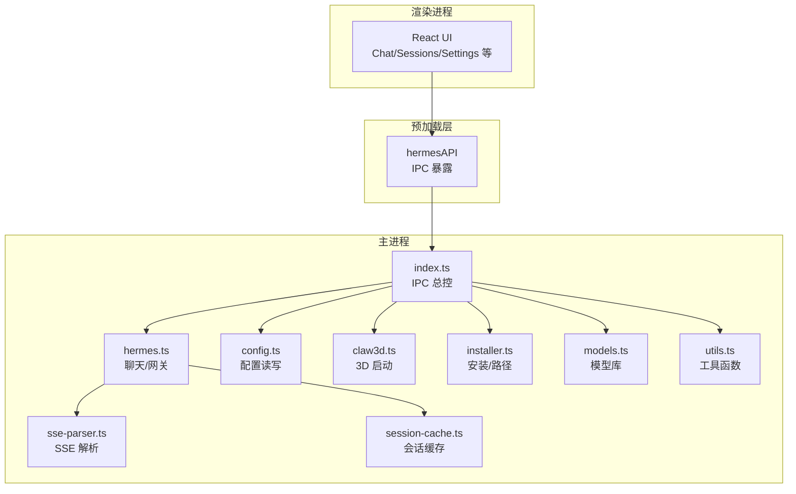
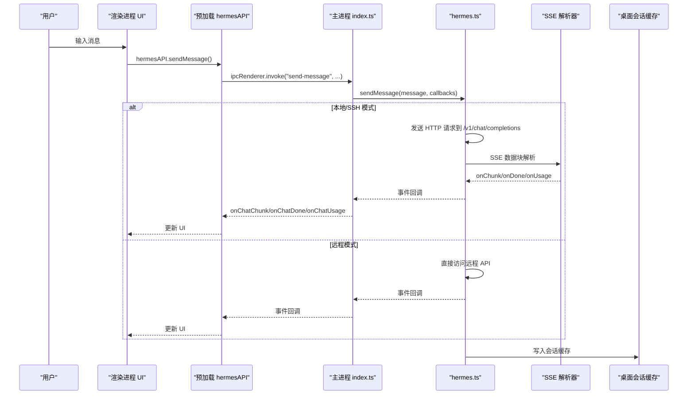
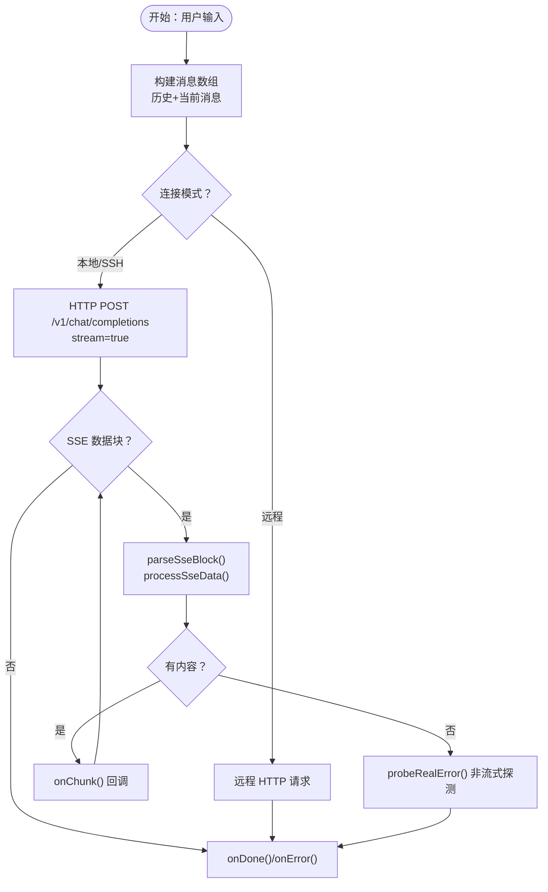
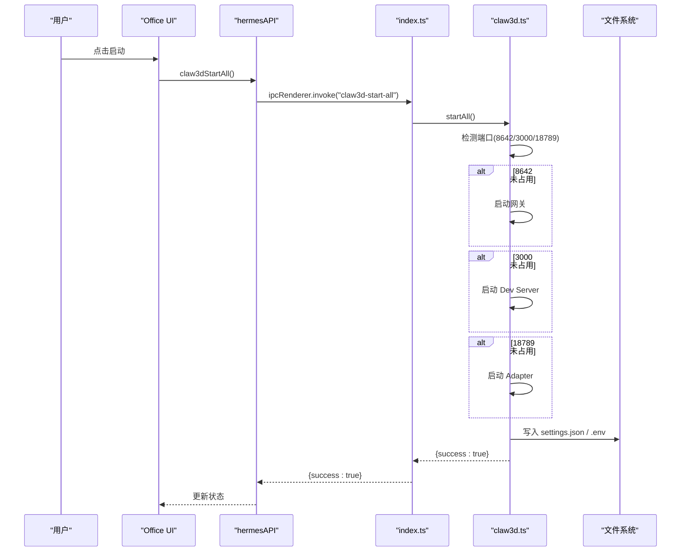
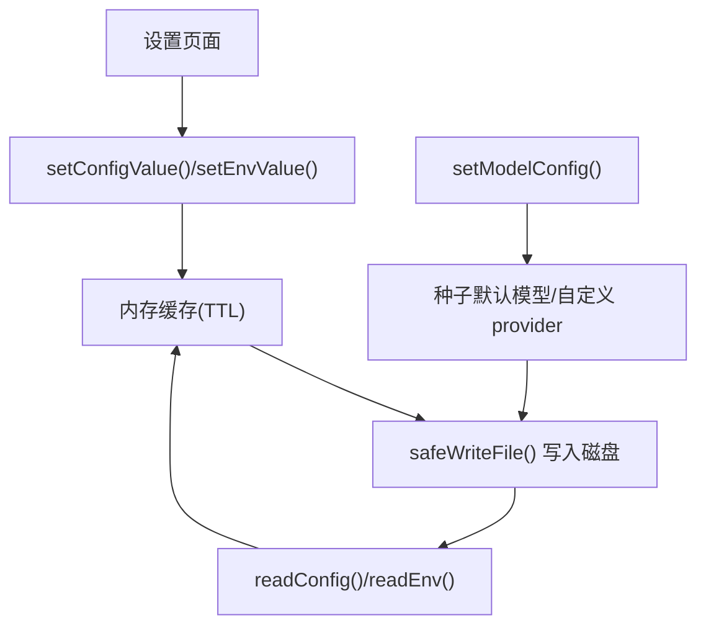
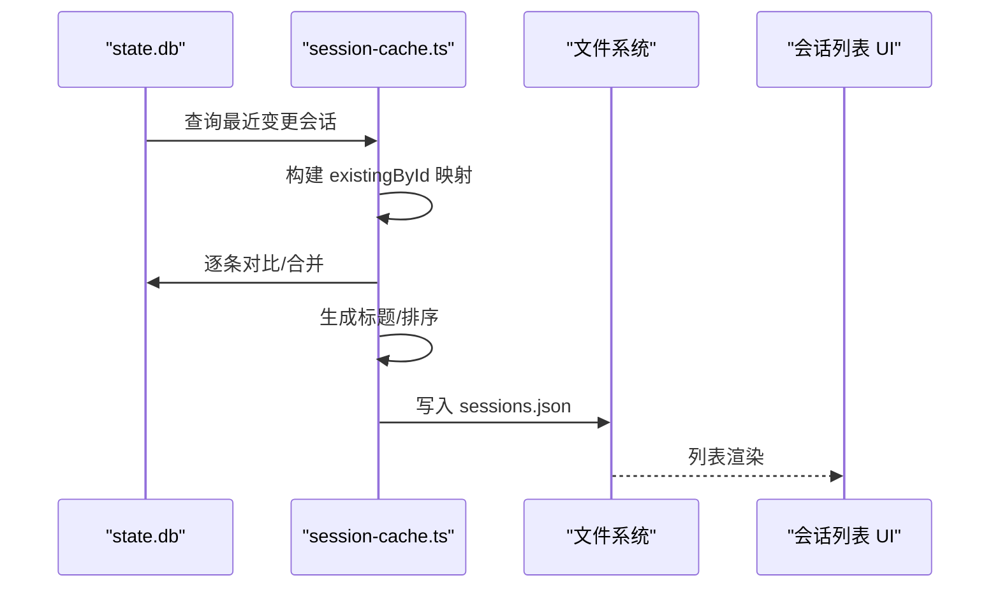
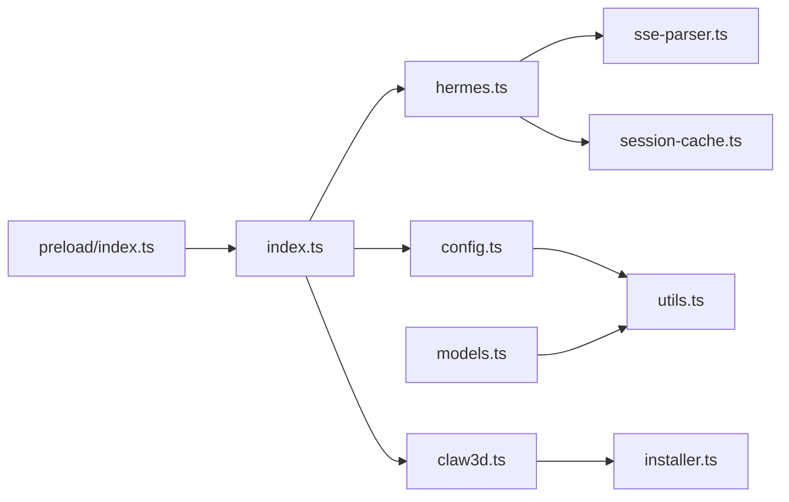

# 数据流设计

<cite>
**本文引用的文件**
- [src/main/hermes.ts](file://src/main/hermes.ts)
- [src/main/claw3d.ts](file://src/main/claw3d.ts)
- [src/main/config.ts](file://src/main/config.ts)
- [src/main/sse-parser.ts](file://src/main/sse-parser.ts)
- [src/main/session-cache.ts](file://src/main/session-cache.ts)
- [src/main/index.ts](file://src/main/index.ts)
- [src/preload/index.ts](file://src/preload/index.ts)
- [src/main/installer.ts](file://src/main/installer.ts)
- [src/main/models.ts](file://src/main/models.ts)
- [src/main/utils.ts](file://src/main/utils.ts)
- [docs/hermes-desktop-architecture.md](file://docs/hermes-desktop-architecture.md)
</cite>

## 目录
1. [简介](#简介)
2. [项目结构](#项目结构)
3. [核心组件](#核心组件)
4. [架构总览](#架构总览)
5. [详细组件分析](#详细组件分析)
6. [依赖关系分析](#依赖关系分析)
7. [性能考量](#性能考量)
8. [故障排查指南](#故障排查指南)
9. [结论](#结论)

## 简介
本文件聚焦于 Hermes Desktop 的三大关键数据流：
- 聊天消息流：从用户输入到流式响应的完整路径，覆盖 HTTP SSE 与 CLI 回退两种模式。
- Claw3D 启动流：从应用启动到 3D 可视化界面可用的全链路，包含端口检测、服务启动与配置同步。
- 配置读写流：从 UI 到磁盘文件的配置持久化与缓存策略，以及跨进程同步机制。

文档将结合源码中的实现细节，给出数据在进程间传输的方式、数据格式转换、状态同步与一致性保障，并提供流程图与状态图帮助理解。

## 项目结构
Hermes Desktop 采用 Electron 架构，主进程负责系统集成、外部进程管理与数据持久化，渲染进程负责 UI 与用户交互，preload 层通过 contextBridge 暴露受控 API。

图表来源
- [src/main/index.ts:1-1234](file://src/main/index.ts#L1-L1234)
- [src/preload/index.ts:1-701](file://src/preload/index.ts#L1-L701)
- [src/main/hermes.ts:1-887](file://src/main/hermes.ts#L1-L887)
- [src/main/config.ts:1-440](file://src/main/config.ts#L1-L440)
- [src/main/claw3d.ts:1-890](file://src/main/claw3d.ts#L1-L890)
- [src/main/sse-parser.ts:1-131](file://src/main/sse-parser.ts#L1-L131)
- [src/main/session-cache.ts:1-252](file://src/main/session-cache.ts#L1-L252)
- [src/main/installer.ts:1-1130](file://src/main/installer.ts#L1-L1130)
- [src/main/models.ts:1-169](file://src/main/models.ts#L1-L169)
- [src/main/utils.ts:1-85](file://src/main/utils.ts#L1-L85)

章节来源
- [docs/hermes-desktop-architecture.md:18-89](file://docs/hermes-desktop-architecture.md#L18-L89)

## 核心组件
- 主进程入口与 IPC 总控：负责窗口管理、菜单、自动更新与 50+ IPC handler 注册。
- 聊天与网关：封装 HTTP SSE 流式 API 与 CLI 回退，支持远程模式与 SSH 隧道。
- 配置系统：三层配置（desktop.json、.env、config.yaml），带内存缓存与 TTL。
- 会话缓存：本地 sessions.json 与 SQLite state.db 同步，生成标题与增量同步。
- Claw3D 集成：仓库克隆、依赖安装、服务生命周期管理与配置同步。
- 工具与路径：增强 PATH、安全写文件、正则转义等通用能力。

章节来源
- [src/main/index.ts:1-1234](file://src/main/index.ts#L1-L1234)
- [src/main/hermes.ts:1-887](file://src/main/hermes.ts#L1-L887)
- [src/main/config.ts:1-440](file://src/main/config.ts#L1-L440)
- [src/main/session-cache.ts:1-252](file://src/main/session-cache.ts#L1-L252)
- [src/main/claw3d.ts:1-890](file://src/main/claw3d.ts#L1-L890)
- [src/main/utils.ts:1-85](file://src/main/utils.ts#L1-L85)

## 架构总览
下图展示了从用户输入到最终显示的关键数据路径，以及各组件之间的交互。

图表来源
- [src/preload/index.ts:158-233](file://src/preload/index.ts#L158-L233)
- [src/main/index.ts:544-640](file://src/main/index.ts#L544-L640)
- [src/main/hermes.ts:168-434](file://src/main/hermes.ts#L168-L434)
- [src/main/sse-parser.ts:14-131](file://src/main/sse-parser.ts#L14-L131)
- [src/main/session-cache.ts:82-167](file://src/main/session-cache.ts#L82-L167)

## 详细组件分析

### 组件一：聊天消息流（SSE 流式数据处理）
- 数据入口：渲染层通过 hermesAPI.sendMessage 触发，主进程 index.ts 注册的 IPC 处理器接收参数。
- 选择路径：
  - 本地/SSH：优先走 HTTP SSE 流式 API，地址为本地回环或 SSH 隧道 URL。
  - 远程模式：直接访问远端 API。
  - 失败回退：若 SSE 无内容或异常，则发起一次非流式请求以揭示真实错误。
- SSE 解析：
  - 逐块解析 event/data 行，识别自定义事件（如工具进度）与标准数据块。
  - 提取 usage 信息并触发 onUsage 回调。
  - 识别 [DONE] 结束标记，确保 onDone 只在有内容时触发。
- 回调驱动 UI：主进程将 onChunk/onDone/onError/onUsage 通过 IPC 事件推送到渲染层，实时更新 UI。
- 网关生命周期：首次发送消息时惰性启动网关，健康检查轮询保持可用性。

图表来源
- [src/main/hermes.ts:168-434](file://src/main/hermes.ts#L168-L434)
- [src/main/sse-parser.ts:14-131](file://src/main/sse-parser.ts#L14-L131)

章节来源
- [src/main/hermes.ts:153-434](file://src/main/hermes.ts#L153-L434)
- [src/main/sse-parser.ts:14-131](file://src/main/sse-parser.ts#L14-L131)
- [src/main/index.ts:544-640](file://src/main/index.ts#L544-L640)
- [src/preload/index.ts:158-233](file://src/preload/index.ts#L158-L233)

### 组件二：Claw3D 启动流（进程间数据与配置同步）
- 端口与进程检测：分别检查 8642（Hermes 网关）、3000（Claw3D Dev Server）、18789（Adapter）是否占用。
- 服务启动顺序：
  - 若 8642 未被占用且网关未运行，则启动网关。
  - 若 3000 未被占用，则启动 Claw3D Dev Server。
  - 若 18789 未被占用，则启动 Adapter。
- 配置同步：
  - 写入 ~/.openclaw/claw3d/settings.json，包含 gateway.url、adapterType 等字段。
  - 在 hermes-office 目录写入 .env，注入端口、API URL、WebSocket URL 等。
- 进程生命周期：记录 PID 文件，清理 stale PID，支持停止与日志采集。

图表来源
- [src/main/claw3d.ts:514-751](file://src/main/claw3d.ts#L514-L751)
- [src/main/claw3d.ts:176-229](file://src/main/claw3d.ts#L176-L229)
- [src/main/index.ts:520-531](file://src/main/index.ts#L520-L531)

章节来源
- [src/main/claw3d.ts:1-890](file://src/main/claw3d.ts#L1-L890)
- [src/main/index.ts:513-531](file://src/main/index.ts#L513-L531)

### 组件三：配置读写流（持久化与缓存）
- 三层配置：
  - desktop.json：连接模式（local/remote/ssh）、SSH 配置等。
  - .env：API 密钥与令牌等敏感信息。
  - config.yaml：模型 provider/default/base_url、平台启用开关等。
- 缓存策略：内存 Map + TTL（默认 5 秒），避免频繁磁盘 IO。
- 写入策略：safeWriteFile 自动创建目录，避免 ENOENT；按需失效缓存。
- 模型库：models.json 存储用户自定义模型，支持默认模型播种与自定义 provider 注入。
- 路径与工具：profileHome/profilePaths 生成 per-profile 路径；escapeRegex/safeWriteFile 等工具保障健壮性。

图表来源
- [src/main/config.ts:76-301](file://src/main/config.ts#L76-L301)
- [src/main/models.ts:77-114](file://src/main/models.ts#L77-L114)
- [src/main/utils.ts:76-85](file://src/main/utils.ts#L76-L85)

章节来源
- [src/main/config.ts:1-440](file://src/main/config.ts#L1-L440)
- [src/main/models.ts:1-169](file://src/main/models.ts#L1-L169)
- [src/main/utils.ts:1-85](file://src/main/utils.ts#L1-L85)

### 组件四：会话缓存与一致性（增量同步）
- 本地缓存：sessions.json，包含会话列表、标题、消息计数等。
- SQLite 同步：state.db 中 sessions/messages 表，按时间戳增量同步，避免全量扫描。
- 标题生成：从第一条用户消息提取文本，去除 Markdown/URL，截断至合理长度。
- 删除与清理：支持删除会话（文件系统 + DB），并同步更新缓存。

图表来源
- [src/main/session-cache.ts:82-167](file://src/main/session-cache.ts#L82-L167)

章节来源
- [src/main/session-cache.ts:1-252](file://src/main/session-cache.ts#L1-L252)

## 依赖关系分析
- 主进程模块耦合度：index.ts 作为 IPC 总控，集中调用 hermes.ts、config.ts、claw3d.ts 等；hermes.ts 依赖 config.ts、ssh-tunnel.ts、utils.ts；claw3d.ts 依赖 installer.ts、utils.ts。
- 渲染层与主进程：通过 hermesAPI 与 ipcRenderer.invoke/on 通信，避免直接访问 Node API。
- 外部依赖：better-sqlite3、Electron、React 生态；Hermes Agent CLI 与 Python 环境。

图表来源
- [src/preload/index.ts:1-701](file://src/preload/index.ts#L1-L701)
- [src/main/index.ts:1-1234](file://src/main/index.ts#L1-L1234)
- [src/main/hermes.ts:1-887](file://src/main/hermes.ts#L1-L887)
- [src/main/config.ts:1-440](file://src/main/config.ts#L1-L440)
- [src/main/claw3d.ts:1-890](file://src/main/claw3d.ts#L1-L890)
- [src/main/sse-parser.ts:1-131](file://src/main/sse-parser.ts#L1-L131)
- [src/main/session-cache.ts:1-252](file://src/main/session-cache.ts#L1-L252)
- [src/main/installer.ts:1-1130](file://src/main/installer.ts#L1-L1130)
- [src/main/models.ts:1-169](file://src/main/models.ts#L1-L169)
- [src/main/utils.ts:1-85](file://src/main/utils.ts#L1-L85)

章节来源
- [src/main/index.ts:1-1234](file://src/main/index.ts#L1-L1234)
- [src/preload/index.ts:1-701](file://src/preload/index.ts#L1-L701)

## 性能考量
- SSE 流式渲染：减少首字节延迟，提升交互体验；SSE 解析器独立模块便于测试与复用。
- 健康检查轮询：主进程对本地 API 服务器进行周期性健康检查，一旦可用即停止轮询，降低开销。
- 内存缓存：配置读写使用 Map + TTL，避免频繁磁盘 IO；模型配置与环境变量均采用缓存。
- 增量同步：会话缓存按时间戳增量同步，避免 O(N^2) 复杂度，提升启动速度。
- 进程启动策略：Claw3D 启动前先检测端口，避免重复启动与资源冲突。

章节来源
- [src/main/hermes.ts:694-704](file://src/main/hermes.ts#L694-L704)
- [src/main/config.ts:76-99](file://src/main/config.ts#L76-L99)
- [src/main/session-cache.ts:106-111](file://src/main/session-cache.ts#L106-L111)
- [src/main/claw3d.ts:231-248](file://src/main/claw3d.ts#L231-L248)

## 故障排查指南
- 聊天 401/403：检查 config.yaml 的 provider 与 .env 中对应 API key；使用 curl 直接验证。
- Office 连接超时：检查端口占用（8642/3000/18789）；先发送聊天消息确认网关已启动；确认 settings.json 的 gateway.url 格式正确。
- Dev server 异常退出：Windows 下避免使用 cmd.exe 包装，直接 node server/index.js --dev。
- SSH 隧道：确保隧道健康，必要时重新启动；远程 API key 通过隧道缓存以便认证。

章节来源
- [docs/hermes-desktop-architecture.md:345-374](file://docs/hermes-desktop-architecture.md#L345-L374)
- [src/main/hermes.ts:64-69](file://src/main/hermes.ts#L64-L69)
- [src/main/claw3d.ts:231-248](file://src/main/claw3d.ts#L231-L248)

## 结论
Hermes Desktop 的数据流设计围绕“主进程集中控制 + 渲染层轻量交互”的架构展开。聊天消息流通过 HTTP SSE 实现低延迟流式输出，并在失败时回退到 CLI；Claw3D 启动流通过端口检测与配置同步确保 3D 可视化可用；配置读写流采用三层持久化与内存缓存，兼顾一致性与性能。整体实现注重进程间解耦、错误恢复与可观测性，适合在多平台与多连接模式下稳定运行。