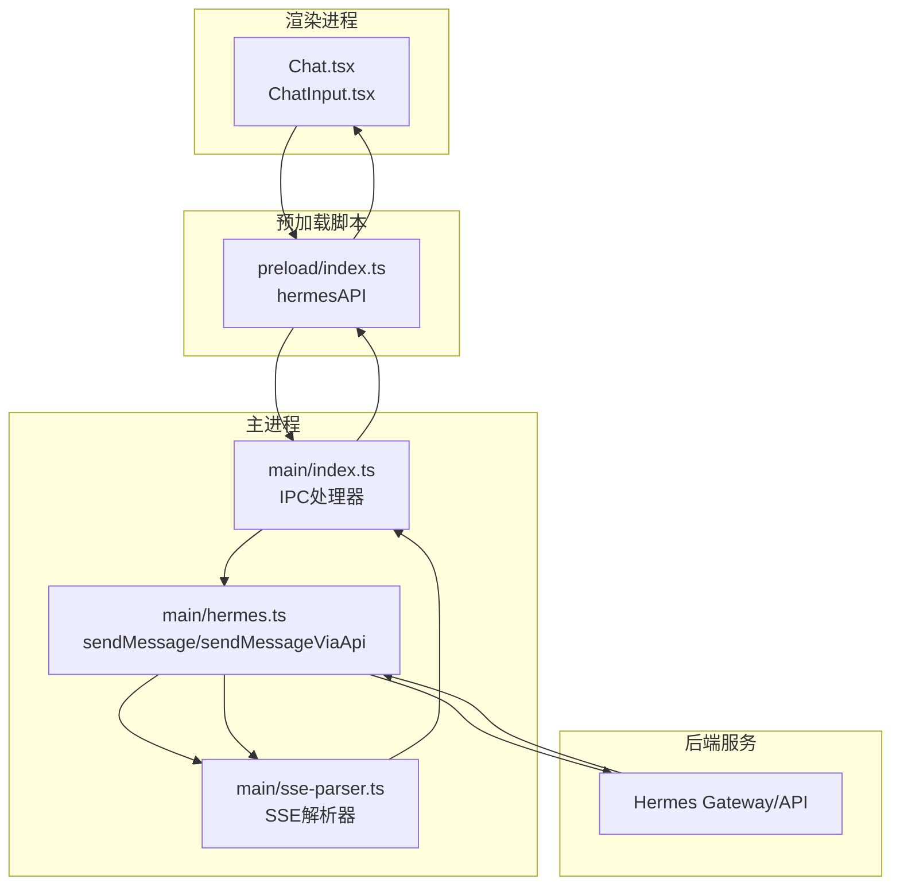
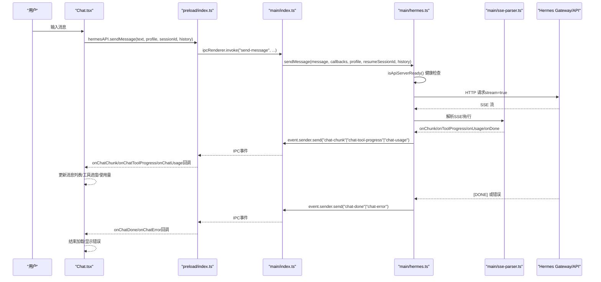
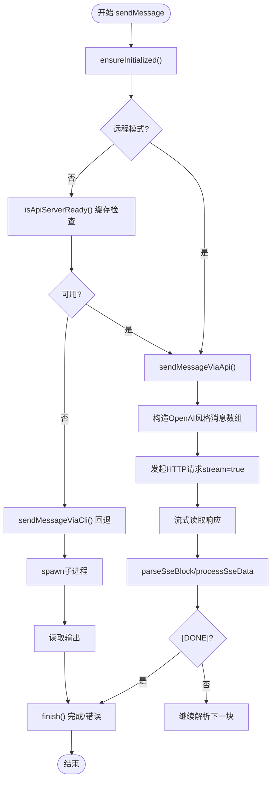
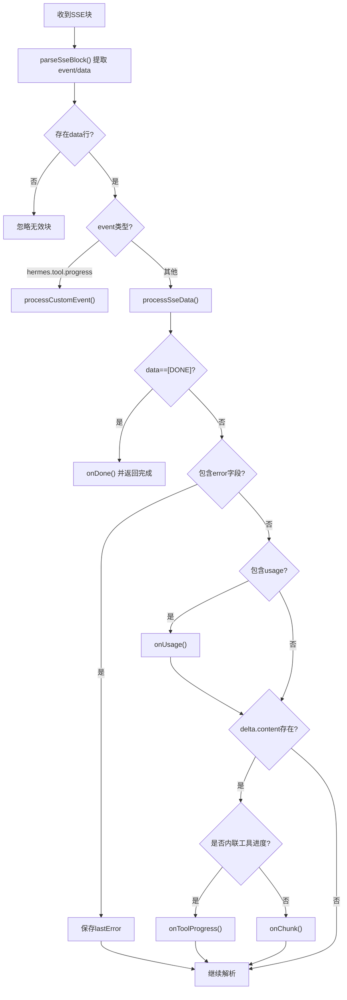
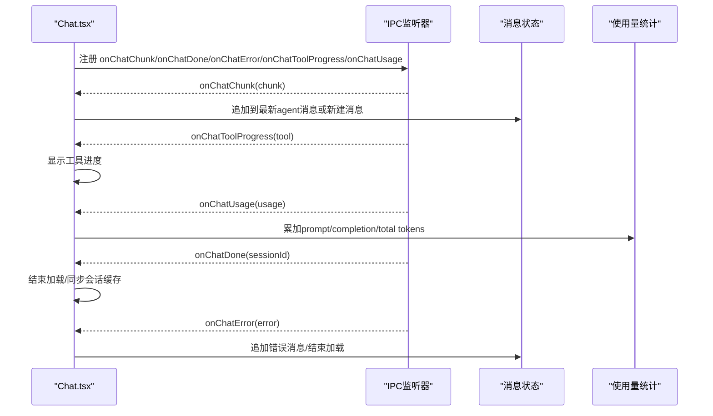
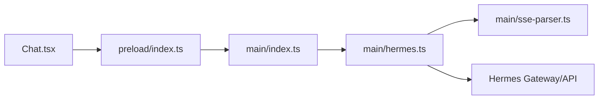

# 聊天消息流

<cite>
**本文档引用的文件**
- [src/main/sse-parser.ts](file://src/main/sse-parser.ts)
- [src/main/hermes.ts](file://src/main/hermes.ts)
- [src/main/index.ts](file://src/main/index.ts)
- [src/preload/index.ts](file://src/preload/index.ts)
- [src/renderer/src/screens/Chat/Chat.tsx](file://src/renderer/src/screens/Chat/Chat.tsx)
- [src/renderer/src/screens/Chat/ChatInput.tsx](file://src/renderer/src/screens/Chat/ChatInput.tsx)
- [src/main/sessions.ts](file://src/main/sessions.ts)
- [tests/sse-parser.test.ts](file://tests/sse-parser.test.ts)
</cite>

## 目录
1. [简介](#简介)
2. [项目结构](#项目结构)
3. [核心组件](#核心组件)
4. [架构总览](#架构总览)
5. [详细组件分析](#详细组件分析)
6. [依赖关系分析](#依赖关系分析)
7. [性能考虑](#性能考虑)
8. [故障排除指南](#故障排除指南)
9. [结论](#结论)

## 简介
本文件面向Hermes Desktop的聊天消息流，系统性阐述从用户输入到AI响应的完整数据流，重点覆盖：
- HTTP SSE流式传输机制与SSE解析器
- 消息格式转换与实时更新处理
- sendMessage函数工作原理：API服务器健康检查、流式数据解析与错误处理
- 消息队列管理、会话ID处理、工具进度通知与使用量统计的数据流转
- 提供消息流图与状态转换图，展示端到端路径
- 性能优化策略与错误恢复机制

## 项目结构
Hermes Desktop采用Electron架构，消息流跨越渲染进程、预加载脚本与主进程三部分，并通过IPC通道进行通信。关键模块如下：
- 渲染进程：负责UI交互与消息展示，触发发送并接收实时事件
- 预加载脚本：桥接渲染进程与主进程，暴露hermesAPI接口
- 主进程：执行实际的HTTP请求或CLI调用，解析SSE，转发事件
- SSE解析器：独立可测试的SSE解析逻辑，支持自定义事件与使用量统计

图表来源
- [src/renderer/src/screens/Chat/Chat.tsx:341-390](file://src/renderer/src/screens/Chat/Chat.tsx#L341-L390)
- [src/renderer/src/screens/Chat/ChatInput.tsx:121-138](file://src/renderer/src/screens/Chat/ChatInput.tsx#L121-L138)
- [src/preload/index.ts:158-235](file://src/preload/index.ts#L158-L235)
- [src/main/index.ts:616-647](file://src/main/index.ts#L616-L647)
- [src/main/hermes.ts:168-434](file://src/main/hermes.ts#L168-L434)
- [src/main/sse-parser.ts:58-130](file://src/main/sse-parser.ts#L58-L130)

章节来源
- [src/renderer/src/screens/Chat/Chat.tsx:1-895](file://src/renderer/src/screens/Chat/Chat.tsx#L1-L895)
- [src/renderer/src/screens/Chat/ChatInput.tsx:1-330](file://src/renderer/src/screens/Chat/ChatInput.tsx#L1-L330)
- [src/preload/index.ts:158-235](file://src/preload/index.ts#L158-L235)
- [src/main/index.ts:616-647](file://src/main/index.ts#L616-L647)
- [src/main/hermes.ts:168-434](file://src/main/hermes.ts#L168-L434)
- [src/main/sse-parser.ts:1-131](file://src/main/sse-parser.ts#L1-L131)

## 核心组件
- SSE解析器（SSE Parser）
  - 支持标准SSE块解析、自定义事件（如工具进度）、使用量统计提取、错误捕获与完成信号
  - 提供纯函数式接口，便于单元测试
- 主进程消息引擎（sendMessage/sendMessageViaApi）
  - 健康检查与自动切换HTTP API或CLI回退路径
  - 构造OpenAI风格的消息数组，发起HTTP请求并流式读取响应
  - 将SSE事件映射为IPC事件，驱动渲染层更新
- 预加载脚本（hermesAPI）
  - 暴露sendMessage、abortChat与各类onChat*回调监听
  - 统一渲染进程与主进程之间的通信契约
- 渲染进程（Chat/ChatInput）
  - 用户输入处理、本地命令拦截、消息追加与滚动控制
  - 接收IPC事件，实时更新消息内容、工具进度与使用量统计

章节来源
- [src/main/sse-parser.ts:5-131](file://src/main/sse-parser.ts#L5-L131)
- [src/main/hermes.ts:168-434](file://src/main/hermes.ts#L168-L434)
- [src/preload/index.ts:158-235](file://src/preload/index.ts#L158-L235)
- [src/renderer/src/screens/Chat/Chat.tsx:244-308](file://src/renderer/src/screens/Chat/Chat.tsx#L244-L308)

## 架构总览
下图展示从用户输入到最终显示的完整路径，包括健康检查、SSE解析与事件分发。

图表来源
- [src/renderer/src/screens/Chat/Chat.tsx:341-390](file://src/renderer/src/screens/Chat/Chat.tsx#L341-L390)
- [src/preload/index.ts:158-235](file://src/preload/index.ts#L158-L235)
- [src/main/index.ts:616-647](file://src/main/index.ts#L616-L647)
- [src/main/hermes.ts:168-434](file://src/main/hermes.ts#L168-L434)
- [src/main/sse-parser.ts:58-130](file://src/main/sse-parser.ts#L58-L130)

## 详细组件分析

### sendMessage函数工作原理
sendMessage是消息流的入口，负责：
- 初始化与健康检查：在非远程模式下缓存API可用性，避免重复探测
- 路由选择：优先HTTP API，失败时回退至CLI
- 请求构建：将历史消息与当前消息转换为OpenAI风格的消息数组
- 流式处理：逐块解析SSE，识别自定义事件与使用量信息
- 错误处理：捕获网络错误、超时与SSE错误，必要时探测非流式错误以获得真实原因

图表来源
- [src/main/hermes.ts:654-679](file://src/main/hermes.ts#L654-L679)
- [src/main/hermes.ts:168-434](file://src/main/hermes.ts#L168-L434)
- [src/main/sse-parser.ts:116-130](file://src/main/sse-parser.ts#L116-L130)

章节来源
- [src/main/hermes.ts:654-679](file://src/main/hermes.ts#L654-L679)
- [src/main/hermes.ts:168-434](file://src/main/hermes.ts#L168-L434)

### SSE解析器（SSE Parser）
SSE解析器提供以下能力：
- 解析SSE块：提取event与data行，支持自定义事件类型
- 处理数据块：JSON反序列化，识别[DONE]、错误字段、增量内容与使用量
- 工具进度检测：兼容旧版内联进度与新版自定义事件
- 状态管理：跟踪是否有内容、最后错误，确保完成信号正确发出

图表来源
- [src/main/sse-parser.ts:116-130](file://src/main/sse-parser.ts#L116-L130)
- [src/main/sse-parser.ts:58-110](file://src/main/sse-parser.ts#L58-L110)
- [src/main/sse-parser.ts:29-46](file://src/main/sse-parser.ts#L29-L46)

章节来源
- [src/main/sse-parser.ts:5-131](file://src/main/sse-parser.ts#L5-L131)
- [tests/sse-parser.test.ts:1-248](file://tests/sse-parser.test.ts#L1-L248)

### 渲染进程消息队列与实时更新
渲染进程通过hermesAPI注册多个IPC监听器，实现消息的增量更新：
- onChatChunk：将新片段追加到现有agent消息，或创建新的agent消息
- onChatDone：结束加载、同步会话缓存、清理工具进度
- onChatError：追加错误消息、重置加载状态
- onChatToolProgress：显示工具进度提示
- onChatUsage：累计使用量统计

图表来源
- [src/renderer/src/screens/Chat/Chat.tsx:244-308](file://src/renderer/src/screens/Chat/Chat.tsx#L244-L308)

章节来源
- [src/renderer/src/screens/Chat/Chat.tsx:244-308](file://src/renderer/src/screens/Chat/Chat.tsx#L244-L308)

### 会话ID处理与消息队列管理
- 会话ID：首次完成时由后端返回，渲染层保存并在后续发送中复用
- 新建会话：清空消息列表时重置会话ID
- 历史消息：发送时将历史消息转换为OpenAI风格（role映射）
- 会话缓存：完成后异步同步，确保会话列表及时更新

章节来源
- [src/renderer/src/screens/Chat/Chat.tsx:161-167](file://src/renderer/src/screens/Chat/Chat.tsx#L161-L167)
- [src/renderer/src/screens/Chat/Chat.tsx:265-273](file://src/renderer/src/screens/Chat/Chat.tsx#L265-L273)
- [src/main/hermes.ts:178-188](file://src/main/hermes.ts#L178-L188)

### 工具进度通知与使用量统计
- 工具进度：支持自定义事件与内联进度两种形式，统一通过onChatToolProgress推送
- 使用量统计：onChatUsage累计prompt、completion与total tokens，以及可选成本与配额信息

章节来源
- [src/main/sse-parser.ts:29-46](file://src/main/sse-parser.ts#L29-L46)
- [src/main/sse-parser.ts:82-92](file://src/main/sse-parser.ts#L82-L92)
- [src/renderer/src/screens/Chat/Chat.tsx:288-299](file://src/renderer/src/screens/Chat/Chat.tsx#L288-L299)

## 依赖关系分析
- 渲染进程依赖预加载脚本提供的hermesAPI接口
- 预加载脚本依赖主进程的IPC处理器
- 主进程依赖消息引擎与SSE解析器
- 消息引擎依赖API服务器，具备健康检查与回退机制

图表来源
- [src/renderer/src/screens/Chat/Chat.tsx:341-390](file://src/renderer/src/screens/Chat/Chat.tsx#L341-L390)
- [src/preload/index.ts:158-235](file://src/preload/index.ts#L158-L235)
- [src/main/index.ts:616-647](file://src/main/index.ts#L616-L647)
- [src/main/hermes.ts:168-434](file://src/main/hermes.ts#L168-L434)
- [src/main/sse-parser.ts:58-130](file://src/main/sse-parser.ts#L58-L130)

章节来源
- [src/renderer/src/screens/Chat/Chat.tsx:1-895](file://src/renderer/src/screens/Chat/Chat.tsx#L1-L895)
- [src/preload/index.ts:158-235](file://src/preload/index.ts#L158-L235)
- [src/main/index.ts:616-647](file://src/main/index.ts#L616-L647)
- [src/main/hermes.ts:168-434](file://src/main/hermes.ts#L168-L434)
- [src/main/sse-parser.ts:1-131](file://src/main/sse-parser.ts#L1-L131)

## 性能考虑
- 流式解析：仅在收到增量内容时更新UI，避免一次性拼接大字符串
- 缓存健康检查：API可用性缓存减少重复探测开销
- 合并使用量：渲染层按增量累加，避免频繁重渲染
- 会话缓存同步：后台异步同步，不影响主线程交互
- 超时与中断：HTTP请求设置合理超时，支持AbortController中断

## 故障排除指南
- API不可用：健康检查失败时自动回退至CLI；检查网络与SSH隧道
- SSE解析异常：解析器对畸形JSON与缺失字段有容错，若出现[DONE]但无内容，会探测非流式错误
- 错误上报：onChatError统一捕获并显示；必要时弹出系统通知
- 中断与重试：AbortChat支持取消当前请求；重新发送可恢复对话

章节来源
- [src/main/hermes.ts:102-121](file://src/main/hermes.ts#L102-L121)
- [src/main/hermes.ts:417-424](file://src/main/hermes.ts#L417-L424)
- [src/main/index.ts:613-624](file://src/main/index.ts#L613-L624)

## 结论
Hermes Desktop的聊天消息流通过清晰的分层设计与严格的事件驱动机制，实现了从用户输入到实时响应的高效闭环。SSE解析器提供了稳健的流式数据处理能力，主进程负责路由与错误恢复，渲染进程专注于用户体验与状态管理。该架构既保证了功能的完整性，也为性能优化与扩展留足空间。