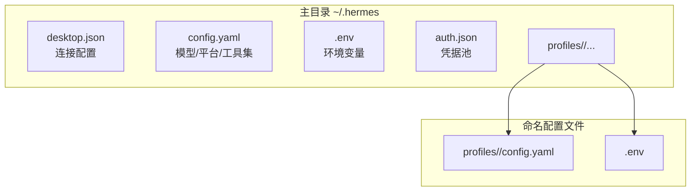
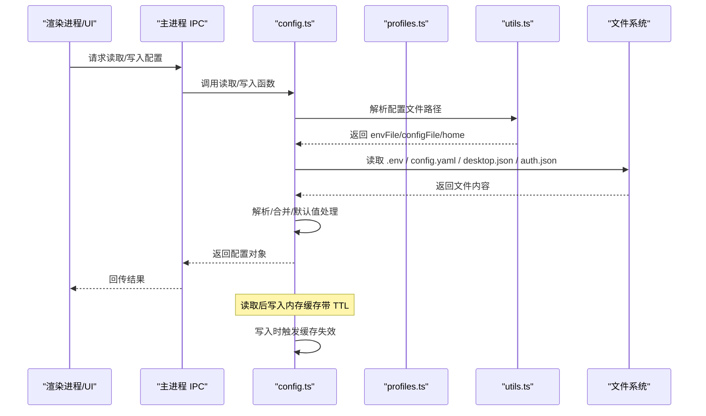
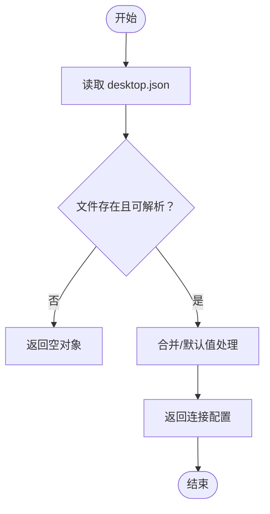
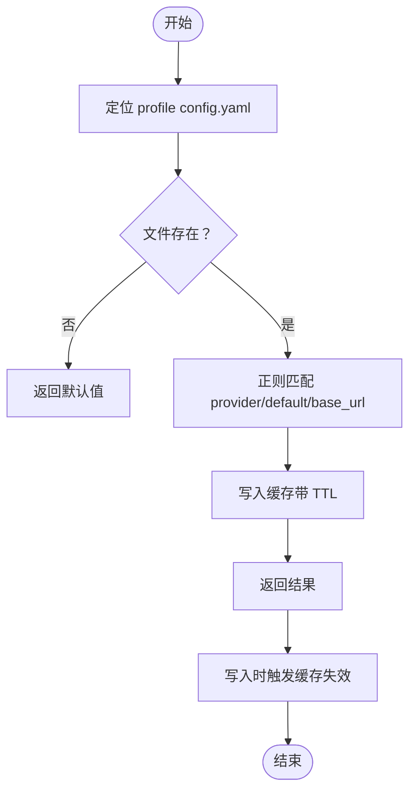
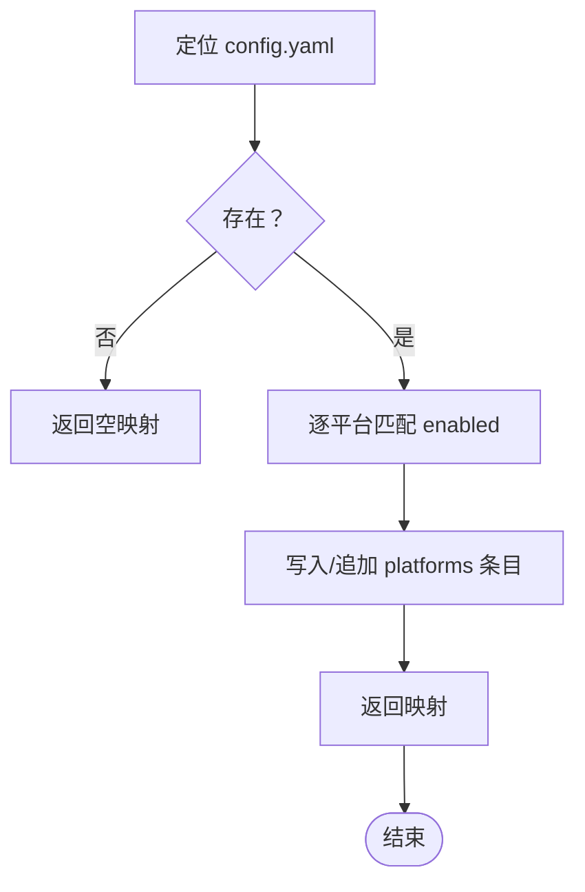
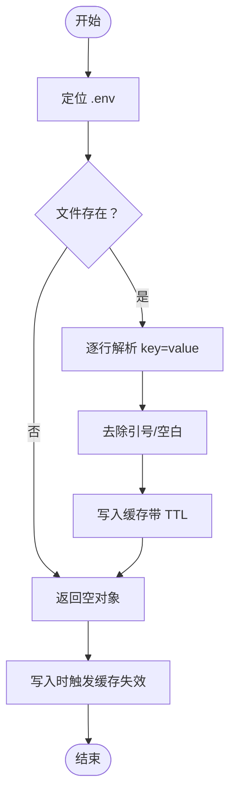
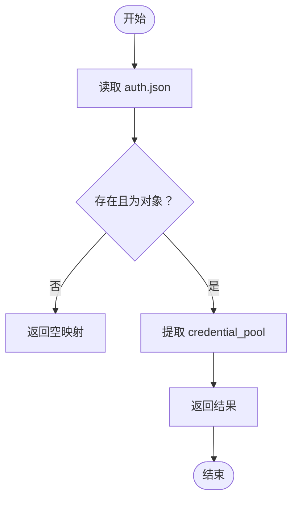
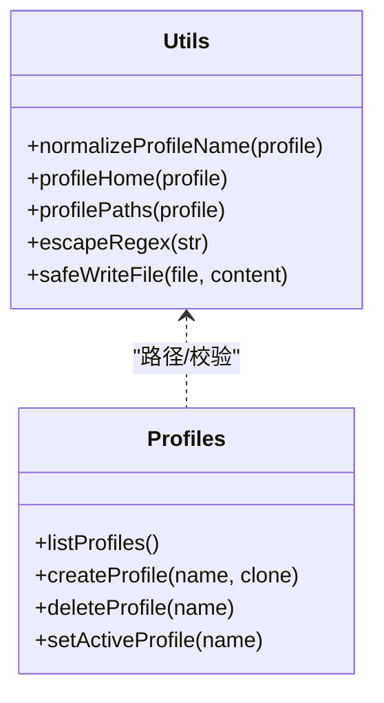
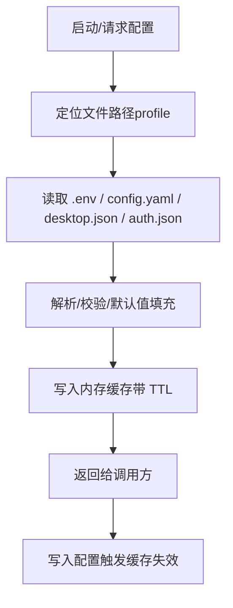
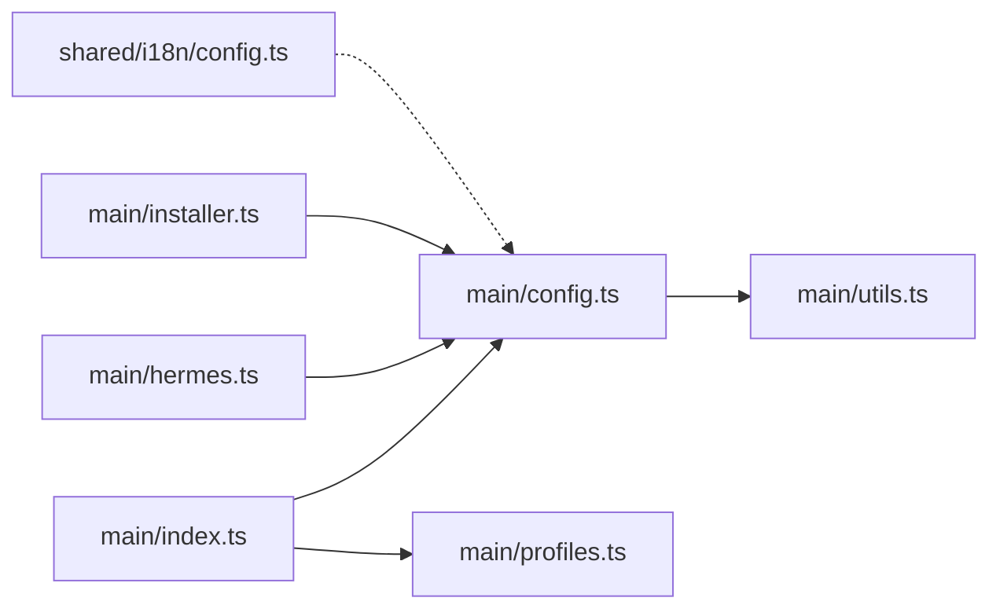

# 配置读写流

<cite>
**本文引用的文件**
- [src/main/config.ts](file://src/main/config.ts)
- [src/main/utils.ts](file://src/main/utils.ts)
- [src/main/profiles.ts](file://src/main/profiles.ts)
- [src/main/installer.ts](file://src/main/installer.ts)
- [src/main/hermes.ts](file://src/main/hermes.ts)
- [src/main/index.ts](file://src/main/index.ts)
- [src/shared/i18n/config.ts](file://src/shared/i18n/config.ts)
</cite>

## 目录
1. [简介](#简介)
2. [项目结构](#项目结构)
3. [核心组件](#核心组件)
4. [架构总览](#架构总览)
5. [详细组件分析](#详细组件分析)
6. [依赖关系分析](#依赖关系分析)
7. [性能考量](#性能考量)
8. [故障排查指南](#故障排查指南)
9. [结论](#结论)
10. [附录](#附录)

## 简介
本文件系统性梳理 Hermes Desktop 的配置读写流，覆盖以下关键主题：
- 配置文件格式与位置：桌面配置 desktop.json、用户配置 config.yaml、环境变量 .env、认证存储 auth.json
- 读取、解析与写入流程：从磁盘到内存、再到持久化写回的完整路径
- 多配置文件支持与优先级：默认配置与命名配置文件的协同
- 缓存机制：基于内存的 TTL 缓存与失效策略
- 配置验证：键名与值的合法性校验
- 默认值处理：缺失字段时的回退策略
- 变更监听与热重载：通过缓存失效与 IPC 触发的动态更新
- 错误处理与回滚：异常捕获与安全写入策略
- 性能优化：并发读取、正则匹配优化与最小化磁盘 IO

## 项目结构
Hermes Desktop 的配置体系围绕“主目录 ~/.hermes”展开，按“默认配置”和“命名配置文件”两条主线组织：
- 默认配置：位于 ~/.hermes/desktop.json（连接配置）、~/.hermes/config.yaml（模型与平台等）、~/.hermes/.env（环境变量）
- 命名配置：位于 ~/.hermes/profiles/<name>/config.yaml、~/.hermes/profiles/<name>/.env
- 认证存储：位于 ~/.hermes/auth.json

图表来源
- [src/main/utils.ts:55-66](file://src/main/utils.ts#L55-L66)
- [src/main/config.ts:26](file://src/main/config.ts#L26)
- [src/main/config.ts:398](file://src/main/config.ts#L398)

章节来源
- [src/main/utils.ts:46-66](file://src/main/utils.ts#L46-L66)
- [src/main/config.ts:26-45](file://src/main/config.ts#L26-L45)
- [src/main/config.ts:398-440](file://src/main/config.ts#L398-L440)

## 核心组件
- 连接配置模块：负责读取/写入 desktop.json，提供连接模式、远程地址、API Key 与 SSH 参数
- 模型配置模块：解析/修改 config.yaml 中的 provider、default model、base_url 等
- 平台开关模块：读取/设置 config.yaml 中 platforms 下的 enabled 字段
- 环境变量模块：解析/写入 .env 文件，支持单行校验与缓存
- 凭据池模块：读取/写入 auth.json，管理各 Provider 的凭证条目
- 工具函数：路径解析、正则转义、安全写入、配置文件定位

章节来源
- [src/main/config.ts:47-74](file://src/main/config.ts#L47-L74)
- [src/main/config.ts:215-301](file://src/main/config.ts#L215-L301)
- [src/main/config.ts:317-394](file://src/main/config.ts#L317-L394)
- [src/main/config.ts:101-167](file://src/main/config.ts#L101-L167)
- [src/main/config.ts:421-439](file://src/main/config.ts#L421-L439)
- [src/main/utils.ts:55-85](file://src/main/utils.ts#L55-L85)

## 架构总览
下图展示了从磁盘读取到内存使用再到持久化的完整配置流，以及多配置文件与缓存的交互。

图表来源
- [src/main/config.ts:101-167](file://src/main/config.ts#L101-L167)
- [src/main/config.ts:215-301](file://src/main/config.ts#L215-L301)
- [src/main/config.ts:317-394](file://src/main/config.ts#L317-L394)
- [src/main/utils.ts:55-66](file://src/main/utils.ts#L55-L66)

## 详细组件分析

### 连接配置（desktop.json）
- 读取：从 ~/.hermes/desktop.json 读取连接模式、远程地址、API Key 与 SSH 参数；若文件不存在或解析失败，返回空对象作为兜底
- 写入：将新配置写回 desktop.json，确保主目录存在
- 默认值：未指定时，连接模式为本地，SSH 端口、端口映射等采用内置默认值
- 作用域：全局连接配置，影响 API URL、鉴权头与 SSH 隧道行为

图表来源
- [src/main/config.ts:30-38](file://src/main/config.ts#L30-L38)
- [src/main/config.ts:47-63](file://src/main/config.ts#L47-L63)

章节来源
- [src/main/config.ts:30-38](file://src/main/config.ts#L30-L38)
- [src/main/config.ts:47-63](file://src/main/config.ts#L47-L63)

### 模型配置（config.yaml）
- 读取：解析 provider、default model、base_url；若文件不存在，返回默认值
- 写入：更新对应键值，必要时追加 base_url；禁用智能路由、启用 streaming；写回前进行缓存失效
- 缓存：以 profile 为前缀的缓存键，TTL 5 秒
- 作用域：按 profile 生效，影响聊天请求的模型选择与流式输出

图表来源
- [src/main/config.ts:215-246](file://src/main/config.ts#L215-L246)
- [src/main/config.ts:248-301](file://src/main/config.ts#L248-L301)
- [src/main/utils.ts:29-39](file://src/main/utils.ts#L29-L39)

章节来源
- [src/main/config.ts:215-246](file://src/main/config.ts#L215-L246)
- [src/main/config.ts:248-301](file://src/main/config.ts#L248-L301)

### 平台开关（config.yaml platforms）
- 读取：扫描 platforms 下各平台的 enabled 字段，返回布尔映射
- 写入：若已存在则更新，否则在 platforms 块末尾追加；若无 platforms 块则新建
- 影响：通过 IPC 触发网关重启以应用新配置

图表来源
- [src/main/config.ts:317-335](file://src/main/config.ts#L317-L335)
- [src/main/config.ts:337-394](file://src/main/config.ts#L337-L394)

章节来源
- [src/main/config.ts:317-335](file://src/main/config.ts#L317-L335)
- [src/main/config.ts:337-394](file://src/main/config.ts#L337-L394)
- [src/main/index.ts:667-689](file://src/main/index.ts#L667-L689)

### 环境变量（.env）
- 读取：解析 .env 文件，支持双引号/单引号包裹值；缓存 5 秒
- 写入：校验键名与值的合法性；若文件不存在则创建；若键已存在则替换，否则追加
- 校验：键名仅允许字母数字下划线，且不能以数字开头；值必须为单行字符串

图表来源
- [src/main/config.ts:101-132](file://src/main/config.ts#L101-L132)
- [src/main/config.ts:134-167](file://src/main/config.ts#L134-L167)
- [src/main/config.ts:169-179](file://src/main/config.ts#L169-L179)

章节来源
- [src/main/config.ts:101-132](file://src/main/config.ts#L101-L132)
- [src/main/config.ts:134-167](file://src/main/config.ts#L134-L167)
- [src/main/config.ts:169-179](file://src/main/config.ts#L169-L179)

### 凭据池（auth.json）
- 读取：解析 credential_pool，返回各 Provider 的凭证条目列表
- 写入：若不存在则初始化；写回时保持结构不变

图表来源
- [src/main/config.ts:421-439](file://src/main/config.ts#L421-L439)

章节来源
- [src/main/config.ts:421-439](file://src/main/config.ts#L421-L439)

### 多配置文件与路径解析
- 路径解析：根据 profile 名称解析 .env 与 config.yaml 的绝对路径；默认 profile 使用主目录，命名 profile 使用 ~/.hermes/profiles/<name>
- 有效性校验：对 profile 名称进行正则校验，防止非法字符与格式
- 安全写入：写入前自动创建父目录，避免 ENOENT 异常

图表来源
- [src/main/utils.ts:29-39](file://src/main/utils.ts#L29-L39)
- [src/main/utils.ts:46-66](file://src/main/utils.ts#L46-L66)
- [src/main/utils.ts:80-85](file://src/main/utils.ts#L80-L85)
- [src/main/profiles.ts:111-193](file://src/main/profiles.ts#L111-L193)

章节来源
- [src/main/utils.ts:29-39](file://src/main/utils.ts#L29-L39)
- [src/main/utils.ts:46-66](file://src/main/utils.ts#L46-L66)
- [src/main/utils.ts:80-85](file://src/main/utils.ts#L80-L85)
- [src/main/profiles.ts:111-193](file://src/main/profiles.ts#L111-L193)

### 配置验证、默认值与变更监听
- 验证规则：
  - 环境变量键名：字母、数字、下划线，且不以数字开头
  - 环境变量值：单行字符串，不允许换行/空字符
  - 模型配置：provider、default、base_url 三者独立解析，缺失时采用默认值
- 默认值策略：
  - 连接配置：mode 默认 local，SSH 端口与映射采用内置默认
  - 模型配置：provider 默认 auto，model/base_url 默认空串
  - 平台开关：未显式声明视为 false
- 变更监听与热重载：
  - 写入操作会按前缀失效相关缓存键，确保下次读取时重新解析
  - 平台开关变更后，IPC 层触发网关重启以应用新配置

章节来源
- [src/main/config.ts:169-179](file://src/main/config.ts#L169-L179)
- [src/main/config.ts:47-63](file://src/main/config.ts#L47-L63)
- [src/main/config.ts:215-246](file://src/main/config.ts#L215-L246)
- [src/main/config.ts:317-335](file://src/main/config.ts#L317-L335)
- [src/main/index.ts:667-689](file://src/main/index.ts#L667-L689)

### 配置流图（从磁盘到内存）

图表来源
- [src/main/utils.ts:55-66](file://src/main/utils.ts#L55-L66)
- [src/main/config.ts:101-132](file://src/main/config.ts#L101-L132)
- [src/main/config.ts:215-246](file://src/main/config.ts#L215-L246)
- [src/main/config.ts:317-335](file://src/main/config.ts#L317-L335)
- [src/main/config.ts:421-439](file://src/main/config.ts#L421-L439)

## 依赖关系分析
- 主进程入口通过 IPC 将配置请求分发至 config.ts 与 profiles.ts
- hermes.ts 在构建 API URL、鉴权头与健康检查时依赖连接配置
- installer.ts 在安装状态判断与增强 PATH 时间接依赖配置读取
- i18n 配置与本地化无关，不影响配置读写流

图表来源
- [src/main/index.ts:667-689](file://src/main/index.ts#L667-L689)
- [src/main/config.ts:13-13](file://src/main/config.ts#L13-L13)
- [src/main/hermes.ts:22-62](file://src/main/hermes.ts#L22-L62)
- [src/main/installer.ts:13-13](file://src/main/installer.ts#L13-L13)
- [src/shared/i18n/config.ts:1-7](file://src/shared/i18n/config.ts#L1-L7)

章节来源
- [src/main/index.ts:667-689](file://src/main/index.ts#L667-L689)
- [src/main/hermes.ts:22-62](file://src/main/hermes.ts#L22-L62)
- [src/main/installer.ts:13-13](file://src/main/installer.ts#L13-L13)
- [src/shared/i18n/config.ts:1-7](file://src/shared/i18n/config.ts#L1-L7)

## 性能考量
- 缓存策略：TTL 5 秒，降低重复解析成本；写入时按前缀失效，避免脏数据
- 并发读取：profiles 列表中对多个文件的读取采用 Promise.all 并发，缩短 UI 渲染等待时间
- 正则匹配：对 config.yaml 的解析使用预编译正则，减少重复构造开销
- 磁盘 IO：safeWriteFile 自动创建目录，避免多次失败重试；写入采用原子式替换策略（safeWriteFile 内部保证）

章节来源
- [src/main/config.ts:77-99](file://src/main/config.ts#L77-L99)
- [src/main/profiles.ts:122-128](file://src/main/profiles.ts#L122-L128)
- [src/main/profiles.ts:160-167](file://src/main/profiles.ts#L160-L167)
- [src/main/utils.ts:80-85](file://src/main/utils.ts#L80-L85)

## 故障排查指南
- 读取失败
  - 现象：读取 config.yaml/.env 时返回空或默认值
  - 排查：确认文件是否存在、权限是否正确；检查正则匹配是否被注释或格式错误
- 写入失败
  - 现象：.env 或 config.yaml 写入后未生效
  - 排查：检查键名/值校验是否通过；确认缓存是否被正确失效；查看 safeWriteFile 是否抛出异常
- 平台开关未生效
  - 现象：修改 platforms.enabled 后网关未重启
  - 排查：确认 IPC 调用是否成功；检查网关运行状态与日志
- 远程/SSH 模式异常
  - 现象：API URL 或鉴权头不正确
  - 排查：检查 desktop.json 的连接模式与远程地址；SSH 隧道是否健康

章节来源
- [src/main/config.ts:169-179](file://src/main/config.ts#L169-L179)
- [src/main/config.ts:337-394](file://src/main/config.ts#L337-L394)
- [src/main/hermes.ts:22-62](file://src/main/hermes.ts#L22-L62)
- [src/main/index.ts:667-689](file://src/main/index.ts#L667-L689)

## 结论
Hermes Desktop 的配置读写流以“文件系统 + 内存缓存”为核心，结合严格的键值校验与默认值策略，实现了稳定、可扩展的配置管理。通过多配置文件支持与 IPC 驱动的热重载，系统在易用性与性能之间取得平衡。建议在后续迭代中引入配置变更事件订阅与增量写入策略，进一步提升可观测性与一致性。

## 附录
- 关键接口与职责
  - 连接配置：读取/写入 desktop.json，决定 API URL 与鉴权方式
  - 模型配置：读取/写入 config.yaml 的 provider/default/base_url
  - 平台开关：读取/写入 platforms.enabled
  - 环境变量：读取/写入 .env，含键名与值校验
  - 凭据池：读取/写入 auth.json 的 credential_pool
  - 工具函数：路径解析、正则转义、安全写入、profile 校验

章节来源
- [src/main/config.ts:47-74](file://src/main/config.ts#L47-L74)
- [src/main/config.ts:215-301](file://src/main/config.ts#L215-L301)
- [src/main/config.ts:317-394](file://src/main/config.ts#L317-L394)
- [src/main/config.ts:101-167](file://src/main/config.ts#L101-L167)
- [src/main/config.ts:421-439](file://src/main/config.ts#L421-L439)
- [src/main/utils.ts:55-85](file://src/main/utils.ts#L55-L85)