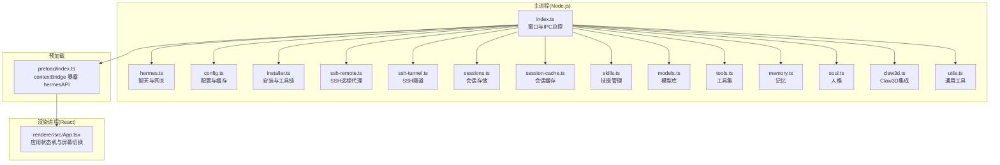
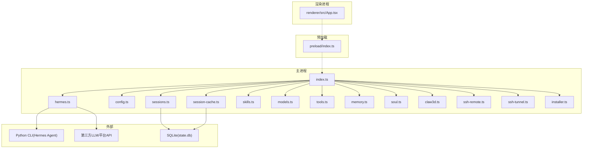
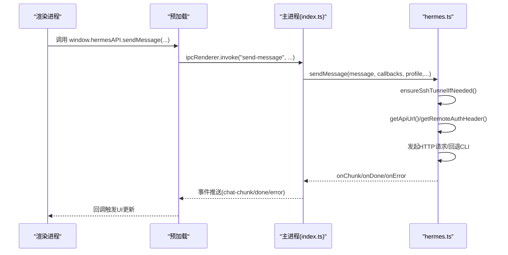
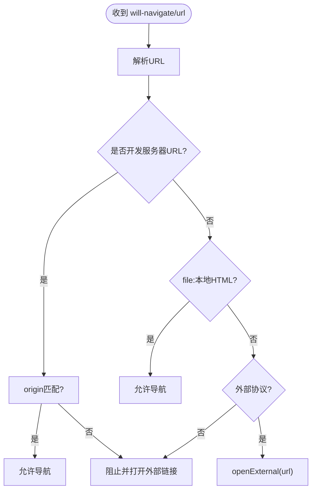
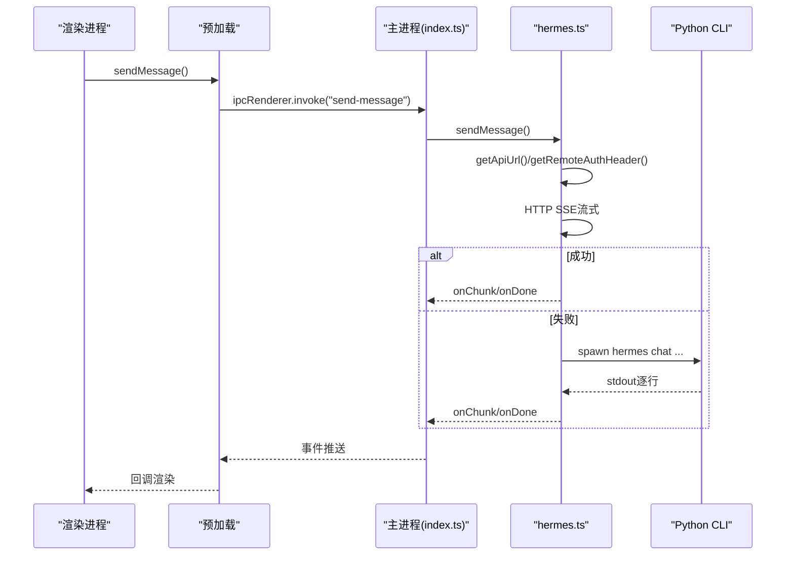
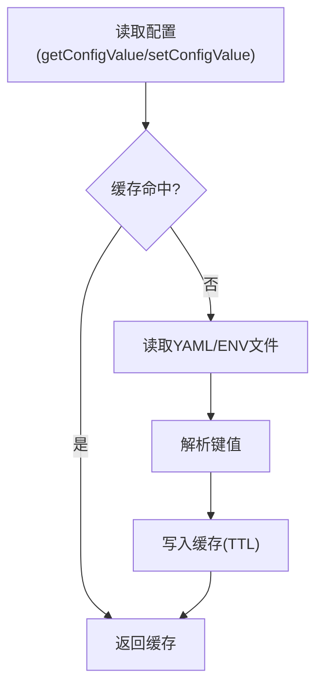
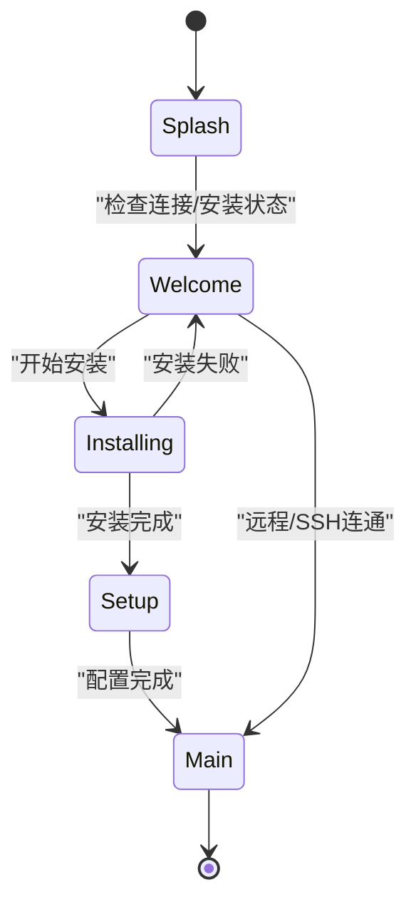
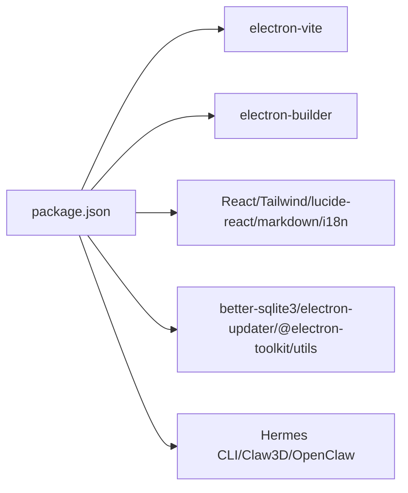

# 架构设计

<cite>
**本文引用的文件**
- [src/main/index.ts](file://src/main/index.ts)
- [src/preload/index.ts](file://src/preload/index.ts)
- [src/main/security.ts](file://src/main/security.ts)
- [src/main/hermes.ts](file://src/main/hermes.ts)
- [src/main/config.ts](file://src/main/config.ts)
- [src/main/installer.ts](file://src/main/installer.ts)
- [src/main/ssh-tunnel.ts](file://src/main/ssh-tunnel.ts)
- [src/main/ssh-remote.ts](file://src/main/ssh-remote.ts)
- [src/main/sessions.ts](file://src/main/sessions.ts)
- [src/main/session-cache.ts](file://src/main/session-cache.ts)
- [src/main/skills.ts](file://src/main/skills.ts)
- [src/main/models.ts](file://src/main/models.ts)
- [src/main/tools.ts](file://src/main/tools.ts)
- [src/main/memory.ts](file://src/main/memory.ts)
- [src/main/soul.ts](file://src/main/soul.ts)
- [src/main/claw3d.ts](file://src/main/claw3d.ts)
- [src/main/sse-parser.ts](file://src/main/sse-parser.ts)
- [src/main/utils.ts](file://src/main/utils.ts)
- [src/renderer/src/App.tsx](file://src/renderer/src/App.tsx)
- [src/shared/i18n/types.ts](file://src/shared/i18n/types.ts)
- [electron.vite.config.ts](file://electron.vite.config.ts)
- [package.json](file://package.json)
- [electron-builder.yml](file://electron-builder.yml)
- [docs/hermes-desktop-architecture.md](file://docs/hermes-desktop-architecture.md)
</cite>

## 目录
1. [简介](#简介)
2. [项目结构](#项目结构)
3. [核心组件](#核心组件)
4. [架构总览](#架构总览)
5. [详细组件分析](#详细组件分析)
6. [依赖分析](#依赖分析)
7. [性能考量](#性能考量)
8. [故障排查指南](#故障排查指南)
9. [结论](#结论)
10. [附录](#附录)

## 简介
本文件为 Hermes Desktop 的架构设计文档，面向开发者与维护者，系统阐述 Electron 应用的整体架构、主进程与渲染进程的职责划分、预加载脚本的安全桥接模型、IPC 通信机制、上下文隔离与安全策略、进程间数据流、应用启动流程、模块化设计原则、错误处理策略与性能优化建议，并辅以多类架构图帮助理解系统内部工作机制。

## 项目结构
Hermes Desktop 采用典型的 Electron 三进程架构：主进程负责系统级能力与后端逻辑，预加载脚本通过 contextBridge 暴露受控 API，渲染进程承载 React UI。项目在 src/main、src/preload、src/renderer/src 与 src/shared 下实现清晰的分层与职责边界。

**图表来源**
- [src/main/index.ts:1-1234](file://src/main/index.ts#L1-L1234)
- [src/preload/index.ts:1-701](file://src/preload/index.ts#L1-L701)
- [src/renderer/src/App.tsx:1-188](file://src/renderer/src/App.tsx#L1-L188)

**章节来源**
- [docs/hermes-desktop-architecture.md:18-89](file://docs/hermes-desktop-architecture.md#L18-L89)
- [electron.vite.config.ts:1-33](file://electron.vite.config.ts#L1-L33)

## 核心组件
- 主进程入口与窗口管理：创建 BrowserWindow、注册 50+ IPC 处理器、窗口事件与安全策略、自动更新与菜单集成。
- 预加载脚本：通过 contextBridge.exposeInMainWorld 暴露 hermesAPI，作为渲染进程与主进程的唯一可信通信通道。
- 渲染进程：React 应用，基于状态机驱动的屏幕切换，承载聊天、会话、配置、技能、工具、记忆、Soul、定时任务、网关、Office(Claw3D)等界面。
- 安全模块：统一的外部链接与导航校验、webview 预加载与沙箱加固、webContents 安全钩子。
- 聊天与网关：HTTP SSE 流式聊天、CLI 回退、远程/SSH 模式适配、健康检查与自动重启。
- 配置与缓存：三层配置读写（desktop.json、.env、config.yaml）、内存缓存与失效策略。
- 工具链与安装：HERMES_HOME 路径解析、Python/uv/Git/Node 环境增强、安装进度与日志、OpenClaw 迁移与备份导入。
- 数据持久化：SQLite(state.db) 会话存储与全文检索、会话缓存与自动标题生成。
- 远程与SSH：SSH 隧道健康检查与自动启动、远程命令执行与文件操作、凭证缓存与鉴权头注入。
- 可视化Office(Claw3D)：Claw3D 仓库与依赖管理、开发服务器与适配器生命周期、端口检测与WS代理。

**章节来源**
- [src/main/index.ts:196-288](file://src/main/index.ts#L196-L288)
- [src/preload/index.ts:1-701](file://src/preload/index.ts#L1-L701)
- [src/renderer/src/App.tsx:1-188](file://src/renderer/src/App.tsx#L1-L188)
- [src/main/security.ts:1-78](file://src/main/security.ts#L1-L78)
- [src/main/hermes.ts:1-200](file://src/main/hermes.ts#L1-L200)
- [src/main/config.ts:1-200](file://src/main/config.ts#L1-L200)
- [src/main/installer.ts:1-200](file://src/main/installer.ts#L1-L200)

## 架构总览
下图展示主进程、预加载与渲染进程的交互关系，以及关键外部依赖（Python CLI、SQLite、第三方API）：

**图表来源**
- [src/main/index.ts:290-800](file://src/main/index.ts#L290-L800)
- [src/preload/index.ts:4-686](file://src/preload/index.ts#L4-L686)
- [src/main/hermes.ts:150-200](file://src/main/hermes.ts#L150-L200)
- [src/main/sessions.ts:1-181](file://src/main/sessions.ts#L1-L181)
- [src/main/session-cache.ts:1-187](file://src/main/session-cache.ts#L1-L187)

**章节来源**
- [docs/hermes-desktop-architecture.md:43-89](file://docs/hermes-desktop-architecture.md#L43-L89)

## 详细组件分析

### 主进程入口与IPC总控
- 窗口创建：禁用 Node 集成、启用上下文隔离与沙箱、webSecurity、禁止不安全内容，设置 will-navigate 与 will-attach-webview 的安全钩子。
- IPC 注册：覆盖安装、版本探测、远程连接测试、配置读写、聊天发送、网关启停、会话与缓存、技能、模型、工具、记忆、Soul、Claw3D、更新、日志、MCP 与备份导入等 50+ 处理器。
- 异常处理：捕获 uncaughtException 与 unhandledRejection，记录错误并避免崩溃传播。
- 安全策略：统一的外部链接与导航白名单、webview 预加载与沙箱参数清理、webContents 安全钩子。

**图表来源**
- [src/main/index.ts:544-640](file://src/main/index.ts#L544-L640)
- [src/main/hermes.ts:64-69](file://src/main/hermes.ts#L64-L69)
- [src/preload/index.ts:158-233](file://src/preload/index.ts#L158-L233)

**章节来源**
- [src/main/index.ts:196-288](file://src/main/index.ts#L196-L288)
- [src/main/index.ts:290-800](file://src/main/index.ts#L290-L800)
- [src/main/security.ts:20-77](file://src/main/security.ts#L20-L77)

### 预加载脚本与上下文隔离
- 通过 contextBridge.exposeInMainWorld 暴露 window.electron 与 window.hermesAPI，前者提供平台与版本信息，后者提供 50+ 方法封装 IPC。
- hermesAPI 方法按功能分组：安装/更新、聊天、配置、会话、Profile、记忆、Soul、工具、技能、模型、Claw3D、定时任务、备份/导入、日志、MCP、菜单事件、更新通知等。
- 预加载脚本对回调注册/注销进行统一管理，确保事件监听生命周期可控。

```mermaid
classDiagram
class PreloadAPI {
+checkInstall()
+verifyInstall()
+startInstall()
+getHermesVersion()
+refreshHermesVersion()
+runHermesDoctor()
+runHermesUpdate()
+getLocale()
+setLocale()
+getEnv()
+setEnv()
+getConfig()
+setConfig()
+getModelConfig()
+setModelConfig()
+isRemoteMode()
+isRemoteOnlyMode()
+getConnectionConfig()
+setConnectionConfig()
+setSshConfig()
+testRemoteConnection()
+testSshConnection()
+isSshTunnelActive()
+startSshTunnel()
+stopSshTunnel()
+sendMessage()
+abortChat()
+onChatChunk()
+onChatDone()
+onChatToolProgress()
+onChatUsage()
+onChatError()
+startGateway()
+stopGateway()
+gatewayStatus()
+getPlatformEnabled()
+setPlatformEnabled()
+listSessions()
+getSessionMessages()
+listProfiles()
+createProfile()
+deleteProfile()
+setActiveProfile()
+readMemory()
+addMemoryEntry()
+updateMemoryEntry()
+removeMemoryEntry()
+writeUserProfile()
+readSoul()
+writeSoul()
+resetSoul()
+getToolsets()
+setToolsetEnabled()
+listInstalledSkills()
+listBundledSkills()
+getSkillContent()
+installSkill()
+uninstallSkill()
+listCachedSessions()
+syncSessionCache()
+updateSessionTitle()
+deleteSession()
+searchSessions()
+getCredentialPool()
+setCredentialPool()
+listModels()
+addModel()
+removeModel()
+updateModel()
+claw3dStatus()
+claw3dSetup()
+onClaw3dSetupProgress()
+claw3dGetPort()
+claw3dSetPort()
+claw3dGetWsUrl()
+claw3dSetWsUrl()
+claw3dStartAll()
+claw3dStopAll()
+claw3dGetLogs()
+claw3dStartDev()
+claw3dStopDev()
+claw3dStartAdapter()
+claw3dStopAdapter()
+checkForUpdates()
+downloadUpdate()
+installUpdate()
+getAppVersion()
+onUpdateAvailable()
+onUpdateDownloadProgress()
+onUpdateDownloaded()
+onMenuNewChat()
+onMenuSearchSessions()
+listCronJobs()
+createCronJob()
+removeCronJob()
+pauseCronJob()
+resumeCronJob()
+triggerCronJob()
+openExternal()
+runHermesBackup()
+runHermesImport()
+runHermesDump()
+discoverMemoryProviders()
+listMcpServers()
+readLogs()
}
```

**图表来源**
- [src/preload/index.ts:4-686](file://src/preload/index.ts#L4-L686)

**章节来源**
- [src/preload/index.ts:1-701](file://src/preload/index.ts#L1-L701)

### 安全模型与上下文隔离
- 外部链接与导航：isAllowedExternalUrl 与 isAllowedAppNavigationUrl 统一校验协议与来源，防止任意跳转。
- webview 安全：isAllowedWebviewUrl 校验 http://localhost/127.0.0.1/[::1] 的本地端口范围，hardenWebviewPreferences 清理 preload 并启用隔离与沙箱。
- webContents 安全钩子：deny 新窗口打开、拦截不受信任的 will-navigate/redirect。
- 预加载隔离：process.contextIsolated 分支暴露 API，否则降级为 window 对象挂载，保证最小攻击面。

**图表来源**
- [src/main/security.ts:25-42](file://src/main/security.ts#L25-L42)
- [src/main/index.ts:250-268](file://src/main/index.ts#L250-L268)
- [src/main/index.ts:270-281](file://src/main/index.ts#L270-L281)

**章节来源**
- [src/main/security.ts:1-78](file://src/main/security.ts#L1-L78)
- [src/main/index.ts:185-281](file://src/main/index.ts#L185-L281)

### 聊天与网关模块
- 模式适配：本地(127.0.0.1:8642)、远程(HTTP)、SSH 隧道(通过本地端口代理)。
- 健康检查：getApiUrl/getRemoteAuthHeader/ensureSshTunnelIfNeeded/isApiServerReady。
- 流式聊天：HTTP SSE 流式解析，onChunk/onDone/onError/onToolProgress/onUsage 回调驱动 UI 更新。
- CLI 回退：当 HTTP 失败时回退到 Python CLI，stdout 逐行解析。
- 会话持久化：聊天完成回调中写入 SQLite，支持全文检索与会话缓存。

**图表来源**
- [src/main/hermes.ts:168-200](file://src/main/hermes.ts#L168-L200)
- [src/main/index.ts:544-640](file://src/main/index.ts#L544-L640)
- [src/preload/index.ts:158-233](file://src/preload/index.ts#L158-L233)

**章节来源**
- [src/main/hermes.ts:1-200](file://src/main/hermes.ts#L1-L200)
- [src/main/sse-parser.ts:1-130](file://src/main/sse-parser.ts#L1-L130)
- [src/main/sessions.ts:1-181](file://src/main/sessions.ts#L1-L181)
- [src/main/session-cache.ts:1-187](file://src/main/session-cache.ts#L1-L187)

### 配置与缓存
- 三层配置：
  - desktop.json：连接模式(local/remote/ssh)、远程URL与API Key、SSH配置。
  - .env：API Key 与环境变量。
  - config.yaml：模型与平台配置。
- 缓存策略：内存 Map + TTL(5秒)，键前缀失效，降低频繁读取成本。
- 写入策略：setEnvValue 通过正则定位/替换/追加，避免破坏注释与格式。

**图表来源**
- [src/main/config.ts:181-192](file://src/main/config.ts#L181-L192)
- [src/main/config.ts:101-132](file://src/main/config.ts#L101-L132)
- [src/main/config.ts:76-99](file://src/main/config.ts#L76-L99)

**章节来源**
- [src/main/config.ts:1-200](file://src/main/config.ts#L1-L200)

### 安装与工具链
- HERMES_HOME 路径解析与 Python/CLI 可执行文件定位。
- PATH 增强：Windows 与 Unix 下收集 Git/Node/Cargo/NVM/ASDF 等目录，提升安装与运行兼容性。
- 安装状态检查：快速存在性检查，深度验证在渲染进程懒加载。
- OpenClaw 迁移与备份导入：迁移进度通过 IPC 推送，保证用户体验。

**章节来源**
- [src/main/installer.ts:20-39](file://src/main/installer.ts#L20-L39)
- [src/main/installer.ts:56-104](file://src/main/installer.ts#L56-L104)
- [src/main/installer.ts:153-200](file://src/main/installer.ts#L153-L200)

### 远程与SSH
- SSH 隧道：自动端口分配、健康检查、异常恢复；与网关状态联动。
- SSH 远程代理：通过 SSH exec 在远端执行 CLI/文件操作，内含 Python 脚本用于远程 SQLite 操作。
- 凭证缓存：首次建立隧道时读取远端 API Key，后续请求注入 Authorization。

**章节来源**
- [src/main/ssh-tunnel.ts:1-219](file://src/main/ssh-tunnel.ts#L1-L219)
- [src/main/ssh-remote.ts:1-1143](file://src/main/ssh-remote.ts#L1-L1143)
- [src/main/hermes.ts:45-62](file://src/main/hermes.ts#L45-L62)

### 数据持久化与会话
- SQLite：state.db 存储会话历史，支持 FTS5 全文检索。
- 会话缓存：本地索引与自动标题生成，O(1) 查询与更新。
- 会话搜索：基于全文检索与缓存聚合结果。

**章节来源**
- [src/main/sessions.ts:1-181](file://src/main/sessions.ts#L1-L181)
- [src/main/session-cache.ts:1-187](file://src/main/session-cache.ts#L1-L187)

### 渲染进程与应用状态机
- 屏幕状态机：Splash → Welcome → Installing → Setup → Main，根据连接模式与安装状态动态切换。
- 首次启动：检查连接模式，远程/SSH 直接尝试连通性，本地检查安装状态与API Key，引导安装或配置。
- 错误处理：安装失败、远程连通失败、验证警告等场景的用户提示与重试路径。

**图表来源**
- [src/renderer/src/App.tsx:16-95](file://src/renderer/src/App.tsx#L16-L95)

**章节来源**
- [src/renderer/src/App.tsx:1-188](file://src/renderer/src/App.tsx#L1-L188)

## 依赖分析
- 构建与打包：electron-vite 提供 Vite 集成，electron-builder 负责跨平台打包与发布。
- 前端生态：React 19、TailwindCSS 4、lucide-react、react-markdown、i18next。
- 后端生态：better-sqlite3、electron-updater、@electron-toolkit/utils。
- 本地依赖：Hermes Agent CLI(Python)、Claw3D Office(NPM)、OpenClaw 设置迁移。

**图表来源**
- [package.json:27-68](file://package.json#L27-L68)
- [electron.vite.config.ts:6-32](file://electron.vite.config.ts#L6-L32)
- [electron-builder.yml:1-58](file://electron-builder.yml#L1-L58)

**章节来源**
- [package.json:1-70](file://package.json#L1-L70)
- [electron.vite.config.ts:1-33](file://electron.vite.config.ts#L1-L33)
- [electron-builder.yml:1-58](file://electron-builder.yml#L1-L58)

## 性能考量
- IPC 事件粒度：将长耗时任务拆分为多个事件推送，如安装进度、Claw3D 设置进度、更新下载进度，避免阻塞主线程。
- 缓存策略：配置读写引入 5 秒 TTL 内存缓存，减少磁盘 IO 与解析开销。
- 渲染启动优化：Splash 最小显示时间保障品牌动画完成，随后再切换屏幕，避免闪烁与无效重绘。
- 聊天流式渲染：SSE 流式到达即渲染，结合节流/防抖优化 UI 更新频率。
- 资源打包：asarUnpack 仅解包必要资源，减小包体与启动时间。

[本节为通用性能指导，无需特定文件引用]

## 故障排查指南
- 聊天 401/鉴权失败：检查 config.yaml 的 provider 与 .env 对应 API Key 是否一致，使用 curl 直接验证。
- Office 连接超时：检查端口占用(netstat)，先发送一次聊天确认网关启动，确认 Claw3D settings.json 的 gateway.url 格式。
- Dev server 退出码异常：Windows DLL 初始化失败，建议直接 node server/index.js --dev。
- SSH 隧道失败：检查主机/端口/用户名/密钥与远端网关状态，确保隧道健康且 API Key 已缓存。

**章节来源**
- [docs/hermes-desktop-architecture.md:345-374](file://docs/hermes-desktop-architecture.md#L345-L374)

## 结论
Hermes Desktop 采用成熟的 Electron 三进程架构，通过严格的上下文隔离与安全策略、细粒度的 IPC 设计、模块化的主进程职责划分、以及完善的错误处理与性能优化，实现了从安装配置到聊天交互、会话管理、技能工具、记忆与Soul编辑、定时任务与网关控制、Claw3D 可视化的一体化体验。该架构在安全性、可维护性与扩展性之间取得良好平衡，适合长期演进与社区协作。

[本节为总结性内容，无需特定文件引用]

## 附录
- 国际化类型：AppLocale 包含 en、es、id、pt-BR、zh-CN。
- 预加载输入输出：hermesAPI 方法签名与回调类型定义见 preload/index.ts。
- 构建与打包：electron-vite 与 electron-builder 配置见对应文件。

**章节来源**
- [src/shared/i18n/types.ts:1-6](file://src/shared/i18n/types.ts#L1-L6)
- [src/preload/index.ts:1-701](file://src/preload/index.ts#L1-L701)
- [electron.vite.config.ts:1-33](file://electron.vite.config.ts#L1-L33)
- [electron-builder.yml:1-58](file://electron-builder.yml#L1-L58)