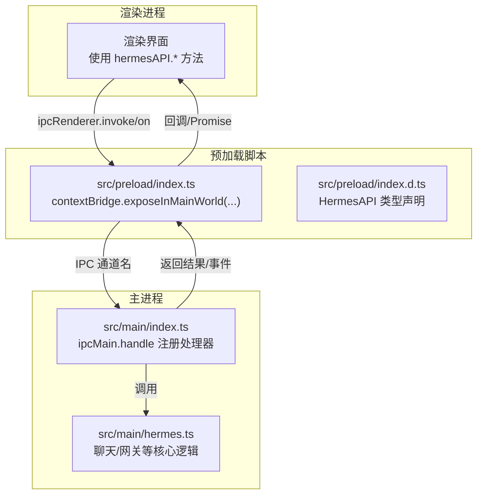
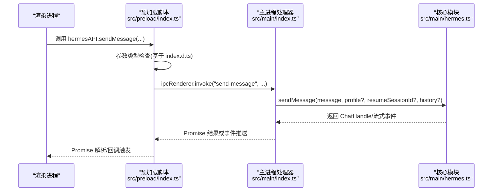
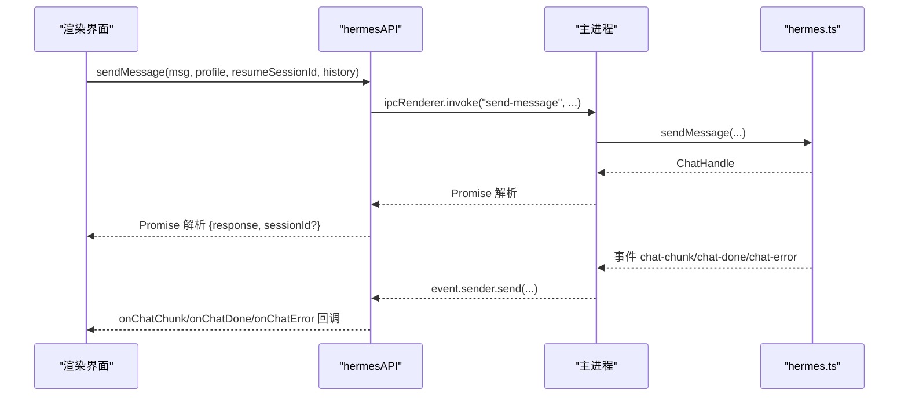
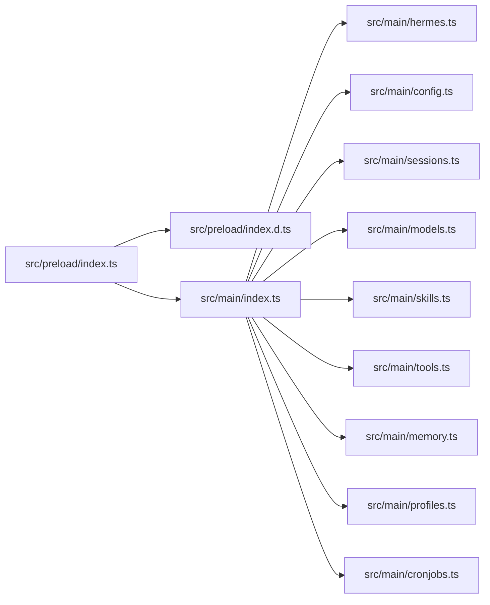

# API接口暴露

<cite>
**本文引用的文件**
- [src/preload/index.ts](file://src/preload/index.ts)
- [src/preload/index.d.ts](file://src/preload/index.d.ts)
- [src/main/index.ts](file://src/main/index.ts)
- [src/main/hermes.ts](file://src/main/hermes.ts)
- [src/shared/i18n/types.ts](file://src/shared/i18n/types.ts)
- [tests/preload-api-surface.test.ts](file://tests/preload-api-surface.test.ts)
- [tests/ipc-handlers.test.ts](file://tests/ipc-handlers.test.ts)
- [src/main/security.ts](file://src/main/security.ts)
</cite>

## 目录
1. [引言](#引言)
2. [项目结构](#项目结构)
3. [核心组件](#核心组件)
4. [架构总览](#架构总览)
5. [详细组件分析](#详细组件分析)
6. [依赖关系分析](#依赖关系分析)
7. [性能考量](#性能考量)
8. [故障排查指南](#故障排查指南)
9. [结论](#结论)
10. [附录](#附录)

## 引言
本文件系统性阐述 Hermes Desktop 的 API 接口暴露机制，重点围绕以下主题：
- contextBridge 的安全隔离原理与 window.hermesAPI 对象的构建过程
- hermesAPI 类型定义、参数校验与返回值处理机制
- 接口命名规范、版本兼容性与向后兼容策略
- API 扩展最佳实践、安全考虑与性能优化建议
- 具体调用示例与错误处理模式

目标是帮助开发者在不直接接触 Electron 主进程的前提下，通过渲染进程安全地调用桌面应用能力，并确保扩展与维护过程中的稳定性与安全性。

## 项目结构
Hermes Desktop 的 API 暴露采用“预加载脚本 + IPC + 主进程处理器”的经典架构：
- 预加载脚本负责将受控的 API 暴露到渲染进程上下文
- 渲染进程通过 ipcRenderer 调用预加载脚本封装的方法
- 主进程在 index.ts 中集中注册 ipcMain.handle 处理器，实现具体业务逻辑
- hermes.ts 等模块提供底层能力（如聊天、网关、SSH 等）

图表来源
- [src/preload/index.ts:688-700](file://src/preload/index.ts#L688-L700)
- [src/preload/index.d.ts:29-471](file://src/preload/index.d.ts#L29-L471)
- [src/main/index.ts:290-800](file://src/main/index.ts#L290-L800)
- [src/main/hermes.ts:168-434](file://src/main/hermes.ts#L168-L434)

章节来源
- [src/preload/index.ts:1-701](file://src/preload/index.ts#L1-L701)
- [src/preload/index.d.ts:1-479](file://src/preload/index.d.ts#L1-L479)
- [src/main/index.ts:290-800](file://src/main/index.ts#L290-L800)
- [src/main/hermes.ts:168-434](file://src/main/hermes.ts#L168-L434)

## 核心组件
- 预加载脚本中的 hermesAPI 对象：以方法集合形式暴露给渲染进程，所有方法均通过 ipcRenderer.invoke 或 ipcRenderer.on 进行 IPC 通信
- 主进程中的 ipcMain.handle 处理器：按通道名分发到具体模块（如 hermes.ts、config.ts、sessions.ts 等）
- 类型声明 index.d.ts：严格约束 hermesAPI 的方法签名、参数与返回值，保证类型安全
- 安全加固：主窗口与 webview 的上下文隔离、沙箱、导航限制等

章节来源
- [src/preload/index.ts:15-686](file://src/preload/index.ts#L15-L686)
- [src/preload/index.d.ts:29-471](file://src/preload/index.d.ts#L29-L471)
- [src/main/index.ts:290-800](file://src/main/index.ts#L290-L800)
- [src/main/security.ts:46-77](file://src/main/security.ts#L46-L77)

## 架构总览
下图展示从渲染进程调用 hermesAPI 到主进程处理并返回结果的完整流程：

图表来源
- [src/preload/index.ts:159-171](file://src/preload/index.ts#L159-L171)
- [src/main/index.ts:620-640](file://src/main/index.ts#L620-L640)
- [src/main/hermes.ts:654-679](file://src/main/hermes.ts#L654-L679)

## 详细组件分析

### 1) contextBridge 安全隔离与 window.hermesAPI 构建
- 预加载脚本通过 contextBridge.exposeInMainWorld 将两个对象暴露到渲染进程：
  - window.electron：包含进程平台与版本信息
  - window.hermesAPI：包含全部桌面功能 API
- 在进程上下文隔离开启时，使用 exposeInMainWorld；否则回退到直接挂载到 window
- hermesAPI 的每个方法都遵循统一的 IPC 模式：invoke 发起请求，on 订阅事件，removeListener 取消订阅

章节来源
- [src/preload/index.ts:688-700](file://src/preload/index.ts#L688-L700)
- [src/preload/index.ts:15-686](file://src/preload/index.ts#L15-L686)

### 2) hermesAPI 类型定义与参数校验
- 类型声明位于 src/preload/index.d.ts 的 HermesAPI 接口，覆盖安装、本地/远程连接、会话、模型、技能、工具、内存、Soul、更新、日志、MCP、SSH 等模块
- 预加载脚本中的实际实现与类型声明一一对应，测试用例确保两者一致性
- 参数校验策略：
  - 必填参数：在类型层面明确；运行时通过 ipcRenderer.invoke 的序列化传递
  - 可选参数：通过可选属性标记；调用方需自行处理 undefined 场景
  - 回调类方法：onXxx 返回取消函数，避免内存泄漏
  - 返回值：统一 Promise 化；部分方法返回复杂对象，类型声明中给出精确结构

章节来源
- [src/preload/index.d.ts:29-471](file://src/preload/index.d.ts#L29-L471)
- [tests/preload-api-surface.test.ts:45-63](file://tests/preload-api-surface.test.ts#L45-L63)

### 3) IPC 通道命名规范与一致性
- 通道名采用短横线分隔的 kebab-case，便于识别与维护
- 测试用例确保：
  - 预加载脚本中的 ipcRenderer.invoke 调用与主进程 ipcMain.handle 注册一一对应
  - 新增功能同时在两端注册，保持双向一致性
- 通道名示例（节选）：check-install、get-env、set-config、send-message、start-gateway、run-hermes-backup、read-logs 等

章节来源
- [tests/ipc-handlers.test.ts:38-56](file://tests/ipc-handlers.test.ts#L38-L56)
- [tests/preload-api-surface.test.ts:193-212](file://tests/preload-api-surface.test.ts#L193-L212)

### 4) API 分类与典型流程

#### 4.1 安装与引擎管理
- 方法族：checkInstall、verifyInstall、startInstall、onInstallProgress、getHermesVersion、refreshHermesVersion、runHermesDoctor、runHermesUpdate
- 流程要点：
  - 安装进度通过 onInstallProgress 回调推送，调用方需在不再需要时调用返回的取消函数
  - 版本刷新会清理缓存并重新查询
  - 远程模式下（SSH/远程）会走 SSH 路径

章节来源
- [src/preload/index.ts:17-62](file://src/preload/index.ts#L17-L62)
- [src/main/index.ts:290-351](file://src/main/index.ts#L290-L351)

#### 4.2 会话与聊天
- 方法族：sendMessage、abortChat、onChatChunk、onChatDone、onChatToolProgress、onChatUsage、onChatError
- 流程要点：
  - sendMessage 支持历史消息拼接、会话续聊、流式返回
  - 使用 AbortController 控制取消；onChatUsage 提供 token 统计
  - 远程模式下直接走 HTTP API；本地优先尝试 API Server，失败回退 CLI

图表来源
- [src/preload/index.ts:159-228](file://src/preload/index.ts#L159-L228)
- [src/main/index.ts:620-640](file://src/main/index.ts#L620-L640)
- [src/main/hermes.ts:168-434](file://src/main/hermes.ts#L168-L434)

#### 4.3 连接与 SSH
- 方法族：isRemoteMode、isRemoteOnlyMode、getConnectionConfig、setConnectionConfig、setSshConfig、testRemoteConnection、testSshConnection、isSshTunnelActive、startSshTunnel、stopSshTunnel
- 流程要点：
  - 远程模式下优先使用远程 URL；SSH 模式下通过隧道转发
  - SSH 隧道健康检查与自动重启策略由 hermes.ts 实现

章节来源
- [src/preload/index.ts:104-156](file://src/preload/index.ts#L104-L156)
- [src/main/index.ts:473-500](file://src/main/index.ts#L473-L500)
- [src/main/hermes.ts:22-69](file://src/main/hermes.ts#L22-L69)

#### 4.4 配置与环境
- 方法族：getEnv、setEnv、getConfig、setConfig、getHermesHome、getModelConfig、setModelConfig、getPlatformEnabled、setPlatformEnabled
- 流程要点：
  - SSH 模式下通过 ssh-* 前缀处理器同步远端配置
  - 关键环境变量变更会触发网关重启以生效

章节来源
- [src/preload/index.ts:75-101](file://src/preload/index.ts#L75-L101)
- [src/main/index.ts:372-471](file://src/main/index.ts#L372-L471)

#### 4.5 会话缓存与搜索
- 方法族：listSessions、getSessionMessages、listCachedSessions、syncSessionCache、updateSessionTitle、deleteSession、searchSessions
- 流程要点：
  - 缓存与数据库双写，支持增量同步
  - 搜索返回片段用于快速定位

章节来源
- [src/preload/index.ts:246-271](file://src/preload/index.ts#L246-L271)
- [src/preload/index.ts:381-426](file://src/preload/index.ts#L381-L426)

#### 4.6 技能、工具与模型
- 方法族：listInstalledSkills、listBundledSkills、getSkillContent、installSkill、uninstallSkill、getToolsets、setToolsetEnabled、listModels、addModel、removeModel、updateModel
- 流程要点：
  - 技能内容读取与安装卸载；工具集开关；模型增删改查

章节来源
- [src/preload/index.ts:353-378](file://src/preload/index.ts#L353-L378)
- [src/preload/index.ts:439-468](file://src/preload/index.ts#L439-L468)

#### 4.7 更新与日志
- 方法族：checkForUpdates、downloadUpdate、installUpdate、getAppVersion、onUpdateAvailable、onUpdateDownloadProgress、onUpdateDownloaded、readLogs
- 流程要点：
  - 更新事件通过 onXxx 回调推送；日志读取支持指定文件与行数

章节来源
- [src/preload/index.ts:534-563](file://src/preload/index.ts#L534-L563)
- [src/preload/index.ts:681-685](file://src/preload/index.ts#L681-L685)

#### 4.8 其他能力
- Shell：openExternal
- 备份/导入：runHermesBackup、runHermesImport
- 调试：runHermesDump
- MCP 与内存提供者：listMcpServers、discoverMemoryProviders

章节来源
- [src/preload/index.ts:642-658](file://src/preload/index.ts#L642-L658)
- [src/preload/index.ts:661-671](file://src/preload/index.ts#L661-L671)
- [src/preload/index.ts:674-678](file://src/preload/index.ts#L674-L678)

### 5) 错误处理模式
- Promise 拒绝：预加载脚本对 ipcRenderer.invoke 的错误进行捕获与上抛
- 事件驱动错误：onChatError、onUpdateDownloaded 等事件回调中传递错误字符串
- 远程模式错误：HTTP 请求失败、超时、非 200 状态码都会转换为可读错误信息
- 取消与资源释放：onXxx 返回的取消函数必须在组件卸载时调用，避免内存泄漏

章节来源
- [src/preload/index.ts:175-228](file://src/preload/index.ts#L175-L228)
- [src/main/hermes.ts:349-424](file://src/main/hermes.ts#L349-L424)

## 依赖关系分析
- 预加载脚本与主进程处理器通过 IPC 通道名强绑定，测试用例确保一致性
- hermes.ts 作为核心模块被多个 API 调用（聊天、网关、SSH 等），耦合度较高但职责清晰
- 类型声明 index.d.ts 与预加载实现保持双向一致，避免运行时类型不匹配

图表来源
- [src/preload/index.ts:15-686](file://src/preload/index.ts#L15-L686)
- [src/preload/index.d.ts:29-471](file://src/preload/index.d.ts#L29-L471)
- [src/main/index.ts:13-172](file://src/main/index.ts#L13-L172)

章节来源
- [tests/ipc-handlers.test.ts:38-56](file://tests/ipc-handlers.test.ts#L38-L56)
- [tests/preload-api-surface.test.ts:45-63](file://tests/preload-api-surface.test.ts#L45-L63)

## 性能考量
- 本地优先 HTTP API：通过 isApiServerReady 缓存可用状态，减少不必要的 CLI 启动
- 流式响应：聊天接口采用 SSE 流式传输，降低首字延迟
- 事件去抖与缓冲：对高频事件（如工具进度、用量统计）进行合并与节流
- 远程模式直连：避免额外进程开销，提升交互流畅度
- SSH 隧道健康检查：定期轮询 API Server 可用性，及时恢复服务

章节来源
- [src/main/hermes.ts:652-704](file://src/main/hermes.ts#L652-L704)
- [src/main/hermes.ts:168-434](file://src/main/hermes.ts#L168-L434)

## 故障排查指南
- IPC 不一致：确认预加载脚本与主进程处理器的通道名完全一致
  - 参考测试用例：IPC Handler ↔ Preload Consistency
- 类型不匹配：确保 index.d.ts 与预加载实现方法名与签名一致
  - 参考测试用例：Preload API Surface
- 远程连接问题：检查 isRemoteMode/isSshTunnelActive，必要时手动启动隧道
- 聊天无输出：确认 API Server 可用；若不可用，等待自动回退 CLI；检查 onChatError 事件
- 网关异常：使用 gatewayStatus 检查状态，必要时重启 startGateway/stopGateway
- 日志定位：使用 readLogs 获取指定日志文件内容，辅助诊断

章节来源
- [tests/ipc-handlers.test.ts:38-56](file://tests/ipc-handlers.test.ts#L38-L56)
- [tests/preload-api-surface.test.ts:45-63](file://tests/preload-api-surface.test.ts#L45-L63)
- [src/main/index.ts:649-665](file://src/main/index.ts#L649-L665)
- [src/preload/index.ts:681-685](file://src/preload/index.ts#L681-L685)

## 结论
Hermes Desktop 的 API 暴露机制通过严格的类型约束、统一的 IPC 通道命名与完善的测试保障，实现了安全、稳定且易于扩展的渲染进程 API 表面。借助 contextBridge 的上下文隔离与主进程处理器的集中治理，既满足了功能需求，又兼顾了安全与性能。后续扩展应遵循现有规范，确保类型声明、预加载实现与主进程处理器三者的一致性。

## 附录

### A. 接口命名规范
- 通道名：kebab-case，仅小写字母与数字，短横线分隔
- 方法名：camelCase，语义明确，与功能模块对应
- 类型名：PascalCase，接口与复杂对象结构清晰

章节来源
- [tests/preload-api-surface.test.ts:193-212](file://tests/preload-api-surface.test.ts#L193-L212)
- [src/preload/index.d.ts:29-471](file://src/preload/index.d.ts#L29-L471)

### B. 版本兼容性与向后兼容策略
- 保留历史通道名与方法名，确保旧版渲染进程无需修改即可继续工作
- 新增功能通过独立通道与方法提供，不影响既有行为
- 类型声明与实现保持双向一致，避免破坏性变更

章节来源
- [tests/ipc-handlers.test.ts:83-117](file://tests/ipc-handlers.test.ts#L83-L117)
- [tests/preload-api-surface.test.ts:98-189](file://tests/preload-api-surface.test.ts#L98-L189)

### C. API 扩展最佳实践
- 新增方法：先在 index.d.ts 添加类型声明，再在预加载脚本实现，并在主进程注册对应处理器
- 事件监听：onXxx 方法返回取消函数，务必在组件卸载时调用
- 参数校验：在预加载层进行基础校验，主进程层进行业务校验
- 错误处理：统一 Promise.catch 与事件回调，提供用户可读的错误信息
- 性能优化：优先使用 HTTP API，避免频繁 CLI 启动；合理使用缓存与轮询

章节来源
- [src/preload/index.d.ts:29-471](file://src/preload/index.d.ts#L29-L471)
- [src/preload/index.ts:15-686](file://src/preload/index.ts#L15-L686)
- [src/main/index.ts:290-800](file://src/main/index.ts#L290-L800)

### D. 安全考虑
- 上下文隔离：启用 contextIsolation，禁用 nodeIntegration，使用沙箱
- 导航与 webview：限制 top-level 导航与 webview 附加，移除特权偏好
- 外部链接：仅允许白名单 URL，防止恶意跳转
- SSH 模式：通过隧道转发与密钥注入，避免明文传输

章节来源
- [src/main/security.ts:46-77](file://src/main/security.ts#L46-L77)
- [src/main/index.ts:196-220](file://src/main/index.ts#L196-L220)